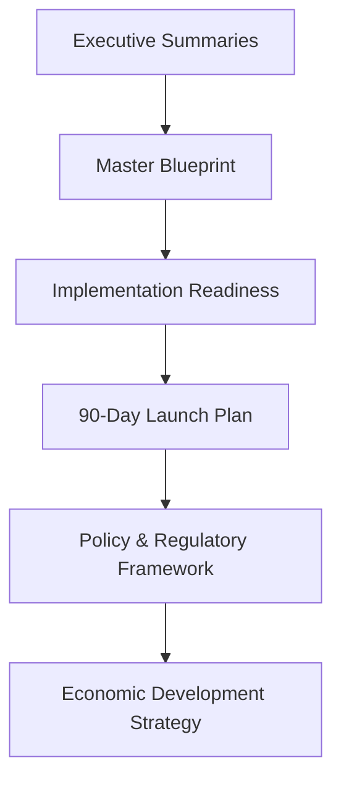
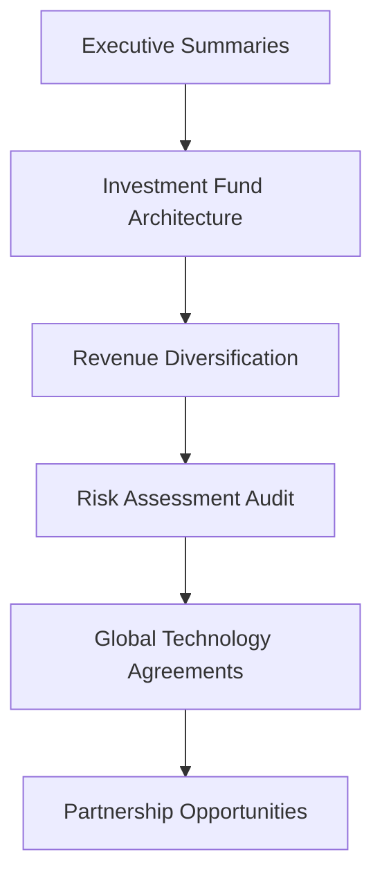
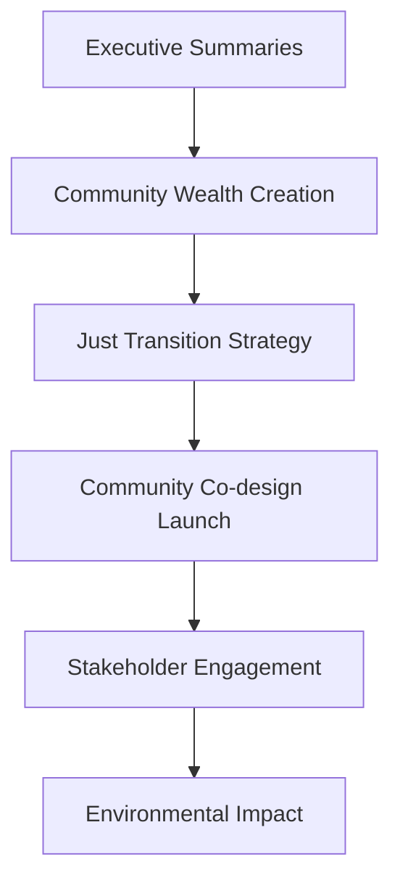
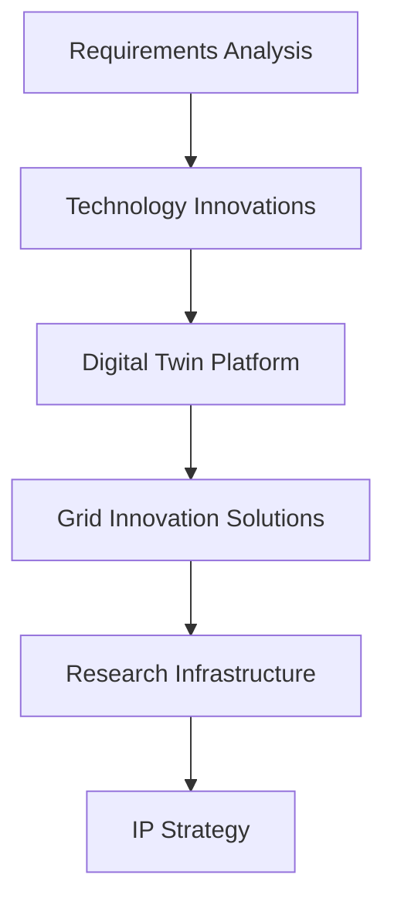
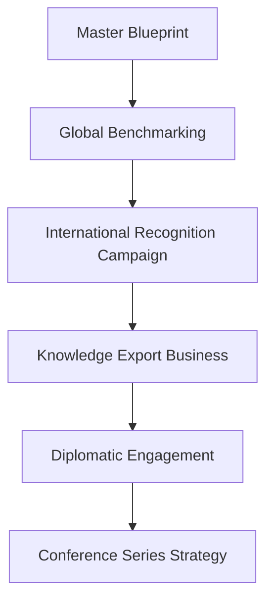

# 🗺️ Gippsland Renewable Energy Transformation Strategy Navigation Guide
*Strategic Document Hierarchy and Reading Sequence*

---

## 🎯 Executive Quick Start

**For Busy Stakeholders**: Start with these 3 documents in order:
1. 📋 **[Executive Summaries](executive-summaries.md)** - Complete overview of all strategies
2. 🏗️ **[Master Blueprint](master-blueprint.md)** - Comprehensive transformation framework  
3. 💼 **[Implementation Readiness](executive/implementation-readiness.md)** - Action-ready next steps

---

## 📊 Strategic Document Hierarchy

### 🌟 **TIER 1: Foundation & Vision** *(Read First)*

#### **1.1 Strategic Foundation** 
- 📋 **[Executive Summaries](executive-summaries.md)** - *Start here for complete overview*
- 🏗️ **[Master Blueprint](master-blueprint.md)** - *Comprehensive transformation framework*
- 📊 **[Master Blueprint Visual Summary](master-blueprint-visual-summary.md)** - *Visual overview with charts*

#### **1.2 Core Strategy Framework**
- 🎯 **[Master Strategy (16)](strategy/16-master-strategy.md)** - *Primary strategic document*
- 💰 **[Economic Development Strategy (17)](strategy/17-economic-development.md)** - *Economic transformation plan*

#### **1.3 Research Foundation**
- 📊 **[Requirements Analysis (01)](research/01-requirements-analysis.md)** - *Strategic requirements framework*
- 🌐 **[Global Benchmarking (08)](research/08-global-benchmarking.md)** - *International best practices*

---

### ⚡ **TIER 2: Implementation Framework** *(Read Second)*

#### **2.1 Implementation Strategy**
- ⚡ **[90-Day Launch Plan](implementation/90-day-launch-plan.md)** - *Immediate action framework*
- 🏛️ **[Regulatory Acceleration Framework](implementation/regulatory-acceleration-framework.md)** - *Policy implementation*
- 💼 **[Implementation Readiness](executive/implementation-readiness.md)** - *Readiness assessment*

#### **2.2 Organizational Framework**
- 🏢 **[GREA Organisational Architecture](operations/grea-organizational-architecture.md)** - *Governance structure*
- 📋 **[Programme Management Office](operations/program-management-office.md)** - *Management framework*

#### **2.3 Stakeholder Engagement**
- 🤝 **[Stakeholder Engagement Strategy (20)](strategy/20-stakeholder-engagement.md)** - *Engagement framework*
- 🏘️ **[Community Co-design Launch](implementation/community-codesign-launch.md)** - *Community participation*

---

### 💰 **TIER 3: Financial Architecture** *(Critical for Funding)*

#### **3.1 Investment Framework**
- 💰 **[Investment Fund Architecture](finance/investment-fund-architecture.md)** - *Financial structure*
- 📈 **[Revenue Diversification Strategy](finance/revenue-diversification-strategy.md)** - *Revenue streams*
- 💵 **[Investment Attraction Package](implementation/investment-attraction-package.md)** - *Investor engagement*

#### **3.2 Community Wealth**
- 🏘️ **[Community Wealth Creation](finance/community-wealth-creation.md)** - *Local prosperity model*
- 🤝 **[Community Investment Vehicles](partnerships/community-investment-vehicles.md)** - *Community ownership*

#### **3.3 Risk Management**
- 🛡️ **[Risk Insurance Portfolio](finance/risk-insurance-portfolio.md)** - *Risk mitigation*
- ⚠️ **[Risk Assessment Audit](risk-assessment-audit.md)** - *Comprehensive risk analysis*

---

### 🌍 **TIER 4: Global Positioning** *(International Engagement)*

#### **4.1 Global Recognition**
- 🌍 **[International Recognition Campaign](global/international-recognition-campaign.md)** - *Global positioning*
- 🎓 **[Knowledge Export Business](global/knowledge-export-business.md)** - *Intellectual property commercialisation*

#### **4.2 International Finance**
- 💰 **[International Finance Mobilisation](finance/international-finance-mobilization.md)** - *Global capital access*
- 🤝 **[Global Technology Agreements](partnerships/global-technology-agreements.md)** - *Technology partnerships*

#### **4.3 Diplomatic Engagement**
- 🏛️ **[Diplomatic Energy Engagement](global/diplomatic-energy-engagement.md)** - *Government relations*
- 🏆 **[Conference Series Strategy](global/conference-series-strategy.md)** - *International events*

---

### 🔬 **TIER 5: Technology & Innovation** *(Technical Implementation)*

#### **5.1 Technology Strategy**
- 💻 **[Digital Twin Platform](technology/digital-twin-platform.md)** - *Digital infrastructure*
- ⚡ **[Grid Innovation Solutions](technology/grid-innovation-solutions.md)** - *Smart grid technology*
- 🔋 **[Hydrogen Economy Activation](technology/hydrogen-economy-activation.md)** - *Hydrogen development*

#### **5.2 Innovation Framework**
- 💡 **[Innovation Hub Strategy (19)](strategy/19-innovation-hub.md)** - *Innovation ecosystem*
- 🔬 **[Research Infrastructure](technology/research-infrastructure.md)** - *R&D facilities*
- 🏢 **[Innovation Hub Operations](operations/innovation-hub-operations.md)** - *Hub operations*

#### **5.3 Intellectual Property**
- 📄 **[IP Strategy & Patent Portfolio](technology/ip-strategy-patent-portfolio.md)** - *Intellectual property*
- 📚 **[Technology Partnership MOUs](implementation/technology-partnership-mous.md)** - *Partnership agreements*

---

### 🏭 **TIER 6: Operations & Delivery** *(Implementation Details)*

#### **6.1 Just Transition**
- ⚖️ **[Just Transition Strategy (18)](strategy/18-just-transition.md)** - *Worker transition framework*
- 👥 **[Skills Activation Programme](implementation/skills-activation-program.md)** - *Workforce development*
- 🤝 **[Just Transition Delivery](operations/just-transition-delivery.md)** - *Transition operations*

#### **6.2 Supply Chain**
- 🏭 **[Supply Chain Agreements](partnerships/supply-chain-agreements.md)** - *Manufacturing partnerships*
- 🔗 **[Supply Chain Coordination](operations/supply-chain-coordination.md)** - *Logistics management*

#### **6.3 Environmental Framework**
- 🌱 **[Environmental Impact Strategy (21)](strategy/21-environmental-impact.md)** - *Environmental enhancement*
- 🌿 **[Environmental Monitoring](operations/environmental-monitoring.md)** - *Monitoring systems*

---

### 📢 **TIER 7: Communication & Brand** *(Public Engagement)*

#### **7.1 Brand Strategy**
- 🎯 **[Brand Narrative Strategy (23)](strategy/23-brand-narrative.md)** - *Brand positioning*
- 🎨 **[Brand Toolkit (23)](strategy/23-brand-toolkit.md)** - *Brand implementation*

#### **7.2 Policy Communication**
- 🏛️ **[Policy & Regulatory Framework (22)](strategy/22-policy-regulatory.md)** - *Policy strategy*
- 📅 **[Policy Regulatory Timeline](strategy/22-policy-regulatory-timeline.md)** - *Implementation timeline*
- 🎤 **[Political Alignment Strategy](implementation/political-alignment-strategy.md)** - *Political engagement*

---

## 🎯 Reading Paths by Audience

### 👔 **For Government Ministers & Senior Officials**

**Recommended Sequence:**
1. Executive Summaries → 2. Master Blueprint → 3. Implementation Readiness → 4. 90-Day Launch Plan → 5. Policy Framework → 6. Economic Development

### 💼 **For Corporate Investors & Partners**

**Recommended Sequence:**
1. Executive Summaries → 2. Investment Fund Architecture → 3. Revenue Diversification → 4. Risk Assessment → 5. Global Partnerships → 6. Technology Agreements

### 🏘️ **For Community Leaders & Representatives**

**Recommended Sequence:**
1. Executive Summaries → 2. Community Wealth Creation → 3. Just Transition → 4. Community Co-design → 5. Stakeholder Engagement → 6. Environmental Impact

### 🔬 **For Technical Teams & Researchers**

**Recommended Sequence:**
1. Requirements Analysis → 2. Technology Innovations → 3. Digital Twin Platform → 4. Grid Innovation → 5. Research Infrastructure → 6. IP Strategy

### 🌍 **For International Partners & Diplomats**

**Recommended Sequence:**
1. Master Blueprint → 2. Global Benchmarking → 3. International Recognition → 4. Knowledge Export → 5. Diplomatic Engagement → 6. Conference Strategy

---

## 📚 Document Categories & Relationships

### **Foundation Documents** (Must Read First)
- Executive Summaries
- Master Blueprint  
- Master Strategy (16)
- Requirements Analysis (01)

### **Strategic Framework** (Core Strategy)
- Economic Development (17)
- Stakeholder Engagement (20)
- Innovation Hub (19)
- Just Transition (18)
- Environmental Impact (21)
- Brand Strategy (23)
- Policy Framework (22)

### **Implementation Plans** (Action-Oriented)
- 90-Day Launch Plan
- Implementation Readiness
- Regulatory Acceleration Framework
- Community Co-design Launch
- Investment Attraction Package

### **Financial Architecture** (Investment & Revenue)
- Investment Fund Architecture
- Revenue Diversification Strategy
- Community Wealth Creation
- Risk Insurance Portfolio
- International Finance Mobilisation

### **Operational Framework** (Management & Delivery)
- GREA Organisational Architecture
- Programme Management Office
- Just Transition Delivery
- Supply Chain Coordination
- Environmental Monitoring

### **Technology & Innovation** (Technical Solutions)
- Digital Twin Platform
- Grid Innovation Solutions
- Hydrogen Economy Activation
- Research Infrastructure
- IP Strategy & Patents

### **Partnerships & Global** (External Relationships)
- Global Technology Agreements
- International Recognition Campaign
- Knowledge Export Business
- Partnership Frameworks
- Diplomatic Engagement

---

## 🔗 Cross-Reference Matrix

| **Primary Document** | **Essential Related Documents** | **Supporting Documents** |
|---------------------|--------------------------------|-------------------------|
| **Master Blueprint** | Executive Summaries, Master Strategy (16) | Implementation Readiness, Economic Development (17) |
| **90-Day Launch Plan** | Implementation Readiness, Regulatory Framework | Political Alignment, Community Co-design |
| **Investment Fund** | Revenue Diversification, Risk Portfolio | Community Wealth, International Finance |
| **Just Transition (18)** | Skills Activation, Community Co-design | Workforce Analysis (07), Stakeholder Engagement (20) |
| **Innovation Hub (19)** | Research Infrastructure, IP Strategy | Technology Partnerships, Digital Twin |
| **Global Recognition** | Knowledge Export, Conference Strategy | International Finance, Diplomatic Engagement |

---

## ⏱️ Estimated Reading Times

### **Quick Overview** (30 minutes)
- Executive Summaries (10 min)
- Master Blueprint Visual Summary (10 min)
- Implementation Readiness (10 min)

### **Strategic Understanding** (2 hours)
- Master Blueprint (30 min)
- Master Strategy (16) (30 min)
- Economic Development (17) (30 min)
- Investment Fund Architecture (30 min)

### **Complete Comprehension** (8 hours)
- Full document suite with detailed analysis
- Cross-referencing and relationship mapping
- Implementation planning integration

### **Expert Mastery** (16+ hours)
- Complete document mastery
- Advanced implementation planning
- Partnership development strategies
- Global positioning integration

---

## 🎯 Usage Instructions

### **For New Readers**
1. **Start with Executive Summaries** for complete overview
2. **Read Master Blueprint** for transformation framework
3. **Choose your audience path** based on role and interests
4. **Use cross-references** to explore related topics

### **For Deep Dive Analysis**
1. **Follow Tier 1-7 sequence** for comprehensive understanding
2. **Use document relationships** to build complete picture
3. **Reference cross-reference matrix** for connections
4. **Apply audience-specific reading paths** for focused learning

### **For Implementation Planning**
1. **Begin with Tier 1 & 2** for strategic foundation
2. **Focus on relevant operational tiers** (3-7) based on role
3. **Use estimated reading times** for planning
4. **Cross-reference frequently** for integration

---

## 📱 Quick Access Links

### **Start Here** (New Users)
- 📋 [Executive Summaries](executive-summaries.md)
- 🏗️ [Master Blueprint](master-blueprint.md)
- 💼 [Implementation Readiness](executive/implementation-readiness.md)

### **Strategic Core** (Leadership)
- 🎯 [Master Strategy](strategy/16-master-strategy.md)
- 💰 [Economic Development](strategy/17-economic-development.md)
- ⚡ [90-Day Launch Plan](implementation/90-day-launch-plan.md)

### **Financial Framework** (Investors)
- 💰 [Investment Fund Architecture](finance/investment-fund-architecture.md)
- 📈 [Revenue Diversification](finance/revenue-diversification-strategy.md)
- 🏘️ [Community Wealth Creation](finance/community-wealth-creation.md)

### **Global Positioning** (International)
- 🌍 [International Recognition](global/international-recognition-campaign.md)
- 🎓 [Knowledge Export Business](global/knowledge-export-business.md)
- 🏛️ [Diplomatic Engagement](global/diplomatic-energy-engagement.md)

---

*This navigation guide is designed to help stakeholders efficiently access the most relevant strategic documents based on their role, interests, and available time. The hierarchical structure ensures logical progression from high-level strategy through detailed implementation plans.*

**Last Updated:** 12 September 2025  
**Document Version:** 1.0  
**Navigation System Status:** ✅ Complete and Ready for Use