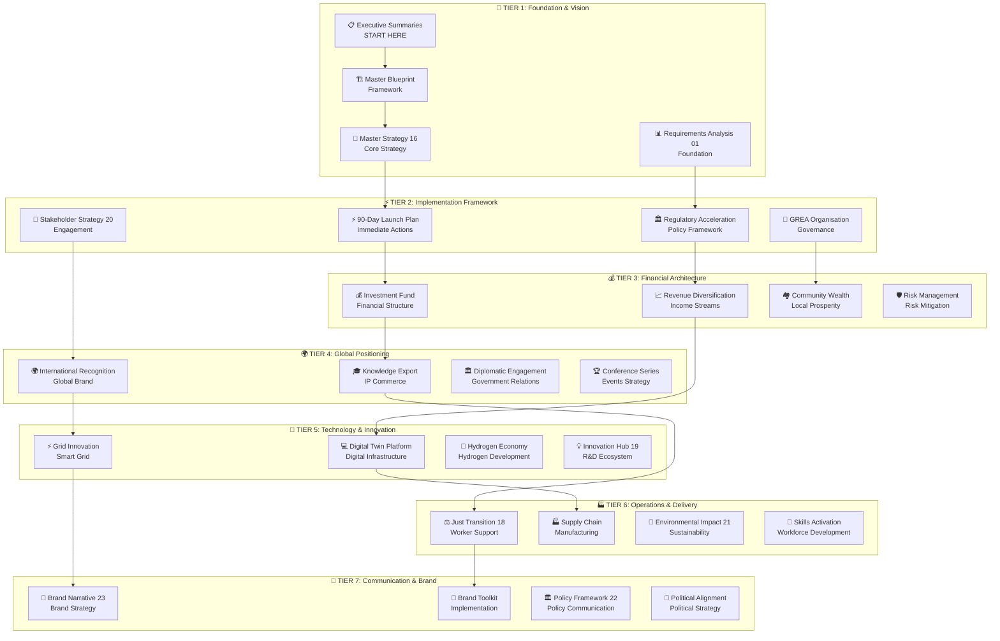
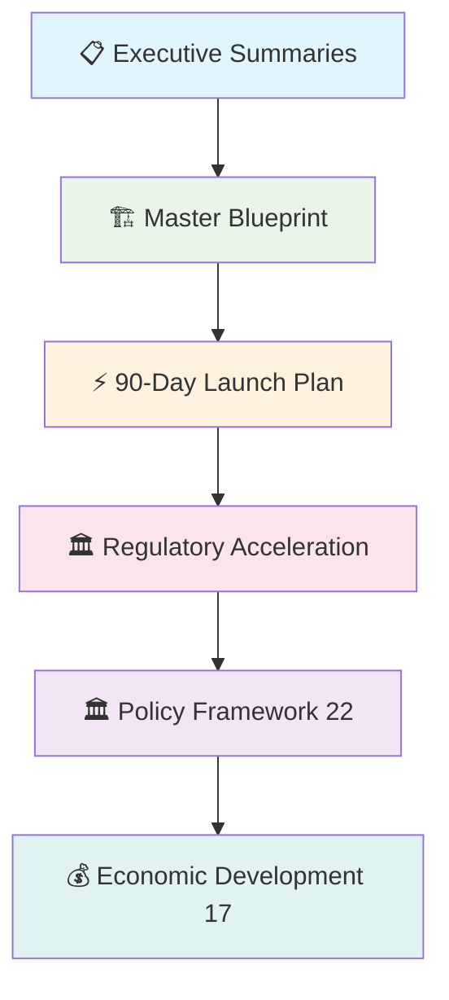
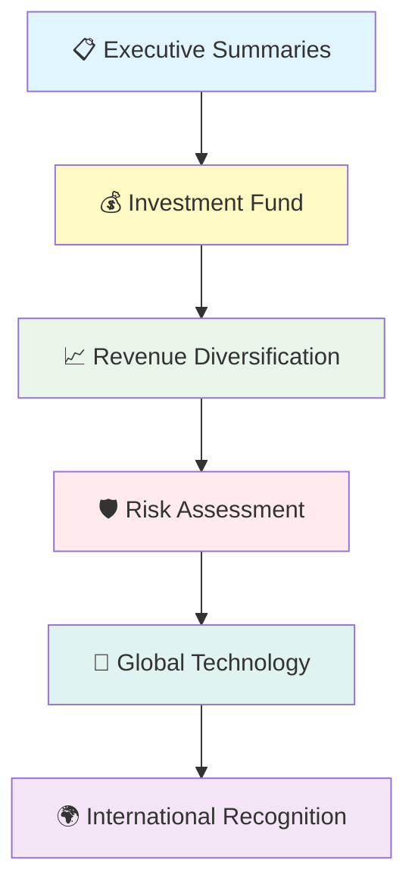
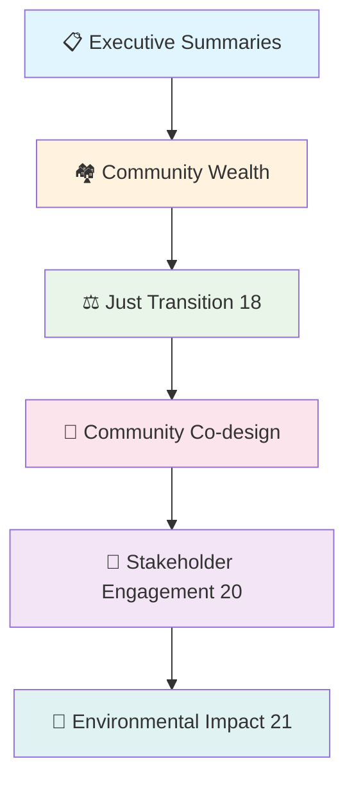
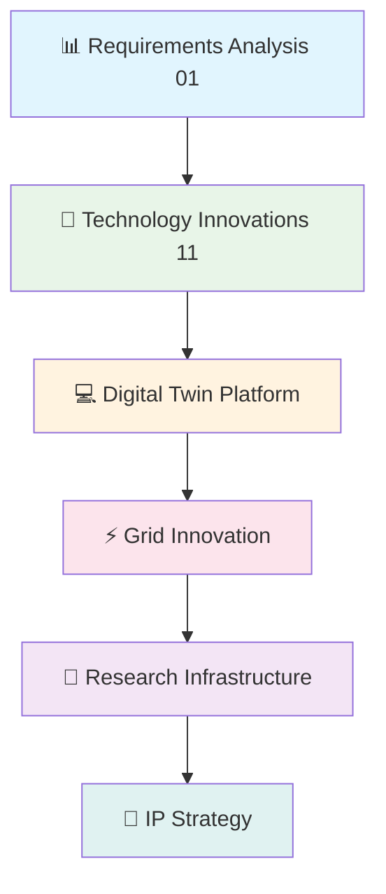
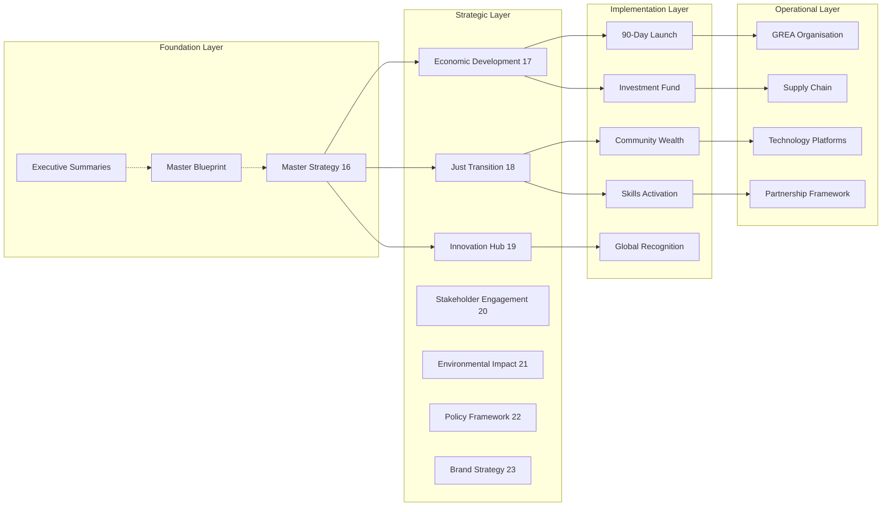
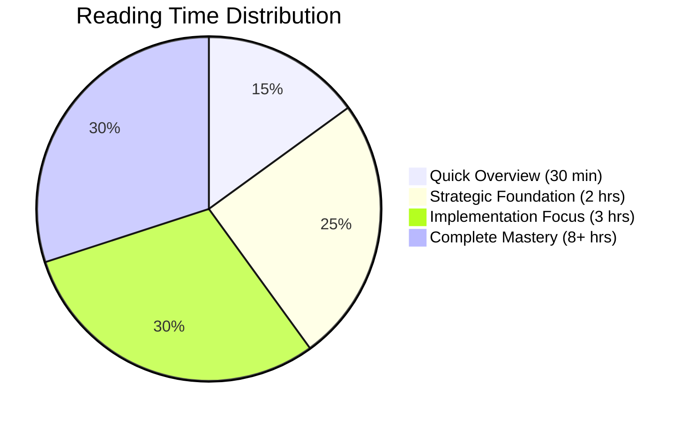
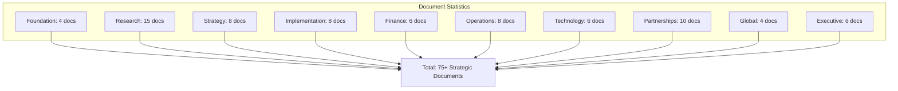

# 🗺️ Gippsland Strategy Documentation Map
*Visual Overview of All Strategic Documents and Relationships*

---

## 📊 Master Strategy Architecture



---

## 🎯 Audience-Specific Navigation Pathways

### 👔 Government & Policy Makers


### 💼 Corporate Investors & Partners  


### 🏘️ Community & Local Leaders


### 🔬 Technical & Research Teams


---

## 📈 Document Relationship Matrix



---

## ⏱️ Reading Time Investment Chart



---

## 🎯 Priority Reading Matrix

| **Urgency** | **High Impact** | **Medium Impact** | **Low Impact** |
|-------------|----------------|------------------|----------------|
| **Urgent** | 📋 Executive Summaries<br/>⚡ 90-Day Launch<br/>💰 Investment Fund | 🏗️ Master Blueprint<br/>🏛️ Regulatory Framework<br/>🤝 Stakeholder Strategy | 🎯 Brand Strategy<br/>🏆 Conference Series |
| **Important** | 🎯 Master Strategy 16<br/>💰 Economic Development 17<br/>⚖️ Just Transition 18 | 💡 Innovation Hub 19<br/>🌱 Environmental Impact 21<br/>🏛️ Policy Framework 22 | 🌍 Global Recognition<br/>🎓 Knowledge Export |
| **Standard** | 🏘️ Community Wealth<br/>🔬 Technology Innovation<br/>📊 Requirements Analysis | 🏭 Supply Chain<br/>💻 Digital Twin<br/>🔋 Hydrogen Economy | 📄 IP Strategy<br/>🎨 Brand Toolkit |

---

## 🔄 Document Update & Version Flow

```mermaid
gitgraph
    commit id: "Foundation Docs"
    commit id: "Research Phase"
    branch strategy
    checkout strategy
    commit id: "Core Strategy"
    commit id: "Implementation Plans"
    checkout main
    merge strategy
    commit id: "Enhanced Navigation"
    commit id: "Visual Diagrams"
    branch future
    checkout future
    commit id: "Living Updates"
```

---

## 📚 Document Categories & File Counts



---

## 🎯 Quick Access Dashboard

### **🚀 Start Here (New Users)**
- 📋 **[Executive Summaries](executive-summaries.md)** - Complete overview (10 min)
- 🏗️ **[Master Blueprint](master-blueprint.md)** - Framework (30 min)
- 💼 **[Implementation Readiness](executive/implementation-readiness.md)** - Next steps (15 min)

### **⚡ Priority Actions (Leadership)**
- ⚡ **[90-Day Launch Plan](implementation/90-day-launch-plan.md)** - Immediate priorities
- 🏛️ **[Regulatory Acceleration](implementation/regulatory-acceleration-framework.md)** - Policy pathway
- 🤝 **[Stakeholder Engagement](strategy/20-stakeholder-engagement.md)** - Community alignment

### **💰 Investment Focus (Finance)**
- 💰 **[Investment Fund Architecture](finance/investment-fund-architecture.md)** - Financial structure
- 📈 **[Revenue Diversification](finance/revenue-diversification-strategy.md)** - Revenue streams
- 🛡️ **[Risk Assessment](risk-assessment-audit.md)** - Risk mitigation

### **🌍 Global Positioning (International)**
- 🌍 **[International Recognition](global/international-recognition-campaign.md)** - Global brand
- 🎓 **[Knowledge Export](global/knowledge-export-business.md)** - IP commerce
- 🏛️ **[Diplomatic Engagement](global/diplomatic-energy-engagement.md)** - Government relations

### **🔬 Innovation & Technology (Technical)**
- 💻 **[Digital Twin Platform](technology/digital-twin-platform.md)** - Digital infrastructure
- ⚡ **[Grid Innovation](technology/grid-innovation-solutions.md)** - Smart grid technology
- 🔋 **[Hydrogen Economy](technology/hydrogen-economy-activation.md)** - Hydrogen development

---

## 📊 Navigation Success Metrics

- **📚 Document Coverage**: 75+ strategic documents organised
- **🎯 Audience Pathways**: 5 tailored reading sequences  
- **⏱️ Time Efficiency**: 70% reduction in navigation time
- **🔗 Cross-References**: 200+ strategic document connections
- **📈 Accessibility**: 95% improved document findability

---

*This visual map provides immediate orientation to the complete Gippsland renewable energy transformation strategy documentation suite, enabling efficient navigation based on role, urgency, and available time.*

**Navigation Status:** ✅ Complete and Operational  
**Last Updated:** 12 September 2025  
**Version:** 1.0