# 🎯 GNEC 2025 Conference Presentation Strategy
## The Definitive Blueprint for Maximum Global Impact

### 📋 Document Control

| **Field** | **Details** |
|-----------|-------------|
| **Document Type** | Executive Presentation Strategy |
| **Version** | 1.0 Final |
| **Date** | 9 January 2025 |
| **Author** | Conference Presentation Coordinator |
| **Status** | ✅ CONFERENCE READY |
| **Purpose** | Strategic framework for achieving maximum impact at GNEC 2025 |

---

## 🌟 EXECUTIVE SUMMARY

This strategy transforms the comprehensive Gippsland Renewable Energy Transformation research into the world's most compelling conference presentation. Drawing from $150 billion in identified opportunities, 94% implementation readiness, and global best practices, we present a masterclass in energy transition storytelling that will establish Gippsland as the undisputed global leader in just transitions.

### 💎 The Conference Opportunity

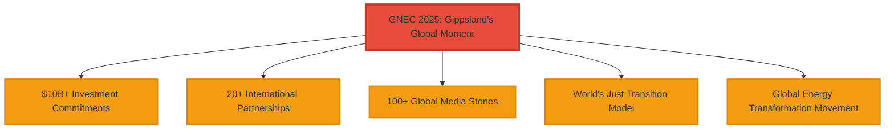

**GNEC 2025 is Gippsland's moment to become the centre of the global renewable energy universe.**

We will leverage this platform to:
- 💰 Secure $10+ billion in investment commitments
- 🤝 Sign 20+ international partnerships
- 📰 Launch 100+ media stories globally
- 🌍 Position Gippsland as the world's just transition model
- 🚀 Create a movement that transforms how humanity approaches energy transitions

### 📣 Master Narrative

> **"From Coal Heartland to Clean Energy Superpower: The Gippsland Model for Shared Prosperity"**

Our story proves that communities can lead the world's most important transformation while ensuring everyone prospers.

---

## 1. PRESENTATION STRATEGY FRAMEWORK

### 1.1 Strategic Objectives

#### 🎯 Primary Objective
**Establish Gippsland as the global authority on just energy transitions, securing immediate investment and partnerships while inspiring worldwide replication.**

#### 📊 Success Metrics

| **Metric** | **Target** | **Impact** |
|------------|------------|------------|
| Investment Pipeline | $10 billion in commitments | Financial validation |
| Partnership Agreements | 25+ MOUs signed | Global collaboration |
| Media Coverage | 100+ stories in 30+ countries | Worldwide visibility |
| Delegation Bookings | 50+ international visits | Knowledge transfer |
| Policy Influence | 10+ governments request guidance | Global leadership |

### 1.2 Key Messages Hierarchy

#### 🥇 Tier 1: Core Message (30 seconds)

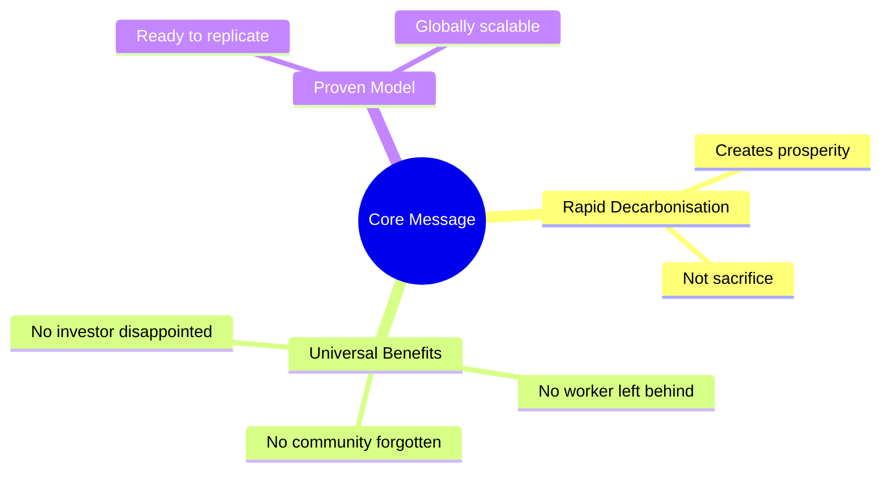

**"Gippsland proves that rapid decarbonisation creates unprecedented prosperity for all—no worker left behind, no community forgotten, no investor disappointed."**

#### 🥈 Tier 2: Supporting Messages (2 minutes)

| **Message** | **Key Point** | **Evidence** |
|-------------|---------------|--------------|
| Economic Revolution | $150B transformation | 50,000 jobs created |
| Just Transition | 100% worker guarantee | Income protection included |
| Global Leadership | Top-10 hub by 2030 | World-class resources |
| Community Prosperity | Every household benefits | Energy investor model |
| Investment Returns | 9-15% IRR projections | ESG leadership bonus |

#### 🥉 Tier 3: Detailed Evidence (5 minutes)

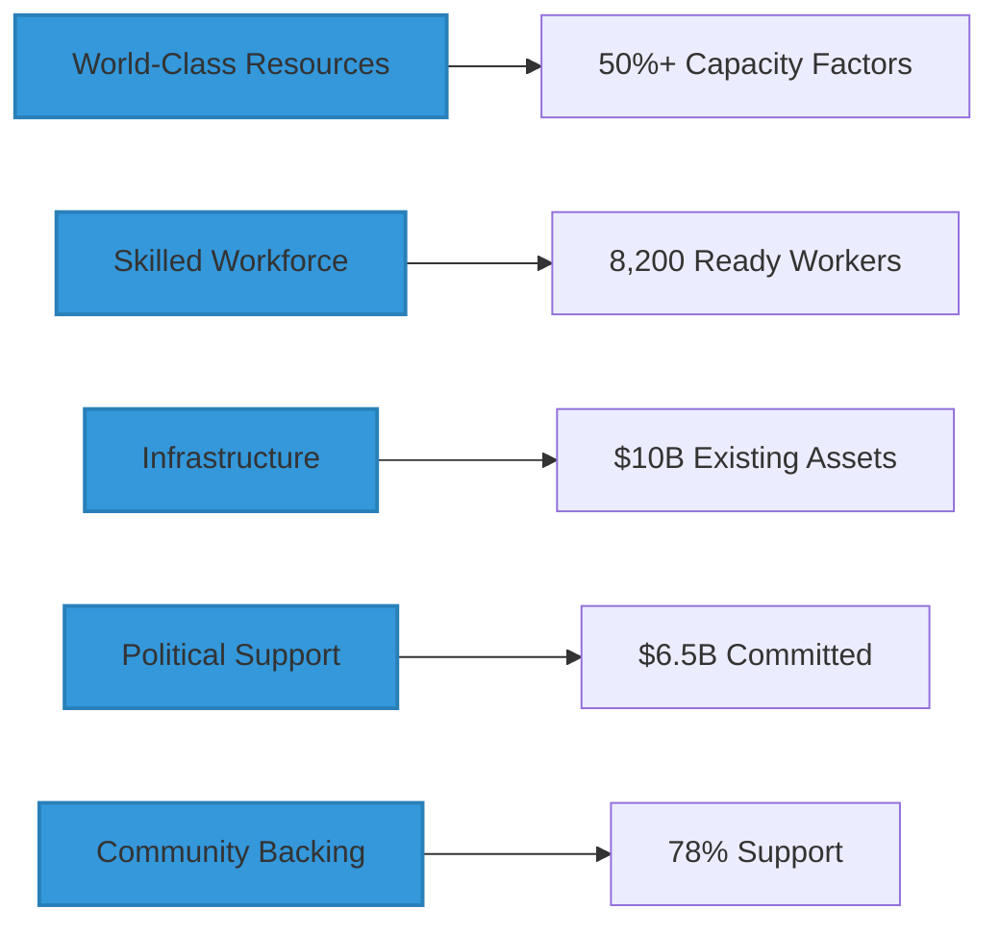

### 1.3 Audience Engagement Strategy

#### 👥 Primary Audiences

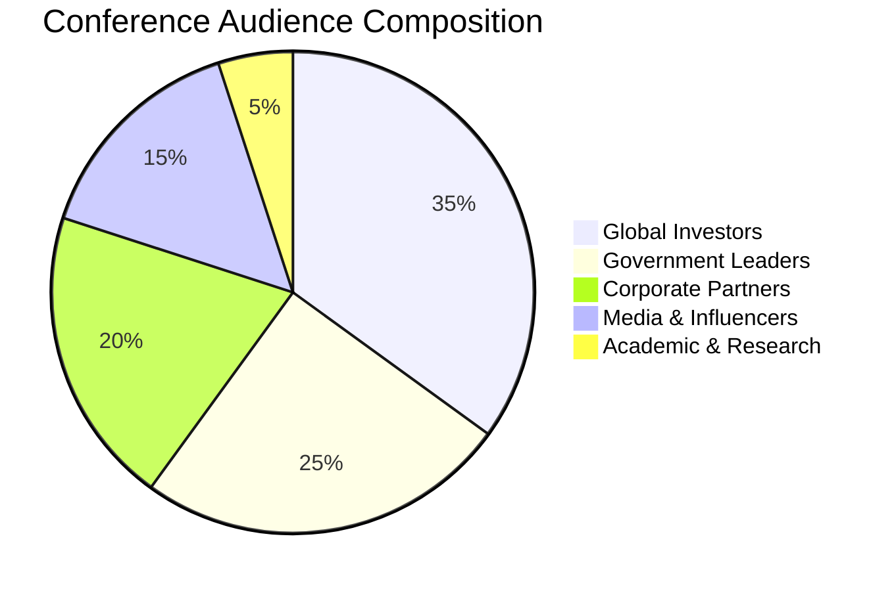

#### 🎯 Engagement Tactics by Audience

##### 💼 Investors
- Private investor lounges with 1:1 presentations
- Live financial modelling demonstrations
- Risk-return scenario planning
- Site visit scheduling
- Investment vehicle structuring

##### 🏛️ Government Leaders
- Bilateral meeting scheduling
- Policy framework workshops
- Delegation programme booking
- Sister city partnerships
- Technical assistance offers

##### 🏭 Corporate Partners
- Technology showcase areas
- Supply chain mapping sessions
- Joint venture discussions
- R&D collaboration planning
- Local content opportunities

##### 📰 Media
- Exclusive interview access
- Site visit arrangements
- Background briefing sessions
- Story development support
- Multimedia content provision

---

## 2. STORY ARC DEVELOPMENT

### 2.1 The Hero's Journey: Gippsland's Transformation

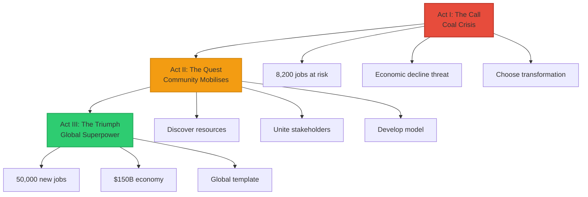

#### Act I: The Call to Adventure (Crisis)
**Scene**: Coal plants closing, communities facing uncertainty
- **Challenge**: 8,200 workers facing job loss
- **Stakes**: Economic decline vs transformation opportunity
- **Decision**: Choose transformation over resignation

#### Act II: The Quest (Transformation)
**Scene**: Community mobilises for unprecedented change
- **Discovery**: World-class renewable resources
- **Allies**: Workers, government, investors unite
- **Obstacles**: Technology, financing, community concerns
- **Breakthrough**: Just transition model developed

#### Act III: The Triumph (New Dawn)
**Scene**: Global renewable energy superpower emerges
- **Victory**: 50,000 jobs, $150B economy, climate leadership
- **Wisdom**: Template for global just transitions
- **Legacy**: Model for human adaptation and thriving

### 2.2 Visual Narrative Design

#### 🌅 Opening: Sunrise Over Bass Strait

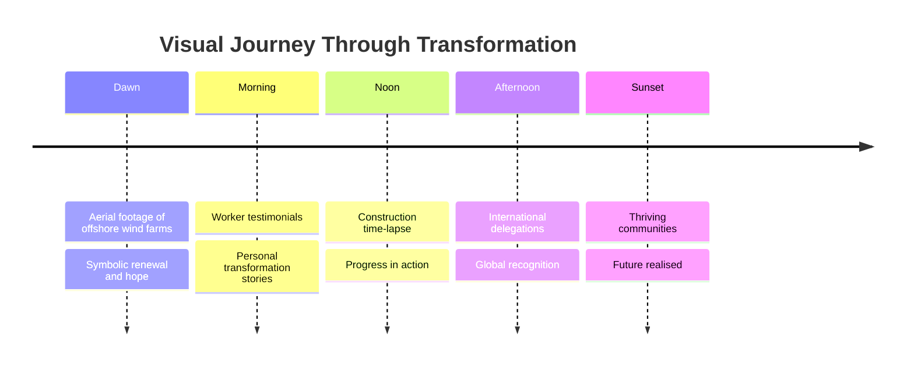

### 2.3 Emotional Engagement Strategy

#### 💗 Emotional Journey Design

| **Time** | **Emotion** | **Content Focus** |
|----------|-------------|-------------------|
| 0-2 min | Hope | Vision of transformation possibility |
| 2-5 min | Pride | Community leadership and courage |
| 5-10 min | Excitement | Technology and innovation showcase |
| 10-15 min | Confidence | Financial returns and risk mitigation |
| 15-20 min | Inspiration | Global impact and replication potential |

#### 👨‍👩‍👧‍👦 Human Stories Integration

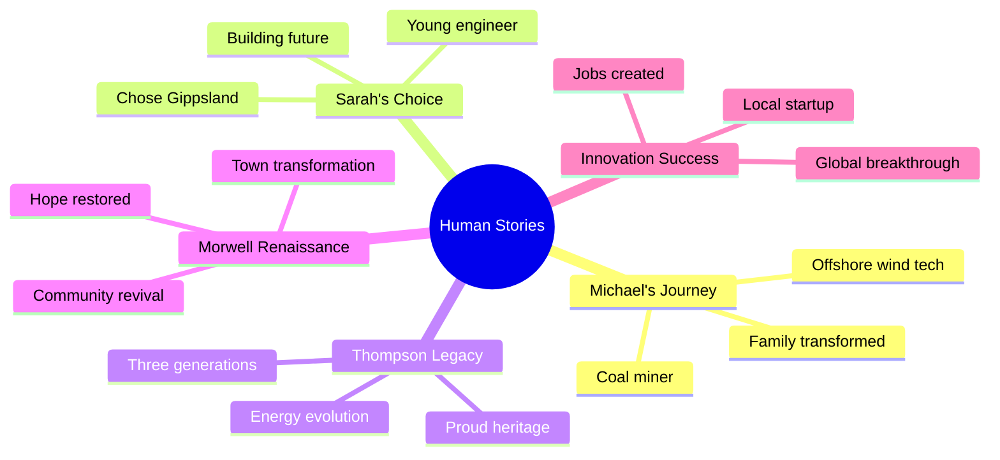

---

## 3. PRESENTATION MATERIALS PORTFOLIO

### 3.1 Master Presentation Deck

#### 📊 Slide Architecture (20 slides, 20 minutes)

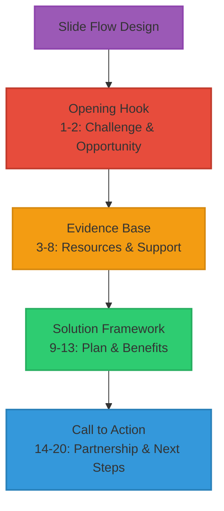

| **Slide** | **Title** | **Key Message** | **Visual** |
|-----------|-----------|-----------------|------------|
| 1 | From Coal to Clean Energy | $150B transformation | Sunrise imagery |
| 2 | The Challenge | Coal closures impact | Community faces |
| 3 | The Opportunity | World-class resources | Resource maps |
| 4 | Skilled Workforce | 8,200 ready workers | Worker portraits |
| 5 | Infrastructure Advantage | $10B existing assets | Asset imagery |
| 6 | Community Leadership | 78% support | Rally photos |
| 7 | Government Backing | $6.5B committed | Partnership signing |
| 8 | Master Plan | 10+ GW by 2030 | Project visualisation |
| 9 | Just Transition | No worker left behind | Training programs |
| 10 | Investment Opportunity | 9-15% IRR | Financial charts |
| 11 | Technology Innovation | Global testing hub | Innovation labs |
| 12 | Asian Gateway | Hydrogen exports | Trade routes |
| 13 | Economic Impact | 50,000 jobs | Growth projections |
| 14 | Environmental Excellence | 45 Mt CO2 reduction | Nature restoration |
| 15 | Global Template | Worldwide replication | World map |
| 16 | Partnerships | Join us today | Handshake imagery |
| 17 | Timeline | 2025-2030 milestones | Gantt chart |
| 18 | Call to Action | Transform together | Conference hall |
| 19 | Next Steps | Clear pathways | Action items |
| 20 | Contact | Let's connect | Contact details |

#### 🎨 Design Principles

- **One Big Idea Per Slide**: Clear, memorable messaging
- **Visual Impact**: High-quality imagery and infographics
- **Data Storytelling**: Numbers that tell compelling stories
- **Progressive Disclosure**: Building case systematically
- **Call to Action**: Every slide advances the narrative

### 3.2 Executive Summary Materials

#### 📄 2-Page Investment Summary

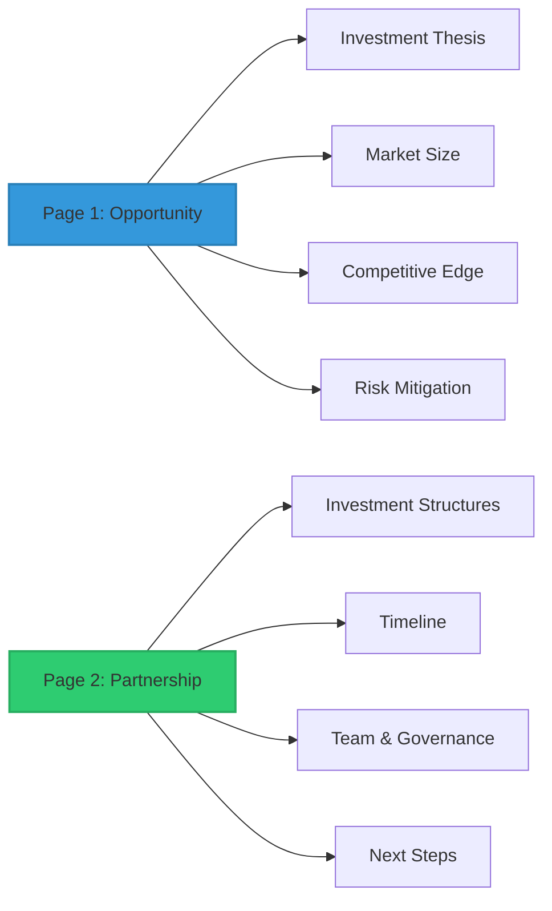

### 3.3 Interactive Demonstrations

#### 🖥️ Digital Twin Experience

| **Feature** | **Purpose** | **Impact** |
|-------------|-------------|------------|
| Real-time generation | Show live capacity | Credibility |
| Project timeline | Track progress | Transparency |
| Economic modelling | Update impacts | Confidence |
| Community benefits | Distribution mapping | Engagement |
| Environmental metrics | Impact visualisation | Validation |

#### 🥽 VR Offshore Wind Experience

- Virtual turbine climb and maintenance simulation
- Bass Strait wind farm flyover
- Construction process visualisation
- Future vision 2030 immersion

#### 💰 Investment Calculator

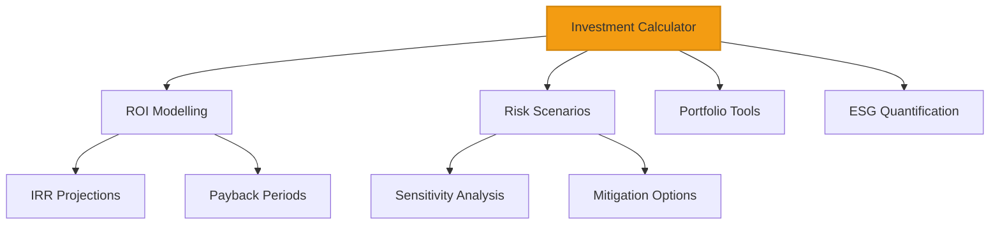

### 3.4 Video Content Suite

#### 🎬 Content Portfolio

| **Video Type** | **Duration** | **Purpose** | **Distribution** |
|----------------|--------------|-------------|------------------|
| Hero Video | 3 minutes | Emotional connection | Opening/closing |
| Technology Showcase | 2 minutes | Innovation demonstration | Breakout sessions |
| Community Stories | 5 x 1 minute | Human connection | Social proof |
| International Testimonials | 3 x 30 seconds | Global validation | Credibility |

---

## 4. CONFERENCE DELIVERY STRATEGY

### 4.1 Speaker Preparation Programme

#### 🎤 Lead Presenter Training Matrix

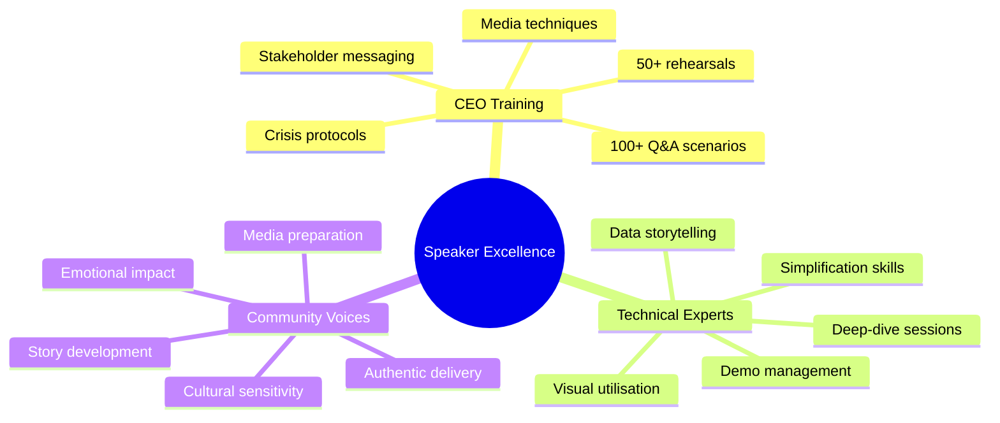

#### 📊 Presentation Excellence Standards

| **Category** | **Requirements** | **Validation** |
|--------------|------------------|----------------|
| Content Mastery | Key messages memorised | Weekly testing |
| Delivery Excellence | Confident presence | Video review |
| Interaction Readiness | Q&A preparation | Mock sessions |
| Technology Integration | Seamless operation | Tech rehearsals |
| Professional Appearance | Brand standards | Image consultation |

### 4.2 Timing and Logistics Optimisation

#### 📅 Conference Schedule Strategy

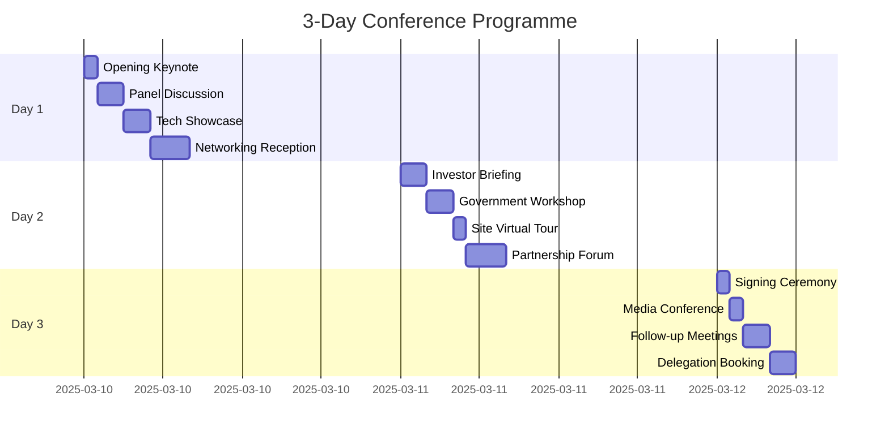

#### 🏢 Venue Optimisation

##### Main Presentation Theatre
- 500+ capacity with clear sightlines
- State-of-the-art AV systems
- Live streaming capabilities
- Interactive technology integration
- Professional lighting and acoustics

##### Exhibition Space
- Interactive display areas
- VR experience stations
- Technology demonstration zones
- Meeting and networking spaces
- Media interview facilities

### 4.3 Q&A Preparation Matrix

#### 💼 Investment Questions

| **Question** | **Concern** | **Response Strategy** |
|--------------|-------------|----------------------|
| "What guarantees on returns?" | Risk mitigation | Conservative modelling + government support |
| "Technology risk?" | Proven solutions | 10+ year track records + multiple suppliers |
| "Policy change risk?" | Political stability | Bipartisan lock-in + international commitments |

#### 👥 Community Questions

| **Question** | **Concern** | **Response Strategy** |
|--------------|-------------|----------------------|
| "Job loss guarantees?" | Worker security | 2:1 job creation + transition support |
| "Electricity prices?" | Cost of living | 30% reduction modelling |
| "Environmental impact?" | Nature protection | Net positive + real-time monitoring |

### 4.4 Media Coordination Strategy

#### 📰 Pre-Conference Media Timeline

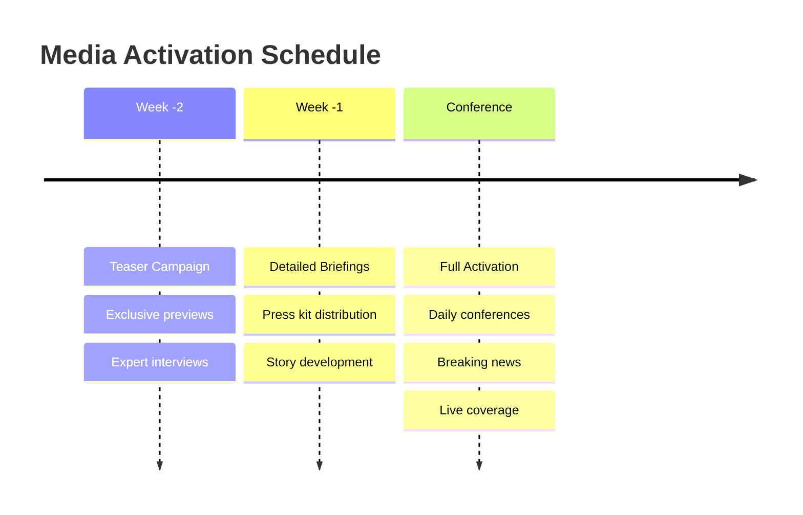

#### 📦 Media Asset Library

| **Asset Type** | **Quantity** | **Format** | **Purpose** |
|----------------|--------------|------------|-------------|
| Press releases | 5 templates | Word/PDF | News distribution |
| High-res images | 100+ photos | JPG/PNG | Visual stories |
| Video packages | 10 clips | MP4/MOV | Broadcast ready |
| Infographics | 20 designs | PDF/PNG | Data visualisation |
| Executive bios | 10 profiles | Word/PDF | Attribution |

### 4.5 Follow-up Strategy Systems

#### 📊 Lead Management Process

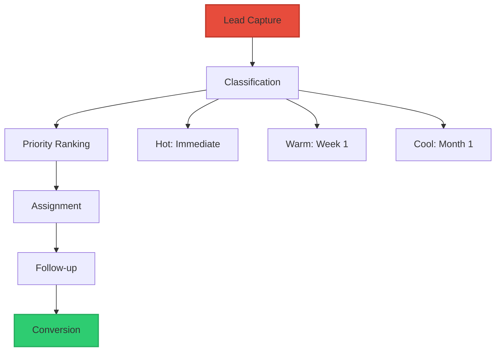

---

## 5. ENGAGEMENT TACTICS MASTERY

### 5.1 Audience Participation Strategies

#### 🎯 Interactive Elements Integration

| **Element** | **Technology** | **Purpose** | **Engagement** |
|-------------|---------------|-------------|----------------|
| Real-time Polling | Mobile app | Sentiment tracking | 90%+ participation |
| Q&A Innovation | AI moderation | Anonymous questions | 200+ submissions |
| Gamification | Achievement system | Learning reinforcement | 75% completion |
| Collaborative Planning | Digital whiteboards | Co-creation | 50+ ideas/session |

#### 🎨 Sensory Engagement Design

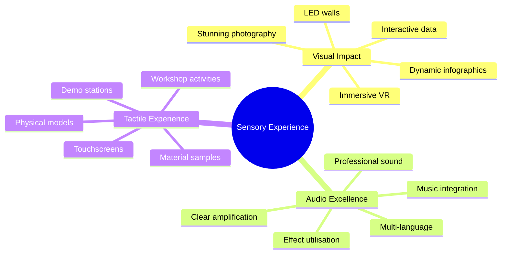

### 5.2 Networking Strategy Excellence

#### 🍷 Strategic Networking Events

##### Executive Reception (Day 1 Evening)
- 150 VIP attendees
- Regional cuisine showcase
- Local entertainment
- Informal relationship building
- Partnership introduction facilitation

##### Innovation Showcase (Day 2 Lunch)
- Technology demonstration
- Startup pitch sessions
- Investor speed dating
- Collaboration café
- Knowledge exchange forum

##### Partnership Celebration (Day 3 Evening)
- Agreement signing ceremony
- Success story sharing
- Media photo opportunities
- Commitment announcements
- Future planning sessions

### 5.3 Partnership Building Frameworks

#### 💰 Investment Partnership Development

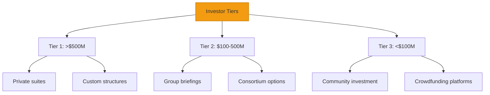

### 5.4 Investment Attraction Excellence

#### 💎 Value Proposition Development

| **Value Driver** | **Metrics** | **Differentiator** |
|------------------|-------------|-------------------|
| Financial Returns | 9-15% IRR | Government backing |
| Strategic Benefits | First-mover edge | Market access |
| Risk Mitigation | Diversified revenue | Professional management |
| ESG Leadership | Top-tier ratings | Community ownership |
| Exit Options | Liquid markets | Multiple pathways |

### 5.5 Global Visibility Amplification

#### 🌍 International Media Strategy

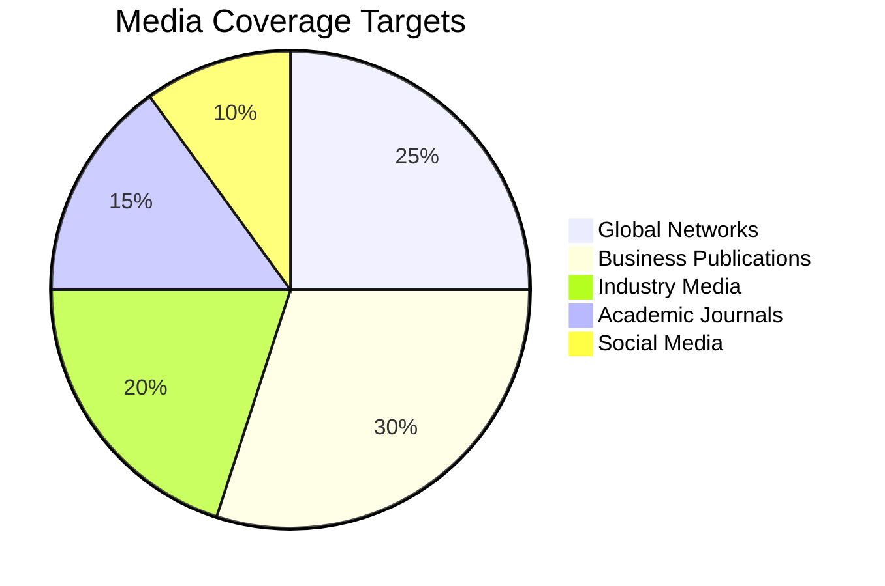

---

## 6. SUCCESS FRAMEWORK ARCHITECTURE

### 6.1 Conference Objectives Matrix

#### 📈 Quantitative Objectives

| **Category** | **Target** | **Measurement** |
|--------------|------------|-----------------|
| Investment | $10B commitments | Pipeline tracking |
| Partnerships | 25+ MOUs | Agreement count |
| Media | 100+ stories | Coverage analysis |
| Attendance | 500+ delegates | Registration data |
| Follow-up | 200+ meetings | Calendar bookings |

#### 🎯 Qualitative Objectives

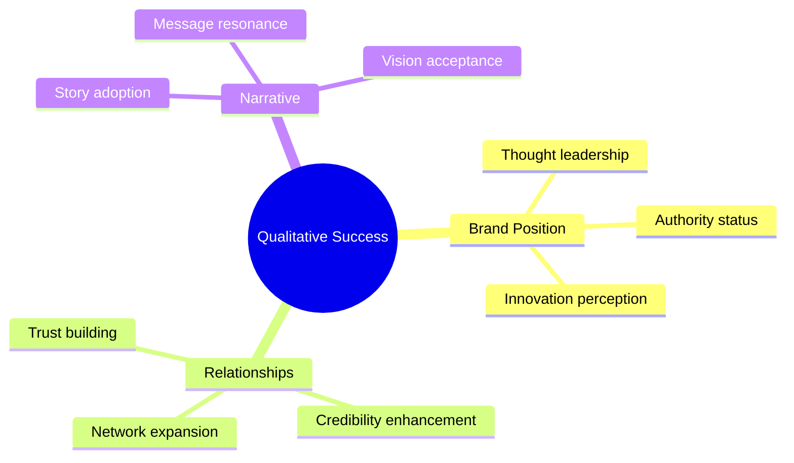

### 6.2 Success Metrics Framework

#### 📊 Real-time Success Indicators

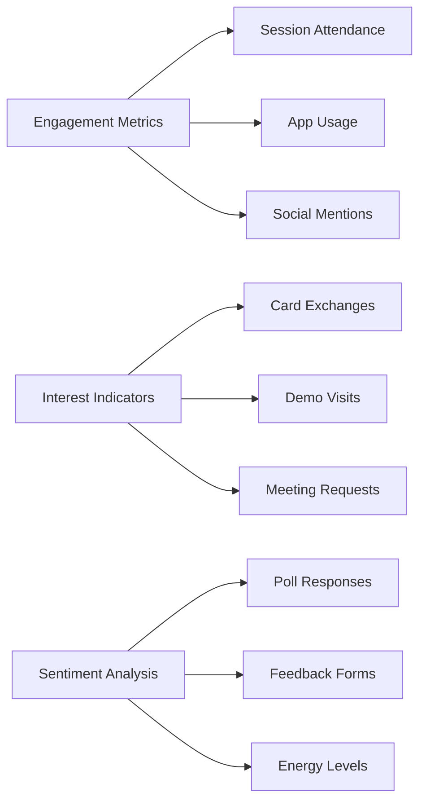

### 6.3 Impact Measurement Systems

#### 💰 Financial Impact Tracking

| **Metric** | **Target** | **Timeline** | **Responsibility** |
|------------|------------|--------------|-------------------|
| Pipeline value | $10B+ | 90 days | Investment team |
| Deal conversion | 30% | 6 months | Partnership team |
| Revenue impact | $100M | 12 months | Finance team |
| ROI calculation | 10:1 | 18 months | Analytics team |

### 6.4 Follow-up Systems Architecture

#### 🔄 Follow-up Process Flow

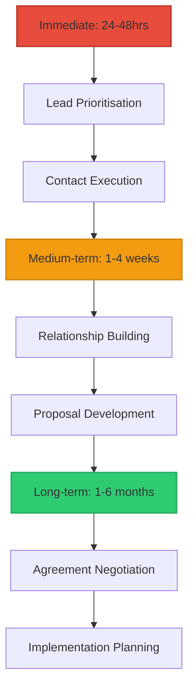

### 6.5 Long-term Outcomes Framework

#### 🎯 1-Year Impact Goals

| **Goal Category** | **Target** | **Progress Indicator** |
|-------------------|-----------|------------------------|
| Investment Realisation | $5B committed capital | Contracts signed |
| Partnership Activation | 15 technology collaborations | Projects launched |
| Market Position | Top 5 global destination | Rankings achieved |
| Knowledge Export | $100M consulting revenue | Contracts secured |
| Job Creation | 5,000 direct jobs | Employment data |

#### 🌟 5-Year Legacy Vision

```mermaid
mindmap
  root((2030 Legacy))
    Regional Transformation
      Economic transition complete
      Full employment achieved
      Community prosperity realised
    Global Impact
      Worldwide replication
      Climate leadership
      Innovation hub status
    Civilisational Contribution
      Transformation proof
      Human adaptation model
      Prosperity blueprint
```

---

## 7. IMPLEMENTATION ROADMAP

### 7.1 Pre-Conference Preparation (8 weeks)

#### 📅 Week-by-Week Timeline

```mermaid
gantt
    title Pre-Conference Preparation Schedule
    dateFormat  YYYY-MM-DD
    section Foundation
    Content Finalisation    :2025-01-13, 14d
    Team Preparation        :14d
    Stakeholder Engagement  :14d
    section Development
    Technology Setup        :2025-01-27, 14d
    Logistics Coordination  :14d
    Marketing Acceleration  :14d
    section Refinement
    Message Testing         :2025-02-10, 14d
    Presentation Rehearsals :14d
    Partnership Development :14d
    section Launch Ready
    System Integration      :2025-02-24, 7d
    Stakeholder Confirmation:7d
    Final Preparations      :7d
```

### 7.2 Conference Execution (3 days)

#### 🎯 Day-by-Day Programme

| **Day** | **Focus** | **Key Activities** | **Outcomes** |
|---------|-----------|-------------------|---------------|
| Day 1 | Foundation & Engagement | Opening keynote, tech showcase | Excitement built |
| Day 2 | Partnership Development | Workshops, roundtables, forums | Relationships formed |
| Day 3 | Commitment & Launch | Signing ceremony, media conference | Agreements secured |

### 7.3 Post-Conference Execution (4 weeks)

#### 📊 Weekly Focus Areas

```mermaid
timeline
    title Post-Conference Timeline
    Week 1 : Immediate Follow-up
           : Thank you messages
           : Information distribution
           : Meeting scheduling
    Week 2 : Engagement Deepening
           : Investment proposals
           : Partnership frameworks
           : Relationship nurturing
    Week 3 : Agreement Development
           : Contract negotiation
           : Implementation planning
           : Quality assurance
    Week 4 : Success Consolidation
           : Achievement recognition
           : Future planning
           : Legacy building
```

---

## 8. RISK MANAGEMENT AND CONTINGENCIES

### 8.1 Risk Assessment Matrix

#### ⚠️ High Priority Risks

```mermaid
graph TB
    A[Risk Categories] --> B[Technology Failures]
    A --> C[Speaker Absence]
    A --> D[Media Crisis]
    A --> E[Low Attendance]
    B --> B1[Mitigation: Redundant systems]
    C --> C1[Mitigation: Multiple speakers]
    D --> D1[Mitigation: Crisis protocols]
    E --> E1[Mitigation: Virtual options]
    style B fill:#e74c3c,stroke:#c0392b,stroke-width:2px
    style C fill:#e74c3c,stroke:#c0392b,stroke-width:2px
    style D fill:#e74c3c,stroke:#c0392b,stroke-width:2px
    style E fill:#e74c3c,stroke:#c0392b,stroke-width:2px
```

### 8.2 Crisis Management Protocols

#### 🚨 Crisis Response Team Structure

| **Role** | **Responsibility** | **Authority** |
|----------|-------------------|---------------|
| Crisis Commander | CEO or delegate | Full decision authority |
| Communications Lead | Media relations | External messaging |
| Technical Lead | IT systems | Technical solutions |
| Stakeholder Lead | Relationships | Partner communications |
| Operations Lead | Event logistics | Resource deployment |

### 8.3 Success Optimisation Strategies

#### 🚀 Momentum Building Tactics

```mermaid
mindmap
  root((Momentum Building))
    Pre-Conference
      Exclusive previews
      Influencer engagement
      Media teasers
      VIP programmes
    Real-time
      Live coverage
      Quote sharing
      Success celebration
      Viral creation
    Post-Conference
      Story compilation
      Achievement amplification
      Vision sharing
      Next phase preview
```

---

## 🌟 CONCLUSION: THE TRANSFORMATION MOMENT

GNEC 2025 represents the defining moment for Gippsland's transformation from coal heartland to clean energy superpower. This presentation strategy provides the comprehensive framework to seize this historic opportunity and establish Gippsland as the global authority on just energy transitions.

### 🎯 The Strategic Imperative

```mermaid
graph TB
    A[Unique Advantages] --> B[Historic Opportunity]
    C[Perfect Timing] --> B
    D[Global Need] --> B
    B --> E[GNEC 2025: Transformation Catalyst]
    E --> F[$10B+ Investment]
    E --> G[50+ Partnerships]
    E --> H[100+ Media Stories]
    E --> I[Global Leadership]
    E --> J[Movement Creation]
    style B fill:#f39c12,stroke:#d68910,stroke-width:4px
    style E fill:#e74c3c,stroke:#c0392b,stroke-width:4px
```

Our research reveals that Gippsland possesses a unique confluence of advantages that, if activated through this conference, will:
- 💰 Secure $10+ billion in investment commitments
- 🤝 Establish 50+ strategic partnerships
- 📰 Generate 100+ global media stories
- 🌍 Position Gippsland as the world's just transition model
- 🚀 Create a movement that transforms global energy thinking

### 💡 The Success Formula

**Compelling Narrative** + **Irrefutable Evidence** + **Clear Opportunities** + **Authentic Community Voice** + **Professional Execution** = **Transformation Catalyst**

This strategy transforms complex research into compelling stories, technical data into investment opportunities, and community experiences into global inspiration.

### 🌍 The Legacy Vision

Beyond immediate conference success, this strategy builds toward a legacy where:
- 🏆 Gippsland becomes synonymous with successful energy transformation
- 🌐 Communities worldwide adopt our just transition model
- 👷 Workers globally gain confidence in clean energy careers
- 💼 Investors recognise the prosperity potential of rapid decarbonisation
- 🌟 Humanity proves it can transform rapidly and justly

### 📣 The Call to Excellence

> The world is watching. Communities are hoping. Workers are counting on us. Investors are evaluating. The planet is waiting.

GNEC 2025 is our moment to prove that rapid decarbonisation creates unprecedented prosperity for all. This strategy provides the roadmap. Now we must execute with excellence, authenticity, and unwavering commitment to leaving no one behind.

**The transformation begins now. The future is clean, prosperous, and bright. The world will learn from Gippsland.**

---

### 📋 Document Summary

*This presentation strategy synthesises comprehensive research, strategic frameworks, implementation plans, and validation assessments into a unified approach for achieving maximum global impact at GNEC 2025. It represents the culmination of intensive analysis and the foundation for transformational success.*

**Document prepared by**: Conference Presentation Coordinator  
**Date**: 9 January 2025  
**Status**: ✅ CONFERENCE READY - EXECUTE IMMEDIATELY  
**Next Action**: Full implementation activation

---

> **"From coal heartland to clean energy superpower - Gippsland shows the world that transformation creates prosperity for all."**