# 💰 COMMUNITY WEALTH CREATION STRATEGY FOR GIPPSLAND'S RENEWABLE ENERGY TRANSITION
## Building Lasting Local Prosperity Through Energy Transformation

> **Document Status**: Community Wealth Framework  
> **Target**: 10,000+ community investors by 2030  
> **Economic Impact**: $2.5B annual local economic activity  
> **Job Creation**: 15,000 direct and indirect jobs  
> **Version**: 2.0 Enhanced | Date: January 2025

---

## 📊 EXECUTIVE SUMMARY

This document outlines a comprehensive community wealth creation framework designed to ensure that Gippsland's renewable energy transition generates lasting local prosperity. The strategy emphasises community ownership, local economic multipliers, Indigenous participation, and intergenerational wealth building to create a just and equitable energy transformation.

### 🎯 Key Wealth Creation Pillars

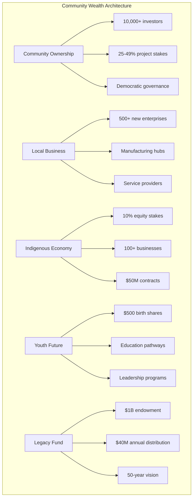

### 💵 Economic Impact Summary

| Impact Category | 2025 Target | 2030 Target | 2035 Target |
|----------------|-------------|-------------|-------------|
| **Community Investors** | 2,000 | 10,000 | 20,000 |
| **Local Jobs Created** | 2,000 | 5,000 direct + 10,000 indirect | 8,000 direct + 20,000 indirect |
| **New Businesses** | 100 | 500 | 1,000 |
| **Annual Economic Activity** | $500M | $2.5B | $5B |
| **Community Fund Value** | $20M | $250M | $1B |

---

## 1. COMMUNITY OWNERSHIP PARTICIPATION MODELS

### 1.1 Renewable Energy Cooperative Structure

#### 🤝 Gippsland Community Energy Co-op

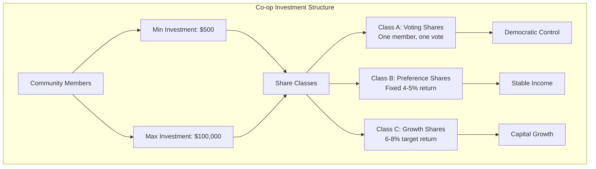

**Investment Parameters**

| Parameter | Value | Rationale |
|-----------|-------|-----------|
| **Minimum Investment** | $500 | Accessible to all community members |
| **Maximum Investment** | $100,000 | Ensures broad participation |
| **Target Returns** | 6-8% p.a. | Competitive with market |
| **Voting Rights** | One member, one vote | Democratic principles |
| **Target Participation** | 10,000+ by 2030 | Community-wide engagement |

### 1.2 Asset Ownership Models

#### 🏗️ Community Stake Structures

**1. Direct Project Ownership (25-49% community stake)**

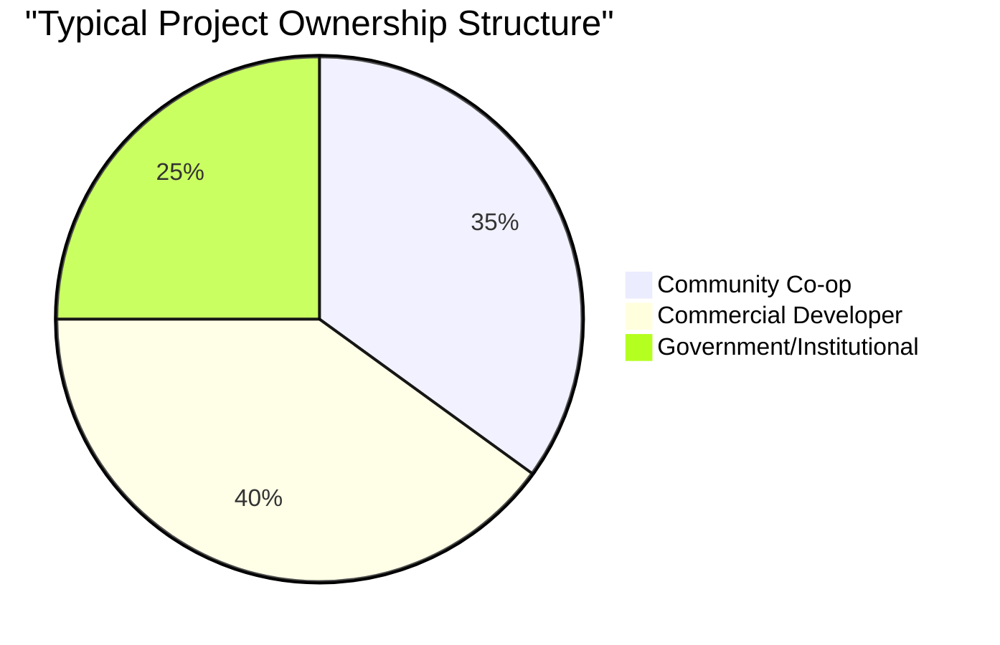

**2. Revenue Sharing Agreements**

| Revenue Stream | Community Share | Annual Value | 25-Year Total |
|----------------|----------------|--------------|---------------|
| **Gross Revenue Share** | 2-3% | $5-10M per project | $125-250M |
| **Performance Bonuses** | Variable | $1-2M | $25-50M |
| **Inflation Adjustment** | CPI-linked | Growing | Protected value |

### 1.3 Democratic Governance Framework

#### 🏛️ Community Energy Board Structure

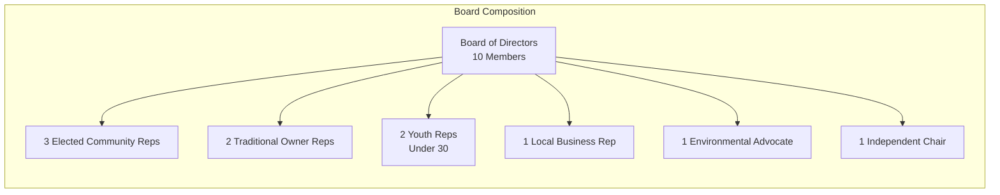

**Decision-Making Protocols**

| Decision Type | Approval Required | Notice Period | Quorum |
|--------------|-------------------|---------------|---------|
| **Major Investments** | 75% member vote | 30 days | 50% |
| **Annual Profit Distribution** | Simple majority | 14 days | 30% |
| **Board Elections** | Preferential voting | 60 days | 40% |
| **Constitutional Changes** | 80% special resolution | 60 days | 60% |

---

## 2. LOCAL BUSINESS DEVELOPMENT PROGRAMS

### 2.1 Renewable Energy Supply Chain Localisation

#### 🏭 Manufacturing Hub Development

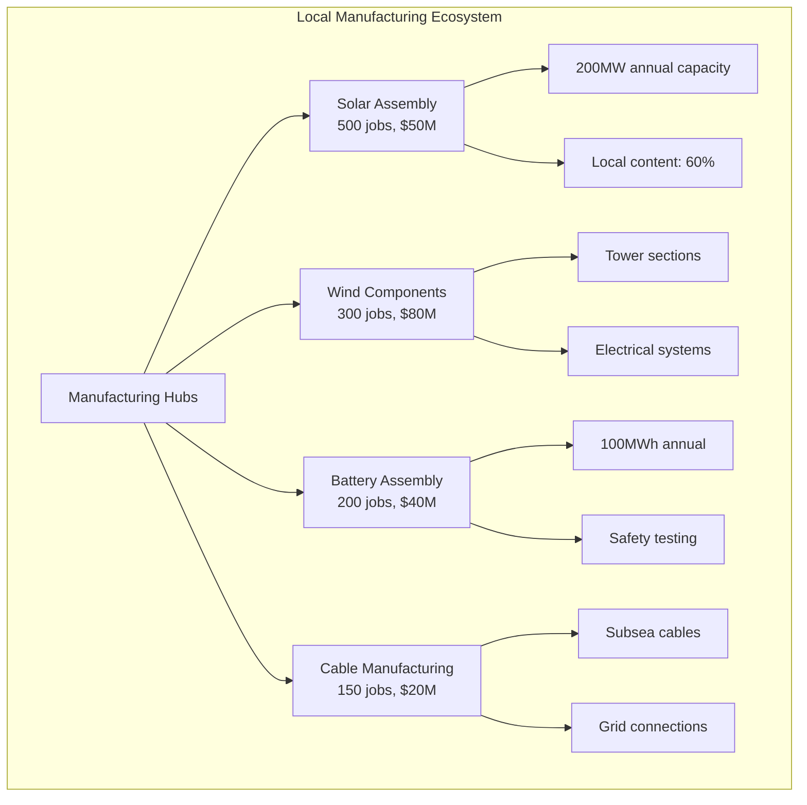

#### 💡 Business Incubator Program

**Support Framework**

| Support Type | Value | Duration | Expected Outcome |
|--------------|-------|----------|------------------|
| **Seed Funding** | Up to $100k | Initial | 50 startups |
| **Free Workspace** | $2k/month value | 2 years | Reduced barriers |
| **Mentorship** | 100 hours | 1 year | Skill development |
| **Pilot Projects** | Guaranteed contracts | Various | Market entry |
| **Total Fund** | **$5M** | **5 years** | **30 viable businesses** |

### 2.2 Skills-Based Enterprise Development

#### 🔧 Training-to-Business Pipeline

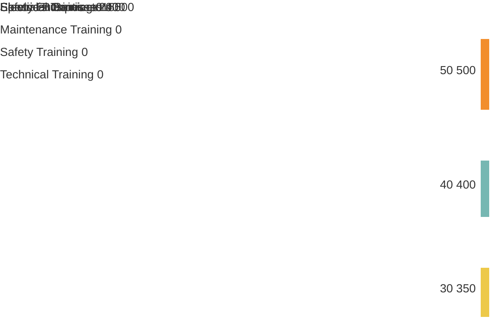

### 2.3 Innovation and R&D Commercialisation

#### 🚀 Gippsland Energy Innovation Fund

**Investment Focus Areas**

| Focus Area | Allocation | Target Returns | Success Metrics |
|------------|------------|----------------|-----------------|
| **Agrivoltaics Solutions** | $5M | 15-20% IRR | 10 products commercialised |
| **Offshore Wind Tech** | $6M | 20-25% IRR | 5 patents filed |
| **Grid Integration** | $5M | 18-22% IRR | 3 software platforms |
| **Energy Storage** | $4M | 22-28% IRR | 2 breakthrough technologies |

---

## 3. ECONOMIC MULTIPLIER OPTIMISATION

### 3.1 Local Procurement Mandates

#### 📊 Tiered Local Content Requirements

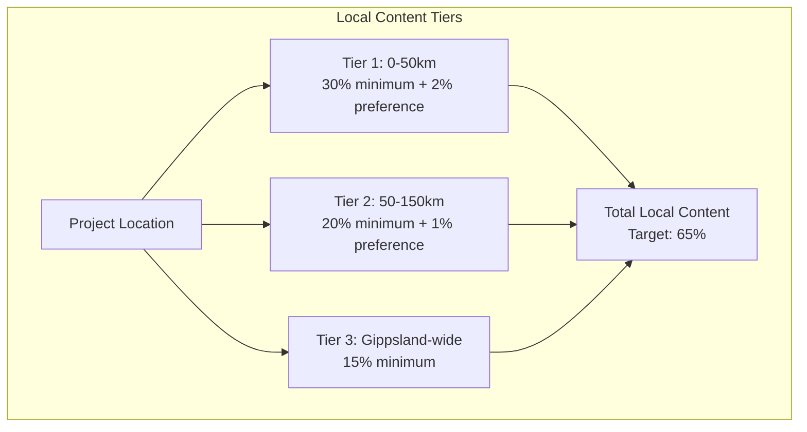

**Procurement Categories & Targets**

| Category | Construction Phase | Operations Phase | Local Value |
|----------|-------------------|------------------|-------------|
| **Civil Works** | 80% | N/A | $800M |
| **Concrete & Aggregates** | 90% | N/A | $300M |
| **Transportation** | 85% | 95% | $200M |
| **Accommodation & Meals** | 95% | 100% | $150M |
| **Professional Services** | 70% | 85% | $400M |
| **Maintenance Services** | N/A | 90% | $100M/year |

### 3.2 Value Chain Integration

#### 🔄 Circular Economy Implementation

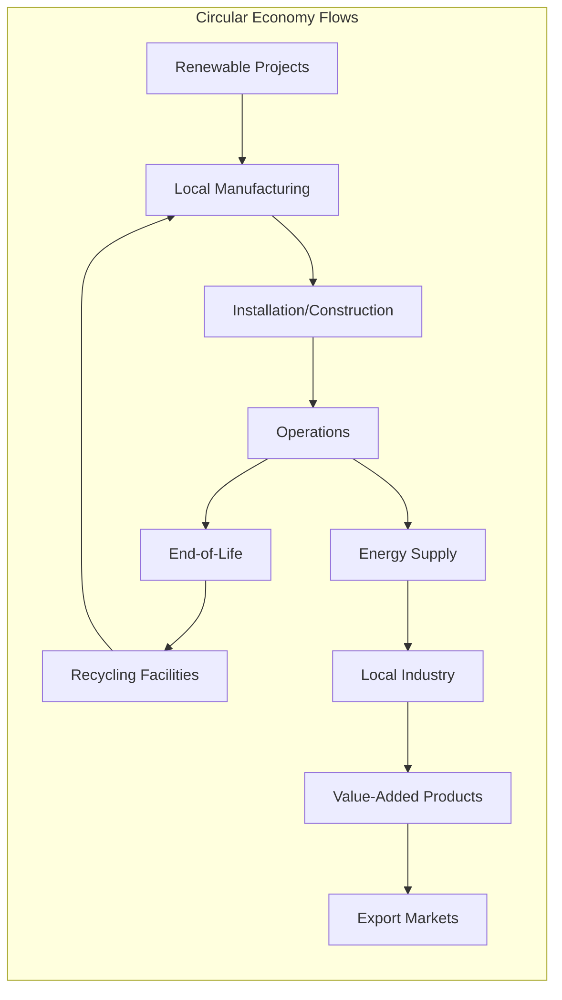

### 3.3 Economic Impact Modelling

#### 💵 Multiplier Effects

**Economic Flow Analysis**

| Investment Type | Direct Impact | Multiplier | Total Impact |
|----------------|---------------|------------|--------------|
| **$1 Construction** | $1.00 | 3.5x | $3.50 |
| **$1 Operations** | $1.00 | 4.2x | $4.20 |
| **$1 Local Wages** | $0.70 local spend | 2.8x | $1.96 |
| **$1 Materials** | $0.60 local | 2.3x | $1.38 |

**Projected Economic Activity**

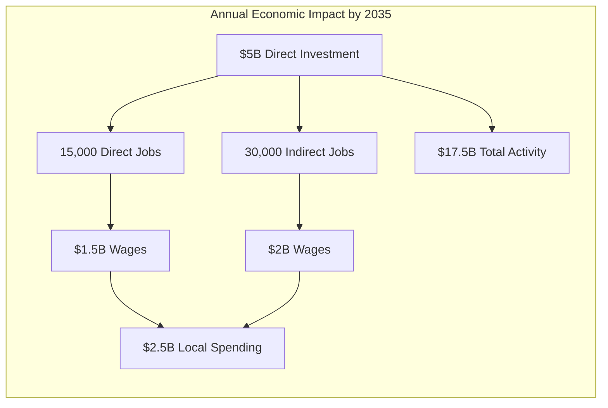

---

## 4. INDIGENOUS ECONOMIC PARTICIPATION FRAMEWORK

### 4.1 Traditional Owner Partnership Models

#### 🤝 Gunaikurnai Renewable Energy Corporation

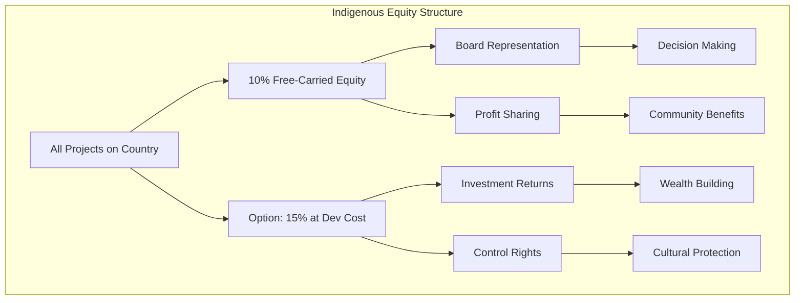

**Revenue Streams Portfolio**

| Revenue Type | Annual Value | Escalation | 25-Year Total |
|--------------|-------------|------------|---------------|
| **Land Access Payments** | $5,000/MW | CPI + 2% | $125/MW total |
| **Profit Sharing** | 5% net profits | Performance-linked | $250M+ |
| **Carbon Credit Allocation** | 20% of credits | Market value | $500M+ |
| **Cultural Services** | $2M contracts | CPI + 3% | $75M+ |

### 4.2 Indigenous Business Development

#### 🏢 Targeted Business Sectors

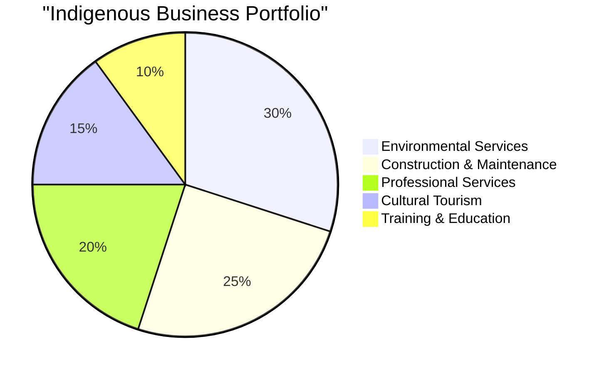

**Support Mechanisms**

| Support Type | Value | Target Outcome |
|--------------|-------|----------------|
| **Development Fund** | $10M | 100 businesses by 2030 |
| **Guaranteed Contracts** | $50M over 10 years | Sustainable revenue |
| **Mentorship Program** | 500 hours/business | Capability building |
| **Joint Ventures** | Facilitated partnerships | Scale achievement |

### 4.3 Employment and Training Pathways

#### 📈 Indigenous Employment Targets

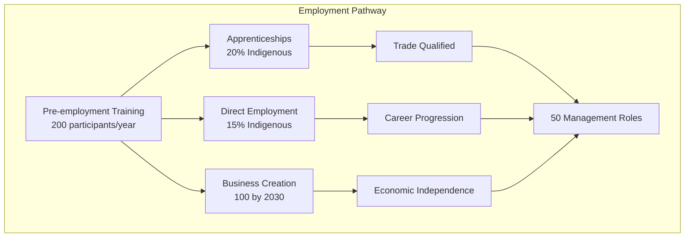

---

## 5. YOUTH AND NEXT-GENERATION WEALTH BUILDING

### 5.1 Youth Investment Programs

#### 👶 Gippsland Future Energy Fund

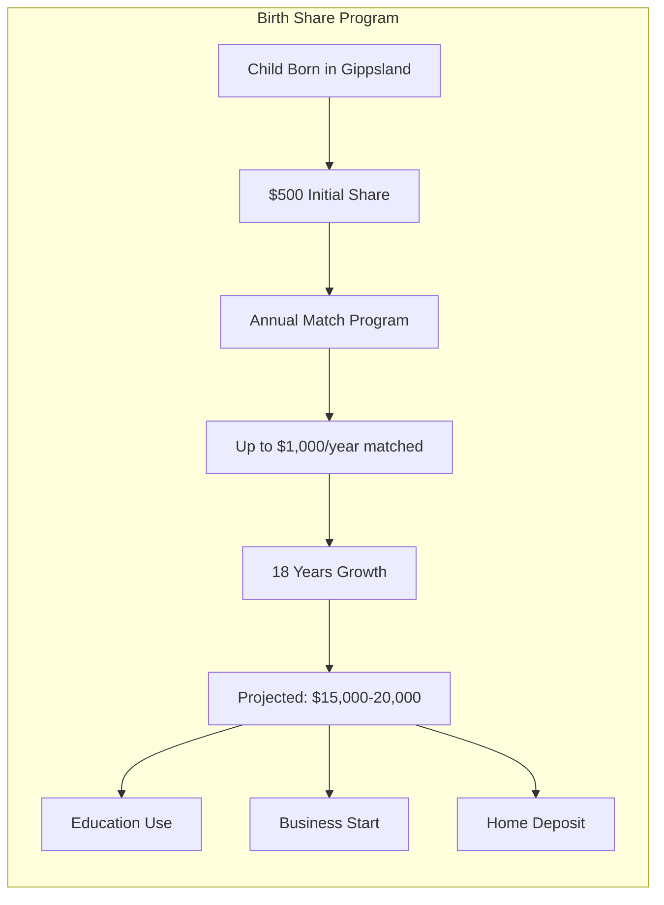

**Program Economics**

| Component | Value | Growth Rate | 18-Year Value |
|-----------|-------|-------------|---------------|
| **Initial Grant** | $500 | 6-8% p.a. | $1,500-2,000 |
| **Annual Match** | Up to $1,000 | 6-8% p.a. | $30,000-40,000 |
| **Dividend Reinvestment** | Variable | Compounding | $5,000-10,000 |
| **Total at 18** | | | **$36,500-52,000** |

### 5.2 Education-to-Career Pipelines

#### 🎓 Career Pathway Programs

**Structured Pathways**

| Pathway | Entry Point | Training | Outcome | Annual Cohort |
|---------|-------------|----------|---------|---------------|
| **Technical Track** | Year 10 | Trade training → Employment | Business ownership | 200 students |
| **Professional Track** | Year 12 | University → Graduate programs | Leadership roles | 150 students |
| **Entrepreneurial Track** | Any age | Ideas → Incubation | Scale-up success | 50 participants |

### 5.3 Youth Leadership Development

#### 🌟 Future Leaders Program

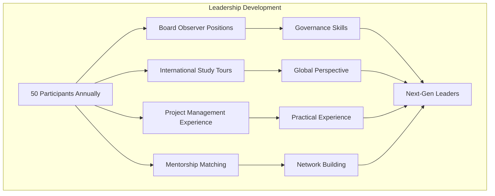

---

## 6. LEGACY FUND AND ENDOWMENT STRUCTURES

### 6.1 Gippsland Energy Transition Fund

#### 💰 Capital Structure

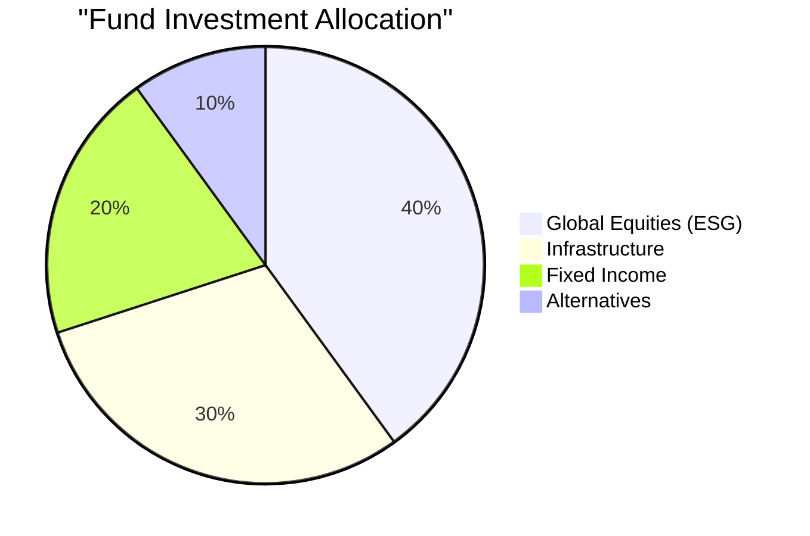

**Fund Parameters**

| Parameter | Target | Strategy |
|-----------|--------|----------|
| **Initial Capital** | $100M | From early project revenues |
| **Annual Contributions** | 1% of all revenues | Systematic growth |
| **Target Size** | $1B by 2040 | Conservative projection |
| **Investment Returns** | 8-10% p.a. | Diversified portfolio |
| **Distribution Rate** | 4% annually | Preserve real value |

### 6.2 Community Benefit Programs

#### 🎯 Annual Distribution Allocation

**Program Details**

| Category | Annual Funding | Key Programs | Beneficiaries |
|----------|---------------|--------------|---------------|
| **Education & Training** | $12M (30%) | Scholarships, school infrastructure | 5,000+ students |
| **Community Infrastructure** | $10M (25%) | Sports, cultural centres | Entire community |
| **Economic Development** | $10M (25%) | Business grants, innovation | 200+ enterprises |
| **Social Programs** | $8M (20%) | Health, aged care, emergency | Vulnerable groups |

### 6.3 Intergenerational Governance

#### 🏛️ 50-Year Vision Framework

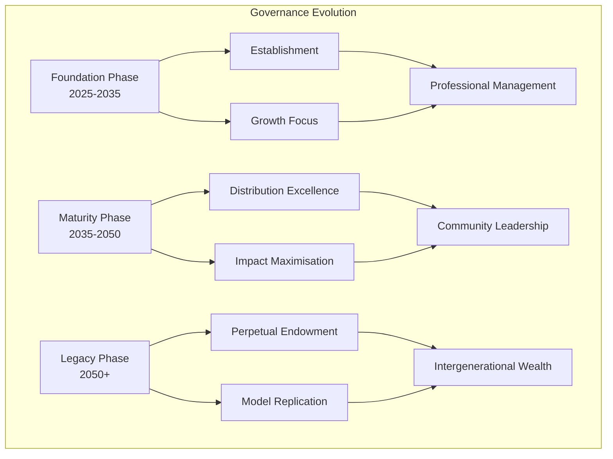

---

## 7. IMPLEMENTATION ROADMAP

### 7.1 Phased Implementation

#### 📅 Strategic Timeline

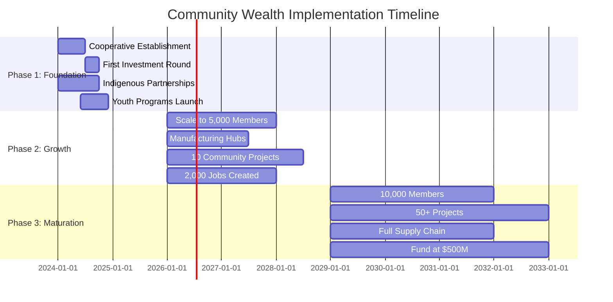

### 7.2 Investment Requirements

#### 💵 Capital Deployment Schedule

| Phase | Years | Capital Required | Expected Returns | Jobs Created |
|-------|-------|-----------------|------------------|--------------|
| **Foundation** | 2024-2025 | $20M | Establishment phase | 500 |
| **Growth** | 2026-2028 | $150M | 8-10% returns emerging | 2,000 |
| **Maturation** | 2029-2032 | $500M | 10-12% stable returns | 5,000 |
| **Legacy** | 2033+ | Self-sustaining | 12-15% mature returns | 8,000+ |

---

## 8. RISK MANAGEMENT AND MITIGATION

### 8.1 Risk Framework

#### ⚠️ Comprehensive Risk Matrix

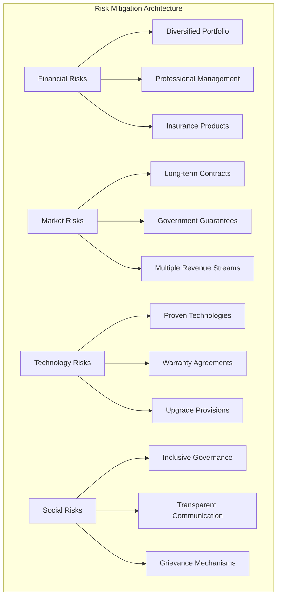

### 8.2 Mitigation Strategies

**Risk Response Plan**

| Risk Type | Impact | Likelihood | Mitigation | Monitoring |
|-----------|--------|------------|------------|------------|
| **Investment Loss** | High | Low | Diversification, insurance | Monthly |
| **Community Discord** | Medium | Medium | Engagement, transparency | Weekly |
| **Technology Obsolescence** | Medium | Low | Innovation fund, R&D | Quarterly |
| **Regulatory Change** | High | Medium | Government partnerships | Ongoing |

---

## 9. PERFORMANCE METRICS AND MONITORING

### 9.1 Key Performance Indicators

#### 📊 Dashboard Metrics

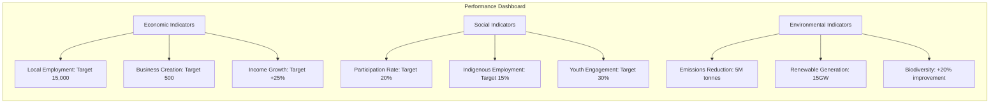

### 9.2 Reporting Framework

**Stakeholder Communication**

| Report Type | Frequency | Audience | Key Metrics |
|-------------|-----------|----------|-------------|
| **Financial Performance** | Monthly | Investors | Returns, NAV, distributions |
| **Community Impact** | Quarterly | Public | Jobs, businesses, participation |
| **Sustainability Report** | Annual | All stakeholders | ESG metrics, UN SDGs |
| **Youth Progress** | Semi-annual | Families, schools | Education, career outcomes |

---

## 💎 CONCLUSION

This Community Wealth Creation Strategy provides a comprehensive framework for ensuring Gippsland's renewable energy transition creates lasting local prosperity. By emphasising community ownership, local business development, Indigenous participation, and intergenerational wealth building, we can transform temporary project investments into permanent community assets.

### 🎯 Success Vision 2035

- **20,000 community investors** owning significant stakes in renewable assets
- **$5 billion annual economic activity** circulating locally
- **30,000 jobs** created directly and indirectly
- **1,000 new businesses** serving the renewable energy sector
- **$1 billion endowment fund** securing future prosperity
- **100% renewable energy** powering the region

### 🚀 Call to Action

The strategy's success depends on strong partnerships between communities, Traditional Owners, governments, and private developers. With proper implementation, Gippsland can become a global model for how renewable energy can drive equitable economic development and create prosperity that lasts for generations.

**Together, we power prosperity.**

---

**Document Control**
- **Version**: 2.0 Enhanced
- **Date**: January 2025
- **Status**: Ready for Implementation
- **Review**: Quarterly Updates
- **Distribution**: Public Document

---

*This living document will be updated regularly as the transition progresses and new opportunities emerge.*