# 💰 INTERNATIONAL FINANCE MOBILISATION STRATEGY FOR GIPPSLAND
## Unlocking $50B+ Global Climate and Development Finance

> **Version**: 2.0 Enhanced  
> **Date**: January 2025  
> **Status**: Ready for Implementation  
> **Target**: $50B+ international investment mobilisation  
> **Timeline**: 2025-2035

---

## 📊 EXECUTIVE SUMMARY

This International Finance Mobilisation Strategy presents a comprehensive framework to attract and deploy **$50+ billion** in international capital for Gippsland's renewable energy transformation. By leveraging multilateral development banks, export credit agencies, sovereign wealth funds, and climate finance mechanisms, we create a diversified funding structure that de-risks investment while maximising development impact.

### 🎯 Key Investment Sources

### 💵 Strategic Investment Portfolio

| Financing Source | Amount (US$B) | Lead Institutions | Key Features |
|------------------|---------------|-------------------|--------------|
| **Multilateral Development Banks** | $15.0B | World Bank, ADB, AIIB, EIB | Concessional rates, AAA credit |
| **Export Credit Agencies** | $12.0B | JBIC, K-EXIM, Euler Hermes | Technology transfer |
| **Sovereign Wealth Funds** | $10.0B | Norway GPFG, GIC/Temasek | Long-term equity |
| **Climate Finance** | $8.0B | GCF, Carbon Markets | Blended structures |
| **DFIs & Impact** | $5.0B | European DFIs, Pension Funds | Development mandate |

### 🌟 Strategic Advantages

---

## 1. MULTILATERAL DEVELOPMENT BANK ENGAGEMENT

### 1.1 World Bank Group Partnership

#### 💰 Investment Structure

**Total Commitment**: $5 Billion (2025-2030)

#### 🚀 Program Design: "Australia Renewable Energy Hub Program"

**Three-Phase Implementation**

| Phase | Period | Investment | Focus Area | Development Impact |
|-------|--------|------------|-------------|-------------------|
| **Phase 1** | 2025-2027 | $1.5B | Grid infrastructure backbone | 5,000 jobs |
| **Phase 2** | 2027-2029 | $2.0B | Green hydrogen facilities | 10,000 jobs |
| **Phase 3** | 2029-2030 | $1.5B | Regional connectivity | 5,000 jobs |

### 1.2 Asian Development Bank (ADB)

#### 🏭 Energy Transition Mechanism (ETM) Participation

### 1.3 Asian Infrastructure Investment Bank (AIIB)

#### 💡 Sustainable Infrastructure Program

**Investment Focus**: $3 Billion

| Investment Area | Allocation | Technology Focus | Expected Returns |
|----------------|------------|------------------|------------------|
| **Smart Grid Deployment** | $1.0B | Digital infrastructure | 8-10% IRR |
| **Renewable Generation** | $1.0B | Wind, solar, storage | 9-11% IRR |
| **Cross-border Transmission** | $750M | Regional connectivity | 7-9% IRR |
| **Innovation Infrastructure** | $250M | R&D facilities | 12-15% IRR |

### 1.4 European Investment Bank (EIB)

#### 🇪🇺 Global Gateway Initiative Alignment

---

## 2. EXPORT CREDIT AGENCY PARTNERSHIPS

### 2.1 Japan Bank for International Cooperation (JBIC)

#### 🇯🇵 Hydrogen Export Finance Package

**Total Facility**: $5 Billion

#### 🔬 GREEN Innovation Fund Co-investment

**Joint Investment Programme**

| Component | Investment | Focus | Expected Outcome |
|-----------|------------|--------|------------------|
| **Technology Deployment** | $300M | Electrolyser scaling | Cost reduction 50% |
| **R&D Facilities** | $100M | Joint innovation | 20 patents |
| **Pilot Projects** | $75M | Demonstration plants | Commercial viability |
| **Skills Exchange** | $25M | Training programmes | 500 specialists |

### 2.2 Korea Export-Import Bank (K-EXIM)

#### 🇰🇷 Green New Deal Partnership

### 2.3 European Export Credit Agencies

#### 🇩🇪 Euler Hermes (Germany) - Energiewende Package

**Commitment**: $2 Billion

| Technology Area | Investment | German Companies | Market Impact |
|----------------|------------|------------------|---------------|
| **Wind Turbines** | $800M | Siemens Gamesa | 2GW capacity |
| **Electrolyser Tech** | $600M | ThyssenKrupp | 1GW electrolysis |
| **Grid Infrastructure** | $400M | Siemens Energy | Smart grid upgrade |
| **Technical Training** | $200M | Multiple providers | 2,000 specialists |

---

## 3. SOVEREIGN WEALTH FUND ATTRACTION

### 3.1 Norway Government Pension Fund Global (GPFG)

#### 🇳🇴 Renewable Infrastructure Mandate Alignment

**Target Allocation**: $4 Billion

### 3.2 Singapore Investment Vehicles

#### 🇸🇬 Dual Investment Platform

**Combined Allocation**: $4.5 Billion

| Institution | Investment | Focus | Structure |
|-------------|------------|-------|-----------|
| **GIC Private** | $3.0B | Infrastructure equity | Direct ownership |
| **Temasek Holdings** | $1.5B | Technology ventures | Growth capital |

### 3.3 Middle East Sovereign Funds

#### 🏜️ Strategic Energy Partnerships

---

## 4. CLIMATE FINANCE MECHANISMS

### 4.1 Green Climate Fund (GCF)

#### 🌍 Transformational Programme Design

**Total Request**: $2 Billion

**Programme Components**

| Window | Allocation | Focus | Impact Target |
|--------|------------|-------|---------------|
| **Just Transition** | $500M | Worker retraining, community development | 20,000 beneficiaries |
| **Innovation Facility** | $600M | First-of-kind technology deployment | 5 breakthrough technologies |
| **Adaptation Co-benefits** | $400M | Climate resilience infrastructure | 2M people protected |
| **Gender Action** | $500M | Women in renewable energy | 40% female participation |

### 4.2 International Carbon Markets

#### 💨 Article 6 Mechanisms

**Revenue Potential**: $3 Billion (2025-2035)

**International Buyer Agreements**

| Country | Credits (M) | Price Range | Total Value | Contract Term |
|---------|-------------|-------------|-------------|---------------|
| **Switzerland** | 20 | $80-120/tonne | $2.0B | 10 years |
| **Japan** | 30 | $70-100/tonne | $2.6B | 15 years |
| **South Korea** | 25 | $60-90/tonne | $1.9B | 12 years |
| **Singapore** | 15 | $75-110/tonne | $1.4B | 8 years |

### 4.3 Green Bond Markets

#### 📈 International Bond Programme

```mermaid
timeline
    title Green Bond Issuance Schedule
    
    section 2025
        USD Green Bond    : $1.5B
                           : 10-year maturity
                           : Treasury + 150bps
    
    section 2026
        EUR Sustainability : €1B
                           : 15-year maturity
                           : Bund + 175bps
    
    section 2027
        Samurai Green     : ¥100B
                          : 20-year maturity
                          : JGB + 125bps
```

---

## 5. DEVELOPMENT FINANCE INSTITUTIONS (DFIs)

### 5.1 European DFI Consortium

#### 🇪🇺 Coordinated DFI Approach

**Partners & Allocation**

| DFI | Country | Commitment | Focus Area |
|-----|---------|------------|------------|
| **DEG** | Germany | $500M | Industrial development |
| **Proparco** | France | $400M | Infrastructure finance |
| **CDP** | Italy | $350M | Green technology |
| **FMO** | Netherlands | $350M | SME development |
| **Norfund** | Norway | $400M | Climate investments |

### 5.2 Blended Finance Structures

#### 🔄 Risk-Return Optimisation

### 5.3 Impact Investment Platforms

#### 📊 Global Renewable Energy Fund

**Fund Architecture**

| Investor Category | Commitment | Motivation | Expected Return |
|-------------------|------------|------------|-----------------|
| **European Pensions** | $600M | Climate alignment | 8-10% |
| **US Endowments** | $300M | ESG mandates | 10-12% |
| **Family Offices** | $300M | Impact + returns | 12-15% |
| **Foundations** | $300M | Mission alignment | 6-8% |

---

## 6. CURRENCY HEDGING AND RISK MANAGEMENT

### 6.1 Natural Hedge Strategy

#### 💱 Currency Flow Optimisation

### 6.2 Multilateral Guarantee Structures

#### 🛡️ Comprehensive Risk Mitigation

**MIGA Coverage**: $2 Billion

| Risk Type | Coverage | Premium | Benefit |
|-----------|----------|---------|---------|
| **Expropriation** | $800M | 0.5-1.5% | Investment protection |
| **Currency Transfer** | $500M | 0.3-0.8% | Repatriation guarantee |
| **War & Civil Disturbance** | $400M | 0.8-2.0% | Political stability |
| **Breach of Contract** | $300M | 0.5-1.2% | Government compliance |

### 6.3 Local Currency Solutions

#### 🏦 AUD Financing Development

---

## 7. IMPLEMENTATION ROADMAP

### 7.1 Quick Wins (Q1-Q2 2025)

#### ⚡ Immediate Priority Actions

### 7.2 Execution Timeline

#### 📅 Five-Year Deployment Schedule

### 7.3 Institutional Framework

#### 🏢 Gippsland International Finance Unit

**Organisation Structure**

| Role | Responsibilities | Team Size |
|------|------------------|-----------|
| **Executive Director** | Strategic leadership, MDB relations | 1 |
| **MDB Relations Team** | Multilateral engagement | 5 |
| **ECA Partnership Team** | Export credit coordination | 4 |
| **Capital Markets Team** | Bond issuance, private placement | 6 |
| **Risk Management Team** | Currency, political, commercial risk | 4 |
| **Legal & Structuring** | Documentation, compliance | 6 |

---

## 8. PERFORMANCE MONITORING

### 8.1 KPI Dashboard

#### 📊 Financial & Development Metrics

### 8.2 Reporting Framework

#### 📋 Stakeholder Communication

| Report Type | Frequency | Audience | Key Content |
|-------------|-----------|----------|-------------|
| **Financial Dashboard** | Monthly | Management, Board | Progress vs targets |
| **Investor Updates** | Quarterly | All financiers | Performance, pipeline |
| **Development Impact** | Semi-annual | MDBs, DFIs | Jobs, emissions, access |
| **Annual Review** | Annual | Public | Comprehensive assessment |

---

## 💎 CONCLUSION

This International Finance Mobilisation Strategy positions Gippsland to secure **$50+ billion** in global climate and development finance through systematic engagement with multilateral development banks, export credit agencies, sovereign wealth funds, and climate finance mechanisms.

### 🎯 Success Factors

| Factor | Description | Impact |
|--------|-------------|---------|
| **Government Support** | Strong policy backing | AAA credit enhancement |
| **Export Revenue** | $125B contracted sales | Natural hedge, repayment certainty |
| **Climate Alignment** | Paris Agreement compatible | MDB mandate fit |
| **Development Impact** | 45,000 jobs, transformation | DFI mission alignment |
| **Risk Management** | Comprehensive mitigation | Investment grade execution |

### 🚀 Next Steps

**Immediate Priorities (Q1 2025)**
1. Submit World Bank Country Partnership Framework amendment
2. Finalise JBIC hydrogen export finance MOU  
3. Submit Green Climate Fund concept note
4. Host Norway GPFG investment delegation
5. Appoint green bond arrangers

### 📈 Expected Outcomes

By end-2025, we target **$20 billion** in committed funding, providing the foundation for full programme deployment. The combination of strong government support, contracted export revenues, and alignment with global climate mandates creates an unprecedented investment opportunity delivering both financial returns and transformational development impact.

---

**Document Control**
- **Version**: 2.0 Enhanced
- **Date**: January 2025  
- **Classification**: Strategic Finance
- **Review**: Quarterly
- **Distribution**: Controlled

---

*This document represents a ready-to-execute framework for mobilising international finance for Gippsland's renewable energy transformation.*