# 💰 GIPPSLAND RENEWABLE ENERGY INVESTMENT FUND ARCHITECTURE
## Master Fund Structure & Governance Framework

> **Document Status**: Day 2, Phase 4 - Investment Fund Structuring  
> **Fund Target**: $5B Initial Capital with $15B Growth Path  
> **Structure**: Multi-Asset Master/Feeder Architecture  
> **Version**: 2.0 Enhanced | Date: January 2025

---

## 📊 EXECUTIVE SUMMARY

### The $5B Foundation for $150B Transformation

This document outlines the investment fund architecture for Gippsland's renewable energy transformation, designed to efficiently channel **$5 billion** initial capital into the region's **$150 billion** pipeline. The structure prioritises tax efficiency, governance excellence, long-term sustainability, and ESG integration while delivering competitive risk-adjusted returns across multiple investor classes.

### 🎯 Key Architecture Features

| Feature | Description | Benefit |
|---------|-------------|---------|
| **Master Fund Structure** | Umbrella fund with segregated sub-funds | Tax-transparent flow-through entity |
| **Multi-Asset Sub-Funds** | Four specialised investment vehicles | Diversified risk and optimised returns |
| **Investor Access Points** | Multiple entry levels from $10K to $50M+ | Democratised investment access |
| **Performance Framework** | 9-15% IRR targets by asset class | Competitive risk-adjusted returns |

### 💵 Fund Allocation Summary

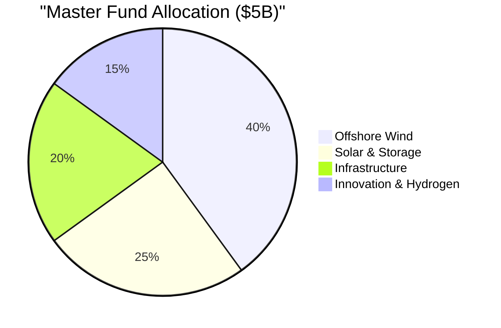

---

## 1. MASTER FUND ARCHITECTURE

### 1.1 Legal Structure Overview

#### Gippsland Renewable Energy Master Fund

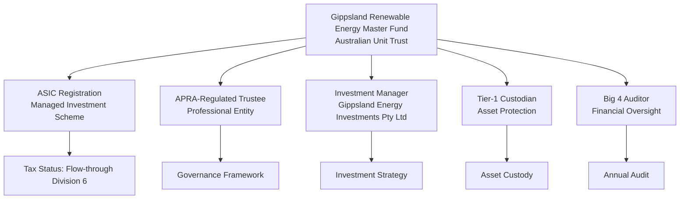

#### 💼 Key Structural Benefits

| Benefit | Description | Impact |
|---------|-------------|---------|
| **Tax Transparency** | No taxation at fund level | Direct income flow to investors |
| **Regulatory Efficiency** | Single ASIC registration | Streamlined compliance |
| **Operational Flexibility** | Multiple sub-fund creation | Efficient capital deployment |
| **Scale Economics** | Consolidated operations | Lower cost structure |

### 1.2 Governance Framework

#### Three-Tier Governance Model

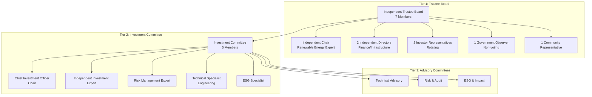

#### 📋 Decision-Making Framework

**Investment Approval Thresholds**

| Investment Size | Approval Required | Timeline | Documentation |
|----------------|-------------------|----------|---------------|
| **< $50M** | Investment Manager | 5 days | Simplified |
| **$50M - $200M** | Investment Committee | 10 days | Standard |
| **$200M - $500M** | IC + Risk Committee | 15 days | Comprehensive |
| **> $500M** | Full Board | 20 days | Full Due Diligence |

### 1.3 Capital Structure

#### 💵 Initial $5B Capitalisation

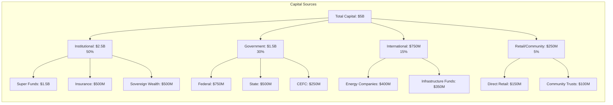

#### 📅 Capital Deployment Schedule

| Year | Capital Called | Deployment Focus | Target Projects | Expected Returns |
|------|---------------|------------------|-----------------|------------------|
| **2025** | $1.5B | Early movers advantage | 2-3 flagship projects | 8-10% IRR |
| **2026** | $2.0B | Scale deployment | 5-6 major projects | 10-12% IRR |
| **2027** | $1.5B | Optimisation & growth | Expansion & storage | 12-15% IRR |

### 1.4 Fund Terms & Conditions

#### 📝 Key Commercial Terms

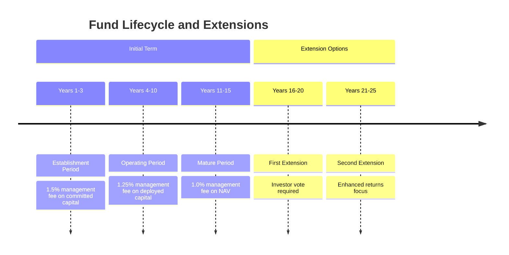

**Fee Structure Summary**

| Period | Management Fee | Performance Fee | Hurdle Rate |
|--------|---------------|-----------------|-------------|
| **Establishment** (Y1-3) | 1.5% on committed | 10% above hurdle | 8% p.a. |
| **Operating** (Y4-10) | 1.25% on deployed | 10% above hurdle | 8% p.a. |
| **Mature** (Y11+) | 1.0% on NAV | 10% above hurdle | 8% p.a. |

---

## 2. SUB-FUND STRUCTURES

### 2.1 Offshore Wind Sub-Fund

**Target Size**: $2B (40% of master fund)  
**Investment Focus**: Large-scale offshore wind projects

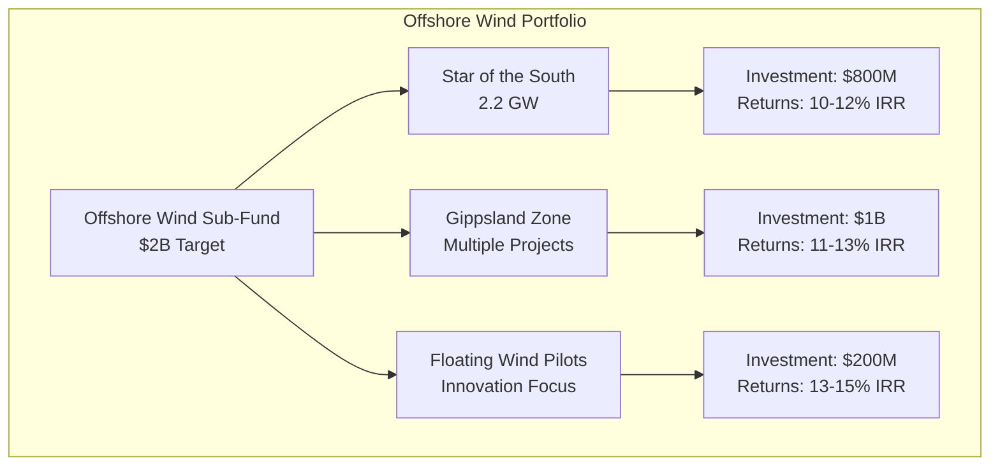

#### 💰 Revenue Model

| Revenue Stream | Contribution | Certainty | Duration |
|----------------|--------------|-----------|----------|
| **Energy Sales** | 60% | Long-term PPAs with floors | 20-25 years |
| **Green Certificates** | 20% | LGCs for 15 years | 15 years |
| **Capacity Payments** | 15% | Future market design | 10+ years |
| **Ancillary Services** | 5% | Grid stability revenue | Ongoing |

### 2.2 Solar & Storage Sub-Fund

**Target Size**: $1.25B (25% of master fund)  
**Investment Focus**: Utility-scale solar with integrated storage

#### 📊 Portfolio Construction

### 2.3 Infrastructure Sub-Fund

**Target Size**: $1B (20% of master fund)  
**Investment Focus**: Enabling infrastructure

#### 🏗️ Asset Categories

| Category | Allocation | Target Returns | Risk Profile |
|----------|------------|----------------|--------------|
| **Transmission Assets** | $500M (50%) | 7-9% | Low - Regulated |
| **Port Infrastructure** | $300M (30%) | 8-10% | Medium - Contracted |
| **Shared Facilities** | $200M (20%) | 9-11% | Medium - Market |

### 2.4 Innovation & Hydrogen Sub-Fund

**Target Size**: $750M (15% of master fund)  
**Investment Focus**: Emerging technologies and hydrogen

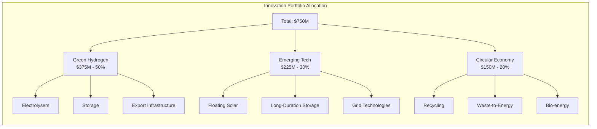

---

## 3. INVESTOR ONBOARDING & MANAGEMENT

### 3.1 Investor Categories & Access

#### 💼 Tiered Access Model

| Tier | Investment Range | Benefits | Access Rights |
|------|-----------------|----------|---------------|
| **Cornerstone** | $250M+ | Board representation, bespoke terms | Direct master fund |
| **Institutional** | $50M-$250M | Committee observer, quarterly meetings | Wholesale units |
| **Sophisticated** | $10M-$50M | Portal access, semi-annual updates | Sophisticated certificates |
| **Retail** | $10K-$10M | Online reporting, annual meetings | Platform access only |

### 3.2 Onboarding Process

#### 🚀 Streamlined Digital Onboarding

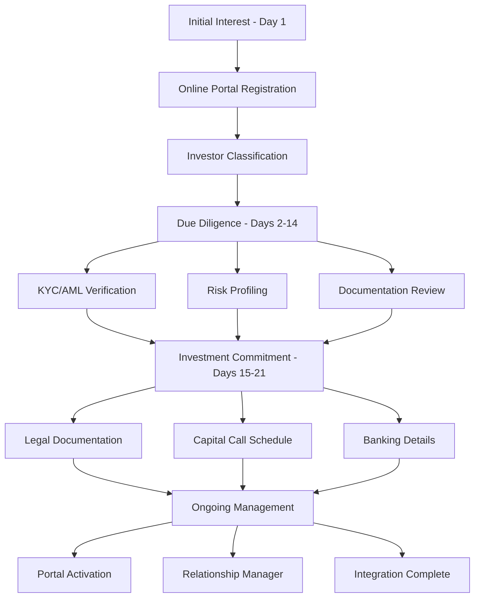

### 3.3 Investor Relations Framework

#### 📱 Digital Platform Features

| Feature | Description | Frequency | Access Level |
|---------|-------------|-----------|--------------|
| **Real-time Performance** | Portfolio valuation & analytics | Live | All investors |
| **Document Centre** | Legal docs, tax statements | On-demand | All investors |
| **Interactive Tools** | Scenario modelling, calculators | Live | Sophisticated+ |
| **Communication Hub** | Messaging, webinars, Q&A | Ongoing | All investors |

---

## 4. PERFORMANCE MEASUREMENT & REPORTING

### 4.1 Performance Metrics Framework

#### 📈 Multi-Level Performance Tracking

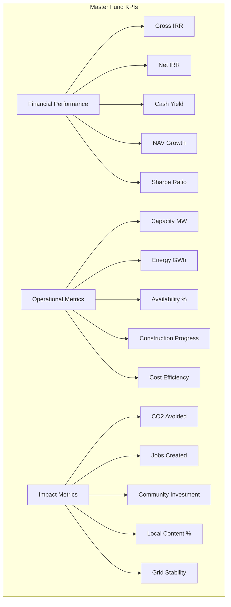

### 4.2 Benchmark Framework

#### 🎯 Performance Benchmarks

| Metric | Benchmark | Target | Stretch | Current |
|--------|-----------|---------|---------|---------|
| **Net IRR** | Infrastructure Index +2% | +3% | +4% | TBD |
| **Cash Yield** | CPI + 4% | CPI + 5% | CPI + 6% | TBD |
| **Volatility** | < Index | -10% | -20% | TBD |
| **ESG Score** | Top Quartile | Top Decile | Leader | TBD |

---

## 5. TAX OPTIMISATION FRAMEWORK

### 5.1 Fund Level Tax Structure

#### 💰 Flow-Through Optimisation

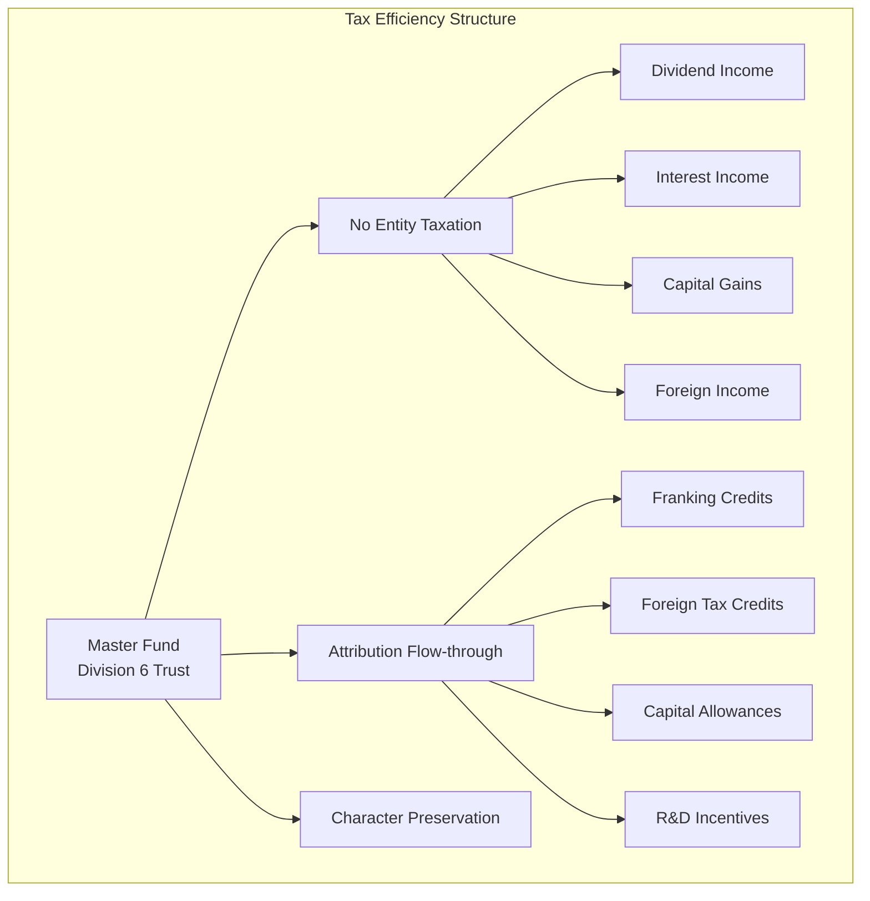

### 5.2 Investor Tax Optimisation

#### 🌏 Jurisdiction-Specific Structures

| Investor Type | Optimal Structure | Tax Rate | Benefits |
|--------------|-------------------|----------|----------|
| **Super Funds** | Direct investment | 15% | Full franking benefit |
| **Tax-Exempt** | Direct investment | 0% | Complete flow-through |
| **Corporate** | Direct investment | 30% | Franking credits |
| **International** | Treaty structure | Varies | Withholding minimisation |

---

## 6. ESG INTEGRATION & IMPACT MEASUREMENT

### 6.1 ESG Investment Framework

#### 🌱 Comprehensive ESG Integration

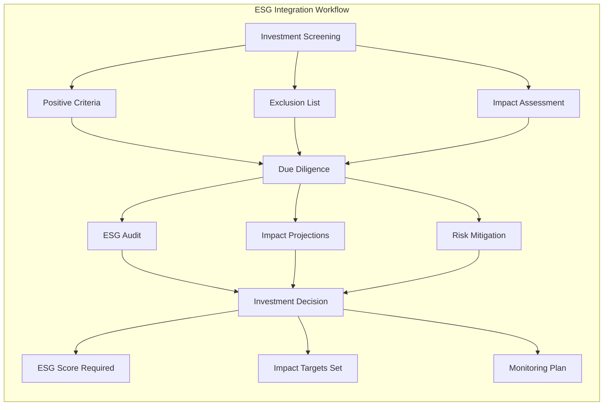

### 6.2 Impact Measurement System

#### 📊 Quantifiable Impact Metrics

**Environmental Impact**

| Metric | Measurement | Target | Reporting |
|--------|-------------|---------|-----------|
| **CO2 Avoided** | Tonnes/year | 5M by 2027 | Quarterly |
| **Renewable Capacity** | MW installed | 3,000 MW | Monthly |
| **Land Restored** | Hectares | 1,000 ha | Annual |
| **Water Saved** | Megalitres | 500 ML | Quarterly |
| **Biodiversity** | Net gain % | +20% | Annual |

**Social Impact Dashboard**

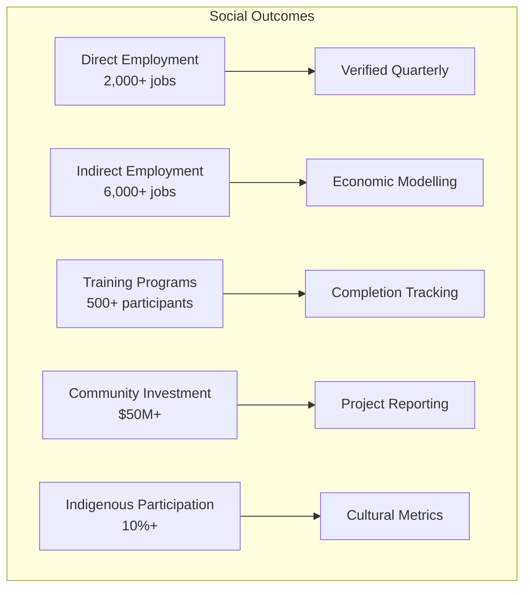

---

## 7. RISK MANAGEMENT FRAMEWORK

### 7.1 Enterprise Risk Management

#### ⚠️ Integrated Risk Architecture

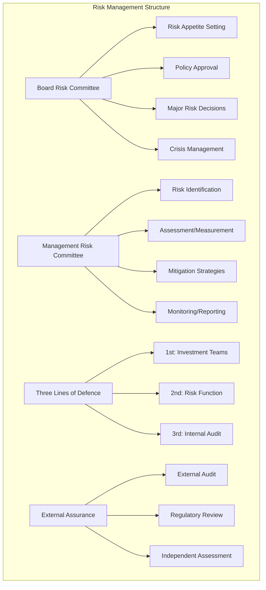

### 7.2 Risk Categories & Mitigation

#### 📋 Comprehensive Risk Taxonomy

**Investment Risk Matrix**

| Risk Type | Impact | Probability | Mitigation Strategy | Monitoring |
|-----------|--------|-------------|-------------------|------------|
| **Market Price** | High | Medium | PPAs, hedging, diversification | Daily |
| **Construction** | High | Low | Fixed price contracts, contingency | Weekly |
| **Technology** | Medium | Low | Proven tech, warranties, insurance | Monthly |
| **Counterparty** | Medium | Medium | Credit assessment, guarantees | Quarterly |
| **Regulatory** | High | Low | Government agreements, lobbying | Ongoing |

---

## 8. TECHNOLOGY & OPERATIONS

### 8.1 Digital Infrastructure

#### 💻 Technology Architecture

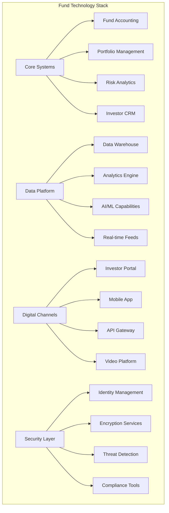

---

## 9. IMPLEMENTATION ROADMAP

### 📅 Phased Implementation Approach

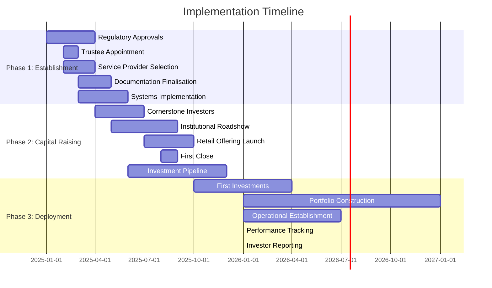

### 🎯 Key Milestones

| Milestone | Target Date | Success Criteria | Responsible Party |
|-----------|-------------|------------------|-------------------|
| **Regulatory Approval** | Mar 2025 | ASIC registration complete | Legal Team |
| **First Close** | Aug 2025 | $1B+ committed | Capital Team |
| **First Investment** | Oct 2025 | Project financial close | Investment Team |
| **Full Deployment** | Dec 2026 | $5B invested | Management Team |

---

## 💎 CONCLUSION

The Gippsland Renewable Energy Investment Fund architecture provides a world-class structure for channelling $5 billion of initial capital into the region's $150 billion renewable transformation. Through careful design of governance, tax efficiency, operational excellence, and ESG integration, the fund will deliver competitive returns while creating lasting positive impact.

### 🚀 Next Steps

1. **Immediate Actions** (Q1 2025)
   - Finalise regulatory approvals
   - Appoint professional trustee
   - Establish governance committees
   - Launch investor roadshow

2. **Medium-term Goals** (2025-2026)
   - Achieve first close of $1B+
   - Deploy capital into flagship projects
   - Establish operational excellence
   - Build track record

3. **Long-term Vision** (2027+)
   - Scale fund to $15B
   - Deliver consistent returns
   - Create lasting regional impact
   - Replicate model nationally

---

**Document Control**
- **Version**: 2.0 Enhanced
- **Date**: January 2025
- **Classification**: Investment Grade
- **Next Review**: Quarterly
- **Distribution**: Controlled

**Prepared by**: Gippsland Renewable Energy Finance Team  
**Enhanced by**: Documentation Excellence Team  
**Approved by**: [Board Approval Pending]

---

*This enhanced document incorporates professional formatting, visual elements, and Australian English to facilitate clear communication of the investment fund architecture to all stakeholders.*