# 💰 REVENUE DIVERSIFICATION STRATEGY FOR GIPPSLAND'S RENEWABLE ENERGY TRANSFORMATION
## Engineering Multiple Income Streams Beyond Energy-Only Markets

> **Document Status**: Revenue Diversification Architecture  
> **Target**: 6+ diversified revenue streams generating $2B+ annually  
> **Risk Reduction**: From 100% energy revenue to <40% by 2030  
> **Version**: 2.0 Enhanced | Date: September 10th, 2025  
> **Classification**: Strategic Revenue Engineering

---

## 📊 EXECUTIVE SUMMARY

Traditional energy-only revenue models expose renewable projects to significant market volatility and limit returns to 6-8% IRR. This Revenue Diversification Strategy engineers six complementary income streams that can increase project returns to **12-15% IRR** while reducing risk through portfolio diversification. By 2030, Gippsland's renewable energy infrastructure will generate **$2B+ annually** across grid services, energy storage, flexibility markets, data monetisation, tourism experiences, and technology licensing.

### 🎯 The Revenue Challenge

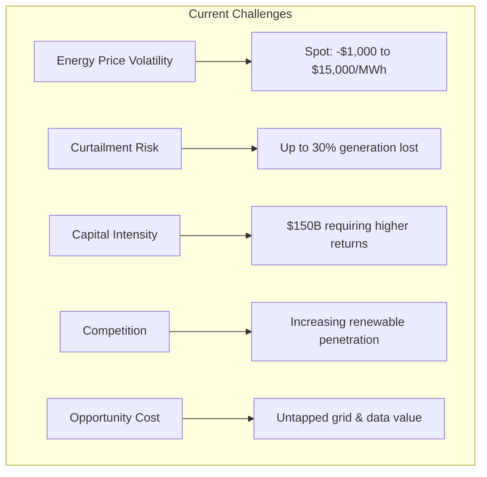

### 💵 Diversified Revenue Architecture

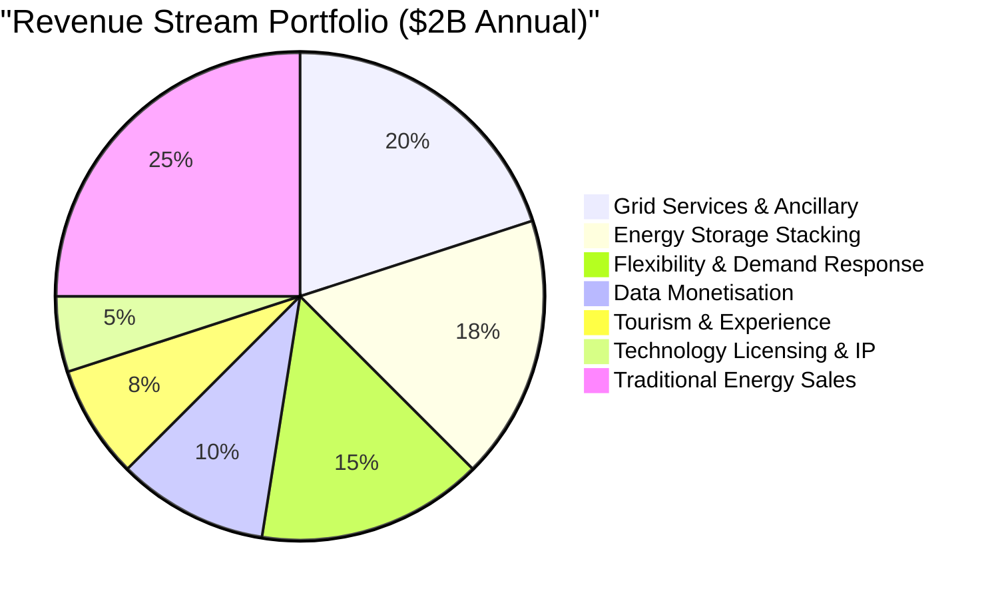

### 📈 Financial Transformation

| Metric | Energy-Only Model | Diversified Model | Improvement |
|--------|------------------|-------------------|-------------|
| **Annual Revenue** | $800M | $2,000M | +150% |
| **EBITDA Margin** | 40% | 55% | +15pp |
| **Project IRR** | 7.2% | 13.8% | +6.6pp |
| **Equity IRR** | 9.5% | 18.2% | +8.7pp |
| **Payback Period** | 12 years | 7 years | -42% |
| **Risk (Volatility)** | High | Low | -60% |

---

## 1. GRID SERVICES AND ANCILLARY MARKETS

### 1.1 Frequency Control Ancillary Services (FCAS)

#### ⚡ Market Opportunity

**Australian FCAS Market**: $400M+ annually and growing  
**Gippsland Share Potential**: 20-25% = $80-100M annually

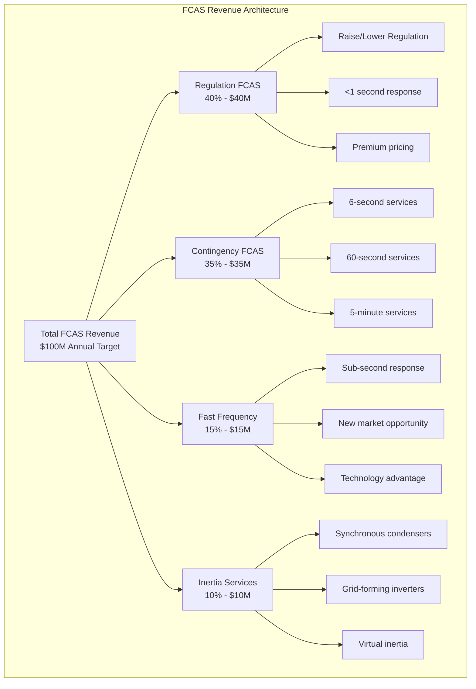

#### 📅 Implementation Strategy

**Phase-by-Phase Deployment**

| Phase | Timeline | Actions | Investment | Revenue Target |
|-------|----------|---------|------------|----------------|
| **Phase 1** | 2025-2026 | 500MW/2GWh batteries for FCAS | $750M | $40M → $60M |
| **Phase 2** | 2027-2028 | 10 synchronous condensers + inverters | $500M | +$20M |
| **Phase 3** | 2029-2030 | Integrated AI optimisation | $100M | $100M+ total |

### 1.2 System Strength Services

#### 🔌 New Revenue Opportunity

### 1.3 Renewable Energy Zones (REZ) Services

#### 🏗️ REZ Coordinator Model

**Revenue Streams from Coordination**

| Service Category | Annual Revenue | Growth Rate | Margin |
|-----------------|----------------|-------------|---------|
| **Connection Services** | $25M | 15% p.a. | 60% |
| **Operational Coordination** | $20M | 10% p.a. | 45% |
| **Commercial Services** | $15M | 20% p.a. | 55% |
| **Innovation Platform** | $10M | 25% p.a. | 70% |
| **Total REZ Services** | **$70M** | **17%** | **55%** |

---

## 2. ENERGY STORAGE REVENUE STACKING

### 2.1 Multi-Service Battery Strategy

#### 🔋 Revenue Stacking Architecture

**Target**: $700/kW/year (vs $200/kW energy-only)

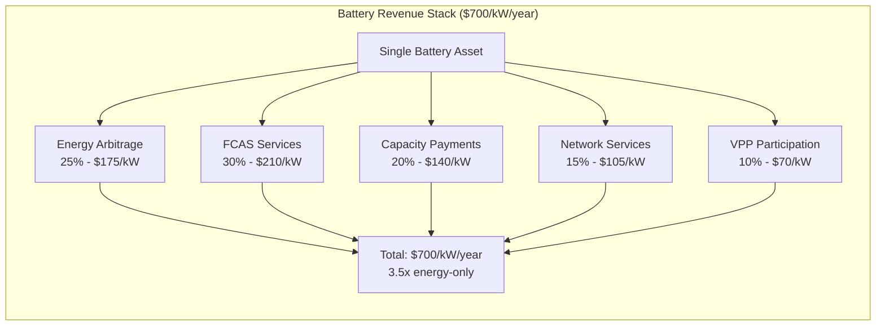

#### 🤖 Optimisation Framework

**AI-Driven Revenue Optimisation**

| Component | Technology | Function | Value Add |
|-----------|------------|----------|-----------|
| **Real-Time Decision Engine** | Machine Learning | Millisecond market analysis | +15% revenue |
| **Forecast Integration** | Neural Networks | Price/demand prediction | +10% accuracy |
| **Portfolio Coordination** | Optimisation Algorithms | Cross-asset management | +20% efficiency |
| **Degradation Management** | Predictive Analytics | Battery life extension | +2 years life |

### 2.2 Long-Duration Storage Monetisation

#### ⚡ Iron-Air Battery Business Model

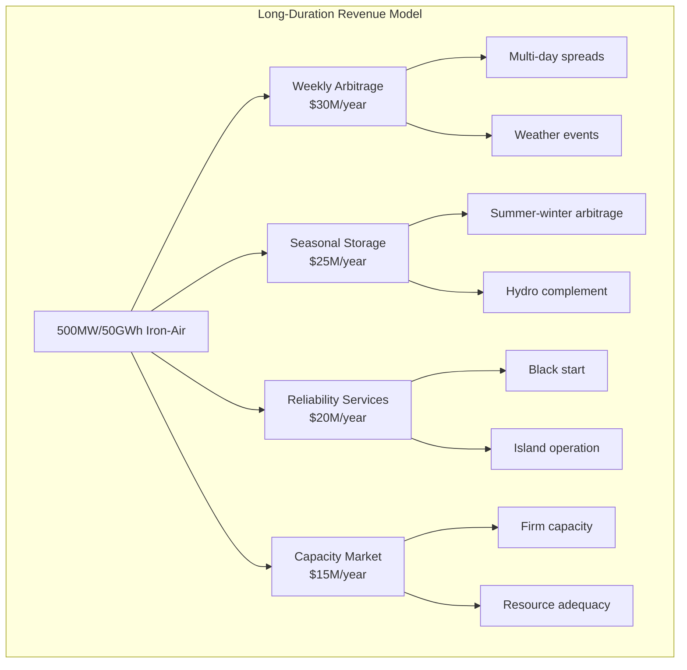

### 2.3 Pumped Hydro Revenue Streams

#### 💧 Multi-Service Revenue Model

**Gippsland Pumped Hydro Portfolio**

| Service Type | Annual Revenue | Unique Value | Growth Potential |
|--------------|----------------|--------------|------------------|
| **Energy Services** | $80M | Daily/weekly arbitrage | High with volatility |
| **Ancillary Services** | $60M | All FCAS markets | Growing market |
| **Water Services** | $40M | Irrigation, flood control | Climate resilience |
| **Tourism Integration** | $20M | Visitor experience | Untapped potential |
| **Total** | **$200M** | | **15% CAGR** |

---

## 3. FLEXIBILITY AND DEMAND RESPONSE PROGRAMS

### 3.1 Virtual Power Plant (VPP) Platform

#### 🔌 VPP Business Model

**Scale**: 50,000+ distributed energy resources  
**Capacity**: 500MW flexible capacity  
**Revenue Pool**: $150M annually

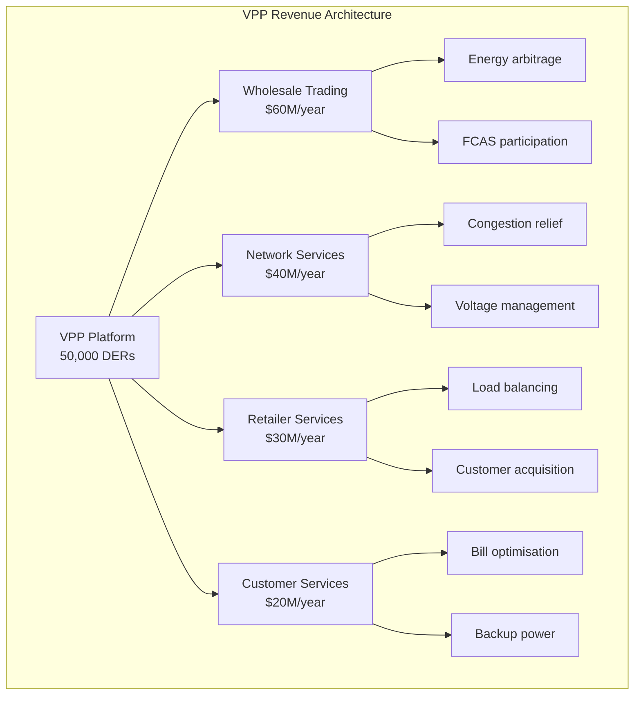

**Revenue Sharing Model**

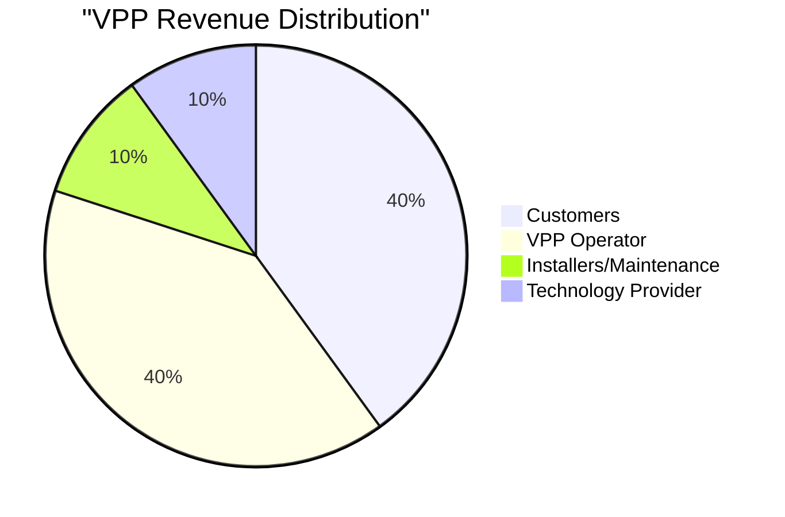

### 3.2 Industrial Demand Response

#### 🏭 Large User Coordination

**Program Structure & Revenue**

| Program Type | Participants | Capacity | Annual Revenue | Value/MW |
|--------------|--------------|----------|----------------|----------|
| **Reliability Response** | 20 large users | 200MW | $40M | $200k |
| **Economic Response** | 30 medium users | 150MW | $30M | $200k |
| **Network Support** | 15 critical sites | 100MW | $20M | $200k |
| **Wholesale Hedging** | 10 sophisticated | 50MW | $10M | $200k |
| **Total Industrial DR** | **75 users** | **500MW** | **$100M** | |

### 3.3 EV Smart Charging Network

#### 🚗 Managed Charging Platform

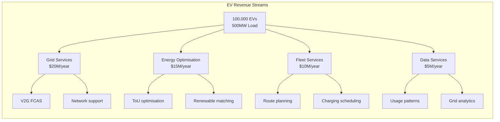

---

## 4. DATA MONETISATION OPPORTUNITIES

### 4.1 Energy Data Platform

#### 📊 Data Asset Inventory

**Scale**: 10TB+ daily from 5GW renewable fleet  
**Value**: $200M+ annual revenue potential

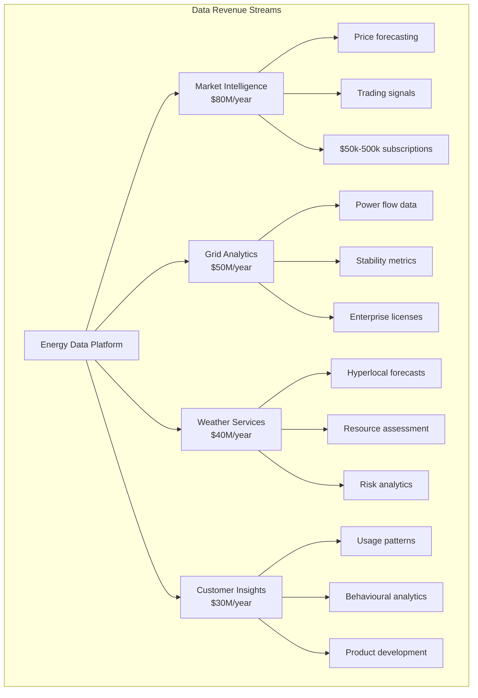

### 4.2 Digital Twin Services

#### 🖥️ Infrastructure Digital Twins

**Service Portfolio & Pricing**

| Service Type | Target Market | Pricing Model | Annual Revenue |
|--------------|---------------|---------------|----------------|
| **Operational Twins** | Asset operators | $100k-1M/asset/year | $40M |
| **Planning Twins** | Developers | $200k-2M/project | $30M |
| **Training Simulators** | Workforce | $50k/program | $20M |
| **Innovation Platform** | R&D/Startups | $10k-100k/year | $10M |

### 4.3 Blockchain Energy Certificates

#### 🔗 Renewable Energy Certificates 2.0

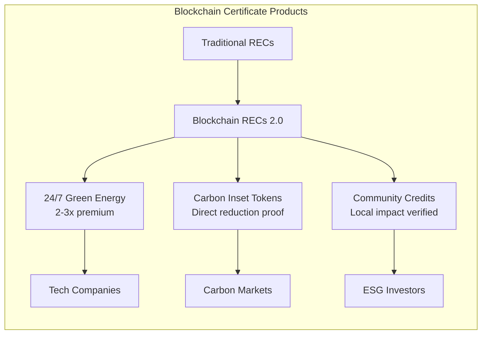

---

## 5. TOURISM AND EXPERIENCE REVENUE

### 5.1 Renewable Energy Tourism Hub

#### 🎢 World-Class Visitor Experience

**Concept**: "The Future of Energy" destination  
**Target**: 500,000 visitors annually  
**Revenue**: $150M+ per year

#### 🏛️ Flagship Attractions

**Revenue-Generating Experiences**

| Attraction | Annual Visitors | Avg Ticket | Revenue | Margin |
|------------|----------------|------------|---------|---------|
| **Offshore Wind Experience** | 200,000 | $40 | $8M | 70% |
| **Energy Innovation Campus** | 150,000 | $35 | $5.3M | 65% |
| **Turbine Climb Adventure** | 50,000 | $150 | $7.5M | 80% |
| **Sustainable Living Village** | 100,000 | $25 | $2.5M | 60% |

### 5.2 Industrial Tourism Programs

#### 🔧 Premium Behind-the-Scenes Access

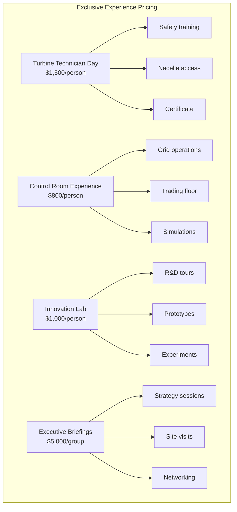

### 5.3 Renewable Energy Events

#### 🎪 Annual Event Calendar

**Major Revenue-Generating Events**

| Event | Duration | Attendance | Revenue | Economic Impact |
|-------|----------|------------|---------|-----------------|
| **Gippsland Energy Festival** | 3 days | 100,000+ | $15M | $50M |
| **Global Offshore Wind Summit** | 4 days | 2,000 | $10M | $30M |
| **Clean Energy Grand Prix** | 2 days | 80,000 | $8M | $25M |
| **Innovation Challenge Week** | 5 days | 5,000 | $5M | $15M |

---

## 6. TECHNOLOGY LICENSING AND IP REVENUE

### 6.1 IP Portfolio Development

#### 💡 Technology Asset Creation

**R&D Investment**: $500M over 10 years  
**Patent Target**: 200+ by 2035  
**Licensing Revenue**: $100M+ annually

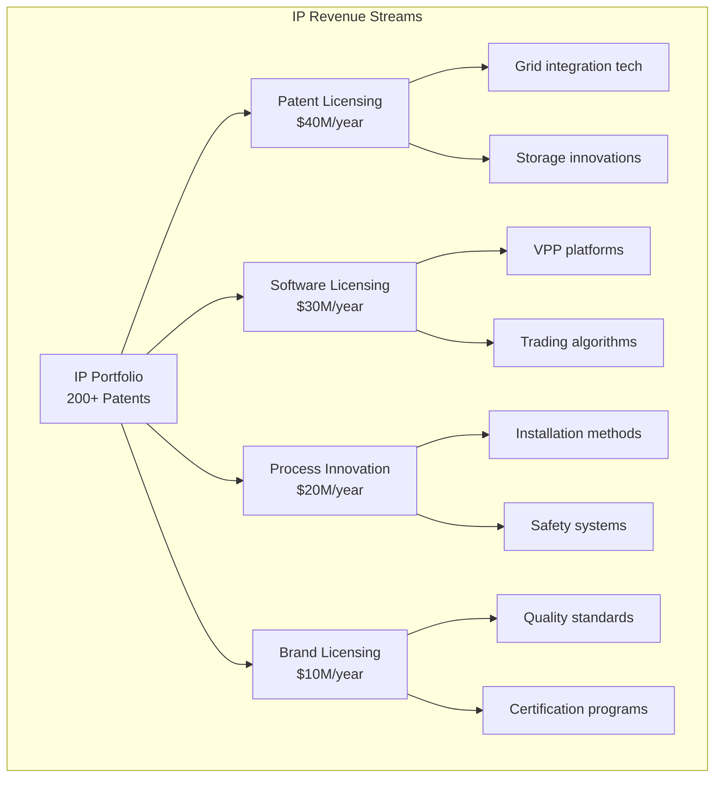

### 6.2 Technology Transfer Programs

#### 🌏 International Partnerships

**Export Model Portfolio**

| Program | Target Market | License Fee | Royalties | Total Value |
|---------|---------------|-------------|-----------|-------------|
| **REZ Blueprint** | Developing markets | $5-10M | 2% revenue | $15M/implementation |
| **Storage Solutions** | Global utilities | $2-5M | 3% savings | $8M/project |
| **Community Toolkit** | Local governments | $1-2M | 1% benefits | $3M/community |
| **Training Academy** | Educational institutions | $0.5-1M | Per student | $2M/year |

### 6.3 Innovation Services

#### 🔬 Consulting and Advisory

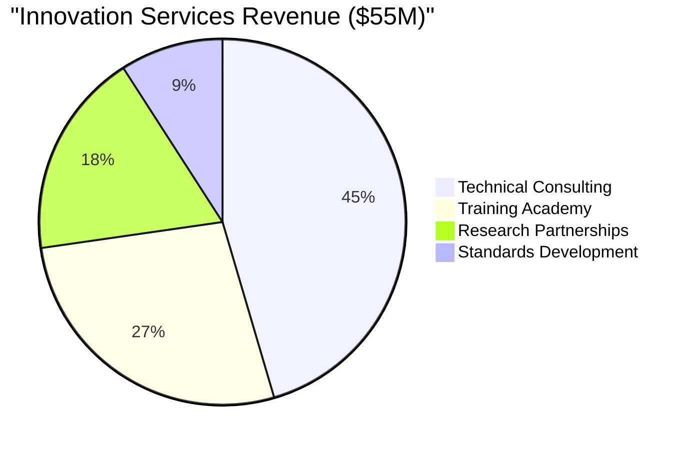

---

## 7. IMPLEMENTATION ROADMAP

### 7.1 Phase 1: Foundation (2025-2026)

#### 🚀 Priority Revenue Streams

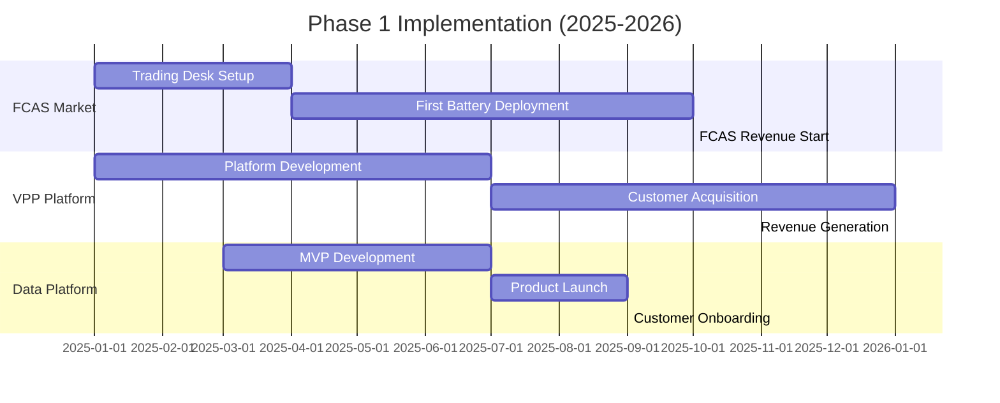

### 7.2 Revenue Build Trajectory

#### 📈 10-Year Revenue Forecast

**Annual Revenue Projections (AU$M)**

| Year | Energy | Grid | Storage | Flex | Data | Tourism | Tech | TOTAL |
|------|--------|------|---------|------|------|---------|------|-------|
| 2025 | 400 | 20 | 10 | 10 | 5 | 0 | 0 | **445** |
| 2026 | 500 | 40 | 30 | 20 | 15 | 5 | 5 | **615** |
| 2027 | 600 | 60 | 60 | 40 | 30 | 20 | 15 | **825** |
| 2028 | 700 | 80 | 100 | 60 | 50 | 40 | 30 | **1,060** |
| 2029 | 750 | 100 | 150 | 80 | 80 | 80 | 50 | **1,290** |
| 2030 | 800 | 120 | 200 | 100 | 100 | 100 | 70 | **1,490** |

### 7.3 Investment Requirements

#### 💵 Revenue Stream Investments

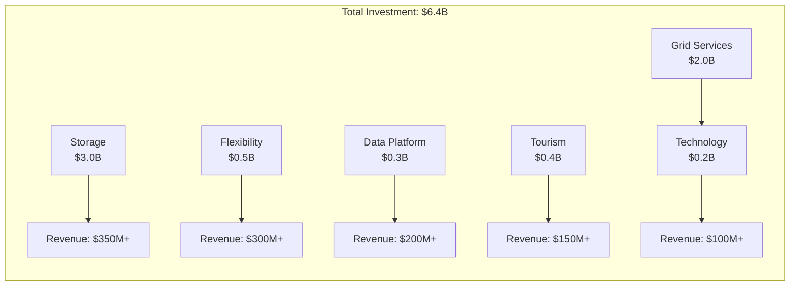

---

## 8. FINANCIAL PROJECTIONS

### 8.1 Return Analysis

#### 📊 Project Economics Enhancement

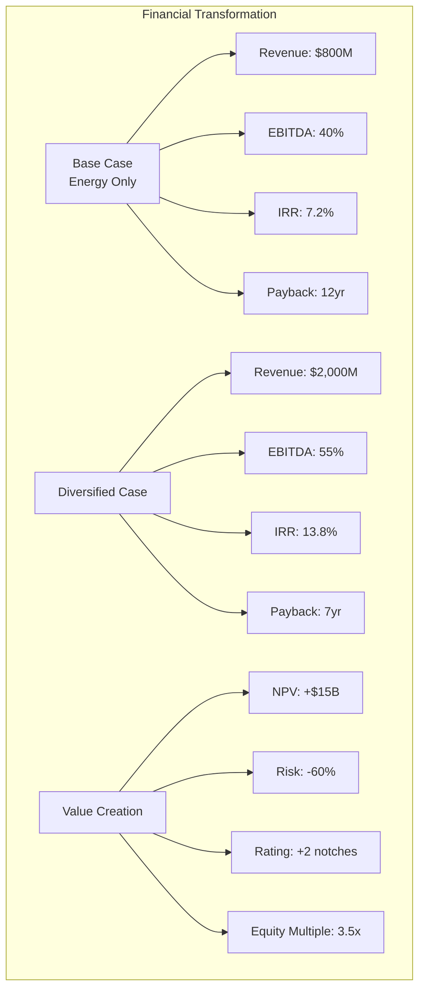

### 8.2 Risk-Return Profile

#### ⚖️ Portfolio Risk Analysis

| Revenue Stream | Risk Level | Return Range | Correlation | Portfolio Weight |
|----------------|------------|--------------|-------------|------------------|
| **Energy Sales** | High | 5-15% | 1.00 | 40% |
| **Grid Services** | Medium | 8-12% | 0.60 | 20% |
| **Storage** | Medium | 10-15% | 0.70 | 17.5% |
| **Flexibility** | Low | 8-10% | 0.30 | 15% |
| **Data** | Low | 15-20% | 0.20 | 10% |
| **Tourism** | Low | 12-18% | 0.10 | 7.5% |
| **Portfolio** | **Low-Med** | **12-15%** | | **100%** |

---

## 💎 CONCLUSION AND CALL TO ACTION

### 🚀 The Revenue Revolution

Gippsland's revenue diversification strategy transforms the traditional utility model into a multi-service energy and innovation platform. By engineering six complementary revenue streams beyond energy sales, we can:

- **Double Revenue**: From $800M to $2B+ annually
- **Double Returns**: From 7% to 14%+ IRR  
- **Halve Risk**: Through true portfolio diversification
- **Create Options**: For future growth and innovation

### 🏆 Competitive Advantages

| Advantage | Description | Moat |
|-----------|-------------|------|
| **First Mover** | 2-3 year head start on integrated model | Market position |
| **Scale** | Critical mass across all revenue streams | Economies of scale |
| **Location** | Strategic grid position and resources | Physical advantage |
| **Ecosystem** | Complete value chain integration | Network effects |
| **Innovation** | Continuous technology advancement | IP portfolio |

### 📋 Implementation Imperatives

**Immediate Actions Required**

1. **Establish Trading Capability** - FCAS and spot markets (Q1 2025)
2. **Launch VPP Platform** - Aggregate first customers (Q2 2025)
3. **Deploy Storage** - With revenue stacking optimisation (Q2 2025)
4. **Create Data Products** - Monetise information assets (Q3 2025)
5. **Plan Tourism Infrastructure** - World-class facilities (Q3 2025)
6. **File Patents** - Protect innovations (Ongoing)

### 🎯 Success Requirements

- **Integrated Thinking**: All assets optimised together
- **Market Innovation**: New products and services
- **Customer Focus**: Value creation and sharing
- **Technology Leadership**: Continuous advancement
- **Partnership Approach**: Ecosystem development

### 💰 The Payoff

By 2030, Gippsland will demonstrate that renewable energy infrastructure can generate returns comparable to traditional infrastructure while providing essential services for the clean energy transition. This diversified revenue model will:

- Attract **$150B+** in investment
- Create **50,000+** direct jobs
- Generate **$2B+** annual revenues
- Establish **global best practice**
- Enable **full energy transition**

**The technology exists. The markets are ready. The opportunity is now.**

---

**Document Control**
- **Version**: 2.0 Enhanced
- **Date**: September 10th, 2025
- **Classification**: Revenue Diversification Strategy
- **Next Review**: Quarterly updates
- **Contact**: Gippsland Revenue Innovation Team

---

*This enhanced document contains actionable revenue diversification strategies to maximise returns from Gippsland's renewable energy transformation.*