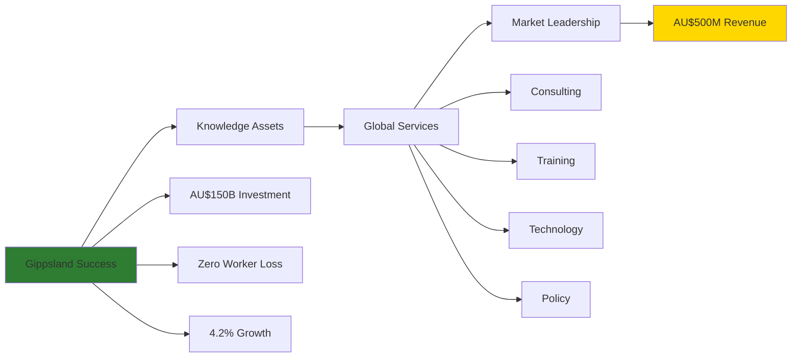
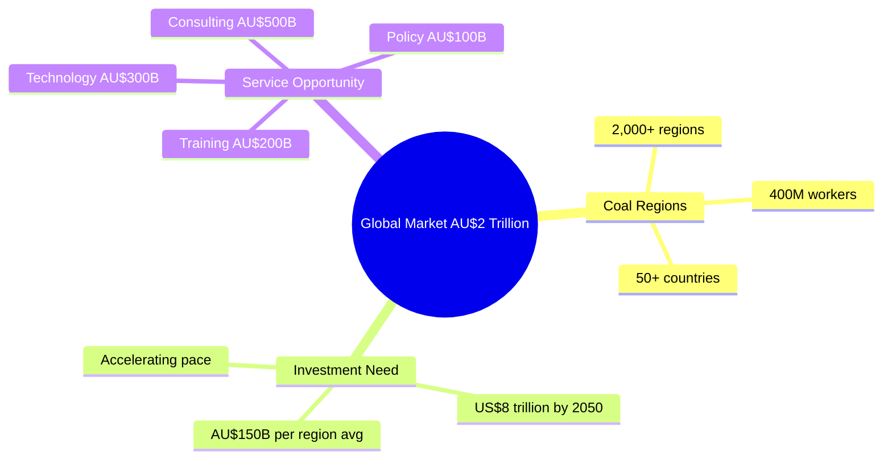
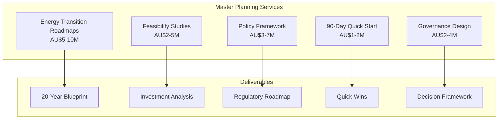
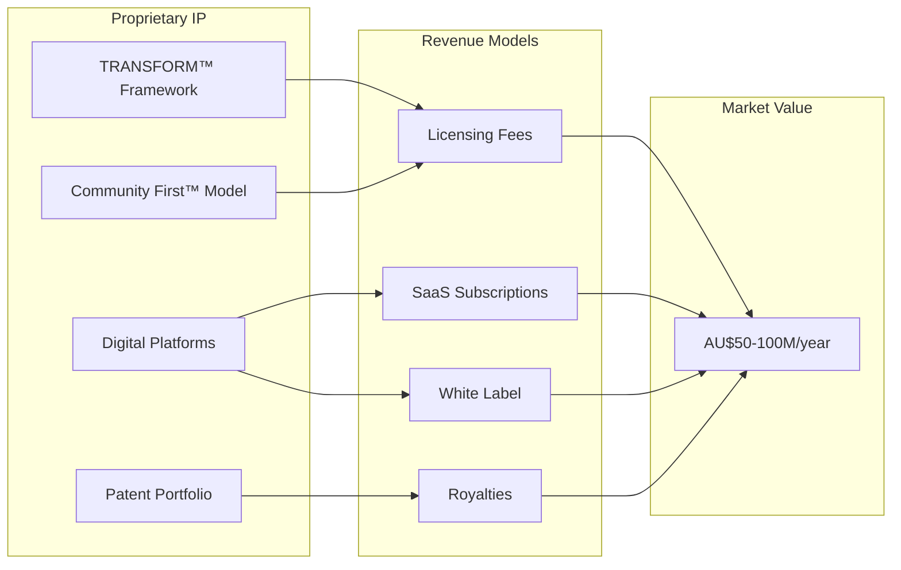
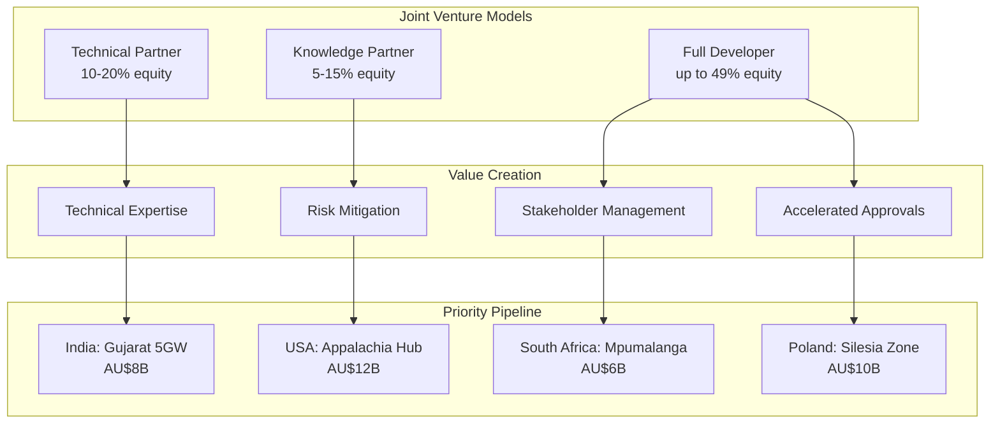

# 🌏 Gippsland Knowledge Export Business Portfolio
## Commercialising Renewable Energy Transformation Expertise Globally

```
                    🎓 KNOWLEDGE TO GLOBAL IMPACT 💰
    
    ┌─────────────────────────────────────────────────────────────┐
    │              GIPPSLAND EXPERTISE GLOBAL REACH               │
    │                                                             │
    │  Local Success ═════> Knowledge Export ═════> Global Impact │
    │       │                     │                      │        │
    │  AU$150B Project      12 Service Lines        50+ Countries │
    │  45Mt CO₂ Cut        AU$500M Revenue         2,000+ Regions│
    │  50,000 Jobs          Proven Methods          400M Workers  │
    │                                                             │
    │  🇦🇺 AUSTRALIA ═════════════════════════════════════> 🌍 WORLD │
    └─────────────────────────────────────────────────────────────┘
```

> **Version:** 1.0  
> **Date:** January 2025  
> **Status:** Business Development Strategy  
> **Revenue Target:** AU$500 million annually by 2030  
> **Market Coverage:** 50+ countries  
> **Service Lines:** 12 core offerings



---

## EXECUTIVE SUMMARY

This document establishes Gippsland's knowledge export business, transforming our renewable energy transformation expertise into a global consulting and advisory powerhouse. By commercialising the methodologies, frameworks, and lessons learned from our AU$150 billion transformation, we create a sustainable revenue stream while accelerating global decarbonisation.

### 🌐 Global Market Opportunity Map
```
    COAL REGIONS REQUIRING TRANSFORMATION (2025-2050)
    ════════════════════════════════════════════════════════
    
    🇺🇸 USA               🇨🇳 CHINA             🇪🇺 EUROPE
    Appalachia           Shanxi               Germany (Ruhr)
    Wyoming              Inner Mongolia       Poland (Silesia)
    Illinois Basin       Xinjiang             Czech Republic
    300+ communities     500+ regions         200+ towns
    
    🇮🇳 INDIA              🇿🇦 SOUTH AFRICA      🇮🇩 INDONESIA
    Jharkhand            Mpumalanga           South Sumatra
    Odisha               Limpopo              East Kalimantan
    Chhattisgarh         Free State           Central Java
    400+ districts       50+ municipalities   100+ regions
    
              Total: 2,000+ regions × AU$1M avg = AU$2 Trillion
                            ↓
                    🇦🇺 GIPPSLAND MODEL 🇦🇺
```

**Key Value Propositions:**

```
    ┌─────────────────────────────────────────────────────────────┐
    │                    UNIQUE VALUE PROPOSITION                     │
    ├─────────────────────────────────────────────────────────────┤
    │  ✅ Proven Success:     Real transformation, not theory        │
    │  📖 Complete Playbook:  End-to-end methodologies             │
    │  🛡️ Risk Mitigation:   AU$65B deployment lessons            │
    │  ⏱️ Speed to Market:    10 years → 5 years                   │
    │  🤝 Community-Centric: Zero worker displacement              │
    │  📊 ROI Validated:     4.2% growth during transition         │
    └─────────────────────────────────────────────────────────────┘
```

**Revenue Projections:**

```
    Revenue Growth Trajectory (AU$ millions)
    ═══════════════════════════════════════════════════
    
    1000 ┤                                           ╱─── 2035
     800 ├────────────────────────────────╱────
     600 ├────────────────────────────╱─────
     400 ├─────────────────────╱─────── 2030
     200 ├─────────────╱───────────── 2027
      50 ├────╱────────────────────── 2025
       0 └────────────────────────────────────
         2025   2027   2029   2031   2033   2035
```

---

## 1. STRATEGIC POSITIONING

### 1.1 Global Market Opportunity



**Coal Region Transformation Market:**
- **2,000+ coal regions** globally requiring transition
- **US$8 trillion** investment needed by 2050
- **400 million workers** to be transitioned
- **50+ countries** with net-zero commitments
- **AU$2 trillion** consulting market by 2030

**Competitive Advantages:**
- **First Mover:** Among first successful large-scale transitions
- **Holistic Approach:** Technical + social + economic integration
- **Government Backing:** Australian trade support
- **Academic Partnership:** Research validation
- **Technology Agnostic:** Adaptable to any renewable mix
- **Cultural Sensitivity:** Community-first approach

### 1.2 Target Market Segments

```
    TARGET MARKET PRIORITISATION MATRIX
    ══════════════════════════════════════════════════════════
    
    HIGH    │  TIER 1 (2025-2026)        │  TIER 2 (2027-2028)
    URGENCY │  🇺🇸 USA: Appalachia       │  🇨🇳 China: Shanxi
            │  🇩🇪 Germany: Ruhr        │  🇮🇩 Indonesia: Sumatra
            │  🇮🇳 India: Jharkhand     │  🇨🇴 Colombia: Cesar
            │  🇿🇦 South Africa         │  🇨🇿 Czech Republic
            │  🇵🇱 Poland: Silesia      │  🇨🇦 Canada: Alberta
            │  AU$500B market           │  AU$750B market
    ────────┼───────────────────────────┼────────────────────────
    LOW     │  Strategic Partners       │  TIER 3 (2029+)
    URGENCY │  Long-term relationships  │  🇻🇳 Vietnam
            │  Technology development   │  🇰🇿 Kazakhstan  
            │  Standards creation       │  🇺🇦 Ukraine
            │                          │  🇹🇷 Turkey
            │                          │  AU$300B market
              HIGH READINESS              LOW READINESS
```

**Tier 1 - Immediate Opportunities (2025-2026)**
- USA: Appalachia, Wyoming, Illinois Basin
- Germany: Ruhr, Lusatia regions
- India: Jharkhand, Odisha, Chhattisgarh
- South Africa: Mpumalanga
- Poland: Silesia
- **Market Size:** AU$500 billion transition investment

**Tier 2 - Growth Markets (2027-2028)**
- China: Shanxi, Inner Mongolia
- Indonesia: South Sumatra, East Kalimantan
- Colombia: Cesar, La Guajira
- Czech Republic: Ústí, Karlovy Vary
- Canada: Alberta, Saskatchewan
- **Market Size:** AU$750 billion

**Tier 3 - Emerging Markets (2029+)**
- Vietnam, Kazakhstan, Ukraine
- Turkey, Serbia, Bosnia
- Mexico, Chile, Mongolia
- **Market Size:** AU$300 billion

---

---

## 2. 💼 CORE SERVICE OFFERINGS

```
    ┌───────────────────────────────────────────────────────────────┐
    │                    SERVICE PORTFOLIO ARCHITECTURE                │
    │                                                                  │
    │   STRATEGY            TRANSITION          TECHNICAL             │
    │   ┌─────────┐        ┌─────────┐         ┌─────────┐         │
    │   │Master   │        │Just     │         │Grid     │         │
    │   │Planning │        │Transit  │         │Integrat │         │
    │   │AU$5-10M │        │AU$3-5M  │         │AU$5-15M │         │
    │   └─────────┘        └─────────┘         └─────────┘         │
    │        │                   │                    │              │
    │        └───────────────────┴────────────────────┘              │
    │                               │                                  │
    │                      🎯 GIPPSLAND METHOD 🎯                      │
    │                               │                                  │
    │   INVESTMENT          TRAINING           POLICY                │
    │   ┌─────────┐        ┌─────────┐         ┌─────────┐         │
    │   │Capital  │        │Certific │         │Framewrk │         │
    │   │Raising  │        │Programs │         │Design   │         │
    │   │1-2% fee │        │AU$12K   │         │AU$3-7M  │         │
    │   └─────────┘        └─────────┘         └─────────┘         │
    └───────────────────────────────────────────────────────────────┘
```

### 2.1 Transformation Strategy Consulting



**Master Planning Services**
- **Comprehensive Energy Transition Roadmaps**
  - 20-year transformation blueprints
  - Investment requirement analysis
  - Risk assessment frameworks
  - Stakeholder mapping
  - **Fee:** AU$5-10 million per engagement

- **Feasibility Studies**
  - Resource assessment (wind, solar, hydrogen)
  - Grid integration analysis
  - Economic impact modeling
  - Environmental assessments
  - **Fee:** AU$2-5 million per study

- **Policy Framework Development**
  - Regulatory roadmaps
  - Incentive scheme design
  - Market mechanism creation
  - Planning approval optimization
  - **Fee:** AU$3-7 million per framework

**Implementation Acceleration**
- **90-Day Quick Start Programs**
  - Immediate action identification
  - Quick win implementation
  - Momentum building strategies
  - **Fee:** AU$1-2 million

- **Governance Structure Design**
  - Institutional framework creation
  - Decision-making processes
  - Accountability mechanisms
  - **Fee:** AU$2-4 million

### 2.2 Just Transition Advisory Services

**Workforce Transition Programs**
- **Skills Mapping and Retraining Design**
  - Competency assessment frameworks
  - Training curriculum development
  - Certification pathway creation
  - Career transition planning
  - **Fee:** AU$3-5 million per program

- **Union Engagement Strategies**
  - Negotiation frameworks
  - Agreement templates
  - Grievance mechanisms
  - **Fee:** AU$1-3 million

**Community Engagement Solutions**
- **Social Licence Frameworks**
  - Community consultation methodologies
  - Benefit sharing models
  - Local content strategies
  - Traditional owner engagement
  - **Fee:** AU$2-4 million

- **Economic Diversification Planning**
  - Industry attraction strategies
  - Small business support programs
  - Tourism development plans
  - **Fee:** AU$3-6 million

### 2.3 Technical Implementation Services

**Renewable Energy Integration**
- **Grid Stability Solutions**
  - Synchronous condenser strategies
  - Battery storage optimization
  - Virtual power plant design
  - System strength services
  - **Fee:** AU$5-15 million per grid

- **Hybrid Energy System Design**
  - Renewable mix optimization
  - Firming capacity planning
  - Transmission upgrade strategies
  - **Fee:** AU$4-8 million

**Hydrogen Economy Development**
- **Green Hydrogen Strategies**
  - Production facility planning
  - Export infrastructure design
  - Market development strategies
  - Technology selection support
  - **Fee:** AU$10-20 million per project

- **Industrial Decarbonization**
  - Process electrification roadmaps
  - Green ammonia integration
  - Carbon capture strategies
  - **Fee:** AU$5-10 million

### 2.4 Investment and Finance Advisory

**Capital Raising Support**
- **Investment Attraction Strategies**
  - Investor roadshow preparation
  - Financial modeling
  - Risk mitigation structures
  - PPP framework design
  - **Fee:** 1-2% of capital raised

- **Green Finance Structuring**
  - Green bond frameworks
  - Sustainability-linked loans
  - Blended finance mechanisms
  - Carbon credit monetization
  - **Fee:** AU$2-5 million per structure

**Project Development Services**
- **Bankability Enhancement**
  - PPA negotiation support
  - Offtake agreement structuring
  - Technology due diligence
  - **Fee:** AU$3-7 million per project

---

---

## 3. 🎓 TRAINING AND EDUCATION PROGRAMMES

```
    GIPPSLAND ENERGY TRANSITION ACADEMY
    ══════════════════════════════════════════════════════════
    
    Executive Programs              Professional Certification
    ────────────────              ────────────────────────
    🎯 Masterclass                🎓 CETP (6 months)
       AU$25K/person                 AU$12K/person
       30 leaders x 8 cohorts        500 certifications/year
       = AU$7.2M/year               = AU$6M/year
    
    🌏 Study Tours                 🤝 Just Transition Specialist
       AU$15K/person                 AU$8K/person
       20 delegates x 12 tours       300 certifications/year
       = AU$3.6M/year               = AU$2.4M/year
    
                        💻 Online Platform
                        10,000 subscribers
                        AU$2K/year corporate
                        = AU$20M/year
    
    Total Education Revenue: AU$39.2M/year by 2027
```

### 3.1 Executive Leadership Programs

**Renewable Energy Leadership Masterclass**

```
    5-Day Intensive Programme Structure
    ═══════════════════════════════════════════════════
    
    Day 1: Strategic Vision          Day 4: Risk & Finance
    ├─ Global context               ├─ Risk frameworks
    ├─ Transformation models        ├─ Investment strategies
    └─ Leadership alignment         └─ Return optimisation
    
    Day 2: Stakeholder Navigation    Day 5: Implementation
    ├─ Community engagement         ├─ Action planning
    ├─ Government relations         ├─ Quick wins
    └─ Union partnerships           └─ Success metrics
    
    Day 3: Technology & Innovation   
    ├─ Site visits                  AU$25,000 per participant
    ├─ Tech demonstrations          240 leaders annually
    └─ Innovation labs              AU$7.2M revenue/year
```

- **Duration:** 5 days intensive
- **Participants:** C-suite, board members, senior officials
- **Content:**
  - Transformation strategy
  - Change management
  - Stakeholder navigation
  - Risk management
  - Case study deep dives
- **Fee:** AU$25,000 per participant
- **Capacity:** 8 cohorts/year × 30 participants

**Study Tours**
- **Gippsland Transformation Experience**
  - 7-day immersive program
  - Site visits to renewable facilities
  - Meetings with key stakeholders
  - Workshop sessions
  - **Fee:** AU$15,000 per participant
  - **Capacity:** 12 tours/year x 20 participants

### 3.2 Professional Certification Programs

**Certified Energy Transition Professional (CETP)**
- **Duration:** 6 months (blended learning)
- **Modules:**
  - Energy markets and economics
  - Renewable technology systems
  - Project development
  - Community engagement
  - Policy and regulation
- **Fee:** AU$12,000 per participant
- **Target:** 500 certifications/year

**Just Transition Specialist Certification**
- **Duration:** 3 months
- **Focus:** Workforce and community transition
- **Fee:** AU$8,000 per participant
- **Target:** 300 certifications/year

### 3.3 Online Learning Platform

**Gippsland Energy Transition Academy**
- **Course Library:** 50+ courses
- **Subscription Model:** AU$2,000/year corporate
- **Features:**
  - Self-paced learning
  - Virtual simulations
  - Case study library
  - Expert webinars
  - Peer networking
- **Target:** 10,000 subscribers by 2027

---

---

## 4. 🔧 TECHNOLOGY TRANSFER AND LICENSING



### 4.1 Proprietary Methodologies

```
    ┌─────────────────────────────────────────────────────────────┐
    │                    TRANSFORM™ FRAMEWORK                        │
    │                                                                │
    │  T - Target Setting        │  Align stakeholders on vision    │
    │  R - Resource Assessment   │  Map assets and capabilities     │
    │  A - Action Planning       │  Detailed implementation steps   │
    │  N - Navigate Stakeholders │  Manage complex relationships    │
    │  S - Scale Solutions       │  Grow from pilots to programs    │
    │  F - Finance Mobilisation  │  Unlock capital at scale         │
    │  O - Operate Excellence    │  Deliver sustained results       │
    │  R - Replicate Success     │  Transfer to other regions       │
    │  M - Measure Impact        │  Track and optimise outcomes     │
    │                                                                │
    │         Licensing: AU$1-5 million per deployment               │
    └─────────────────────────────────────────────────────────────┘
```

**TRANSFORM™ Framework**
- **Description:** Comprehensive 7-phase transformation methodology
- **Components:**
  - Stakeholder alignment tools
  - Risk assessment matrices
  - Implementation playbooks
  - Monitoring dashboards
  - Success metrics
- **Licensing:** AU$1-5 million per deployment
- **Certification:** Required training and support

**Community First™ Model**
- **Description:** Social license and benefit sharing framework
- **Features:**
  - Engagement protocols
  - Benefit distribution algorithms
  - Grievance mechanisms
  - Impact measurement tools
- **Licensing:** AU$500,000 - 2 million per region

### 4.2 Digital Platforms and Tools

```
    DIGITAL PLATFORM ECOSYSTEM
    ══════════════════════════════════════════════════════════
    
    🖥️ Energy Transition Command Centre
    ┌───────────────────────────────────┐
    │ • Real-time dashboards         │  SaaS: AU$50K-500K/year
    │ • Project tracking             │  White Label: AU$2-5M
    │ • Stakeholder CRM              │  50+ deployments by 2030
    │ • Investment pipeline          │
    └───────────────────────────────────┘
                      ↓
    🤝 Skills Transition Platform
    ┌───────────────────────────────────┐
    │ • AI skill matching            │  Licensing: AU$100K-1M/year
    │ • Career pathways              │  100+ regions using
    │ • Training recommendations     │  1M+ workers matched
    │ • Employer connections         │
    └───────────────────────────────────┘
```

**Energy Transition Command Centre**
- **Cloud-based Platform Features:**
  - Real-time project tracking
  - Stakeholder management
  - Risk monitoring
  - Investment pipeline tracking
  - Community feedback systems
- **SaaS Model:** AU$50,000 - 500,000/year
- **White Label Option:** AU$2-5 million setup

**Skills Transition Matching Platform**
- **AI-Powered Capabilities:**
  - Worker skill assessment
  - Job matching algorithms
  - Training recommendations
  - Career pathway modeling
- **Licensing:** AU$100,000 - 1 million/year per region

### 4.3 Intellectual Property Portfolio

**Patent Portfolio Licensing**
- **Grid Integration Technologies**
  - Stability solutions
  - Virtual power plant systems
  - Demand response mechanisms
  - **Revenue Share:** 3-7% of deployment value

- **Hydrogen Production Innovations**
  - Efficiency improvements
  - Storage solutions
  - Transport systems
  - **Licensing:** AU$1-10 million per facility

**Trade Secrets and Know-How**
- **Operational Excellence Practices**
  - Safety protocols
  - Maintenance strategies
  - Performance optimization
  - **Transfer Fee:** AU$500,000 - 2 million

---

---

## 5. 📋 POLICY AND REGULATORY ADVISORY

### 5.1 Government Advisory Services

```
    POLICY DEVELOPMENT FRAMEWORK
    ══════════════════════════════════════════════════════════
    
    National Level                    Regional Level
    ──────────────                    ──────────────
    🏛️ Policy Framework              🌆 REZ Planning
      AU$5-20M engagements             AU$3-10M per zone
      └─ Regulatory design             └─ Site selection
      └─ Market mechanisms             └─ Grid integration
      └─ Legislative drafting          └─ Community benefits
    
    Investment Certainty              Fast-Track Systems
    ─────────────────               ────────────────
    📈 Revenue Mechanisms           🚀 Approval Acceleration  
      AU$3-7M frameworks               AU$2-5M implementation
      └─ Long-term contracts          └─ Digital platforms
      └─ Risk mitigation              └─ Single window
      └─ Carbon integration            └─ Risk-based assessment
```

**National Energy Policy Development**
- **Services:**
  - Policy framework design
  - Regulatory impact assessment
  - Market mechanism creation
  - International best practice integration
  - Legislative drafting support
- **Clients:** National governments, energy ministries
- **Fee:** AU$5-20 million per engagement

**Regional Planning Support**
- **Renewable Energy Zones (REZ)**
  - Location selection criteria
  - Capacity allocation mechanisms
  - Access regime design
  - Benefit sharing frameworks
- **Fee:** AU$3-10 million per REZ

### 5.2 Regulatory Optimization

**Fast-Track Approval Systems**
- **Streamlined Processes:**
  - Single-window clearance design
  - Digital application systems
  - Risk-based assessment
  - Community consultation protocols
- **Implementation Support:** AU$2-5 million

**Investment Certainty Frameworks**
- **Long-term Revenue Mechanisms:**
  - Contract for difference design
  - Capacity payment systems
  - Green certificate schemes
  - Carbon pricing integration
- **Fee:** AU$3-7 million per framework

---

---

## 6. 🌍 INTERNATIONAL PROJECT DEVELOPMENT



### 6.1 Joint Venture Development

**Strategic Partnership Models**
- **Equity Participation Options:**
  - Technical partner (10-20% stake)
  - Knowledge partner (5-15% stake)
  - Full development partner (up to 49%)
- **Value Creation:**
  - Technical expertise
  - Risk mitigation
  - Stakeholder management
  - Accelerated approvals

**Priority Projects Pipeline**
- **India:** Gujarat 5GW renewable complex (AU$8 billion)
- **USA:** Appalachia transition hub (AU$12 billion)
- **South Africa:** Mpumalanga energy park (AU$6 billion)
- **Poland:** Silesia green industrial zone (AU$10 billion)

### 6.2 Build-Operate-Transfer (BOT) Services

**Transition Infrastructure Development**
- **Training Centers:** AU$50-100 million facilities
- **Innovation Hubs:** AU$100-200 million complexes
- **Demonstration Projects:** AU$20-50 million pilots
- **Revenue Model:**
  - Development fee: 5-10%
  - Operation phase: Management contracts
  - Transfer: Success fee 2-5%

---

## 7. REVENUE MODELS AND PRICING

### 7.1 Fee Structures

```
    REVENUE MODEL ARCHITECTURE
    ══════════════════════════════════════════════════════════
    
    Consulting Services              Technology Licensing
    ──────────────────              ───────────────────
    🕰️ T&M: AU$3-5K/day             🔑 Upfront: Market-based
    📊 Fixed: Scope-based           👑 Royalties: 3-7%
    🎯 Success: 5-15%               🏁 Milestones: Performance
    🔄 Retainer: AU$100-500K/mo    🔧 Support: 15-20% annual
    
    Training Programs                Project Development
    ────────────────              ──────────────────
    🎓 Public: Per participant      🏗️ Development: 5-10%
    🏢 Corporate: Customised       🏭 Operation: Management
    📱 Online: Subscriptions       🔄 Transfer: 2-5% success
    🏅 Certification: Exams        💰 Returns: Equity share
```

**Consulting Services**
- **Time & Materials:** AU$3,000-5,000/day senior consultants
- **Fixed Fee Projects:** Based on scope and complexity
- **Success Fees:** 5-15% of value created
- **Retainer Models:** AU$100,000-500,000/month

**Training Programs**
- **Public Programs:** Fixed per-participant fees
- **Corporate Programs:** Customized pricing
- **Online Subscriptions:** Tiered annual fees
- **Certification:** Exam and renewal fees

**Technology Licensing**
- **Upfront License Fees:** Based on market size
- **Royalties:** 3-7% of revenue or savings
- **Milestone Payments:** Performance-based
- **Support & Maintenance:** 15-20% annual

### 7.2 Market Entry Strategies

**Phase 1: Flagship Clients (2025)**
- Target 3-5 high-profile transformations
- Heavily subsidized pricing for references
- Co-investment in success
- Intensive support model

**Phase 2: Scale-Up (2026-2027)**
- Standardized service offerings
- Partner channel development
- Digital delivery platforms
- Geographic expansion

**Phase 3: Market Leadership (2028+)**
- Premium pricing position
- Selective client engagement
- Focus on largest opportunities
- Thought leadership platform

### 7.3 Financial Projections

```
    2030 REVENUE PROJECTIONS: AU$500 MILLION
    ══════════════════════════════════════════════════════════
    
    Service Mix                      Geographic Mix
    ───────────                      ──────────────
    
    Consulting (40%)                 Asia-Pacific (35%)
    ████████████████ AU$200M         ██████████████ AU$175M
    
    Technology (25%)                 Europe (25%)
    ██████████ AU$125M              ██████████ AU$125M
    
    Training (20%)                   North America (20%)
    ████████ AU$100M                ████████ AU$100M
    
    Projects (15%)                   Africa (10%)
    ██████ AU$75M                   ████ AU$50M
    
                                    Latin America (10%)
                                    ████ AU$50M
```

---

## 8. DELIVERY INFRASTRUCTURE

### 8.1 Global Delivery Network

```
    GLOBAL DELIVERY INFRASTRUCTURE
    ══════════════════════════════════════════════════════════
    
                        🇦🇺 MELBOURNE HQ
                              Global Centre
                                   │
          ┌───────────────────────┴───────────────────────┐
          │                       │                       │
    🇸🇬 SINGAPORE         🇬🇧 LONDON            🇺🇸 WASHINGTON DC
    Asia-Pacific Hub      Europe/MEA Hub         Americas Hub
    └─ SE Asia            └─ Europe              └─ North America
    └─ China              └─ Middle East         └─ Latin America
    └─ Pacific            └─ Africa              └─ Caribbean
                                │
                          🇮🇳 MUMBAI
                          South Asia Centre
                          └─ India subcontinent
    
    100 Core Professionals | 500 Associates | 20 Universities | 30 Tech Partners
```

**Regional Centres of Excellence**
- **Singapore Hub:** Asia-Pacific operations
- **London Office:** Europe, Middle East, Africa
- **Washington DC:** Americas operations
- **Mumbai Centre:** South Asia focus
- **Investment:** AU$50 million setup

**Expert Network**
- **Core Team:** 100 full-time professionals
- **Associate Network:** 500 subject matter experts
- **Academic Partners:** 20 universities
- **Technology Partners:** 30 firms

### 8.2 Quality Assurance

**Service Delivery Standards**
- **ISO Certifications:** 9001, 14001, 45001
- **Industry Accreditations:** Engineering, finance
- **Client Satisfaction:** >90% target
- **Impact Measurement:** Standardized metrics

**Knowledge Management**
- **Best Practice Library:** 1,000+ documents
- **Case Study Database:** 100+ projects
- **Lessons Learned System:** Continuous update
- **Innovation Pipeline:** Quarterly updates

### 8.3 Risk Management

**Professional Indemnity**
- **Coverage:** AU$100 million
- **Jurisdictions:** Global
- **Claims Management:** Dedicated team

**Intellectual Property Protection**
- **Patent Filings:** 50+ annually
- **Trade Secret Management:** Strict protocols
- **Confidentiality:** Multi-layer agreements
- **Enforcement:** Active monitoring

---

## 9. MARKETING AND BUSINESS DEVELOPMENT

### 9.1 Brand Positioning

```
    ┌─────────────────────────────────────────────────────────────┐
    │              GIPPSLAND ENERGY TRANSITION EXCELLENCE™            │
    │                                                                 │
    │            "From Coal to Clean - The Proven Path"               │
    │                                                                 │
    │  ✅ Real Transformation    🌏 Global Scale      🤝 Community First│
    │  ✅ Proven Methods         🌏 50+ Countries     🤝 Zero Workers Lost│
    │  ✅ Validated Results      🌏 AU$150B Led       🤝 Shared Prosperity│
    │                                                                 │
    │                    TARGET AUDIENCES                             │
    │  ┌─────────────┐  ┌──────────────┐  ┌──────────────┐          │
    │  │ Governments │  │  Industry   │  │ Communities │          │
    │  │ Ministers   │  │  CEOs       │  │ Workers     │          │
    │  │ Officials   │  │  Investors  │  │ Leaders     │          │
    │  └─────────────┘  └──────────────┘  └──────────────┘          │
    └─────────────────────────────────────────────────────────────┘
```

**Gippsland Energy Transition Excellence™**
- **Tagline:** "From Coal to Clean - The Proven Path"
- **Value Proposition:** Real transformation, real results
- **Differentiation:** Community-first approach
- **Authority:** AU$150 billion transformation led

### 9.2 Go-to-Market Strategy

**Thought Leadership Platform**
- **Annual Global Forum:** 500+ delegates
- **Quarterly Reports:** Market insights
- **Executive Briefings:** C-suite programs
- **Media Presence:** Tier 1 publications

**Strategic Partnerships**
- **Multilateral Organizations:** World Bank, ADB, EBRD
- **Industry Associations:** GWEC, IRENA, IEA
- **Government Agencies:** Trade bodies
- **Academic Institutions:** Research collaboration

### 9.3 Sales Process

**Enterprise Sales Model**
- **Target Accounts:** 100 priority organizations
- **Sales Cycle:** 6-18 months
- **Decision Makers:** Government, C-suite
- **Proof Points:** Site visits, references

**Channel Partner Program**
- **Global Consultancies:** Strategic alliances
- **Regional Firms:** Local delivery partners
- **Technology Vendors:** Integration partnerships
- **Financial Institutions:** Co-marketing

---

## 10. IMPLEMENTATION ROADMAP

### 10.1 Launch Phase (Q1-Q2 2025)

**Immediate Actions:**
- Establish legal entity and governance
- Recruit core leadership team
- Develop initial service offerings
- Secure flagship clients
- Launch digital platforms

**Key Milestones:**
- First client contract: March 2025
- Team of 25 professionals: June 2025
- Revenue AU$10 million: June 2025

### 10.2 Growth Phase (2025-2027)

**Scaling Activities:**
- Open regional offices
- Launch certification programs
- Deploy technology platforms
- Build partner network
- Expand service portfolio

**Targets:**
- 100 professionals globally
- 20+ active clients
- 5 regional offices
- AU$200 million revenue

### 10.3 Leadership Phase (2028-2030)

**Market Dominance:**
- Premium positioning
- Selective engagement
- Technology leadership
- Policy influence
- Global recognition

**Success Metrics:**
- Market leader position
- AU$500 million revenue
- 50+ country presence
- 1,000+ professionals trained

---

## 11. CRITICAL SUCCESS FACTORS

### 11.1 Competitive Advantages to Maintain

1. **First-Mover Advantage:** Stay ahead through innovation
2. **Real-World Credibility:** Continuous Gippsland success
3. **Holistic Approach:** Maintain integrated model
4. **Government Support:** Leverage trade relationships
5. **Community Focus:** Never compromise social values

### 11.2 Key Risks and Mitigation

**Market Risks:**
- **Competition:** Build insurmountable lead
- **Economic Cycles:** Diversify geographically
- **Policy Changes:** Multiple market presence
- **Technology Disruption:** Continuous innovation

**Operational Risks:**
- **Talent Retention:** Equity participation
- **Quality Control:** Rigorous standards
- **IP Protection:** Active enforcement
- **Client Dependency:** Portfolio diversification

### 11.3 Investment Requirements

**Total Capital Needs (2025-2030):** AU$150 million
- Working Capital: AU$50 million
- Technology Development: AU$40 million
- Global Infrastructure: AU$30 million
- Marketing & BD: AU$20 million
- Contingency: AU$10 million

**Funding Sources:**
- Government Grants: AU$50 million
- Private Investment: AU$50 million
- Reinvested Earnings: AU$50 million

---

## 12. CONCLUSION AND CALL TO ACTION

The Gippsland Knowledge Export Business represents a transformative opportunity to convert our renewable energy transition expertise into a global business generating AU$500 million annually by 2030. By sharing our proven methodologies, technologies, and approaches, we can accelerate global decarbonisation while creating significant economic value for Australia.

```
    ┌─────────────────────────────────────────────────────────────┐
    │                    IMPACT MULTIPLIER EFFECT                     │
    │                                                                 │
    │  Gippsland Success ───> Knowledge Export ───> Global Impact     │
    │        ↓                      ↓                    ↓            │
    │   1 Region              50 Countries         2,000 Regions      │
    │   50,000 Jobs           AU$500M Revenue      400M Workers      │
    │   AU$150B Investment    12 Service Lines     US$8T Investment  │
    │                                                                 │
    │            🇦🇺 LOCAL SUCCESS = 🌍 GLOBAL LEADERSHIP             │
    └─────────────────────────────────────────────────────────────┘
```

**Immediate Next Steps:**
1. Board approval for entity establishment
2. Recruitment of founding CEO
3. Flagship client negotiations
4. Technology platform development
5. Marketing campaign launch

The world needs Gippsland's transformation expertise. The time to act is now.

---

**Contact:**
Gippsland Knowledge Export Initiative  
Email: knowledge@gippslandenergy.com.au  
Web: www.gippslandexpertise.com

*"Transforming the world's energy systems, one region at a time"*