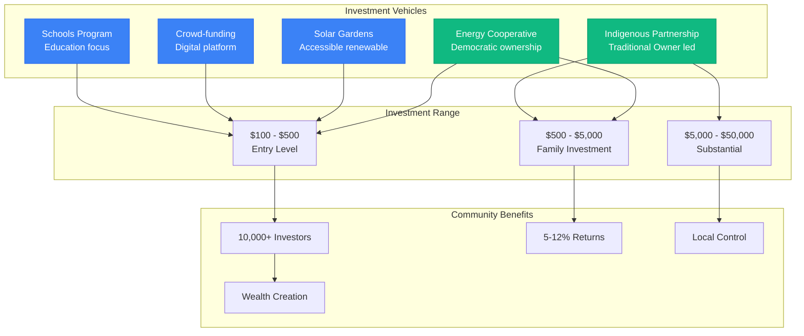
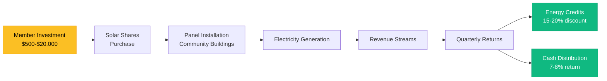

# Community Investment Vehicles for Gippsland's Energy Transformation
## Launch-Ready Programs for Local Ownership and Wealth Creation

> **Document Status**: Day 2 Phase 2 - Ready for Implementation
> **Target**: Enable 10,000+ community investors within 90 days
> **Investment Range**: $100 to $50,000 per individual
> **Version**: 1.0 | Date: January 2025

---

## Executive Summary

This comprehensive portfolio of community investment vehicles transforms Gippsland's renewable energy transition into a community wealth-building opportunity. With investment options starting from just $100, these vehicles ensure every resident can participate in and benefit from the region's $150 billion transformation. The programs prioritise accessibility, transparency, and local benefit retention while delivering competitive returns.



### Key Features
- **Accessibility**: Minimum investments from $100
- **Inclusivity**: Special programs for vulnerable groups
- **Returns**: 5-12% targeted across different risk profiles
- **Local Control**: Democratic governance structures
- **Indigenous Partnership**: 5-10% ownership allocations
- **Total Capacity**: $2 billion in community investment

---

## 1. Gippsland Energy Cooperative (GEC)

### Structure: Democratic Community Ownership Platform

**Legal Framework**: Registered Cooperative under Victorian legislation

**Governance Model**:
```
Cooperative Structure:
├── Members: All Gippsland residents eligible
├── Voting: One member, one vote
├── Board: 9 elected community representatives
├── Advisory: Indigenous Elder Council
├── Management: Professional team
└── Oversight: Community audit committee
```

### Investment Products

#### 1.1 Solar Shares Programme
**Entry-Level Community Ownership**

| Feature | Details | Benefits |
|---------|---------|----------|
| **Minimum Investment** | $500 (payment plans available) | Accessible to most households |
| **Maximum Investment** | $20,000 per member | Prevents concentration |
| **Target Return** | 7-8% annually | Competitive with term deposits |
| **Term** | 20 years with buyback options | Long-term wealth building |
| **Asset** | Direct ownership of solar panel arrays | Tangible investment |



**How It Works**:
1. Members purchase "solar shares" representing panels
2. Cooperative installs panels on community buildings
3. Revenue from electricity sales distributed quarterly
4. Members receive energy credit + cash distributions
5. Democratic decisions on reinvestment vs distribution

**Community Benefits**:
- Local schools/hospitals get cheaper power
- Visible community assets
- Educational opportunities
- Local job creation
- Disaster resilience

#### 1.2 Wind Farm Community Bonds
**Fixed Income for Conservative Investors**

**Structure**:
- **Minimum**: $1,000
- **Maximum**: $50,000
- **Interest Rate**: 6% fixed
- **Term**: 5, 7, or 10 years
- **Payment**: Semi-annual
- **Security**: First ranking over project assets

**Special Features**:
- Seniors discount rate (extra 0.5%)
- Inheritance friendly (transferable)
- Early redemption for hardship
- Inflation protection option
- Green certification

#### 1.3 Battery Storage Investment Units
**Higher Yield Grid Services Investment**

**Specifications**:
- **Minimum**: $2,500
- **Target Return**: 9-10%
- **Revenue Source**: Grid stability services
- **Term**: 15 years
- **Technology**: Latest grid-scale batteries

**Revenue Streams**:
```
Battery Revenue Model:
├── Frequency Control (40%)
├── Energy Arbitrage (30%)
├── Network Support (20%)
└── Emergency Backup (10%)
```

### Membership Benefits
- **Energy Discounts**: 15-20% off retail rates
- **Profit Sharing**: Annual distributions
- **Community Fund**: 10% profits for local projects
- **Education**: Free energy literacy programs
- **Democracy**: Vote on major decisions

### Financial Projections
**Year 1 Targets**:
- Members: 2,000+
- Capital Raised: $20 million
- Projects: 3 solar gardens, 1 wind participation
- Returns: 7.5% average
- Community Fund: $200,000

**5-Year Growth**:
- Members: 10,000+
- Assets: $200 million
- Annual Returns: 8-9%
- Local Jobs: 50+
- Community Fund: $2 million/year

---

## 2. Indigenous Energy Partnership Fund

### Structure: First Nations Wealth Creation Vehicle

**Partnership Framework**:
- **GLaWAC**: 40% ownership
- **Bunurong Land Council**: 20% ownership
- **Community Investors**: 40% ownership
- **Governance**: Traditional Owner led

### Investment Opportunities

#### 2.1 Traditional Owner Energy Corporation (TOEC)
**Indigenous-Led Renewable Development**

**Investment Structure**:
```
Ownership Model:
├── Traditional Owners: 51% (controlling)
├── Community Investment: 30%
├── Impact Investors: 19%
├── Minimum Investment: $500
├── Expected Return: 8-10%
└── Cultural Protocols: Integrated
```

**Project Pipeline**:
1. **Gunaikurnai Wind Project** (200MW)
   - Location: Traditional lands
   - Community Investment: $30 million
   - Jobs: 20+ Indigenous positions
   - Cultural tours included

2. **Bunurong Offshore Partnership**
   - Stake in Star of the South
   - Sea Country protection fund
   - Marine cultural heritage programs
   - Youth training initiatives

3. **Sacred Sites Solar Program**
   - Culturally appropriate locations
   - Elder consultation process
   - Community benefit priority
   - Cultural education integration

#### 2.2 Indigenous Business Incubator Fund
**Supporting Aboriginal Enterprises**

**Fund Features**:
- **Size**: $10 million
- **Investment**: $250 minimum
- **Focus**: Energy sector businesses
- **Returns**: 6-8% + social impact
- **Mentorship**: Included

**Supported Ventures**:
- Indigenous electrical contractors
- Cultural heritage consultancies
- Renewable energy maintenance
- Community energy retailers
- Green technology startups

### Cultural Integration
- Welcome to Country at all meetings
- On-Country project visits
- Traditional ecological knowledge
- Youth mentorship programs
- Cultural awareness training

### Benefit Distribution
```
Profit Allocation:
├── Investor Returns: 60%
├── Cultural Programs: 20%
├── Youth Education: 10%
├── Land Management: 10%
└── Total Community Benefit: 40%
```

---

## 3. Community Solar Gardens Network

### Structure: Accessible Renewable Energy Ownership

**Program Design**: Distributed solar ownership for renters and apartment dwellers

### Investment Models

#### 3.1 Pay-As-You-Save Solar
**Zero Upfront Cost Option**

**How It Works**:
1. No initial investment required
2. Monthly payments less than current bill
3. Ownership after 7-10 years
4. Immediate savings guaranteed
5. Credit check not required

**Financial Structure**:
- **Panel Cost**: $3,000 (10 panels)
- **Monthly Payment**: $75-100
- **Bill Savings**: $100-150
- **Net Benefit**: $25-50/month
- **Payback**: 7-8 years

#### 3.2 Community Solar Subscriptions
**Flexible Renewable Investment**

**Subscription Tiers**:
```
Investment Options:
├── Starter: $100/year (1 panel equivalent)
├── Family: $500/year (5 panels)
├── Business: $2,500/year (25 panels)
├── Supporter: $10,000/year (100 panels)
└── Returns: Bill credits + 5% cash
```

**Unique Features**:
- Monthly payment options
- Transfer between properties
- Gift subscriptions available
- School fundraising programs
- Business CSR packages

#### 3.3 Virtual Net Metering Program
**Remote Solar Ownership**

**Program Benefits**:
- Own panels in optimal locations
- Credits applied to home bill
- No roof required
- Professional maintenance
- Guaranteed performance

### Location Strategy
**Community Solar Sites**:
1. **Morwell Solar Park**: Former mine site
2. **Traralgon Community Garden**: 5MW
3. **Sale Agricultural Hub**: Agrisolar design
4. **Warragul Shopping Centre**: Rooftop
5. **Bairnsdale Sports Complex**: Parking shade

### Social Inclusion Features
- **Low-Income Program**: 50% discount
- **Elder Support**: Assisted applications
- **Multicultural Outreach**: 6 languages
- **Disability Access**: Full accessibility
- **Youth Engagement**: School programs

---

## 4. Crowd-Funding Platforms

### 4.1 GippsEnergy Crowd
**Digital Investment Platform**

**Platform Features**:
- **Minimum Investment**: $100
- **Maximum**: $10,000 per project
- **Projects**: Vetted renewable energy only
- **Returns**: 6-12% depending on risk
- **Technology**: Blockchain verified

**Investment Process**:
```
User Journey:
├── Registration: 5 minutes online
├── Verification: Automated KYC
├── Browse Projects: Detailed info
├── Invest: Secure payment
├── Track: Real-time dashboard
└── Returns: Automated distribution
```

**Project Categories**:
1. **Community Solar**: Lower risk, 6-7%
2. **Wind Partnerships**: Medium risk, 8-9%
3. **Innovation Projects**: Higher risk, 10-12%
4. **Green Hydrogen**: Venture risk, 12%+
5. **Energy Efficiency**: Stable, 5-6%

### 4.2 Schools & Charities Energy Fund
**Social Impact Investment**

**Structure**:
- **Beneficiaries**: Local schools and charities
- **Investment Return**: 4-5%
- **Social Return**: Measured and reported
- **Tax Status**: DGR eligible portions
- **Minimum**: $50

**Impact Metrics**:
- Students benefiting
- Energy cost savings
- Carbon reduction
- Educational programs
- Community services funded

**Featured Projects**:
1. **Solar Schools Program**
   - 30 schools targeted
   - $5M investment needed
   - 20% energy savings
   - STEM education included

2. **Charity Energy Relief**
   - Free power for services
   - Donor recognition
   - Volunteer opportunities
   - Annual impact reports

### 4.3 Youth Innovation Fund
**Next Generation Investment**

**Program Details**:
- **Age Range**: 16-25 years
- **Minimum**: $20
- **Education**: Included
- **Mentorship**: Industry leaders
- **Project Focus**: Clean tech startups

**Youth Benefits**:
- Investment education
- Entrepreneurship skills
- Industry connections
- Career pathways
- Leadership development

---

## 5. Revenue Sharing Mechanisms

### 5.1 Proximity Payment Scheme
**Direct Benefits for Nearby Residents**

**Payment Structure**:
```
Distance-Based Benefits:
├── 0-2km: $2,000/year
├── 2-5km: $1,000/year
├── 5-10km: $500/year
├── Community Fund: $250/year equivalent
└── Total Pool: $5M annually
```

**Eligibility**:
- Primary residence only
- Automatic enrollment
- Direct payment or bill credit
- Inflation adjusted
- 20-year guarantee

### 5.2 Community Benefit Funds
**Collective Wealth Distribution**

**Fund Allocation Model**:
- **Base Rate**: $1,000/MW/year
- **Performance Bonus**: Up to 50% extra
- **Total Fund Size**: $10M+ annually
- **Decision Making**: Community committees

**Spending Categories**:
1. Community infrastructure (30%)
2. Education and training (25%)
3. Environmental programs (20%)
4. Social services (15%)
5. Cultural activities (10%)

### 5.3 Energy Bill Relief Program
**Supporting Vulnerable Households**

**Assistance Levels**:
- **Pensioners**: 30% discount
- **Low Income**: 25% discount
- **Medical Needs**: 40% discount
- **Emergency Relief**: Case-by-case
- **Funding**: Developer contributions

**Additional Support**:
- Energy audits
- Efficiency upgrades
- Payment plans
- Financial counseling
- Appliance replacement

---

## 6. School Investment Programs

### 6.1 Future Energy Leaders Fund
**Student Investment Education**

**Program Structure**:
- **Schools**: All Gippsland schools eligible
- **Investment**: $10 per student minimum
- **Matching**: Corporate sponsors double
- **Returns**: Reinvested in education
- **Curriculum**: Integrated lessons

**Educational Components**:
```
Learning Modules:
├── Energy Basics (Primary)
├── Climate Science (Middle)
├── Investment Principles (Senior)
├── Career Pathways (All levels)
└── Project Management (Senior)
```

### 6.2 School Energy Independence
**Campus Renewable Projects**

**Investment Model**:
- P&C/School Council leads
- Parent investment options
- Alumni contributions
- Business sponsorship
- Government grants

**Benefits Package**:
- Energy cost savings
- Educational resource
- Community pride
- Student engagement
- Teacher training

**Case Study Target**:
```
Typical School Project:
├── System Size: 100kW solar
├── Investment Needed: $150,000
├── Community Raise: $50,000
├── Annual Savings: $30,000
├── Payback: 5 years
└── Education Value: Priceless
```

---

## 7. Implementation Roadmap

### Phase 1: Launch Preparation (Days 1-30)
**Foundation Building**

**Week 1-2: Legal and Regulatory**
- Cooperative registration
- ASIC compliance
- Investment documentation
- Platform development
- Marketing materials

**Week 3-4: Community Engagement**
- Information sessions (20+)
- Ambassador recruitment
- Media campaign launch
- Partnership agreements
- Early bird registrations

### Phase 2: Public Launch (Days 31-60)
**Market Activation**

**Week 5-6: Soft Launch**
- Founding members drive
- Limited offers
- System testing
- Feedback collection
- Process refinement

**Week 7-8: Full Launch**
- Public campaign
- All products available
- Support centers open
- Investment flowing
- Projects commencing

### Phase 3: Scale-Up (Days 61-90)
**Growth Acceleration**

**Week 9-12: Expansion**
- Second project round
- Member referral program
- Corporate partnerships
- School programs active
- Indigenous projects launched

### Success Metrics (90-Day Targets)
- **Members/Investors**: 5,000+
- **Capital Raised**: $50 million
- **Projects Funded**: 10+
- **Schools Involved**: 20+
- **Indigenous Participation**: 15%
- **Youth Engagement**: 500+

---

## 8. Risk Management Framework

### Investment Protections

#### Structural Safeguards
- Professional management
- Diversified portfolios
- Insurance coverage
- Regular audits
- Transparent reporting

#### Governance Controls
```
Risk Management Structure:
├── Independent Board Directors
├── Risk Committee
├── External Auditors
├── Community Observers
├── Regulatory Compliance
└── Whistleblower Protection
```

### Investor Rights
- Information access
- Voting rights
- Exit options
- Grievance process
- Fair treatment

### Financial Protections
- Capital preservation focus
- Conservative gearing
- Cash reserves
- Performance bonds
- Government backing (where applicable)

---

## 9. Marketing and Outreach Strategy

### Communication Channels

#### Traditional Media
- Local newspapers
- Radio stations
- Community TV
- Letterbox drops
- Billboard campaign

#### Digital Engagement
- Social media campaign
- Email newsletters
- SMS updates
- Mobile app
- Online webinars

#### Community Presence
- Shopping center stands
- Market stalls
- School presentations
- Club meetings
- Door knocking

### Key Messages
1. "Your Energy, Your Investment"
2. "Building Wealth Locally"
3. "Profits Stay in Gippsland"
4. "Every Dollar Counts"
5. "Secure Your Energy Future"

### Target Segments
```
Audience Prioritization:
├── Early Adopters: Tech-savvy supporters
├── Cautious Investors: Security focused
├── Social Impact: Values driven
├── Youth Market: Future focused
├── Indigenous Community: Cultural respect
└── Business Sector: ROI focused
```

---

## 10. Support Infrastructure

### Investment Support Centers
**Physical Locations**: 6 centers (one per LGA)

**Services Provided**:
- Investment advice
- Application assistance
- Technology support
- Language services
- Financial planning

### Digital Support Platform
**Online Resources**:
- Investment calculators
- Project information
- FAQ database
- Video tutorials
- Live chat support

### Community Champions Network
**Volunteer Program**:
- 100+ trained ambassadors
- Peer support
- Local knowledge
- Trust building
- Success stories

### Professional Services
**Expert Support**:
- Legal advice
- Tax planning
- Financial advisors
- Technical experts
- Customer service

---

## 11. Long-Term Vision

### 5-Year Goals
- **Community Ownership**: 20% of all projects
- **Local Investment**: $500 million
- **Participating Households**: 50,000+
- **Youth Investors**: 5,000+
- **Indigenous Ownership**: $100 million

### 10-Year Transformation
- Energy independence
- Wealth retention
- Social cohesion
- Environmental leadership
- Economic prosperity

### Legacy Creation
```
Generational Impact:
├── Children inherit clean energy
├── Community wealth accumulated
├── Skills developed locally
├── Pride in achievement
├── Model for others
└── Sustainable future secured
```

---

## Conclusion

These community investment vehicles transform Gippsland's renewable energy transition from something that happens TO the community into something created BY the community. With investment options from $100 to $50,000, every resident can participate in and benefit from this historic transformation.

The programs prioritize accessibility, transparency, and local benefit while delivering competitive returns. By combining democratic governance, Indigenous partnership, and professional management, these vehicles ensure that the wealth created by renewable energy stays in Gippsland, building a more prosperous and equitable future for all.

The time to act is now. Every investment, no matter how small, contributes to Gippsland's energy independence and community wealth. Together, we're not just building renewable energy infrastructure – we're building a stronger, wealthier, more connected Gippsland.

---

## Contact Information

**Gippsland Energy Cooperative**
- Email: invest@gippslandenergy.coop
- Phone: 1800 GIPPS INVEST (1800 447 774)
- Website: www.gippslandenergy.coop
- Address: 123 Energy Drive, Morwell VIC 3840

**Investment Support Centers**
- Latrobe Valley: (03) 5134 XXXX
- Wellington: (03) 5142 XXXX
- East Gippsland: (03) 5152 XXXX
- South Gippsland: (03) 5662 XXXX
- Bass Coast: (03) 5672 XXXX
- Baw Baw: (03) 5624 XXXX

**Partner Organizations**
- GLaWAC: (03) 5150 3885
- Committee for Gippsland: (03) 5143 1060
- Federation Training: 1300 133 717
- Financial Counseling: 1800 007 007

---

**Document Version**: 1.0
**Date**: January 2025
**Next Review**: March 2025
**Classification**: Public - Ready for Launch

*This document provides general information about community investment opportunities. It is not financial advice. Please seek independent financial advice before making investment decisions.*