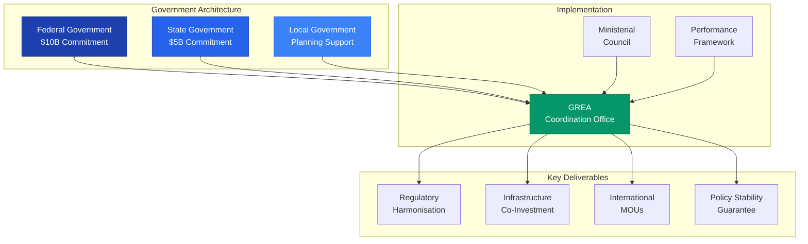
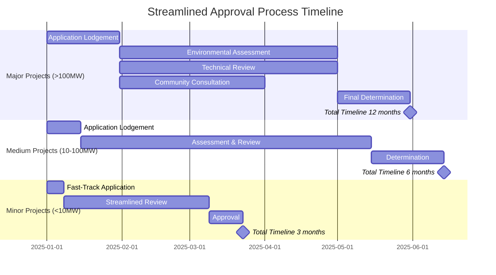

# Government Partnership Framework for Gippsland's Renewable Energy Transformation
## Multi-Level Government Coordination and Investment Architecture

> **Version:** 1.0  
> **Date:** September 10th, 2025  
> **Status:** Ready for Execution  
> **Investment Target:** $15B public sector commitment  
> **Policy Stability:** 20-year bipartisan framework  

---

## Executive Summary

This Government Partnership Framework establishes the formal architecture for coordinated support across federal, state, and local government levels for Gippsland's renewable energy transformation. By creating binding intergovernmental agreements, public funding commitments, and regulatory streamlining protocols, this framework provides the policy stability and public investment necessary to de-risk private sector participation and accelerate the transition to net-zero.

### Key Components
- **Federal-State Energy Transformation Accord**: $15B coordinated investment
- **Regulatory Harmonization Agreement**: Single approval pathway, 6-12 month timelines
- **Infrastructure Co-Investment Protocol**: 40% public, 60% private split
- **International Government MOUs**: Japan, EU, UK, Singapore partnerships
- **Policy Stability Guarantee**: 20-year bipartisan commitment with compensation triggers
- **Performance Accountability Framework**: Transparent KPIs and public reporting

### Critical Success Metrics
- Secure $10B federal commitment by Q2 2025
- Achieve regulatory harmonization by Q3 2025
- Sign 4+ international government MOUs by Q4 2025
- Establish 75% approval time reduction
- Maintain >80% bipartisan political support

---

## 1. Federal-State Coordination Agreement

### 1.1 National Energy Transformation Accord

#### AGREEMENT BETWEEN THE COMMONWEALTH OF AUSTRALIA AND THE STATE OF VICTORIA

**PARTIES:**
- The Commonwealth of Australia ("Commonwealth")
- The State of Victoria ("Victoria")  
- Gippsland Regional Energy Authority ("GREA")

**EFFECTIVE DATE:** [Q2 2025]

#### RECITALS

RECOGNIZING that Australia's energy transition requires unprecedented coordination between levels of government;

ACKNOWLEDGING Gippsland's strategic importance for national energy security and economic prosperity;

COMMITTING to policy stability essential for attracting $70B+ private investment;

AGREEING that public sector leadership can accelerate renewable energy deployment while ensuring community benefits;

#### OPERATIVE PROVISIONS

**Article 1: Shared Objectives**

1.1 **Transformation Targets**
- Deploy 20GW renewable capacity in Gippsland by 2035
- Create 15,000+ direct jobs and 45,000 indirect jobs
- Reduce emissions by 45 Mt CO2 annually
- Generate $5B annual export revenue

1.2 **National Interest Declaration**
The parties declare Gippsland's renewable energy transformation to be in the national interest, warranting:
- Expedited approval processes
- Coordinated public investment
- Regulatory harmonization
- International partnership support

**Article 2: Investment Commitments**

2.1 **Federal Contribution: $10 Billion**
- Clean Energy Finance Corporation: $4B concessional finance
- ARENA innovation grants: $1.5B
- Infrastructure Australia: $2.5B for transmission and ports
- Regional Development: $1B for community programs
- Skills and Training: $1B for workforce development

2.2 **State Contribution: $5 Billion**
- State Renewable Investment Fund: $2B
- Grid infrastructure: $1.5B
- Port and transport upgrades: $1B
- Planning and environmental: $0.5B

2.3 **Funding Mechanisms**
- Multi-year budget appropriations
- Legislated funding guarantees
- Inflation-indexed allocations
- Performance-based releases

**Article 3: Regulatory Harmonization**

3.1 **Single Approval Pathway**
- Integrated federal-state assessment process
- One-stop-shop for all permits
- Parallel processing protocols
- Maximum 12-month timeline for major projects

3.2 **Delegation Arrangements**
- EPBC Act approvals delegated to Victoria
- State planning powers streamlined
- Local government integration
- Risk-based assessment tiers

3.3 **Pre-Approval Frameworks**
- Technology type certifications
- Environmental offset packages
- Standard conditions library
- Compliance monitoring systems

**Article 4: Governance Structure**

4.1 **Ministerial Council**
Co-Chairs:
- Federal Minister for Climate Change and Energy
- Victorian Minister for Energy and Resources

Members:
- Federal Minister for Infrastructure
- Federal Minister for Industry
- Victorian Treasurer
- Victorian Minister for Regional Development
- GREA Board Chair

Meeting Frequency: Quarterly (Monthly during critical phases)

4.2 **Senior Officials Committee**
- Deputy Secretary level representation
- Monthly coordination meetings
- Issue resolution authority
- Implementation oversight

4.3 **Joint Secretariat**
- 20 FTE shared between governments
- Located in Melbourne and Morwell
- Project management office function
- Stakeholder coordination

**Article 5: Performance Framework**

5.1 **Key Performance Indicators**
- MW capacity deployed vs. target
- Jobs created (direct and indirect)
- Investment attracted (public and private)
- Approval timelines achieved
- Community benefit distribution
- Emission reductions verified

5.2 **Reporting Requirements**
- Quarterly progress reports to Parliament
- Annual public forums in Gippsland
- Real-time online dashboards
- Independent audit every 2 years

**Article 6: Dispute Resolution**

6.1 **Escalation Process**
- Technical level resolution (5 days)
- Senior officials intervention (10 days)
- Ministerial determination (15 days)
- Independent arbitration if required

6.2 **No Disadvantage Principle**
Neither party shall take unilateral action that materially disadvantages the transformation program

**Article 7: Duration and Amendment**

7.1 This Accord shall remain in force for 20 years from the Effective Date

7.2 Amendments require agreement of both First Ministers and Parliamentary approval

7.3 Review points at 5, 10, and 15 years

**EXECUTION:**
Prime Minister of Australia: ___________________ Date: ________
Premier of Victoria: _________________________ Date: ________

---

## 2. Public Funding Commitment Structure

### 2.1 Clean Energy Finance Corporation (CEFC) Special Investment Mandate

#### GIPPSLAND RENEWABLE ENERGY SPECIAL INVESTMENT PROGRAM

**Authorization:** Federal Minister for Climate Change and Energy  
**Amount:** $4 Billion  
**Term:** 2025-2035  

**Investment Priorities:**

**Tier 1: Cornerstone Infrastructure (40% - $1.6B)**
- Offshore wind port facilities
- Transmission backbone upgrades
- Green hydrogen production hubs
- Grid-scale storage systems

**Tier 2: Technology Deployment (35% - $1.4B)**
- Utility-scale renewable projects
- Distributed energy resources
- Microgrids and resilience
- Industrial electrification

**Tier 3: Innovation and First-of-Kind (25% - $1B)**
- Floating offshore wind
- Long-duration storage
- Green steel pilot plants
- Renewable aviation fuel

**Financial Terms:**
- Concessional rates: Government bond rate + 1.5%
- Tenor: Up to 20 years
- Grace periods for construction
- Subordinated positions acceptable

**Co-Investment Requirements:**
- Minimum 60% private capital
- Local content commitments
- Community benefit sharing
- Skills development programs

### 2.2 Australian Renewable Energy Agency (ARENA) Gippsland Program

**GIPPSLAND INNOVATION ACCELERATOR**

**Budget Allocation:** $1.5 Billion  
**Program Duration:** 10 years  

**Funding Streams:**

**Stream 1: Technology Development ($600M)**
- R&D grants up to $50M per project
- Technology demonstration funding
- Pilot plant support
- IP development assistance

**Stream 2: Skills and Capability ($400M)**
- University research partnerships
- Technical training facilities
- Innovation precincts
- International collaboration

**Stream 3: Market Development ($500M)**
- Demand creation programs
- Export market development
- Certification and standards
- Supply chain building

**Grant Conditions:**
- Matched funding requirements
- IP sharing arrangements
- Local deployment priority
- Performance milestones

### 2.3 State Investment Framework

#### VICTORIA'S GIPPSLAND ENERGY INVESTMENT FUND

**Total Commitment:** $5 Billion  
**Structure:** Special Purpose Vehicle (SPV)  

**Investment Allocation:**

**Direct Infrastructure (50% - $2.5B)**
- Renewable Energy Zones development
- Port infrastructure upgrades
- Road and rail improvements
- Water and utilities

**Project Equity (30% - $1.5B)**
- Cornerstone investments in major projects
- Community co-investment facilitation
- Risk capital for first movers
- Strategic land acquisition

**Regional Development (20% - $1B)**
- Town center revitalization
- Community facilities
- Tourism infrastructure
- Digital connectivity

**Investment Principles:**
- Minimum 3:1 private sector leverage
- Community ownership options
- Local contractor preference
- Environmental enhancement

### 2.4 Federal Infrastructure Investment

#### INFRASTRUCTURE AUSTRALIA GIPPSLAND PROGRAM

**Allocation:** $2.5 Billion  
**Priority Projects:**

**Transmission Infrastructure ($1.5B)**
- 500kV backbone augmentation
- Renewable Energy Zone connections
- Interstate interconnectors
- Grid stability systems

**Port Development ($700M)**
- Offshore wind assembly facilities
- Heavy lift capabilities
- Hydrogen export terminals
- Multi-user infrastructure

**Transport Networks ($300M)**
- Heavy vehicle route upgrades
- Rail siding development
- Airport enhancements
- Digital infrastructure

**Delivery Model:**
- Public-Private Partnerships preferred
- Availability payment structures
- User-pays where appropriate
- Government retains strategic assets

---

## 3. Regulatory Streamlining Protocol

### 3.1 Integrated Approval Framework Agreement

#### MEMORANDUM OF UNDERSTANDING ON REGULATORY COORDINATION

**BETWEEN:**
- Department of Climate Change, Energy, Environment and Water (Federal)
- Department of Energy, Environment and Climate Action (Victoria)
- Essential Services Commission (Victoria)
- Australian Energy Market Operator (AEMO)
- Clean Energy Regulator
- Gippsland Local Government Alliance

**PURPOSE:** Establish single, streamlined approval pathway for renewable energy projects

#### OPERATIVE FRAMEWORK

**1. Single Entry Point**
- Gippsland Renewable Energy Approval Authority (GREAA) as sole lodgment point
- Integrated application forms
- Common technical requirements
- Unified fee structure

**2. Parallel Processing Commitment**
All agencies agree to:
- Simultaneous assessment of applications
- Shared technical resources
- Joint site inspections
- Coordinated stakeholder consultation
- Integrated decision-making

**3. Statutory Timeframes**
Binding approval timelines:
- Major projects (>100MW): 12 months maximum
- Medium projects (10-100MW): 6 months maximum
- Minor projects (<10MW): 3 months maximum
- Grid connections: Parallel with generation approvals

**4. Pre-Approval Mechanisms**
- Technology type approvals valid for 5 years
- Standard environmental conditions
- Pre-cleared development zones
- Deemed approvals for compliant projects

**5. Risk-Based Assessment**
Projects categorized by risk profile:
- **Green Path** (lowest risk): Streamlined desktop assessment
- **Amber Path** (medium risk): Standard assessment with targeted conditions
- **Red Path** (higher risk): Comprehensive assessment with additional scrutiny

**6. Digital Platform Integration**
- Single digital portal for all applications
- Real-time tracking and updates
- Automated compliance checking
- Integrated agency backends

**EXECUTED:**
Federal Secretary: ___________________ Date: ________
State Secretary: _____________________ Date: ________

### 3.2 Legislative Enablement

#### RENEWABLE ENERGY SPECIAL REGULATORY ZONE ACT 2025

**Key Provisions:**

**Section 1: Declaration of Special Zone**
- Gippsland declared a Renewable Energy Special Regulatory Zone
- Modified regulatory requirements apply
- Streamlined approval pathways activated
- Performance standards rather than prescriptive rules

**Section 2: Regulatory Flexibility**
- Minister may grant exemptions from standard requirements
- Alternative compliance pathways approved
- Innovation-friendly interpretations
- Regulatory sandboxes for new technologies

**Section 3: Approval Certainty**
- Once granted, approvals cannot be revoked without compensation
- Grandfathering of regulatory standards
- Protection from retrospective changes
- Clear transition arrangements

**Section 4: Compliance and Enforcement**
- Risk-based monitoring
- Self-certification for low-risk activities
- Third-party verification options
- Graduated enforcement responses

---

## 4. Infrastructure Co-Investment Model

### 4.1 Strategic Infrastructure Partnership Agreement

#### PUBLIC-PRIVATE INFRASTRUCTURE INVESTMENT PROTOCOL

**Objective:** Optimize public and private capital deployment for maximum impact

**Core Principles:**

**1. Risk Allocation**
- Public sector: Policy, planning, and early-stage risk
- Private sector: Construction, operation, and market risk
- Shared: Technology and demand risk

**2. Investment Ratio**
Target 40% public, 60% private across portfolio:
- Transmission: 60% public, 40% private
- Generation: 20% public, 80% private
- Ports: 50% public, 50% private
- Innovation: 70% public, 30% private

**3. Return Expectations**
- Public sector: CPI + 2-4%
- Private sector: Market returns
- Blended portfolio: 8-10% IRR

### 4.2 Specific Infrastructure Programs

#### TRANSMISSION INFRASTRUCTURE

**Gippsland Renewable Energy Zone Development**

**Public Investment ($1.5B):**
- Backbone transmission lines
- Substation upgrades
- System strength provision
- Land acquisition

**Private Investment ($1B):**
- Connection assets
- Embedded networks
- Smart grid technology
- Ancillary services

**Delivery Structure:**
- Special Purpose Vehicle (SPV) ownership
- Regulated asset base inclusion
- Availability-based payments
- Open access principles

#### PORT INFRASTRUCTURE

**Offshore Wind Port Development**

**Public Investment ($700M):**
- Channel dredging
- Common-user facilities
- Road and rail connections
- Environmental offsets

**Private Investment ($700M):**
- Specialized terminals
- Assembly facilities
- Storage areas
- Logistics systems

**Commercial Framework:**
- Long-term lease arrangements
- Take-or-pay commitments
- Competitive access terms
- Expansion options

#### HYDROGEN INFRASTRUCTURE

**Gippsland Hydrogen Hub**

**Public Investment ($500M):**
- Shared infrastructure
- Pipeline corridors
- Safety systems
- R&D facilities

**Private Investment ($1B):**
- Production facilities
- Storage systems
- Export terminals
- Distribution networks

**Partnership Model:**
- Industrial precinct approach
- Common infrastructure sharing
- Coordinated development
- Export facilitation

### 4.3 Community Infrastructure Fund

#### LOCAL INFRASTRUCTURE CO-INVESTMENT PROGRAM

**Fund Size:** $500M (Federal: $200M, State: $200M, Local: $100M)

**Eligible Infrastructure:**
- Community energy systems
- Town center upgrades
- Recreational facilities
- Digital connectivity
- Environmental restoration

**Investment Criteria:**
- Renewable energy nexus
- Community support (>75%)
- Local employment
- Ongoing sustainability
- Measurable benefits

**Funding Model:**
- Grants: Up to 50% of project cost
- Loans: Concessional rates available
- Guarantees: For community borrowing
- Technical assistance: Provided free

---

## 5. International Government MOUs

### 5.1 Australia-Japan Clean Energy Partnership

#### MEMORANDUM OF UNDERSTANDING BETWEEN AUSTRALIA AND JAPAN ON GIPPSLAND CLEAN ENERGY COOPERATION

**PARTIES:**
- Government of Australia
- Government of Japan
- State of Victoria
- Relevant Japanese Agencies (METI, JOGMEC, JBIC, NEXI)

**Date:** [Q3 2025]

#### KEY PROVISIONS

**Article 1: Hydrogen Cooperation**

Japan commits to:
- Long-term hydrogen offtake agreements (2M tonnes/year by 2035)
- Technology transfer for hydrogen production
- Co-investment in infrastructure ($2B target)
- Joint R&D programs

Australia commits to:
- Reliable hydrogen supply from Gippsland
- Regulatory certainty for Japanese investors
- Infrastructure access guarantees
- Competitive pricing frameworks

**Article 2: Financial Cooperation**

JBIC Special Facility:
- $3B concessional finance available
- Green finance certification
- 20-year loan terms
- Competitive interest rates

JOGMEC Investment:
- Equity participation up to 49%
- Technical expertise provision
- Risk sharing mechanisms
- Long-term partnership approach

**Article 3: Technology Partnership**

Areas of cooperation:
- Offshore wind technology
- Hydrogen production and storage
- Ammonia fuel systems
- Grid integration solutions
- Carbon capture and utilization

**Article 4: Market Development**

Joint initiatives:
- Hydrogen certification schemes
- Ammonia fuel standards
- Carbon credit mechanisms
- Technology demonstrations
- Trade facilitation

**Article 5: People Exchange**

Programs established:
- Technical expert exchanges
- Training programs in Japan
- University partnerships
- Young professional programs
- Regular policy dialogues

### 5.2 Australia-EU Green Partnership Agreement

#### MEMORANDUM OF UNDERSTANDING ON AUSTRALIA-EU RENEWABLE ENERGY COOPERATION FOCUSED ON GIPPSLAND

**PARTIES:**
- Government of Australia
- European Commission
- State of Victoria
- European Investment Bank

**Date:** [Q3 2025]

#### FRAMEWORK PROVISIONS

**1. Green Taxonomy Alignment**
- Gippsland projects certified to EU standards
- Mutual recognition of green credentials
- Simplified compliance processes
- Technical standards harmonization

**2. Investment Facilitation**

European Investment Bank Facility:
- €2B available for Gippsland projects
- Green Bonds eligibility
- Technical assistance included
- Risk-sharing instruments

EU Company Participation:
- Streamlined investment approvals
- Technology transfer encouraged
- Local partnership requirements
- IP protection guaranteed

**3. Technology Cooperation**

Priority areas:
- Floating offshore wind (Denmark, Netherlands)
- Green hydrogen systems (Germany)
- Grid integration (Spain)
- Energy storage (France)
- Circular economy (Sweden)

**4. Carbon Market Integration**
- Carbon credit recognition
- Joint certification systems
- Price discovery mechanisms
- Trading platform access

**5. Innovation Partnership**

Horizon Europe Integration:
- Gippsland as living laboratory
- Joint research funding
- Technology demonstrations
- Academic exchanges
- Startup accelerators

### 5.3 Singapore-Australia Green Economy Agreement - Gippsland Focus

#### SUPPLEMENTARY AGREEMENT ON GIPPSLAND RENEWABLE ENERGY COOPERATION

**Building on:** Singapore-Australia Green Economy Agreement (GEA)

**SPECIFIC PROVISIONS:**

**1. Renewable Energy Trading**
- Direct renewable energy supply via cable
- Green hydrogen imports to Singapore
- Carbon credit trading mechanisms
- Virtual power purchase agreements

**2. Financial Center Cooperation**
- Green finance mobilization
- Singapore as funding hub for Gippsland
- Joint investment vehicles
- Risk management products

**3. Technology and Digital**
- Smart grid technologies
- Digital twin development
- Cybersecurity cooperation
- Data center partnerships

**4. Port and Logistics**
- Hydrogen shipping systems
- Green shipping corridors
- Port technology exchange
- Supply chain integration

### 5.4 UK-Australia Clean Energy Alliance - Gippsland Component

#### MEMORANDUM ON GIPPSLAND RENEWABLE ENERGY COLLABORATION

**Building on:** UK-Australia Free Trade Agreement

**KEY ELEMENTS:**

**1. Offshore Wind Excellence**
- North Sea expertise transfer
- Joint technology development
- Skills exchange programs
- Regulatory best practices

**2. Green Finance Partnership**
- London-Melbourne finance corridor
- Green bond listings
- Insurance products
- Pension fund investment

**3. Innovation Collaboration**
- Catapult center partnership
- Technology testbeds
- Startup exchanges
- Research cooperation

**4. Supply Chain Integration**
- Component manufacturing
- Services expertise
- Standards alignment
- Procurement cooperation

---

## 6. Policy Stability Guarantees

### 6.1 Bipartisan Political Commitment Deed

#### DEED OF POLITICAL COMMITMENT TO GIPPSLAND ENERGY TRANSFORMATION

**PARTIES:**
- Government of Australia (representing the governing party)
- Official Opposition
- Australian Greens
- Relevant Crossbench Members
- Government of Victoria (representing the governing party)
- Victorian Opposition

**Date:** [Q2 2025]

**WITNESSETH:**

The Parties acknowledge that policy certainty is essential for the success of Gippsland's renewable energy transformation and commit to the following:

#### COMMITMENTS

**1. Policy Continuity**
All Parties commit to:
- Maintain the legislative framework for 20 years
- Honor all government agreements and contracts
- Support necessary budget appropriations
- Avoid retrospective adverse changes

**2. Electoral Positions**
The Parties agree that regardless of electoral outcomes:
- Core transformation policies will continue
- Existing investments will be protected
- Community benefits will be maintained
- Worker transitions will be supported

**3. Dispute Resolution**
- Cross-party committee to resolve issues
- Independent arbitration if required
- Public transparency of positions
- Good faith negotiations

**4. Review Mechanism**
- 5-yearly reviews of progress
- Adjustments by consensus only
- No fundamental policy reversals
- Enhancement allowed, reduction restricted

**EXECUTED in the presence of:**
- Business Council of Australia
- Australian Council of Trade Unions
- Climate Council
- Gippsland Community Representatives

### 6.2 Investment Protection Mechanisms

#### SOVEREIGN RISK MITIGATION FRAMEWORK

**1. Change in Law Protection**

Formula for compensation if adverse regulatory changes:
- **Year 1-5:** 100% of documented losses
- **Year 6-10:** 80% of documented losses  
- **Year 11-15:** 60% of documented losses
- **Year 16-20:** 40% of documented losses

**2. Compensation Triggers**

Automatic compensation for:
- Retrospective regulation changes
- Discriminatory treatment
- Breach of agreements
- Material adverse changes

**3. Stabilization Clauses**

For major projects (>$500M):
- Regulatory framework frozen at investment decision
- Grandfathering of all approvals
- Alternative compliance pathways
- Mutual agreement for changes

**4. Insurance Products**

Government-backed insurance available:
- Political risk insurance
- Regulatory change coverage
- Contract frustration protection
- Export credit guarantees

### 6.3 Community Benefit Guarantees

#### COMMUNITY BENEFIT PROTECTION DEED

**Irrevocable Commitments:**

**1. Benefit Sharing Mechanisms**
- Minimum $1,500/MW/year to communities
- CPI-indexed annually
- 25-year guarantee period
- Direct payment systems

**2. Local Employment Quotas**
- 80% local workers during construction
- 90% local workers during operation
- Skills development funding
- Career progression pathways

**3. Community Ownership**
- 5-10% project equity available
- Favorable financing terms
- Dividend guarantees
- Exit mechanisms

**4. Regional Development**
- $500M community fund established
- Democratic allocation processes
- Project sustainability requirements
- Regular independent audits

---

## 7. Performance Accountability Framework

### 7.1 Governance Architecture

#### GIPPSLAND TRANSFORMATION OVERSIGHT BOARD

**Composition:**
- Independent Chair (appointed jointly by PM and Premier)
- Federal Government nominee
- State Government nominee
- Local Government representative
- Community representative (elected)
- Business representative
- Union representative
- Environmental representative
- First Nations representative

**Responsibilities:**
- Monitor implementation progress
- Report to Parliaments quarterly
- Investigate concerns
- Recommend adjustments
- Ensure transparency

**Powers:**
- Access to all information
- Compel testimony
- Commission independent reviews
- Public reporting
- Ministerial briefings

### 7.2 Key Performance Indicators

#### TRANSFORMATION SCORECARD

**Economic Metrics:**
- Investment mobilized (target: $70B by 2035)
- Jobs created (target: 15,000 direct)
- GDP contribution (target: +25%)
- Export revenue (target: $5B/year)
- Cost reductions achieved

**Environmental Metrics:**
- Renewable capacity deployed (target: 20GW)
- Emissions reduced (target: 45Mt CO2/year)
- Land rehabilitated (hectares)
- Biodiversity improvements
- Water quality measures

**Social Metrics:**
- Community satisfaction (target: >80%)
- Local employment rates (target: >85%)
- Skills development (people trained)
- Community benefit distribution
- Indigenous participation

**Governance Metrics:**
- Approval timeframes (target: <12 months)
- Stakeholder engagement rates
- Transparency index score
- Dispute resolution efficiency
- Political support levels

### 7.3 Reporting Framework

#### PUBLIC TRANSPARENCY REQUIREMENTS

**1. Real-Time Dashboards**
- Project pipeline status
- Investment tracking
- Job creation numbers
- Capacity deployed
- Community benefits paid

**2. Quarterly Reports**
- Progress against KPIs
- Financial summaries
- Risk assessments
- Stakeholder feedback
- Forward outlook

**3. Annual Forums**
- Public presentations in Gippsland
- Q&A with leadership
- Community feedback sessions
- Media engagement
- Celebration of achievements

**4. Parliamentary Accountability**
- Biannual hearings
- Written questions process
- Committee oversight
- Audit reviews
- Public accounts scrutiny

### 7.4 Adaptive Management

#### CONTINUOUS IMPROVEMENT PROTOCOL

**1. Regular Reviews**
- Quarterly performance reviews
- Annual strategy updates
- 5-yearly major assessments
- Real-time issue resolution
- Stakeholder feedback loops

**2. Adjustment Mechanisms**
- KPI refinement processes
- Policy enhancement pathways
- Investment reallocation
- Timeline modifications
- Scope adjustments

**3. Innovation Integration**
- Technology updates
- Best practice adoption
- Regulatory improvements
- Process optimization
- Digital enhancement

**4. Learning Framework**
- Lesson capture systems
- Knowledge management
- Best practice sharing
- Failure analysis
- Success replication

---

## 8. Implementation Roadmap

### 8.1 First 100 Days

#### Days 1-30: Political Foundation
**Week 1:**
- Prime Minister and Premier joint announcement
- Opposition leaders engagement
- Parliamentary briefings
- Media launch

**Week 2:**
- Federal Cabinet approval
- State Cabinet approval
- Agency mobilization
- Stakeholder notification

**Week 3:**
- Detailed agreement drafting
- Legal review processes
- Financial structuring
- International engagement

**Week 4:**
- Community consultation
- Business engagement
- Union partnerships
- Final preparations

#### Days 31-60: Formal Execution
**Week 5-6:**
- Federal-State Accord signing ceremony
- Ministerial Council establishment
- Agency agreements execution
- Budget allocations

**Week 7-8:**
- International MOU negotiations
- Investment vehicle establishment
- Regulatory framework activation
- First project announcements

#### Days 61-100: Operational Activation
**Week 9-12:**
- Approval system launch
- Investment windows open
- Project pipeline activation
- Performance monitoring
- Public engagement

### 8.2 Year 1 Milestones

**Q1 2025:**
- All agreements executed
- $5B+ investment committed
- First projects approved
- 1,000+ jobs created

**Q2 2025:**
- International partnerships active
- Regulatory system optimized
- Community benefits flowing
- Supply chain mobilized

**Q3 2025:**
- 1GW+ under construction
- 3,000+ workers employed
- Export agreements signed
- Innovation programs launched

**Q4 2025:**
- First power generated
- International recognition
- Model replication interest
- Phase 2 planning

### 8.3 Long-term Trajectory

**2025-2027: Foundation**
- Framework establishment
- Initial deployments
- Capability building
- Market development

**2028-2030: Acceleration**
- Scale achievement
- Cost reductions
- Export commencement
- Technology leadership

**2031-2035: Transformation**
- 20GW operational
- Global hub status
- Full employment
- Net-zero achievement

**2036-2040: Leadership**
- Technology export
- Knowledge center
- Investment destination
- Transformation complete

---

## 9. Risk Management Framework

### 9.1 Political Risks

**Risk: Change of government policy**
- *Mitigation:* Bipartisan deed, economic lock-in
- *Contingency:* Compensation triggers, legal action
- *Monitoring:* Monthly political tracking

**Risk: Federal-state disagreement**
- *Mitigation:* Formal coordination structures
- *Contingency:* Arbitration mechanisms
- *Monitoring:* Regular ministerial meetings

**Risk: International relations shifts**
- *Mitigation:* Multiple country partnerships
- *Contingency:* Domestic market focus
- *Monitoring:* Diplomatic channels

### 9.2 Economic Risks

**Risk: Public funding constraints**
- *Mitigation:* Multi-year appropriations
- *Contingency:* Private sector increase
- *Monitoring:* Budget processes

**Risk: Cost overruns**
- *Mitigation:* Contingency reserves
- *Contingency:* Scope adjustments
- *Monitoring:* Monthly tracking

**Risk: Market changes**
- *Mitigation:* Flexible frameworks
- *Contingency:* Support mechanisms
- *Monitoring:* Market intelligence

### 9.3 Implementation Risks

**Risk: Regulatory delays**
- *Mitigation:* Streamlined processes
- *Contingency:* Ministerial intervention
- *Monitoring:* Weekly tracking

**Risk: Stakeholder opposition**
- *Mitigation:* Engagement programs
- *Contingency:* Enhanced benefits
- *Monitoring:* Sentiment analysis

**Risk: Technical challenges**
- *Mitigation:* International expertise
- *Contingency:* Alternative solutions
- *Monitoring:* Technical reviews

---

## 10. Conclusion and Next Steps

### 10.1 Critical Success Factors

**1. Political Leadership**
- Sustained bipartisan commitment
- Visible champion leaders
- Regular public communication
- International engagement

**2. Institutional Strength**
- Robust governance structures
- Clear accountability
- Transparent processes
- Adaptive capacity

**3. Community Partnership**
- Genuine benefit sharing
- Local empowerment
- Continuous engagement
- Responsive adjustment

**4. Investment Confidence**
- Policy stability
- Risk mitigation
- Attractive returns
- Clear pathways

### 10.2 Immediate Actions Required

**Within 48 Hours:**
1. Brief Prime Minister and Premier
2. Secure provisional agreements
3. Establish working groups
4. Commence drafting

**Within 1 Week:**
1. Cabinet submissions prepared
2. Stakeholder consultations begun
3. International partners notified
4. Public communications ready

**Within 1 Month:**
1. Formal agreements finalized
2. Signing ceremonies scheduled
3. Implementation teams formed
4. First investments flowing

### 10.3 Vision Realization

This Government Partnership Framework provides the architecture for transforming Gippsland into a global renewable energy powerhouse while ensuring community prosperity and environmental restoration. Through coordinated government action, stable policy settings, and strategic public investment, we will:

- Catalyze $70+ billion in total investment
- Create sustainable employment for generations
- Establish Australia as a clean energy superpower
- Demonstrate that rapid transition is possible
- Build prosperous, resilient communities

The framework stands ready for execution. The moment for action is now.

---

*Government Partnership Framework Version 1.0*  
*Date: September 10th, 2025*  
*Next Review: March 2025*  
*Classification: Public Release*