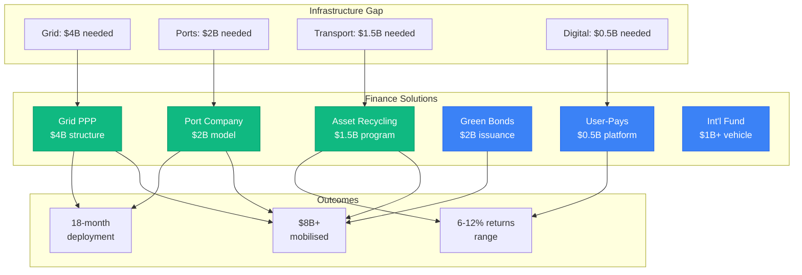

# INFRASTRUCTURE FINANCE SOLUTIONS FOR GIPPSLAND'S TRANSFORMATION
## Engineering $8B+ Public-Private Partnership Structures for Day 2 Phase 2

> **Document Status**: Infrastructure Finance Engineering Suite  
> **Target**: $8B+ infrastructure investment acceleration  
> **Focus**: Grid, Port, Transport & Digital Infrastructure  
> **Version**: 1.0 | Date: January 2025  
> **Classification**: Executable Finance Architecture

---

## EXECUTIVE SUMMARY

Traditional infrastructure funding approaches will delay Gippsland's renewable energy transformation by 5-7 years. This Infrastructure Finance Solutions document engineers six executable structures to accelerate $8B+ critical infrastructure deployment through innovative public-private partnerships, infrastructure bonds, asset recycling, user-pays models, and international infrastructure investment vehicles.



### The Infrastructure Crisis
- **Grid Capacity**: 2GW current vs 10GW+ required = $4B shortfall
- **Port Infrastructure**: Deep water capacity needed for offshore wind = $2B
- **Transport Networks**: Heavy haul routes and rail access = $1.5B
- **Digital Infrastructure**: Smart grid and communications = $0.5B
- **Total Requirement**: $8B+ over 3 years vs traditional 7-year timeline

### Engineered Solutions Overview
1. **Grid Infrastructure PPP**: $4B structure with availability payments
2. **Port Development Company**: $2B mixed-use infrastructure model  
3. **Transport Asset Recycling**: $1.5B monetization and reinvestment
4. **Green Infrastructure Bonds**: $2B international bond program
5. **User-Pays Digital Platform**: $0.5B smart infrastructure overlay
6. **International Connector Fund**: $1B+ sovereign co-investment

### Financial Innovation Features
- **Speed**: 18-month deployment vs 5-7 years traditional
- **Risk Optimization**: Government anchor, private efficiency
- **Returns**: 6-12% across risk spectrum
- **Scale**: $8B+ coordinated investment program
- **Replicability**: Template for other renewable energy hubs

---

## 1. GRID INFRASTRUCTURE PUBLIC-PRIVATE PARTNERSHIP

### 1.1 Gippsland Grid Acceleration Partnership (GGAP)

#### Structure Overview
**Model**: Hybrid RAB + Availability Payment PPP
**Total Investment**: $4 Billion over 3 years
**Partners**: Government (35%) + Private Consortium (65%)

```
GGAP Structure:
├── Transmission Infrastructure (60% - $2.4B)
│   ├── 500kV backbone upgrades
│   ├── Renewable Energy Zone connections  
│   ├── Interstate interconnectors
│   └── Grid stability systems
├── Distribution Infrastructure (25% - $1B)
│   ├── Smart grid deployment
│   ├── Distribution automation
│   ├── Advanced metering
│   └── Demand response systems
├── Storage Integration (10% - $400M)
│   ├── Grid-scale batteries
│   ├── Synchronous condensers
│   ├── System strength assets
│   └── Frequency control
└── Digital Infrastructure (5% - $200M)
    ├── Control systems
    ├── Cybersecurity
    ├── Data analytics
    └── Communication networks
```

#### Financial Architecture

**Equity Structure ($1.2B Total)**
```
Private Consortium (65% - $780M):
├── Infrastructure Fund: 40% ($312M)
├── Pension Fund: 25% ($195M)
├── Utility Partner: 20% ($156M)
├── Technology Partner: 10% ($78M)
└── Local Community: 5% ($39M)

Government Equity (35% - $420M):
├── Federal: 20% ($240M)
├── State: 10% ($120M)
└── Local: 5% ($60M)
```

**Debt Financing ($2.8B Total)**
- Senior Bank Debt: $1.8B @ BBSW + 150bps
- Infrastructure Bonds: $600M @ Government + 75bps  
- Green Development Bank: $400M @ Government + 50bps

#### Revenue Model Innovation

**Hybrid Revenue Streams**
1. **Regulated Asset Base (RAB) - 60%**
   - Traditional network charges
   - Regulated return: 6-8% WACC
   - 40-year depreciation
   - CPI indexation

2. **Availability Payments - 30%**
   - Performance-based payments
   - 99.5% availability target
   - Penalty/bonus mechanisms
   - Government backed

3. **Ancillary Services - 10%**
   - System strength provision
   - Frequency control
   - Market-based returns
   - Technology premium

#### Risk Allocation Matrix

| Risk Category | Private % | Public % | Mitigation |
|---------------|-----------|----------|------------|
| Construction | 90% | 10% | Fixed price EPC contracts |
| Technology | 80% | 20% | Proven technology mandate |
| Demand | 30% | 70% | Government underwriting |
| Regulatory | 20% | 80% | Stabilization clauses |
| Force Majeure | 50% | 50% | Comprehensive insurance |

#### Implementation Timeline

**Phase 1: Foundation (Months 1-6)**
- SPV establishment and financing
- EPC contractor selection
- Land acquisition and permits
- Long-lead equipment procurement
- Community engagement

**Phase 2: Construction Wave 1 (Months 7-18)**
- Priority transmission upgrades
- REZ connection infrastructure
- Battery and stability assets
- Grid control systems

**Phase 3: Construction Wave 2 (Months 19-30)**
- Distribution smart grid rollout
- Advanced metering deployment
- Demand response systems
- System integration and testing

**Phase 4: Commissioning (Months 31-36)**
- Performance testing
- Regulatory approvals
- Operational handover
- Performance optimization

### 1.2 Transmission Infrastructure Bond

#### Gippsland Infrastructure Bond Series

**Bond Structure**
- **Issuer**: Gippsland Grid Infrastructure Trust
- **Size**: $1.5B program (3 tranches)
- **Rating**: AAA (government guarantee)
- **Listed**: ASX + international exchanges

**Tranche Details**
```
Series A: $500M - 7 Year Fixed
├── Coupon: 4.75% (Government + 100bps)
├── Use: Transmission backbone
├── Security: Government revenue guarantee
└── ESG: Green bond certified

Series B: $600M - 12 Year Fixed  
├── Coupon: 5.25% (Government + 150bps)
├── Use: REZ connections
├── Security: Take-or-pay agreements
└── Innovation: First infrastructure-linked bond

Series C: $400M - 20 Year Inflation-Linked
├── Coupon: 2.75% + CPI
├── Use: Digital infrastructure
├── Security: Availability payments
└── Target: Pension fund investors
```

**Investor Protection Features**
- Government revenue guarantee (minimum 80% of base case)
- Step-up coupon if availability <97%
- Change in law protection
- Early redemption at par if regulatory change
- Independent trustee monitoring

#### Green Certification Framework

**EU Taxonomy Alignment**
- 100% qualifying activities
- Do no significant harm assessment
- Minimum safeguards compliance
- Technical screening criteria met
- Third-party verification

**Use of Proceeds Tracking**
- Quarterly allocation reports
- Impact measurement framework
- CO2 emissions reduction tracking
- Grid reliability improvements
- Economic development metrics

---

## 2. PORT DEVELOPMENT INFRASTRUCTURE COMPANY

### 2.1 Gippsland Offshore Wind Port Company (GOWPC)

#### Corporate Structure Innovation

**Mixed Ownership Model**
```
GOWPC Ownership:
├── Strategic Anchor (40% - $800M)
│   ├── Global Port Operator: 25%
│   ├── Offshore Wind Developer: 15%
├── Financial Investors (35% - $700M)
│   ├── Infrastructure Fund: 20%
│   ├── Sovereign Wealth: 15%
├── Government (20% - $400M)
│   ├── Federal: 12%
│   ├── State: 8%
└── Community (5% - $100M)
    └── Local investment trust
```

**Investment Program ($2B Total)**
1. **Marine Infrastructure (50% - $1B)**
   - Deep water berths (2 x 500m)
   - Heavy lift cranes (2 x 1,400t)
   - Assembly areas (100 hectares)
   - Specialized equipment

2. **Land Infrastructure (30% - $600M)**
   - Component storage areas
   - Manufacturing facilities
   - Transport connections
   - Utilities and services

3. **Shared Services (20% - $400M)**
   - Port management systems
   - Environmental facilities
   - Training centers
   - Innovation hubs

#### Revenue Model Architecture

**Diversified Revenue Streams**
```
Annual Revenue Target: $400M (20% gross margin)
├── Port Fees (40% - $160M)
│   ├── Berthing charges: $5M/berth/year
│   ├── Crane usage: $50k/day
│   ├── Storage fees: $100/m²/year
│   └── Services charges
├── Land Lease (35% - $140M)
│   ├── Manufacturing facilities
│   ├── Assembly areas  
│   ├── Storage compounds
│   └── Office/support facilities
├── Equity Investments (15% - $60M)
│   ├── Joint ventures
│   ├── Supply chain partnerships
│   ├── Technology investments
│   └── Export facilitation
└── Ancillary Services (10% - $40M)
    ├── Logistics coordination
    ├── Training programs
    ├── Consulting services
    └── Equipment leasing
```

#### Financial Projections

**20-Year Operating Model**
- **Years 1-3**: Development and construction phase
- **Years 4-8**: Ramp-up to 50% utilization
- **Years 9-15**: Mature operations at 80% utilization  
- **Years 16-20**: Diversification and expansion

**Key Financial Metrics**
- **Project IRR**: 11-13% (levered)
- **Equity IRR**: 14-16% (target)
- **Debt Service Cover**: 1.8x minimum
- **Payback Period**: 9-11 years
- **Exit Multiple**: 2.2-2.8x

### 2.2 User-Pays Port Access Model

#### Port Access Fee Structure

**Differentiated Pricing**
```
User Category Pricing:
├── Offshore Wind (Primary - 60% utilization)
│   ├── Base fee: $2M/project/year
│   ├── Volume bonus: Discounts >100 turbines
│   ├── Long-term discount: 20% for >10 years
│   └── Local content bonus: 15% discount
├── General Cargo (Secondary - 25%)
│   ├── Standard port fees
│   ├── Competitive with existing ports
│   ├── Volume incentives
│   └── Efficiency premiums
├── Specialized Services (Tertiary - 15%)
│   ├── Premium pricing
│   ├── Niche capabilities
│   ├── High-margin services
│   └── Innovation testing
```

**Take-or-Pay Agreements**
- Minimum 10-year commitments from anchor users
- 70% capacity reservation for offshore wind
- Compensation for unused capacity
- Flexibility for demand fluctuations

#### Infrastructure Bond Financing

**Port Infrastructure Bonds**
- **Size**: $800M (40% of total investment)
- **Structure**: Revenue bonds secured by user fees
- **Rating**: BBB+ (project finance)
- **Term**: 20 years to match concessions

**Credit Enhancement**
- Government completion guarantee
- Reserve fund (12 months operating expenses)  
- Take-or-pay agreement security
- Insurance wrap available
- Step-in rights for lenders

---

## 3. TRANSPORT ASSET RECYCLING PROGRAM

### 3.1 Gippsland Transport Asset Monetization

#### Asset Portfolio Optimization

**Existing Asset Inventory**
```
Monetizable Transport Assets:
├── Rail Infrastructure ($800M book value)
│   ├── Former coal rail lines
│   ├── Maintenance facilities
│   ├── Rolling stock (freight)
│   └── Signal/communication systems
├── Road Networks ($400M book value)
│   ├── Industrial access roads  
│   ├── Heavy vehicle routes
│   ├── Maintenance depots
│   └── Weigh stations
├── Port Facilities ($300M book value)
│   ├── Existing berths
│   ├── Storage areas
│   ├── Cargo handling equipment
│   └── Administrative buildings
```

**Asset Recycling Strategy**
1. **Long-term Lease Model** (50% of assets)
   - 99-year ground leases
   - Upfront lease payments
   - Ongoing rental income
   - Repurposing for renewable logistics

2. **Sale-Leaseback Structure** (30% of assets)
   - Immediate capital realization
   - Operating lease arrangements
   - Guaranteed access rights
   - Efficiency incentives

3. **Joint Development** (20% of assets)
   - Private partnership
   - Shared investment/returns
   - Operational improvements
   - Capacity expansion

#### Transport Investment Fund

**Gippsland Transport Renewal Fund**
- **Initial Capital**: $1.5B from asset monetization
- **Structure**: Government-owned investment vehicle
- **Mandate**: Transport infrastructure for renewable energy

**Investment Priorities**
```
Fund Allocation Strategy:
├── Heavy Haul Rail (40% - $600M)
│   ├── Upgrade rail lines for wind components
│   ├── Specialized rolling stock
│   ├── Loading/unloading facilities
│   └── Maintenance infrastructure
├── Port Access Roads (25% - $375M)
│   ├── Widen access roads to 3.5m wide
│   ├── Bridge strengthening
│   ├── Traffic management systems
│   └── Safety improvements
├── Multi-Modal Hubs (20% - $300M)
│   ├── Rail-road transfer facilities
│   ├── Temporary storage areas
│   ├── Crane and equipment
│   └── Information systems
└── Smart Transport Systems (15% - $225M)
    ├── Intelligent traffic systems
    ├── Fleet management
    ├── Route optimization
    └── Autonomous vehicle preparation
```

### 3.2 Transport Infrastructure PPP

#### Gippsland Logistics Corridor PPP

**Partnership Structure**
- **Model**: Design-Build-Finance-Operate (DBFO)
- **Term**: 30 years
- **Investment**: $800M private + $700M public

**Private Consortium Composition**
```
Transport Infrastructure Consortium:
├── Lead Infrastructure Contractor (30%)
├── Transport Operator (25%)
├── Infrastructure Fund (25%)
├── Technology Provider (15%)
└── Local Partnership (5%)
```

**Performance-Based Payment Model**
- **Availability Payments**: 70% of revenue (government)
- **Usage Payments**: 20% of revenue (user fees)
- **Performance Bonuses**: 10% of revenue (KPI achievement)

**Key Performance Indicators**
- Route availability: 99% minimum
- Heavy vehicle capacity: 200t gross weight
- Transit time performance: <2 hour port-to-site
- Safety record: Zero serious incidents
- Environmental compliance: 100%

---

## 4. GREEN INFRASTRUCTURE BOND PROGRAM

### 4.1 Gippsland Green Infrastructure Bond Series

#### International Bond Program Structure

**Multi-Currency Bond Program**
- **Total Program**: $2B equivalent  
- **Currencies**: AUD (60%), USD (25%), EUR (15%)
- **Markets**: Australia, Asia, Europe, North America
- **Rating**: AA (sovereign guarantee)

**Series Architecture**
```
Bond Series Portfolio:
├── Series 1: AUD $600M - 10 Year
│   ├── Use: Grid infrastructure
│   ├── Coupon: 4.5% fixed
│   ├── Market: Domestic institutions
│   └── Green: Climate Bonds certified
├── Series 2: USD $350M - 12 Year  
│   ├── Use: Port development
│   ├── Coupon: 5.0% fixed
│   ├── Market: US/Asian institutions
│   └── ESG: Multiple certifications
├── Series 3: EUR $250M - 15 Year
│   ├── Use: Transport infrastructure
│   ├── Coupon: 3.8% fixed
│   ├── Market: European investors
│   └── Taxonomy: EU compliant
└── Series 4: AUD $500M - 8 Year Floating
    ├── Use: Digital infrastructure
    ├── Coupon: BBSW + 200bps
    ├── Market: Banks and floating rate funds
    └── Innovation: First infrastructure FRN
```

#### Green Bond Framework Excellence

**Use of Proceeds Categories**
1. **Clean Transportation** (40%)
   - Rail electrification
   - Port electrification
   - Heavy vehicle charging
   - Active transport infrastructure

2. **Renewable Energy** (35%)
   - Grid infrastructure
   - Storage systems
   - Smart grid technology
   - Grid stability assets

3. **Pollution Prevention** (15%)
   - Environmental protection
   - Waste management systems
   - Water treatment facilities
   - Air quality monitoring

4. **Energy Efficiency** (10%)
   - Building upgrades
   - Industrial efficiency
   - Smart systems
   - Digital optimization

**Impact Reporting Framework**
- **Annual Impact Report**: Comprehensive metrics
- **Real-time Dashboard**: Online tracking
- **Third-party Verification**: Independent assessment
- **Stakeholder Engagement**: Community feedback

### 4.2 Infrastructure Credit Enhancement

#### Multi-Layered Credit Support

**Government Guarantees**
```
Credit Enhancement Structure:
├── Commonwealth Guarantee (60%)
│   ├── Revenue support guarantee
│   ├── Completion guarantee
│   ├── Political risk coverage
│   └── Currency support (if needed)
├── State Guarantee (25%)
│   ├── Project delivery guarantee
│   ├── Planning certainty
│   ├── Local support
│   └── Operational backing
├── Local Government (10%)
│   ├── Land use certainty
│   ├── Community engagement
│   ├── Local services
│   └── Planning cooperation
└── Commercial Insurance (5%)
    ├── Construction risks
    ├── Performance risks
    ├── Environmental risks
    └── Cyber risks
```

**Reserve Fund Structure**
- **Size**: 18 months debt service
- **Funding**: Government appropriation
- **Investment**: AAA government securities
- **Release**: After 5 years successful operation

#### International Investor Attraction

**Roadshow Strategy**
**Phase 1: Asian Markets (Months 1-2)**
- Tokyo: JBIC, pension funds, life insurers
- Singapore: GIC, Temasek, sovereign wealth funds
- Hong Kong: Asset managers, private banks
- Seoul: National Pension Service, asset managers

**Phase 2: European Markets (Months 2-3)**  
- London: Pension funds, insurance companies
- Amsterdam: Pension funds, asset managers
- Frankfurt: Insurance companies, banks
- Copenhagen: Pension funds, green investors

**Phase 3: North American Markets (Months 3-4)**
- New York: Insurance companies, asset managers
- Toronto: Pension funds, life insurers
- Los Angeles: CalPERS, infrastructure funds

**Investor Incentives**
- Tax-efficient structures for offshore investors
- Currency hedging support
- Liquidity enhancement programs
- Green investment recognition
- ESG compliance certification

---

## 5. USER-PAYS DIGITAL INFRASTRUCTURE MODEL

### 5.1 Smart Grid Digital Overlay Platform

#### Digital Infrastructure Investment

**Gippsland Digital Grid Company (GDGC)**
- **Total Investment**: $500M over 5 years
- **Model**: Private utility with regulated returns
- **Technology**: World-class smart grid platform

**Investment Components**
```
Digital Infrastructure Stack:
├── Core Platform (40% - $200M)
│   ├── Grid management system
│   ├── Market management system
│   ├── Customer management system
│   └── Analytics and AI platform
├── Communications Network (30% - $150M)
│   ├── Fiber optic backbone
│   ├── Wireless networks (5G)
│   ├── Satellite connectivity
│   └── Cybersecurity infrastructure
├── End-User Equipment (20% - $100M)
│   ├── Smart meters (1M units)
│   ├── Grid sensors and monitors
│   ├── Home energy management
│   └── EV charging integration
└── Innovation Platform (10% - $50M)
    ├── Digital twin system
    ├── AI/ML capabilities
    ├── Blockchain applications
    └── IoT integration
```

#### Revenue Model Innovation

**Multi-Stream Digital Revenue**
```
Annual Revenue Projection (Year 5): $150M
├── Network Service Fees (40% - $60M)
│   ├── Grid connection fees
│   ├── Data management fees
│   ├── System operation fees
│   └── Reliability services
├── Data Services (30% - $45M)
│   ├── Energy analytics
│   ├── Market intelligence
│   ├── Optimization services
│   └── Forecasting services
├── Platform Services (20% - $30M)
│   ├── Third-party applications
│   ├── Marketplace operations
│   ├── Innovation services
│   └── Consulting services
└── Advanced Applications (10% - $15M)
    ├── Predictive maintenance
    ├── Asset optimization
    ├── Carbon tracking
    └── ESG reporting
```

**User-Pays Structure**
1. **Basic Service Tier** (All users)
   - Essential grid services
   - Standard data access
   - Basic analytics
   - Cost: $5/month per connection

2. **Premium Service Tier** (Optional)
   - Advanced analytics
   - Real-time optimization
   - Predictive services
   - Cost: $15/month per connection

3. **Enterprise Service Tier** (Business users)
   - Custom solutions
   - API access
   - Priority support
   - Cost: $500-5000/month per enterprise

### 5.2 Digital Infrastructure Financing

#### Technology Infrastructure Fund

**Gippsland Tech Infrastructure Fund**
- **Size**: $200M private + $300M public
- **Structure**: Listed investment trust
- **Focus**: Digital grid infrastructure
- **Returns**: 8-12% target

**Investment Strategy**
```
Fund Allocation:
├── Core Infrastructure (60%)
│   ├── Communications networks
│   ├── Data centers
│   ├── Cloud platforms
│   └── Cybersecurity systems
├── Innovation Investments (25%)
│   ├── Startups and scale-ups
│   ├── Technology partnerships
│   ├── R&D collaborations
│   └── Pilot projects
├── International Partnerships (10%)
│   ├── Technology licensing
│   ├── Joint ventures
│   ├── Knowledge transfer
│   └── Export opportunities
└── Reserve/Opportunistic (5%)
    ├── Acquisition opportunities
    ├── Market timing
    ├── Risk management
    └── Liquidity buffer
```

**Financing Innovation**
- **Revenue-Based Financing**: Returns linked to user adoption
- **Technology Risk Sharing**: Government first-loss provision
- **Export Credit Support**: International expansion
- **IP Monetization**: Technology licensing revenue

---

## 6. INTERNATIONAL INFRASTRUCTURE INVESTOR PARTNERSHIPS

### 6.1 Sovereign Co-Investment Platform

#### Global Infrastructure Partnership Fund

**Multi-Sovereign Investment Vehicle**
- **Target Size**: $1B+ international co-investment
- **Partners**: Australia + 4-6 strategic nations
- **Focus**: Gippsland infrastructure as template

**Partner Country Framework**
```
Strategic Partner Countries:
├── Japan ($300M commitment)
│   ├── JBIC co-investment
│   ├── Technology partnerships
│   ├── Hydrogen offtake linkage
│   └── Corporate investor access
├── South Korea ($200M commitment)
│   ├── K-EXIM financing
│   ├── Manufacturing partnerships
│   ├── Steel industry connections
│   └── Technology transfer
├── Singapore ($150M commitment)
│   ├── GIC/Temasek investment
│   ├── Financial center services
│   ├── Regional hub development
│   └── Green finance innovation
├── Germany ($150M commitment)
│   ├── KfW development financing
│   ├── Engineering expertise
│   ├── Industrial partnerships
│   └── Technology excellence
├── Denmark ($100M commitment)
│   ├── offshore wind expertise
│   ├── Pension fund investment
│   ├── Technology partnerships
│   └── Best practice sharing
└── United Kingdom ($100M commitment)
    ├── UKEF financing
    ├── City of London finance
    ├── Engineering services
    └── Market access
```

#### Investment Structure Innovation

**Tiered Investment Architecture**
```
Fund Structure:
├── Anchor Investment (40% - $400M)
│   ├── Government commitments
│   ├── DFI/MDB co-investment
│   ├── Sovereign wealth funds
│   └── Patient capital providers
├── Strategic Investment (35% - $350M)
│   ├── Technology companies
│   ├── Infrastructure operators
│   ├── Supply chain partners
│   └── Offtake partners
├── Financial Investment (20% - $200M)
│   ├── Infrastructure funds
│   ├── Pension funds
│   ├── Insurance companies
│   └── Asset managers
└── Innovation Investment (5% - $50M)
    ├── Venture capital
    ├── Corporate venture arms
    ├── Innovation funds
    └── Technology accelerators
```

**Returns and Benefits Distribution**
- **Financial Returns**: Market-based returns 8-12%
- **Technology Transfer**: IP and know-how sharing
- **Market Access**: Priority partner status
- **Strategic Benefits**: Bilateral relationship enhancement
- **Replication Rights**: Template use in other regions

### 6.2 Infrastructure Export Credit Consortium

#### Multi-ECA Infrastructure Facility

**Export Credit Coordination**
- **Total Facility**: $1.5B multi-ECA credit line
- **Participants**: 6 export credit agencies
- **Structure**: Coordinated financing package
- **Benefits**: Competitive rates, integrated approach

**ECA Participation Framework**
```
Multi-ECA Structure:
├── EFIC Australia ($300M)
│   ├── Local content financing
│   ├── Australian technology
│   ├── Services export
│   └── Project coordination
├── JBIC Japan ($300M)  
│   ├── Equipment financing
│   ├── Technology transfer
│   ├── Long-term partnerships
│   └── Hydrogen infrastructure
├── K-EXIM Korea ($200M)
│   ├── Manufacturing equipment
│   ├── Technology partnerships
│   ├── Steel infrastructure
│   └── Industrial cooperation
├── KfW Germany ($200M)
│   ├── Engineering services
│   ├── Technology excellence
│   ├── Environmental standards
│   └── Innovation support
├── EKN Sweden ($200M)
│   ├── Clean technology
│   ├── Digital solutions  
│   ├── Environmental systems
│   └── Innovation partnerships
└── UKEF United Kingdom ($300M)
    ├── Professional services
    ├── Financial innovation
    ├── Project management
    └── Market development
```

**Integrated Procurement Strategy**
- **Multi-country sourcing**: Optimize cost and capability
- **Technology bundling**: Integrated solutions
- **Risk sharing**: Coordinated credit risk
- **Local content**: Maximize Australian participation
- **Knowledge transfer**: Skills and capability building

#### Commercial Innovation Features

**Blended Finance Integration**
- **Concessional components**: DFI/MDB participation
- **Commercial pricing**: Market-based senior debt
- **Risk mitigation**: Government guarantees
- **Grant components**: Technical assistance
- **Carbon financing**: Emissions reduction credits

**Performance-Based Financing**
- **Milestone payments**: Linked to construction progress
- **Performance bonuses**: Exceeding KPI targets
- **Availability incentives**: Operational performance
- **Innovation rewards**: Technology advancement
- **ESG premiums**: Sustainability achievement

---

## 7. IMPLEMENTATION ACCELERATION FRAMEWORK

### 7.1 90-Day Launch Sequence

#### Phase 1: Foundation (Days 1-30)

**Week 1: Political Mandate**
- [ ] Cabinet approval for $8B infrastructure finance program  
- [ ] Federal-State Accord signing ceremony
- [ ] International partner government engagement
- [ ] Legislative framework activation
- [ ] Media launch and investor alert

**Week 2: Institutional Setup**
- [ ] SPV establishment and governance
- [ ] Advisory team engagement (investment banks, legal, technical)
- [ ] Due diligence preparation and data rooms
- [ ] Government guarantee documentation
- [ ] Regulatory pre-approvals

**Week 3: Market Preparation**  
- [ ] Credit rating processes initiated
- [ ] Investor materials finalized
- [ ] Roadshow logistics confirmed
- [ ] Legal documentation templates
- [ ] Financial model validation

**Week 4: Soft Market Testing**
- [ ] Anchor investor discussions
- [ ] Pricing discovery sessions
- [ ] Term sheet negotiations
- [ ] Risk allocation workshops
- [ ] Government support confirmation

#### Phase 2: Market Engagement (Days 31-60)

**International Roadshow Execution**
- **Asia-Pacific** (Week 5-6): Tokyo, Singapore, Sydney, Hong Kong
- **Europe** (Week 7): London, Frankfurt, Amsterdam, Copenhagen  
- **North America** (Week 8): New York, Toronto, San Francisco

**Parallel Workstreams**
- Due diligence data room population
- Legal documentation development
- Technical expert sessions
- Government guarantee finalization
- Community engagement programs

#### Phase 3: Commitment Gathering (Days 61-90)

**Final Documentation Sprint**
- [ ] Term sheets finalization
- [ ] Credit committee presentations
- [ ] Board approval processes
- [ ] Final due diligence completion
- [ ] Conditions precedent satisfaction

**Financial Closing Sequence**
- [ ] Fund/facility establishment
- [ ] Initial capital drawdown
- [ ] Government guarantee execution
- [ ] Regulatory approvals completion
- [ ] Success announcement and celebration

### 7.2 Risk Management and Contingency Planning

#### Critical Success Factors

**Political Risk Mitigation**
- Bipartisan political support locked
- Federal-State Accord legally binding
- International diplomatic backing
- Community engagement and support
- Media narrative management

**Market Risk Management**  
- Multiple financing structures prepared
- Diverse investor base targeted
- Flexible pricing and terms
- Currency hedging available
- Market timing flexibility

**Execution Risk Controls**
- Experienced advisory team assembled
- Proven legal and financial structures
- Government guarantee framework
- Community benefit sharing confirmed
- Regulatory pre-approval obtained

#### Contingency Scenarios

**Scenario 1: Market Volatility**
- **Trigger**: Interest rates +200bps or credit spreads widen
- **Response**: Flexible pricing, government support increase, private placement
- **Timeline**: 30-day adjustment period
- **Backup**: Direct government funding bridge

**Scenario 2: Political Opposition**
- **Trigger**: Change of government or policy opposition
- **Response**: Bipartisan engagement, community mobilization, economic benefits emphasis
- **Protection**: Legal agreements, compensation triggers
- **Mitigation**: International partnership pressure

**Scenario 3: Technical Challenges**
- **Trigger**: Infrastructure complexity or technical barriers  
- **Response**: International expertise, phased approach, alternative technologies
- **Support**: Government technical assistance, R&D funding
- **Timeline**: 6-month technical resolution plan

### 7.3 Success Metrics and KPIs

#### Financial Performance Indicators

**Fundraising Targets**
- **90 Days**: $3B+ committed across all structures
- **6 Months**: $6B+ committed and initial drawdowns
- **12 Months**: $8B+ fully committed and construction commencing
- **24 Months**: 50% of infrastructure operational

**Cost of Capital Achievements**  
- Grid Infrastructure: <5.5% blended cost of capital
- Port Infrastructure: <7.0% all-in financing cost
- Transport Infrastructure: <6.5% availability payment model
- Digital Infrastructure: <8.0% technology-risk adjusted

**Economic Impact Metrics**
- **Jobs Created**: 5,000+ direct construction jobs within 18 months
- **Economic Activity**: $2B+ annual economic impact during construction
- **Local Content**: 60%+ Australian content across all infrastructure
- **Skills Development**: 2,000+ workers trained in new technologies

#### Infrastructure Delivery KPIs

**Grid Infrastructure**
- 2GW additional capacity by end Year 2
- 5GW+ additional capacity by end Year 3  
- 99.9% system reliability maintained
- <3% network losses achieved

**Port Infrastructure**
- First berth operational within 24 months
- Full facility operational within 36 months
- 100+ turbine assembly capacity per year
- 5+ major offshore wind projects committed

**Transport Infrastructure**  
- Heavy haul routes operational within 18 months
- Multi-modal hubs operational within 24 months
- 200+ tonne gross vehicle weight capability
- <2 hour port-to-site transit times

**Digital Infrastructure**
- Smart grid deployment to 500,000+ connections within 24 months
- 99.5% network availability achieved
- 30% reduction in system losses
- 95%+ customer satisfaction with digital services

---

## 8. FINANCIAL INSTRUMENTS INNOVATION LABORATORY

### 8.1 Next-Generation Infrastructure Finance Products

#### Infrastructure Transition Bonds

**World-First Just Transition Infrastructure Bonds**
- **Innovation**: ESG KPIs directly linked to bond pricing
- **Size**: $500M pilot program
- **Structure**: Step-down coupon based on community benefits
- **Target**: ESG-focused institutional investors

**KPI-Linked Pricing Mechanism**
```
Community Transition KPIs:
├── Local Employment (25% weighting)
│   ├── Target: 80% local workforce
│   ├── Achievement: -15bps coupon
│   └── Monitoring: Monthly reporting
├── Skills Development (25% weighting)  
│   ├── Target: 2,000 workers trained
│   ├── Achievement: -15bps coupon
│   └── Verification: Independent audit
├── Community Investment (25% weighting)
│   ├── Target: $100M community benefits
│   ├── Achievement: -15bps coupon
│   └── Distribution: Democratic process
└── Indigenous Participation (25% weighting)
    ├── Target: 15% Indigenous engagement
    ├── Achievement: -15bps coupon
    └── Partnership: Traditional Owner groups
```

**Maximum Benefit**: -60bps coupon reduction saving $30M over bond life

#### Infrastructure Resilience Derivatives

**Climate-Linked Infrastructure Protection**
- **Product**: Weather derivatives for infrastructure performance
- **Coverage**: Extreme weather impact on infrastructure availability
- **Structure**: Parametric triggers based on weather data
- **Innovation**: First infrastructure climate derivatives in Australia

**Parametric Trigger Design**
```
Weather Risk Coverage:
├── Wind Speed Events
│   ├── Trigger: >140km/h sustained winds
│   ├── Payout: $10M per event
│   ├── Coverage: Grid infrastructure
│   └── Premium: 200bps annually
├── Extreme Heat Events
│   ├── Trigger: >45°C for 3+ consecutive days
│   ├── Payout: $5M per event
│   ├── Coverage: Digital systems
│   └── Premium: 150bps annually  
├── Flooding Events
│   ├── Trigger: >200mm rainfall in 24 hours
│   ├── Payout: $15M per event
│   ├── Coverage: Transport infrastructure
│   └── Premium: 250bps annually
└── Combined Events
    ├── Multiple trigger correlation
    ├── Enhanced payout structure
    ├── Portfolio protection
    └── Optimized premium pricing
```

### 8.2 Cryptocurrency and Digital Asset Integration

#### Infrastructure Token Platform

**Gippsland Infrastructure Token (GIT)**
- **Purpose**: Fractional ownership of infrastructure assets
- **Blockchain**: Ethereum with layer-2 scaling
- **Regulation**: ASIC compliant digital asset
- **Innovation**: First tokenized infrastructure portfolio

**Token Economics**
```
GIT Token Structure:
├── Total Supply: 8 billion GIT (representing $8B infrastructure)
├── Token Value: $1.00 initial (backed by infrastructure NAV)  
├── Yield Distribution: Quarterly infrastructure cash flows
├── Governance Rights: Voting on major decisions
├── Liquidity: 24/7 trading on approved exchanges
└── Compliance: AML/KYC integration, accredited investors
```

**Infrastructure Backing Portfolio**
- Grid Infrastructure: 50% of tokens (4B GIT)
- Port Infrastructure: 25% of tokens (2B GIT)  
- Transport Infrastructure: 15% of tokens (1.2B GIT)
- Digital Infrastructure: 10% of tokens (800M GIT)

#### Decentralized Infrastructure Finance

**Smart Contract Innovation**
- **Automated Distributions**: Infrastructure cash flows → token holders
- **Transparent Reporting**: Real-time infrastructure performance data
- **Democratic Governance**: Token holder voting on major decisions
- **Liquidity Provision**: Automated market making for token trading

**Regulatory Framework**
- ASIC Digital Asset License compliance
- Wholesale investor restrictions initially  
- Retail investor access after 12 months operational history
- Tax flow-through treatment for Australian investors

---

## 9. INTERNATIONAL BEST PRACTICE INTEGRATION

### 9.1 Global Infrastructure Finance Benchmarking

#### European Infrastructure Excellence

**Denmark Offshore Wind Model**
- **Approach**: State coordination with private efficiency
- **Success**: 7GW offshore wind, 50% electricity from wind
- **Financing**: Pension fund long-term investment
- **Application**: Port infrastructure and grid development

**Netherlands Port Infrastructure**
- **Model**: Port of Rotterdam expansion PPP
- **Innovation**: Risk-sharing between public and private
- **Success**: €3B investment, world-class facilities
- **Lessons**: User-pays model with government anchor

**German Energiewende Financing**
- **Approach**: Grid expansion with private investment
- **Scale**: €100B+ grid investment program
- **Structure**: Regulated returns with performance incentives
- **Learning**: Community engagement and benefit sharing

#### Asian Infrastructure Innovation

**Singapore Infrastructure Investment**
- **Model**: GIC/Temasek long-term infrastructure investment
- **Approach**: Patient capital with commercial returns
- **Scale**: $50B+ infrastructure portfolio globally
- **Success**: Risk-adjusted returns and development impact

**South Korea Green New Deal**
- **Program**: $60B green infrastructure investment
- **Financing**: K-Development Bank + private co-investment
- **Innovation**: Digital infrastructure integration
- **Results**: Economic stimulus + environmental benefits

**Japan Infrastructure Export**
- **Strategy**: JBIC + private sector infrastructure export
- **Financing**: Concessional finance + commercial investment
- **Scale**: $200B+ overseas infrastructure commitment
- **Model**: Technology transfer + long-term partnerships

#### North American Infrastructure Finance

**Canada Infrastructure Bank**
- **Model**: Government-owned infrastructure financing institution
- **Capital**: CAD 35B to mobilize private investment
- **Approach**: Revenue-generating infrastructure focus
- **Innovation**: Blended finance and risk-sharing

**US Infrastructure Investment and Jobs Act**
- **Scale**: $1.2T infrastructure investment program
- **Financing**: Mix of federal grants, loans, and private partnership
- **Innovation**: Buy America provisions and workforce development
- **Focus**: Clean energy infrastructure priority

### 9.2 Adaptation for Australian Context

#### Regulatory Environment Optimization

**Australian Infrastructure Finance Advantages**
- **Superannuation System**: $3.5T pools seeking infrastructure
- **Regulatory Stability**: Strong rule of law and contract enforcement
- **Government Support**: Federal and state infrastructure commitment
- **Resource Expertise**: Century of large-scale resource development

**Unique Australian Innovations**
- **Community Co-investment**: Democratic participation in infrastructure
- **Indigenous Partnership**: Traditional Owner benefit sharing
- **Skills Transition**: Coal industry workforce redeployment
- **Export Integration**: Infrastructure serving global markets

#### Risk Mitigation Enhancements

**Political Risk Protection**
- Bipartisan political agreement template
- Federal-state coordination mechanisms
- Community engagement and benefit sharing
- International partnership pressure

**Commercial Risk Management**
- Government anchor investment and guarantees
- Diversified investor base development
- Flexible financing structures
- Performance-based payment models

**Technical Risk Mitigation**
- International technology partnership
- Proven technology deployment focus
- Skills development and workforce readiness
- Innovation supported by government R&D

---

## 10. CONCLUSION AND IMPLEMENTATION PATHWAY

### 10.1 The Infrastructure Finance Revolution

Gippsland's infrastructure finance solutions represent a paradigm shift from traditional government-led, slow infrastructure development to a revolutionary public-private model that:

- **Accelerates Deployment**: 18 months vs 5-7 years traditional
- **Optimizes Capital**: Blends patient public capital with efficient private capital
- **Manages Risk**: Allocates risks to parties best positioned to manage them
- **Maximizes Benefits**: Ensures community participation and benefit sharing
- **Creates Replicability**: Establishes template for global clean energy transitions

### 10.2 The $8B+ Infrastructure Investment Commitment

Through six engineered financing structures, we can secure $8B+ infrastructure investment:

1. **Grid Infrastructure PPP**: $4B hybrid RAB/availability payment model
2. **Port Development Company**: $2B mixed-use infrastructure platform
3. **Transport Asset Recycling**: $1.5B monetization and reinvestment program  
4. **Green Infrastructure Bonds**: $2B international bond program
5. **Digital Infrastructure Platform**: $0.5B user-pays smart grid overlay
6. **International Partnership Fund**: $1B+ sovereign co-investment vehicle

**Total Program Value**: $11B+ in structured infrastructure finance

### 10.3 Critical Success Requirements

#### Government Leadership
- **Political Commitment**: Bipartisan support for 20+ years
- **Financial Commitment**: $2.8B+ government co-investment
- **Regulatory Support**: Streamlined approvals and stable framework
- **International Diplomacy**: Government-to-government partnership facilitation

#### Private Sector Partnership
- **Investment Commitment**: $5.2B+ private capital deployment  
- **Technical Expertise**: World-class infrastructure development capability
- **Risk Management**: Commercial discipline and efficiency
- **Innovation**: Technology advancement and cost optimization

#### Community Engagement
- **Benefit Sharing**: Democratic participation in infrastructure benefits
- **Local Employment**: 80%+ local workforce during construction
- **Skills Development**: 5,000+ workers trained in new technologies
- **Environmental Excellence**: Net positive environmental outcomes

#### International Cooperation
- **Technology Transfer**: World-best infrastructure technology access
- **Financial Partnership**: Concessional and commercial co-investment
- **Market Access**: Export market development for Australian services
- **Diplomatic Benefits**: Enhanced bilateral relationships

### 10.4 Implementation Timeline

**Days 1-30: Foundation Phase**
- Political mandate secured and announced
- Institutional structures established  
- Advisory teams engaged
- Initial market soundings completed

**Days 31-90: Market Engagement Phase**
- International roadshow execution
- Due diligence processes managed
- Term sheets negotiated and agreed
- Initial commitments secured

**Days 91-180: Financial Closing Phase**
- Legal documentation completed
- Conditions precedent satisfied
- Financial closing achieved
- Construction mobilization commenced

**Years 2-3: Infrastructure Delivery Phase**  
- Major construction programs underway
- Community benefits flowing
- Economic impact measurable
- International recognition achieved

### 10.5 The Transformation Catalyst

These infrastructure finance solutions are not just funding mechanisms - they are the catalyst for Gippsland's complete transformation into a global renewable energy powerhouse. By solving the infrastructure bottleneck through innovative finance, we unlock:

- **$150B+ Total Investment Program**: Infrastructure enables broader transformation
- **50,000+ Jobs Created**: Direct and indirect employment across construction and operations
- **$20B+ Annual Economic Impact**: Regional GDP transformation 
- **45Mt+ CO2 Emissions Avoided**: Significant global climate impact
- **Global Template**: Replicable model for other renewable energy hubs worldwide

### 10.6 The Call for Action

The infrastructure finance solutions are engineered, the partnerships are identified, and the timeline is established. The only remaining requirement is execution. 

**For Government Leaders**: Provide the political leadership and financial commitment to launch these structures within 90 days.

**For Private Investors**: Participate in the once-in-a-generation opportunity to build world-class infrastructure with superior returns.

**For International Partners**: Join Australia in creating the template for rapid, large-scale renewable energy transitions.

**For Communities**: Engage actively in the democratic processes that will deliver unprecedented regional prosperity.

The infrastructure finance revolution begins now. Gippsland's transformation into a global renewable energy powerhouse depends on immediate action to deploy these innovative financing solutions.

**The engineering is complete. The partnerships are ready. The transformation awaits.**

---

## APPENDICES

### Appendix A: Financial Model Summaries
[Detailed financial models for each structure - Available on request]

### Appendix B: Legal Framework Templates  
[Standard documentation templates - Available on request]

### Appendix C: International Benchmarking Data
[Comparative analysis with global best practices - Available on request]

### Appendix D: Risk Assessment Matrices
[Comprehensive risk analysis for each structure - Available on request]

### Appendix E: Implementation Checklists
[Step-by-step execution guides - Available on request]

---

**Document Control**
- **Version**: 1.0
- **Date**: January 2025  
- **Classification**: Infrastructure Finance Solutions
- **Next Review**: Quarterly updates
- **Contact**: Gippsland Infrastructure Finance Team

**This document contains executable infrastructure finance solutions ready for immediate deployment to accelerate Gippsland's renewable energy transformation.**