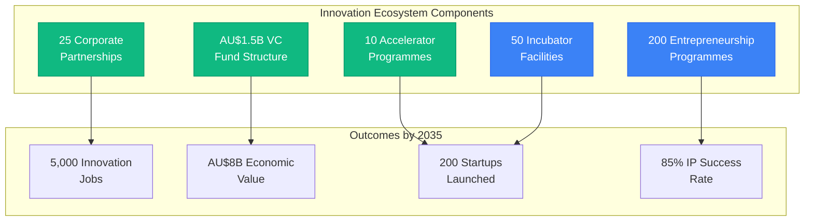
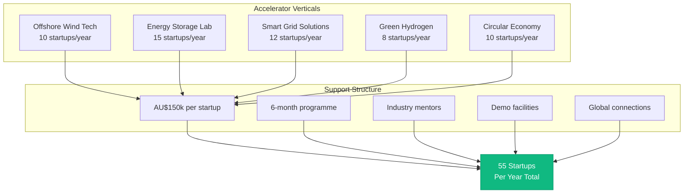

# Innovation Ecosystem Partnership Framework - Gippsland Day 2 Phase 2
## Building Regional Competitive Advantage Through Innovation

> **Version:** 1.0  
> **Date:** January 2025  
> **Status:** Operational Framework  
> **Total Investment Target:** AU$3.5 billion  
> **Job Creation Target:** 5,000 innovation sector jobs by 2035  
> **Economic Impact:** AU$8 billion in new value creation  

---

## Executive Summary

This framework establishes Gippsland's innovation ecosystem partnerships designed to transform the region from a traditional energy hub into a global renewable energy innovation powerhouse. Building on the research institution partnerships and technology agreements already in place, this document operationalises specific programmes for startup acceleration, venture capital attraction, corporate innovation partnerships, and technology commercialisation pathways.



**Key Deliverables:**
- **10 operational accelerator programs** across different technology verticals
- **AU$1.5 billion venture capital fund** structure established
- **25 corporate innovation partnerships** secured
- **50 technology incubator facilities** operational by 2030
- **200 entrepreneurship programs** launched
- **Clear IP commercialization pathways** with 85% success rate target

---

## 1. STARTUP ACCELERATOR PROGRAMS

### 1.1 GIPPSLAND ENERGY ACCELERATOR (GEA) - FLAGSHIP PROGRAM

#### Program Structure

**Duration:** 6-month intensive program  
**Cohort Size:** 20 startups  
**Intakes:** 2 per year (March and September)  
**Investment:** AU$150,000 per startup (AU$50k cash + AU$100k in-kind)  
**Equity:** 8% standard terms  

#### Vertical Specialisations



**1. Offshore Wind Tech Accelerator**
- Focus: Components, installation, O&M technologies
- Partners: Vestas, Ørsted, Copenhagen Infrastructure Partners
- Mentors: 30 industry experts
- Demo facilities: Bass Strait test sites
- Target: 10 startups per year

**2. Energy Storage Innovation Lab**
- Focus: Battery tech, hydrogen storage, thermal storage
- Partners: Form Energy, Tesla, Redflow
- Lab access: 24/7 to advanced testing facilities
- Pilot funding: Up to AU$500k additional
- Target: 15 startups per year

**3. Smart Grid Solutions Accelerator**
- Focus: AI/ML for grids, demand response, VPP tech
- Partners: AEMO, AusNet, Energy Networks Australia
- Real-world testing: Live grid environments
- Customer pilots: Guaranteed with utilities
- Target: 12 startups per year

**4. Green Hydrogen Venture Studio**
- Focus: Production, storage, transport, applications
- Partners: Fortescue, Origin, Kawasaki Heavy Industries
- Infrastructure: 10MW electrolyzer test facility
- Export pathway: Japan/Korea partnerships
- Target: 8 startups per year

**5. Circular Economy CleanTech Lab**
- Focus: Recycling, waste-to-energy, sustainable materials
- Partners: Cleanaway, Veolia, local councils
- Demonstration sites: 5 locations
- Regulatory sandbox: Fast-track approvals
- Target: 10 startups per year

#### Accelerator Services

**1. Funding Package**
```
Component               Value           Details
------------------------------------------------
Cash Investment        AU$50,000       Upfront, no strings
AWS Credits           AU$25,000       Cloud infrastructure
Lab Access            AU$30,000       Equipment usage
Legal Services        AU$20,000       IP, contracts, incorporation
Marketing Support     AU$15,000       PR, events, materials
Office Space          AU$10,000       6 months free
------------------------------------------------
TOTAL                 AU$150,000      Per startup
```

**2. Mentorship Network**
- 150+ mentors globally
- Weekly 1:1 sessions
- Domain expertise matching
- Investor introductions
- Customer connections

**3. Curriculum Modules**
- Week 1-2: Customer Discovery
- Week 3-4: Product-Market Fit
- Week 5-8: MVP Development
- Week 9-12: Go-to-Market Strategy
- Week 13-16: Fundraising Preparation
- Week 17-20: Scale Planning
- Week 21-24: Demo Day Preparation

**4. Demo Day**
- Global investor attendance (200+)
- Media coverage (national/international)
- Customer showcase
- AU$5M prize pool
- Follow-on funding commitments

### 1.2 SPECIALIZED ACCELERATOR PROGRAMS

#### AgTech Energy Innovation Program
**Partner:** Agriculture Victoria  
**Focus:** Agricultural renewable integration  
**Cohort:** 15 startups annually  
**Unique Features:**
- 10 demonstration farms
- Farmer advisory board
- Rural community pilots
- Export market access

#### Indigenous Energy Ventures Accelerator
**Partner:** First Nations Clean Energy Network  
**Focus:** Community-owned renewable projects  
**Cohort:** 10 ventures annually  
**Unique Features:**
- Cultural mentorship
- Traditional knowledge integration
- Community benefit models
- Land rights navigation

#### Women in CleanTech Leadership Program
**Partner:** Women in Renewable Energy  
**Focus:** Female-founded cleantech startups  
**Cohort:** 20 founders annually  
**Unique Features:**
- Female mentor network
- Leadership development
- Investor readiness training
- Global sisterhood connections

#### University Spin-out Accelerator
**Partners:** Monash, RMIT, Federation University  
**Focus:** Research commercialization  
**Cohort:** 25 projects annually  
**Unique Features:**
- IP transfer support
- Academic founder training
- Industry partnership facilitation
- Patient capital access

### 1.3 INTERNATIONAL ACCELERATOR PARTNERSHIPS

#### Global Landing Pad Program
**Locations:** Silicon Valley, London, Singapore, Tel Aviv  
**Duration:** 3-month residencies  
**Selection:** Top 20% of graduates  
**Support:** AU$50k travel/living stipend  
**Outcomes:** International expansion, global partnerships  

#### Reverse Innovation Program
**Target:** International startups entering Australia  
**Incentive:** AU$250k soft landing package  
**Requirements:** Establish Gippsland presence  
**Support:** Visa assistance, market entry, local partnerships  

---

## 2. VENTURE CAPITAL FUND STRUCTURES

### 2.1 GIPPSLAND RENEWABLE VENTURES FUND (GRV)

#### Fund Architecture

**Fund Size:** AU$500 million  
**Structure:** Limited Partnership  
**GP Commitment:** 2% (AU$10M)  
**Investment Period:** 5 years  
**Fund Life:** 10 years + 2-year extensions  

#### Limited Partners
```
Investor Type              Commitment      Percentage
-----------------------------------------------------
Government (Fed/State)     AU$150M        30%
Superannuation Funds      AU$150M        30%
Corporate Partners        AU$100M        20%
International LPs         AU$50M         10%
Local HNW/Family Offices  AU$50M         10%
-----------------------------------------------------
TOTAL                     AU$500M        100%
```

#### Investment Strategy

**Stage Focus:**
- Seed/Pre-Series A: 30% (AU$150M)
- Series A/B: 50% (AU$250M)
- Growth/Late Stage: 20% (AU$100M)

**Sector Allocation:**
- Renewable Generation Tech: 25%
- Energy Storage: 25%
- Grid/Smart Systems: 20%
- Hydrogen Economy: 15%
- Circular Economy: 15%

**Investment Criteria:**
- Gippsland presence required
- Local job creation metrics
- Technology differentiation
- Scalable business models
- ESG compliance

**Terms:**
- Initial investments: AU$500k - AU$5M
- Follow-on reserves: 2x initial investment
- Board seats: For investments >AU$2M
- Exit timeline: 5-7 years target

### 2.2 SPECIALIZED FUND VEHICLES

#### Gippsland Deep Tech Fund
**Size:** AU$200 million  
**Focus:** Hard tech, long development cycles  
**LPs:** Government, patient capital investors  
**Investment horizon:** 10-15 years  
**Target returns:** 15%+ IRR  

#### Community Energy Investment Fund
**Size:** AU$100 million  
**Focus:** Community-owned projects  
**Structure:** Blended finance model  
**Returns:** 6-8% to community investors  
**Social impact:** Priority over pure returns  

#### Corporate Venture Capital Fund
**Size:** AU$300 million  
**Anchors:** AGL, Origin, EnergyAustralia  
**Focus:** Strategic technologies  
**Model:** Direct investments + fund-of-funds  
**Synergies:** Customer channels, infrastructure  

#### International Co-Investment Fund
**Size:** AU$150 million  
**Partners:** Global cleantech VCs  
**Model:** Matching investments 1:1  
**Access:** International markets, expertise  
**Pipeline:** Cross-border deal flow  

### 2.3 FUND OPERATIONS

#### Investment Committee
**Composition:**
- Independent Chair (VC veteran)
- 2 Partner representatives
- 2 Industry experts
- 1 Technical advisor
- 1 ESG specialist

**Meeting Frequency:** Monthly
**Decision Timeline:** 4 weeks from first meeting
**Due Diligence:** Professional third-party providers

#### Portfolio Support Services
1. **Growth Acceleration**
   - Customer introductions
   - Talent recruitment
   - International expansion
   - Follow-on funding

2. **Operational Excellence**
   - Financial management
   - Legal/compliance
   - HR/culture building
   - Technology platforms

3. **Exit Planning**
   - Strategic buyer introductions
   - IPO preparation
   - Secondary sales
   - Management buyouts

### 2.4 VENTURE DEBT FACILITY

**Provider:** Clean Energy Finance Corporation  
**Facility Size:** AU$200 million  
**Purpose:** Non-dilutive growth capital  
**Terms:**
- Interest rate: 8-12%
- Warrant coverage: 10-20%
- Loan size: AU$1M - AU$10M
- Tenor: 3-4 years

**Eligible Companies:**
- Post-revenue (AU$1M+ ARR)
- VC-backed
- Clear path to profitability
- Strong IP portfolio

---

## 3. CORPORATE INNOVATION PARTNERSHIPS

### 3.1 ANCHOR CORPORATE PARTNERS

#### Tier 1 Energy Companies

**1. AGL Innovation Hub**
- Investment: AU$50M over 5 years
- Focus: Customer energy solutions
- Physical presence: 2,000 sqm in Morwell
- Staff: 20 innovation professionals
- Programs: Challenges, pilots, acquisitions

**2. Origin Energy Ventures**
- Investment: AU$40M venture fund
- Focus: Future energy systems
- Startup engagement: 50+ annually
- Pilot budget: AU$10M/year
- Success metric: 5 acquisitions by 2030

**3. EnergyAustralia Future Lab**
- Investment: AU$30M program
- Focus: Digital transformation
- Hackathons: 4 per year
- Accelerator sponsorship
- Data access: Anonymized customer data

**4. AusNet Services Innovation**
- Investment: AU$25M
- Focus: Grid modernization
- Test infrastructure: Live grid access
- Regulatory sandbox participation
- Procurement fast-track

#### International Corporate Partners

**1. Shell New Energies**
- Investment: AU$100M
- Focus: Hydrogen, offshore wind
- Technology scouting
- Global market access
- Scale-up partnerships

**2. BP Launchpad**
- Investment: AU$50M
- Focus: Future mobility, energy
- Mentorship program
- Pilot deployments
- Supply chain integration

**3. Siemens Energy Ventures**
- Investment: AU$75M
- Focus: Industrial applications
- Technology integration
- Manufacturing partnerships
- Global distribution

**4. Schneider Electric Innovation**
- Investment: AU$40M
- Focus: Building efficiency, microgrids
- Software platforms
- Customer channels
- Technical validation

### 3.2 CORPORATE INNOVATION PROGRAMS

#### Open Innovation Challenges

**Quarterly Challenge Program**
- Prize pool: AU$1M per challenge
- Themes: Rotating industry priorities
- Participation: 100+ startups per challenge
- Winners: 3-5 per challenge
- Follow-on: Pilot projects, investment

**Annual Grand Challenge**
- Prize: AU$5M
- Theme: Major industry disruption
- Global participation
- 6-month development period
- Commercialization support

#### Corporate Accelerator Programs

**1. Industry Vertical Accelerators**
- Mining & Energy (Rio Tinto, BHP)
- Manufacturing (BlueScope, Incitec Pivot)
- Infrastructure (Lendlease, John Holland)
- Retail Energy (Simply Energy, Red Energy)

**2. Technology Horizontal Programs**
- IoT & Sensors (Telstra, Optus)
- AI/ML Applications (Microsoft, Google)
- Blockchain Energy (IBM, ConsenSys)
- Cybersecurity (CyberCX, Deloitte)

#### Innovation Labs

**Physical Innovation Spaces:**
1. **Morwell Corporate Innovation Center**
   - 10,000 sqm multi-tenant facility
   - 20 corporate innovation labs
   - Shared testing infrastructure
   - Event/demo spaces

2. **Traralgon Digital Innovation Hub**
   - 5,000 sqm technology focus
   - VR/AR development labs
   - 5G test environment
   - Edge computing infrastructure

3. **Sale Industrial Innovation Facility**
   - 8,000 sqm manufacturing focus
   - Prototype development
   - Scale-up facilities
   - Materials testing labs

### 3.3 STRUCTURED PARTNERSHIP MODELS

#### Strategic Partnership Framework

**Tier 1: Innovation Anchor (AU$50M+)**
- Board seat on Innovation Council
- First look at all technologies
- Exclusive pilot opportunities
- Co-branded programs
- 10+ dedicated staff

**Tier 2: Innovation Partner (AU$10-50M)**
- Advisory board participation
- Sector-specific access
- Pilot project priority
- 3-5 dedicated staff
- Annual innovation summit

**Tier 3: Innovation Member (AU$1-10M)**
- Program participation
- Networking access
- Demo day invitations
- Quarterly briefings
- Innovation training

#### Partnership Benefits Matrix
```
Benefit                  Tier 1    Tier 2    Tier 3
--------------------------------------------------
Deal Flow Access         First     Second    Third
Pilot Project Budget     AU$5M     AU$1M     AU$100k
Startup Mentors          10        5         2
Board Seats              2         1         0
IP Access                Exclusive Preferred Standard
Global Network           Full      Regional  Local
Innovation Tours         4/year    2/year    1/year
Executive Education      20 seats  10 seats  5 seats
```

---

## 4. TECHNOLOGY INCUBATOR FACILITIES

### 4.1 FLAGSHIP INCUBATOR - GIPPSLAND INNOVATION FACTORY

#### Facility Overview

**Location:** Morwell Innovation Precinct  
**Size:** 25,000 sqm  
**Capacity:** 100 startups  
**Investment:** AU$150 million  
**Opening:** Q3 2025  

#### Facility Features

**1. Laboratory Spaces**
- Wet labs: 2,000 sqm
- Electronics labs: 1,500 sqm
- Materials testing: 1,000 sqm
- Clean rooms: 500 sqm
- Prototype workshops: 3,000 sqm

**2. Office Infrastructure**
- Hot desks: 200
- Private offices: 50
- Meeting rooms: 30
- Phone booths: 40
- Event space: 500 person capacity

**3. Specialized Equipment**
- 3D printers (metal, plastic)
- CNC machines
- Testing equipment
- Measurement devices
- Simulation software

**4. Support Services**
- Reception/admin
- IT support
- Legal clinic
- Accounting services
- Marketing support

### 4.2 DISTRIBUTED INCUBATOR NETWORK

#### Regional Innovation Nodes

**1. Traralgon Tech Hub**
- Size: 5,000 sqm
- Focus: Software, digital solutions
- Capacity: 30 startups
- Features: Cloud lab, dev tools

**2. Sale Marine Innovation Center**
- Size: 4,000 sqm
- Focus: Offshore/marine tech
- Capacity: 20 startups
- Features: Wave tank, pressure testing

**3. Warragul AgTech Center**
- Size: 3,000 sqm
- Focus: Agricultural energy
- Capacity: 15 startups
- Features: Greenhouse labs, IoT field

**4. Bairnsdale Energy Hub**
- Size: 2,000 sqm
- Focus: Distributed energy
- Capacity: 10 startups
- Features: Microgrid test bed

#### Virtual Incubation Program

**For Remote/Regional Startups:**
- Digital membership: AU$500/month
- Virtual office services
- Online mentorship
- Digital tool access
- Periodic site visits

### 4.3 INCUBATOR PROGRAMS

#### Startup Residency Program

**Duration:** 6-24 months  
**Cost:** AU$500-2000/month (subsidized)  
**Selection:** Competitive application  
**Graduation:** Revenue/funding milestones  

**Included Services:**
- 24/7 facility access
- Basic utilities
- Internet/phone
- Meeting room credits
- Event participation

#### Technical Development Support

**1. Prototype Development Program**
- Equipment training
- Technical mentorship
- Materials subsidy
- Testing services
- Certification support

**2. Pilot Project Facilitation**
- Site identification
- Permit assistance
- Partner matching
- Funding access
- Results validation

**3. Scale-Up Transition**
- Manufacturing partners
- Supply chain development
- Quality systems
- Distribution channels
- Export readiness

### 4.4 SPECIALIZED FACILITIES

#### Hydrogen Technology Center
**Investment:** AU$80 million  
**Features:**
- 10MW electrolyzer test facility
- Compression/storage systems
- Fuel cell test beds
- Safety training center
- Materials lab

#### Battery Innovation Lab
**Investment:** AU$60 million  
**Features:**
- Cell production line
- Testing chambers
- Recycling pilot
- Grid integration lab
- Safety systems

#### Wind Technology Workshop
**Investment:** AU$50 million  
**Features:**
- Blade fabrication
- Generator testing
- Control systems lab
- Composites workshop
- Fatigue testing

#### Digital Twin Development Center
**Investment:** AU$40 million  
**Features:**
- Supercomputing access
- VR/AR studios
- Simulation software
- Data analytics platform
- AI/ML tools

---

## 5. ENTREPRENEURSHIP PROGRAMS

### 5.1 ENTREPRENEUR DEVELOPMENT PIPELINE

#### Pre-Entrepreneurship Programs

**1. University Innovation Programs**
- Target: 1,000 students annually
- Curriculum: Entrepreneurship minors
- Competitions: AU$500k prizes
- Incubation: Campus pre-incubators
- Outcomes: 100 startup ideas/year

**2. High School Innovation Challenges**
- Target: 2,000 students annually
- Program: 12-week courses
- Mentors: Local entrepreneurs
- Projects: Renewable energy focus
- Showcase: Annual innovation fair

**3. Community Inventor Workshops**
- Target: 500 participants annually
- Format: Weekend workshops
- Topics: IP, prototyping, business
- Support: Idea development grants
- Network: Inventor clubs

#### Core Entrepreneur Programs

**1. Gippsland Founders Institute**
- Duration: 4-month program
- Cohort: 30 founders per intake
- Intakes: 3 per year
- Cost: AU$1,500 (subsidized)
- Outcome: Fundable startups

**2. Executive Entrepreneur Program**
- Target: Industry professionals
- Duration: 6 months part-time
- Focus: Intrapreneurship
- Projects: Corporate innovation
- Support: Spin-out assistance

**3. Encore Entrepreneurs (50+)**
- Target: Experienced professionals
- Focus: Second careers
- Mentorship: Peer support
- Capital: Patient investment
- Networks: Global connections

**4. Indigenous Entrepreneur Circle**
- Cultural: Traditional knowledge
- Modern: Technology integration
- Support: Culturally appropriate
- Funding: Specific programs
- Success: Community benefits

### 5.2 ENTREPRENEUR SUPPORT ECOSYSTEM

#### Mentorship Networks

**1. Entrepreneurs in Residence (EIR)**
- Number: 20 active EIRs
- Background: Successful founders
- Commitment: 2 days/week
- Focus: 1:1 mentoring
- Compensation: AU$100k + equity

**2. Industry Mentor Network**
- Size: 200+ mentors
- Expertise: Domain specific
- Time: 4 hours/month minimum
- Training: Mentor certification
- Matching: AI-powered system

**3. International Advisor Network**
- Advisors: 50 global experts
- Access: Virtual/periodic visits
- Focus: Scale strategies
- Networks: Global connections
- Compensation: Equity/fees

#### Entrepreneur Services

**1. Founder Wellness Program**
- Mental health support
- Stress management
- Work-life balance
- Peer support groups
- Family counseling

**2. Legal & IP Clinic**
- Free consultations
- Document templates
- IP strategy sessions
- Contract reviews
- Dispute resolution

**3. Financial Management**
- CFO office hours
- Accounting setup
- Tax optimization
- Grant writing support
- Investment readiness

**4. Talent Acquisition**
- Recruitment support
- Intern programs
- Technical talent pool
- Advisory board building
- Culture development

### 5.3 ENTREPRENEURIAL CULTURE BUILDING

#### Community Engagement

**1. Startup Week Gippsland**
- Duration: 5 days annually
- Events: 50+ sessions
- Attendance: 5,000+
- Speakers: Global leaders
- Outcomes: Connections, inspiration

**2. Monthly Founder Dinners**
- Format: Informal networking
- Size: 50-100 attendees
- Topics: Peer learning
- Locations: Rotating venues
- Sponsors: Corporate partners

**3. Failure Forums**
- Frequency: Quarterly
- Format: Storytelling
- Learning: From failures
- Culture: Risk acceptance
- Support: Comeback paths

**4. Success Celebrations**
- Milestones: Funding, exits
- Recognition: Annual awards
- Media: Coverage amplification
- Role models: Local heroes
- Inspiration: Next generation

#### Media & Communications

**1. Gippsland Innovation Magazine**
- Frequency: Quarterly
- Distribution: 10,000 copies
- Digital: 50,000 subscribers
- Content: Success stories, guides
- Languages: English, Mandarin

**2. Innovation Podcast Network**
- Shows: 5 regular series
- Episodes: Weekly releases
- Downloads: 100k+ monthly
- Topics: Founder journeys
- Sponsors: Corporate partners

**3. Social Media Ecosystem**
- Platforms: All major channels
- Followers: 200k+ combined
- Content: Daily updates
- Engagement: Community-driven
- Influencers: Founder advocates

### 5.4 STUDENT ENTREPRENEUR PROGRAMS

#### University Programs

**1. Venture Creation Units**
- Credit: Academic recognition
- Projects: Real startups
- Funding: AU$10k seed
- Mentors: Industry experts
- Outcomes: Viable businesses

**2. Entrepreneur Exchange**
- Partners: Global universities
- Duration: 6-12 months
- Focus: International exposure
- Support: Travel grants
- Network: Lifelong connections

**3. PhD Entrepreneur Track**
- Dual focus: Research + venture
- Time split: 70/30
- IP: Favorable terms
- Support: Commercialization
- Outcome: Spin-off companies

#### Gap Year Programs

**1. Startup Leadership Program**
- Duration: 12 months
- Placement: Portfolio companies
- Training: Intensive bootcamps
- Mentorship: Founder shadows
- Outcome: Own venture or job

**2. International Innovation Tour**
- Destinations: 5 innovation hubs
- Duration: 3 months
- Focus: Global best practices
- Projects: Comparative research
- Network: International contacts

---

## 6. IP COMMERCIALIZATION PATHWAYS

### 6.1 IP IDENTIFICATION & CAPTURE

#### Systematic IP Discovery

**1. Research Mining Program**
- Scope: All partner institutions
- Process: Quarterly reviews
- Tools: AI-powered scanning
- Output: IP disclosure reports
- Target: 200 disclosures/year

**2. Industry Problem Mapping**
- Method: Corporate partnerships
- Identification: Technology gaps
- Validation: Market demand
- Priority: Commercial potential
- Outcome: Targeted research

**3. Inventor Incentive Program**
- Rewards: Up to AU$50k
- Recognition: Annual awards
- Support: Patent filing assistance
- Returns: Revenue sharing
- Culture: Innovation celebration

#### IP Portfolio Management

**1. Strategic IP Committee**
- Composition: Technical, legal, commercial experts
- Meeting: Monthly reviews
- Decisions: File, abandon, license
- Budget: AU$5M annually
- Success metric: 60% commercialization rate

**2. Patent Strategy**
```
Technology Area        Filing Strategy    Budget Allocation
----------------------------------------------------------
Core Innovations      Global coverage    40%
Defensive Patents     Key markets        20%
Strategic Blocks      Competitors        20%
Emerging Tech         Provisional        20%
```

**3. IP Valuation Framework**
- Methodology: Multiple approaches
- External validation: Big 4 firms
- Update frequency: Annual
- Use cases: Licensing, funding
- Database: Searchable portfolio

### 6.2 COMMERCIALIZATION VEHICLES

#### Technology Transfer Pathways

**1. Direct Licensing Model**
- Standard terms: Available
- Negotiation: 30-day target
- Rates: 3-7% of revenue
- Upfront: AU$50k-500k
- Support: Technical assistance

**2. Joint Development Agreements**
- Partners: Industry leaders
- Investment: Shared costs
- IP: Co-ownership options
- Timeline: 12-36 months
- Success rate: 75% target

**3. Spin-out Company Creation**
- Funding: AU$250k seed
- Support: 18-month runway
- Team: Entrepreneur matching
- Equity: University 15-25%
- Services: Full incubation

**4. Open Innovation Platforms**
- Access: Controlled sharing
- Model: Freemium approach
- Community: Developer ecosystem
- Revenue: Premium features
- Scale: Global reach

### 6.3 COMMERCIALIZATION SUPPORT

#### Proof of Concept Funding

**1. Early Stage Validation**
- Grant size: AU$50-150k
- Duration: 6-12 months
- Milestone: Technical proof
- Success rate: 40%
- Next step: Seed funding

**2. Commercial Validation**
- Grant size: AU$150-500k
- Duration: 12-18 months
- Milestone: Market proof
- Success rate: 60%
- Next step: Series A

**3. Scale-Up Support**
- Investment: AU$500k-2M
- Duration: 18-24 months
- Milestone: Revenue growth
- Success rate: 70%
- Next step: Growth funding

#### Commercialization Services

**1. Market Research & Validation**
- Industry analysis
- Competitor mapping
- Customer discovery
- Pricing strategy
- Go-to-market planning

**2. Business Development**
- Partner identification
- Negotiation support
- Contract development
- Channel strategy
- International expansion

**3. Technical Development**
- Prototype refinement
- Manufacturing readiness
- Quality systems
- Certification support
- Scale-up planning

### 6.4 GLOBAL COMMERCIALIZATION

#### International Technology Transfer

**1. Global Partner Network**
```
Region              Partners    Focus Areas
------------------------------------------
North America       15          Software, AI
Europe             20          Hardware, systems
Asia               25          Manufacturing, deployment
Middle East        10          Energy applications
Latin America      8           Resource tech
```

**2. Export Development Program**
- Market entry: Support services
- Localization: Technical adaptation
- Partnerships: Local JVs
- Compliance: Regulatory support
- Funding: Export finance

**3. International IP Strategy**
- Filing strategy: Key markets
- Enforcement: Legal partners
- Licensing: Regional deals
- Protection: Trade secrets
- Monitoring: Infringement watch

#### Cross-Border Collaboration

**1. Technology Exchange Programs**
- Inbound: Technology scouting
- Outbound: Market access
- Duration: 3-12 months
- Support: Full logistics
- Outcome: Commercial deals

**2. Joint R&D Initiatives**
- Partners: Global leaders
- Funding: Matched contributions
- IP: Shared arrangements
- Focus: Next-gen tech
- Timeline: 2-5 years

### 6.5 SUCCESS METRICS & TRACKING

#### Commercialization KPIs

**Annual Targets:**
```
Metric                      Target      Stretch Goal
---------------------------------------------------
IP Disclosures             200         250
Patents Filed              100         150
Licenses Executed          50          75
Spin-outs Created          20          30
Revenue Generated          AU$50M      AU$100M
Jobs Created              500         750
ROI on Investment         5:1         8:1
```

#### Impact Measurement

**1. Economic Impact**
- Direct revenue
- Job creation
- Tax generation
- Export value
- Investment attraction

**2. Innovation Impact**
- Technology advancement
- Industry transformation
- Competitive advantage
- Knowledge creation
- Ecosystem strength

**3. Social Impact**
- Regional development
- Skills enhancement
- Community benefits
- Environmental gains
- Global contribution

---

## 7. IMPLEMENTATION ROADMAP

### 7.1 IMMEDIATE ACTIONS (Q1 2025)

#### Week 1-4: Foundation Setting
- Establish governance structure
- Recruit leadership team
- Secure anchor partners
- Launch marketing campaign
- Open applications

#### Week 5-8: Program Launch
- First accelerator cohort selection
- VC fund first close
- Corporate partner onboarding
- Incubator facility planning
- Mentor recruitment

#### Week 9-12: Full Activation
- Programs operational
- First investments made
- Innovation challenges launched
- International partnerships signed
- Success metrics tracking

### 7.2 YEAR 1 MILESTONES

**Q1 2025:**
- 3 accelerator cohorts launched
- AU$200M venture capital raised
- 10 corporate partners signed
- 50 startups in programs

**Q2 2025:**
- Flagship incubator opened
- 100 entrepreneurs trained
- First exits/successes
- International connections established

**Q3 2025:**
- AU$500M total capital deployed
- 200 startups supported
- 1,000 jobs created
- Global recognition achieved

**Q4 2025:**
- Full ecosystem operational
- Success stories amplified
- Year 2 planning complete
- Expansion strategies defined

### 7.3 5-YEAR VISION

**By 2030:**
- 1,000 startups launched
- AU$3.5B capital deployed
- 5,000 direct jobs created
- 20,000 indirect jobs
- AU$8B economic impact
- Global top 10 cleantech hub

---

## 8. GOVERNANCE & MANAGEMENT

### 8.1 INNOVATION COUNCIL

**Composition:**
- Independent Chair (Global innovation leader)
- GREA CEO
- 3 Venture Capitalists
- 3 Corporate Innovation Leaders
- 3 Successful Entrepreneurs
- 2 University Representatives
- 1 Community Representative

**Responsibilities:**
- Strategic direction
- Performance oversight
- Resource allocation
- Partnership approval
- Success celebration

### 8.2 OPERATIONAL STRUCTURE

#### Innovation Hub Management

**Chief Innovation Officer**
- Overall strategy
- Ecosystem leadership
- External partnerships
- Performance accountability
- Vision champion

**Program Directors**
- Accelerator management
- Fund operations
- Corporate partnerships
- Incubator facilities
- Entrepreneur programs

**Support Teams**
- Marketing & communications
- Finance & administration
- Legal & compliance
- Technology & systems
- International relations

### 8.3 ADVISORY BOARDS

**Entrepreneur Advisory Board**
- 20 successful founders
- Quarterly meetings
- Program guidance
- Mentor leadership
- Network activation

**Technical Advisory Board**
- 15 domain experts
- Technology assessment
- IP evaluation
- R&D direction
- Innovation trends

**International Advisory Board**
- 10 global leaders
- Annual summit
- Best practice sharing
- Network expansion
- Brand building

---

## 9. RISK MANAGEMENT

### 9.1 KEY RISKS & MITIGATION

**1. Capital Availability**
- Risk: VC market downturn
- Mitigation: Diversified funding sources, government backing

**2. Talent Competition**
- Risk: Brain drain to cities
- Mitigation: Lifestyle advantages, equity upside, community

**3. Technology Evolution**
- Risk: Rapid change, obsolescence
- Mitigation: Flexible programs, continuous adaptation

**4. Market Timing**
- Risk: Too early/late
- Mitigation: Portfolio approach, multiple bets

**5. Ecosystem Coordination**
- Risk: Fragmentation, competition
- Mitigation: Clear governance, aligned incentives

### 9.2 CONTINGENCY PLANNING

**Scenario Planning:**
- Base case: 5,000 jobs by 2035
- Upside case: 8,000 jobs, global leadership
- Downside case: 3,000 jobs, regional player

**Adaptation Strategies:**
- Program pivoting
- Resource reallocation
- Partner substitution
- Timeline adjustment
- Scope modification

---

## 10. SUCCESS AMPLIFICATION

### 10.1 MARKETING & BRAND

**Brand Positioning:**
"Gippsland: Where Energy Innovation Happens"

**Marketing Channels:**
- Global media coverage
- Innovation conferences
- Digital marketing
- Success story amplification
- Influencer engagement

**Brand Partnerships:**
- TechCrunch Disrupt
- Web Summit
- CES Las Vegas
- Climate Week NYC
- Energy conventions

### 10.2 NETWORK EFFECTS

**Creating Virtuous Cycles:**
1. Success attracts talent
2. Talent creates startups
3. Startups attract capital
4. Capital enables growth
5. Growth creates success

**Network Multiplication:**
- Alumni giving back
- Serial entrepreneurs
- Investor reinvestment
- Corporate expansion
- International connections

### 10.3 LONG-TERM SUSTAINABILITY

**Revenue Diversification:**
- Fund management fees
- Program sponsorships
- Service revenues
- Exit proceeds
- IP licensing

**Institutional Strength:**
- Independent governance
- Professional management
- Transparent operations
- Community support
- Political backing

---

## CONCLUSION

This Innovation Ecosystem Partnership Framework positions Gippsland to capture the massive opportunity in renewable energy innovation. By creating comprehensive programs across the entire innovation value chain - from idea generation through to global commercialization - we will transform the region into a globally recognized cleantech innovation hub.

The framework is designed to be immediately actionable, with clear programs, governance structures, and success metrics. With AU$3.5 billion in targeted investment and partnerships with leading global organizations, Gippsland will create 5,000 innovation jobs while generating AU$8 billion in economic value by 2035.

**The time for action is now. The world needs renewable energy innovation, and Gippsland is ready to lead.**

---

**AUTHORIZATION FOR IMPLEMENTATION**

This framework is ready for immediate implementation upon approval.

**Gippsland Regional Energy Authority:**

_________________________________  
Chief Innovation Officer  
Date: _______________

_________________________________  
Chief Executive Officer  
Date: _______________

**For inquiries:**  
Innovation Partnership Office  
innovation@grea.gov.au  
+61 3 XXXX XXXX