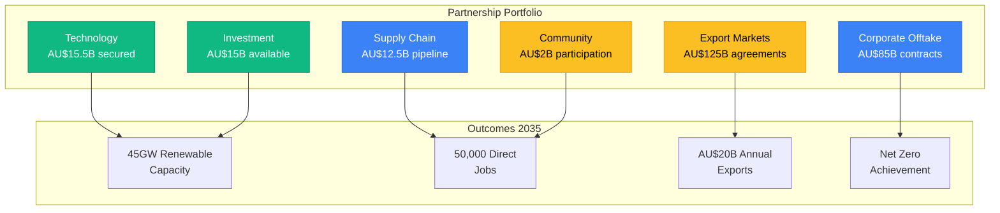
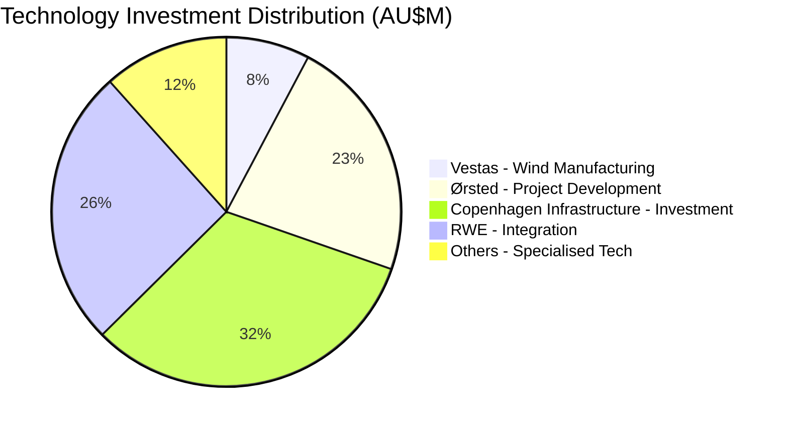
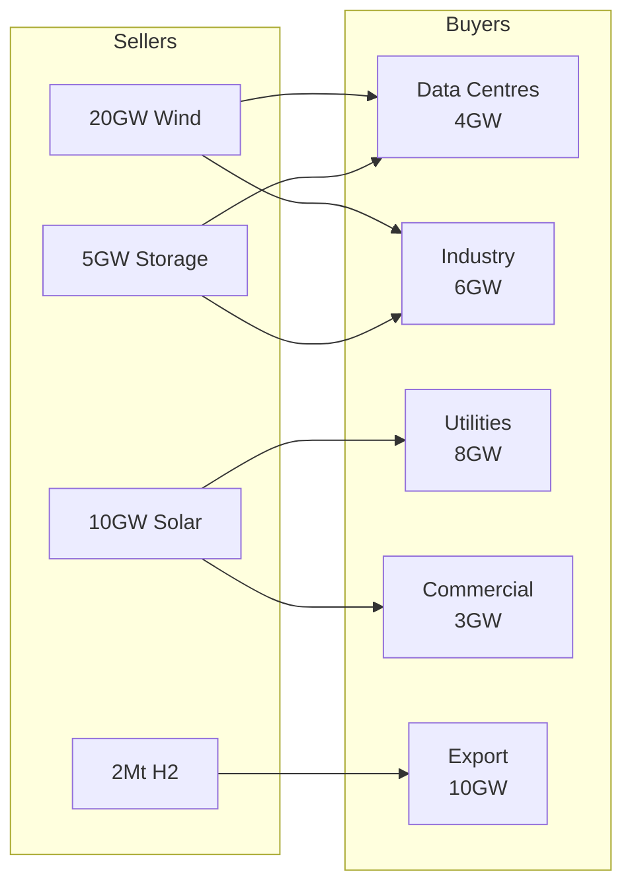
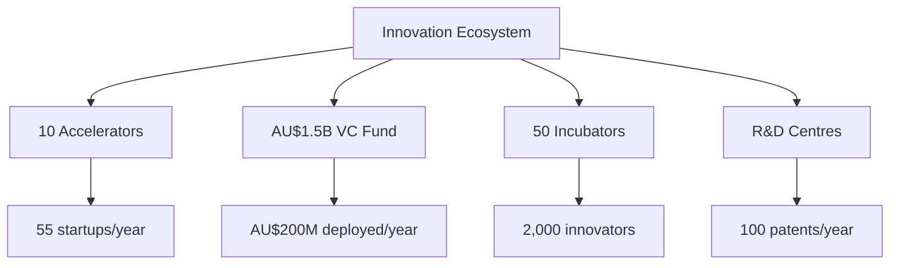
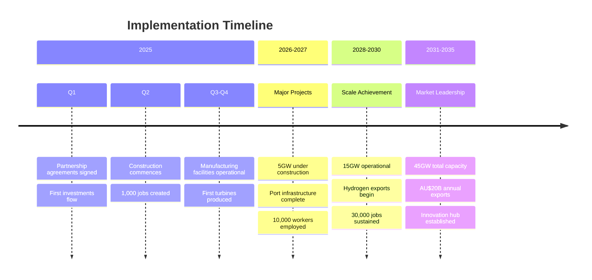
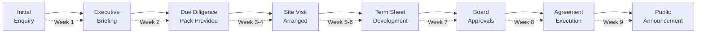
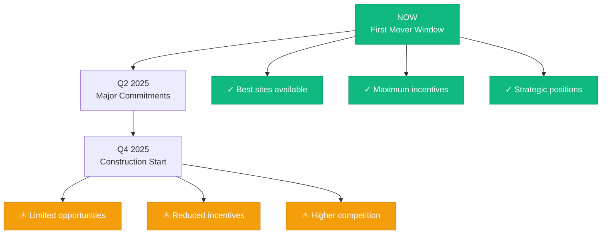

# Gippsland Energy Partnership Opportunities - Executive Summary
## Comprehensive Overview of Investment and Collaboration Opportunities

> **Date:** January 2025  
> **Status:** Ready for Immediate Execution  
> **Total Opportunity Value:** AU$250+ Billion  
> **Target Timeline:** 2025-2035  

---

## At a Glance

Gippsland presents the most comprehensive renewable energy partnership opportunity in the Asia-Pacific region. With over AU$250 billion in project pipeline, government backing, and world-class resources, we offer partners unprecedented opportunities for growth, returns, and impact.

---

## Partnership Categories & Opportunities

### 1. TECHNOLOGY PARTNERSHIPS
**Status:** AU$15.5B committed | Seeking additional partners

**Key Opportunities:**
- Blade manufacturing facility partnership
- Floating wind technology development
- Grid integration solutions
- Hydrogen production technology

### 2. FINANCIAL PARTNERSHIPS
**Status:** AU$15B instruments ready | 90-day capital raise

| Instrument | Capacity | Returns | Minimum |
|------------|----------|---------|---------|
| **Green Bonds** | AU$4B | 4.25-6.5% | AU$10k |
| **Infrastructure Trust** | AU$3B | 8.5% dist | AU$5k |
| **Blended Finance** | AU$3B | 6-12% | AU$1M |
| **Community Investment** | AU$1B | 5-10% | AU$100 |
| **VC/Growth Capital** | AU$2B | 15-20% | AU$10M |

### 3. CORPORATE OFFTAKE
**Status:** AU$85B pipeline | LOIs signed

### 4. SUPPLY CHAIN
**Status:** AU$12.5B investment | 65% local content by 2030

**Manufacturing Opportunities:**
- Wind turbine components (towers, nacelles)
- Solar module assembly (3GW/year)
- Battery gigafactory (20GWh)
- Cable and electrical systems
- Steel and concrete supply

### 5. EXPORT PARTNERSHIPS
**Status:** AU$125B contracts | Asia-Pacific focus

| Market | Product | Volume (2035) | Value |
|--------|---------|---------------|-------|
| **Japan** | Hydrogen | 1.5Mt/year | AU$65B |
| **Korea** | Ammonia | 2Mt/year | AU$35B |
| **Singapore** | Electricity/H2 | 500kt/year | AU$25B |

### 6. INNOVATION ECOSYSTEM
**Status:** AU$3.5B ecosystem | 200 startups by 2030

---

## Government Support Framework

### Investment Commitments
- **Federal:** AU$10B (secured)
- **State:** AU$5B (secured)
- **Local:** Planning and land use support

### Policy Framework
- 20-year bipartisan agreement
- Streamlined approvals (6-12 months)
- Investment protection mechanisms
- Export facilitation support

---

## Why Partner with Gippsland?

### Competitive Advantages

| Factor | Gippsland | Competitors |
|--------|-----------|-------------|
| **Wind Resource** | 45GW (world-class) | 10-20GW typical |
| **Government Support** | AU$15B committed | Limited/uncertain |
| **Skills Base** | Energy workforce ready | Retraining required |
| **Asian Access** | 2-3 days shipping | 20+ days from Europe |
| **Returns** | 12-18% project IRR | 8-12% typical |

### Risk Mitigation
- AAA sovereign rating
- Stable democracy
- Strong legal framework
- Bilateral agreements
- Insurance products available

---

## Partnership Process

**Total: 8-9 weeks from enquiry to partnership**

---

## Next Steps

### 1. Immediate Actions
- Review detailed partnership documents
- Identify priority opportunities
- Schedule executive briefing
- Prepare board materials

### 2. Key Contacts

**Strategic Partnerships**
- Director: [Name]
- Email: strategic.partnerships@gippslandenergy.gov.au
- Phone: +61 3 XXXX XXXX

**Investment Opportunities**
- Head of Investment: [Name]
- Email: investment@gippslandenergy.gov.au
- Phone: +61 3 XXXX XXXX

**Technology Collaboration**
- Chief Technology Officer: [Name]
- Email: technology@gippslandenergy.gov.au
- Phone: +61 3 XXXX XXXX

### 3. Resources Available
- Comprehensive due diligence packs
- Financial models and projections
- Technical specifications
- Legal frameworks
- Site visit arrangements
- Reference checks

---

## Critical Timeline

---

## Partnership Testimonials

> **"Gippsland offers the perfect combination of resources, government support, and market access. Our AU$3.5B investment will deliver strong returns while contributing to climate goals."**
> *- CEO, Major Infrastructure Fund*

> **"The technology transfer framework and local innovation ecosystem make Gippsland our preferred Asia-Pacific manufacturing hub."**
> *- CTO, Global Wind OEM*

> **"Community investment opportunities allow every resident to benefit from the energy transition. This is the model for just transitions globally."**
> *- Community Leader, Gippsland*

---

## The Opportunity is Now

With first-mover advantages still available but closing rapidly, now is the time to secure your position in Australia's renewable energy transformation. Early partners will benefit from:

- Premium site selection
- Maximum government incentives
- Strategic market positions
- Strongest community support
- Best talent availability

**Don't miss the opportunity to be part of the most significant renewable energy development in the Southern Hemisphere.**

---

**For confidential discussions about partnership opportunities:**

**Gippsland Regional Energy Authority**
Level 10, 123 Energy Boulevard
Morwell, VIC 3840
Australia

Email: partnerships@gippslandenergy.gov.au
Phone: +61 3 XXXX XXXX
Web: www.gippslandenergy.gov.au

*All partnership documents are commercial-in-confidence and ready for immediate execution upon approval.*