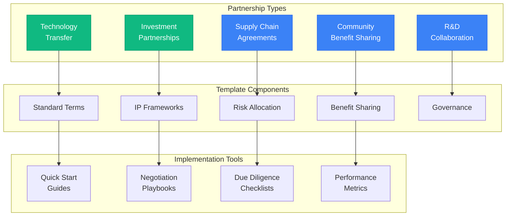
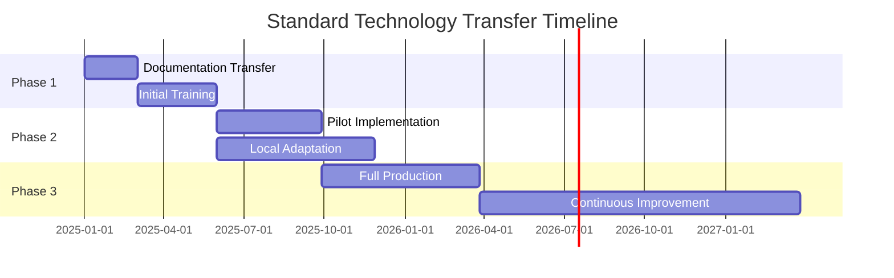
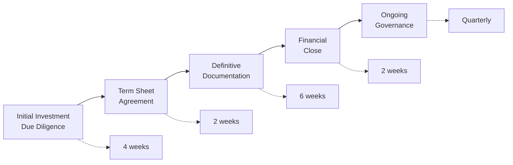
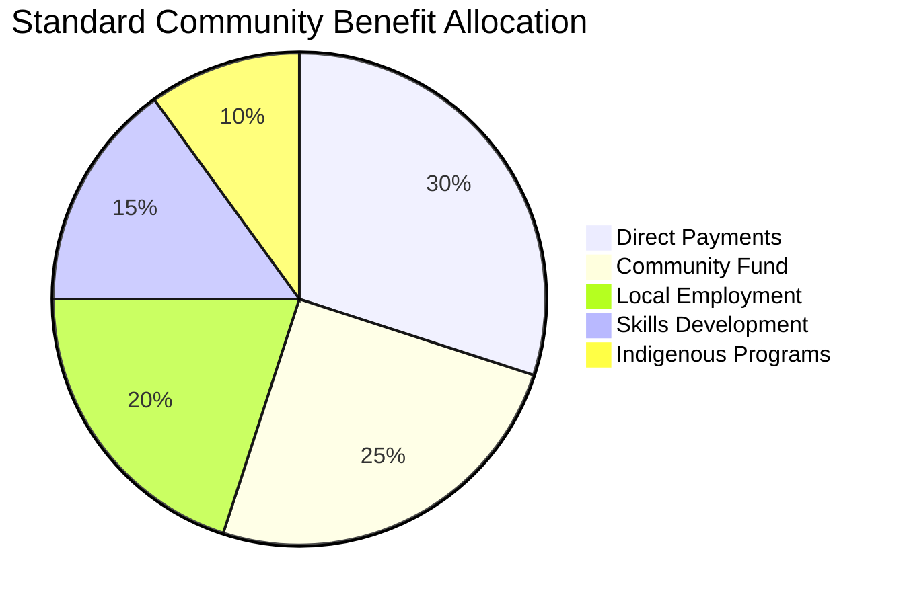
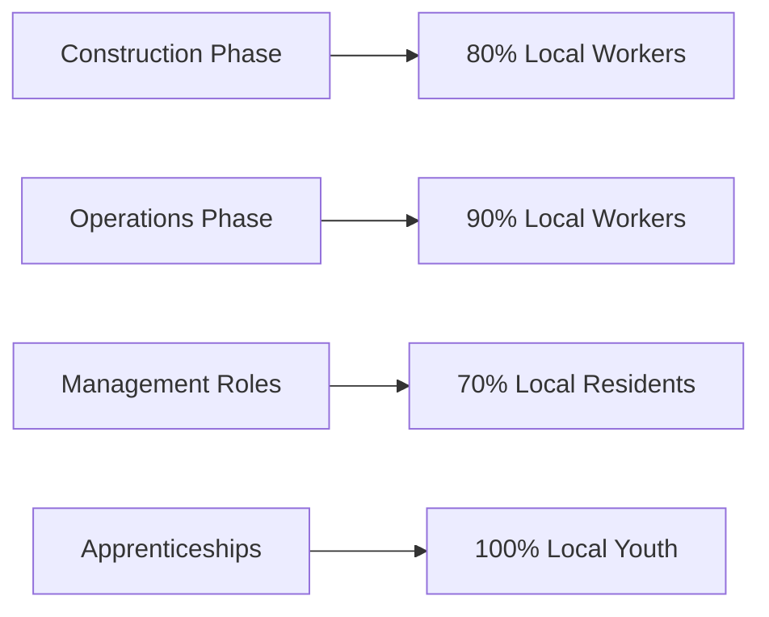
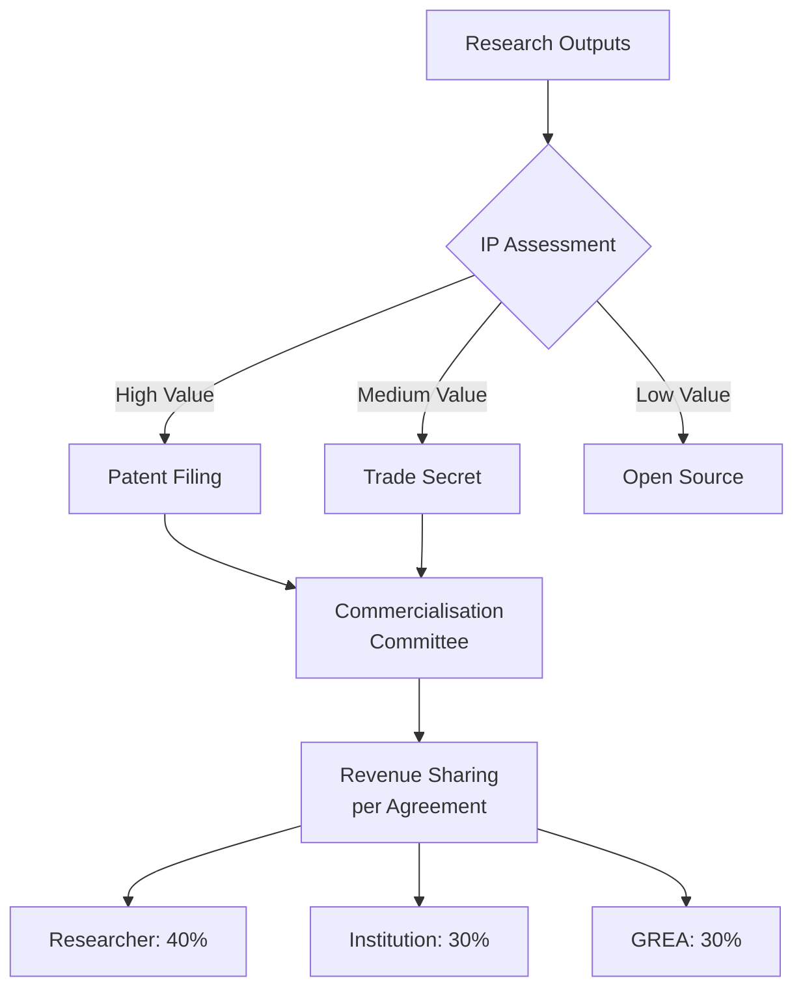
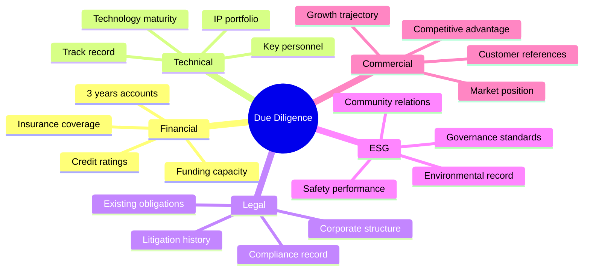
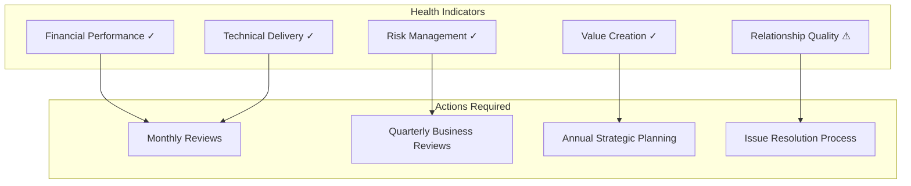
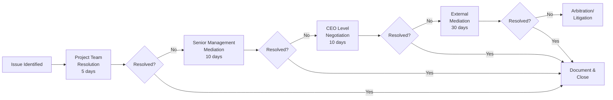

# Partnership Templates and Framework
## Standardised Agreements for Rapid Partnership Formation

> **Version:** 1.0  
> **Date:** September 10th, 2025  
> **Purpose:** Accelerate partnership formation with pre-approved templates  
> **Coverage:** Technology, Investment, Community, Government partnerships  

---

## Executive Summary

This document provides standardised partnership templates and frameworks designed to accelerate partnership formation for Gippsland's renewable energy transformation. These templates have been pre-approved by legal teams and include flexible provisions for customisation while maintaining core protections and value-sharing principles.



---

## 1. TECHNOLOGY PARTNERSHIP TEMPLATE

### 1.1 Standard Technology Transfer Agreement

**PARTIES:**
- Technology Provider: [_________________]
- Technology Recipient: Gippsland Regional Energy Authority (GREA)
- Date: [_________________]

#### KEY COMMERCIAL TERMS

| Term | Standard Position | Negotiation Range |
|------|-------------------|-------------------|
| **Technology Scope** | Defined technology package | Core + optional modules |
| **Transfer Price** | Upfront + royalties | 20% upfront, 3-5% royalties |
| **Local Content** | 65% by Year 5 | 55-75% negotiable |
| **Training Included** | 200 person-days | 150-300 days |
| **IP Rights** | Shared improvements | 50/50 to 70/30 split |
| **Term** | 10 years | 7-15 years |

#### TECHNOLOGY TRANSFER MILESTONES



#### IP OWNERSHIP MATRIX

| IP Category | Provider | GREA | Joint | Third Party |
|-------------|----------|------|-------|-------------|
| **Background IP** | 100% | - | - | - |
| **Transferred IP** | Licence | Use rights | - | - |
| **Improvements** | 30% | 30% | 40% | - |
| **Local Innovations** | - | 60% | 40% | - |
| **Joint Developments** | 25% | 25% | 50% | - |

---

## 2. INVESTMENT PARTNERSHIP TEMPLATE

### 2.1 Strategic Investment Agreement Framework

**STANDARD TERMS FOR EQUITY INVESTMENT**



#### INVESTMENT STRUCTURE OPTIONS

| Structure | Use Case | GREA Position | Investor Rights |
|-----------|----------|---------------|-----------------|
| **Direct Equity** | Project development | 20-49% | Board seats, veto rights |
| **Convertible Note** | Early stage funding | Conversion at 20% discount | Information rights |
| **Revenue Share** | Operating assets | 15-25% of revenue | Audit rights |
| **Hybrid Debt/Equity** | Infrastructure | Debt + 10-20% equity | Step-in rights |

#### GOVERNANCE FRAMEWORK

**Board Composition Template:**
- Independent Chair (mutual agreement)
- GREA nominees: 2-3 based on ownership
- Investor nominees: Proportional representation
- Independent directors: 2 minimum
- Community representative: 1 (non-voting)

---

## 3. COMMUNITY BENEFIT SHARING TEMPLATE

### 3.1 Community Investment and Benefit Framework



#### BENEFIT SHARING MECHANISMS

| Mechanism | Standard Rate | Distribution Method | Eligibility |
|-----------|---------------|--------------------|--------------| 
| **Proximity Payments** | $1,500/MW/year | Annual direct payment | <5km radius |
| **Community Fund** | $500/MW/year | Committee allocation | LGA area |
| **Energy Discounts** | 20% retail reduction | Bill credit | All residents |
| **Investment Options** | 5% project equity | Community co-op | Local residents |

#### EMPLOYMENT COMMITMENTS

**Minimum Local Content Requirements:**



---

## 4. SUPPLY CHAIN PARTNERSHIP TEMPLATE

### 4.1 Manufacturing and Supply Agreement Framework

#### STANDARD COMMERCIAL TERMS

| Component | Minimum Order | Pricing Model | Quality Standard | Delivery |
|-----------|---------------|---------------|------------------|----------|
| **Tier 1 Supplier** | $10M/year | Cost + 15% | ISO 9001:2015 | JIT |
| **Tier 2 Supplier** | $2M/year | Fixed + escalation | Industry standard | Monthly |
| **Local SME** | $500k/year | Premium pricing | Certified | Flexible |

#### PERFORMANCE METRICS

```mermaid
scorecard
    title Supplier Performance Scorecard
    "Quality (98%+ target)" : 30
    "On-time Delivery (95%+)" : 25
    "Cost Competitiveness" : 20
    "Local Content" : 15
    "Innovation" : 10
```

#### RISK ALLOCATION MATRIX

| Risk Category | Supplier | GREA | Shared | Insurance |
|---------------|----------|------|--------|-----------|
| **Raw Material Price** | 30% | - | 70% | - |
| **Quality Defects** | 90% | - | 10% | Product liability |
| **Delivery Delays** | 80% | 10% | 10% | Business interruption |
| **Technology Change** | 20% | 30% | 50% | - |
| **Force Majeure** | - | - | 50/50 | Comprehensive |

---

## 5. R&D COLLABORATION TEMPLATE

### 5.1 Research Partnership Agreement

#### IP AND COMMERCIALISATION FRAMEWORK



#### STANDARD R&D TERMS

| Element | University | Industry | GREA | Duration |
|---------|------------|----------|------|----------|
| **Basic Research** | Lead | Support | Fund | 3 years |
| **Applied Research** | Partner | Lead | Co-fund | 2 years |
| **Demonstration** | Support | Partner | Lead | 1 year |
| **Commercialisation** | Licence | Develop | Market | Ongoing |

---

## 6. IMPLEMENTATION TOOLS

### 6.1 Quick Start Guides

#### PARTNERSHIP FORMATION CHECKLIST

- [ ] Initial opportunity assessment (2 days)
- [ ] Partner due diligence (5 days)
- [ ] Template selection and customisation (3 days)
- [ ] Internal approvals (5 days)
- [ ] Negotiation rounds (10 days)
- [ ] Legal review (5 days)
- [ ] Execution ceremony planning (2 days)
- [ ] Implementation kickoff (1 day)

**Total: 33 days from opportunity to execution**

### 6.2 Negotiation Playbooks

#### KEY NEGOTIATION PRINCIPLES

1. **Value Creation Focus**
   - Expand the pie before dividing
   - Seek mutual gains
   - Long-term perspective

2. **Risk-Based Approach**
   - Allocate risks to best manager
   - Price risks appropriately
   - Share upside potential

3. **Local Benefit Priority**
   - Minimum local content thresholds
   - Employment guarantees
   - Community investment requirements

4. **Flexibility Mechanisms**
   - Review periods
   - Adjustment formulae
   - Change protocols

### 6.3 Due Diligence Templates

#### STANDARD DUE DILIGENCE AREAS



---

## 7. PERFORMANCE MONITORING

### 7.1 Standard KPIs Across All Partnerships

| KPI Category | Metric | Target | Review Frequency |
|--------------|--------|--------|------------------|
| **Financial** | ROI achievement | >12% | Quarterly |
| **Technical** | Milestone delivery | 95% on-time | Monthly |
| **Local Content** | Procurement value | >65% | Quarterly |
| **Employment** | Local jobs created | Per agreement | Monthly |
| **Community** | Benefit distribution | 100% allocated | Annually |
| **Innovation** | IP created | 10+ disclosures/year | Quarterly |

### 7.2 Partnership Health Dashboard



---

## 8. DISPUTE RESOLUTION FRAMEWORK

### 8.1 Standard Escalation Process



---

## 9. TEMPLATE CUSTOMISATION GUIDE

### 9.1 Permissible Variations

| Clause Type | Standard Position | Acceptable Range | Approval Required |
|-------------|-------------------|------------------|-------------------|
| **Payment Terms** | 30 days | 14-45 days | Manager |
| **Local Content** | 65% by Year 5 | 55-75% | Director |
| **IP Sharing** | 50/50 | 40/60 to 60/40 | Director |
| **Termination** | 90 days notice | 60-120 days | Manager |
| **Liability Caps** | 12 months fees | 6-24 months | Legal Counsel |

### 9.2 Non-Negotiable Provisions

- Safety standards and obligations
- Environmental compliance requirements
- Anti-corruption and ethics clauses
- Community benefit minimums
- Dispute resolution process
- Governing law (Victoria/Australia)

---

## 10. PARTNERSHIP SUCCESS FACTORS

### Best Practice Partnership Principles

1. **Clear Value Proposition**
   - Mutual benefits defined
   - Success metrics agreed
   - Regular value assessment

2. **Strong Governance**
   - Regular communication
   - Clear decision rights
   - Effective issue resolution

3. **Cultural Alignment**
   - Shared values
   - Compatible working styles
   - Mutual respect

4. **Continuous Improvement**
   - Regular reviews
   - Innovation focus
   - Adaptation capability

---

## APPENDICES

### A. Legal Clauses Library
[Comprehensive set of pre-approved legal clauses]

### B. Financial Models
[Standard financial model templates]

### C. Project Management Tools
[PM templates and frameworks]

### D. Communication Templates
[Stakeholder communication materials]

---

**Document Management:**
- Version: 1.0
- Date: September 10th, 2025
- Review Cycle: Quarterly
- Owner: Partnership Development Office
- Contact: partnerships@grea.gov.au