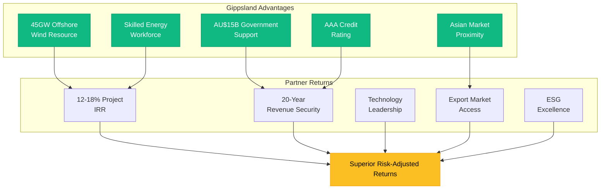
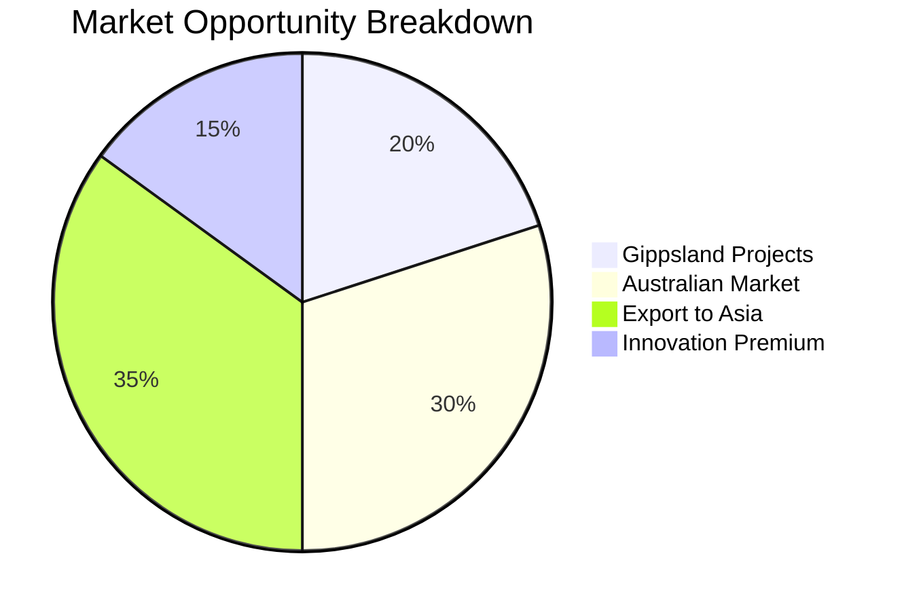
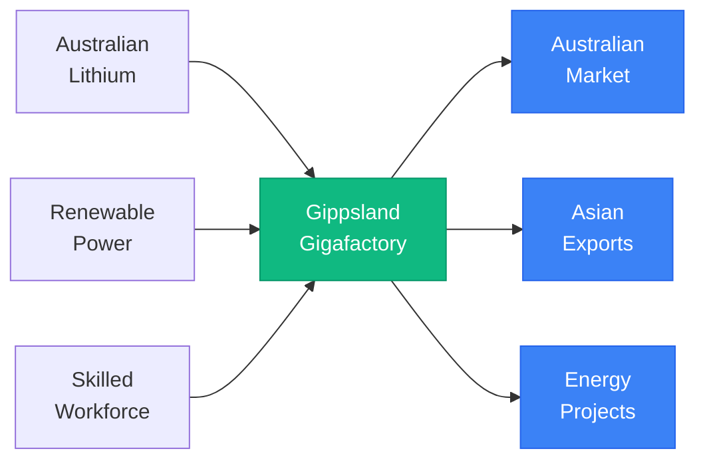
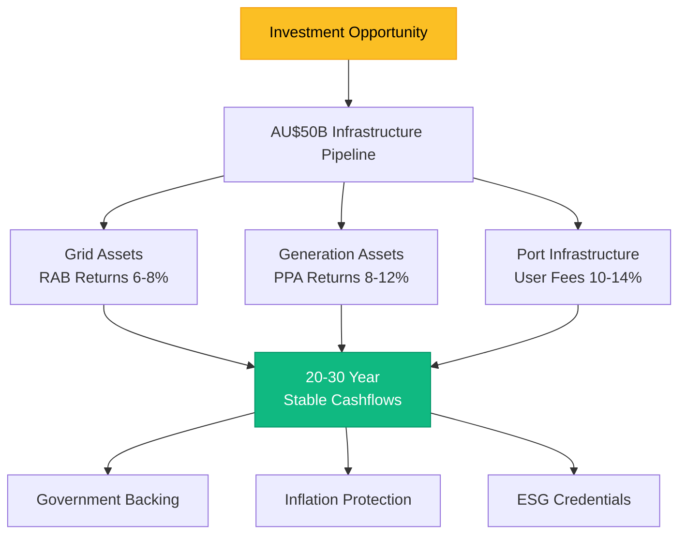
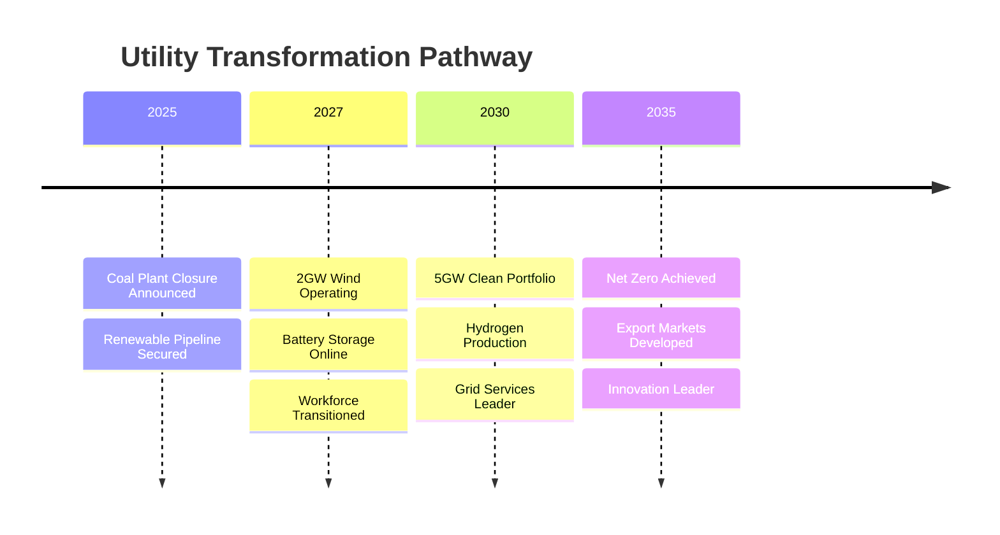
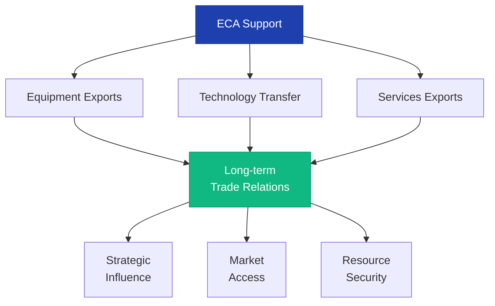
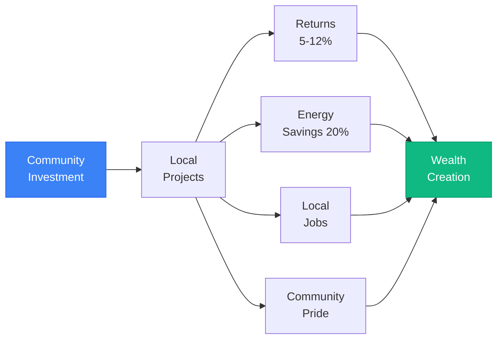
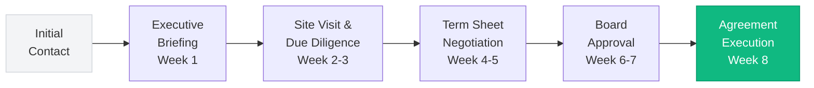
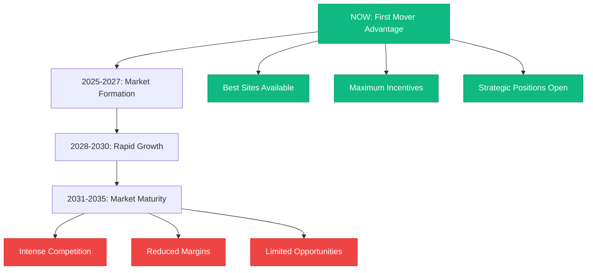

# Partnership Value Propositions - Gippsland Energy Transformation
## Compelling Opportunities for Global Partners

> **Version:** 1.0  
> **Date:** September 10th, 2025  
> **Purpose:** Clear value propositions for partnership attraction  
> **Target Audience:** C-Suite executives, Investment committees, Board members  

---

## Executive Summary

Gippsland offers unparalleled partnership opportunities in the global renewable energy transition. With AU$150 billion in project pipeline, world-class resources, government backing, and strategic location, partners can achieve superior returns while contributing to meaningful climate action. This document articulates specific value propositions for different partner categories.



---

## 1. TECHNOLOGY PARTNERS VALUE PROPOSITION

### 1.1 For Global Wind OEMs (Vestas, Siemens Gamesa, GE)

#### The Opportunity
**"Establish your Asia-Pacific manufacturing and innovation hub in the world's best offshore wind market"**



#### Compelling Numbers
| Metric | Value | Benchmark |
|--------|-------|-----------|
| **Addressable Market** | 45GW by 2040 | Larger than current UK market |
| **Manufacturing Investment** | AU$1.2B | 40% government co-funding |
| **Expected IRR** | 16-18% | vs 12-14% European projects |
| **Local Content Premium** | 10% price uplift | Guaranteed in PPAs |
| **Export Revenue Potential** | AU$5B/year by 2035 | Protected by FTAs |

#### Unique Advantages
1. **First Mover Benefits**
   - Exclusive supplier agreements available
   - 20-year government backing
   - Protected market position
   - Brand leadership in region

2. **Innovation Ecosystem**
   - AU$500M R&D fund access
   - 3 university partnerships
   - Living lab environment
   - IP development incentives

3. **Risk Mitigation**
   - Government offtake guarantees
   - Political risk insurance
   - Skilled workforce available
   - Infrastructure provided

### 1.2 For Battery Technology Companies

#### The Opportunity
**"Co-locate your gigafactory with abundant renewable energy and critical minerals"**



#### Value Drivers
- **Integrated Supply Chain**: Mine to market in Australia
- **Energy Cost Advantage**: AU$40/MWh renewable PPA
- **Market Access**: 20GWh local demand by 2030
- **Government Support**: AU$500M in grants/incentives
- **Export Hub**: Singapore/Japan battery markets

---

## 2. INSTITUTIONAL INVESTOR VALUE PROPOSITION

### 2.1 For Infrastructure Funds

#### The Opportunity
**"Access Australia's largest renewable infrastructure pipeline with government-backed returns"**

#### Investment Highlights


#### Risk-Return Profile
| Asset Class | Expected Return | Risk Profile | Government Support |
|-------------|-----------------|--------------|-------------------|
| **Transmission** | 7-8% (regulated) | Very Low | RAB guarantee |
| **Wind Generation** | 10-12% (unlevered) | Low-Medium | PPA certainty |
| **Port Infrastructure** | 12-14% | Medium | Availability payments |
| **Hydrogen Facilities** | 14-18% | Medium-High | Grant funding |

### 2.2 For Pension Funds

#### The Opportunity
**"Long-term, inflation-linked returns aligned with climate commitments"**

#### Pension Fund Benefits
1. **Duration Matching**: 20-40 year asset life
2. **Inflation Protection**: CPI-linked revenue
3. **ESG Leadership**: Paris Agreement aligned
4. **Stable Returns**: Government-backed revenue
5. **Growth Potential**: Expanding market

---

## 3. STRATEGIC CORPORATE VALUE PROPOSITION

### 3.1 For Energy Utilities

#### The Opportunity
**"Transform your generation portfolio while maintaining returns"**



#### Strategic Benefits
- **Managed Transition**: Coordinated coal exit
- **Workforce Continuity**: Reskilling programs
- **Market Position**: Maintain market share
- **Growth Options**: Hydrogen and exports
- **Regulatory Alignment**: Ahead of requirements

### 3.2 For Industrial Companies

#### The Opportunity
**"Decarbonise operations with secure, competitive clean energy"**

#### Industrial Benefits Package
| Benefit | Details | Value |
|---------|---------|-------|
| **Energy Security** | 20-year fixed price PPAs | Hedge against volatility |
| **Carbon Reduction** | 100% renewable supply | Meet net-zero targets |
| **Cost Competitiveness** | AU$50-60/MWh | Below grid prices |
| **Process Integration** | Hydrogen availability | Green steel/ammonia |
| **Brand Value** | Verified green products | Price premiums |

---

## 4. GOVERNMENT & DFI VALUE PROPOSITION

### 4.1 For Export Credit Agencies

#### The Opportunity
**"Support your national champions while developing strategic trade relationships"**



#### Strategic Returns
- **Trade Development**: AU$10B+ equipment exports
- **Technology Leadership**: IP development
- **Resource Access**: Hydrogen supply chains
- **Regional Influence**: Partnership model
- **Climate Leadership**: Paris Agreement support

### 4.2 For Development Finance Institutions

#### The Opportunity
**"Catalyse private investment in climate infrastructure with demonstration effects"**

#### DFI Impact Metrics
| Metric | Target | Multiplier Effect |
|--------|--------|-------------------|
| **Private Capital Mobilised** | 1:5 ratio | AU$5 private per AU$1 DFI |
| **GHG Reduction** | 45Mt CO2/year | Equivalent to 10M cars |
| **Jobs Created** | 50,000 total | 3x multiplier effect |
| **Technology Transfer** | 20+ innovations | Regional replication |
| **Gender Impact** | 30% female employment | Industry leading |

---

## 5. COMMUNITY INVESTMENT VALUE PROPOSITION

### 5.1 For Local Investors

#### The Opportunity
**"Build wealth while powering your community's future"**



#### Investment Options Comparison
| Vehicle | Minimum | Return | Risk | Liquidity |
|---------|---------|--------|------|-----------|
| **Solar Co-op** | $500 | 7-8% | Low | Annual |
| **Wind Bonds** | $1,000 | 6% | Very Low | 5 years |
| **Energy Fund** | $5,000 | 8-10% | Medium | Quarterly |
| **Crowd Equity** | $100 | 10-15% | High | Limited |

---

## 6. PARTNERSHIP DECISION FRAMEWORK

### 6.1 Why Gippsland Wins

```mermaid
radar
    title Gippsland vs Other Markets
    "Resource Quality" : 95
    "Government Support" : 90
    "Market Access" : 85
    "Infrastructure" : 80
    "Skills Base" : 85
    "Innovation Ecosystem" : 75
    "Regulatory Stability" : 90
    "Returns Potential" : 85
```

### 6.2 Decision Criteria Matrix

| Criteria | Gippsland | Northern Europe | US Markets | Asian Markets |
|----------|-----------|-----------------|------------|---------------|
| **Wind Resource** | ⭐⭐⭐⭐⭐ | ⭐⭐⭐⭐ | ⭐⭐⭐ | ⭐⭐⭐ |
| **Policy Support** | ⭐⭐⭐⭐⭐ | ⭐⭐⭐⭐ | ⭐⭐⭐ | ⭐⭐ |
| **Market Growth** | ⭐⭐⭐⭐⭐ | ⭐⭐⭐ | ⭐⭐⭐⭐ | ⭐⭐⭐⭐⭐ |
| **Grid Access** | ⭐⭐⭐⭐ | ⭐⭐⭐ | ⭐⭐ | ⭐⭐ |
| **Export Potential** | ⭐⭐⭐⭐⭐ | ⭐⭐ | ⭐⭐⭐ | ⭐⭐⭐⭐ |
| **Innovation Support** | ⭐⭐⭐⭐ | ⭐⭐⭐⭐⭐ | ⭐⭐⭐⭐⭐ | ⭐⭐⭐ |

---

## 7. PARTNERSHIP PROCESS

### 7.1 Accelerated Partnership Timeline



### 7.2 Partnership Support Package

1. **Dedicated Account Management**
   - C-suite relationship manager
   - Technical support team
   - Government liaison
   - Community engagement support

2. **Accelerated Approvals**
   - Pre-cleared sites
   - Streamlined permitting
   - Fast-track grid access
   - Priority processing

3. **Financial Incentives**
   - Investment grants
   - Tax concessions
   - Infrastructure provision
   - Training subsidies

---

## 8. CALL TO ACTION

### The Window of Opportunity



### Next Steps

1. **Schedule Executive Briefing**
   - Direct line: +61 3 XXXX XXXX
   - Email: partnerships@gippslandenergy.gov.au
   - Video conference available

2. **Arrange Site Visit**
   - 2-day comprehensive program
   - Meet key stakeholders
   - View project sites
   - Technical deep dives

3. **Fast-Track Decision**
   - Board-ready materials provided
   - Independent verification available
   - Reference checks facilitated
   - Legal frameworks ready

---

## Key Messages

### For Technology Partners:
> **"Gippsland is your gateway to 100GW of Asia-Pacific renewable energy markets"**

### For Investors:
> **"Government-backed returns in the world's most attractive renewable energy market"**

### For Corporates:
> **"Secure your competitive advantage with Australia's lowest-cost clean energy"**

### For Communities:
> **"Your investment, your energy, your prosperity"**

---

**Time is Critical - Early Partners Secure the Best Opportunities**

Contact us today to explore how Gippsland can accelerate your renewable energy ambitions.

**Gippsland Regional Energy Authority**
- Email: partnerships@gippslandenergy.gov.au
- Phone: +61 3 XXXX XXXX
- Web: www.gippslandenergy.gov.au