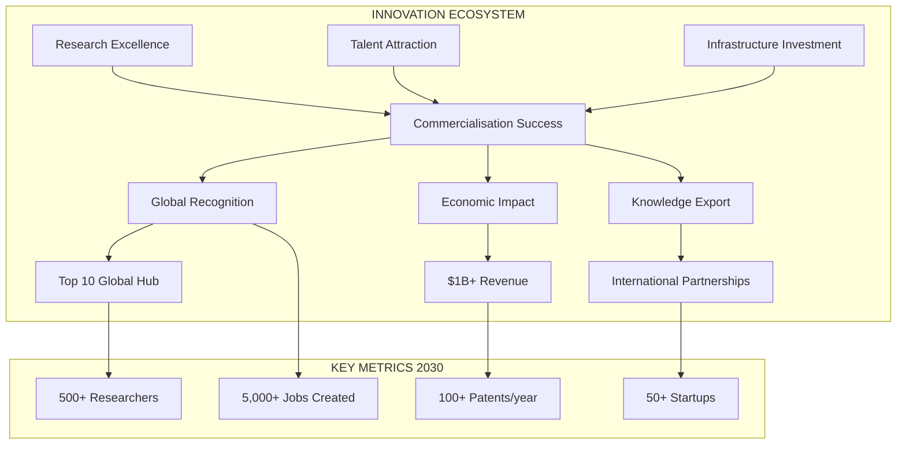

# Gippsland Renewable Energy Innovation Hub Strategy



## Executive Summary for Government and Investor Audiences

**Innovation Leadership Imperative**: The Gippsland Renewable Energy Innovation Hub will transform the region into a global centre of excellence for renewable energy research, development, and commercialisation. This comprehensive strategy outlines the infrastructure, programs, funding mechanisms, and talent initiatives that will create a world-class innovation ecosystem.

**Knowledge Economy Value**: By establishing Gippsland as a top-10 global renewable innovation hub, this strategy will generate $1+ billion in annual R&D investment, create 5,000+ high-value jobs, and position Australia as the Southern Hemisphere's renewable energy technology leader whilst creating substantial intellectual property and export revenue streams.

## Strategic Vision Framework

```mermaid
pyramid
    title Innovation Hub Vision Hierarchy
    
    "Global Premier Destination"
    "Breakthrough Technology Development" : "Real-World Testing" : "Commercial Scale-Up"
    "Research Excellence" : "Industry Partnership" : "Talent Attraction" : "Knowledge Export"
```

**"To establish Gippsland as the premier global destination for renewable energy innovation, where breakthrough technologies are developed, tested, and commercialised at scale."**

#### Vision Success Indicators 2030
- 🏆 **Global Rankings**: Top 10 renewable innovation hubs worldwide
- 🏆 **Technology Leadership**: 3+ world-first innovations commercialised
- 🏆 **Industry Recognition**: 50+ global companies with R&D presence
- 🏆 **Academic Excellence**: Partnership with 20+ leading universities
- 🏆 **Economic Impact**: $500M+ in annual innovation revenue

## 1. Innovation Infrastructure

### 1.1 Physical Innovation Precincts

#### Morwell Energy Innovation Campus (MEIC)
- **Location**: 150-hectare site on former power station land
- **Facilities**:
  - Advanced Materials Research Center (10,000 sqm)
  - Grid Integration Test Laboratory (15,000 sqm)
  - Hydrogen Production Pilot Facility (20,000 sqm)
  - Battery Technology Development Center (12,000 sqm)
  - Startup Incubator Complex (8,000 sqm)
- **Investment**: $450 million
- **Capacity**: 500 researchers, 50 startups
- **Timeline**: Phase 1 by 2026, Full completion by 2029

#### Traralgon Clean Energy Research Park
- **Location**: 80-hectare greenfield site
- **Facilities**:
  - Wind Technology Testing Center
  - Solar Panel Innovation Laboratory
  - Energy Storage Systems Facility
  - Digital Twin Development Center
- **Investment**: $280 million
- **Capacity**: 300 researchers, 30 companies
- **Timeline**: Operational by 2027

#### Sale Offshore Wind Innovation Center
- **Location**: Port of Sale industrial precinct
- **Facilities**:
  - Offshore Wind Component Testing
  - Marine Energy Research Station
  - Subsea Cable Technology Lab
  - Remote Operations Center
- **Investment**: $320 million
- **Capacity**: 200 specialists
- **Timeline**: Phase 1 by 2028

### 1.2 Research Facilities and Labs

#### Core Research Infrastructure
1. **National Renewable Energy Test Facility**
   - Grid-scale testing capability (up to 100MW)
   - Real-world condition simulation
   - Performance validation services
   - International certification capability

2. **Advanced Materials Laboratory**
   - Next-generation solar cell development
   - Lightweight composite materials for wind turbines
   - Advanced battery chemistry research
   - Superconductor development for transmission

3. **Hydrogen Technology Center**
   - Electrolyzer testing and optimization
   - Fuel cell development
   - Storage solution research
   - Safety testing protocols

4. **AI and Digital Innovation Lab**
   - Machine learning for grid optimization
   - Predictive maintenance algorithms
   - Energy trading platforms
   - Digital twin development

### 1.3 Testing and Demonstration Sites

#### Large-Scale Test Sites
1. **Hazelwood Renewable Energy Testbed**
   - 500 hectares for utility-scale demonstrations
   - Grid connection for real-world testing
   - Multiple technology zones
   - Community observation areas

2. **Latrobe Valley Microgrid Demonstration**
   - 10 interconnected test microgrids
   - Various renewable sources integration
   - Energy storage optimization
   - Demand response testing

3. **Gippsland Offshore Wind Test Zone**
   - 50 square kilometers designated area
   - Floating platform demonstrations
   - Environmental monitoring stations
   - Subsea infrastructure testing

### 1.4 Collaboration Spaces

#### Innovation Collaboration Centers
1. **Central Innovation Hub** (Morwell)
   - 5,000 sqm collaborative workspace
   - 20 project rooms
   - 500-seat auditorium
   - Virtual reality demonstration center

2. **Regional Innovation Nodes**
   - Traralgon Tech Hub (2,000 sqm)
   - Sale Maritime Innovation Center (1,500 sqm)
   - Warragul AgTech Energy Hub (1,000 sqm)
   - Bairnsdale Distributed Energy Lab (800 sqm)

### 1.5 Digital Infrastructure

#### Advanced Digital Capabilities
1. **High-Performance Computing Center**
   - 10 petaflops processing capability
   - Renewable energy modeling specialization
   - Quantum computing research node
   - Cloud computing infrastructure

2. **Data Management Platform**
   - Real-time energy data collection
   - Research data repository
   - Open data portal
   - Blockchain for energy trading

3. **5G Innovation Network**
   - Private 5G network for research
   - IoT sensor networks
   - Edge computing capabilities
   - Autonomous system testing

## 2. Innovation Programs

### 2.1 Research Priorities Alignment

#### Strategic Research Areas
1. **Next-Generation Renewable Technologies**
   - Perovskite solar cells
   - Floating offshore wind systems
   - Tidal and wave energy converters
   - Advanced geothermal systems

2. **Energy Storage Breakthroughs**
   - Solid-state batteries
   - Green hydrogen production
   - Thermal energy storage
   - Gravity-based storage systems

3. **Grid Integration Solutions**
   - Smart inverter technology
   - Virtual power plant optimization
   - Grid stability algorithms
   - Peer-to-peer energy trading

4. **Circular Economy in Renewables**
   - Solar panel recycling
   - Wind turbine blade repurposing
   - Battery material recovery
   - Sustainable manufacturing

### 2.2 Startup Accelerators

#### Gippsland Energy Accelerator Program (GEAP)
- **Duration**: 6-month intensive program
- **Cohort Size**: 15 startups per intake
- **Intakes**: 2 per year
- **Focus Areas**:
  - Hardware innovation
  - Software and digital solutions
  - Business model innovation
  - Deep tech commercialization

**Program Components**:
1. **Mentorship Network**
   - 50+ industry experts
   - Technical advisors
   - Business development coaches
   - Investment readiness training

2. **Resources Provided**:
   - $100,000 seed funding
   - Free lab and office space
   - Equipment access
   - Legal and IP support

3. **Demo Day**:
   - Global investor showcase
   - Corporate partner meetings
   - Media coverage
   - Prize pool of $500,000

### 2.3 Corporate Innovation Labs

#### Corporate Partnership Model
1. **Anchor Tenants Program**
   - AGL Innovation Lab (2,000 sqm)
   - Origin Energy Research Center
   - EnergyAustralia Digital Lab
   - International partnerships (Shell, BP, Vestas)

2. **Innovation Challenges**
   - Quarterly corporate challenges
   - $1 million prize pools
   - IP sharing agreements
   - Pilot project opportunities

3. **Joint Research Initiatives**
   - Co-funded research projects
   - Staff exchanges
   - Shared infrastructure
   - Technology licensing

### 2.4 University Partnerships

#### Academic Collaboration Network
1. **Foundation Partners**
   - Monash University (engineering focus)
   - RMIT (design and systems)
   - Federation University (regional development)
   - University of Melbourne (advanced materials)

2. **International Partnerships**
   - MIT Energy Initiative (USA)
   - Technical University of Denmark (Wind Energy)
   - Fraunhofer Institute (Germany)
   - KAIST (South Korea)

3. **Joint Programs**
   - Dual PhD programs
   - Researcher exchanges
   - Shared facilities
   - Joint grant applications

### 2.5 International Collaborations

#### Global Innovation Network
1. **Sister Innovation Hubs**
   - Silicon Valley Clean Energy Hub
   - Danish Wind Innovation Center
   - Singapore Solar Research Institute
   - Chilean Hydrogen Valley

2. **Technology Transfer Programs**
   - International licensing desk
   - Global patent portfolio
   - Technology scouting missions
   - Reverse innovation programs

3. **International Events**
   - Annual Gippsland Energy Innovation Summit
   - Technology showcases
   - Investment forums
   - Research symposiums

## 3. Funding Ecosystem

### 3.1 Innovation Fund Design

#### Gippsland Renewable Innovation Fund (GRIF)
- **Total Fund Size**: $1 billion
- **Structure**: Public-private partnership
- **Investment Stages**:
  - Pre-seed: $50k - $250k
  - Seed: $250k - $2M
  - Series A: $2M - $10M
  - Growth: $10M+

**Fund Allocation**:
- 30% Early-stage ventures
- 40% Growth companies
- 20% Infrastructure projects
- 10% Research commercialization

### 3.2 Grant Programs

#### Research and Development Grants
1. **Discovery Grants**
   - $100k - $500k per project
   - 1-3 year duration
   - Basic research focus
   - $20M annual budget

2. **Applied Innovation Grants**
   - $500k - $2M per project
   - Commercial pathway required
   - Industry co-funding
   - $40M annual budget

3. **Demonstration Grants**
   - $2M - $10M per project
   - Large-scale pilots
   - Market validation
   - $60M annual budget

4. **International Collaboration Grants**
   - $200k - $1M per partnership
   - Global research teams
   - Technology transfer focus
   - $15M annual budget

### 3.3 VC Attraction Strategy

#### Venture Capital Ecosystem Development
1. **Anchor Fund Strategy**
   - Attract 3-5 major cleantech VCs
   - Co-investment opportunities
   - Fund-of-funds structure
   - Target $500M in VC commitments

2. **VC Incentive Program**
   - Tax benefits for cleantech investments
   - Co-investment matching (1:2 ratio)
   - Carried interest enhancements
   - Loss protection mechanisms

3. **Deal Flow Development**
   - Quarterly pitch events
   - Investor roadshows
   - Due diligence support
   - Exit strategy planning

### 3.4 Corporate Venture Programs

#### Corporate Innovation Investment
1. **Corporate Venture Partners**
   - Energy company ventures
   - Technology company funds
   - Manufacturing partners
   - Infrastructure investors

2. **Strategic Investment Matching**
   - 1:1 matching for strategic investments
   - Technology validation support
   - Pilot project funding
   - Commercial pathway development

3. **Innovation Procurement**
   - First customer programs
   - Technology trials
   - Performance guarantees
   - Long-term contracts

### 3.5 Crowdfunding Platforms

#### Community Investment Programs
1. **Gippsland Energy Crowd**
   - Equity crowdfunding platform
   - Minimum investment: $500
   - Community ownership models
   - Annual target: $10M raised

2. **Innovation Bonds**
   - Green bonds for research infrastructure
   - 5-7% annual returns
   - Tax-free status
   - $100M annual issuance

3. **Community Energy Projects**
   - Local renewable projects
   - Profit-sharing models
   - Educational components
   - Social impact measurement

## 4. Talent Strategy

### 4.1 Researcher Attraction

#### Global Talent Acquisition
1. **Star Researcher Program**
   - $5M recruitment packages
   - Research team funding
   - Housing assistance
   - School placements

2. **Research Chair Positions**
   - 20 endowed chairs
   - $2M annual funding each
   - 5-year renewable terms
   - Global recruitment

3. **Early Career Fellowships**
   - 50 positions annually
   - $150k salary + benefits
   - 3-year terms
   - Career development support

### 4.2 PhD Programs

#### Doctoral Research Excellence
1. **Gippsland Energy PhD Scholarships**
   - 100 fully-funded positions
   - $50k annual stipend
   - International placements
   - Industry mentorship

2. **Industrial PhD Program**
   - Company-sponsored research
   - Split time arrangement
   - Commercial outcomes focus
   - Patent sharing agreements

3. **International PhD Exchange**
   - 6-month placements
   - Partner universities
   - Travel funding
   - Joint supervision

### 4.3 Technical Skills Development

#### Workforce Training Programs
1. **Renewable Energy Technician Training**
   - 500 positions annually
   - 12-month programs
   - Industry placements
   - Job guarantees

2. **Advanced Skills Certification**
   - Grid integration specialists
   - Battery system engineers
   - Hydrogen technicians
   - Digital systems operators

3. **Apprenticeship Programs**
   - 200 positions annually
   - 4-year programs
   - Rotation system
   - Mentorship support

### 4.4 Entrepreneur Development

#### Entrepreneurship Programs
1. **Entrepreneur in Residence**
   - 12-month placements
   - $150k salary + equity
   - Venture development
   - Mentorship role

2. **Student Startup Program**
   - University partnerships
   - $25k seed grants
   - Incubator access
   - Business coaching

3. **Corporate Entrepreneur Program**
   - Secondments from industry
   - Innovation projects
   - Spin-out opportunities
   - IP arrangements

### 4.5 Global Talent Visa Program

#### International Recruitment
1. **Fast-Track Visa Processing**
   - 2-week approvals
   - Family inclusion
   - Permanent residency pathway
   - Relocation support

2. **Global Talent Incentives**
   - Tax benefits (50% reduction for 5 years)
   - Housing subsidies
   - Healthcare coverage
   - Education support

3. **Integration Programs**
   - Cultural orientation
   - Community connections
   - Professional networks
   - Language support

## 5. IP and Commercialization

### 5.1 IP Framework Design

#### Intellectual Property Management
1. **IP Policy Framework**
   - Clear ownership structures
   - Revenue sharing models
   - Inventor rights
   - Institution obligations

2. **Patent Strategy**
   - Prior art searches
   - Patent drafting support
   - International filings
   - Portfolio management

3. **IP Protection Services**
   - Legal support
   - Infringement monitoring
   - Defense strategies
   - Licensing negotiations

### 5.2 Tech Transfer Mechanisms

#### Technology Commercialization
1. **Tech Transfer Office**
   - 20 specialist staff
   - Industry liaison
   - Commercialization assessment
   - Deal negotiation

2. **Commercialization Pathways**
   - Licensing programs
   - Joint ventures
   - Spin-off creation
   - Industry partnerships

3. **Proof of Concept Fund**
   - $10M annual budget
   - $100k - $500k grants
   - Prototype development
   - Market validation

### 5.3 Spin-off Support

#### Startup Creation Program
1. **Spin-off Incubation**
   - Pre-incorporation support
   - Team building
   - Business planning
   - Funding preparation

2. **Venture Studio Model**
   - Entrepreneur matching
   - Shared services
   - Growth acceleration
   - Exit planning

3. **Alumni Network**
   - Mentorship programs
   - Investment connections
   - Partnership opportunities
   - Knowledge sharing

### 5.4 Patent Strategies

#### Patent Portfolio Development
1. **Strategic Patent Filing**
   - Technology landscapes
   - Freedom to operate
   - Defensive patents
   - Offensive portfolios

2. **International Coverage**
   - PCT applications
   - Regional strategies
   - Cost optimization
   - Market prioritization

3. **Patent Analytics**
   - Competitor monitoring
   - Technology trends
   - White space analysis
   - Citation tracking

### 5.5 Global Licensing

#### International Licensing Program
1. **Licensing Desk**
   - Global partner network
   - Standard agreements
   - Negotiation support
   - Compliance monitoring

2. **Technology Packages**
   - Bundled offerings
   - Technical support
   - Training programs
   - Quality assurance

3. **Revenue Models**
   - Upfront payments
   - Milestone achievements
   - Royalty structures
   - Equity positions

## Innovation Ecosystem Maps

### Regional Innovation Network
```
┌─────────────────────────────────────────────────┐
│          GIPPSLAND INNOVATION ECOSYSTEM         │
├─────────────────────────────────────────────────┤
│                                                 │
│  ┌─────────────┐    ┌──────────────┐          │
│  │   MORWELL   │───│   TRARALGON   │          │
│  │ MAIN CAMPUS │    │ RESEARCH PARK │          │
│  └──────┬──────┘    └───────┬──────┘          │
│         │                    │                  │
│         └────────┬───────────┘                 │
│                  │                              │
│            ┌─────┴─────┐                       │
│            │    HUB    │                       │
│            │  NETWORK  │                       │
│            └─────┬─────┘                       │
│                  │                              │
│    ┌─────────────┼─────────────┐              │
│    │             │             │                │
│ ┌──┴───┐    ┌───┴──┐    ┌────┴───┐           │
│ │ SALE │    │ WARR- │    │ BAIRNS-│           │
│ │MARINE│    │ AGUL  │    │  DALE  │           │
│ └──────┘    └──────┘    └────────┘           │
│                                                 │
└─────────────────────────────────────────────────┘
```

### Innovation Value Chain
```
RESEARCH → DEVELOPMENT → DEMONSTRATION → COMMERCIALIZATION → SCALE-UP
    │           │              │                │               │
    ├──────────┼──────────────┼────────────────┼───────────────┤
    │          │              │                │               │
Universities  Labs      Test Sites      Accelerators    Markets
  & CRCs    & Corps    & Pilots       & Investors    & Exports
```

### Funding Flow Diagram
```
                    INNOVATION FUNDING SOURCES
                              │
        ┌─────────────────────┼─────────────────────┐
        │                     │                     │
   GOVERNMENT            PRIVATE              INTERNATIONAL
        │                     │                     │
   ┌────┴────┐          ┌────┴────┐         ┌─────┴─────┐
   │ Federal │          │   VCs   │         │  Partner  │
   │  State  │          │ Angels  │         │ Countries │
   │  Local  │          │ Corporate│        │   Funds   │
   └────┬────┘          └────┬────┘         └─────┬─────┘
        │                     │                     │
        └─────────────────────┴─────────────────────┘
                              │
                    ┌─────────┴─────────┐
                    │ INNOVATION FUND   │
                    │    $1 BILLION     │
                    └─────────┬─────────┘
                              │
     ┌────────────┬───────────┼───────────┬────────────┐
     │            │           │           │            │
  RESEARCH    STARTUPS   PILOTS &    SCALE-UP    INFRASTR.
  GRANTS     & VENTURES    DEMOS    CAPITAL      PROJECTS
```

## Implementation Timeline

### Phase 1: Foundation (2025-2026)
- Q1 2025: Establish governance structure
- Q2 2025: Launch first accelerator cohort
- Q3 2025: Begin Morwell campus construction
- Q4 2025: Recruit first 50 researchers
- Q1 2026: Open initial lab facilities
- Q2 2026: Launch innovation fund

### Phase 2: Growth (2027-2028)
- Q1 2027: Complete Traralgon research park
- Q2 2027: Reach 200 researchers
- Q3 2027: First major commercialization
- Q4 2027: Establish international partnerships
- 2028: Full ecosystem operational

### Phase 3: Scale (2029-2030)
- 2029: 500+ researchers active
- 2029: $100M+ in commercialization revenue
- 2030: Recognized global innovation leader
- 2030: 1000+ jobs created

## Success Metrics

### Innovation KPIs
- Research Output: 500+ papers annually
- Patents Filed: 100+ annually
- Startups Created: 50+ annually
- Jobs Created: 5,000+ by 2030
- Investment Attracted: $2B+ by 2030
- Commercial Revenue: $500M+ by 2030

### Economic Impact
- Regional GDP Contribution: $1.5B by 2030
- Export Revenue: $300M annually
- Tax Revenue: $200M annually
- Property Values: 25% increase
- Population Growth: 10,000 new residents

## Risk Management

### Key Risks and Mitigation
1. **Talent Attraction**
   - Risk: Competition from major cities
   - Mitigation: Lifestyle benefits, competitive packages

2. **Funding Sustainability**
   - Risk: Government policy changes
   - Mitigation: Diversified funding sources

3. **Technology Risks**
   - Risk: Rapid technology changes
   - Mitigation: Flexible infrastructure, continuous adaptation

4. **Market Competition**
   - Risk: Other regions developing similar hubs
   - Mitigation: First-mover advantage, unique assets

## Conclusion

The Gippsland Renewable Energy Innovation Hub represents a transformative opportunity to position the region at the forefront of the global energy transition. Through strategic investments in infrastructure, programs, talent, and commercialization pathways, Gippsland will become synonymous with renewable energy innovation, creating thousands of jobs and billions in economic value while contributing to global climate solutions.

The success of this initiative depends on strong partnerships between government, industry, academia, and community. With committed implementation of this strategy, Gippsland will emerge as a model for how traditional energy regions can reinvent themselves as innovation powerhouses for the renewable future.