# Policy and Regulatory Implementation Timeline

## Visual Timeline: 2025-2030 Policy Rollout

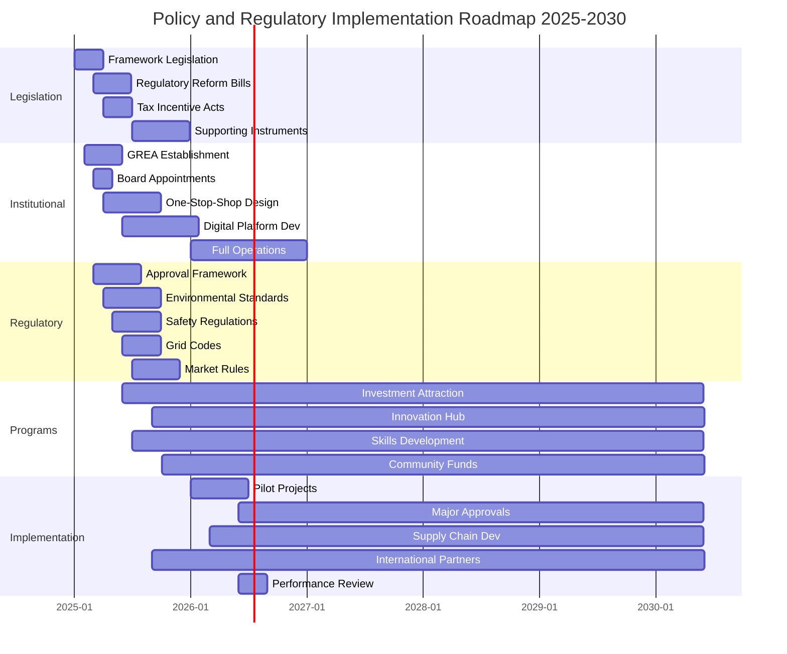

## Key Policy Milestones by Quarter

### 2025 Timeline

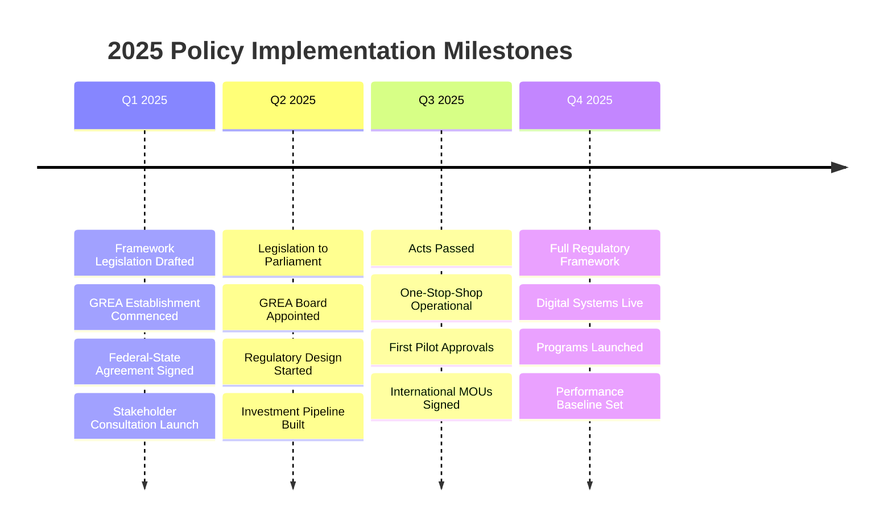

### 2026-2030 Major Phases

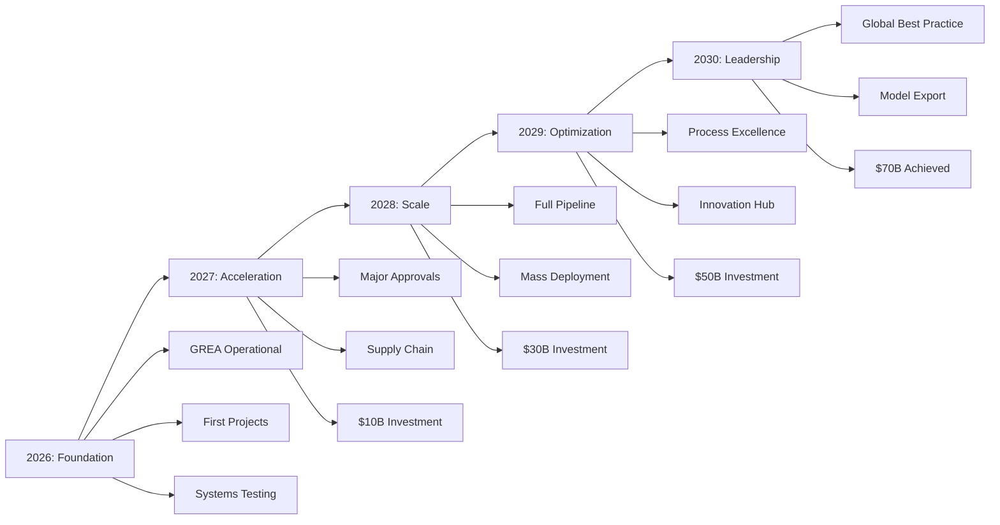

## Regulatory Reform Pathways

### Federal-State-Local Integration

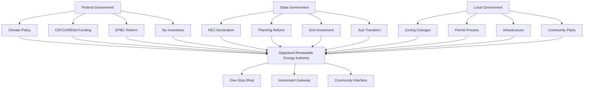

## Investment Incentive Timeline

### Incentive Program Rollout

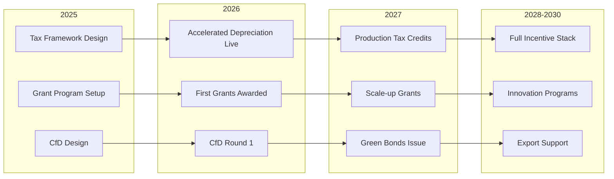

## Approval Process Evolution

### Current vs Future State

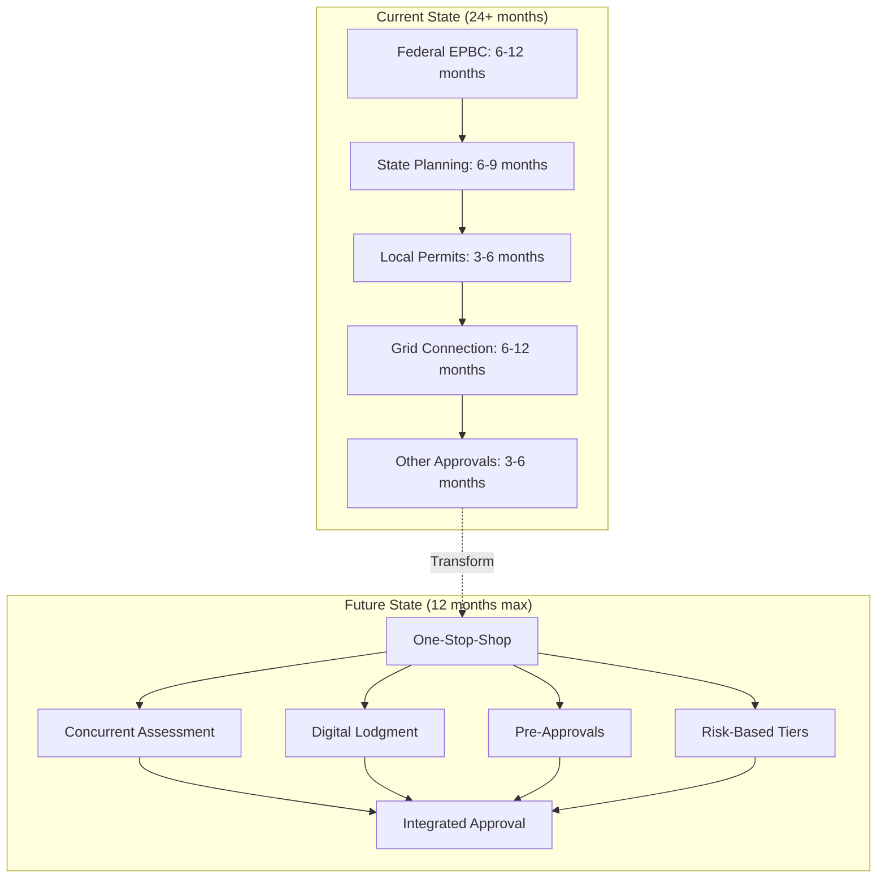

## Governance Implementation Schedule

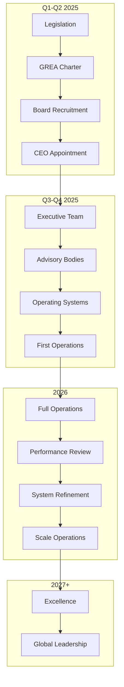

## Risk Management Implementation

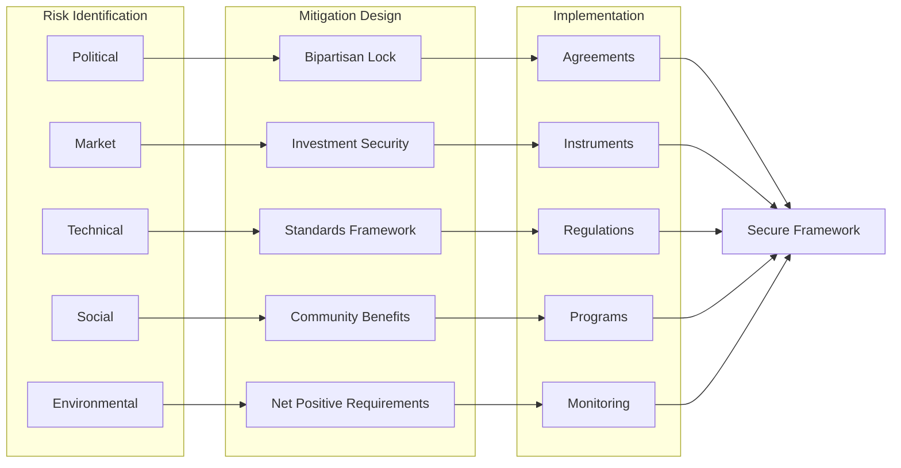

## Performance Monitoring Dashboard Design

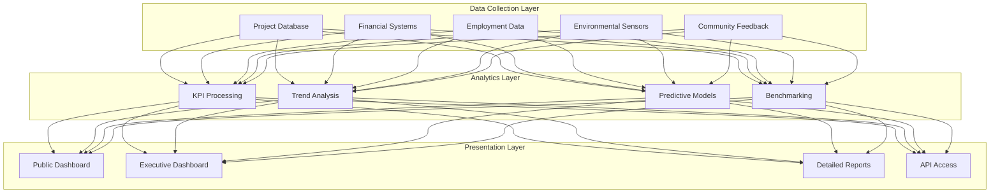

## Critical Path Dependencies

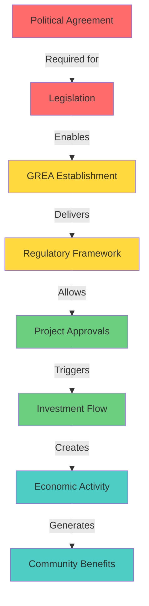

## Success Metrics Tracking

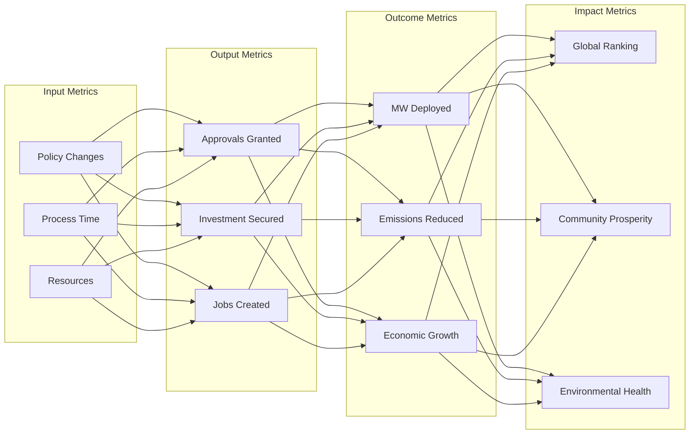

---

*This visual timeline complements the comprehensive policy and regulatory framework document*