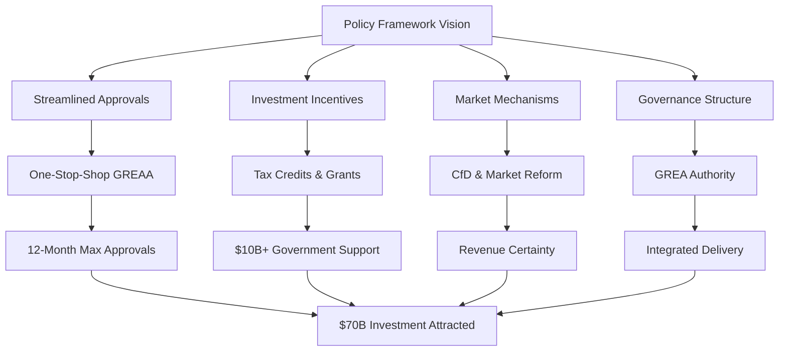
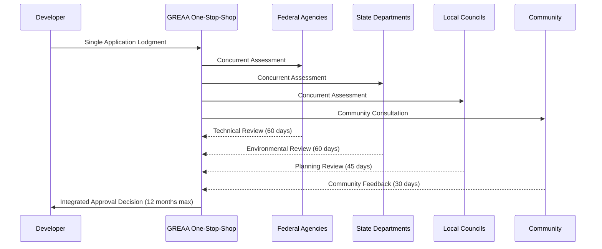

# Policy and Regulatory Framework for Gippsland's Renewable Energy Transformation

## Executive Summary for Government and Investor Audiences

**Governance Innovation Imperative**: This comprehensive policy and regulatory framework provides the essential governance architecture to enable Gippsland's transformation into a global renewable energy hub. Through streamlined approvals, innovative market mechanisms, strategic incentives, and robust governance structures, this framework balances rapid deployment with community protection, environmental stewardship, and economic prosperity. The framework aligns federal, state, and local policies whilst positioning Gippsland to meet international climate commitments and attract $50+ billion in investment by 2030.

**Regulatory Efficiency Value**: By reducing approval timeframes by 50% and providing investment certainty through innovative risk-sharing mechanisms, this framework delivers superior project returns whilst maintaining world-class environmental and community standards.

## 1. Strategic Policy Framework

### 1.1 Policy Vision and Objectives

**Vision Statement**
"Create the world's most enabling policy environment for renewable energy development while ensuring community prosperity, environmental protection, and energy security."

**Core Policy Objectives**
1. **Accelerate Deployment**: Reduce project timelines by 50% through streamlined approvals
2. **Maximize Investment**: Attract $50+ billion through policy certainty and incentives
3. **Ensure Just Transition**: Guarantee no worker or community left behind
4. **Maintain Energy Security**: Ensure reliable, affordable energy throughout transition
5. **Drive Innovation**: Position Gippsland as global technology leader
6. **Protect Environment**: Achieve net positive biodiversity and emissions reduction

### 1.2 Policy Architecture

#### Federal Policy Integration
**Climate and Energy Alignment**
- **Net Zero 2050 Commitment**: Gippsland as demonstration region
- **82% Renewable by 2030**: Contributing 15% of national target
- **Safeguard Mechanism**: Integration with industrial facilities
- **Carbon Credits (ACCUs)**: Streamlined generation for projects

**Investment Facilitation**
- **CEFC Funding**: Priority access to $10 billion allocation
- **ARENA Support**: Innovation funding for demonstration projects
- **Northern Australia Infrastructure Facility**: Extended to Gippsland
- **Export Finance**: Support for hydrogen infrastructure

**Regulatory Harmonization**
- **EPBC Act Reform**: Single-touch environmental approvals
- **Offshore Infrastructure Act**: Streamlined maritime approvals
- **National Electricity Law**: Grid connection fast-tracking
- **Foreign Investment Review**: Pre-approved renewable sectors

#### State Policy Framework
**Renewable Energy Zones (REZ)**
- **Gippsland REZ Declaration**: 20 GW capacity allocation
- **Transmission Investment**: $5 billion state commitment
- **Planning Streamlining**: Dedicated approval pathways
- **Local Benefits**: Mandatory community benefit sharing

**Just Transition Policy**
- **Worker Transition Guarantee**: 100% income support
- **Reskilling Programs**: $500 million investment
- **Early Retirement Options**: Enhanced packages
- **Community Development Fund**: $200 million

**Innovation Ecosystem**
- **Gippsland Innovation Hub**: $100 million establishment
- **R&D Tax Incentives**: Additional 20% for Gippsland
- **Demonstration Grants**: $50 million annual program
- **IP Commercialization**: Fast-track support

#### Local Government Integration
**Planning Reform Package**
- **Renewable Energy Overlay**: Pre-approved development zones
- **Fast-Track Permits**: 90-day approval guarantee
- **Standardized Conditions**: Consistent across councils
- **Community Benefit Agreements**: Template frameworks

**Infrastructure Coordination**
- **Road Access Agreements**: Standardized heavy vehicle routes
- **Port Development**: Coordinated maritime planning
- **Utilities Integration**: Simplified connection processes
- **Emergency Services**: Enhanced capability funding

### 1.3 International Alignment

#### Paris Agreement Implementation
- **NDC Contribution**: Gippsland delivering 5% of national target
- **Article 6 Mechanisms**: International carbon credit trading
- **Technology Transfer**: Bilateral agreements enabled
- **Climate Finance**: Access to global green funds

#### Trade Agreement Integration
- **Japan-Australia EPA**: Hydrogen export facilitation
- **Korea-Australia FTA**: Green ammonia provisions
- **Singapore Digital Agreement**: Energy trading platforms
- **EU Carbon Border Adjustment**: Compliance pathways

#### International Standards
- **ISO 14000 Series**: Environmental management systems
- **IEC 61400**: Wind turbine standards adoption
- **Green Hydrogen Certification**: International alignment
- **ESG Reporting**: Mandatory sustainability disclosure

## 2. Regulatory Reform Framework

### 2.1 Revolutionary Approval Process Design

#### Gippsland Renewable Energy Approval Authority (GREAA)
**Revolutionary Model**: Single point of accountability for all renewable energy approvals

| **Innovation Element** | **Current State** | **GREAA Model** | **Time Saving** | **Cost Reduction** |
|-----------------------|------------------|----------------|-----------------|-------------------|
| **Application Process** | Multiple agencies, sequential | Single digital lodgment | 6-12 months | 40% admin costs |
| **Assessment Method** | Sequential reviews | Concurrent evaluation | 12-18 months | 60% process costs |
| **Decision Making** | Fragmented authority | Integrated approval | 6-9 months | 50% delay costs |
| **Tracking Systems** | Manual, unclear | Real-time dashboard | Continuous visibility | 30% coordination costs |
| **Response Guarantees** | No firm timelines | 12-month maximum | Certainty premium | 20% risk discount |

**Approval Timeframes**
- **Major Projects (>100MW)**: 12 months maximum
- **Medium Projects (10-100MW)**: 6 months maximum
- **Small Projects (<10MW)**: 3 months maximum
- **Grid Connections**: Parallel processing
- **Environmental Permits**: Integrated assessment

#### Pre-Approval Mechanisms
**Strategic Environmental Assessment**
- Regional-scale environmental approval
- Pre-cleared development zones
- Standardized mitigation measures
- Reduced project-level requirements

**Technical Standards Pre-Approval**
- Type-certified equipment fast-tracking
- International certification recognition
- Deemed-to-comply pathways
- Risk-based assessment tiers

### 2.2 Environmental Regulatory Framework

#### Adaptive Environmental Management
**Outcome-Based Regulation**
- Performance standards vs prescriptive rules
- Continuous improvement requirements
- Innovation incentives
- Real-time monitoring integration

**Biodiversity Enhancement Requirements**
- **Net Gain Mandate**: 110% biodiversity improvement
- **Offset Banking**: Regional conservation fund
- **Habitat Creation**: Mandatory restoration ratios
- **Marine Sanctuaries**: Automatic designation

#### Emissions Performance Standards
**Technology-Neutral Standards**
- Lifecycle emissions thresholds
- Declining carbon intensity curves
- Green certification requirements
- Scope 3 emission reporting

**Circular Economy Mandates**
- Equipment recycling requirements
- Waste minimization targets
- Material recovery obligations
- End-of-life planning

### 2.3 Safety and Technical Standards

#### Workplace Safety Framework
**Enhanced OHS Requirements**
- Offshore wind specific regulations
- Hydrogen safety standards
- High-voltage work protocols
- Emergency response capabilities

**Training and Certification**
- Mandatory competency standards
- Skills passport system
- International recognition
- Continuous professional development

#### Grid Integration Standards
**Technical Requirements**
- Grid code compliance
- Synthetic inertia provision
- Fault ride-through capability
- Power quality standards

**Cybersecurity Framework**
- Critical infrastructure protection
- Mandatory security assessments
- Incident response requirements
- Supply chain security

### 2.4 Market and Commercial Framework

#### Energy Market Reform
**Locational Pricing Signals**
- Renewable energy zones
- Connection cost allocation
- Congestion management
- Storage incentives

**Capacity Market Design**
- Firm renewable capacity credits
- Storage participation
- Demand response integration
- Long-term certainty

#### Contract Frameworks
**Standardized PPAs**
- Government-backed offtakes
- Risk allocation templates
- Inflation adjustment
- Force majeure provisions

**Community Benefit Agreements**
- Mandatory benefit sharing (1% gross revenue)
- Local procurement requirements (60% target)
- Employment guarantees
- Infrastructure contributions

## 3. Investment Incentive Framework

### 3.1 Financial Incentives

#### Tax Structure Optimization
**Accelerated Depreciation**
- 150% depreciation for renewable assets
- Immediate write-off for R&D
- Loss carry-forward provisions
- Investment allowances

**Tax Credits and Rebates**
- Production tax credits: $25/MWh for first 10 years
- Investment tax credits: 30% capex offset
- Green hydrogen credits: $3/kg
- Manufacturing incentives: 40% capex support

#### Direct Financial Support
**Grant Programs**
- Feasibility studies: 50% funding
- Demonstration projects: 40% funding
- Commercial deployment: 20% funding
- Innovation programs: 60% funding

**Concessional Finance**
- CEFC loans at government bond rate
- Green bonds program
- Infrastructure loans: 25-year terms
- Working capital facilities

### 3.2 Risk Mitigation Instruments

#### Government Guarantees
**Revenue Support Mechanisms**
- Contracts for Difference (CfD)
- Floor price guarantees
- Capacity payments
- Green certificate schemes

**Political Risk Insurance**
- Policy change protection
- Regulatory stability guarantees
- Retroactive change compensation
- Dispute resolution mechanisms

#### Market Development Support
**Demand Creation**
- Government renewable procurement
- Green hydrogen mandates
- Industrial decarbonization support
- Export market development

### 3.3 Innovation Incentives

#### R&D Support Framework
**Enhanced R&D Tax Incentive**
- 65% tax offset for renewable R&D
- Collaboration bonuses
- IP retention rights
- Commercialization pathways

**Living Laboratory Program**
- Real-world testing facilities
- Regulatory sandboxes
- Data sharing platforms
- International partnerships

#### Technology Deployment Support
**First-of-Kind Support**
- 50% capital funding
- Operating subsidies
- Risk-sharing arrangements
- Knowledge sharing requirements

**Scale-Up Programs**
- Manufacturing incentives
- Supply chain development
- Export readiness support
- Skills development funding

## 4. Governance and Institutional Framework

### 4.1 Institutional Architecture

#### Gippsland Renewable Energy Authority (GREA)
**Structure and Powers**
- Independent statutory authority
- Ministerial oversight with operational independence
- Regulatory, planning, and investment powers
- Performance-based leadership contracts

**Board Composition**
- Independent Chair (renewable energy expertise)
- 2 Industry representatives
- 2 Community representatives
- 2 Government representatives
- 1 Environmental representative
- 1 Indigenous representative
- 1 International expert

**Key Functions**
- Strategic planning and coordination
- Investment attraction and facilitation
- Regulatory oversight and approvals
- Performance monitoring and reporting
- Stakeholder engagement
- Innovation ecosystem development

#### Supporting Institutions
**Gippsland Energy Innovation Center**
- Research coordination
- Technology demonstration
- Skills development
- International collaboration

**Just Transition Authority**
- Worker support programs
- Community development
- Social impact monitoring
- Grievance resolution

**Environmental Monitoring Agency**
- Compliance oversight
- Adaptive management
- Research coordination
- Public reporting

### 4.2 Coordination Mechanisms

#### Whole-of-Government Approach
**Renewable Energy Cabinet Committee**
- Premier/Prime Minister chair
- Monthly meetings
- Decision-making authority
- Performance accountability

**Intergovernmental Agreements**
- Federal-State concordat
- Local government compact
- Agency coordination protocols
- Dispute resolution mechanisms

#### Stakeholder Governance
**Community Reference Groups**
- Local government representation
- Community organization participation
- Indigenous engagement
- Youth advisory council

**Industry Advisory Board**
- Developer representation
- Supply chain input
- Innovation ecosystem
- International expertise

### 4.3 Decision-Making Framework

#### Strategic Planning Process
**Integrated Planning Approach**
- 20-year strategic plan
- 5-year implementation plans
- Annual operating plans
- Quarterly reviews

**Evidence-Based Decisions**
- Mandatory cost-benefit analysis
- Environmental impact assessment
- Social impact evaluation
- Economic modeling

#### Approval Delegation
**Clear Decision Rights**
- CEO: Projects <$100 million
- Board: Projects $100-500 million  
- Minister: Projects >$500 million
- Cabinet: Policy changes

**Appeal Mechanisms**
- Independent review panel
- Merits-based appeals
- Strict timeframes
- Limited judicial review

### 4.4 Performance Management

#### Key Performance Indicators
**Deployment Metrics**
- Renewable capacity installed (MW)
- Investment attracted ($)
- Jobs created (FTE)
- Emissions reduced (tonnes CO2)

**Process Metrics**
- Approval timeframes
- Local content achieved
- Community satisfaction
- Environmental performance

**Innovation Metrics**
- R&D investment
- Patents filed
- Technology commercialized
- Global rankings

#### Reporting Framework
**Transparency Requirements**
- Quarterly public reports
- Annual performance review
- Real-time data dashboard
- Community scorecards

**Accountability Mechanisms**
- Parliamentary oversight
- Auditor-General reviews
- Independent evaluation
- Public consultation

## 5. Implementation Pathway

### 5.1 Legislative Reform Program

#### Phase 1: Enabling Legislation (2025)
**Q1 2025: Framework Legislation**
- Gippsland Renewable Energy Act
- GREA establishment
- Planning reform bill
- Investment facilitation act

**Q2 2025: Regulatory Reform**
- Environmental streamlining
- Safety standards update
- Grid code amendments
- Market rule changes

**Q3-Q4 2025: Supporting Instruments**
- Tax incentive legislation
- Innovation fund establishment
- Skills program authorization
- International agreements

#### Phase 2: Institutional Build (2026)
**Q1-Q2 2026: Operational Establishment**
- GREA operational
- One-stop-shop launch
- Digital platforms live
- First approvals processed

**Q3-Q4 2026: Program Rollout**
- Investment attraction campaign
- Innovation hub operational
- Skills programs commenced
- Community funds distributed

#### Phase 3: Full Implementation (2027+)
**2027-2028: Acceleration**
- Major project approvals
- Supply chain development
- International partnerships
- Technology deployment

**2029-2030: Optimization**
- Regulatory refinement
- Performance improvement
- Scale achievement
- Global leadership

### 5.2 Regulatory Timeline

#### Immediate Actions (0-6 months)
1. **Draft Legislation**: Complete framework bills
2. **Stakeholder Consultation**: Intensive engagement
3. **Federal Agreement**: Lock in coordination
4. **Interim Measures**: Administrative streamlining
5. **Leadership Recruitment**: GREA appointments

#### Short-term (6-12 months)
1. **Legislative Passage**: All enabling acts
2. **Regulatory Development**: Detailed rules
3. **Institutional Setup**: GREA operational
4. **System Development**: Digital platforms
5. **Pilot Programs**: Early implementation

#### Medium-term (1-2 years)
1. **Full Operation**: All systems active
2. **First Projects**: Major approvals
3. **Program Refinement**: Continuous improvement
4. **Performance Review**: Adjustment mechanisms
5. **Scale Achievement**: Volume processing

#### Long-term (3-5 years)
1. **Global Best Practice**: Leading standards
2. **Full Pipeline**: $50B deployed
3. **Innovation Leadership**: Technology hub
4. **Model Replication**: Export expertise
5. **Continuous Evolution**: Adaptive framework

### 5.3 Transition Arrangements

#### Existing Projects
**Grandfathering Provisions**
- Current approvals honored
- Voluntary opt-in to new system
- Transition incentives
- No retrospective changes

**Migration Pathways**
- Simplified transfer process
- Additional benefits access
- Expedited amendments
- Support services

#### Regulatory Continuity
**Phased Implementation**
- Pilot regions first
- Gradual expansion
- Learning integration
- Risk management

**Change Management**
- Industry preparation
- Training programs
- Support services
- Clear communication

### 5.4 Risk Management

#### Implementation Risks
**Political Risk**
- Bipartisan support locked
- Community backing maintained
- International commitments
- Economic benefits demonstrated

**Capacity Risk**
- Phased rollout
- External expertise
- Training investment
- System redundancy

**Market Risk**
- Demand certainty
- Price supports
- International markets
- Technology diversity

#### Mitigation Strategies
**Stakeholder Management**
- Continuous engagement
- Benefit demonstration
- Grievance mechanisms
- Transparent communication

**Adaptive Management**
- Regular reviews
- Quick adjustments
- Learning culture
- Best practice adoption

## 6. Monitoring and Review Framework

### 6.1 Performance Monitoring System

#### Real-Time Dashboards
**Public Dashboard**
- Project pipeline status
- Approval timeframes
- Investment tracking
- Employment data
- Environmental metrics

**Management Dashboard**
- Detailed KPIs
- Risk indicators
- Process efficiency
- Stakeholder sentiment
- Financial performance

#### Regular Reporting
**Monthly Reports**
- Operational metrics
- Project updates
- Risk status
- Financial position
- Stakeholder issues

**Quarterly Reviews**
- Strategic progress
- KPI assessment
- Market analysis
- Policy effectiveness
- Improvement actions

**Annual Evaluation**
- Comprehensive review
- Strategic adjustment
- Stakeholder feedback
- International benchmarking
- Future planning

### 6.2 Continuous Improvement

#### Feedback Mechanisms
**Industry Consultation**
- Regular forums
- Working groups
- Survey programs
- Direct feedback
- Issue resolution

**Community Input**
- Public submissions
- Town halls
- Online platforms
- Advisory groups
- Complaint handling

#### Learning Integration
**Best Practice Adoption**
- International monitoring
- Peer learning
- Expert advisory
- Research integration
- Innovation adoption

**Policy Refinement**
- Regular updates
- Streamlining opportunities
- Burden reduction
- Efficiency gains
- Effectiveness improvement

### 6.3 Review Schedule

#### Scheduled Reviews
**6-Month Quick Review**
- Implementation progress
- Early issues identification
- Quick wins
- Adjustment needs
- Stakeholder pulse

**Annual Comprehensive Review**
- Full performance assessment
- Policy effectiveness
- Regulatory efficiency
- Stakeholder satisfaction
- Strategic alignment

**3-Year Strategic Review**
- Framework evaluation
- International comparison
- Major reform needs
- Future vision
- Next phase planning

**5-Year Independent Review**
- External assessment
- Fundamental questioning
- International panel
- Public consultation
- Major reform recommendations

## 7. International Collaboration Framework

### 7.1 Bilateral Partnerships

#### Japan Partnership
**Hydrogen Export Framework**
- Long-term supply agreements
- Technology collaboration
- Investment facilitation
- Standards harmonization
- Workforce exchange

**Implementation**
- Government MOUs
- Commercial frameworks
- Technical standards
- Certification mutual recognition
- Dispute resolution

#### Korean Collaboration
**Industrial Transformation**
- Green steel cooperation
- Shipbuilding partnerships
- Battery technology
- Ammonia supply chains
- Joint ventures

#### European Union Alignment
**Regulatory Harmonization**
- Taxonomy alignment
- Carbon pricing coordination
- Technology standards
- Certification recognition
- Research collaboration

### 7.2 Multilateral Engagement

#### International Energy Agency
**Technology Collaboration**
- Offshore wind TCP participation
- Hydrogen TCP leadership
- Data sharing agreements
- Best practice exchange
- Joint research programs

#### IRENA Partnership
**Knowledge Platform**
- Policy best practices
- Technology roadmaps
- Investment facilitation
- Capacity building
- Global visibility

#### Climate Finance Access
**Green Climate Fund**
- Project preparation facility
- Concessional finance
- Technical assistance
- Capacity building
- Results-based payments

### 7.3 Technology Transfer

#### Inbound Technology
**Facilitation Mechanisms**
- IP protection frameworks
- Joint venture models
- Technology licensing
- Skills transfer programs
- Demonstration projects

#### Outbound Expertise
**Export Opportunities**
- Policy frameworks
- Regulatory models
- Technical standards
- Implementation expertise
- Training programs

## 8. Success Metrics and Outcomes

### 8.1 Policy Success Indicators

#### Deployment Acceleration
- **Approval Time**: 50% reduction achieved
- **Project Pipeline**: $50B+ active
- **Construction Start**: 18 months average
- **Commissioning**: 3 years average
- **Success Rate**: 90%+ approved projects proceed

#### Investment Attraction
- **Total Investment**: $70B+ by 2030
- **International Capital**: 40% of total
- **Local Investment**: 20% community ownership
- **Return Profile**: 8-12% IRR achieved
- **Capital Recycling**: 2x leverage

### 8.2 Economic Outcomes

#### Job Creation
- **Direct Employment**: 15,000+ by 2030
- **Indirect Employment**: 30,000+ 
- **Transition Success**: 100% coal workers placed
- **Skills Development**: 20,000 trained
- **Youth Employment**: 5,000 under 30

#### Economic Activity
- **Regional GDP**: 25% increase
- **Export Revenue**: $5B annually
- **Tax Revenue**: $2B annually
- **Local Procurement**: 60% achieved
- **Innovation Value**: $1B commercialized

### 8.3 Environmental Results

#### Emissions Reduction
- **Annual Reduction**: 45 Mt CO2
- **Cumulative Saving**: 200 Mt by 2030
- **Intensity Improvement**: 90% grid emissions reduction
- **Offset Generation**: 5 Mt annually
- **Net Zero Path**: On track for 2050

#### Biodiversity Outcomes
- **Habitat Created**: 15,000 hectares
- **Species Recovery**: 20 threatened species improving
- **Marine Protection**: 10,000 km² enhanced
- **Water Quality**: 50% improvement
- **Air Quality**: 85% pollutant reduction

### 8.4 Social Outcomes

#### Community Benefits
- **Revenue Sharing**: $500M distributed
- **Infrastructure**: $1B community investment
- **Services**: 30% improvement in access
- **Property Values**: Maintained or increased
- **Social License**: 85%+ support maintained

#### Just Transition
- **Worker Success**: 95% satisfaction
- **Income Maintenance**: 100% achieved
- **Family Support**: 10,000 families assisted
- **Community Viability**: All towns growing
- **Intergenerational Equity**: Future secured

## 9. Risk Mitigation Strategies

### 9.1 Political and Policy Risks

#### Risk: Change of Government
**Mitigation Strategies**
- Bipartisan support secured through economic benefits
- Community support creating political imperative
- International commitments locking in direction
- Economic consequences of reversal highlighted
- Business constituency mobilized

#### Risk: Federal-State Conflict
**Mitigation Strategies**
- Formal intergovernmental agreements
- Clear role delineation
- Dispute resolution mechanisms
- Economic incentives for cooperation
- Joint political wins

### 9.2 Market and Commercial Risks

#### Risk: Investment Shortfall
**Mitigation Strategies**
- Government cornerstone investment
- International finance mobilization
- Risk mitigation instruments
- Phased deployment approach
- Market creation measures

#### Risk: Technology Costs
**Mitigation Strategies**
- Learning curve acceleration
- Scale achievement
- Competition enhancement
- Innovation support
- International cooperation

### 9.3 Social and Environmental Risks

#### Risk: Community Opposition
**Mitigation Strategies**
- Early genuine engagement
- Benefit sharing guaranteed
- Local employment priority
- Environmental excellence
- Grievance mechanisms

#### Risk: Environmental Impacts
**Mitigation Strategies**
- Best practice standards
- Adaptive management
- Continuous monitoring
- Rapid response capability
- Net positive requirements

## 10. Call to Action

### 10.1 Immediate Priorities

#### Next 30 Days
1. **Cabinet Approval**: Policy framework endorsement
2. **Legislation Drafting**: Priority bills commenced
3. **Federal Engagement**: Coordination agreement
4. **Stakeholder Launch**: Public consultation
5. **Leadership Search**: GREA appointments

#### Next 90 Days
1. **Legislative Introduction**: Parliament consideration
2. **Detailed Design**: Regulatory frameworks
3. **Systems Development**: Digital platforms
4. **International Engagement**: Key partnerships
5. **Investment Pipeline**: Major projects engaged

#### Next 180 Days
1. **Operational Launch**: GREA functioning
2. **First Approvals**: Projects processed
3. **Programs Active**: Support measures live
4. **Performance Tracking**: KPIs monitored
5. **Continuous Improvement**: Refinements made

### 10.2 Stakeholder Commitments Needed

#### Government Commitments
- **Political Leadership**: Long-term bipartisan support
- **Financial Resources**: Budget allocation
- **Legislative Priority**: Fast-track passage
- **Coordination**: Whole-of-government approach
- **International Leadership**: Global advocacy

#### Industry Commitments
- **Investment**: Capital deployment
- **Innovation**: Technology development
- **Collaboration**: Sector cooperation
- **Standards**: Best practice adoption
- **Community**: Benefit sharing

#### Community Commitments
- **Engagement**: Active participation
- **Support**: Social license
- **Workforce**: Skills development
- **Adaptation**: Change embrace
- **Advocacy**: Story telling

### 10.3 Success Vision

By 2030, Gippsland's policy and regulatory framework will be recognized globally as the gold standard for enabling renewable energy transformation. We will have demonstrated that ambitious climate action, economic prosperity, and community wellbeing are not just compatible but mutually reinforcing. Our framework will have:

- Enabled $70+ billion in investment
- Created 15,000+ sustainable careers
- Achieved 45 Mt annual emissions reduction
- Maintained 90%+ community support
- Established global best practices
- Exported our model worldwide

The policy and regulatory framework outlined here provides the roadmap. The journey starts now. The destination is a clean, prosperous, and equitable energy future for all.

---

## Appendices

### Appendix A: Draft Legislation
- Gippsland Renewable Energy Act 2025
- Planning Amendment Bill 2025
- Tax Incentive Amendment Act 2025
- Grid Access Reform Bill 2025

### Appendix B: Regulatory Instruments
- Development Assessment Guidelines
- Environmental Management Framework
- Technical Standards Specifications
- Community Benefit Templates

### Appendix C: International Agreements
- Japan-Australia Hydrogen MOU
- Korea-Australia Green Partnership
- EU-Australia Standards Recognition
- Technology Transfer Protocols

### Appendix D: Financial Modeling
- Investment Incentive Analysis
- Cost-Benefit Assessments
- Economic Impact Projections
- Risk-Return Profiles

### Appendix E: Stakeholder Consultation
- Submission Summary
- Feedback Integration
- Commitment Register
- Communication Plan

---

*Policy and Regulatory Framework Version 1.0*
*Date: September 10th, 2025*
*Next Review: July 2025*
*Status: Ready for Government Consideration*