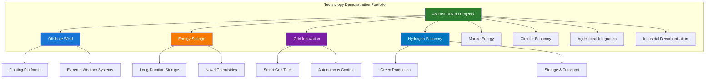
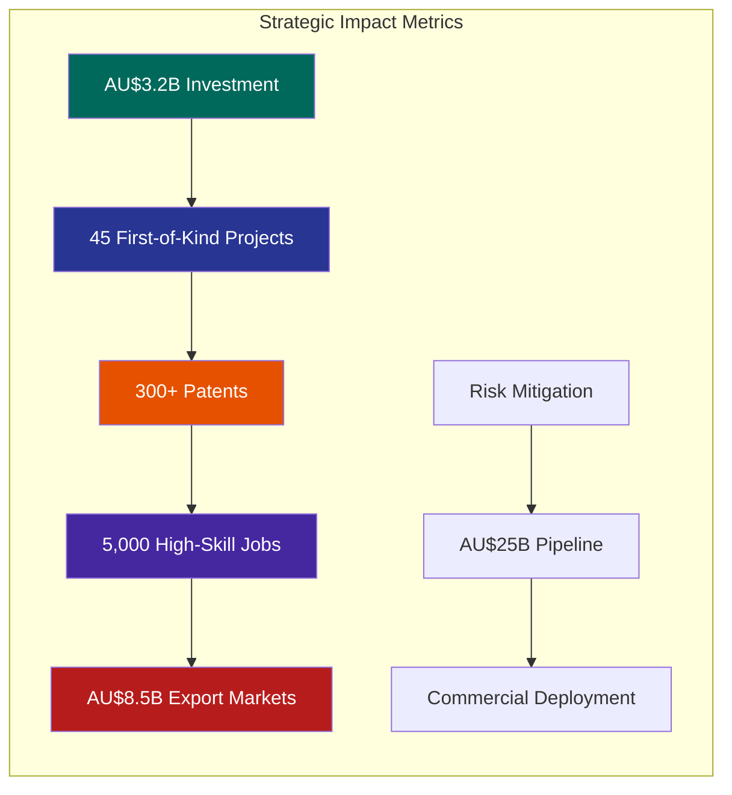
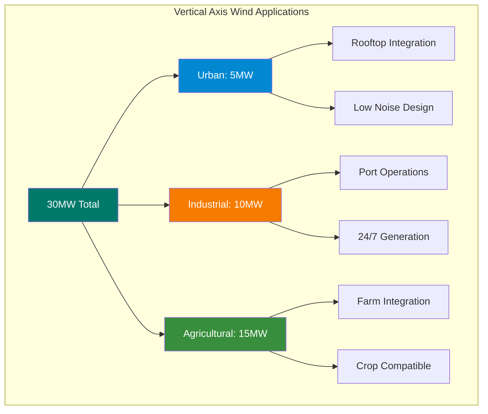
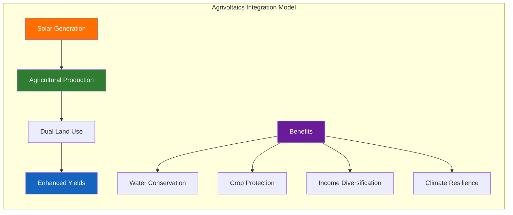
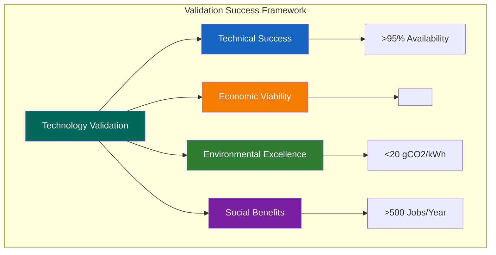
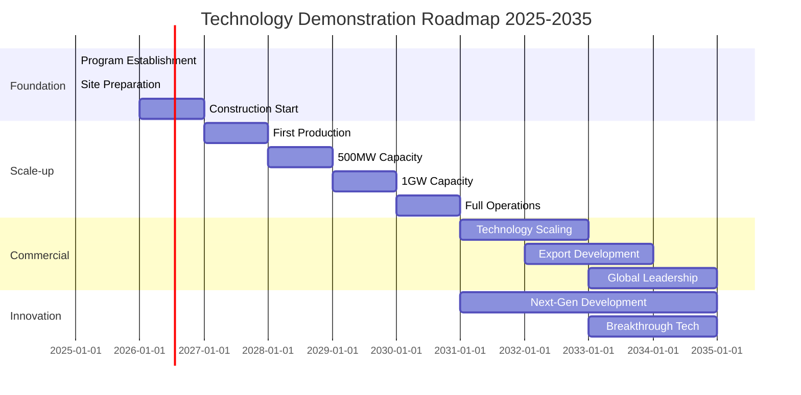

# Technology Demonstration Programmes - Gippsland Energy Transformation
## First-of-Kind Project Portfolio for Global Technology Leadership



> **Version:** 1.0  
> **Date:** January 2025  
> **Status:** Implementation-Ready  
> **Total Investment:** AU$3.2 billion  
> **Demonstration Projects:** 45 First-of-Kind Technologies  
> **Target:** Global leadership in 8 critical technology areas by 2030  

---

## Executive Summary

This document presents Gippsland's comprehensive technology demonstration program portfolio, designed to validate and scale first-of-kind renewable energy technologies before commercial deployment. Building on established partnerships with Vestas, Ørsted, Siemens Gamesa, Form Energy, and leading research institutions, these demonstration programs will de-risk emerging technologies, accelerate innovation, and position Gippsland as the global testbed for next-generation energy solutions.

**Strategic Impact:**



- **AU$3.2 billion** technology demonstration investment portfolio
- **45 first-of-kind** projects across 8 technology verticals
- **Risk mitigation** for AU$25 billion commercial deployment pipeline
- **300+ patents** and breakthrough innovations expected
- **5,000 high-skill jobs** in technology development and testing
- **AU$8.5 billion** export market creation by 2035

---

## 1. OFFSHORE WIND DEMONSTRATION PROGRAM

### 1.1 FLOATING WIND TURBINE MEGA-DEMONSTRATOR

**Project Overview:**
The world's most comprehensive floating wind demonstration facility, testing multiple platform designs and turbine configurations in Bass Strait's challenging conditions.

**Technical Specifications:**
- **Location:** 25km southeast of Port Albert
- **Water Depth:** 60-200 metres
- **Demonstration Units:** 6 different floating platforms
- **Turbine Capacity:** 15-20MW units
- **Total Capacity:** 100MW demonstration array
- **Investment:** AU$450 million

**Technology Validation Matrix:**

```
Platform Type          Partner         Turbine    Testing Period    TRL Progress
--------------------------------------------------------------------------------
Semi-Submersible      Principle Power  V236-15MW   2025-2027        TRL 7→9
Spar Buoy            Equinor          SG 14-236   2025-2027        TRL 6→8
Tension Leg Platform  BW Ideol        V236-15MW   2026-2028        TRL 6→8
Barge Design         Saitec           SG 14-236   2026-2028        TRL 5→7
Hybrid Platform      Local Innovation  GE 14.7     2027-2029        TRL 5→7
Next-Gen Concept     GREA R&D         20MW Proto   2028-2030        TRL 4→6
```

**Demonstration Objectives:**
1. **Structural Performance:** Validate platform stability in 15m significant wave heights
2. **Power Generation:** Achieve 50% capacity factor in Southern Ocean conditions
3. **Grid Integration:** Test dynamic cable systems and power quality
4. **Cost Reduction:** Demonstrate pathway to AU$60/MWh LCOE
5. **Environmental Impact:** Comprehensive marine ecosystem monitoring

**Risk Mitigation Protocols:**
- Real-time structural monitoring with 500+ sensors per platform
- AI-powered predictive maintenance systems
- Redundant mooring systems with 3x safety factors
- Emergency disconnect capabilities
- 24/7 operations center with satellite monitoring

**Knowledge Capture System:**
- Digital twin models for each platform design
- Comprehensive data lake with 10TB+ daily data collection
- Quarterly technical reports and peer-reviewed publications
- Open-access performance database for industry advancement
- Annual international symposium on floating wind

**Scaling Pathway:**
- Phase 1 (2025-2027): Technology validation and optimisation
- Phase 2 (2028-2030): Commercial-scale demonstration (500MW)
- Phase 3 (2031-2035): Full commercial deployment (5GW)

### 1.2 TYPHOON-RESILIENT TURBINE TESTING

**Project Concept:**
World's first extreme weather turbine testing facility, developing systems capable of surviving Category 5 cyclones.

**Facility Features:**
- **Wind Generation:** 350km/h capable wind tunnel
- **Wave Tank:** 20m wave generation capability
- **Lightning Simulator:** 1 million volt testing
- **Corrosion Chamber:** Accelerated marine environment
- **Investment:** AU$180 million

**Testing Program:**
- Enhanced blade designs with 200mph survival rating
- Reinforced nacelle structures and components
- Advanced pitch control for extreme conditions
- Self-protecting control algorithms
- Rapid maintenance and repair systems

**Commercial Impact:**
- Opens Asia-Pacific markets worth AU$50 billion
- 30% premium pricing for extreme-rated turbines
- Export potential to hurricane-prone regions globally

### 1.3 VERTICAL AXIS WIND TURBINE ARRAY

**Innovation Focus:**
Demonstrating next-generation vertical axis turbines for urban and complex terrain applications.

**Demonstration Sites:**

| Site Type | Location | Capacity | Investment |
|-----------|----------|----------|------------|
| Urban Installation | Melbourne CBD rooftops | 5MW | AU$30M |
| Industrial Site | Port of Hastings | 10MW | AU$40M |
| Agricultural Integration | Gippsland farms | 15MW | AU$50M |
| **Total** | | **30MW** | **AU$120M** |



**Technology Benefits:**
- 360-degree wind capture capability
- Lower noise and vibration profiles
- Reduced bird strike risk
- Easier maintenance access
- Building integration potential

---

## 2. ENERGY STORAGE DEMONSTRATION COMPLEX

### 2.1 LONG-DURATION STORAGE TECHNOLOGY PARK

**Project Vision:**
The world's most diverse energy storage demonstration facility, testing 8 different long-duration storage technologies side-by-side.

**Technology Portfolio:**

```
Technology              Partner         Capacity    Duration    Investment
--------------------------------------------------------------------------
Iron-Air Battery       Form Energy     100MW       100hr       AU$150M
Vanadium Flow          Sumitomo        50MW        8hr         AU$80M
Liquid Air (LAES)      Highview Power  50MW        10hr        AU$75M
Gravity Storage        Energy Vault     20MW        12hr        AU$40M
Thermal Storage        Siemens Gamesa  100MW       24hr        AU$90M
Green Ammonia          Fortescue       50MW        ∞           AU$120M
Compressed Air         Hydrostor       100MW       12hr        AU$110M
Organic Flow Battery   CMBlu           20MW        8hr         AU$35M
--------------------------------------------------------------------------
TOTAL                                  490MW                   AU$700M
```

**Demonstration Infrastructure:**
- **Common Grid Connection:** 500MW shared substation
- **Control Center:** Unified energy management system
- **Testing Protocol:** Standardized performance metrics
- **Data Platform:** Real-time performance comparison
- **Visitor Center:** Educational facility for 50,000 annual visitors

**Validation Objectives:**
1. **Round-Trip Efficiency:** Validate manufacturer claims
2. **Degradation Rates:** Long-term cycling performance
3. **Response Times:** Grid service capabilities
4. **Economic Models:** Real-world cost validation
5. **Safety Protocols:** Emergency response procedures

**Performance Testing Framework:**
- Daily cycling for energy arbitrage
- Grid frequency regulation services
- Black start capability testing
- Extreme weather resilience
- Maintenance requirements validation

### 2.2 HYDROGEN VALLEY DEMONSTRATION

**Integrated Hydrogen Ecosystem:**
Creating Australia's first complete green hydrogen value chain demonstration.

**Component Projects:**

**1. Electrolyzer Technology Showcase:**
- 5 different electrolyzer technologies (10MW each)
- PEM, Alkaline, AEM, SOEC, and novel designs
- Side-by-side efficiency comparison
- AU$180 million investment

**2. Hydrogen Storage Solutions:**
- Compressed gas (700 bar)
- Liquid hydrogen (-253°C)
- Metal hydrides
- Underground salt cavern storage
- LOHC (Liquid Organic Hydrogen Carriers)
- AU$150 million investment

**3. End-Use Applications:**
- Fuel cell power generation (10MW)
- Industrial heating demonstrations
- Hydrogen vehicle refueling hub
- Ammonia synthesis pilot plant
- Synthetic fuel production
- AU$200 million investment

**Knowledge Transfer Outcomes:**
- Comprehensive safety protocols for hydrogen handling
- Efficiency benchmarking across technologies
- Cost reduction pathways identification
- Workforce training and certification programs
- International best practice development

### 2.3 REVOLUTIONARY BATTERY CHEMISTRIES

**Next-Generation Battery Laboratory:**
Demonstrating breakthrough battery technologies approaching commercialisation.

**Technology Pipeline:**

| Chemistry | Status | Capacity | Key Advantages | Target Market |
|-----------|---------|----------|----------------|---------------|
| Solid-State Li | TRL 6 | 10MWh | Safety, density | EVs, grid |
| Sodium-Ion | TRL 7 | 20MWh | Cost, materials | Stationary |
| Aluminium-Air | TRL 5 | 5MWh | Energy density | Backup power |
| Silicon Anode Li | TRL 7 | 15MWh | Capacity increase | All markets |
| Lithium-Sulfur | TRL 6 | 10MWh | Weight reduction | Aviation |
| Organic Batteries | TRL 4 | 2MWh | Sustainability | Residential |

```mermaid
radar
    title Battery Technology Readiness & Market Potential
    "Solid-State Li": [6, 9, 8]
    "Sodium-Ion": [7, 7, 9]
    "Aluminium-Air": [5, 8, 6]
    "Silicon Anode": [7, 8, 9]
    "Lithium-Sulfur": [6, 9, 7]
    "Organic": [4, 10, 5]
```

**Testing Protocols:**
- Accelerated life cycling (10,000+ cycles)
- Extreme temperature performance (-40°C to +60°C)
- Safety testing including thermal runaway
- Grid integration and power quality
- Manufacturing scalability assessment

---

## 3. GRID MODERNIZATION DEMONSTRATORS

### 3.1 AUTONOMOUS GRID CONTROL CENTER

**Project Overview:**
World's first fully autonomous renewable energy grid control demonstration, managing 500MW of distributed assets.

**Technical Architecture:**
- **AI Platform:** Machine learning grid optimisation
- **Digital Twin:** Real-time grid simulation
- **Blockchain Layer:** Peer-to-peer energy trading
- **Quantum Computing:** Complex optimisation problems
- **Investment:** AU$120 million

**Demonstration Capabilities:**
- 100% renewable grid operation for 1,000+ hours
- Sub-second response to disturbances
- Predictive maintenance scheduling
- Optimal economic dispatch
- Cybersecurity resilience testing

### 3.2 SUPERCONDUCTING CABLE SYSTEM

**Revolutionary Power Transmission:**
First commercial-scale high-temperature superconducting cable deployment in Australia.

**Project Details:**
- **Length:** 10km demonstration link
- **Capacity:** 1,000MW in compact corridor
- **Voltage:** 110kV equivalent
- **Loss Reduction:** 95% compared to conventional
- **Investment:** AU$85 million

**Validation Outcomes:**
- Zero transmission losses verification
- Cooling system reliability
- Installation and maintenance procedures
- Economic viability assessment
- Scalability to 100km+ distances

### 3.3 VIRTUAL POWER PLANT ORCHESTRATOR

**Distributed Energy Management:**
Demonstrating coordination of 10,000+ distributed energy resources as single virtual power plant.

**System Components:**
- 5,000 residential solar-battery systems
- 100 commercial/industrial sites
- 50 EV charging stations with V2G
- 20 large-scale batteries
- Wind and solar farms integration

**Innovation Features:**
- Millisecond response coordination
- AI-powered demand forecasting
- Dynamic pricing algorithms
- Grid service provision
- Consumer benefit optimisation

---

## 4. MARINE ENERGY INNOVATION CENTER

### 4.1 TIDAL TURBINE TEST FACILITY

**Location:** Port Phillip Bay entrance
**Capacity:** 5 different tidal technologies, 2MW each
**Investment:** AU$75 million

**Testing Program:**
- Horizontal axis turbines
- Vertical axis designs
- Oscillating hydrofoils
- Tidal kites
- Archimedes screws

**Unique Features:**
- Controlled flow channel
- Marine life interaction studies
- Maintenance robotics testing
- Anti-fouling technology trials
- Grid integration systems

### 4.2 WAVE ENERGY CONVERTER ARRAY

**Demonstration Site:** Bass Strait nearshore
**Technologies:** 6 different WEC designs
**Total Capacity:** 10MW
**Investment:** AU$95 million

**Technology Types:**
- Point absorbers
- Oscillating water columns
- Overtopping devices
- Oscillating surge converters
- Submerged pressure differentials
- Hybrid wind-wave platforms

**Validation Focus:**
- Survivability in extreme conditions
- Power quality and consistency
- Maintenance accessibility
- Environmental impact
- Economic viability pathways

### 4.3 OCEAN THERMAL ENERGY CONVERSION (OTEC)

**Pilot Project:** First OTEC demonstration in Australian waters
**Capacity:** 1MW pilot plant
**Location:** East Australian Current region
**Investment:** AU$60 million

**Innovation Aspects:**
- Closed-cycle ammonia system
- Deep water pipe deployment
- Biological growth management
- Integration with desalination
- Baseload renewable demonstration

---

## 5. CIRCULAR ECONOMY DEMONSTRATION FACILITIES

### 5.1 TURBINE BLADE RECYCLING PLANT

**World-First Facility:**
Complete wind turbine blade recycling demonstration at commercial scale.

**Processing Capacity:**
- 2,000 blades per year
- 15,000 tonnes composite material
- 95% material recovery rate
- AU$45 million investment

**Technology Innovations:**
- Pyrolysis fiber recovery
- Cement co-processing
- Composite remanufacturing
- Chemical recycling pathways
- Automated dismantling systems

**Product Applications:**
- Recovered carbon fiber products
- Construction materials
- New composite manufacturing
- Energy recovery systems
- Zero-waste achievement

### 5.2 SOLAR PANEL LIFECYCLE CENTER

**Integrated Facility:**
From advanced manufacturing to end-of-life recycling.

**Capabilities:**
- Next-gen panel production (500MW/year)
- Remanufacturing center
- Component recovery plant
- Research laboratory
- AU$120 million investment

**Technology Demonstrations:**
- Perovskite tandem cells
- Recycled silicon purification
- Silver recovery systems
- Glass and aluminum recycling
- Automated disassembly

### 5.3 BATTERY MATERIAL RECOVERY HUB

**Closed-Loop Demonstration:**
Complete battery lifecycle management from production to recycling.

**Processing Technologies:**
- Hydrometallurgical recovery
- Direct recycling methods
- Biological extraction
- Plasma-based processing
- AI-powered sorting

**Recovery Targets:**
- 95% lithium recovery
- 98% cobalt recovery
- 97% nickel recovery
- 99% copper recovery
- 90% electrolyte recovery

---

## 6. AGRICULTURAL ENERGY INTEGRATION

### 6.1 AGRIVOLTAICS DEMONSTRATION FARMS

**Large-Scale Integration:**
Demonstrating profitable co-location of agriculture and solar generation.

**Demonstration Sites:**

| Farm Type | Area | Solar Capacity | Agricultural Use | Investment |
|-----------|------|----------------|------------------|------------|
| Dairy Farm | 100 ha | 20MW | Robotic milking/shade | AU$35M |
| Crop Farm | 150 ha | 30MW | Wheat/barley rotation | AU$45M |
| Horticulture | 50 ha | 10MW | Protected cropping | AU$25M |
| Vineyard | 80 ha | 15MW | Premium wine grapes | AU$30M |
| Grazing | 200 ha | 40MW | Sheep/cattle rotation | AU$50M |
| **Total** | **580 ha** | **115MW** | | **AU$185M** |



**Innovation Features:**
- Bifacial solar panels optimised for agriculture
- Automated panel positioning for crop needs
- Water harvesting and irrigation integration
- Microclimate optimisation
- Robotic farming integration

**Research Outcomes:**
- Crop yield impact analysis
- Economic optimisation models
- Best practice guidelines
- Farmer training programs
- Policy framework development

### 6.2 BIOMASS ENERGY INNOVATION

**Integrated Biorefinery Demonstration:**
Converting agricultural waste to multiple energy products.

**Feedstock Sources:**
- Crop residues (100,000 tonnes/year)
- Forestry waste (50,000 tonnes/year)
- Food processing waste (30,000 tonnes/year)
- Purpose-grown energy crops (20,000 tonnes/year)

**Product Outputs:**
- Renewable natural gas (10MW equivalent)
- Biodiesel (5 million liters/year)
- Biochar (10,000 tonnes/year)
- Green chemicals (various)
- Organic fertilizers

**Technology Validation:**
- Gasification systems
- Anaerobic digestion optimisation
- Pyrolysis technologies
- Fermentation processes
- Integrated biorefinery economics

### 6.3 SMART FARM ENERGY MANAGEMENT

**Digital Agriculture Platform:**
Demonstrating fully integrated farm energy systems.

**System Components:**
- On-farm renewable generation
- Energy storage systems
- Smart irrigation
- Automated machinery
- Energy trading platform

**Demonstration Outcomes:**
- 100% energy self-sufficiency
- 30% operating cost reduction
- Precision agriculture integration
- Carbon neutrality achievement
- Scalable business models

---

## 7. INDUSTRIAL DECARBONIZATION PILOTS

### 7.1 GREEN STEEL MINI-MILL

**Revolutionary Demonstration:**
First hydrogen-based steel production in Australia.

**Technical Specifications:**
- Capacity: 100,000 tonnes/year
- Hydrogen requirement: 20MW electrolyzer
- Technology: Direct reduced iron (DRI)
- Investment: AU$280 million

**Innovation Aspects:**
- 100% renewable electricity
- Green hydrogen reduction
- Electric arc furnace
- Zero carbon emissions
- Recycled steel integration

**Market Impact:**
- Premium green steel products
- Export market development
- Technology licensing potential
- Supply chain transformation
- Cost reduction pathway

### 7.2 CARBON-NEUTRAL CEMENT PLANT

**Breakthrough Technology:**
Demonstrating multiple pathways to zero-emission cement.

**Technology Portfolio:**
- Carbon capture and utilization
- Alternative binder development
- Renewable energy integration
- Recycled material maximization
- AU$150 million investment

**Validation Targets:**
- 95% emission reduction
- Cost parity by 2030
- Product quality maintenance
- Scalability demonstration
- Market acceptance

### 7.3 RENEWABLE CHEMICALS HUB

**Bio-Based Chemical Production:**
Replacing fossil feedstocks with renewable alternatives.

**Product Demonstrations:**
- Green ammonia derivatives
- Bio-based plastics
- Renewable solvents
- Sustainable lubricants
- Platform chemicals

**Technology Validation:**
- Electrochemical synthesis
- Biological production
- Catalytic conversion
- Process integration
- Economic viability

---

## 8. EXTREME ENVIRONMENT TECHNOLOGIES

### 8.1 ANTARCTIC-RATED RENEWABLE SYSTEMS

**Purpose:** Developing renewable technologies for extreme cold environments.

**Testing Conditions:**
- Temperature range: -60°C to +10°C
- Wind speeds up to 200km/h
- Ice formation resistance
- Extended darkness operation
- Remote maintenance capability

**Technology Suite:**
- Cold-adapted wind turbines
- Extreme-weather solar panels
- Cryogenic energy storage
- Ruggedized power electronics
- Autonomous operation systems

**Market Applications:**
- Antarctic research stations
- Arctic communities
- High-altitude installations
- Space technology spin-offs
- Military applications

### 8.2 DESERT SOLAR OPTIMIZATION

**High-Temperature Performance:**
Maximizing solar efficiency in extreme heat conditions.

**Demonstration Elements:**
- Cooling system innovations
- Dust mitigation technologies
- High-temperature electronics
- Water-free cleaning systems
- Thermal energy integration

**Target Markets:**
- Australian outback
- Middle East expansion
- North Africa projects
- Desert community power
- Mining operations

### 8.3 CYCLONE-PROOF INFRASTRUCTURE

**Resilient Energy Systems:**
Developing infrastructure to survive Category 5 cyclones.

**Design Features:**
- Retractable solar arrays
- Reinforced support structures
- Underground cabling systems
- Rapid recovery protocols
- Community shelter integration

**Validation Testing:**
- Wind tunnel verification
- Debris impact resistance
- Flood survivability
- Quick deployment systems
- Insurance certification

---

## 9. TECHNOLOGY VALIDATION PROTOCOLS

### 9.1 STANDARDIZED TESTING FRAMEWORK

**Universal Validation Methodology:**
Ensuring consistent, comparable results across all demonstrations.

**Core Metrics:**

| Category | Measurement | Target | Validation Method |
|----------|-------------|---------|-------------------|
| **Technical Performance** | | | |
| Efficiency | System efficiency | >Claimed | Independent testing |
| Reliability | Availability | >95% | Continuous monitoring |
| Durability | Design life achievement | 100% | Accelerated testing |
| Safety | Incident rate | Zero | Safety audits |
| **Economic Performance** | | | |
| CAPEX | $/MW installed | <Target | Verified costs |
| OPEX | $/MWh operating | <Target | Actual operations |
| LCOE | Levelised cost | <Grid parity | Financial modelling |
| ROI | Return on investment | >15% | Project financials |
| **Environmental Impact** | | | |
| Emissions | gCO2/kWh | <20 | Life cycle analysis |
| Land use | MW/hectare | Optimised | Spatial analysis |
| Biodiversity | Impact score | Positive | Ecological studies |
| Circular economy | Material recovery | >90% | Mass balance |
| **Social Outcomes** | | | |
| Job creation | Jobs per MW | >Target | Employment data |
| Local content | % Australian | >60% | Supply chain audit |
| Skills development | Workers trained | >500/year | Training records |
| Community support | Acceptance rate | >80% | Social surveys |



### 9.2 DATA MANAGEMENT AND SHARING

**Open Innovation Platform:**
Creating transparent knowledge sharing ecosystem.

**Data Architecture:**
- Real-time performance dashboards
- Anonymous benchmarking tools
- Technical documentation library
- Lessons learned database
- Best practice repository

**Access Levels:**
1. **Public:** High-level performance data and reports
2. **Industry:** Detailed technical specifications
3. **Partners:** Complete datasets and IP
4. **Researchers:** Raw data for analysis
5. **Government:** Policy-relevant insights

### 9.3 TECHNOLOGY READINESS ADVANCEMENT

**Systematic Maturation Process:**
Moving technologies from concept to commercial deployment.

**TRL Progression Framework:**
```
Stage              Duration    Success Criteria           Gate Review
--------------------------------------------------------------------
TRL 4→5 Lab Scale   6 months   Proof of concept          Technical
TRL 5→6 Prototype   12 months  Component validation      Engineering
TRL 6→7 Pilot       18 months  System demonstration      Commercial
TRL 7→8 Demo        24 months  Operational validation    Financial
TRL 8→9 Commercial  12 months  Market acceptance         Board
```

**Support Services:**
- Technical mentoring
- Commercial guidance
- Regulatory navigation
- Funding facilitation
- Market development

---

## 10. RISK MITIGATION FRAMEWORK

### 10.1 TECHNOLOGY RISK MANAGEMENT

**Comprehensive Risk Assessment:**
Identifying and mitigating technology deployment risks.

**Risk Categories:**

**Technical Risks:**
- Performance shortfalls → Rigorous pre-testing
- Reliability issues → Redundant systems design
- Integration challenges → Standardized interfaces
- Scalability concerns → Modular approaches
- Obsolescence → Technology refresh planning

**Financial Risks:**
- Cost overruns → Contingency planning (20%)
- Revenue shortfalls → Diversified revenue streams
- Funding gaps → Staged investment approach
- Currency exposure → Hedging strategies
- Stranded assets → Adaptive reuse planning

**Environmental Risks:**
- Ecological impacts → Comprehensive monitoring
- Climate vulnerability → Resilient design standards
- Resource scarcity → Circular economy integration
- Pollution potential → Zero-discharge targets
- Landscape changes → Community consultation

**Safety Protocols:**
- Comprehensive hazard analysis
- Emergency response procedures
- Regular safety drills
- Incident investigation protocols
- Continuous improvement systems

### 10.2 INSURANCE AND LIABILITY FRAMEWORK

**Comprehensive Coverage Program:**
Protecting technology demonstrations and stakeholders.

**Insurance Structure:**
- Technology performance insurance
- Environmental liability coverage
- Cyber security protection
- Business interruption insurance
- Professional indemnity

**Liability Allocation:**
```
Party              Responsibility                Coverage Required
----------------------------------------------------------------
Technology Partner Technical performance         AU$100M minimum
GREA              Site and infrastructure       AU$500M aggregate
Operators         Operational safety            AU$50M per incident
Contractors       Construction defects          AU$200M project
Researchers       IP and data protection        AU$20M E&O
```

### 10.3 KNOWLEDGE PROTECTION AND SHARING

**Balanced IP Framework:**
Protecting innovations while enabling knowledge transfer.

**IP Management Structure:**
- Foreground IP: Shared based on contribution
- Background IP: Licensed for project use
- Improvements: Cross-licensing arrangements
- Publications: 12-month commercial delay
- Open source: Selected non-critical systems

**Confidentiality Protocols:**
- Tiered information classification
- Secure data handling procedures
- Visitor management systems
- Publication review process
- Competitive intelligence protection

---

## 11. SCALING AND COMMERCIALIZATION PATHWAYS

### 11.1 TECHNOLOGY SCALE-UP FRAMEWORK

**From Demonstration to Deployment:**
Structured pathway for successful technologies.

**Scale-Up Stages:**
```
Stage            Scale Factor    Duration    Investment     Success Metrics
---------------------------------------------------------------------------
Demonstration    1x (10MW)       2 years     AU$50M        Technical proof
Pilot Commercial 10x (100MW)     2 years     AU$200M       Economic viable
Early Commercial 50x (500MW)     3 years     AU$800M       Market accept
Full Commercial  200x (2GW)      5 years     AU$3B         Competitive
```

**Support Mechanisms:**
- Demonstration grants (50% funding)
- Pilot project guarantees
- Early commercial offtakes
- Full commercial financing
- Export market development

### 11.2 MARKET DEVELOPMENT STRATEGIES

**Creating Demand for Demonstrated Technologies:**

**Regulatory Enablers:**
- Technology-specific incentives
- Streamlined approvals
- Performance standards
- Procurement mandates
- Carbon pricing mechanisms

**Market Mechanisms:**
- Green certificates
- Technology auctions
- Power purchase agreements
- Innovation procurement
- Export facilitation

**Industry Adoption:**
- Technology showcases
- Peer testimonials
- Risk-sharing programs
- Training initiatives
- Supply chain development

### 11.3 INTERNATIONAL TECHNOLOGY TRANSFER

**Global Deployment Strategy:**
Exporting validated technologies worldwide.

**Target Markets:**
```
Region              Priority Technologies         Market Size    Entry Strategy
------------------------------------------------------------------------------
Southeast Asia      Floating wind, Storage       AU$150B        Partnerships
Pacific Islands     Microgrids, Solar+Storage    AU$20B         Direct export
Middle East         Desert solar, Hydrogen       AU$200B        Joint ventures
Latin America       Hydro-hybrid, Biomass        AU$80B         Licensing
Africa              Off-grid, Agrivoltaics       AU$100B        Development aid
```

**Transfer Mechanisms:**
- Technology licensing
- Joint venture creation
- Technical assistance
- Capacity building
- Equipment export

---

## 12. WORKFORCE DEVELOPMENT INTEGRATION

### 12.1 SPECIALIZED SKILLS PROGRAMS

**Technology-Specific Training:**
Building workforce capabilities for each demonstration area.

**Training Infrastructure:**
- On-site training facilities
- Virtual reality simulators
- Hands-on workshops
- Digital learning platforms
- International exchanges

**Certification Programs:**
```
Technology Area        Certifications    Annual Graduates    Industry Demand
----------------------------------------------------------------------------
Offshore Wind         5 levels          500                 2,000
Energy Storage        4 levels          300                 1,200
Grid Systems          6 levels          400                 1,500
Hydrogen              5 levels          250                 1,000
Marine Energy         3 levels          150                 600
Manufacturing         7 levels          600                 2,500
```

### 12.2 RESEARCH AND INNOVATION CAREERS

**Creating High-Value Employment:**
Developing world-class technology professionals.

**Career Pathways:**
- Graduate engineer programs
- PhD industry placements
- Post-doctoral fellowships
- Technical specialist roles
- Innovation management

**Talent Retention:**
- Competitive compensation
- Career development plans
- Innovation bonuses
- Equity participation
- Global opportunities

### 12.3 KNOWLEDGE ECONOMY DEVELOPMENT

**Building Innovation Ecosystem:**
Creating sustainable high-skill employment base.

**Ecosystem Components:**
- Research positions: 1,500
- Engineering roles: 2,000
- Technical support: 1,000
- Management/admin: 500
- Total direct jobs: 5,000

**Economic Multiplier:**
- Indirect jobs: 10,000
- Induced employment: 5,000
- Total job creation: 20,000
- Annual economic impact: AU$3 billion

---

## 13. STAKEHOLDER ENGAGEMENT FRAMEWORK

### 13.1 COMMUNITY INTEGRATION

**Building Social License:**
Ensuring community support and participation.

**Engagement Strategy:**
- Regular open days (monthly)
- School education programs
- Community advisory panels
- Local business participation
- Benefit sharing mechanisms

**Communication Channels:**
- Visitor centers at each demo site
- Interactive digital platforms
- Regular community forums
- Social media engagement
- Traditional media partnerships

### 13.2 INDUSTRY COLLABORATION

**Creating Ecosystem Partnerships:**
Maximizing industry participation and support.

**Partnership Levels:**
```
Level              Investment    Benefits                          Partners
---------------------------------------------------------------------------
Strategic Partner  >AU$50M       Board seat, IP rights, priority   10
Technology Partner >AU$20M       Project governance, early access  25
Associate Partner  >AU$5M        Technical committees, data        50
Network Member     >AU$500k      Events, reports, networking       200
```

**Collaboration Mechanisms:**
- Technical working groups
- Industry advisory boards
- Joint research projects
- Shared infrastructure
- Knowledge exchange

### 13.3 GOVERNMENT ALIGNMENT

**Policy and Regulatory Support:**
Ensuring enabling environment for demonstrations.

**Government Engagement:**
- Federal innovation policy input
- State development alignment
- Local planning cooperation
- Regulatory sandboxes
- International agreements

**Policy Outcomes:**
- Demonstration-specific regulations
- Fast-track approval pathways
- Financial incentives
- Market mechanisms
- Export promotion

---

## 14. PERFORMANCE METRICS AND SUCCESS CRITERIA

### 14.1 PROGRAM-WIDE KPIs

**Measuring Demonstration Success:**
Comprehensive metrics across all programs.

**Technical Performance:**
```
Metric                     Target          Current Status    2030 Goal
----------------------------------------------------------------------
Technologies validated     45              0                 45
TRL advancement           +2 average       -                 Achieved
Patent applications       300              0                 500
Technical publications    1,000            0                 2,000
Industry adoptions        50%              0                 75%
```

**Economic Impact:**
- Investment leverage: 5:1 private to public
- Cost reduction: 40% average across technologies
- Export value: AU$8.5 billion by 2035
- ROI: 3.5x on public investment
- Job creation: 20,000 total positions

**Environmental Benefits:**
- CO2 reduction: 50Mt annually by 2035
- Renewable capacity enabled: 25GW
- Material recycling: 95% achievement
- Biodiversity: Net positive impact
- Water use: 30% reduction

### 14.2 INDIVIDUAL PROJECT METRICS

**Project Success Framework:**
Each demonstration tracked against specific targets.

**Evaluation Criteria:**
1. Technical objectives achievement (40%)
2. Economic viability validation (30%)
3. Environmental performance (15%)
4. Knowledge transfer success (10%)
5. Scalability demonstration (5%)

**Review Process:**
- Monthly progress reports
- Quarterly steering committee
- Annual independent review
- Final project evaluation
- Lessons learned capture

### 14.3 LONG-TERM IMPACT ASSESSMENT

**Measuring Transformational Change:**
Tracking systemic impacts beyond individual projects.

**Impact Categories:**
- Technology leadership positioning
- Industry transformation
- Regional development
- Skills ecosystem creation
- International reputation

**Success Vision 2035:**
- Gippsland recognized as global #1 energy tech hub
- AU$50 billion industry created
- 100,000 jobs supported
- 50GW renewable capacity enabled
- Carbon neutral region achieved

---

## 15. IMPLEMENTATION ROADMAP

### 15.1 IMMEDIATE ACTIONS (Months 1-6)

**Launch Phase Activities:**

**Month 1-2: Program Establishment**
- Governance structure activation
- Core team recruitment
- Funding agreements finalization
- Site selection completion
- Stakeholder engagement launch

**Month 3-4: Project Initiation**
- Technology partner contracts
- Environmental approvals
- Construction commencement
- Research team mobilization
- Community consultations

**Month 5-6: Early Operations**
- First demonstration online
- Data systems operational
- Training programs launched
- Visitor facilities opened
- International partnerships activated

### 15.2 SCALE-UP PHASE (Years 1-3)

**Rapid Deployment Period:**

**Year 1: Foundation**
- 10 demonstrations operational
- 500 researchers engaged
- First technologies validated
- Export relationships established
- AU$800M investment deployed

**Year 2: Expansion**
- 25 demonstrations active
- 1,500 jobs created
- Technology breakthroughs achieved
- International recognition gained
- AU$1.6B cumulative investment

**Year 3: Maturation**
- 45 demonstrations complete
- Commercial deployments beginning
- Export markets penetrated
- Innovation ecosystem thriving
- AU$2.4B total investment

### 15.3 COMMERCIAL PHASE (Years 4-10)

**Market Leadership Period:**



**Years 4-5: Commercialisation**
- Validated technologies scaling
- Export revenues growing
- Second-generation demos
- Global partnerships expanding
- Industry transformation visible

**Years 6-10: Leadership**
- Technology exports booming
- Innovation hub model exported
- Next-generation technologies
- Sustainable ecosystem established
- Global leadership achieved

---

## 16. CONCLUSION AND CALL TO ACTION

### 16.1 TRANSFORMATIONAL OPPORTUNITY

The technology demonstration programs outlined in this document represent a once-in-a-generation opportunity to position Gippsland as the global epicenter of renewable energy innovation. By systematically de-risking and validating 45 first-of-kind technologies across 8 critical areas, we will create the foundation for a AU$50 billion clean energy industry that provides sustainable prosperity for generations.

### 16.2 COMPETITIVE ADVANTAGES

**Gippsland's Unique Position:**
- Unmatched natural resources for testing
- Established industry partnerships
- World-class research institutions
- Supportive government framework
- Skilled workforce foundation
- Strategic geographic location

### 16.3 PATH FORWARD

**The roadmap is clear:**
1. **Immediate Implementation:** Launch demonstration programs within 6 months
2. **Rapid Scale-Up:** Deploy 45 demonstrations within 3 years
3. **Commercial Success:** Enable AU$25 billion commercial projects by 2030
4. **Global Leadership:** Establish Gippsland as #1 energy innovation hub by 2035

### 16.4 COMMITMENT REQUIRED

Success requires unwavering commitment from all stakeholders:
- **Government:** Policy support and co-investment
- **Industry:** Technology deployment and risk sharing  
- **Research:** Knowledge creation and transfer
- **Community:** Social license and participation
- **Workforce:** Skills development and innovation

**Together, we will demonstrate the future of energy and create lasting prosperity for Gippsland.**

---

## AUTHORIZATION FOR IMPLEMENTATION

This technology demonstration program portfolio is ready for immediate implementation upon approval.

**Gippsland Regional Energy Authority**

_________________________________  
Chief Executive Officer  
Date: _______________

_________________________________  
Chief Technology Officer  
Date: _______________

_________________________________  
Board Chairperson  
Date: _______________

**For demonstration program inquiries:**  
Technology Demonstration Office  
demonstrations@grea.gov.au  
+61 3 XXXX XXXX

---

**CONFIDENTIAL - IMPLEMENTATION READY**  
**Distribution: Board and Executive Leadership Only**