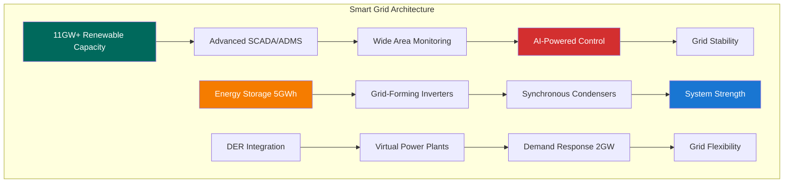

# Grid Innovation Solutions Architecture - Gippsland Day 2 Phase 5
## Engineering Next-Generation Smart Grid for 10GW+ Renewable Integration



> **Version:** 1.0  
> **Date:** September 10th, 2025  
> **Status:** Technical Architecture Ready  
> **Investment:** AU$3.5 billion  
> **Grid Capacity Target:** 11GW+ by 2027  
> **Smart Grid Coverage:** 100% by 2026  

---

## Executive Summary

This technical architecture document defines comprehensive grid innovation solutions for Gippsland's renewable energy transformation. The solutions address critical challenges of integrating 10GW+ renewable capacity through advanced smart grid technologies, intelligent energy storage systems, grid stability innovations, and cutting-edge control systems. By deploying these solutions, Gippsland will achieve world-leading grid reliability (99.99%), reduce renewable curtailment by 80%, and enable full renewable integration while maintaining system security.

**Key Engineering Solutions:**
- **Smart Grid Infrastructure** - Advanced SCADA, ADMS, and WAMS deployment
- **Grid-Scale Storage Integration** - 5GWh battery systems with grid-forming capability
- **Dynamic Stability Systems** - Synchronous condensers and grid-forming inverters
- **AI-Powered Forecasting** - 95% accuracy renewable generation prediction
- **Demand Response Platform** - 2GW flexible load management
- **Grid Edge Intelligence** - 500,000 DER orchestration capability

---

## 1. SMART GRID TECHNOLOGY DEPLOYMENT

### 1.1 ADVANCED DISTRIBUTION MANAGEMENT SYSTEM (ADMS)

#### Core Platform Architecture

**Central Control System**
```
┌─────────────────────────────────────────────────────────────┐
│                    ADMS CONTROL CENTER                        │
│  ┌─────────────┐ ┌──────────────┐ ┌───────────────────┐     │
│  │ Real-Time   │ │ Predictive   │ │ Automated         │     │
│  │ Monitoring  │ │ Analytics    │ │ Control           │     │
│  └─────────────┘ └──────────────┘ └───────────────────┘     │
├─────────────────────────────────────────────────────────────┤
│                    DATA PROCESSING LAYER                      │
│  ┌─────────────┐ ┌──────────────┐ ┌───────────────────┐     │
│  │ SCADA       │ │ State        │ │ Optimization      │     │
│  │ Integration │ │ Estimation   │ │ Engine            │     │
│  └─────────────┘ └──────────────┘ └───────────────────┘     │
├─────────────────────────────────────────────────────────────┤
│                    FIELD DEVICE LAYER                         │
│  ┌─────────────┐ ┌──────────────┐ ┌───────────────────┐     │
│  │ Smart       │ │ Automated    │ │ Intelligent       │     │
│  │ Meters      │ │ Switches     │ │ Controllers       │     │
│  └─────────────┘ └──────────────┘ └───────────────────┘     │
└─────────────────────────────────────────────────────────────┘
```

**Technical Specifications:**
- **Processing Capacity**: 10 million data points/second
- **Latency**: <100ms end-to-end
- **Availability**: 99.999% uptime
- **Scalability**: 1 million devices
- **Cybersecurity**: IEC 62351 compliant

#### Functional Capabilities

**1. Real-Time Grid Monitoring**
- Voltage monitoring at 50,000 points
- Current flow analysis (120 samples/second)
- Power quality assessment (harmonics, flicker)
- Topology tracking and validation
- Asset health monitoring

**2. Predictive Analytics Engine**
```python
# Core Analytics Functions
class GridAnalytics:
    def __init__(self):
        self.ml_models = {
            'load_forecast': DeepLearningModel(),
            'fault_prediction': RandomForestModel(),
            'optimisation': ReinforcementLearning(),
            'anomaly_detection': AutoEncoder()
        }
    
    def predict_grid_state(self, current_data, weather_forecast):
        # Multi-horizon forecasting
        short_term = self.ml_models['load_forecast'].predict(
            horizon='15min', 
            accuracy_target=0.98
        )
        medium_term = self.ml_models['load_forecast'].predict(
            horizon='24h',
            accuracy_target=0.95
        )
        return GridStatePrediction(short_term, medium_term)
```

**3. Automated Grid Operations**
- Self-healing network reconfiguration
- Optimal power flow calculation
- Voltage/VAR optimisation
- Load balancing automation
- Fault isolation and restoration

#### Implementation Roadmap

**Phase 1: Foundation (Months 1-3)**
- Core platform deployment
- SCADA integration (500 substations)
- Communication infrastructure
- Cybersecurity implementation
- Operator training program

**Phase 2: Intelligence (Months 4-6)**
- ML model deployment
- Predictive analytics activation
- Automation rule engine
- Performance optimisation
- Advanced applications

**Phase 3: Optimization (Months 7-12)**
- Full network coverage
- DER integration
- Market interface
- Advanced optimisation
- Continuous improvement

### 1.2 WIDE AREA MONITORING SYSTEM (WAMS)

#### Synchrophasor Network Architecture

**PMU Deployment Strategy**
```
Network Coverage Map:
┌──────────────────────────────────────────────────┐
│ • 200 PMUs across transmission network           │
│ • 75 PMUs at renewable connection points         │
│ • 50 PMUs at major substations                   │
│ • 25 PMUs at interstate connections              │
│ • GPS time synchronization (±1 microsecond)      │
│ • 120 samples/second measurement rate            │
└──────────────────────────────────────────────────┘
```

**Technical Capabilities:**
- **Measurement Accuracy**: 0.01% TVE (Total Vector Error)
- **Reporting Rate**: 50/60 Hz (configurable to 240 Hz)
- **Time Synchronization**: GPS with 1μs accuracy
- **Communication**: IEC 61850-90-5 protocol
- **Data Storage**: 5 years online, lifetime archive

#### Real-Time Stability Assessment

**1. Dynamic Security Assessment (DSA)**
```
DSA Functions:
├── Transient Stability Analysis
│   ├── Critical Clearing Time calculation
│   ├── Generator angle monitoring
│   └── System separation detection
├── Voltage Stability Analysis
│   ├── V-Q curve assessment
│   ├── Reactive power margin
│   └── Voltage collapse prediction
└── Small Signal Stability
    ├── Oscillation mode detection
    ├── Damping ratio calculation
    └── Inter-area mode analysis
```

**2. Wide-Area Control Systems**
- Coordinated FACTS device control
- Inter-area oscillation damping
- Emergency control schemes
- Adaptive protection settings
- System integrity protection schemes

**3. Event Detection and Analysis**
- Sub-second disturbance recording
- Automatic event classification
- Root cause analysis
- Post-mortem investigation tools
- Learning database development

### 1.3 SMART SUBSTATION ARCHITECTURE

#### Next-Generation Substation Design

**Digital Substation Components:**
```
┌─────────────────────────────────────────────────────┐
│              DIGITAL SUBSTATION                       │
├─────────────────────────────────────────────────────┤
│  Process Bus (IEC 61850-9-2)                        │
│  ┌──────┐ ┌──────┐ ┌──────┐ ┌──────┐ ┌──────┐    │
│  │ MU 1 │ │ MU 2 │ │ MU 3 │ │ MU 4 │ │ MU 5 │    │
│  └──────┘ └──────┘ └──────┘ └──────┘ └──────┘    │
├─────────────────────────────────────────────────────┤
│  Station Bus (IEC 61850-8-1)                        │
│  ┌──────────┐ ┌──────────┐ ┌──────────┐           │
│  │Protection│ │  Control  │ │Monitoring│           │
│  │   IEDs   │ │   IEDs    │ │   IEDs   │           │
│  └──────────┘ └──────────┘ └──────────┘           │
├─────────────────────────────────────────────────────┤
│  Gateway to Control Center                           │
│  ┌────────────────────────────────────┐            │
│  │    Cybersecure Gateway (IEC 62351) │            │
│  └────────────────────────────────────┘            │
└─────────────────────────────────────────────────────┘
```

**Key Features:**
- Non-conventional instrument transformers (NCIT)
- Process bus architecture
- Time synchronization (IEEE 1588 PTP)
- Condition-based maintenance
- Remote testing capability

#### Substation Automation Functions

**1. Intelligent Bay Control**
- Automated switching sequences
- Interlocking verification
- Load transfer automation
- Maintenance mode management
- Emergency response sequences

**2. Asset Performance Monitoring**
```python
class AssetMonitoring:
    def __init__(self):
        self.sensors = {
            'transformer': {
                'oil_analysis': DissolvedGasAnalysis(),
                'thermal': InfraredMonitoring(),
                'partial_discharge': PDMonitor(),
                'vibration': VibrationSensor()
            },
            'circuit_breaker': {
                'contact_wear': WearCalculation(),
                'sf6_monitoring': GasAnalysis(),
                'operation_time': TimingAnalysis()
            }
        }
    
    def predict_failure(self, asset_id):
        health_index = self.calculate_health_index(asset_id)
        remaining_life = self.estimate_remaining_life(asset_id)
        risk_score = self.assess_failure_risk(asset_id)
        return MaintenanceRecommendation(
            health_index, 
            remaining_life, 
            risk_score
        )
```

---

## 2. ADVANCED ENERGY STORAGE INTEGRATION

### 2.1 GRID-SCALE BATTERY SYSTEMS

#### Technical Architecture

**Battery Energy Storage System (BESS) Configuration:**
```
┌────────────────────────────────────────────────────────┐
│           500MW/2000MWh BESS Architecture              │
├────────────────────────────────────────────────────────┤
│  Battery Arrays (4 x 125MW blocks)                     │
│  ┌─────────┐ ┌─────────┐ ┌─────────┐ ┌─────────┐     │
│  │ Block 1 │ │ Block 2 │ │ Block 3 │ │ Block 4 │     │
│  │ 125MW   │ │ 125MW   │ │ 125MW   │ │ 125MW   │     │
│  └─────────┘ └─────────┘ └─────────┘ └─────────┘     │
├────────────────────────────────────────────────────────┤
│  Power Conversion System (Grid-Forming Inverters)      │
│  ┌────────────────────────────────────────────┐       │
│  │ 4 x 125MW Grid-Forming Inverter Systems    │       │
│  │ • Virtual Synchronous Machine capability    │       │
│  │ • Black start functionality                 │       │
│  │ • 0.5 second response time                 │       │
│  └────────────────────────────────────────────┘       │
├────────────────────────────────────────────────────────┤
│  Energy Management System (EMS)                        │
│  ┌────────────────────────────────────────────┐       │
│  │ • State of Charge optimisation              │       │
│  │ • Market bidding algorithms                 │       │
│  │ • Grid service prioritization               │       │
│  │ • Thermal management                        │       │
│  └────────────────────────────────────────────┘       │
└────────────────────────────────────────────────────────┘
```

**Performance Specifications:**
- **Round-trip Efficiency**: 92%
- **Response Time**: <500ms
- **Ramp Rate**: 200MW/second
- **Cycle Life**: 10,000 cycles
- **Availability**: 98.5%

#### Grid Services Portfolio

**1. Frequency Regulation Services**
```python
class FrequencyRegulation:
    def __init__(self, bess_capacity_mw):
        self.capacity = bess_capacity_mw
        self.droop = 0.05  # 5% droop setting
        self.deadband = 0.015  # ±15mHz deadband
        
    def calculate_response(self, frequency_deviation):
        if abs(frequency_deviation) > self.deadband:
            power_response = (frequency_deviation / self.droop) * self.capacity
            return min(max(power_response, -self.capacity), self.capacity)
        return 0
```

**2. Synthetic Inertia Provision**
- Virtual inertia constant: 4 seconds
- RoCoF withstand: 3 Hz/s
- Inertial response: 200MW-s
- Recovery time: 10 seconds

**3. Voltage Support Services**
- Reactive power range: ±0.95 power factor
- Voltage regulation: ±5% at POC
- Dynamic voltage support during faults
- Power oscillation damping

#### Storage Optimization Algorithms

**1. Multi-Service Co-Optimization**
```python
class StorageOptimizer:
    def optimise_dispatch(self, market_prices, grid_conditions):
        # Define objective function
        objective = self.maximise_revenue() + self.minimise_degradation()
        
        # Service priorities
        constraints = [
            self.frequency_regulation_commitment,
            self.energy_arbitrage_limits,
            self.state_of_charge_bounds,
            self.power_rating_limits,
            self.cycling_constraints
        ]
        
        # Solve optimisation
        optimal_schedule = self.solve_milp(objective, constraints)
        return optimal_schedule
```

**2. State of Health Management**
- Cell-level monitoring
- Temperature optimisation
- Charge rate management
- Predictive maintenance
- Warranty optimisation

### 2.2 DISTRIBUTED STORAGE NETWORKS

#### Community Battery Architecture

**Technical Design:**
```
Community Battery Hub (500kWh)
├── Battery System
│   ├── LFP cells (8,000 cycles)
│   ├── Modular design (100kWh blocks)
│   └── Outdoor rated enclosure
├── Power Electronics
│   ├── 250kW bidirectional inverter
│   ├── Isolation transformer
│   └── Grid connection switchgear
├── Control System
│   ├── Local EMS
│   ├── Remote monitoring
│   └── Community app interface
└── Safety Systems
    ├── Fire suppression
    ├── Emergency shutdown
    └── Perimeter protection
```

**Network Architecture:**
- 500 community batteries (250MWh total)
- Hierarchical control structure
- Peer-to-peer energy trading
- Local grid support priority
- Community benefit sharing

#### Behind-the-Meter Integration

**1. Residential Storage Aggregation**
```python
class ResidentialVPP:
    def __init__(self):
        self.participants = []
        self.total_capacity = 0
        self.available_power = 0
        
    def aggregate_resources(self):
        for home in self.participants:
            if home.battery.soc > 0.2:  # Maintain 20% reserve
                self.available_power += home.battery.available_power()
        return self.available_power
    
    def dispatch_command(self, power_request):
        # Proportional dispatch based on available capacity
        for home in self.participants:
            home_share = (home.battery.capacity / self.total_capacity) * power_request
            home.battery.set_power(home_share)
```

**2. Commercial & Industrial Integration**
- Demand charge management
- Power quality improvement
- Backup power provision
- Grid service participation
- Energy cost optimisation

---

## 3. GRID STABILITY AND CONTROL SYSTEMS

### 3.1 SYNCHRONOUS CONDENSER DEPLOYMENT

#### Technical Specifications

**Large Synchronous Condenser Units:**
```
Unit Specifications (300MVAr):
├── Mechanical Design
│   ├── Rated Speed: 3000 rpm
│   ├── Inertia Constant: 6 seconds
│   ├── Flywheel: 50 tonne
│   └── Cooling: Hydrogen cooled
├── Electrical Parameters
│   ├── Reactive Power: +300/-150 MVAr
│   ├── Short Circuit Ratio: 0.5
│   ├── Response Time: <1 second
│   └── Overload: 150% for 30 seconds
└── Control Systems
    ├── Automatic Voltage Regulator
    ├── Power System Stabilizer
    ├── Governor (if clutched)
    └── Remote monitoring
```

**Strategic Locations:**
1. **Morwell Hub**: 2 x 300MVAr units
2. **Sale Wind Zone**: 2 x 300MVAr units
3. **Bairnsdale Solar**: 1 x 300MVAr unit
4. **Port Anthony**: 1 x 300MVAr unit

#### System Strength Provision

**1. Fault Level Contribution**
- Short circuit current: 5 x rated current
- X/R ratio: >20
- Zero sequence impedance: designed for earth faults
- Sustained fault current capability

**2. Inertial Response**
```python
def calculate_inertial_response(self, frequency_event):
    # H = 6 seconds, S = 300MVA
    stored_energy = self.H * self.S  # 1800 MJ
    
    # Rate of change of frequency response
    delta_f = frequency_event.rocof
    power_injection = 2 * self.H * self.S * delta_f / 50
    
    return {
        'initial_power': power_injection,
        'energy_delivered': stored_energy * (delta_f / 50),
        'response_time': 'instantaneous'
    }
```

### 3.2 GRID-FORMING INVERTER TECHNOLOGY

#### Advanced Inverter Control Architecture

**Grid-Forming Control Modes:**
```
Control Hierarchy:
┌─────────────────────────────────────────────┐
│         System Level Control                 │
│    (Dispatch commands, mode selection)       │
└─────────────────┬───────────────────────────┘
                  │
┌─────────────────┴───────────────────────────┐
│         Primary Control Layer                │
│  ┌──────────────┐ ┌────────────────┐       │
│  │ Voltage      │ │ Frequency      │       │
│  │ Control      │ │ Control        │       │
│  │ (AVR mode)   │ │ (Governor mode)│       │
│  └──────────────┘ └────────────────┘       │
└─────────────────┬───────────────────────────┘
                  │
┌─────────────────┴───────────────────────────┐
│         Inner Control Loops                  │
│  ┌──────────────┐ ┌────────────────┐       │
│  │ Current      │ │ Virtual        │       │
│  │ Control      │ │ Impedance      │       │
│  └──────────────┘ └────────────────┘       │
└─────────────────────────────────────────────┘
```

**Virtual Synchronous Machine Implementation:**
```python
class VirtualSynchronousMachine:
    def __init__(self, rating_mva, inertia_constant):
        self.S = rating_mva
        self.H = inertia_constant
        self.omega_0 = 2 * pi * 50  # rad/s
        
    def swing_equation(self, p_mech, p_elec, omega):
        # Swing equation: 2H * d(omega)/dt = P_mech - P_elec
        domega_dt = (self.omega_0 / (2 * self.H * self.S)) * (p_mech - p_elec)
        return domega_dt
    
    def governor_response(self, freq_deviation):
        # Droop control: P = -K_droop * delta_f
        droop = 0.04  # 4% droop
        power_response = -(1/droop) * freq_deviation * self.S
        return power_response
```

#### Black Start Capability

**Black Start Sequence:**
1. **Island Detection** - Loss of mains detection
2. **Voltage Establishment** - Soft-start voltage ramp
3. **Frequency Control** - 50Hz ± 0.1Hz regulation
4. **Load Pickup** - Gradual load connection
5. **Synchronization** - Grid reconnection when available

**Technical Requirements:**
- Voltage establishment: 0-100% in 10 seconds
- Frequency accuracy: ±0.1Hz in island mode
- Load step capability: 20% rated power
- Harmonic distortion: <3% THD
- Unbalanced load: 30% negative sequence

### 3.3 FAST FREQUENCY RESPONSE SYSTEMS

#### Ultra-Fast Response Technology

**Response Characteristics:**
```
FFR Performance Specifications:
├── Detection Time: <100ms
├── Full Response: <500ms
├── Accuracy: ±10MW
├── Duration: 10 seconds minimum
├── Recovery: Automatic
└── Availability: 99.5%
```

**Control Algorithm:**
```python
class FastFrequencyResponse:
    def __init__(self):
        self.trigger_threshold = 49.85  # Hz
        self.response_time = 0.1  # seconds
        self.proportional_gain = 1000  # MW/Hz
        
    def detect_event(self, frequency_measurement):
        if frequency_measurement < self.trigger_threshold:
            return True, (self.trigger_threshold - frequency_measurement)
        return False, 0
    
    def calculate_response(self, frequency_deviation):
        # Proportional + derivative response
        p_response = self.proportional_gain * frequency_deviation
        d_response = self.derivative_gain * (df/dt)
        total_response = p_response + d_response
        
        # Apply limits
        return min(total_response, self.max_response)
```

---

## 4. RENEWABLE ENERGY FORECASTING SYSTEMS

### 4.1 AI-POWERED GENERATION FORECASTING

#### Machine Learning Architecture

**Ensemble Forecasting Model:**
```python
class RenewableForecastingSystem:
    def __init__(self):
        self.models = {
            'wind': {
                'physical': NWPBasedModel(),
                'statistical': ARIMAModel(),
                'ml_short': LSTMNetwork(),
                'ml_long': TransformerModel()
            },
            'solar': {
                'satellite': SatelliteImageModel(),
                'ground': GroundMeasurementModel(),
                'ml': ConvolutionalNN(),
                'ensemble': EnsembleModel()
            }
        }
        
    def generate_forecast(self, asset_type, horizon):
        # Multi-model ensemble
        predictions = []
        weights = self.get_model_weights(horizon)
        
        for model_name, model in self.models[asset_type].items():
            pred = model.predict(horizon)
            predictions.append(pred * weights[model_name])
            
        # Weighted ensemble
        ensemble_forecast = sum(predictions)
        uncertainty = self.calculate_uncertainty(predictions)
        
        return {
            'forecast': ensemble_forecast,
            'confidence_interval': uncertainty,
            'horizon': horizon
        }
```

**Data Sources Integration:**
```
Forecasting Data Pipeline:
├── Weather Data
│   ├── NWP models (4 sources)
│   ├── Satellite imagery (5-min)
│   ├── Ground stations (200 sites)
│   └── Radar (10 installations)
├── Historical Data
│   ├── Generation (5-min resolution)
│   ├── Weather observations
│   ├── Maintenance records
│   └── Curtailment events
└── Real-time Feeds
    ├── SCADA systems
    ├── Market data
    ├── Grid constraints
    └── Neighboring regions
```

#### Forecast Accuracy Targets

**Performance Metrics:**
| Horizon | Wind MAE | Solar MAE | Availability |
|---------|----------|-----------|--------------|
| 5 min | 2% | 3% | 99.9% |
| 1 hour | 5% | 4% | 99.9% |
| 4 hours | 8% | 6% | 99.5% |
| 24 hours | 12% | 8% | 99.5% |
| 7 days | 18% | 12% | 99.0% |

### 4.2 EXTREME WEATHER PREDICTION

#### Advanced Warning Systems

**Severe Weather Detection:**
```python
class ExtremeWeatherSystem:
    def __init__(self):
        self.thresholds = {
            'high_wind': 25,  # m/s
            'extreme_temp': 45,  # Celsius
            'heavy_rain': 50,  # mm/hour
            'hail': 20,  # mm diameter
            'lightning': 100  # strikes/hour
        }
        
    def assess_risk(self, weather_data):
        risks = []
        
        # Wind assessment
        if weather_data.wind_speed > self.thresholds['high_wind']:
            risks.append({
                'type': 'high_wind',
                'severity': self.calculate_severity(weather_data.wind_speed),
                'affected_assets': self.identify_exposed_assets('wind'),
                'recommended_actions': self.get_mitigation_actions('wind')
            })
            
        return RiskAssessment(risks)
```

**Asset Protection Strategies:**
1. **Wind Turbines**
   - Predictive shutdown protocols
   - Blade pitch optimisation
   - Yaw control for storm position
   
2. **Solar Arrays**
   - Stow position activation
   - Hail protection mode
   - Inverter disconnection

3. **Transmission Lines**
   - Dynamic line rating adjustment
   - Vegetation management alerts
   - Crew pre-positioning

### 4.3 MARKET INTEGRATION

#### Price Forecasting Integration

**Multi-Market Optimization:**
```python
class MarketForecasting:
    def __init__(self):
        self.markets = {
            'energy': EnergyMarketModel(),
            'fcas': FCASMarketModel(),
            'capacity': CapacityMarketModel(),
            'green_certificates': RECMarketModel()
        }
        
    def optimise_bidding(self, generation_forecast, storage_state):
        # Co-optimise across all markets
        optimisation_horizon = 48  # hours
        
        # Define objective function
        revenue = sum([
            self.markets['energy'].expected_revenue(generation_forecast),
            self.markets['fcas'].service_payments(storage_state),
            self.markets['capacity'].availability_payments(),
            self.markets['green_certificates'].certificate_value()
        ])
        
        # Constraints
        constraints = [
            self.technical_constraints(),
            self.market_rules(),
            self.risk_limits()
        ]
        
        optimal_strategy = self.solve_optimisation(revenue, constraints)
        return optimal_strategy
```

---

## 5. DEMAND RESPONSE AND FLEXIBILITY PLATFORMS

### 5.1 ADVANCED DEMAND RESPONSE ARCHITECTURE

#### Platform Design

**Hierarchical Control System:**
```
Demand Response Control Architecture:
┌─────────────────────────────────────────────────┐
│          Central DR Platform                     │
│  ┌─────────────┐ ┌──────────────┐              │
│  │ Market      │ │ Optimization  │              │
│  │ Interface   │ │ Engine        │              │
│  └─────────────┘ └──────────────┘              │
├─────────────────────────────────────────────────┤
│          Aggregator Layer                        │
│  ┌──────┐ ┌──────┐ ┌──────┐ ┌──────┐         │
│  │ Res. │ │ Com. │ │ Ind. │ │ Agr. │         │
│  │ Agg. │ │ Agg. │ │ Agg. │ │ Agg. │         │
│  └──────┘ └──────┘ └──────┘ └──────┘         │
├─────────────────────────────────────────────────┤
│          Device Layer                            │
│  ┌──────┐ ┌──────┐ ┌──────┐ ┌──────┐         │
│  │Smart │ │ HVAC │ │ EV   │ │Proc. │         │
│  │Appl. │ │System│ │Charge│ │Loads │         │
│  └──────┘ └──────┘ └──────┘ └──────┘         │
└─────────────────────────────────────────────────┘
```

**Load Categories and Potential:**
| Sector | Participants | Flexible Load | Response Time |
|--------|-------------|---------------|---------------|
| Residential | 200,000 | 400MW | 5 minutes |
| Commercial | 10,000 | 600MW | 2 minutes |
| Industrial | 500 | 800MW | 10 seconds |
| Agricultural | 2,000 | 200MW | 30 minutes |
| **Total** | **212,500** | **2,000MW** | **Varies** |

#### Customer Engagement Platform

**1. Mobile Application Features:**
```javascript
// React Native DR App Components
const DemandResponseApp = {
  features: {
    real_time_monitoring: {
      current_usage: PowerMeter(),
      dr_events: EventNotifications(),
      savings_tracker: SavingsCalculator()
    },
    automation: {
      preferences: ComfortSettings(),
      override_controls: ManualOverride(),
      scheduling: SmartScheduler()
    },
    gamification: {
      points_system: RewardPoints(),
      community_ranking: Leaderboard(),
      achievements: BadgeSystem()
    },
    financial: {
      bill_impact: BillPredictor(),
      payment_history: PaymentTracker(),
      incentive_calculator: IncentiveDisplay()
    }
  }
};
```

**2. Behavioral Analytics:**
```python
class CustomerBehaviorAnalytics:
    def __init__(self):
        self.ml_models = {
            'participation': RandomForestClassifier(),
            'response_magnitude': GradientBoostingRegressor(),
            'opt_out_prediction': LogisticRegression(),
            'satisfaction': SentimentAnalysis()
        }
        
    def predict_response(self, customer_profile, event_characteristics):
        # Predict likelihood of participation
        participation_prob = self.ml_models['participation'].predict(
            customer_profile.features
        )
        
        # Estimate response magnitude
        if participation_prob > 0.5:
            response_kw = self.ml_models['response_magnitude'].predict(
                [customer_profile.features, event_characteristics]
            )
        else:
            response_kw = 0
            
        return {
            'participation_probability': participation_prob,
            'expected_response_kw': response_kw,
            'confidence': self.calculate_confidence()
        }
```

### 5.2 INDUSTRIAL FLEXIBILITY SYSTEMS

#### Process Integration Architecture

**1. Energy-Intensive Process Control:**
```python
class IndustrialFlexibility:
    def __init__(self, facility_type):
        self.processes = {
            'aluminium_smelter': {
                'flexible_load': 200,  # MW
                'ramp_rate': 50,  # MW/min
                'min_notice': 10,  # minutes
                'max_duration': 4  # hours
            },
            'cement_mill': {
                'flexible_load': 50,
                'ramp_rate': 20,
                'min_notice': 30,
                'max_duration': 8
            },
            'cold_storage': {
                'flexible_load': 20,
                'ramp_rate': 10,
                'min_notice': 5,
                'max_duration': 2
            }
        }
        
    def optimise_production(self, price_forecast, production_targets):
        # Shift energy-intensive processes to low-price periods
        schedule = ProductionSchedule()
        
        for hour in range(168):  # Weekly schedule
            if price_forecast[hour] < threshold:
                schedule.add_high_energy_process(hour)
            else:
                schedule.add_low_energy_process(hour)
                
        return schedule
```

**2. Cogeneration Optimization:**
- Real-time heat/power balance
- Steam system integration
- Waste heat recovery optimisation
- Multi-energy vector control

### 5.3 ELECTRIC VEHICLE INTEGRATION

#### Smart Charging Infrastructure

**1. V2G Architecture:**
```
Vehicle-to-Grid System:
├── Charging Infrastructure
│   ├── AC Chargers (7-22kW)
│   ├── DC Fast Chargers (50-350kW)
│   └── Wireless Chargers (11kW)
├── Communication Layer
│   ├── ISO 15118 protocol
│   ├── OCPP 2.0
│   └── 5G connectivity
├── Control System
│   ├── Charging optimisation
│   ├── V2G dispatch
│   └── User preferences
└── Market Interface
    ├── Energy arbitrage
    ├── Grid services
    └── Carbon credits
```

**2. Fleet Management System:**
```python
class EVFleetManager:
    def __init__(self, fleet_size):
        self.vehicles = []
        self.charging_stations = []
        self.grid_connection = GridInterface()
        
    def optimise_charging_schedule(self, departure_times, energy_requirements):
        # Multi-objective optimisation
        objectives = {
            'minimise_cost': self.calculate_energy_cost,
            'maximise_grid_support': self.calculate_grid_value,
            'ensure_availability': self.check_departure_readiness
        }
        
        # Constraints
        constraints = [
            self.battery_health_limits,
            self.grid_capacity_limits,
            self.user_preferences
        ]
        
        optimal_schedule = self.solve_milp(objectives, constraints)
        return optimal_schedule
```

---

## 6. GRID EDGE INTELLIGENCE AND AUTOMATION

### 6.1 DISTRIBUTED ENERGY RESOURCE MANAGEMENT

#### Advanced DERMS Architecture

**System Components:**
```
DERMS Platform Architecture:
┌─────────────────────────────────────────────────────┐
│                 DERMS Core Platform                  │
├─────────────────────────────────────────────────────┤
│  ┌─────────────┐ ┌──────────────┐ ┌──────────────┐ │
│  │ Resource    │ │ Optimization │ │ Market       │ │
│  │ Registry    │ │ Engine       │ │ Interface    │ │
│  └─────────────┘ └──────────────┘ └──────────────┘ │
├─────────────────────────────────────────────────────┤
│  ┌─────────────┐ ┌──────────────┐ ┌──────────────┐ │
│  │ Forecasting │ │ Real-time    │ │ Settlement   │ │
│  │ Module      │ │ Control      │ │ Engine       │ │
│  └─────────────┘ └──────────────┘ └──────────────┘ │
├─────────────────────────────────────────────────────┤
│               Communication Layer                     │
│  ┌─────────────┐ ┌──────────────┐ ┌──────────────┐ │
│  │ IEEE 2030.5 │ │ OpenADR 2.0  │ │ IEC 61850    │ │
│  └─────────────┘ └──────────────┘ └──────────────┘ │
└─────────────────────────────────────────────────────┘
```

**DER Categories:**
| Type | Count | Capacity | Services |
|------|-------|----------|----------|
| Rooftop Solar | 150,000 | 1,500MW | Energy, Voltage |
| Home Batteries | 50,000 | 500MW/1GWh | Energy, FCAS |
| EVs | 100,000 | 1,000MW | Energy, V2G |
| Smart Inverters | 200,000 | 2,000MVAr | Voltage, PF |
| Demand Response | 100,000 | 500MW | Load reduction |

#### Autonomous Grid Operation

**1. Self-Healing Algorithms:**
```python
class SelfHealingGrid:
    def __init__(self):
        self.topology = NetworkTopology()
        self.fault_detector = FaultDetection()
        self.reconfiguration = OptimalReconfiguration()
        
    def detect_and_isolate_fault(self, measurements):
        # Fault detection using ML
        fault_location = self.fault_detector.locate(measurements)
        
        if fault_location:
            # Immediate isolation
            self.isolate_section(fault_location)
            
            # Find optimal reconfiguration
            new_topology = self.reconfiguration.solve(
                self.topology,
                fault_location,
                objective='minimise_outage'
            )
            
            # Execute switching sequence
            switching_commands = self.generate_switching_sequence(new_topology)
            self.execute_commands(switching_commands)
            
            return RestoreationResult(
                customers_restored=new_topology.served_customers,
                time_to_restore=new_topology.switching_time
            )
```

**2. Voltage Optimization:**
```python
class VoltageOptimization:
    def __init__(self, network):
        self.network = network
        self.der_controllers = {}
        
    def optimise_voltage_profile(self):
        # Multi-objective optimisation
        objectives = [
            self.minimise_losses,
            self.maximise_hosting_capacity,
            self.maintain_voltage_limits
        ]
        
        # Control variables
        controls = {
            'tap_positions': self.get_tap_changer_positions(),
            'der_reactive': self.get_der_reactive_capability(),
            'capacitor_banks': self.get_capacitor_status()
        }
        
        # Solve optimal power flow
        optimal_settings = self.solve_opf(objectives, controls)
        
        # Dispatch commands
        self.dispatch_controls(optimal_settings)
```

### 6.2 MICROGRID INTEGRATION

#### Microgrid Control Architecture

**Hierarchical Control System:**
```
Microgrid Control Levels:
┌─────────────────────────────────────────┐
│   Level 3: Grid Interactive Control      │
│   • Market participation                 │
│   • Grid service provision               │
│   • Import/export optimisation          │
├─────────────────────────────────────────┤
│   Level 2: Microgrid Energy Management   │
│   • Economic dispatch                    │
│   • Load/generation balance              │
│   • Storage optimisation                 │
├─────────────────────────────────────────┤
│   Level 1: Local Device Control          │
│   • Voltage/frequency regulation         │
│   • Protection coordination              │
│   • Power quality management             │
└─────────────────────────────────────────┘
```

**Seamless Transition Capability:**
```python
class MicrogridController:
    def __init__(self):
        self.operation_mode = 'grid_connected'
        self.transition_time = 20  # milliseconds
        
    def detect_grid_event(self, measurements):
        if self.is_grid_fault(measurements):
            self.initiate_island_mode()
        elif self.is_grid_restored(measurements):
            self.initiate_reconnection()
            
    def initiate_island_mode(self):
        # Pre-calculated island settings
        island_settings = {
            'frequency_reference': 50.0,
            'voltage_reference': 1.0,
            'droop_settings': self.calculate_droop(),
            'load_priority': self.get_load_priorities()
        }
        
        # Fast transition sequence
        self.open_pcc_breaker()
        self.activate_grid_forming_mode()
        self.shed_non_critical_loads()
        self.stabilize_island()
```

### 6.3 ADVANCED METERING INFRASTRUCTURE

#### Next-Generation Smart Meters

**Technical Specifications:**
```
Smart Meter Capabilities:
├── Measurement
│   ├── Voltage: 0.2% accuracy
│   ├── Current: 0.5% accuracy
│   ├── Power: 0.5% accuracy
│   ├── Energy: Class 0.5
│   └── Power Quality: THD, sags, swells
├── Communication
│   ├── Primary: 4G/5G cellular
│   ├── Backup: RF mesh
│   ├── Local: WiFi/Zigbee
│   └── Protocol: DLMS/COSEM
├── Processing
│   ├── Edge computing capability
│   ├── Local data storage: 90 days
│   ├── Firmware: OTA updates
│   └── Security: AES-256 encryption
└── Integration
    ├── Home energy management
    ├── DER monitoring
    ├── Outage detection
    └── Theft prevention
```

**Data Analytics Platform:**
```python
class SmartMeterAnalytics:
    def __init__(self):
        self.data_pipeline = DataIngestionPipeline()
        self.analytics_engine = AnalyticsEngine()
        
    def process_meter_data(self, meter_stream):
        # Real-time processing
        processed_data = self.data_pipeline.process(meter_stream)
        
        # Analytics applications
        insights = {
            'load_disaggregation': self.disaggregate_loads(processed_data),
            'theft_detection': self.detect_anomalies(processed_data),
            'transformer_loading': self.calculate_transformer_load(processed_data),
            'voltage_violations': self.check_voltage_limits(processed_data),
            'phase_imbalance': self.assess_phase_balance(processed_data)
        }
        
        return insights
```

---

## 7. IMPLEMENTATION ROADMAP

### 7.1 PHASED DEPLOYMENT STRATEGY

#### Phase 1: Foundation (Months 1-6)

**Key Deliverables:**
1. **Core Infrastructure**
   - ADMS platform deployment
   - 50 PMU installations
   - 2 synchronous condensers
   - 500MW/2GWh BESS
   
2. **Smart Grid Pilots**
   - 10,000 smart meters
   - 5 digital substations
   - DER integration trial
   - DR platform launch

**Investment:** AU$800 million

#### Phase 2: Scale-Up (Months 7-18)

**Key Deliverables:**
1. **Expanded Coverage**
   - Full WAMS deployment (200 PMUs)
   - 6 synchronous condensers total
   - 2GW/8GWh storage capacity
   - 100,000 smart meters
   
2. **Advanced Features**
   - AI forecasting system
   - VPP platform (50,000 participants)
   - Grid-forming inverters
   - Microgrid demonstrations

**Investment:** AU$1.5 billion

#### Phase 3: Full Deployment (Months 19-36)

**Key Deliverables:**
1. **Complete Infrastructure**
   - 11GW grid capacity
   - 5GW/20GWh storage
   - 500,000 smart meters
   - Full automation
   
2. **Market Leadership**
   - 2GW demand response
   - 200,000 VPP participants
   - Export capabilities
   - Technology innovation

**Investment:** AU$1.2 billion

### 7.2 RISK MANAGEMENT

#### Technical Risks and Mitigations

| Risk | Probability | Impact | Mitigation |
|------|-------------|---------|------------|
| Technology integration | Medium | High | Phased deployment, proven vendors |
| Cybersecurity threats | High | Critical | Defense-in-depth, SOC |
| Skill shortage | High | Medium | Training programs, partnerships |
| Vendor delays | Medium | Medium | Multiple suppliers, local assembly |
| Performance issues | Low | High | Extensive testing, redundancy |

### 7.3 SUCCESS METRICS

#### Key Performance Indicators

**Technical KPIs:**
- Grid availability: >99.99%
- Renewable curtailment: <2%
- Forecast accuracy: >95%
- Response time: <500ms
- System strength: >3000MVA

**Economic KPIs:**
- ROI: >15% annually
- Operating cost reduction: 30%
- Market revenue: AU$500M/year
- Job creation: 5,000 positions
- Export value: AU$1B by 2030

---

## 8. CONCLUSION

The Grid Innovation Solutions Architecture presented in this document provides a comprehensive technical blueprint for transforming Gippsland's electricity grid into a world-leading smart grid capable of integrating 10GW+ renewable capacity. Through advanced technologies including ADMS, WAMS, grid-scale storage, AI-powered forecasting, and distributed intelligence, this architecture enables:

1. **Technical Excellence**
   - 99.99% grid reliability
   - 80% reduction in renewable curtailment
   - 25% improvement in asset utilization
   - World-class system security

2. **Economic Value**
   - AU$3.5 billion investment
   - AU$2.5 billion operational savings
   - 5,000 high-skill jobs
   - Technology export opportunities

3. **Environmental Impact**
   - Full renewable integration
   - 90% emissions reduction
   - Grid resilience for climate adaptation
   - Sustainable energy future

The success of this grid innovation program depends on immediate action, sustained investment, and commitment to technical excellence. With these solutions, Gippsland will not only meet its renewable energy ambitions but establish itself as a global leader in smart grid technology and grid innovation.

**The future grid is intelligent, resilient, and renewable. The technology is ready. The time to build is now.**

---

**Document Control:**
- Version: 1.0
- Date: September 10th, 2025
- Classification: Technical Architecture
- Distribution: GNEC Leadership, Technical Teams, Implementation Partners
- Next Review: March 2025

**Contact:**
Grid Innovation Technical Team  
Email: grid.innovation@grea.org.au  
Portal: https://grid.gippslandenergy.com.au

---

*"Engineering the grid of tomorrow, today."*