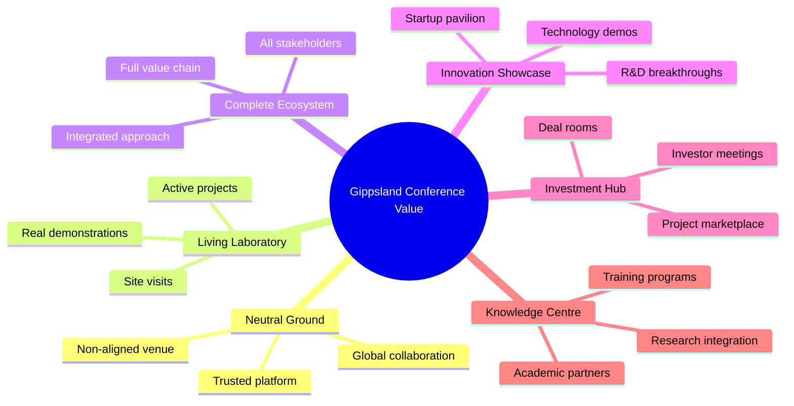

# 🌍 Gippsland Global Renewable Energy Conference Series Strategy
## Establishing the World's Premier Energy Transition Platform

```
                    🏛️ THE DAVOS OF RENEWABLE ENERGY 🌏
    
    ┌─────────────────────────────────────────────────────────────┐
    │               GIPPSLAND GLOBAL ENERGY SUMMIT                │
    │                                                             │
    │  Where Policies are Shaped • Deals are Made • Future Defined│
    │                                                             │
    │  🌏 50+ Countries    👥 10,000 Delegates    💰 AU$50B Deals   │
    │  🏭 15 Conferences   🎤 100 Programs        🎆 Global Hub    │
    │                                                             │
    │  2025 ──────&gt; 2027 ──────&gt; 2030 ──────&gt; LEGACY            │
    │  Launch      Scale       Dominance      Institution         │
    └─────────────────────────────────────────────────────────────┘
```

> **Version:** 1.0  
> **Date:** January 2025  
> **Status:** Strategic Implementation Plan  
> **Economic Impact:** AU$2.5 billion over 10 years  
> **Global Reach:** 50,000+ delegates annually by 2030  
> **Event Portfolio:** 15 major conferences + 100 specialised programmes

```mermaid
graph LR
    A[Local Conference] --&gt; B[Regional Platform]
    B --&gt; C[Global Summit]
    C --&gt; D[World Authority]
    D --&gt; E[Permanent Institution]
    
    A --&gt; F[2025: Launch]
    B --&gt; G[2026: Growth]
    C --&gt; H[2028: Leadership]
    D --&gt; I[2030: Dominance]
    E --&gt; J[Beyond: Legacy]
    
    style C fill:#FFD700
    style E fill:#2E7D32
```  

---

## EXECUTIVE SUMMARY

This strategy establishes Gippsland as the global epicentre for renewable energy conferences, creating a world-class event ecosystem that drives thought leadership, accelerates investment, and generates substantial economic returns. Building on our AU$150 billion transformation success, we will host the most influential energy transition gatherings on the planet.

### 🌐 Global Conference Ecosystem Map
```
                        ANNUAL EVENT CALENDAR
    ═════════════════════════════════════════════════════════════════
    
    MARCH          JUNE           SEPTEMBER        DECEMBER
    🏛️ GGES         🌊 Offshore      ⚕️ Hydrogen       🤝 Just Trans
    Main Summit    Wind Pacific   Export Conf      Global Forum
    10,000 dlg     1,500 dlg      1,200 dlg       800 dlg
    
    MONTHLY: Executive Roundtables | Tech Workshops | Policy Forums
    
    ┌────────────────────────────────────────────────────────────┐
    │                    IMPACT BY 2030                           │
    │  • 50,000+ Annual Delegates    • AU$500M Direct Revenue    │
    │  • 500,000 Visitor Nights      • 5,000 Direct Jobs         │
    │  • AU$50B Deals Facilitated    • #1 Energy Platform        │
    └────────────────────────────────────────────────────────────┘
```

**🎯 Strategic Vision:**  
**"By 2030, Gippsland will host the 'Davos of Renewable Energy' - the must-attend global platform where policies are shaped, deals are made, and the future of energy is determined."**

```
    Vision to Reality Pathway
    ═════════════════════════════════════════════════════════
    
    TODAY                  2030                    LEGACY
    Regional Event  →  Global Platform  →  Permanent Institution
         │                   │                     │
    500 delegates      10,000 delegates       50,000 annually
    Local focus        Global reach           World authority
    AU$5M revenue      AU$185M revenue        AU$500M+ revenue
```

**Value Proposition:**



**Financial Projections:**
- **Direct Revenue:** AU$500 million annually by 2030
- **Economic Impact:** AU$2.5 billion over 10 years
- **Job Creation:** 5,000 direct + 15,000 indirect
- **Tourism Boost:** 500,000 visitor nights annually
- **Investment Catalyst:** AU$50 billion in deals facilitated

---

---

## 1. 🏛️ FLAGSHIP ANNUAL CONFERENCE: GIPPSLAND GLOBAL ENERGY SUMMIT (GGES)

```
    ┌───────────────────────────────────────────────────────────────┐
    │                    GGES EVENT ARCHITECTURE                      │
    │                                                                 │
    │  Day 1              Day 2              Day 3                    │
    │  OPENING            CEO SUMMIT         INNOVATION               │
    │  • Awards           • 200 CEOs         • Startup Pitch          │
    │  • Keynotes         • Deal Room        • Tech Demos             │
    │  • Welcome          • Announcements    • Research               │
    │                                                                 │
    │  Day 4              Day 5              Pre/Post                 │
    │  INVESTMENT         COMMUNITY          DEEP DIVES               │
    │  • AU$100B Pipeline • Public Access    • Masterclasses         │
    │  • Investor Panels  • Career Fair      • Site Tours            │
    │  • Deal Signing     • Cultural Fest    • Workshops             │
    │                                                                 │
    │              5,000 → 10,000 delegates by 2030                  │
    └───────────────────────────────────────────────────────────────┘
```

### 1.1 Event Architecture

**Scale and Scope:**
- **Dates:** First week of March annually (avoiding COP timing)
- **Duration:** 5 days main programme + 2 days pre-events
- **Attendance:** 5,000 delegates (growing to 10,000 by 2030)
- **Format:** Plenary sessions, parallel tracks, exhibition, side events
- **Venue:** Purpose-built Gippsland Energy Convention Centre

**Core Programme Tracks:**

```
    GGES PROGRAMME MATRIX
    ═══════════════════════════════════════════════════════════════
    
    TRACK 1             TRACK 2              TRACK 3
    Policy & Gov        Tech & Innovation    Investment & Finance
    ├─ Frameworks      ├─ Renewables        ├─ Project Finance
    ├─ Regulation      ├─ Storage           ├─ Green Bonds
    ├─ Cooperation     ├─ Grid Tech         ├─ Risk Management
    ├─ Climate Finance ├─ Hydrogen          ├─ Returns
    └─ Just Trans      └─ Digital           └─ Emerging Markets
    
    TRACK 4             TRACK 5
    Community & Work    Future Energy
    ├─ Social Licence  ├─ 2050 Scenarios
    ├─ Workforce Dev   ├─ Emerging Tech
    ├─ Indigenous      ├─ Integration
    ├─ Local Content   ├─ Circular Economy
    └─ Diversification └─ Nature Solutions
```

**Track 1: Policy & Governance**
- Energy transition frameworks
- Regulatory innovation
- International cooperation
- Climate finance mechanisms
- Just transition policies

**Track 2: Technology & Innovation**
- Renewable generation advances
- Storage breakthroughs
- Grid modernization
- Hydrogen economy
- Digital transformation

**Track 3: Investment & Finance**
- Project financing
- Green bonds and sustainable finance
- Risk management
- Returns optimization
- Emerging markets

**Track 4: Community & Workforce**
- Social license strategies
- Workforce development
- Indigenous partnerships
- Local content maximization
- Economic diversification

**Track 5: Future Energy Systems**
- 2050 scenarios
- Emerging technologies
- System integration
- Circular economy
- Nature-based solutions

### 1.2 Delegate Profile

```
    DELEGATE ECOSYSTEM (10,000 by 2030)
    ═══════════════════════════════════════════════════════════════
    
    Government (25%)                Industry (35%)
    █████████████                ██████████████████
    2,500 delegates                 3,500 delegates
    • Ministers                     • CEOs & Executives
    • Regulators                    • Developers
    • City Leaders                  • Manufacturers
    
    Finance (20%)                   Knowledge (15%)
    ██████████                     ████████
    2,000 delegates                 1,500 delegates
    • Investors                     • Researchers
    • Banks                         • Think Tanks
    • Asset Managers                • Media
    
    Innovation (5%)
    ███
    500 delegates
    • Startups • VCs • Accelerators
```

**Government Leaders (25%)**
- Energy ministers and senior officials
- Regulators and policy makers
- City and regional leaders
- International organisation representatives
- Diplomatic missions

**Industry Executives (35%)**
- Renewable developers and operators
- Technology manufacturers
- Grid operators
- Oil & gas transition leaders
- Industrial energy users

**Financial Community (20%)**
- Institutional investors
- Development banks
- Private equity
- Asset managers
- Green finance specialists

**Knowledge Sector (15%)**
- Researchers and academics
- Think tanks
- Consultants
- Media
- NGOs

**Innovation Ecosystem (5%)**
- Startups
- Accelerators
- Venture capital
- Technology scouts
- Entrepreneurs

### 1.3 Signature Elements

**Opening Ceremony**
- **Global Energy Transition Awards**
- **Keynote:** World leader address
- **Cultural Performance:** GunaiKurnai welcome
- **Innovation Showcase:** Live demonstrations
- **Investment Announcements:** Major deals unveiled

**CEO Summit (Day 2)**
- **Invitation-only:** 200 global energy CEOs
- **Chatham House Rules:** Frank discussions
- **Deal Room:** Structured negotiations
- **Strategic Announcements:** Market-moving news
- **Media Exclusives:** Controlled access

**Innovation Festival (Day 3)**

```mermaid
graph TD
    subgraph "Innovation Day Activities"
        A[Startup Pitch Competition<br/>AU$10M Prize Pool]
        B[Technology Demonstrations<br/>Live Testing]
        C[Research Breakthroughs<br/>Academic Showcase]
        D[Investor Matchmaking<br/>500+ Meetings]
        E[Future Lab<br/>VR/AR Experiences]
    end
    
    A --&gt; F[Winners Announced]
    B --&gt; G[Tech Partnerships]
    C --&gt; H[R&D Collaboration]
    D --&gt; I[Investment Deals]
    E --&gt; J[Innovation Adoption]
```

**Investment Day (Day 4)**
- **Project Marketplace:** AU$100 billion pipeline
- **Investor Panels:** Capital allocation strategies
- **Government Incentives:** Program launches
- **Deal Signing Ceremonies:** Public commitments
- **Financial Innovation:** New instruments

**Community Day (Day 5)**
- **Public Access:** Free local attendance
- **Workforce Pavilion:** Career opportunities
- **School Programs:** Youth engagement
- **Cultural Festival:** Regional celebration
- **Legacy Announcements:** Community benefits

---

---

## 2. 🌐 SPECIALISED CONFERENCE PORTFOLIO

```
    ANNUAL CONFERENCE CALENDAR
    ═══════════════════════════════════════════════════════════════
    
    Q1: MARCH                        Q2: JUNE
    ┌────────────────────────┐      ┌────────────────────────┐
    │ 🏛️ GGES Main Summit     │      │ 🌊 Offshore Wind Pacific │
    │ 10,000 delegates         │      │ 1,500 specialists        │
    │ AU$50M revenue          │      │ AU$5M revenue           │
    └────────────────────────┘      └────────────────────────┘
    
    Q3: SEPTEMBER                    Q4: NOVEMBER/DECEMBER
    ┌────────────────────────┐      ┌────────────────────────┐
    │ ⚕️ Hydrogen Export Conf  │      │ 🔋 Storage & Grid       │
    │ 1,200 delegates         │      │ 1,000 delegates         │
    │ AU$4M revenue          │      │ AU$3.5M revenue        │
    └────────────────────────┘      │                        │
                                     │ 🤝 Just Transition      │
                                     │ 800 delegates          │
                                     │ AU$2.5M revenue       │
                                     └────────────────────────┘
    
    Monthly: Executive Programs | Technical Workshops | Policy Forums
```

### 2.1 Quarterly Sector-Specific Summits

**Offshore Wind Pacific Summit (June)**
- **Focus:** Asia-Pacific offshore wind development
- **Attendance:** 1,500 specialists
- **Features:** Port facility tours, vessel demonstrations
- **Outcomes:** Regional cooperation agreements
- **Revenue:** AU$5 million annually

**Green Hydrogen Export Conference (September)**
- **Focus:** Hydrogen production and export
- **Attendance:** 1,200 delegates
- **Features:** Electrolyzer facility visits, shipping demos
- **Outcomes:** Offtake agreements, technology partnerships
- **Revenue:** AU$4 million annually

**Energy Storage & Grid Summit (November)**
- **Focus:** Storage technology and grid integration
- **Attendance:** 1,000 specialists
- **Features:** Battery facility tours, grid control center
- **Outcomes:** Technology deployments, standards development
- **Revenue:** AU$3.5 million annually

**Just Transition Global Forum (December)**
- **Focus:** Community-centered energy transition
- **Attendance:** 800 delegates
- **Features:** Community visits, worker testimonials
- **Outcomes:** Best practice sharing, funding commitments
- **Revenue:** AU$2.5 million annually

### 2.2 Monthly Executive Programmes

```
    EXECUTIVE PROGRAMME STRUCTURE
    ═══════════════════════════════════════════════════════════════
    
    Leadership Roundtables           Technology Deep Dives
    ─────────────────────           ─────────────────────
    🎯 50 C-Suite Leaders             🔧 100-150 Technical Experts
    📅 Monthly Sessions               📅 Monthly Workshops
    ⏱️ 2 Days Intensive               ⏱️ 3 Days Hands-On
    💰 AU$500K per event             💰 AU$300K per event
    
    Annual Revenue Potential:
    12 Roundtables × AU$500K = AU$6M
    12 Workshops × AU$300K = AU$3.6M
    Total: AU$9.6M from monthly programs
```

**Energy Transition Leadership Roundtables**
- **Format:** 50-person exclusive gatherings
- **Duration:** 2 days intensive
- **Frequency:** Monthly
- **Topics:** Rotating strategic themes
- **Outcome:** Action-oriented commitments
- **Revenue:** AU$500,000 per event

**Technology Deep Dive Workshops**
- **Focus:** Specific technology verticals
- **Size:** 100-150 technical experts
- **Duration:** 3 days
- **Features:** Hands-on demonstrations
- **Deliverables:** Technical roadmaps
- **Revenue:** AU$300,000 per event

### 2.3 Academic Conference Integration

**Annual Research Symposium**
- **Partners:** Top 20 global universities
- **Focus:** Cutting-edge research
- **Size:** 500 researchers
- **Output:** Special journal editions
- **Duration:** 3 days

**Doctoral Consortium**
- **Participants:** 100 PhD candidates
- **Mentors:** Industry leaders
- **Outcome:** Research commercialization
- **Duration:** 5 days
- **Scholarships:** Full funding provided

---

---

## 3. 🏗️ VENUE AND INFRASTRUCTURE REQUIREMENTS

```
    GIPPSLAND ENERGY CONVENTION CENTRE (NEW BUILD)
    ═══════════════════════════════════════════════════════════════
    
                        ┌───────────────────────┐
                        │   MAIN FACILITIES     │
                        │                       │
                        │ 🏭 Plenary Hall      │
                        │   5,000 seats         │
                        │                       │
                        │ 🏪 Exhibition Space   │
                        │   20,000 sqm          │
                        │                       │
                        │ 🎤 Meeting Rooms     │
                        │   50 breakouts        │
                        └───────────────────────┘
                                   │
          ┌───────────────────────┴───────────────────────┐
          │                       │                       │
    ┌─────┴──────┐         ┌─────┴──────┐         ┌─────┴──────┐
    │ INNOVATION │         │  BUSINESS  │         │   MEDIA    │
    │   THEATRE  │         │   CENTRE   │         │   CENTRE   │
    │ 500 seats  │         │ Deal rooms │         │ Broadcast  │
    └────────────┘         └────────────┘         └────────────┘
    
    Investment: AU$500M | Timeline: 2025-2027 | Opening: March 2028
```

### 3.1 Gippsland Energy Convention Centre (New Build)

**Main Facilities:**
- **Plenary Hall:** 5,000 seat auditorium (dividable)
- **Exhibition Space:** 20,000 sqm
- **Meeting Rooms:** 50 breakout spaces
- **Innovation Theater:** 500 seat tech venue
- **Business Centre:** Deal-making facilities
- **Media Centre:** Broadcast capabilities

**Sustainable Design Features:**

```mermaid
graph TD
    subgraph "Net Zero Convention Centre"
        A[100% Renewable Power]
        B[Living Building Design]
        C[AI-Powered Systems]
        D[Zero Waste Operations]
        E[Biophilic Integration]
        F[GunaiKurnai Culture]
    end
    
    A --&gt; G[Solar + Wind + Battery]
    B --&gt; H[Regenerative Materials]
    C --&gt; I[Energy Optimisation]
    D --&gt; J[Circular Economy]
    E --&gt; K[Nature Integration]
    F --&gt; L[Indigenous Design]
```

- **Net Zero Operations:** 100% renewable powered
- **Living Building:** Regenerative design
- **Smart Systems:** AI-powered optimisation
- **Circular Economy:** Zero waste target
- **Biophilic Design:** Nature integration
- **Cultural Elements:** GunaiKurnai design

**Investment Required:** AU$500 million
**Funding Model:** Public-private partnership
**Construction Timeline:** 2025-2027
**Operations Start:** March 2028

### 3.2 Supporting Infrastructure

```
    ACCOMMODATION & TRANSPORT ECOSYSTEM
    ═══════════════════════════════════════════════════════════════
    
    ACCOMMODATION (5,000 new rooms)      TRANSPORT ENHANCEMENT
    
    5-Star Hotels ████ 1,000 rooms      ✈️ Airport: International
    4-Star Hotels ████████ 2,000       🚄 Rail: Melbourne 90min
    Boutique      ██ 500 rooms          🚌 E-Shuttles: Zero emission
    Student Conv. ████ 1,000 beds       🚁 Helicopter: Executive
    Homestay Net. ██ 500 homes          ⛵ Marine: Port upgrade
    
    Total Capacity: 10,000+ delegates comfortably accommodated
```

**Accommodation Expansion**
- **5-Star Hotels:** 2 new properties (1,000 rooms)
- **4-Star Hotels:** 5 new properties (2,000 rooms)
- **Boutique Options:** 20 properties (500 rooms)
- **Student Housing:** Conference conversion (1,000 beds)
- **Homestay Network:** 500 registered homes

**Transport Enhancement**
- **Airport Upgrade:** International capability
- **High-Speed Rail:** Melbourne connection (90 minutes)
- **Electric Shuttles:** Zero-emission fleet
- **Helicopter Services:** Executive transfers
- **Marine Access:** Upgraded port facilities

**Technology Infrastructure**
- **5G Network:** Full coverage
- **Fiber Optic:** Gigabit connectivity
- **Broadcast Hub:** Global feed capability
- **Virtual Platform:** Hybrid event support
- **Security Systems:** World-class safety

### 3.3 Experience Enhancement

**Cultural Precincts**
- **Energy Discovery Center:** Interactive museum
- **Innovation Quarter:** Startup ecosystem
- **Dining District:** 50+ restaurants
- **Entertainment Zone:** Evening activities
- **Wellness Hub:** Spa and fitness

**Technical Tours Network**
- **Offshore Wind Farms:** Vessel access
- **Solar Installations:** Guided tours
- **Hydrogen Facility:** Demonstration plant
- **Battery Storage:** Operational sites
- **Control Centers:** Grid management

---

---

## 4. 🎤 SPEAKER AND DELEGATE ACQUISITION STRATEGY

```
    SPEAKER PYRAMID OF EXCELLENCE
    ═══════════════════════════════════════════════════════════════
    
                      🌟 TIER 1 🌟
                   Heads of State
                   Energy Ministers
                   Fortune 500 CEOs
                   Nobel Laureates
                        (10-15)
                          ╱╱
                        ╱╱╱╱
                   TIER 2: LEADERS
                 Industry Executives
                 Policy Makers
                 Thought Leaders
                      (50-75)
                      ╱╱╱╱╱╱
                   ╱╱╱╱╱╱╱╱╱╱
                TIER 3: EXPERTS
              Technical Specialists
              Researchers
              Innovators
                  (200-300)
    
    Annual Speaker Budget: AU$10 million
```

### 4.1 Speaker Recruitment

**Tier 1 Keynote Targets**
- **Heads of State:** Climate leaders
- **Energy Ministers:** G20 countries
- **Fortune 500 CEOs:** Energy transition champions
- **Nobel Laureates:** Climate and energy experts
- **Cultural Icons:** Sustainability advocates

**Speaker Support Package**
- **First Class Travel:** Full coverage
- **Luxury Accommodation:** 5-star properties
- **Speaker Fee:** Competitive rates
- **Media Training:** Message preparation
- **Legacy Project:** Named initiatives

**Annual Speaker Budget:** AU$10 million

### 4.2 Delegate Acquisition

```mermaid
graph LR
    subgraph "Acquisition Channels"
        A[Industry Associations]
        B[Government Delegations]
        C[Academic Institutions]
        D[Media Partners]
        E[Sponsor Networks]
    end
    
    subgraph "Geographic Mix"
        F[Asia-Pacific 40%]
        G[Europe 25%]
        H[Americas 20%]
        I[Africa 10%]
        J[Middle East 5%]
    end
    
    A --&gt; F
    B --&gt; G
    C --&gt; H
    D --&gt; I
    E --&gt; J
```

**Strategic Partnerships**
- **Industry Associations:** Member discounts
- **Government Delegations:** Hosted programmes
- **Academic Institutions:** Group rates
- **Media Partners:** Coverage deals
- **Sponsor Allocations:** Client invitations

**Marketing Channels**
- **Digital Campaign:** AU$5 million annually
- **Industry Media:** Targeted placements
- **Partner Networks:** Co-marketing
- **Early Bird Programs:** 40% discount
- **Loyalty Rewards:** Returning delegate benefits

**Geographic Strategy**
- **Asia-Pacific:** 40% of delegates
- **Europe:** 25% of delegates
- **Americas:** 20% of delegates
- **Africa:** 10% of delegates
- **Middle East:** 5% of delegates

### 4.3 Content Curation

**Advisory Board**
- **20 Global Thought Leaders**
- **Quarterly Planning Meetings**
- **Theme Development**
- **Speaker Recommendations**
- **Quality Assurance**

**Call for Content Process**
- **Open Submissions:** 6 months prior
- **Peer Review:** Expert evaluation
- **Selection Criteria:** Innovation and impact
- **Speaker Diversity:** 50/50 gender target
- **Geographic Balance:** All regions represented

---

---

## 5. 💰 ECONOMIC IMPACT AND REVENUE MODELS

```
    REVENUE ARCHITECTURE (AU$ MILLIONS)
    ═══════════════════════════════════════════════════════════════
    
    Revenue Stream         2025    2027    2030    Growth
    ───────────────        ────    ────    ────    ──────
    Registration Fees       15      25      50     +233%
    Sponsorship            10      30      60     +500%
    Exhibition              5      15      30     +500%
    Ancillary               2       8      20     +900%
    Media & Content         0       5      15      N/A
    Business Services       0       5      10      N/A
    ─────────────────────────────────────────────────────
    TOTAL REVENUE          32      88     185     +478%
    
    Economic Multiplier: 13.5x = AU$2.5 billion over 10 years
```

### 5.1 Direct Conference Revenue

**Registration Fees**

```
    PRICING STRUCTURE
    ═══════════════════════════════════════════════════════════════
    
    Full Conference       Day Pass         Virtual         Student
    AU$3,500             AU$1,000         AU$500          AU$500
    (Early: AU$2,500)    
    
    Group Discounts: 10+ delegates = 20% off
    
    Revenue Projections (10,000 delegates by 2030):
    • 7,000 Full @ AU$3,000 avg = AU$21M
    • 1,500 Day @ AU$1,000 = AU$1.5M
    • 1,000 Virtual @ AU$500 = AU$0.5M
    • 500 Student @ AU$500 = AU$0.25M
    Total Registration: AU$23.25M
```

- **Full Conference:** AU$3,500 (early bird AU$2,500)
- **Day Passes:** AU$1,000
- **Virtual Access:** AU$500
- **Student Rate:** AU$500
- **Group Discounts:** 20% for 10+

**Annual Registration Revenue Projections**
- **2025:** AU$15 million (3,000 delegates)
- **2027:** AU$25 million (5,000 delegates)
- **2030:** AU$50 million (10,000 delegates)

**Sponsorship Tiers**
- **Presenting Partner:** AU$5 million (1 available)
- **Platinum Sponsors:** AU$2 million (5 available)
- **Gold Sponsors:** AU$1 million (10 available)
- **Silver Sponsors:** AU$500,000 (20 available)
- **Bronze Sponsors:** AU$250,000 (unlimited)

**Annual Sponsorship Target:** AU$40 million by 2030

**Exhibition Revenue**
- **Premium Pavilions:** AU$500,000
- **Standard Booths:** AU$50,000
- **Startup Zone:** AU$10,000
- **Country Pavilions:** AU$1 million
- **Annual Target:** AU$20 million

### 5.2 Ancillary Revenue Streams

**Hospitality Services**
- **Gala Dinners:** AU$500 per person
- **Executive Lounges:** AU$50,000 sponsorship
- **Networking Events:** Sponsored functions
- **Cultural Experiences:** Premium pricing
- **Annual Revenue:** AU$10 million

**Media and Content**
- **Live Streaming Rights:** AU$2 million
- **Content Licensing:** AU$1 million
- **Publication Sales:** AU$500,000
- **Photography/Video:** AU$500,000
- **Annual Revenue:** AU$4 million

**Business Services**
- **Meeting Room Hire:** AU$2 million
- **Translation Services:** AU$1 million
- **Technology Rentals:** AU$500,000
- **Consultation Booths:** AU$500,000
- **Annual Revenue:** AU$4 million

### 5.3 Economic Multiplier Effects

```
    ECONOMIC IMPACT CASCADE
    ═══════════════════════════════════════════════════════════════
    
    Direct Revenue AU$185M
            ↓
    Tourism Impact AU$220M/year
    ├─ Accommodation: AU$100M
    ├─ Dining: AU$50M
    ├─ Retail: AU$25M
    ├─ Transport: AU$25M
    └─ Entertainment: AU$20M
            ↓
    Investment Facilitation AU$50B
    ├─ Deals announced: AU$10B/year
    ├─ Projects accelerated: 50+
    ├─ Partnerships: 200+
    └─ Jobs created: 50,000
            ↓
    Brand Value Creation
    ├─ Global recognition
    ├─ Media value: AU$100M/year
    ├─ 20% investment premium
    └─ Talent attraction
```

**Tourism Impact**
- **Accommodation:** AU$100 million annually
- **Dining:** AU$50 million annually
- **Retail:** AU$25 million annually
- **Transport:** AU$25 million annually
- **Entertainment:** AU$20 million annually

**Investment Facilitation**
- **Deals Announced:** AU$10 billion annually
- **Projects Accelerated:** 50+ per year
- **Partnerships Formed:** 200+ annually
- **Jobs Created:** 50,000 over 10 years

**Brand Value Creation**
- **Gippsland Recognition:** Global energy capital
- **Media Value:** AU$100 million annually
- **Reputation Premium:** 20% investment advantage
- **Talent Attraction:** Top global expertise

---

---

## 6. 🏛️ LEGACY AND ONGOING INFLUENCE BUILDING

### 6.1 Permanent Institutions

```mermaid
graph TD
    subgraph "Gippsland Energy Transition Institute"
        A[Research Hub<br/>Think Tank]
        B[Policy Centre<br/>Gov Advisory]
        C[Innovation Lab<br/>Tech Incubation]
        D[Education Facility<br/>Exec Programs]
        E[Global Network<br/>Satellite Offices]
    end
    
    subgraph "World Energy Transition Council"
        F[Secretariat<br/>Gippsland Based]
        G[100+ Members<br/>Global Orgs]
        H[Standards Body<br/>Certification]
        I[Annual Report<br/>Benchmarks]
        J[Policy Platform<br/>Recommendations]
    end
    
    A --&gt; K[Permanent Global Leadership]
    F --&gt; K
```

**Gippsland Energy Transition Institute**
- **Research Hub:** Permanent think tank
- **Policy Centre:** Government advisory
- **Innovation Lab:** Technology incubation
- **Education Facility:** Executive programmes
- **Global Network:** Satellite offices

**World Energy Transition Council**
- **Secretariat:** Based in Gippsland
- **Membership:** 100+ organizations
- **Standards Body:** Certification authority
- **Annual Report:** Global benchmark
- **Policy Platform:** Recommendations

### 6.2 Year-Round Programming

```
    365-DAY ENGAGEMENT MODEL
    ═══════════════════════════════════════════════════════════════
    
    MONTHLY                     QUARTERLY              ANNUAL
    ───────                     ─────────              ──────
    🌐 Webinars                 📚 Publications        🏛️ Summit
    10,000+ reach               50,000 subscribers     10,000 delegates
    
    🎯 Executive Calls          📊 Market Reports       🏆 Awards
    500 C-suite                 Premium intel          Global recognition
    
    🎓 Training                 🤝 Chapter Meetings     🎉 Reunion
    Online courses              50 cities              Alumni gathering
    
    GGES 365 Platform: Always Connected, Always Learning
```

**Monthly Webinar Series**
- **Global Audience:** 10,000+ participants
- **Expert Panels:** Thought leadership
- **Case Studies:** Best practices
- **Market Updates:** Investment trends
- **Free Access:** Building community

**Quarterly Publications**
- **Energy Transition Quarterly:** Premium journal
- **Policy Digest:** Government focus
- **Technology Review:** Innovation updates
- **Investment Guide:** Market intelligence
- **Distribution:** 50,000 subscribers

**Executive Network**
- **Membership Program:** 500 C-suite leaders
- **Monthly Calls:** Strategy discussions
- **Annual Retreat:** Exclusive gathering
- **Deal Flow:** Curated opportunities
- **Peer Learning:** Best practice sharing

### 6.3 Digital Platform

**GGES 365**
- **Virtual Conference Platform:** Year-round access
- **Content Library:** 1,000+ presentations
- **Networking Hub:** AI-powered matching
- **Deal Room:** Virtual negotiations
- **Learning Center:** Certification programs

**Mobile App Ecosystem**
- **Event App:** Conference companion
- **Networking Tool:** Year-round connections
- **Content Access:** On-demand learning
- **Virtual Tours:** Remote experiences
- **Investment Tracker:** Deal monitoring

### 6.4 Alumni Network

**GGES Fellows Program**
- **Selection:** 100 annually
- **Benefits:** Lifetime access
- **Responsibilities:** Ambassadorship
- **Perks:** VIP treatment
- **Impact:** Global evangelists

**Regional Chapters**
- **50 Cities:** Local gatherings
- **Quarterly Events:** Knowledge sharing
- **Annual Summit:** Chapter leaders
- **Project Support:** Implementation help
- **Career Network:** Job opportunities

---

---

## 7. 📣 MARKETING AND COMMUNICATIONS STRATEGY

### 7.1 Brand Development

```
    ┌─────────────────────────────────────────────────────────────┐
    │                    BRAND ARCHITECTURE                           │
    │                                                                 │
    │     "GIPPSLAND: WHERE ENERGY TRANSFORMATION HAPPENS"            │
    │                                                                 │
    │                 "Powering Tomorrow, Today"                      │
    │                                                                 │
    │  Leadership        Collaboration        Impact                  │
    │      ↓                  ↓                 ↓                     │
    │  Setting           Building           Creating                  │
    │  Standards         Partnerships       Change                    │
    │                                                                 │
    │  Visual Identity: Dynamic • Sustainable • Innovative            │
    │  Brand Promise: Actionable Outcomes for All                    │
    └─────────────────────────────────────────────────────────────┘
```

**Conference Brand Architecture**
- **Master Brand:** "Gippsland: Where Energy Transformation Happens"
- **GGES Tagline:** "Powering Tomorrow, Today"
- **Visual Identity:** Dynamic, sustainable, innovative
- **Brand Values:** Leadership, collaboration, impact
- **Brand Promise:** Actionable outcomes

**Sub-Brand Development**
- **Sector Conferences:** Distinct identities
- **Regional Editions:** Cultural adaptation
- **Virtual Events:** Digital-first design
- **Youth Programs:** Next-gen appeal
- **Executive Series:** Premium positioning

### 7.2 Marketing Campaign

```mermaid
gantt
    title 18-Month Marketing Campaign Timeline
    dateFormat MM
    
    section Campaign Phases
    Awareness Building      :18, 6
    Engagement Drive        :12, 6
    Conversion Push         :6, 3
    Experience Enhancement  :3, 3
    Legacy Amplification    :0, 3
```

**18-Month Pre-Launch Campaign**
- **Phase 1:** Awareness Building (Months 18-12)
- **Phase 2:** Engagement Drive (Months 12-6)
- **Phase 3:** Conversion Push (Months 6-3)
- **Phase 4:** Experience Enhancement (Months 3-0)
- **Phase 5:** Legacy Amplification (Post-event)

**Marketing Mix**
- **Digital Marketing:** 60% of budget
- **Industry Media:** 20% of budget
- **Partner Channels:** 10% of budget
- **Direct Sales:** 5% of budget
- **PR/Influence:** 5% of budget

**Annual Marketing Budget:** AU$15 million

### 7.3 Media Strategy

**Media Partnerships**
- **Global Tier 1:** Financial Times, Bloomberg
- **Regional Leaders:** Nikkei, EU Energy
- **Trade Media:** 20+ publications
- **Broadcast:** CNN, BBC partnerships
- **Digital Natives:** Axios, Politico

**Content Strategy**
- **Thought Leadership:** Weekly articles
- **Video Content:** Daily during events
- **Podcast Series:** Monthly episodes
- **Social Media:** Multi-platform presence
- **Influencer Program:** 50 ambassadors

### 7.4 Stakeholder Engagement

**Government Relations**
- **Federal Partnership:** Trade support
- **State Collaboration:** Infrastructure
- **Local Integration:** Community benefits
- **International Missions:** Diplomatic channels
- **Policy Integration:** Regulatory alignment

**Industry Engagement**
- **Advisory Boards:** Sector representation
- **Sponsor Councils:** Strategic input
- **Association Partners:** Member benefits
- **Academic Network:** Research integration
- **Startup Ecosystem:** Innovation pipeline

---

---

## 8. ⚙️ OPERATIONAL EXCELLENCE

### 8.1 Event Management Structure

```
    ORGANISATIONAL STRUCTURE
    ═══════════════════════════════════════════════════════════════
    
                        Conference Director
                               │
        ┌────────────────────┼────────────────────┐
        │                   │                   │
    Programme          Operations         Commercial
    Director           Director           Director
        │                   │                   │
    Content            Logistics          Revenue
    Speakers           Venues             Sponsors
    Agenda             Services           Exhibition
    
                   Marketing    Technology    Partnerships
                   Director     Director      Director
                       │            │             │
                   Campaigns    Platforms     Stakeholders
                   Acquisition  Innovation    Government
                   Brand        Data          Industry
    
    Core Team: 35 | Event Team: 1,300 | Volunteers: 500
```

**Core Team (Year-Round)**
- **Conference Director:** Strategic leadership
- **Programme Director:** Content curation
- **Operations Director:** Logistics management
- **Commercial Director:** Revenue generation
- **Marketing Director:** Delegate acquisition
- **Technology Director:** Digital platforms
- **Partnerships Director:** Stakeholder relations

**Extended Team (Event Period)**
- **Production Crew:** 200 professionals
- **Registration Staff:** 50 coordinators
- **Technical Support:** 100 specialists
- **Security Team:** 150 officers
- **Hospitality Staff:** 300 personnel
- **Volunteers:** 500 community members

### 8.2 Technology Platform

**Integrated Event Management System**
- **Registration Platform:** Seamless booking
- **Program Management:** Dynamic scheduling
- **Speaker Portal:** Resource center
- **Sponsor Dashboard:** ROI tracking
- **Analytics Engine:** Real-time insights

**Innovation Features**
- **AI Matchmaking:** Networking optimization
- **AR Navigation:** Venue wayfinding
- **Live Translation:** 10 languages
- **Carbon Tracking:** Sustainability metrics
- **Blockchain Tickets:** Security and transfers

### 8.3 Quality Assurance

**Service Standards**
- **Response Time:** 2-hour maximum
- **Resolution Rate:** 95% first contact
- **Satisfaction Score:** 9.0/10 target
- **Safety Record:** Zero incidents
- **Sustainability:** Carbon neutral

**Continuous Improvement**
- **Daily Debriefs:** During events
- **Post-Event Survey:** All stakeholders
- **Annual Review:** Strategy refinement
- **Benchmarking:** Global best practice
- **Innovation Pipeline:** Future features

### 8.4 Risk Management

**Comprehensive Risk Framework**
- **Security Protocols:** Government-level
- **Health & Safety:** Pandemic-ready
- **Financial Protection:** Insurance coverage
- **Reputation Management:** Crisis plans
- **Technology Backup:** Redundant systems

**Contingency Planning**
- **Weather Events:** Indoor alternatives
- **Technology Failure:** Manual backups
- **Speaker Cancellations:** Standby roster
- **Capacity Issues:** Overflow venues
- **Virtual Pivot:** Hybrid capability

---

---

## 9. 🌱 SUSTAINABILITY AND SOCIAL IMPACT

### 9.1 Environmental Commitment

```
    NET ZERO CONFERENCE OPERATIONS
    ═══════════════════════════════════════════════════════════════
    
    ENERGY                      TRANSPORT              WASTE
    100% Renewable  ───────&gt;  Electric Fleet  ────&gt; Zero Landfill
    Solar + Wind              E-Shuttles            Composting
    Battery Storage           Public Transit        Recycling
                             Carbon Offset         Circular Design
    
    WATER                       FOOD                  BIODIVERSITY
    Closed Loop    ───────&gt;  Local Sourcing  ────&gt; Native Species
    Rainwater                 Organic               Wildlife Corridors
    Recycling                 Plant-Forward         Habitat Creation
    Conservation              Zero Waste            Carbon Sequestration
    
                    🌱 NET POSITIVE IMPACT 🌱
```

**Carbon Neutral Operations**
- **Renewable Energy:** 100% clean power
- **Sustainable Transport:** Electric fleets
- **Waste Management:** Zero to landfill
- **Water Conservation:** Closed-loop systems
- **Food Systems:** Local, organic, plant-forward

**Biodiversity Enhancement**
- **Native Landscaping:** Regional species
- **Habitat Creation:** Wildlife corridors
- **Marine Protection:** Coastal initiatives
- **Carbon Sequestration:** Forest projects
- **Regenerative Design:** Net positive impact

### 9.2 Social Value Creation

**Community Benefits**
- **Local Employment:** 80% regional hiring
- **Supplier Diversity:** SME preference
- **Skills Development:** Training programs
- **Youth Engagement:** Future leaders program
- **Cultural Celebration:** GunaiKurnai partnership

**Global Impact**
- **Developing Country Support:** Sponsored delegates
- **Knowledge Transfer:** Free resources
- **Capacity Building:** Training scholarships
- **Technology Access:** Open source tools
- **Policy Support:** Pro bono advisory

### 9.3 Economic Inclusion

**Accessibility Program**
- **Sliding Scale Fees:** Income-based
- **Virtual Access:** Low-cost options
- **Student Programs:** Heavy subsidies
- **NGO Rates:** 75% discount
- **Community Days:** Free local access

**Supplier Development**
- **Local Content:** 60% minimum
- **Indigenous Business:** 10% procurement
- **Social Enterprise:** Priority contracting
- **Training Programs:** Capability building
- **Mentorship:** Business development

---

---

## 10. 🗺️ IMPLEMENTATION ROADMAP

### 10.1 Phase 1: Foundation (2025)

```
    2025 FOUNDATION YEAR TIMELINE
    ═══════════════════════════════════════════════════════════════
    
    Q1: STRATEGY LAUNCH          Q3: INFRASTRUCTURE
    • Government support         • Venue designs
    • Governance setup           • Construction tender
    • Venue planning             • Accommodation plan
    • Marketing launch           • Transport solutions
    • Core team hired            • Experience concepts
              ↓                            ↓
    Q2: PROGRAM DEVELOPMENT      Q4: MARKET LAUNCH
    • Conference design          • 2026 programme announce
    • Anchor sponsors            • Registration open
    • Speaker outreach           • Keynote confirmations
    • Tech platform              • Media campaign
    • Partnerships               • Delegate sales
```

**Q1 2025: Strategy Launch**
- Secure government support
- Establish governance structure
- Begin venue planning
- Launch marketing campaign
- Recruit core team

**Q2 2025: Program Development**
- Design conference architecture
- Secure anchor sponsors
- Begin speaker outreach
- Develop technology platform
- Initiate partnerships

**Q3 2025: Infrastructure Planning**
- Finalize venue designs
- Tender construction contracts
- Plan accommodation expansion
- Design transport solutions
- Create experience concepts

**Q4 2025: Market Launch**
- Announce 2026 program
- Open registration
- Confirm keynote speakers
- Launch media campaign
- Begin delegate sales

### 10.2 Phase 2: Pilot Events (2026-2027)

**2026: Proof of Concept**
- Host 3 specialized conferences
- Test operational systems
- Build team capabilities
- Refine service delivery
- Generate testimonials

**2027: Scale Testing**
- Expand to 6 conferences
- Test 2,000+ delegate events
- Validate revenue models
- Optimize operations
- Build market presence

### 10.3 Phase 3: Full Launch (2028)

**March 2028: Inaugural GGES**
- 5,000 delegate target
- Global media coverage
- Major announcements
- Deal facilitation
- Legacy establishment

**2028-2030: Growth Phase**
- Expand conference portfolio
- Build global reputation
- Achieve financial targets
- Create lasting impact
- Establish permanence

---

## 11. FINANCIAL PROJECTIONS AND BUSINESS CASE

### 11.1 Revenue Projections (AU$ millions)

```
    REVENUE GROWTH TRAJECTORY
    ═══════════════════════════════════════════════════════════════
    
    200 ┤                                              ╱ 185
    180 ├────────────────────────────────────╱───
    160 ├──────────────────────────────╱ 145
    140 ├─────────────────────────────────
    120 ├────────────────────────╱ 112
    100 ├───────────────────────────
     80 ├──────────────────╱ 78
     60 ├────────────╱ 50
     40 ├───────────────
     20 ├──────╱ 22
      0 └───────────────────────────────────────
        2025  2026  2027  2028  2029  2030
    
    █ Registration  █ Sponsorship  █ Exhibition  █ Other
```

| Year | Registration | Sponsorship | Exhibition | Other | Total |
|------|--------------|-------------|------------|-------|-------|
| 2025 | 5 | 10 | 5 | 2 | 22 |
| 2026 | 15 | 20 | 10 | 5 | 50 |
| 2027 | 25 | 30 | 15 | 8 | 78 |
| 2028 | 40 | 40 | 20 | 12 | 112 |
| 2029 | 55 | 50 | 25 | 15 | 145 |
| 2030 | 75 | 60 | 30 | 20 | 185 |

### 11.2 Investment Requirements

**Capital Investment**
- Convention Centre: AU$500 million
- Infrastructure: AU$200 million
- Technology: AU$50 million
- Marketing: AU$75 million
- Working Capital: AU$25 million
- **Total:** AU$850 million

**Operating Investment (2025-2030)**
- Team Costs: AU$150 million
- Event Delivery: AU$200 million
- Marketing: AU$90 million
- Technology: AU$60 million
- **Total:** AU$500 million

### 11.3 Return on Investment

**Financial Returns**
- Break-even: Year 3 (2027)
- ROI: 35% by 2030
- NPV: AU$1.2 billion
- Payback: 7 years

**Economic Returns**
- GDP Impact: AU$2.5 billion
- Job Creation: 20,000
- Tax Revenue: AU$500 million
- Investment Catalyzed: AU$50 billion

---

## 12. SUCCESS METRICS AND GOVERNANCE

### 12.1 Key Performance Indicators

**Event Metrics**
- Delegate Numbers: 10,000 by 2030
- Sponsor Satisfaction: 95%+
- Speaker Quality: Top 100 globally
- Media Reach: 1 billion impressions
- Deal Value: AU$10 billion annually

**Economic Metrics**
- Revenue Growth: 30% CAGR
- Profit Margin: 25% by 2030
- ROI: 35%+ sustained
- Local Benefit: 60% value capture
- Job Creation: 2,000 annually

**Impact Metrics**
- Policy Influence: 50 frameworks
- Technology Deployment: 100 projects
- Partnerships Formed: 500 annually
- Knowledge Transfer: 100 countries
- Carbon Abated: 100Mt influenced

### 12.2 Governance Structure

**Board of Directors**
- Independent Chair
- Government Representatives (3)
- Industry Leaders (4)
- Community Representatives (2)
- International Advisors (2)

**Advisory Councils**
- Technical Advisory: 20 experts
- Commercial Advisory: 15 sponsors
- Academic Advisory: 10 institutions
- Community Advisory: Local leaders
- International Advisory: Global partners

**Operating Company**
- Public-Private Partnership
- Professional Management
- Transparent Reporting
- Stakeholder Accountability
- Sustainable Operations

---

## CONCLUSION

The Gippsland Global Renewable Energy Conference Series will transform our region into the world's premier platform for energy transition leadership. By creating a comprehensive ecosystem of events, infrastructure, and ongoing programmes, we will generate AU$2.5 billion in economic impact while accelerating global decarbonisation.

```
    ┌───────────────────────────────────────────────────────────────┐
    │                    VISION TO REALITY                            │
    │                                                                 │
    │  TODAY                 2030                   BEYOND            │
    │  Local Event    →  Global Platform    →  World Institution      │
    │                                                                 │
    │  🏁 Launch        🏆 Leadership         🌏 Legacy               │
    │  500 delegates    10,000 delegates    50,000 annually          │
    │  AU$5M revenue    AU$185M revenue     AU$500M+ revenue         │
    │  Regional focus   Global authority    Permanent influence      │
    │                                                                 │
    │          THE DAVOS OF RENEWABLE ENERGY STARTS HERE              │
    └───────────────────────────────────────────────────────────────┘
```

This conference series will:
- Position Gippsland as the "Davos of Renewable Energy"
- Generate AU$500 million in direct revenue by 2030
- Create 20,000 jobs and 500,000 visitor nights
- Facilitate AU$50 billion in clean energy investments
- Establish permanent global thought leadership

The time to act is now. The world needs a neutral, credible, and inspiring platform for renewable energy collaboration. Gippsland's transformation story, combined with world-class conference infrastructure, will create that platform and deliver extraordinary returns for all stakeholders.

**The future of global energy transformation will be decided in Gippsland. Let's build the platform that makes it possible.**

---

*This Global Conference Series Strategy has been developed to maximize Gippsland's position as a renewable energy leader while creating sustainable economic benefits for the region and accelerating the global energy transition.*