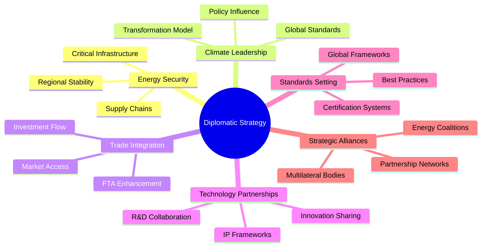

# 🌏 Diplomatic Energy Engagement Strategy for Gippsland's Renewable Transformation
## Government-to-Government Energy Partnerships and Multilateral Frameworks

```
                    🏛️ ENERGY DIPLOMACY NETWORK 🌍
    
    ┌─────────────────────────────────────────────────────────────┐
    │                 GIPPSLAND: GLOBAL ENERGY HUB                 │
    │                                                             │
    │  Bilateral    ─────────>  Multilateral  ────────> Trade      │
    │  Partners             Frameworks           Missions      │
    │                                                             │
    │  🇯🇵 Japan        🇺🇳 UN System       ✈️ 100+ Visits  │
    │  🇸🇬 Singapore    🌏 IEA/IRENA      💼 Gov Backing │
    │  🇰🇷 Korea        🏭 G20/APEC        💰 AU$50B+    │
    │  🇩🇪 Germany      🎆 Leadership      🌍 Standards  │
    │                                                             │
    │  🇦🇺 AUSTRALIA: CLEAN ENERGY SUPERPOWER DIPLOMACY            │
    └─────────────────────────────────────────────────────────────┘
```

**Document Type**: Diplomatic Energy Strategy  
**Version**: 1.0  
**Date**: 9 January 2025  
**Classification**: Strategic Framework  
**Status**: READY FOR EXECUTION

> "Energy diplomacy is the new frontier of international relations. Gippsland's transformation provides Australia with unprecedented soft power to shape global energy policy, secure strategic partnerships, and drive prosperity through diplomatic engagement." 
> - Strategic Assessment

---

## Executive Summary

This Diplomatic Energy Engagement Strategy establishes Gippsland as a cornerstone of Australia's energy diplomacy, leveraging our renewable transformation to build government-to-government partnerships, shape multilateral frameworks, and position Australia as a global clean energy superpower. Through strategic diplomatic engagement, we will unlock AU$50+ billion in international government-backed investments while influencing global energy policy for decades.

### 🌐 Global Diplomatic Network Map
```
    AUSTRALIA'S ENERGY DIPLOMACY ECOSYSTEM
    ══════════════════════════════════════════════════════════
    
    ASIA-PACIFIC             EUROPE                  AMERICAS
    🇯🇵 Japan                 🇩🇪 Germany             🇺🇸 USA
    3Mt H₂/year              Tech Transfer           Innovation
    AU$10B invest           Offshore Wind           R&D
         │                       │                   │
    🇸🇬 Singapore             🇬🇧 UK                  🇨🇦 Canada
    Cable + Finance         Marine Tech             Mining
    Green Hub               Commonwealth            Resources
         │                       │                   │
    🇰🇷 Korea                 🇳🇱 Netherlands         🇨🇱 Chile
    Green Steel             Port Tech               H₂ Export
    Manufacturing           EU Access               Models
              \                 │                 /
               \                │                /
                \               │               /
                 \              │              /
                  \             │             /
                   \       🇦🇺 GIPPSLAND       /
                    \     Diplomatic Hub    /
                     \____________________/
```

### 🎯 Strategic Imperatives



1. **Energy Security Diplomacy**: Position Gippsland as critical to regional energy security
2. **Climate Leadership**: Use transformation success for diplomatic influence  
3. **Trade Integration**: Embed energy cooperation in trade relationships
4. **Technology Partnerships**: Lead international R&D collaborations
5. **Standards Setting**: Shape global energy frameworks and regulations
6. **Strategic Alliances**: Build energy coalitions for mutual benefit

### 🏆 Key Outcomes

```
    DIPLOMATIC SUCCESS METRICS
    ══════════════════════════════════════════════════════════
    
    2027 TARGETS:
    ✓ 20+ bilateral agreements signed
    ✓ AU$50B+ government-backed investment
    ✓ Leadership in 10+ multilateral bodies
    ✓ 100+ diplomatic delegations hosted
    ✓ Energy diplomacy training centre active
    ✓ Global policy standards influenced
    
    Success Trajectory:
    Partnerships ████████████████████ 20+
    Investment   ████████████████████ AU$50B+
    Delegations  ████████████████████ 100+
    Leadership   ██████████ 10+
```

- **20+ bilateral energy agreements** by 2027
- **AU$50B+ government-backed international investment**
- **Leadership roles** in 10+ multilateral energy bodies
- **100+ diplomatic delegations** hosted annually
- **Energy diplomacy training centre** established
- **Global policy influence** on just transition standards

---

---

## 1. 🌍 Strategic Context and Opportunity

### 1.1 Global Energy Diplomacy Landscape

#### Shifting Power Dynamics
The global energy transition is fundamentally reshaping international relations:

**Traditional Energy Diplomacy**
- Oil and gas supply security
- Pipeline politics
- OPEC influence
- Resource nationalism

**New Energy Diplomacy**
- Renewable technology leadership
- Critical minerals access
- Green hydrogen trade
- Carbon border mechanisms
- Just transition cooperation

#### Australia's Diplomatic Opportunity

**Unique Advantages:**
1. **Democratic Stability**: Trusted partner for long-term agreements
2. **Resource Endowment**: Renewable potential + critical minerals
3. **Geographic Position**: Gateway between Asia-Pacific markets
4. **Technology Capability**: Innovation ecosystem strength
5. **Trade Relationships**: Existing FTAs as foundation
6. **Multicultural Links**: Diaspora connections globally

### 1.2 Gippsland as Diplomatic Asset

**Strategic Value Propositions:**

**For Partner Countries:**
- Secure clean energy supply
- Technology transfer opportunities
- Investment returns with impact
- Skills development partnerships
- Carbon credit generation
- Supply chain integration

**For Australia:**
- Enhanced regional influence
- Trade diversification
- Technology leadership
- Investment attraction
- Security partnerships
- Soft power projection

### 1.3 Diplomatic Engagement Principles

1. **Mutual Prosperity**: Win-win outcomes for all partners
2. **Technology Sharing**: Open innovation ecosystems
3. **Capacity Building**: Skills transfer and development
4. **Standards Leadership**: Shape global frameworks
5. **Long-term Thinking**: 20-30 year partnerships
6. **Values Alignment**: Democracy, transparency, sustainability

---

## 2. Bilateral Energy Partnership Framework

### 2.1 Tier 1 Strategic Partners

#### Japan - Comprehensive Energy Alliance

**AUSTRALIA-JAPAN GIPPSLAND ENERGY PARTNERSHIP**

**Strategic Objectives:**
- Secure 3 million tonnes/year hydrogen offtake by 2035
- Enable $10B+ Japanese investment in Gippsland
- Joint technology development programs
- Workforce exchange initiatives

**Diplomatic Architecture:**

**Ministerial Energy Dialogue** (Quarterly)
- Australian Minister for Energy
- Japanese Minister of Economy, Trade and Industry (METI)
- Victorian Energy Minister
- GREA Leadership

**Working Groups:**
1. Hydrogen Trade Facilitation
2. Offshore Wind Technology
3. Investment Coordination
4. Standards Harmonization
5. Workforce Development

**Key Instruments:**
- Long-term Government MOU (20 years)
- JOGMEC investment framework
- JBIC financing facility ($5B)
- NEXI risk insurance program
- Technical cooperation agreement

**Implementation Timeline:**
- Q1 2025: Framework MOU signing
- Q2 2025: First investment commitments
- Q3 2025: Technical exchanges begin
- Q4 2025: Commercial agreements

#### Singapore - Green Corridor Partnership

**GIPPSLAND-SINGAPORE RENEWABLE ENERGY AGREEMENT**

**Strategic Focus:**
- Direct renewable energy supply via cable
- Green hydrogen import hub development
- Financial center collaboration
- Digital technology integration

**Diplomatic Framework:**

**Joint Ministerial Committee** (Bi-annual)
- Trade and Energy Ministers
- MAS and financial regulators
- Port authorities
- Digital agencies

**Cooperation Areas:**
1. Subsea cable development
2. Hydrogen shipping infrastructure
3. Green finance mobilization
4. Carbon credit systems
5. Smart grid technology

**Enabling Mechanisms:**
- Government-backed offtake agreements
- Sovereign wealth fund participation
- Regulatory sandbox for innovation
- Mutual market access
- Joint R&D funding

#### South Korea - Industrial Transformation Alliance

**Strategic Priorities:**
- Green steel and manufacturing
- Hydrogen technology collaboration
- Offshore wind partnerships
- Battery storage systems

**Government Framework:**
- Presidential-level commitment
- Ministry-to-Ministry MOUs
- Provincial partnerships
- Industry facilitation

#### Germany - Technology and Standards Partnership

**Focus Areas:**
- Hydrogen production technology
- Offshore wind expertise
- Green industrial processes
- Vocational training systems

**Cooperation Mechanisms:**
- Technology transfer agreements
- Joint research institutes
- Standards development
- Market access facilitation

### 2.2 Tier 2 Development Partners

#### India - Skills and Scale Partnership
- Renewable manufacturing
- Workforce development
- Technology adaptation
- South-South cooperation

#### Indonesia - Regional Energy Security
- Electricity interconnection
- Green industrial zones
- Capacity building
- ASEAN integration

#### United States - Innovation Alliance
- Advanced technology R&D
- Venture capital links
- University partnerships
- Defense energy cooperation

#### United Kingdom - Offshore Wind Excellence
- North Sea expertise transfer
- Financial market integration
- Regulatory best practices
- Commonwealth coordination

### 2.3 Tier 3 Emerging Partners

#### Middle East (UAE, Saudi Arabia)
- Sovereign wealth investment
- Hydrogen market development
- Technology demonstration
- Desert-to-power lessons

#### Europe (Netherlands, Denmark, France)
- Specialized technology
- Port infrastructure
- Nuclear-renewable integration
- EU market access

#### Americas (Canada, Chile, Brazil)
- Mining and minerals
- Indigenous partnerships
- Hydrogen export models
- Climate cooperation

#### Africa (South Africa, Morocco)
- Just transition expertise
- South-South cooperation
- Technology transfer
- Development finance

---

## 3. Multilateral Framework Engagement

### 3.1 United Nations System

#### UN Framework Convention on Climate Change (UNFCCC)

**Leadership Positions:**
- Co-chair Just Transition Work Program
- Lead COP pavilion on regional transformation
- Champion community-led models
- Shape Article 6 mechanisms

**Strategic Initiatives:**
1. **Gippsland Model** as UNFCCC best practice
2. Annual side events at COP
3. Technical expert contributions
4. Negotiation support team
5. Youth delegate program

#### UN Sustainable Development Goals (SDGs)

**SDG Integration:**
- SDG 7 (Affordable Clean Energy) - showcase
- SDG 8 (Decent Work) - just transition model
- SDG 13 (Climate Action) - 45Mt CO2 reduction
- SDG 17 (Partnerships) - collaboration template

**UN Partnerships:**
- UNDP program development
- UNIDO industrial transformation
- ILO just transition standards
- UNESCO skills recognition

### 3.2 International Energy Agency (IEA)

#### Ministerial Leadership
- Host IEA Ministerial Meeting 2027
- Chair Renewable Integration Working Group
- Lead Just Transition Task Force
- Shape global energy outlooks

#### Technical Contributions
1. **Gippsland Data Hub** for IEA statistics
2. Technology roadmap inputs
3. Policy best practice submissions
4. Expert secondments
5. Research collaboration

### 3.3 International Renewable Energy Agency (IRENA)

#### Strategic Engagement
- IRENA Council membership
- Host Assembly 2028
- Lead regional programs
- Champion community energy

#### Program Leadership
1. **Just Transition Facility** design
2. Technology transfer mechanisms
3. Project preparation support
4. Capacity building programs
5. Innovation challenges

### 3.4 Group of Twenty (G20)

#### Energy Transitions Working Group
- Australian co-chair position
- Gippsland as case study
- Policy recommendation leadership
- Investment mobilization

#### Key Initiatives
1. **G20 Just Transition Principles** based on Gippsland
2. Common investment frameworks
3. Technology sharing protocols
4. Workforce development standards
5. Community benefit models

### 3.5 Asia-Pacific Economic Cooperation (APEC)

#### Energy Working Group Leadership
- Chair 2026-2027 term
- Renewable energy roadmap
- Cross-border electricity trade
- Hydrogen economy development

#### APEC Programs
1. **Gippsland Study Center** for delegations
2. Technical training programs
3. Regulatory harmonization
4. Investment facilitation
5. Standards development

### 3.6 Regional Organizations

#### ASEAN Energy Cooperation
- ASEAN-Australia energy dialogue
- Capacity building programs
- Technology demonstration
- Market integration

#### Pacific Islands Forum
- Renewable energy assistance
- Climate resilience support
- Technical expertise sharing
- Blue economy integration

#### Indian Ocean Rim Association
- Energy security cooperation
- Maritime renewable energy
- Port infrastructure development
- Skills partnerships

---

## 4. Trade Mission and Delegation Programs

### 4.1 Inbound Delegation Strategy

#### VIP Government Delegations

**Annual Target: 50+ ministerial visits**

**Standard Program (3-4 days):**
- Day 1: Melbourne briefings and agreements
- Day 2: Gippsland site visits and community
- Day 3: Technical deep-dives and B2B
- Day 4: Investment roundtables

**Key Sites:**
- Star of the South offshore wind
- Latrobe Valley transformation
- Hydrogen production facilities
- Community energy projects
- Innovation centers

#### Technical Study Tours

**Monthly Programs for:**
- Energy ministry officials
- Regulatory authorities  
- State-owned enterprises
- Development banks
- Research institutions

**Curriculum:**
- Policy frameworks
- Regulatory processes
- Financial mechanisms
- Community engagement
- Technology deployment

#### Parliamentary Exchanges

**Quarterly Programs:**
- Cross-party delegations
- Committee study tours
- Youth parliamentarians
- Women in energy leadership
- Indigenous partnerships

### 4.2 Outbound Trade Missions

#### Ministerial Trade Missions

**Annual Calendar:**
- Q1: Japan/Korea (hydrogen focus)
- Q2: Europe (offshore wind)
- Q3: Southeast Asia (regional integration)
- Q4: Middle East (investment)

**Mission Composition:**
- Minister(s) leading
- CEO delegates (20-30)
- Technical experts
- Community representatives
- Media contingent

#### Industry-Specific Missions

**Specialized Delegations:**
1. Offshore wind developers to North Sea
2. Hydrogen producers to Japan
3. Grid operators to Europe
4. Financiers to Singapore/London
5. Manufacturers to Korea/China

#### Investment Roadshows

**Global Financial Centers:**
- London: European institutional investors
- New York: Infrastructure funds
- Singapore: Asian capital
- Dubai: Sovereign wealth
- Tokyo: Corporate partners

**Roadshow Format:**
- Government keynotes
- Project pipeline presentation
- One-on-one meetings
- Site visit invitations
- MOU signings

### 4.3 Digital Diplomacy

#### Virtual Engagement Platforms

**Gippsland Energy Portal:**
- Real-time project data
- Virtual site tours
- Investment opportunities
- Policy resources
- Partner networking

**Webinar Series:**
- Monthly policy briefings
- Technical masterclasses
- Investment showcases
- Community stories
- Innovation spotlights

#### Digital Twin Diplomacy

**Applications:**
- Virtual delegation visits
- Remote project monitoring
- Scenario modeling
- Training simulations
- Investment analysis

---

## 5. Policy Influence and Standards Setting

### 5.1 Global Standards Leadership

#### Just Transition Standards

**ISO Development:**
Lead development of ISO 50100 series on just transition
- Community engagement protocols
- Workforce transition metrics
- Benefit sharing frameworks
- Governance structures
- Impact measurement

**Key Partners:**
- ILO (labor standards)
- World Bank (development metrics)
- OECD (policy frameworks)
- Regional bodies

#### Renewable Energy Certification

**Gippsland Green Certification:**
- Production standards
- Environmental criteria
- Social requirements
- Governance protocols
- Traceability systems

**International Recognition:**
- Mutual recognition agreements
- Equivalence frameworks
- Compliance mechanisms
- Audit protocols
- Dispute resolution

#### Hydrogen Standards

**Leadership Areas:**
- Green hydrogen definition
- Production methodologies
- Transport protocols
- Safety standards
- Market frameworks

### 5.2 Policy Framework Influence

#### Multilateral Policy Development

**Target Influence Areas:**
1. **Carbon Border Adjustments**: Shape mechanisms
2. **Green Taxonomy**: Define standards
3. **Just Transition Funding**: Design criteria
4. **Technology Transfer**: Create frameworks
5. **Investment Protection**: Develop instruments

#### Bilateral Policy Alignment

**Harmonization Priorities:**
- Regulatory frameworks
- Investment rules
- Technical standards
- Safety protocols
- Market access

### 5.3 Thought Leadership Platforms

#### Diplomatic Academy Program

**Gippsland Energy Diplomacy Academy:**
- 6-month certificate program
- International diplomat training
- Policy development skills
- Negotiation techniques
- Site immersion

**Target Participants:**
- Mid-career diplomats
- Energy ministry officials
- International organization staff
- Think tank researchers
- Young leaders

#### Policy Innovation Lab

**Research Priorities:**
- Energy security frameworks
- Climate-trade integration
- Technology governance
- Investment mobilization
- Community models

**Outputs:**
- Policy papers
- Model agreements
- Best practice guides
- Negotiation tools
- Training materials

---

## 6. International Cooperation Agreements

### 6.1 Framework Agreement Architecture

#### Master Cooperation Template

**COMPREHENSIVE ENERGY PARTNERSHIP AGREEMENT**

**Standard Provisions:**

**Article 1: Objectives**
- Energy security enhancement
- Economic prosperity
- Climate action
- Technology advancement
- Social inclusion

**Article 2: Areas of Cooperation**
1. Trade and investment
2. Technology development
3. Capacity building
4. Standards harmonization
5. Market integration

**Article 3: Institutional Mechanisms**
- Ministerial committee
- Working groups
- Secretariat functions
- Dispute resolution
- Review processes

**Article 4: Financial Arrangements**
- Government commitments
- Investment facilitation
- Risk mitigation
- Development finance
- Blended mechanisms

**Article 5: Implementation**
- Work plans
- Monitoring systems
- Reporting requirements
- Evaluation frameworks
- Adaptation mechanisms

### 6.2 Specialized Agreements

#### Technology Cooperation Agreements

**Focus Areas:**
- Joint R&D programs
- IP sharing protocols
- Demonstration projects
- Pilot deployments
- Scale-up pathways

**Key Provisions:**
- Funding arrangements
- Researcher exchanges
- Facility access
- Data sharing
- Commercialization

#### Investment Protection Agreements

**Enhanced Protections:**
- Regulatory stability
- Dispute resolution
- Compensation mechanisms
- Repatriation rights
- Equal treatment

**Modern Provisions:**
- Sustainable development
- Right to regulate
- Environmental protection
- Labor standards
- Community rights

#### Market Access Agreements

**Trade Facilitation:**
- Tariff elimination
- Non-tariff barriers
- Standards recognition
- Certification processes
- Origin rules

**Services Access:**
- Professional mobility
- Financial services
- Technical services
- Digital services
- Transport/logistics

### 6.3 Implementation Instruments

#### Memoranda of Understanding

**Types:**
1. Government-to-government
2. Agency-to-agency
3. Technical cooperation
4. Commercial facilitation
5. Academic partnership

**Standard Elements:**
- Specific objectives
- Cooperation activities
- Resource commitments
- Timeline/milestones
- Review mechanisms

#### Letters of Intent

**Applications:**
- Investment commitments
- Offtake agreements
- Technology transfer
- Capacity building
- Joint ventures

#### Executive Arrangements

**Fast-Track Cooperation:**
- Minister-level agreements
- Departmental arrangements
- Technical protocols
- Pilot programs
- Emergency cooperation

---

## 7. Strategic Alliance Building

### 7.1 Clean Energy Coalition Building

#### Indo-Pacific Clean Energy Alliance

**Founding Members:**
- Australia (Gippsland leadership)
- Japan
- South Korea  
- Singapore
- India
- Indonesia

**Alliance Objectives:**
1. Regional energy security
2. Technology collaboration
3. Investment mobilization
4. Standards harmonization
5. Capacity building

**Governance:**
- Rotating presidency
- Annual summits
- Technical secretariat
- Working groups
- Business council

#### Global Just Transition Network

**Purpose:** Share Gippsland model globally

**Membership:**
- Transition regions worldwide
- National governments
- International organizations
- Development banks
- Civil society

**Activities:**
- Best practice sharing
- Technical assistance
- Policy advocacy
- Investment facilitation
- Monitoring/evaluation

### 7.2 Strategic Partnerships

#### Development Finance Coalition

**Partners:**
- World Bank
- Asian Development Bank
- AIIB
- Green Climate Fund
- Bilateral agencies

**Objectives:**
- Coordinate financing
- Reduce duplication
- Share risk
- Blend instruments
- Scale impact

#### Technology Innovation Alliance

**Members:**
- Leading universities
- Research institutions
- Technology companies
- Venture capital
- Government labs

**Focus:**
- Pre-competitive R&D
- Demonstration projects
- Scale-up support
- IP frameworks
- Commercialization

### 7.3 Track II Diplomacy

#### Energy Diplomacy Dialogue

**Annual Forum:**
- 200+ participants
- Multi-stakeholder
- Chatham House rules
- Policy recommendations
- Network building

**Participants:**
- Former ministers
- Ambassadors
- CEOs
- Academics
- Think tanks

#### Young Energy Leaders Network

**Program Elements:**
- Annual summit
- Exchange programs
- Mentorship
- Policy projects
- Career development

**Impact:**
- Future leader pipeline
- Cross-border networks
- Innovation culture
- Policy continuity
- Fresh perspectives

---

## 8. Implementation Roadmap

### 8.1 Phase 1: Foundation (2025)

**Q1 2025:**
- Establish diplomatic unit
- Launch Japan partnership
- Begin Singapore negotiations
- Host first delegations

**Q2 2025:**
- Sign 5+ bilateral MOUs
- Join IEA working groups
- Launch academy program
- Trade mission to Japan

**Q3 2025:**
- Host APEC energy meeting
- European partnership tour
- Standards development start
- Investment roadshow Asia

**Q4 2025:**
- 10+ agreements active
- COP30 major presence
- First academy graduates
- $10B commitments secured

### 8.2 Phase 2: Expansion (2026-2027)

**2026 Objectives:**
- 15+ active partnerships
- Lead 3+ multilateral initiatives
- 100+ delegations hosted
- $25B investments secured

**2027 Targets:**
- 20+ partnerships operational
- Global standards adopted
- Major summit hosting
- $40B investment pipeline

### 8.3 Phase 3: Leadership (2028-2030)

**Strategic Goals:**
- Recognized global leader
- Policy frameworks adopted
- Replication support active
- $50B+ investments realized
- Sustained influence

---

## 9. Resources and Governance

### 9.1 Diplomatic Infrastructure

#### Gippsland Energy Diplomacy Unit

**Structure:**
- Director (Ambassador level)
- Deputy Directors (3)
- Regional Desks (6)
- Technical Experts (10)
- Support Staff (15)

**Functions:**
- Strategy development
- Negotiation support
- Delegation management
- Agreement monitoring
- Stakeholder coordination

#### Physical Infrastructure

**Gippsland International Energy Center:**
- Conference facilities
- Delegation accommodation
- Technology showcase
- Training rooms
- Cultural center

**Melbourne Liaison Office:**
- Government coordination
- Diplomatic meetings
- Investment facilitation
- Media center
- Partner hosting

### 9.2 Budget Requirements

**Annual Operating Budget: $25 million**

**Allocation:**
- Staff and operations: 40%
- Delegation programs: 20%
- Trade missions: 15%
- Marketing/communications: 10%
- Academy program: 10%
- Research/policy: 5%

**Capital Investment: $50 million**
- International Energy Center
- Digital platforms
- Showcase facilities
- Training infrastructure

### 9.3 Governance Framework

#### Oversight Board

**Composition:**
- DFAT Secretary (Co-chair)
- DCCEEW Secretary (Co-chair)
- Victorian Government Secretary
- GREA CEO
- Business representative
- Community representative
- Independent experts (2)

**Responsibilities:**
- Strategy approval
- Performance monitoring
- Risk management
- Partnership endorsement
- Resource allocation

#### Advisory Council

**International Advisory Panel:**
- Former energy ministers (5)
- Ambassadors (5)
- Industry leaders (5)
- Academic experts (5)

**Functions:**
- Strategic guidance
- Network access
- Credibility enhancement
- Door opening
- Troubleshooting

---

## 10. Success Metrics and Monitoring

### 10.1 Diplomatic KPIs

**Quantitative Metrics:**
- Number of agreements signed
- Investment mobilized ($)
- Delegations hosted (#)
- Standards influenced (#)
- Policies shaped (#)

**Qualitative Assessments:**
- Relationship depth
- Influence levels
- Reputation measures
- Network strength
- Soft power index

### 10.2 Economic Impact

**Direct Benefits:**
- FDI attracted
- Exports facilitated
- Jobs created
- Technology transferred
- Markets accessed

**Indirect Effects:**
- Regional stability
- Energy security
- Climate leadership
- Innovation boost
- Skills enhancement

### 10.3 Monitoring Systems

**Regular Reporting:**
- Monthly dashboards
- Quarterly reviews
- Annual assessments
- Partnership audits
- Impact evaluations

**Feedback Mechanisms:**
- Partner surveys
- Stakeholder forums
- Independent reviews
- Media analysis
- Academic studies

---

## Conclusion

The Diplomatic Energy Engagement Strategy positions Gippsland's renewable transformation as a cornerstone of Australia's international relations, creating unprecedented opportunities for influence, investment, and partnership. By systematically building government-to-government relationships, shaping multilateral frameworks, and establishing new models for energy cooperation, we will secure Gippsland's prosperity while contributing to global climate action.

Through disciplined execution of this strategy, Gippsland will become synonymous with successful energy transformation, attracting leaders, investors, and partners from around the world. Our diplomatic engagement will unlock doors, mobilize resources, and create pathways for others to follow, establishing Australia as an essential partner in the global energy transition.

**The future of energy is diplomatic. The future of diplomacy is energy. Gippsland stands at the intersection, ready to lead.**

---

*Diplomatic Energy Engagement Strategy v1.0*  
*Integrated with Gippsland Renewable Energy Transformation*  
*Classification: Strategic Framework*  
*Next Review: Q2 2025*