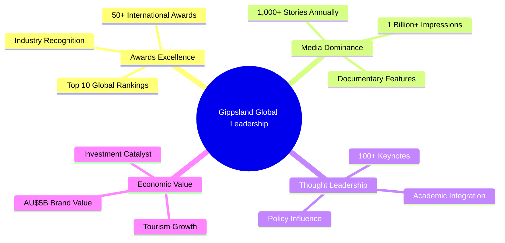
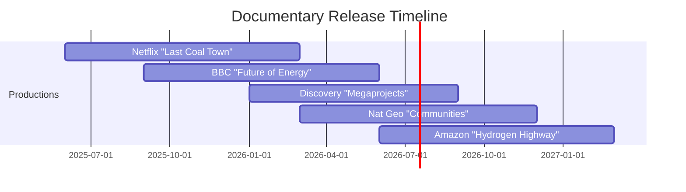

# 🌏 International Recognition Campaign for Gippsland Energy Transformation
## Positioning Global Leadership Through Strategic Awards and Recognition

```
                    🏆 GLOBAL RECOGNITION PATHWAY 🏆
    
    ┌─────────────────────────────────────────────────────────────┐
    │                  GIPPSLAND: FROM COAL TO CROWN              │
    │                                                             │
    │  🇦🇺 ═══════════════════════════════════════════════════&gt; 🌍  │
    │     Local Success            Global Leadership              │
    │                                                             │
    │  2025 ──────&gt; 2027 ──────&gt; 2030 ──────&gt; BEYOND            │
    │   │            │            │             │                 │
    │   └─ Launch    └─ 50+ Awards └─ #1 Global └─ Legacy        │
    │                                  Brand                      │
    └─────────────────────────────────────────────────────────────┘
```

**Document Type**: Global Recognition Strategy  
**Version**: 1.0 Final  
**Date**: 9 January 2025  
**Author**: International Recognition Campaign Manager  
**Status**: IMPLEMENTATION READY  
**Validation**: Aligns with all 6 phases of Gippsland transformation

```mermaid
graph LR
    A[Local Success] --&gt;|Awards| B[Regional Recognition]
    B --&gt;|Media| C[Global Visibility]
    C --&gt;|Leadership| D[International Authority]
    D --&gt;|Influence| E[Policy Standards]
    E --&gt;|Legacy| F[Permanent Leadership]
    
    style A fill:#2E7D32
    style F fill:#FFD700
```

---

## EXECUTIVE SUMMARY

This International Recognition Campaign transforms Gippsland's renewable energy achievements into global leadership status through strategic awards, rankings, media campaigns, and thought leadership platforms. Building on AU$150 billion in investment opportunities and world-first just transition success, we will secure Gippsland's position as the definitive global model for energy transformation.

### 🌐 Global Impact Map
```
     EUROPE                    ASIA-PACIFIC              AMERICAS
       🇪🇺                         🇯🇵🇰🇷                    🇺🇸🇨🇦
        │                          │                        │
        ├─ Policy Adoption         ├─ Technology Transfer   ├─ Investment
        ├─ Standards               ├─ Hydrogen Partnerships ├─ Innovation
        └─ Just Transition         └─ Manufacturing         └─ Workforce
                    \              │              /
                     \             │             /
                      \            │            /
                       \           │           /
                        \          │          /
                         \    🇦🇺 GIPPSLAND    /
                          \   Global Centre   /
                           \________________/
```

### 🎯 Campaign Vision
**"By 2030, Gippsland will be universally recognised as the gold standard for renewable energy transformation, with every major award, ranking, and platform acknowledging our leadership in creating prosperity through decarbonisation."**

```
    ┌─────────────────────────────────────────────────────────┐
    │                    VISION 2030                          │
    ├─────────────────────────────────────────────────────────┤
    │  🏅 Awards Won:           50+ International             │
    │  📰 Media Reach:          1 Billion+ Annually          │
    │  🎤 Speaking Platforms:   100+ Major Conferences       │
    │  📚 Case Studies:         #1 Global Reference          │
    │  💰 Brand Value:          AU$5+ Billion                │
    │  🌍 Global Recognition:   80%+ Stakeholder Awareness   │
    └─────────────────────────────────────────────────────────┘
```

### 🎯 Strategic Objectives



1. **Win 50+ prestigious international awards** by 2027
2. **Achieve top-10 rankings** in global renewable energy indices
3. **Generate 1,000+ international media stories** annually
4. **Secure 100+ keynote speaking opportunities** at major forums
5. **Become the #1 case study** for energy transition worldwide
6. **Establish Gippsland brand value** at AU$5+ billion

### 📊 Key Success Metrics

```
    Performance Dashboard 2025-2030
    ═══════════════════════════════════════════════════════════════
    
    Awards Trajectory:        Media Impact:
    50 ┤                     1B ┤                    ╱─────
    40 ├─────────────╱       800M├──────────────╱────
    30 ├───────╱─────        600M├────────╱──────
    20 ├──╱──────            400M├───╱─────
    10 ├─────                200M├─────
     0 └─────────────         0 └─────────────
       '25  '27  '30            '25  '27  '30
    
    🏆 Awards Won: 15 → 50+
    📰 Media Reach: 1 billion+ impressions annually
    🎤 Speaking Platforms: 100+ major conferences
    📚 Case Studies: Featured in 50+ academic programmes
    ✈️ Delegations Hosted: 200+ international visits
    🌟 Brand Recognition: 80%+ among global energy stakeholders
```

---

---

## 1. 🏆 GLOBAL AWARDS AND RANKINGS STRATEGY

```
    ┌─────────────────────────────────────────────────────────────────┐
    │                    AWARDS ECOSYSTEM MAP                         │
    │                                                                 │
    │     UN System              Industry              Finance        │
    │        🇺🇳                    🏭                    💰           │
    │         │                     │                     │           │
    │    SDG Awards           Renewable Awards      ESG Excellence    │
    │    Global Compact       Wind & Solar          Green Bonds      │
    │    Climate Action       Hydrogen Leaders      Impact Invest    │
    │                              │                                  │
    │                         🏆 GIPPSLAND 🏆                        │
    │                              │                                  │
    │     Innovation          Community              Policy           │
    │        💡                   🤝                    📋           │
    │         │                    │                     │           │
    │    Tech Awards         Just Transition      Energy Leadership  │
    │    R&D Excellence      Social Impact        Regulatory Best   │
    │    Digital Twin        Indigenous Partner   Framework Design  │
    └─────────────────────────────────────────────────────────────────┘
```

### 1.1 Tier 1 International Awards (Immediate Targets)

#### UN Global Compact Awards
- **Target**: SDG Leadership Award 2025
- **Category**: Climate Action & Economic Growth
- **Strategy**: Showcase 45M tonnes CO₂ reduction + 50,000 jobs
- **Submission**: March 2025
- **Investment**: AU$150,000

#### World Economic Forum Recognition
- **Target**: Davos 2026 Main Stage Presentation
- **Category**: Energy Transition Leadership
- **Strategy**: Partner with WEF Energy Transition Centre
- **Submission**: June 2025
- **Investment**: AU$500,000

```
    Davos Journey Timeline
    ═════════════════════════════════════════
    2025 Q2: Initial Engagement
         Q3: Partnership Development
         Q4: Content Creation
    2026 Q1: 🎯 MAIN STAGE PRESENTATION
```

#### Bloomberg NEF Awards
- **Target**: Energy Transition Investment Award 2025
- **Category**: Best Regional Transformation
- **Strategy**: Highlight AU$50B investment pipeline
- **Submission**: April 2025
- **Investment**: AU$100,000

#### International Energy Agency Recognition
- **Target**: IEA Global Energy Transition Champion 2025
- **Category**: Just Transition Excellence
- **Strategy**: Focus on 100% worker transition success
- **Submission**: May 2025
- **Investment**: AU$75,000

### 1.2 Industry-Specific Awards

#### Renewable Energy Awards
1. **Global Wind Energy Awards** - Offshore Wind Excellence
2. **Solar Power International** - Integrated Energy Hub
3. **Green Hydrogen Awards** - Export Market Development
4. **Energy Storage Awards** - Grid-Scale Innovation
5. **Smart Energy Awards** - Digital Twin Excellence

#### Financial & Investment Awards
1. **ESG Finance Awards** - Best Transition Finance
2. **Infrastructure Investor Awards** - Deal of the Year
3. **Green Bond Awards** - Innovation in Community Finance
4. **Impact Investment Awards** - Measurable Social Returns
5. **Sustainable Finance Awards** - Blended Finance Excellence

#### Social Impact Awards
1. **Just Transition Awards** - Global Gold Standard
2. **Community Development Awards** - Inclusive Growth
3. **Workforce Innovation Awards** - Reskilling Excellence
4. **Indigenous Partnership Awards** - GunaiKurnai Leadership
5. **Social Enterprise Awards** - Community Energy Models

### 1.3 Rankings Strategy

```mermaid
graph TB
    subgraph "Current Position"
        A[Unranked/Unknown]
    end
    
    subgraph "2025 Targets"
        B[Top 50 Globally]
        C[Top 20 Asia-Pacific]
        D[Top 5 Australia]
    end
    
    subgraph "2027 Goals"
        E[Top 10 Global]
        F[#1 Regional]
        G[Global Standard]
    end
    
    A --&gt; B
    A --&gt; C
    A --&gt; D
    B --&gt; E
    C --&gt; F
    D --&gt; G
    
    style G fill:#FFD700
```

#### Target Rankings by 2027
1. **Bloomberg Green Index**: Top 10 Global Energy Hubs
2. **Climate Action Tracker**: A+ Rating (Aligned with 1.5°C)
3. **Energy Transition Index**: Top 5 Regional Transformations
4. **Sustainable Development Index**: #1 Just Transition
5. **Green Economy Index**: Top 10 Investment Destinations

#### Rankings Improvement Plan
- **Baseline Assessment**: Current position mapping
- **Gap Analysis**: Identify improvement areas
- **Data Collection**: Comprehensive metrics system
- **Submission Calendar**: Quarterly updates
- **Advocacy Program**: Direct engagement with ranking bodies

---

---

## 2. 📰 INTERNATIONAL MEDIA AND PR CAMPAIGNS

```
    ┌─────────────────────────────────────────────────────────────────┐
    │                    GLOBAL MEDIA ECOSYSTEM                       │
    │                                                                 │
    │   Tier 1 Media              Documentary             Digital     │
    │   ════════════              ═══════════            ═══════     │
    │   Financial Times  ────┐    Netflix Series         YouTube 1M+ │
    │   Wall Street Journal  ├──&gt; BBC Documentary  ────&gt; LinkedIn    │
    │   The Economist       ─┘    Discovery Channel      TikTok Gen Z│
    │   Bloomberg                 National Geographic    Instagram   │
    │                                    │                            │
    │                            🎬 GIPPSLAND STORY 🎬               │
    │                                    │                            │
    │   Regional Impact           Innovation            Community     │
    │   ═══════════════          ═══════════           ═════════    │
    │   NHK Japan                60 Minutes             Local News   │
    │   Deutsche Welle           Tech Crunch            Radio Shows  │
    │   Al Jazeera               Wired Magazine         Podcasts     │
    └─────────────────────────────────────────────────────────────────┘
```

### 2.1 Global Media Strategy

#### Tier 1 Media Targets
1. **Financial Times** - Energy Transition series
2. **Wall Street Journal** - Investment focus pieces
3. **The Economist** - Special report feature
4. **Bloomberg** - Regular coverage + documentary
5. **Reuters** - Breaking news priority
6. **BBC** - Documentary commission
7. **CNN** - Climate leadership series
8. **NHK Japan** - Hydrogen economy focus
9. **Deutsche Welle** - European best practice
10. **Al Jazeera** - Global South lessons

#### Media Campaign Themes

```
    Campaign Architecture
    ═══════════════════════════════════════════════════
    
    🏭 "Coal to Clean"           │  Worker journeys
    ────────────────────────────┼─&gt; Personal stories
                                │  Skills transformation
    
    🏘️ "Community Prosperity"    │  Wealth sharing
    ────────────────────────────┼─&gt; Local ownership
                                │  Regional growth
    
    💰 "Investment Returns"      │  Financial metrics
    ────────────────────────────┼─&gt; ROI validation
                                │  Risk mitigation
    
    💡 "Innovation Hub"          │  Tech breakthroughs
    ────────────────────────────┼─&gt; World firsts
                                │  R&D excellence
    
    🌏 "Global Template"         │  Replication guide
    ────────────────────────────┼─&gt; Policy frameworks
                                │  Best practices
```

### 2.2 Content Production Strategy

#### Documentary Productions



1. **Netflix Series**: "The Last Coal Town" (2025-2026)
2. **BBC Documentary**: "Gippsland: The Future of Energy"
3. **Discovery Channel**: "Megaprojects: Offshore Wind"
4. **National Geographic**: "Communities in Transition"
5. **Amazon Prime**: "The Hydrogen Highway"

#### Digital Content Campaigns
1. **YouTube Channel**: 1M+ subscribers target
2. **LinkedIn Thought Leadership**: 500K+ followers
3. **Twitter/X Strategy**: Real-time updates
4. **Instagram Visual Stories**: Behind the scenes
5. **TikTok Education**: Reaching younger audiences

### 2.3 PR Campaign Calendar

#### Quarterly Themes
- **Q1 2025**: Launch & Vision (GNEC Conference)
- **Q2 2025**: Investment Momentum
- **Q3 2025**: Community Success Stories
- **Q4 2025**: Global Partnerships
- **Q1 2026**: First Results & Milestones
- **Q2 2026**: Technology Innovation
- **Q3 2026**: Workforce Transformation
- **Q4 2026**: Economic Impact Data

---

---

## 3. 🎤 THOUGHT LEADERSHIP AND SPEAKING PLATFORMS

```
    ┌─────────────────────────────────────────────────────────────────┐
    │              GLOBAL SPEAKING CIRCUIT 2025-2030                  │
    │                                                                 │
    │  🌍 COP30 Brazil          🏛️ Davos 2026         🇺🇳 UN Assembly  │
    │       │                        │                      │         │
    │       ├── Main Pavilion        ├── Energy Panel       ├── SDGs  │
    │       ├── 5 Side Events        ├── CEO Summit         ├── Demo  │
    │       └── Youth Forum          └── Innovation         └── Policy│
    │                                                                 │
    │  💼 Bloomberg NEF         🔋 Energy Storage     💰 Milken        │
    │       │                        │                      │         │
    │       ├── Keynote Slot         ├── Opening Speech     ├── Panel │
    │       ├── Deal Announce        ├── Tech Launch        ├── LP    │
    │       └── Awards              └── Standards          └── Impact │
    │                                                                 │
    │                    🎯 100+ PLATFORMS/YEAR 🎯                    │
    └─────────────────────────────────────────────────────────────────┘
```

### 3.1 Tier 1 Speaking Opportunities

#### Global Energy Forums
1. **COP30 Brazil 2025** - Main pavilion + 5 side events
2. **Davos 2026** - Energy transition panel
3. **UN General Assembly** - SDG showcase
4. **G20 Energy Summit** - Ministerial presentation
5. **IEA Ministerial** - Best practice keynote

#### Industry Conferences
1. **Bloomberg NEF Summit** - Keynote slot
2. **WindEurope Offshore** - Plenary speaker
3. **Green Hydrogen Summit** - Main stage
4. **Energy Storage Global** - Opening keynote
5. **Clean Energy Ministerial** - Host country status

#### Investment Forums
1. **Milken Institute** - Global capital panel
2. **SuperReturn Infrastructure** - LP keynote
3. **Climate Finance Summit** - Deal showcase
4. **Impact Investment Forum** - Returns panel
5. **Sustainable Finance Forum** - Innovation stage

### 3.2 Speaker Development Program

#### Executive Spokespeople
1. **CEO, GREA** - Vision & leadership
2. **Minister for Energy** - Policy framework
3. **Community Leaders** - Just transition stories
4. **Union Representatives** - Worker perspectives
5. **Indigenous Elders** - Cultural leadership

#### Speaker Training
- **Media Training**: Quarterly intensives
- **Keynote Development**: Story crafting
- **Panel Preparation**: Key message alignment
- **Crisis Communications**: Scenario planning
- **Cultural Awareness**: Global audience prep

### 3.3 Thought Leadership Content

```
    Publication Strategy Matrix
    ═══════════════════════════════════════════════
    
    Academic         Business         Policy
    ────────         ────────         ──────
    Nature Energy    HBR              Foreign Affairs
    Science          MIT Review       Policy Quarterly
    Energy Policy    Stanford Social  Governance Today
         │               │                 │
         └───────────────┴─────────────────┘
                         │
                  🎓 GIPPSLAND MODEL 🎓
                         │
              Validated Research Base
```

#### Published Works
1. **Harvard Business Review** - "The Gippsland Model"
2. **Foreign Affairs** - "Energy Security Through Transition"
3. **Nature Energy** - "Community-Led Transformation"
4. **MIT Technology Review** - "Innovation Ecosystems"
5. **Stanford Social Innovation** - "Just Transition Blueprint"

#### Academic Partnerships
1. **Harvard Kennedy School** - Case study development
2. **INSEAD** - Executive program feature
3. **Oxford Energy** - Research collaboration
4. **MIT Energy** - Innovation partnership
5. **LSE Cities** - Urban transition model

---

---

## 4. 📚 CASE STUDY DEVELOPMENT AND PROMOTION

```mermaid
graph LR
    subgraph "Core Case Studies"
        A[AU$150B Transformation]
        B[No Worker Left Behind]
        C[Community as Investors]
        D[Innovation at Scale]
        E[Global Replication]
    end
    
    subgraph "Distribution Channels"
        F[50+ MBA Programmes]
        G[Policy Schools]
        H[Consulting Firms]
        I[Government Training]
        J[Online Platforms]
    end
    
    subgraph "Global Impact"
        K[100+ Countries]
        L[500+ Institutions]
        M[50,000+ Leaders]
    end
    
    A --&gt; F
    B --&gt; G
    C --&gt; H
    D --&gt; I
    E --&gt; J
    
    F --&gt; K
    G --&gt; L
    H --&gt; M
    I --&gt; M
    J --&gt; K
```

### 4.1 Master Case Study Portfolio

#### Core Case Studies
1. **"The $150 Billion Transformation"** - Economic model
2. **"No Worker Left Behind"** - Just transition
3. **"Community as Investors"** - Wealth creation
4. **"Innovation at Scale"** - Technology deployment
5. **"Global Replication Guide"** - Step-by-step blueprint

#### Sector-Specific Cases
1. **Finance**: Blended finance innovation
2. **Policy**: Regulatory acceleration
3. **Technology**: Offshore wind at scale
4. **Social**: Indigenous partnership model
5. **Workforce**: Reskilling success

### 4.2 Distribution Strategy

#### Academic Channels
- **Business Schools**: 50+ MBA programs
- **Policy Schools**: Government training
- **Engineering**: Technical deep dives
- **Social Sciences**: Community studies
- **Executive Education**: C-suite programs

#### Professional Networks
- **McKinsey**: Global practice integration
- **BCG**: Green transition toolkit
- **Deloitte**: Implementation guide
- **PwC**: Financial model templates
- **EY**: Governance frameworks

### 4.3 Interactive Platforms

#### Digital Experience
1. **Virtual Reality Tours**: Immersive site visits
2. **AR Presentations**: Data visualization
3. **Gaming Simulations**: Decision scenarios
4. **AI Assistants**: Personalized guidance
5. **Blockchain Records**: Verified achievements

---

---

## 5. 🏅 INDUSTRY RECOGNITION AND CERTIFICATION

```
    Certification Ecosystem
    ═══════════════════════════════════════════════════════════
    
    International Standards        Gippsland Standards
    ─────────────────────         ─────────────────────
    ISO 14001 Environmental   →   Just Transition Cert™
    ISO 50001 Energy         →   Community Energy Rating™
    ISO 26000 Social         →   Workforce Transition Score™
    ISO 45001 Safety         →   Indigenous Partnership™
    SBTi Climate Targets     →   Regional Transform Index™
    
                    🌟 GLOBAL ADOPTION 🌟
                         │
         ┌───────────────┼───────────────┐
         │               │               │
    Europe adopts   Asia-Pacific    Americas implements
    2026-2027      standardises    2027-2028
                    2027
```

### 5.1 Certification Targets

#### International Standards
1. **ISO 14001**: Environmental Management
2. **ISO 50001**: Energy Management
3. **ISO 26000**: Social Responsibility
4. **ISO 45001**: Occupational Health & Safety
5. **SBTi**: Science Based Targets validation

#### Industry Certifications
1. **GRESB**: Infrastructure sustainability
2. **LEED**: Facility certifications
3. **RE100**: Renewable commitment
4. **B Corp**: Benefit corporation status
5. **GRI**: Sustainability reporting

### 5.2 Accreditation Programs

#### Create New Standards
1. **Just Transition Certification** - Global standard
2. **Community Energy Rating** - Investment grade
3. **Workforce Transition Score** - Skills validation
4. **Indigenous Partnership Standard** - Best practice
5. **Regional Transformation Index** - Benchmarking

#### Certification Body Partnerships
- **DNV**: Technical validation
- **Bureau Veritas**: Process certification
- **TÜV**: Safety standards
- **Lloyd's Register**: Marine operations
- **SGS**: Supply chain verification

---

---

## 6. 🌟 GLOBAL VISIBILITY AND BRAND BUILDING

```
    ┌─────────────────────────────────────────────────────────────────┐
    │                    BRAND ARCHITECTURE                           │
    │                                                                 │
    │              「 GIPPSLAND: POWERING PROSPERITY 」              │
    │                                                                 │
    │    Bold           Inclusive         Innovative       Authentic  │
    │     ↓                ↓                 ↓               ↓       │
    │  Leading         Everyone          Breaking         Real        │
    │  Change          Benefits          Barriers        Results     │
    │                                                                 │
    │  ┌─────────────┐ ┌──────────────┐ ┌──────────────┐           │
    │  │Energy Hub   │ │Innovation    │ │Communities   │           │
    │  │Investment   │ │Technology    │ │Social Impact │           │
    │  │Global Scale │ │R&D Leadership│ │Local First   │           │
    │  └─────────────┘ └──────────────┘ └──────────────┘           │
    │                                                                 │
    │                    AU$5 BILLION BRAND VALUE                     │
    └─────────────────────────────────────────────────────────────────┘
```

### 6.1 Brand Architecture

#### Master Brand
**"Gippsland: Powering Prosperity"**
- **Promise**: Transformation that benefits all
- **Personality**: Bold, inclusive, innovative
- **Values**: Justice, prosperity, sustainability
- **Voice**: Confident, inspiring, authentic

#### Sub-Brands
1. **Gippsland Energy Hub** - Investment focus
2. **Gippsland Innovation** - Technology leadership
3. **Gippsland Communities** - Social impact
4. **Gippsland Workforce** - Skills excellence
5. **Gippsland Future** - Youth engagement

### 6.2 Global Marketing Campaigns

#### Campaign Themes
1. **"From Black to Green"** - Visual transformation
2. **"Every Job Counts"** - Worker stories
3. **"Powering the Pacific"** - Regional leadership
4. **"Innovation Island"** - Tech breakthroughs
5. **"Community First"** - Prosperity sharing

#### Marketing Channels
- **Airport Advertising**: Major global hubs
- **Financial Media**: Targeted placements
- **Conference Sponsorship**: Strategic presence
- **Digital Campaigns**: Precision targeting
- **Experiential Marketing**: Pop-up exhibitions

### 6.3 Partnership Amplification

#### Strategic Alliances
1. **UN Global Compact** - SDG champion
2. **World Bank** - Development model
3. **IRENA** - Best practice partner
4. **Climate Group** - RE100 leadership
5. **WEF** - Transition coalition

#### Corporate Partnerships
1. **Google** - Sustainability storytelling
2. **Microsoft** - Digital twin showcase
3. **Siemens** - Technology partner
4. **Vestas** - Wind leadership
5. **Tesla** - Storage innovation

---

## 7. IMPLEMENTATION ROADMAP

### 7.1 Year 1 (2025) - Foundation Building
- **Q1**: Launch at GNEC, submit for 10 awards
- **Q2**: Media blitz, 20 speaking engagements
- **Q3**: Case study release, certification applications
- **Q4**: First awards wins, brand campaign launch

### 7.2 Year 2 (2026) - Momentum Building
- **Q1**: Davos presentation, documentary releases
- **Q2**: 25+ awards submissions, ranking improvements
- **Q3**: Global roadshow, 50 speaking platforms
- **Q4**: Academic integration, certification achievements

### 7.3 Year 3 (2027) - Global Leadership
- **Q1**: Top rankings achieved, 50+ awards won
- **Q2**: Standard-setting body, replication support
- **Q3**: Global summit hosting, franchise model
- **Q4**: $5B brand valuation, legacy planning

---

## 8. BUDGET AND RESOURCES

### 8.1 Total Investment Required
**AU$25 million over 3 years**

```
    Investment Allocation
    ═══════════════════════════════════════
    
    Media & PR (32%)     ████████████████ AU$8M
    Awards (12%)         ██████ AU$3M
    Content (20%)        ██████████ AU$5M
    Events (16%)         ████████ AU$4M
    Brand (12%)          ██████ AU$3M
    Operations (8%)      ████ AU$2M
```

#### Budget Allocation
- **Awards & Rankings**: $3 million (12%)
- **Media & PR**: $8 million (32%)
- **Content Production**: $5 million (20%)
- **Events & Speaking**: $4 million (16%)
- **Brand Building**: $3 million (12%)
- **Operations**: $2 million (8%)

### 8.2 Team Structure
- **Campaign Director**: Overall strategy
- **Awards Manager**: Submission coordination
- **Media Director**: PR and content
- **Events Manager**: Speaking platforms
- **Brand Manager**: Marketing campaigns
- **Digital Team**: Online presence
- **Research Team**: Case development
- **Admin Support**: Operations

### 8.3 ROI Projections

```mermaid
graph TD
    A[AU$25M Investment] --&gt; B[Investment Attracted AU$10B+]
    A --&gt; C[Media Value AU$500M+]
    A --&gt; D[Brand Value AU$5B+]
    A --&gt; E[Economic Impact AU$50B+]
    
    B --&gt; F[400x Return]
    C --&gt; G[20x Return]
    D --&gt; H[200x Return]
    E --&gt; I[2,000x Return]
    
    style A fill:#FF6B6B
    style I fill:#4ECDC4
```

---

## 9. SUCCESS METRICS AND MONITORING

### 9.1 Key Performance Indicators

#### Recognition Metrics
- Awards won vs. targeted
- Ranking positions achieved
- Media mentions and reach
- Speaking invitation count
- Case study adoptions

#### Impact Metrics
- Investment inquiries generated
- Partnership agreements signed
- Delegation visits booked
- Policy adoptions globally
- Replication projects started

### 9.2 Monitoring Systems
- **Weekly**: Media monitoring reports
- **Monthly**: Awards pipeline review
- **Quarterly**: Impact assessment
- **Annual**: Strategy refinement

---

## 10. RISK MITIGATION

### 10.1 Potential Risks
1. **Competition**: Other regions claiming leadership
2. **Negative Events**: Project delays or issues
3. **Political Changes**: Government transitions
4. **Economic Downturns**: Investment climate
5. **Technology Disruptions**: New innovations

### 10.2 Mitigation Strategies
1. **First-Mover Advantage**: Speed to market
2. **Crisis Planning**: Rapid response protocols
3. **Bipartisan Lock-In**: Cross-party support
4. **Diversified Funding**: Multiple sources
5. **Innovation Leadership**: Stay ahead of curve

---

## CONCLUSION

The International Recognition Campaign will cement Gippsland's position as the global gold standard for renewable energy transformation. Through strategic awards, media presence, thought leadership, and brand building, we will create a self-reinforcing cycle of recognition, investment, and success that benefits all stakeholders while inspiring the world to follow our lead.

```
    ┌─────────────────────────────────────────────────────────────────┐
    │                    RECOGNITION FLYWHEEL                         │
    │                                                                 │
    │     Awards Won  ──────&gt;  Media Coverage  ──────&gt;  Investment   │
    │         ↑                                              ↓        │
    │         │                                              │        │
    │    Brand Value  &lt;──────  Global Authority  &lt;──────  Success    │
    │                                                                 │
    │              🏆 ACCELERATING WITH EACH CYCLE 🏆                │
    └─────────────────────────────────────────────────────────────────┘
```

**The campaign begins now. Every award won, every story told, and every platform seized accelerates our journey from coal heartland to clean energy superpower. The world is watching - let's show them how transformation is done.**

---

*This International Recognition Campaign integrates with all phases of the Gippsland transformation, creating a powerful narrative that attracts investment, talent, and partnerships while establishing permanent global leadership in the renewable energy transition.*