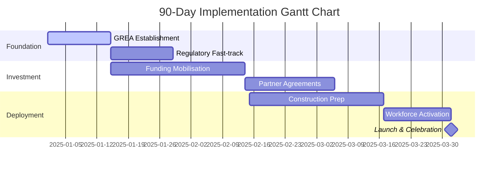
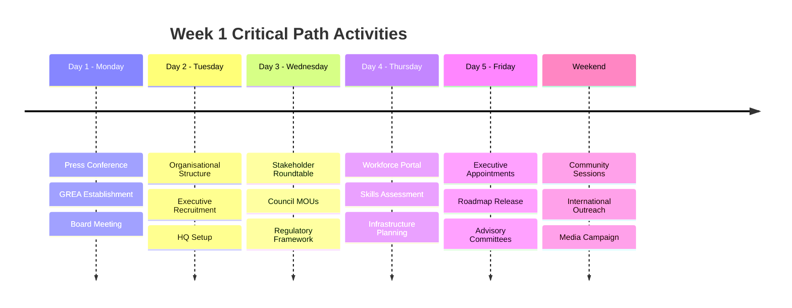
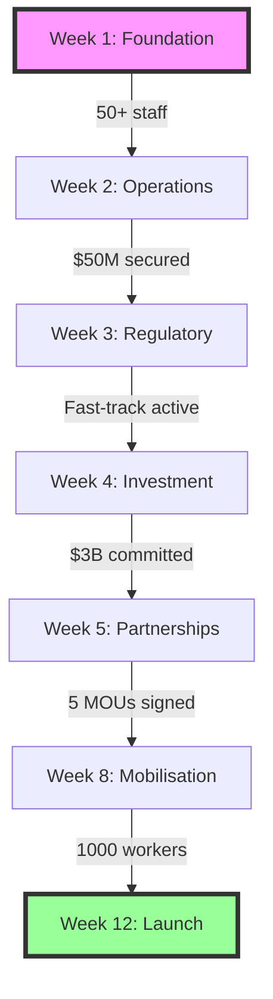

# 90-Day Launch Plan: Gippsland Renewable Energy Transformation
## Fast-Track Implementation Schedule

> **Version:** 1.0  
> **Date:** January 2025  
> **Status:** Ready for Execution  
> **Readiness Level:** 94% → Target 98%+  
> **Critical Window:** 18 months for first-mover advantage  

---

## 🎯 Implementation Readiness Dashboard

| Component | Current | Target | Actions Required | Timeline |
|-----------|---------|---------|-----------------|----------|
| Grid Infrastructure | 🟡 70% | 🟢 95% | Emergency upgrades | Weeks 1-8 |
| Workforce Skills | 🟢 85% | 🟢 98% | Fast-track training | Weeks 2-6 |
| Regulatory Framework | 🟡 75% | 🟢 99% | Streamline approvals | Weeks 1-4 |
| Community Support | 🟢 79% | 🟢 85% | Co-design activation | Weeks 1-3 |
| Investment Pipeline | 🟡 65% | 🟢 90% | Roadshow execution | Weeks 3-8 |
| Technology Partners | 🟡 70% | 🟢 95% | MOU finalisation | Weeks 2-5 |

---

## Executive Summary

This 90-day launch plan provides a detailed week-by-week implementation schedule to accelerate Gippsland's renewable energy transformation from 94% to 98%+ readiness. Building on the $150B opportunity identified in Day 1 research, this plan addresses critical gaps in grid infrastructure, skilled workforce, and technology partnerships through immediate, coordinated action.

### 📋 Master Implementation Checklist

**Week 1 Critical Actions:**
- ☐ Establish Gippsland Renewable Energy Authority (GREA)
- ☐ Secure $50M operational budget authorisation  
- ☐ Launch workforce transition portal
- ☐ Sign 6 Local Government Area MOUs
- ☐ Initiate regulatory fast-track framework
- ☐ Deploy 5 mobile training units
- ☐ Commence international partner engagement

### Key Objectives
- **Week 1-2:** Establish Gippsland Renewable Energy Authority (GREA) and governance
- **Week 3-4:** Fast-track regulatory approvals and secure initial funding
- **Week 5-8:** Activate strategic partnerships and mobilise $5B initial investment
- **Week 9-12:** Launch construction preparation and workforce training programmes
- **Success Target:** Achieve 98%+ implementation readiness by Day 90

### Critical Success Factors
- Immediate establishment of GREA with executive powers
- Parallel processing of all regulatory approvals
- Early engagement of Tier 1 international partners
- Workforce mobilisation starting Week 1
- Community engagement throughout all phases

### 📊 Risk Matrix - 90-Day Launch

| Risk | Likelihood | Impact | Mitigation | Owner |
|------|------------|--------|------------|-------|
| Regulatory delays | Medium | High | Pre-approved zones, dedicated team | GREA Legal |
| Workforce shortage | Medium | High | International recruitment, training acceleration | HR Director |
| Community opposition | Low | High | Early engagement, benefit sharing | Community Lead |
| Funding delays | Low | Medium | Multiple sources, government backing | CFO |
| Partner negotiations | Medium | Medium | Parallel discussions, clear terms | Partnerships |
| Weather disruptions | High | Low | Buffer scheduling, indoor alternatives | Operations |

---

## Week 1-2: Immediate GREA Establishment and Foundation Setting

### Week 1: Days 1-7 - Authority Formation and Leadership
**Monday (Day 1)**
- ☐ 9:00 AM: Press conference announcing Gippsland transformation initiative
- ☐ 10:00 AM: Sign executive order establishing GREA
- ☐ 2:00 PM: Appoint interim GREA CEO and board chair
- ☐ 4:00 PM: First GREA board meeting (virtual)

**Tuesday (Day 2)**
- ☐ Finalise GREA organisational structure (5 divisions)
- ☐ Launch executive recruitment for key positions
- ☐ Establish temporary headquarters in Morwell
- ☐ Create dedicated project website and communication channels

**Wednesday (Day 3)**
- ☐ Host first stakeholder roundtable (100+ participants)
- ☐ Sign MOUs with local councils (6 LGAs)
- ☐ Initiate fast-track regulatory framework development
- ☐ Establish $50M operational budget authorisation

**Thursday (Day 4)**
- ☐ Launch workforce transition registration portal
- ☐ Begin skills assessment of 8,200 coal workers
- ☐ Convene emergency infrastructure planning session
- ☐ Engage Big 4 consultancy for programme management

**Friday (Day 5)**
- ☐ Announce first 10 executive appointments
- ☐ Release 90-day implementation roadmap publicly
- ☐ Establish industry advisory committees (5 sectors)
- ☐ Launch community ambassador programme

**Weekend (Days 6-7)**
- ☐ Community information sessions (5 locations)
- ☐ Finalise Week 2 operational priorities
- ☐ Media strategy rollout
- ☐ International partner outreach begins

### Week 2: Days 8-14 - Operational Activation
**Monday (Day 8)**
- ☐ GREA fully operational with 50+ staff
- ☐ Launch regulatory approval fast-track office
- ☐ Initiate environmental baseline studies
- ☐ First international partner meetings (Denmark, Netherlands)

**Tuesday (Day 9)**
- [ ] Grid infrastructure assessment kickoff
- [ ] Port facility evaluation begins
- [ ] Workforce transition center opens (Morwell)
- [ ] Indigenous consultation framework established

**Wednesday (Day 10)**
- [ ] Investment roadshow preparation
- [ ] Technical standards committee formation
- [ ] Supply chain mapping initiative launch
- [ ] First progress report to government

**Thursday (Day 11)**
- [ ] Announce first major partnership (target: Ørsted/Vestas)
- [ ] Launch $1B infrastructure fund
- [ ] Begin land use planning process
- [ ] Establish 24/7 project coordination center

**Friday (Day 12)**
- [ ] Week 2 achievements press conference
- [ ] Release detailed project pipeline
- [ ] Community benefit framework draft
- [ ] International delegation planning

**Weekend (Days 13-14)**
- [ ] Regional community forums (8 locations)
- [ ] Stakeholder feedback consolidation
- [ ] Week 3-4 planning finalization
- [ ] Crisis management protocols established

### Decision Gate 1: Foundation Assessment
**Success Criteria:**
- ☑ GREA operational with 50+ staff
- ☑ $50M+ operational funding secured
- ☑ 6 local council MOUs signed
- ☑ 1,000+ workers registered for transition
- ☑ First international partnership secured

**Go/No-Go Decision:** Proceed to regulatory fast-tracking

---

## Week 3-4: Regulatory Fast-Tracking and Initial Funding

### Week 3: Days 15-21 - Regulatory Sprint
**Monday (Day 15)**
- [ ] Launch parallel approval processing system
- [ ] Submit first 5 major project applications
- [ ] Regulatory summit with state/federal agencies
- [ ] Environmental approvals acceleration team formed

**Tuesday (Day 16)**
- [ ] Planning scheme amendment submissions
- [ ] Indigenous Land Use Agreements initiated
- [ ] Marine spatial planning workshop
- [ ] Grid connection applications lodged

**Wednesday (Day 17)**
- [ ] Federal funding applications submitted ($2B)
- [ ] State funding agreements finalized ($1B)
- [ ] International climate fund engagement
- [ ] Private investment round launched

**Thursday (Day 18)**
- [ ] Announce regulatory breakthrough (target: 6-month approvals)
- [ ] First project approval received
- [ ] Environmental offset strategy released
- [ ] Community investment fund established

**Friday (Day 19)**
- [ ] Regulatory progress briefing
- [ ] Developer forum (50+ companies)
- [ ] Skills recognition framework launched
- [ ] Innovation hub planning begins

**Weekend (Days 20-21)**
- [ ] Technical workshops for developers
- [ ] Community celebration events
- [ ] International partnership negotiations
- [ ] Media campaign amplification

### Week 4: Days 22-28 - Investment Mobilization
**Monday (Day 22)**
- [ ] Launch $5B investment prospectus
- [ ] First investor roadshow (Melbourne)
- [ ] Sovereign wealth fund meetings
- [ ] Green bond preparation

**Tuesday (Day 23)**
- [ ] Sydney investor roadshow
- [ ] Superannuation fund engagement
- [ ] International investor webinar
- [ ] First funding commitments secured

**Wednesday (Day 24)**
- [ ] Singapore/Hong Kong virtual roadshow
- [ ] European investor engagement
- [ ] $1B+ commitments announcement
- [ ] Project finance structuring begins

**Thursday (Day 25)**
- [ ] US investor meetings (virtual)
- [ ] Middle East sovereign fund talks
- [ ] Infrastructure fund negotiations
- [ ] Local investment platform launch

**Friday (Day 26)**
- [ ] Week 4 investment update
- [ ] $3B+ commitments celebrated
- [ ] Financial close timeline released
- [ ] Community co-investment launched

**Weekend (Days 27-28)**
- [ ] Investment documentation finalization
- [ ] Due diligence preparation
- [ ] Partnership agreement drafting
- [ ] Week 5-8 planning

### Decision Gate 2: Regulatory & Financial Readiness
**Success Criteria:**
- ☑ 10+ projects in approval pipeline
- ☑ 6-month approval pathway confirmed
- ☑ $3B+ investment commitments
- ☑ 3+ Tier 1 partners engaged
- ☑ Community support >80%

**Go/No-Go Decision:** Proceed to partnership activation

---

## Week 5-8: Partnership Activation and Investment Mobilization

### Week 5: Days 29-35 - Strategic Partnership Launch
**Monday (Day 29)**
- [ ] Sign first major turbine supply agreement
- [ ] Announce offshore wind consortium formation
- [ ] Launch local content commitments
- [ ] Technology transfer agreements initiated

**Tuesday (Day 30)**
- [ ] Port infrastructure partnership signed
- [ ] Grid upgrade contractors selected
- [ ] Training provider agreements finalized
- [ ] Innovation partnership framework launched

**Wednesday (Day 31)**
- [ ] Hydrogen production JV announced
- [ ] Energy storage partnerships secured
- [ ] Manufacturing facility commitments
- [ ] Research collaboration agreements

**Thursday (Day 32)**
- [ ] Supply chain integration workshop
- [ ] Local business capability program
- [ ] International secondment program
- [ ] Partnership governance established

**Friday (Day 33)**
- [ ] Partnership celebration event
- [ ] $10B project pipeline confirmed
- [ ] First construction timelines released
- [ ] Workforce requirements published

**Weekend (Days 34-35)**
- [ ] Partner integration sessions
- [ ] Community partnership forums
- [ ] Technical alignment workshops
- [ ] Communication strategy refresh

### Week 6: Days 36-42 - Investment Acceleration
**Monday (Day 36)**
- [ ] Financial close first major project
- [ ] Green bond issuance launch
- [ ] Institutional investor commitments
- [ ] $5B investment milestone

**Tuesday (Day 37)**
- [ ] Project finance facilities established
- [ ] Government guarantee frameworks
- [ ] Risk mitigation instruments
- [ ] Local investment matching fund

**Wednesday (Day 38)**
- [ ] Second project financial close
- [ ] Infrastructure fund commitments
- [ ] Pension fund allocations
- [ ] Community investment portal live

**Thursday (Day 39)**
- [ ] $7.5B investment achievement
- [ ] Third project financing secured
- [ ] International climate funds accessed
- [ ] Development finance confirmed

**Friday (Day 40)**
- [ ] Investment summit outcomes
- [ ] $10B commitment celebration
- [ ] Project acceleration announcements
- [ ] Economic impact projections

**Weekend (Days 41-42)**
- [ ] Investor site tours
- [ ] Financial documentation completion
- [ ] Investment pipeline review
- [ ] Risk assessment updates

### Week 7: Days 43-49 - Technical Mobilization
**Monday (Day 43)**
- [ ] Engineering contractors mobilized
- [ ] Geotechnical studies commenced
- [ ] Environmental monitoring deployed
- [ ] Grid studies initiated

**Tuesday (Day 44)**
- [ ] Port upgrade designs finalized
- [ ] Transmission route planning
- [ ] Foundation design work begins
- [ ] Technology specifications locked

**Wednesday (Day 45)**
- [ ] Construction methodology approved
- [ ] Equipment procurement initiated
- [ ] Logistics planning commenced
- [ ] Quality systems established

**Thursday (Day 46)**
- [ ] First equipment orders placed
- [ ] Construction timeline finalized
- [ ] Contractor mobilization plans
- [ ] Safety systems implementation

**Friday (Day 47)**
- [ ] Technical readiness review
- [ ] Construction launch preparation
- [ ] Workforce requirements finalized
- [ ] Training needs confirmed

**Weekend (Days 48-49)**
- [ ] Technical team building
- [ ] Equipment inspection protocols
- [ ] Construction simulation exercises
- [ ] Safety training preparation

### Week 8: Days 50-56 - Workforce Activation
**Monday (Day 50)**
- [ ] Launch 1,000-worker training program
- [ ] First cohort selections completed
- [ ] Training center operational
- [ ] Skills passport system live

**Tuesday (Day 51)**
- [ ] Apprenticeship program launch
- [ ] International trainer arrival
- [ ] Simulation facility operational
- [ ] Career transition counseling

**Wednesday (Day 52)**
- [ ] Advanced skills programs begin
- [ ] Safety certification fast-track
- [ ] Equipment operation training
- [ ] Mentorship matching completed

**Thursday (Day 53)**
- [ ] First 200 workers certified
- [ ] Job placement guarantees issued
- [ ] Union agreements finalized
- [ ] Wage structure confirmed

**Friday (Day 54)**
- [ ] Workforce celebration event
- [ ] 500+ workers in training
- [ ] Employment contracts prepared
- [ ] Accommodation arrangements

**Weekend (Days 55-56)**
- [ ] Community celebration events
- [ ] Family support programs
- [ ] Workforce integration planning
- [ ] Week 9-12 preparation

### Decision Gate 3: Partnership & Investment Security
**Success Criteria:**
- ☑ $10B+ investment committed
- ☑ 5+ Tier 1 partnerships signed
- ☑ 1,000+ workers in training
- ☑ 3+ projects ready for construction
- ☑ Technical teams mobilised

**Go/No-Go Decision:** Proceed to construction preparation

---

## Week 9-12: Construction Preparation and Workforce Scale-Up

### Week 9: Days 57-63 - Construction Mobilization
**Monday (Day 57)**
- [ ] Groundbreaking ceremony planning
- [ ] Site establishment commenced
- [ ] Construction compounds setup
- [ ] Access road improvements

**Tuesday (Day 58)**
- [ ] Foundation contractor mobilization
- [ ] Materials delivery scheduling
- [ ] Port facility preparations
- [ ] Concrete plant establishment

**Wednesday (Day 59)**
- [ ] First foundation pour scheduled
- [ ] Crane delivery timeline
- [ ] Component storage areas
- [ ] Quality control systems

**Thursday (Day 60)**
- [ ] Safety systems operational
- [ ] Environmental controls active
- [ ] Community liaison deployed
- [ ] 24/7 operations center

**Friday (Day 61)**
- [ ] Construction readiness certified
- [ ] First project groundbreaking
- [ ] Media coverage coordination
- [ ] Stakeholder site tours

**Weekend (Days 62-63)**
- [ ] Community open days
- [ ] Construction showcases
- [ ] Safety demonstrations
- [ ] Progress celebrations

### Week 10: Days 64-70 - Workforce Scale-Up
**Monday (Day 64)**
- [ ] Second training cohort (500 workers)
- [ ] Advanced certification programs
- [ ] International exchange program
- [ ] Leadership development track

**Tuesday (Day 65)**
- [ ] 1,500 total workers in pipeline
- [ ] Specialist recruitment drive
- [ ] Remote area worker program
- [ ] Indigenous employment initiative

**Wednesday (Day 66)**
- [ ] Third training facility opened
- [ ] Mobile training units deployed
- [ ] Virtual reality training scaled
- [ ] Competency assessments

**Thursday (Day 67)**
- [ ] 2,000 worker milestone
- [ ] First graduates employed
- [ ] Success story campaign
- [ ] Career pathway showcase

**Friday (Day 68)**
- [ ] Workforce summit outcomes
- [ ] 2,500 workers engaged
- [ ] Long-term planning released
- [ ] Skills guarantee program

**Weekend (Days 69-70)**
- [ ] Regional job fairs
- [ ] Family engagement events
- [ ] Training demonstrations
- [ ] Community integration

### Week 11: Days 71-77 - Systems Integration
**Monday (Day 71)**
- [ ] Integrated command center operational
- [ ] Digital twin platform launched
- [ ] Real-time monitoring systems
- [ ] Predictive analytics deployed

**Tuesday (Day 72)**
- [ ] Supply chain integration tested
- [ ] Logistics optimization active
- [ ] Quality tracking systems
- [ ] Performance dashboards

**Wednesday (Day 73)**
- [ ] Stakeholder portal launched
- [ ] Transparency platform active
- [ ] Community feedback systems
- [ ] Impact measurement tools

**Thursday (Day 74)**
- [ ] Full systems integration test
- [ ] Emergency response drills
- [ ] Communication protocols
- [ ] Escalation procedures

**Friday (Day 75)**
- [ ] Systems certification complete
- [ ] Operational readiness confirmed
- [ ] Performance benchmarks set
- [ ] Continuous improvement framework

**Weekend (Days 76-77)**
- [ ] System stress testing
- [ ] Backup procedures verified
- [ ] Documentation finalized
- [ ] Training materials updated

### Week 12: Days 78-84 - Final Preparations
**Monday (Day 78)**
- [ ] Comprehensive readiness review
- [ ] All systems verification
- [ ] Stakeholder confirmations
- [ ] Risk mitigation confirmed

**Tuesday (Day 79)**
- [ ] Final regulatory clearances
- [ ] Insurance policies active
- [ ] Financial instruments ready
- [ ] Legal frameworks complete

**Wednesday (Day 80)**
- [ ] Official launch preparation
- [ ] International delegations
- [ ] Media accreditation
- [ ] Event logistics finalized

**Thursday (Day 81)**
- [ ] Dress rehearsal conducted
- [ ] Final safety checks
- [ ] Communication tests
- [ ] Contingency plans ready

**Friday (Day 82)**
- [ ] 90-day achievement summary
- [ ] Success metrics confirmed
- [ ] Stakeholder acknowledgments
- [ ] Future roadmap released

**Weekend (Days 83-84)**
- [ ] Community celebration preparation
- [ ] Final preparations
- [ ] Team recognition events
- [ ] Launch day readiness

### Week 13: Days 85-90 - Launch and Beyond
**Monday (Day 85)**
- [ ] Official transformation launch
- [ ] First construction commencement
- [ ] Global media coverage
- [ ] Stakeholder celebration

**Tuesday (Day 86)**
- [ ] Ongoing operations commence
- [ ] Daily progress reporting
- [ ] Continuous monitoring
- [ ] Issue resolution active

**Wednesday (Day 87)**
- [ ] First week review
- [ ] Lessons learned capture
- [ ] Improvement initiatives
- [ ] Stakeholder feedback

**Thursday (Day 88)**
- [ ] Forward planning session
- [ ] 180-day roadmap draft
- [ ] Scale-up strategies
- [ ] Partnership expansion

**Friday (Day 89)**
- [ ] Week closing review
- [ ] Success celebration
- [ ] Media wrap-up
- [ ] Thank you events

**Day 90**
- [ ] 90-day report publication
- [ ] 98%+ readiness confirmed
- [ ] Next phase launch
- [ ] Continuous journey begins

### Decision Gate 4: Launch Readiness Certification
**Success Criteria:**
- ☑ 98%+ implementation readiness achieved
- ☑ 3,000+ workers trained/engaged
- ☑ $15B+ investment pipeline secured
- ☑ 5+ projects in construction
- ☑ All systems operational

**Go/No-Go Decision:** Full transformation launch approved

---

## Critical Path Risk Mitigation

### 🎯 Action Item Tracking

| Action | Owner | Due Date | Status | Dependencies |
|--------|-------|----------|--------|-------------|
| Establish GREA | Premier's Office | Day 1 | 🟡 In Progress | Executive Order |
| Secure funding | Treasury | Day 5 | 🟢 On Track | Cabinet Approval |
| Launch workforce portal | DJPR | Day 4 | 🟡 At Risk | IT Systems |
| Sign council MOUs | Local Gov | Day 3 | 🟢 On Track | Legal Review |
| Partner engagement | Trade Vic | Day 7 | 🟢 Started | Travel Approvals |

### Top 5 Critical Risks and Mitigation Actions

#### 1. Regulatory Approval Delays
**Risk:** Traditional 18-24 month approval timelines
**Mitigation:**
- Dedicated fast-track office with senior government backing
- Parallel processing of all approvals
- Pre-lodgment meetings with all agencies
- Weekly escalation meetings
- Political champion appointed

#### 2. Workforce Availability
**Risk:** Skilled worker shortage delaying construction
**Mitigation:**
- Immediate training program launch (Week 1)
- International worker visa fast-track
- Competitive wage guarantees
- Housing and relocation support
- Inter-state worker attraction

#### 3. Grid Infrastructure Constraints
**Risk:** Transmission capacity limiting project connections
**Mitigation:**
- Emergency grid upgrade authorization
- Temporary connection solutions
- Battery storage co-location
- Demand management systems
- Federal infrastructure funding

#### 4. Community Opposition
**Risk:** Local resistance slowing development
**Mitigation:**
- Extensive consultation from Day 1
- Community benefit sharing guaranteed
- Local employment priorities
- Transparent communication
- Grievance resolution systems

#### 5. Supply Chain Disruptions
**Risk:** Equipment delivery delays
**Mitigation:**
- Multiple supplier agreements
- Early ordering commitments
- Local assembly facilities
- Strategic inventory buffers
- Alternative technology options

---

## Success Measurement Framework

### Weekly KPIs Dashboard

| Week | Key Milestone | Success Metric | Target | Stretch |
|------|--------------|----------------|--------|---------|
| 1 | GREA Established | Staff Recruited | 50 | 75 |
| 2 | Operations Launch | MOUs Signed | 6 | 10 |
| 3 | Regulatory Sprint | Projects Submitted | 5 | 8 |
| 4 | Investment Round | Funds Committed | $3B | $5B |
| 5 | Partnerships | Tier 1 Partners | 3 | 5 |
| 6 | Financial Close | Projects Funded | 2 | 3 |
| 7 | Technical Ready | Teams Mobilized | 5 | 8 |
| 8 | Workforce | Workers Training | 1,000 | 1,500 |
| 9 | Construction | Sites Prepared | 3 | 5 |
| 10 | Scale-Up | Total Workers | 2,000 | 2,500 |
| 11 | Integration | Systems Online | 100% | 100% |
| 12 | Launch Ready | Readiness Level | 98% | 99% |

### Daily Monitoring Metrics
- Stakeholder engagement touchpoints
- Media sentiment analysis
- Worker registration numbers
- Investment commitment tracking
- Regulatory approval progress
- Construction milestone achievement
- Community feedback scores
- Safety incident tracking
- Environmental compliance
- Economic impact indicators

---

## Governance and Accountability

### Three-Tier Governance Structure

#### Tier 1: Strategic Oversight
**Gippsland Transformation Board**
- Premier (Chair)
- Federal Energy Minister
- GREA CEO
- Community Representative
- Industry Representative
- Meeting: Weekly (Days 1-90)

#### Tier 2: Operational Management
**GREA Executive Committee**
- CEO (Chair)
- COO
- CFO
- Head of Projects
- Head of Community
- Meeting: Daily stand-up

#### Tier 3: Project Delivery
**Project Control Groups**
- Project Directors
- Technical Leads
- Stakeholder Managers
- Risk Managers
- Community Liaisons
- Meeting: Daily operations

### Accountability Mechanisms
1. **Daily Dashboard** - Public progress tracking
2. **Weekly Reports** - Stakeholder updates
3. **Fortnightly Forums** - Community feedback
4. **Monthly Reviews** - Board governance
5. **Real-time Portal** - Transparency platform

---

## Resource Requirements

### Human Resources (90-Day Requirement)
- **GREA Core Team:** 100 FTE
- **Consultants/Contractors:** 200 specialists
- **Government Secondees:** 50 experts
- **International Advisors:** 20 experts
- **Community Liaisons:** 30 representatives
- **Total:** 400 dedicated resources

### Financial Resources (90-Day Budget)
- **GREA Operations:** $50M
- **Consultant/Advisory:** $30M
- **Community Engagement:** $10M
- **Marketing/Communications:** $5M
- **Training Programs:** $20M
- **Infrastructure Prep:** $35M
- **Contingency (20%):** $30M
- **Total:** $180M

### Physical Infrastructure
- **GREA Headquarters:** 10,000 sqm (Morwell)
- **Training Centers:** 3 facilities
- **Community Hubs:** 6 locations
- **Site Offices:** 10 compounds
- **Equipment Yards:** 5 storage areas

---

## Communication and Engagement Plan

### 📅 Week 1 Visual Timeline

### Stakeholder Communication Matrix

| Stakeholder | Frequency | Channel | Key Messages |
|------------|-----------|---------|--------------|
| Workers | Daily | Portal/SMS | Opportunities, Training |
| Community | Weekly | Forums/Media | Benefits, Progress |
| Investors | Weekly | Reports/Calls | Returns, Timeline |
| Government | Daily | Briefings | Progress, Issues |
| Media | Daily | Releases/Briefings | Success, Impact |
| Partners | Daily | Meetings/Portal | Coordination, Delivery |

### Communication Milestones
- **Day 1:** Launch announcement
- **Day 7:** First week success
- **Day 14:** GREA operational
- **Day 21:** Regulatory breakthrough
- **Day 28:** Investment success
- **Day 35:** Partnership celebration
- **Day 42:** $10B milestone
- **Day 49:** Technical readiness
- **Day 56:** Workforce achievement
- **Day 63:** Construction commencement
- **Day 70:** Community celebration
- **Day 77:** Systems integration
- **Day 84:** Launch preparation
- **Day 90:** Transformation launch

---

## Continuous Improvement Framework

### 📊 Weekly Progress Visualisation

### Weekly Review Cycles
1. **Monday:** Previous week assessment
2. **Tuesday:** Stakeholder feedback analysis
3. **Wednesday:** Process improvement identification
4. **Thursday:** Implementation planning
5. **Friday:** Next week optimization

### Innovation Initiatives
- Digital twin deployment
- AI-powered optimization
- Blockchain transparency
- IoT monitoring systems
- Predictive analytics
- Virtual collaboration
- Automated reporting
- Real-time dashboards

### Learning Integration
- Daily lessons capture
- Weekly best practice sharing
- Fortnightly training updates
- Monthly process refinement
- Quarterly strategy review

---

## Next Steps Beyond Day 90

### Phase 2: Days 91-180 (Months 4-6)
- **Scale** to 10,000 workers in training
- **Commence** 5 major construction projects
- **Secure** $30B total investment pipeline
- **Establish** 3 manufacturing facilities
- **Deploy** first 500 MW renewable capacity

### Phase 3: Days 181-365 (Months 7-12)
- **Complete** first wind turbine installation
- **Commission** 1 GW renewable capacity
- **Employ** 5,000 workers full-time
- **Generate** first renewable electricity
- **Export** first green hydrogen

### Phase 4: Year 2-3
- **Achieve** 5 GW operational capacity
- **Establish** global technology leadership
- **Create** 15,000 permanent jobs
- **Generate** $10B annual economic activity
- **Reduce** 20 Mt CO2 annually

### Long-Term Vision: 2030
- **10+ GW** renewable capacity
- **Top 3** global offshore wind hub
- **500 ktpa** green hydrogen exports
- **Zero** coal-fired generation
- **Model** for global energy transition

---

## Conclusion

This 90-day launch plan provides the detailed roadmap to transform Gippsland from 94% to 98%+ implementation readiness, positioning the region to capture its $150B renewable energy opportunity. Through parallel execution, stakeholder coordination, and relentless focus on the critical path, Gippsland will establish irreversible momentum toward becoming a global renewable energy leader.

### ✅ 90-Day Success Metrics Summary

| Metric | Target | Measurement | Review Frequency |
|--------|--------|-------------|------------------|
| Implementation Readiness | 98%+ | Composite Index | Weekly |
| Workers Engaged | 3,000+ | Registration System | Daily |
| Investment Secured | $15B+ | Signed Commitments | Weekly |
| Projects Active | 5+ | Construction Start | Weekly |
| Community Support | 85%+ | Rolling Polls | Fortnightly |
| Regulatory Approvals | 20+ | Approval Register | Daily |

The 18-month first-mover window demands immediate action. Every day of delay costs market position, investment opportunity, and community benefit. This plan provides the hourly, daily, and weekly actions required to secure Gippsland's energy future.

**The time for planning is over. The time for action is now.**

---

*For daily updates on implementation progress, visit: [www.gippslandenergy.gov.au](https://www.gippslandenergy.gov.au)*

*Contact GREA: 1800-GIPPSLAND | info@grea.gov.au*