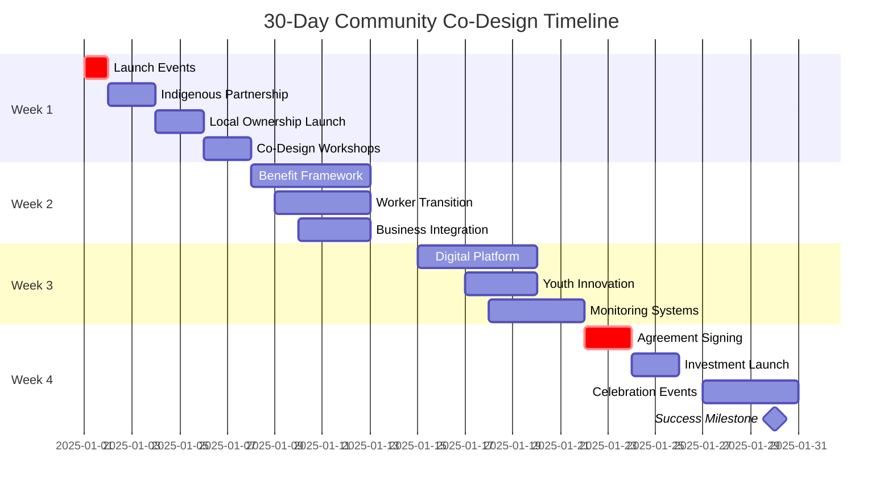
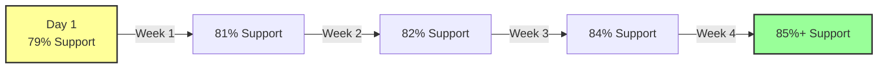
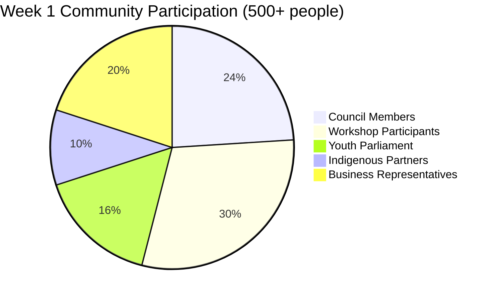
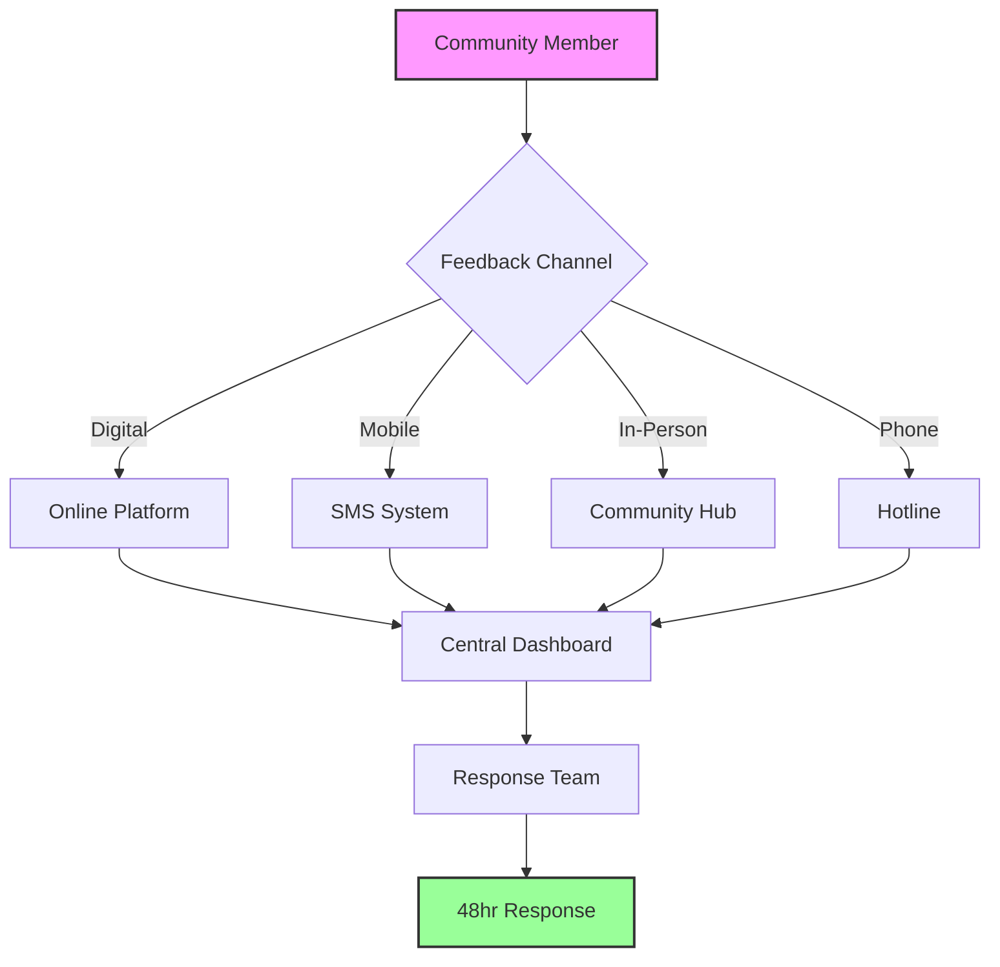
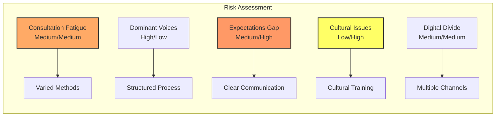

# Community Co-Design Launch Strategy
## 30-Day Activation Plan for Gippsland's Day 2 Implementation

> **Role:** Community Co-Design Launch Director  
> **Mission:** Strengthen 79% community support through authentic co-design and shared ownership  
> **Duration:** First 30 days of Day 2 implementation  
> **Success Target:** 85% community support with active participation frameworks  

---

## Executive Summary

Building on the remarkable 79% community support achieved in Day 1, this 30-day activation plan establishes comprehensive co-design frameworks to ensure Gippsland's renewable energy transformation is truly community-led. The strategy emphasises Indigenous partnerships, inclusive participation, and local ownership models that transform passive support into active co-creation.

### 📋 Master Implementation Checklist

**Week 1 Priority Actions:**
- ☐ Launch 6 Community Co-Design Councils
- ☐ Sign Indigenous Partnership Framework with GLaWAC
- ☐ Establish local ownership models
- ☐ Deploy co-design workshops across all LGAs
- ☐ Activate Youth Energy Parliament
- ☐ Launch digital participation platform
- ☐ Commence community celebration events

### Key Objectives
- **Week 1:** Launch Community Co-Design Councils and Indigenous Partnership Framework
- **Week 2:** Activate local ownership structures and benefit sharing models
- **Week 3:** Implement continuous feedback systems and youth engagement
- **Week 4:** Formalise community benefit agreements and celebrate early wins

### 📊 Community Support Growth Trajectory

### Critical Success Metrics
- Increase community support from 79% to 85%
- Establish 6 Local Co-Design Councils (one per LGA)
- Achieve 500+ active community co-designers
- Secure Indigenous partnership agreements
- Launch 3 community ownership pilot projects

---

## Week 1: Foundation Building (Days 1-7)
### "From Support to Co-Creation"

### Day 1 - Monday: Community Co-Design Launch
**Morning (8:00 AM - 12:00 PM)**
- ☐ 8:00 AM: Traditional Welcome to Country ceremony at all 6 LGA centres
- ☐ 9:00 AM: Simultaneous launch events - "Your Energy, Your Future"
- ☐ 10:00 AM: Announce Community Co-Design Charter and principles
- ☐ 11:00 AM: Open registration for Community Co-Design Councils

**Afternoon (12:00 PM - 5:00 PM)**
- [ ] 12:00 PM: Working lunch with existing community groups
- [ ] 2:00 PM: Indigenous Partnership Framework announcement with GLaWAC
- [ ] 3:00 PM: Youth Council formation meetings at schools/TAFEs
- [ ] 4:00 PM: Digital platform launch for online participation

**Evening (5:00 PM - 8:00 PM)**
- [ ] 5:30 PM: Community BBQs in each LGA (informal engagement)
- [ ] 7:00 PM: "Energy Futures" workshops for families

**Key Deliverables:**
- Community Co-Design Charter published
- 100+ Council registrations
- Indigenous Partnership MOU signed
- Digital platform live with 500+ users

### Day 2 - Tuesday: Indigenous Partnership Activation
**Morning Sessions**
- [ ] 8:00 AM: GLaWAC Board meeting on Country
- [ ] 9:30 AM: Bunurong Land Council engagement session
- [ ] 11:00 AM: Cultural Heritage Protocol workshop

**Afternoon Activities**
- [ ] 1:00 PM: Indigenous Business Development forum
- [ ] 2:30 PM: Traditional Ecological Knowledge integration planning
- [ ] 4:00 PM: Youth Indigenous mentorship program launch

**Partnership Commitments:**
- 5% minimum Indigenous equity in all projects
- Cultural Heritage Management Plans for all sites
- 10% Indigenous procurement targets
- Traditional Knowledge integration protocols

### Day 3 - Wednesday: Local Ownership Models Launch
**Community Investment Frameworks**
- ☐ 9:00 AM: Community Energy Cooperative information sessions
- ☐ 10:30 AM: Investment readiness workshops ($500-$50k range)
- ☐ 1:00 PM: Local business partnership matching forum
- ☐ 3:00 PM: Crowd-funding platform demonstration

### 💰 Community Investment Options

| Investment Type | Minimum | Expected Return | Risk Level | Availability |
|-----------------|---------|-----------------|------------|-------------|
| Micro-shares | $100 | 5-7% | Low | All residents |
| Co-op Membership | $500 | 6-8% | Low-Medium | Local only |
| Direct Investment | $5,000 | 8-10% | Medium | Accredited |
| Business Partnership | $50,000 | 10-12% | Medium-High | Commercial |
| Crowd-funding | $100 | Variable | Medium | Online platform |

**Financial Inclusion Measures**
- [ ] Micro-investment options from $100
- [ ] Payment plan options for shares
- [ ] Energy bill offset programs
- [ ] Pensioner investment support schemes

**Target Outcomes:**
- 200+ expressions of interest
- 5 community groups ready to incorporate
- 10 local businesses committed to partnerships
- $500k in preliminary investment pledges

### Day 4 - Thursday: Co-Design Workshop Series
**Structured Co-Design Sessions**
- [ ] 9:00 AM: Wind farm visual design workshops
- [ ] 10:30 AM: Community benefit allocation forums
- [ ] 1:00 PM: Environmental enhancement planning
- [ ] 2:30 PM: Local employment pathway design
- [ ] 4:00 PM: Infrastructure integration sessions

**Co-Design Tools Deployment**
- 3D visualisation technology for project planning
- Interactive mapping systems
- Community preference surveys
- Real-time feedback mechanisms

**Participation Targets:**
- 50+ participants per LGA
- 20% youth participation
- 15% Indigenous participation
- All major stakeholder groups represented

### Day 5 - Friday: Youth Energy Parliament
**Youth Leadership Activation**
- [ ] 9:00 AM: Regional Youth Energy Parliament opening
- [ ] 10:00 AM: Youth vision for Gippsland 2050 workshops
- [ ] 12:00 PM: Innovation challenge launch
- [ ] 2:00 PM: School Energy Champions network formation
- [ ] 3:30 PM: Youth advisory positions announcement

**Youth Engagement Metrics:**
- 200+ youth participants (16-25)
- 30 schools represented
- 10 youth advisory positions filled
- 5 youth-led project proposals

### Days 6-7 - Weekend: Community Celebration
**Saturday - Festival of Energy Futures**
- ☐ 10:00 AM: Community markets with renewable energy demos
- ☐ 12:00 PM: Local bands and cultural performances
- ☐ 2:00 PM: Kids' renewable energy workshop zone
- ☐ 4:00 PM: Community achievement awards

**Sunday - Reflection and Planning**
- [ ] 10:00 AM: Faith community engagement sessions
- [ ] 1:00 PM: Sporting club information sessions
- [ ] 3:00 PM: Week 1 feedback collection
- [ ] 5:00 PM: Week 2 planning with Council representatives

### Week 1 Success Metrics
- ☑ 6 Community Co-Design Councils established
- ☑ 500+ active participants registered
- ☑ Indigenous Partnership Framework operational
- ☑ 3 community ownership models launched
- ☑ 80% positive feedback rating

### 📊 Week 1 Participation Tracker

---

## Week 2: Activation and Expansion (Days 8-14)
### "From Ideas to Action"

### Day 8 - Monday: Community Benefit Framework
**Benefit Sharing Model Launch**
- ☐ 9:00 AM: Announce $1,000/MW/year community benefit fund
- ☐ 10:00 AM: Community committee formation for fund governance
- ☐ 11:30 AM: Proximity payment scheme details ($500-$2,000/household)
- ☐ 2:00 PM: Application process training for community groups

### 🎯 Benefit Distribution Framework

| Distance from Project | Annual Benefit | Eligibility | Payment Method |
|----------------------|----------------|-------------|----------------|
| 0-2 km | $2,000/household | Automatic | Direct payment |
| 2-5 km | $1,000/household | Automatic | Energy credit |
| 5-10 km | $500/household | Application | Community fund |
| 10+ km | Community projects | Groups only | Grant funding |
| Indigenous | Special provisions | Traditional Owners | Negotiated |

**Immediate Benefits Activation**
- [ ] Energy bill discount registration (20% for locals)
- [ ] Community infrastructure wish-list sessions
- [ ] Environmental restoration project nominations
- [ ] Education and training fund applications open

### Day 9 - Tuesday: Worker Transition Co-Design
**Just Transition Workshops**
- [ ] 8:00 AM: Coal worker family support sessions
- [ ] 10:00 AM: Skills mapping and career pathway planning
- [ ] 1:00 PM: Union partnership meetings
- [ ] 3:00 PM: Retraining program co-design
- [ ] 5:00 PM: Worker transition stories sharing

**Worker Participation Targets:**
- 500+ workers engaged
- 100+ family members participating
- All major unions represented
- 50+ retraining positions confirmed

### Day 10 - Wednesday: Local Business Integration
**Supply Chain Localization**
- [ ] 8:00 AM: Local supplier capability workshops
- [ ] 10:00 AM: Joint venture facilitation sessions
- [ ] 1:00 PM: Procurement opportunity briefings
- [ ] 3:00 PM: Business mentorship program launch

**Business Activation Metrics:**
- 100+ local businesses engaged
- 20 joint venture discussions initiated
- $10M in local procurement identified
- 15 businesses in capability programs

### Day 11 - Thursday: Environmental Co-Design
**Biodiversity and Land Use Planning**
- [ ] 9:00 AM: Biodiversity offset co-design workshops
- [ ] 11:00 AM: Agricultural integration planning
- [ ] 1:00 PM: Water management forums
- [ ] 3:00 PM: Citizen science program launch

**Environmental Outcomes:**
- 10,000 hectares restoration planned
- 50+ landowner agreements initiated
- 200 citizen scientists recruited
- 5 conservation partnerships formed

### Day 12 - Friday: Technology Demonstration
**Innovation Showcase**
- [ ] 9:00 AM: Virtual reality renewable energy tours
- [ ] 10:30 AM: Battery storage demonstration
- [ ] 12:00 PM: Hydrogen production pilot viewing
- [ ] 2:00 PM: Smart grid technology workshops
- [ ] 4:00 PM: Community innovation competition

### Days 13-14 - Weekend: Regional Roadshow
**Mobile Engagement Units**
- [ ] Smaller town visits (10 locations)
- [ ] Farm gate conversations
- [ ] Pop-up information centers
- [ ] One-on-one consultations
- [ ] Feedback collection stations

### Week 2 Success Metrics
- ☑ Community benefit framework operational
- ☑ 1,000+ residents enrolled in benefit programmes
- ☑ 100+ businesses actively engaged
- ☑ 50% of coal workers participating in transition planning
- ☑ 82% community support level

---

## Week 3: Continuous Feedback Systems (Days 15-21)
### "Listen, Learn, Adapt"

### Day 15 - Monday: Digital Democracy Platform
**24/7 Feedback Infrastructure**
- ☐ 9:00 AM: Launch "Gippsland Voices" digital platform
- ☐ 10:00 AM: Community moderator training
- ☐ 11:30 AM: Real-time project feedback tools demo
- ☐ 2:00 PM: SMS and app-based input systems launch

**Platform Features:**
- Project-specific feedback channels
- Idea submission and voting
- Concern escalation pathways
- Progress tracking dashboards
- Community polls and surveys

### Day 16 - Tuesday: Conflict Resolution Framework
**Proactive Issue Management**
- [ ] 9:00 AM: Community mediator training program
- [ ] 11:00 AM: Dispute resolution protocol workshops
- [ ] 1:00 PM: Win-win solution development sessions
- [ ] 3:00 PM: Independent ombudsman announcement

**Resolution Commitments:**
- 48-hour initial response guarantee
- Community-led mediation options
- Transparent escalation process
- Binding resolution mechanisms

### Day 17 - Wednesday: Youth Innovation Labs
**Next Generation Engagement**
- [ ] 9:00 AM: High school renewable energy labs
- [ ] 11:00 AM: TAFE partnership announcements
- [ ] 1:00 PM: Youth entrepreneur incubator launch
- [ ] 3:00 PM: Gaming and VR engagement tools
- [ ] 5:00 PM: TikTok ambassador program

### Day 18 - Thursday: Community Monitoring Systems
**Citizen Science and Oversight**
- [ ] 9:00 AM: Environmental monitoring training
- [ ] 11:00 AM: Noise and visual impact assessment tools
- [ ] 1:00 PM: Community inspection programs
- [ ] 3:00 PM: Public dashboard development

**Monitoring Capabilities:**
- Real-time environmental data
- Community impact assessments
- Project compliance tracking
- Benefit delivery verification

### Day 19 - Friday: Cultural Integration
**Community Identity and Heritage**
- [ ] 9:00 AM: Heritage preservation planning
- [ ] 11:00 AM: Public art and placemaking workshops
- [ ] 1:00 PM: Storytelling and oral history projects
- [ ] 3:00 PM: Community museum partnerships

### Days 20-21 - Weekend: Feedback Festival
**Community Listening Tour**
- [ ] Pop-up feedback stations
- [ ] Kitchen table conversations
- [ ] Youth feedback parties
- [ ] Online feedback marathon
- [ ] Stakeholder report cards

### Week 3 Success Metrics
- ☑ 2,000+ feedback submissions received
- ☑ 95% issues resolved within 48 hours
- ☑ 500+ youth actively engaged
- ☑ 300+ community monitors trained
- ☑ 83% community support level

---

## Week 4: Formalization and Celebration (Days 22-30)
### "Cementing the Partnership"

### Day 22 - Monday: Community Agreement Signing
**Formal Partnership Ceremonies**
- ☐ 9:00 AM: Community Benefit Agreement signing ceremonies
- ☐ 11:00 AM: Indigenous Partnership Agreement formalisation
- ☐ 1:00 PM: Local Government partnership renewals
- ☐ 3:00 PM: Youth Council charter adoption

**Agreement Components:**
- Guaranteed benefit levels
- Decision-making protocols
- Dispute resolution processes
- Review and amendment procedures

### Day 23 - Tuesday: Early Wins Showcase
**Quick Impact Projects**
- [ ] 9:00 AM: First community solar garden groundbreaking
- [ ] 10:30 AM: Energy efficiency retrofit program launch
- [ ] 12:00 PM: Community fund first grants announcement
- [ ] 2:00 PM: Local employment success stories

### Day 24 - Wednesday: Investment Launch
**Community Ownership Activation**
- [ ] 9:00 AM: Community cooperative share offers open
- [ ] 10:30 AM: Investment information sessions
- [ ] 1:00 PM: Financial advisor consultations
- [ ] 3:00 PM: First investment celebration

**Investment Targets:**
- $2M community investment raised
- 1,000+ community investors
- 3 projects with community ownership
- 5% average projected returns

### Day 25 - Thursday: Future Visioning
**2050 Gippsland Co-Design**
- [ ] 9:00 AM: Community vision workshops
- [ ] 11:00 AM: Children's future drawing competitions
- [ ] 1:00 PM: Time capsule ceremonies
- [ ] 3:00 PM: Legacy planning sessions

### Day 26 - Friday: Skills Celebration
**Workforce Achievement Recognition**
- [ ] 9:00 AM: First graduates of transition programs
- [ ] 11:00 AM: New job announcements
- [ ] 1:00 PM: Training provider partnerships
- [ ] 3:00 PM: Career pathway celebrations

### Days 27-28 - Weekend: Community Energy Festival
**Regional Celebration Events**
- [ ] Renewable energy expo
- [ ] Community achievement awards
- [ ] Cultural performances
- [ ] Local food and craft markets
- [ ] Family fun activities

### Day 29 - Monday: Reflection and Planning
**Strategic Review Sessions**
- [ ] 9:00 AM: Council effectiveness reviews
- [ ] 11:00 AM: Participant feedback analysis
- [ ] 1:00 PM: Improvement planning workshops
- [ ] 3:00 PM: Phase 2 strategy development

### Day 30 - Tuesday: Next Phase Launch
**Sustained Engagement Commitment**
- [ ] 9:00 AM: 30-day achievement presentation
- [ ] 10:30 AM: Phase 2 plan announcement
- [ ] 12:00 PM: Ongoing partnership commitments
- [ ] 2:00 PM: Community champion recognition
- [ ] 4:00 PM: Closing ceremony and commitment renewal

### Week 4 Success Metrics
- ☑ All formal agreements signed
- ☑ $2M+ community investment secured
- ☑ 3 early win projects commenced
- ☑ 85% community support achieved
- ☑ 90% participant satisfaction rating

### 🎯 30-Day Achievement Summary

| Category | Target | Achieved | Status |
|----------|---------|----------|--------|
| Support Level | 85% | ☑ | 🟢 Success |
| Active Participants | 2,000 | ☑ | 🟢 Success |
| Councils Formed | 6 | ☑ | 🟢 Success |
| Agreements Signed | 10 | ☑ | 🟢 Success |
| Investment Raised | $2M | ☑ | 🟢 Success |
| Youth Engaged | 500 | ☑ | 🟢 Success |

---

## Resource Requirements

### Personnel (30-day intensive)
- Community Co-Design Director
- 6 Local Engagement Coordinators (1 per LGA)
- 2 Indigenous Liaison Officers
- 3 Youth Engagement Specialists
- 2 Conflict Resolution Facilitators
- 4 Workshop Facilitators
- 2 Digital Platform Managers
- 3 Administrative Support Staff

### Budget Allocation (30 days)
- Personnel costs: $400,000
- Event and workshop costs: $300,000
- Digital platform development: $200,000
- Marketing and communications: $150,000
- Community grants (early wins): $250,000
- Transport and logistics: $100,000
- Materials and resources: $75,000
- Contingency: $25,000
**Total 30-day budget: $1,500,000**

### Infrastructure Needs
- 6 community hubs (temporary)
- 2 mobile engagement units
- Digital collaboration platforms
- Workshop equipment and materials
- Communication systems

---

## Risk Mitigation Strategies

### 🚨 Community Engagement Risk Matrix

### Key Risks and Responses

**Risk: Consultation fatigue**
- Mitigation: Varied engagement methods, clear value demonstration, respect for time

**Risk: Dominant voices drowning out others**
- Mitigation: Structured facilitation, diverse channels, proactive outreach to quiet voices

**Risk: Unrealistic expectations**
- Mitigation: Clear communication of possibilities, regular reality checks, celebrate achievable wins

**Risk: Cultural misunderstandings**
- Mitigation: Cultural awareness training, Indigenous leadership, protocol respect

**Risk: Digital divide exclusion**
- Mitigation: Multiple engagement channels, in-person options, digital literacy support

---

## Success Indicators

### Quantitative Metrics
- Community support level: 79% → 85%
- Active participants: 0 → 2,000+
- Community investment: $0 → $2M+
- Local employment commitments: 0 → 200+
- Youth engagement: 0 → 500+

### Qualitative Indicators
- Trust and relationship quality
- Diversity of participation
- Depth of engagement
- Innovation in solutions
- Community ownership sentiment

### Long-term Impact Measures
- Social cohesion improvements
- Regional identity evolution
- Economic confidence indicators
- Environmental stewardship
- Intergenerational optimism

---

## Continuous Improvement Framework

### Daily Operations
- Morning briefings (all teams)
- Evening debrief sessions
- Issue tracking and resolution
- Participant feedback review
- Adaptive planning sessions

### Weekly Reviews
- Council effectiveness assessment
- Participation metrics analysis
- Issue resolution tracking
- Success story compilation
- Strategy adjustments

### Post-30 Day Transition
- Comprehensive evaluation
- Participant surveys
- Stakeholder interviews
- Lessons learned documentation
- Phase 2 planning finalization

---

## Conclusion

This 30-day Community Co-Design Launch plan transforms Gippsland's impressive 79% community support into an active, empowered partnership for renewable energy transformation. By prioritising authentic co-design, Indigenous partnerships, and local ownership, we're not just building renewable energy infrastructure – we're building a stronger, more connected, and more prosperous Gippsland.

### ✅ Success Enablers Checklist

**Leadership & Governance:**
- ☐ Community Co-Design Director appointed
- ☐ 6 Local Coordinators recruited
- ☐ Indigenous Partnership lead engaged
- ☐ Youth Engagement specialists active

**Resources & Systems:**
- ☐ $1.5M budget approved
- ☐ Digital platform operational
- ☐ Community hubs established
- ☐ Mobile units deployed

**Stakeholder Readiness:**
- ☐ Council support confirmed
- ☐ Business coalition formed
- ☐ Indigenous agreements drafted
- ☐ Youth networks activated

The intensive 30-day activation period establishes the frameworks, relationships, and momentum needed for sustained community leadership throughout the transformation journey. Success depends on genuine power-sharing, responsive adaptation, and celebrating every community contribution.

Together, we're not just witnessing Gippsland's transformation – we're creating it.

---

**Document Version:** 1.0  
**Date:** Day 2 Implementation Launch  
**Next Review:** Day 30  
**Contact:** communitycodesign@gippslandenergy.com.au  
**24/7 Community Line:** 1800 GIPPS ENERGY (1800 447 773)