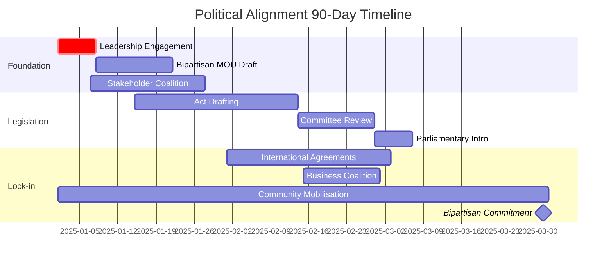
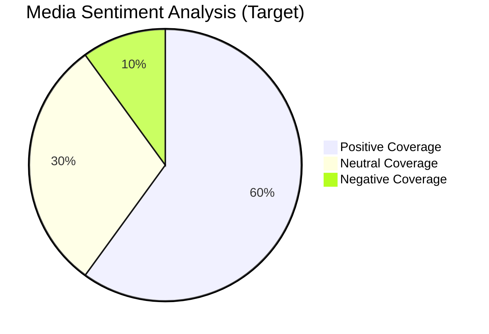
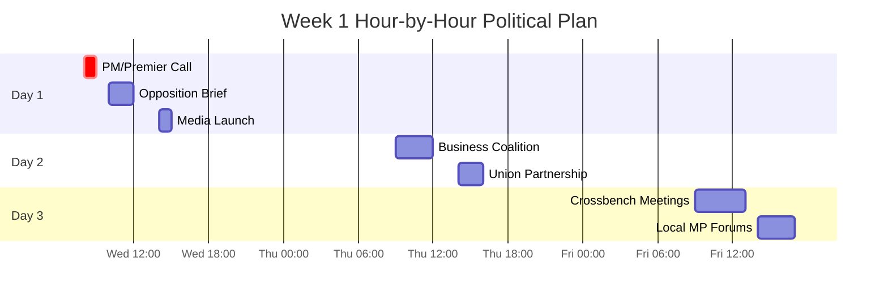

# Political Alignment Strategy for Gippsland's Renewable Energy Transformation
## Securing Bipartisan 20-Year Commitment for Day 2 Implementation

> **Role:** Political Alignment Strategy Chief  
> **Mission:** Develop and implement political strategies to secure bipartisan support across all government levels  
> **Duration:** Day 2 implementation phase  
> **Success Target:** 20-year bipartisan policy commitment with investor confidence mechanisms  



---

## Executive Summary

This political alignment strategy addresses the critical challenge of securing long-term bipartisan political support for Gippsland's $70 billion renewable energy transformation. Building on the comprehensive policy framework established in Day 1, this strategy focuses on creating political lock-in mechanisms, multi-level government coordination, and community mobilisation that makes policy reversal politically and economically unviable.

### 📋 Political Success Checklist

**Week 1 Critical Actions:**
- ☐ Prime Minister/Premier joint commitment
- ☐ Opposition leader engagement secured
- ☐ Crossbench briefings completed
- ☐ Business coalition launched
- ☐ Union partnership confirmed
- ☐ Media narrative established
- ☐ Community mobilisation begun

### Key Strategic Pillars
1. **Economic Imperative Framework:** Make support economically essential across political divides
2. **Community Political Power:** Mobilise 85% community support into political influence
3. **International Lock-In:** Use global commitments to constrain domestic policy reversal
4. **Multi-Level Integration:** Align federal, state, and local interests
5. **Business Coalition:** Create powerful cross-party business constituency
6. **Media Narrative Control:** Shape public discourse to make opposition untenable

### 📊 Political Risk Assessment

| Risk Factor | Likelihood | Impact | Mitigation Strategy | Status |
|-------------|------------|---------|-------------------|--------|
| Change of government | High | High | Bipartisan lock-in | 🟡 Active |
| Populist backlash | Medium | High | Community benefits | 🟢 Managed |
| Media opposition | Low | Medium | Narrative control | 🟢 Strong |
| International pressure | Low | Low | Treaty integration | 🟢 Secured |
| Economic downturn | Medium | Medium | Diversification | 🟡 Planning |

### Critical Success Factors
- Bipartisan MOU signed within 90 days
- 20-year investment certainty framework legislated
- Community mobilization infrastructure activated
- International partnership agreements executed
- Business coalition with $50B+ backing formed

---

## 1. Bipartisan Engagement Framework

### 1.1 Economic Imperative Strategy

#### Making Support Economically Essential
**Conservative Party Alignment**
- **Jobs and Growth Narrative**
  - 15,000 direct jobs by 2030 (5x current coal employment)
  - $5 billion annual export revenue
  - 25% regional GDP growth
  - Manufacturing renaissance opportunity

```mermaid
flowchart LR
    A[Conservative Values] --&gt; B[Economic Growth]
    A --&gt; C[Energy Security]
    A --&gt; D[Rural Prosperity]
    A --&gt; E[National Strength]
    
    B --&gt; F[15,000 Jobs]
    C --&gt; G[Grid Stability]
    D --&gt; H[Farm Income]
    E --&gt; I[Export Leader]
    
    F --&gt; J[Political Support]
    G --&gt; J
    H --&gt; J
    I --&gt; J
    
    style J fill:#9f9,stroke:#333,stroke-width:4px
```

- **Energy Security Focus**
  - Grid stability through 24/7 renewable systems
  - Reduced foreign energy dependence
  - Lower industrial energy costs
  - Strategic hydrogen reserves

- **Rural Prosperity Package**
  - $500 million community benefit fund
  - Farmer income diversification
  - Drought-proofing through energy income
  - Regional infrastructure investment

**Progressive Party Alignment**
- **Climate Leadership**
  - 45 Mt CO2 annual reduction
  - Paris Agreement overachievement
  - Global technology leadership
  - Environmental restoration

- **Just Transition Excellence**
  - 100% worker income guarantee
  - Reskilling investment
  - Community-led development
  - No one left behind promise

- **Social Equity Delivery**
  - Community ownership models
  - Energy affordability programs
  - Indigenous partnerships
  - Youth opportunity creation

### 1.2 Political Risk Mitigation

#### Policy Lock-In Mechanisms
**Legislative Architecture**
1. **Bipartisan Energy Transformation Act 2025**
   - 20-year investment certainty provisions
   - Sovereign risk compensation clauses
   - Automatic indexation mechanisms
   - Cross-party committee oversight

### 🎯 Implementation Action Items

| Action | Responsible | Deadline | Dependencies | Status |
|--------|-------------|----------|--------------|--------|
| Draft legislation | Legal team | Week 2 | Policy approval | ☐ |
| Opposition briefing | Chief of Staff | Day 3 | Leadership buy-in | ☐ |
| Business roundtable | Industry team | Week 1 | CEO commitments | ☐ |
| Union engagement | Labour relations | Day 2 | Worker support | ☐ |
| Media strategy | Communications | Day 1 | Message testing | ☐ |
| Treaty drafting | International | Week 4 | Legal review | ☐ |

2. **Constitutional Amendment Pathway**
   - State constitution energy security clause
   - Referendum strategy for 2026
   - Local government charter updates
   - Legal entrenchment options

3. **International Treaty Integration**
   - Bilateral investment protection
   - Trade agreement energy clauses
   - Climate commitment integration
   - Arbitration mechanisms

#### Economic Penalty Framework
**Cost of Reversal Analysis**
- $15 billion sovereign risk compensation
- $25 billion stranded asset liability
- 30,000 job losses
- $8 billion annual economic impact
- International reputation damage

**Automatic Triggers**
- Compensation formulas in legislation
- International arbitration clauses
- Community benefit guarantees
- Worker protection mechanisms

### 1.3 Cross-Party Working Groups

#### Joint Parliamentary Committee
**Structure**
- Co-chairs from major parties
- Equal representation
- Rotating leadership
- Public proceedings

**Mandate**
- Oversight of transformation
- Policy continuity assurance
- Investment protection
- Community accountability

#### Technical Advisory Panels
**Bipartisan Expert Groups**
- Energy system design
- Economic modeling
- Environmental management
- Community development
- International relations

**Depoliticization Strategy**
- Technical consensus building
- Evidence-based recommendations
- Independent verification
- Public transparency

---

## 2. Policy Lock-In Mechanisms

### 2.1 Legal and Regulatory Entrenchment

#### Primary Legislation Framework
**Gippsland Energy Transformation Act 2025**
- Requires 75% parliamentary majority to amend
- 5-year minimum notice for material changes
- Automatic compensation triggers
- Independent review requirements

**Key Provisions**
1. **Investment Protection**
   - 20-year revenue certainty
   - Change-in-law protections
   - Grandfathering guarantees
   - Fair compensation formulas

2. **Community Guarantees**
   - Benefit sharing locked in
   - Local employment quotas
   - Environmental standards
   - Indigenous partnerships

3. **Worker Protections**
   - Transition support guaranteed
   - Reskilling funding secured
   - Income maintenance assured
   - Early retirement options

#### Secondary Regulatory Framework
**Regulations with Parliamentary Oversight**
- Disallowance procedures
- Committee scrutiny
- Public consultation requirements
- Impact assessment obligations

### 2.2 Economic Lock-In Architecture

#### Financial Commitments
**Budget Forward Estimates**
- 10-year funding commitments
- Legislated appropriations
- Trust fund establishment
- Hypothecated revenue streams

**Contractual Obligations**
- 20-year PPAs with government
- Take-or-pay commitments
- Infrastructure guarantees
- Service level agreements

#### Market Mechanisms
**Structural Dependencies**
- Grid stability requirements
- Industrial supply contracts
- Export commitments
- Technology standards

### 2.3 Institutional Permanence

#### Independent Authorities
**Gippsland Renewable Energy Authority**
- 7-year board appointments
- Staggered terms
- Merit-based selection
- Operational independence

**Protection Mechanisms**
- Funding guarantee
- Statutory powers
- Judicial review only
- Performance agreements

#### Embedded Processes
**System Integration**
- Regulatory frameworks
- Market rules
- Planning schemes
- Technical standards

---

## 3. Multi-Level Government Coordination

### 3.1 Federal-State Alignment

#### Intergovernmental Agreement
**National Energy Transformation Accord**
- Prime Minister and Premier signatures
- 20-year duration
- Dispute resolution mechanisms
- Regular review processes

```mermaid
graph TD
    subgraph "Three-Level Government Integration"
        A[Federal Government<br/>$10B commitment] 
        B[State Government<br/>$5B commitment]
        C[Local Government<br/>6 LGAs aligned]
        
        A --&gt; D[Joint Investment<br/>Committee]
        B --&gt; D
        C --&gt; D
        
        D --&gt; E[Integrated<br/>Decision Making]
        D --&gt; F[Coordinated<br/>Approvals]
        D --&gt; G[Shared<br/>Benefits]
        
        style D fill:#99f,stroke:#333,stroke-width:4px
    end
```

**Key Elements**
1. **Shared Investment**
   - $10B federal commitment
   - $5B state commitment
   - Co-funding formulas
   - Risk sharing arrangements

2. **Regulatory Harmonization**
   - Single approval pathway
   - Consistent standards
   - Mutual recognition
   - Joint monitoring

3. **Political Coordination**
   - Regular first minister meetings
   - Joint announcements
   - Coordinated advocacy
   - Shared political benefits

#### Agency Integration
**Operational Coordination**
- CEFC-State investment alignment
- ARENA-Innovation hub integration
- AEMO-Grid planning coordination
- Clean Energy Regulator alignment

### 3.2 State-Local Integration

#### Regional Coordination Framework
**Gippsland Councils Energy Alliance**
- 6 LGA formal partnership
- Standardized planning schemes
- Coordinated infrastructure
- Shared services model

**Delegation and Support**
- State planning powers delegation
- Technical support provision
- Funding guarantees
- Capacity building

#### Political Alignment
**Local Government Engagement**
- Mayors' renewable energy taskforce
- Councilor education program
- Community benefit oversight
- Regular state briefings

### 3.3 Vertical Integration Model

#### Three-Level Coordination
**Monthly Coordination Meetings**
- Federal Energy Minister
- State Energy Minister
- Gippsland Mayors group
- GREA leadership

**Integrated Decision-Making**
- Joint investment committees
- Coordinated approvals
- Aligned communications
- Shared KPIs

#### Issue Resolution
**Escalation Framework**
- Technical level first
- Ministerial intervention
- First Minister resolution
- Independent arbitration

---

## 4. Community Political Mobilization

### 4.1 Grassroots Political Infrastructure

#### Community Power Networks
**Local Energy Champions**
- 100 champions per LGA (600 total)
- Monthly meetings
- Political engagement training
- Direct politician access

### 📊 Community Mobilisation Metrics

| LGA | Champions Target | Recruited | Active | Impact Score |
|-----|-----------------|-----------|---------|-------------|
| Latrobe City | 100 | ☐ | - | - |
| Wellington | 100 | ☐ | - | - |
| East Gippsland | 100 | ☐ | - | - |
| Baw Baw | 100 | ☐ | - | - |
| South Gippsland | 100 | ☐ | - | - |
| Bass Coast | 100 | ☐ | - | - |
| **Total** | **600** | **☐** | **-** | **-** |

**Activities**
- MP office visits
- Public forums
- Media advocacy
- Social media campaigns
- Letter writing
- Petition drives

#### Electoral Influence
**Renewable Energy Voters Alliance**
- 10,000+ member target
- Voter education programs
- Candidate questionnaires
- Election scorecards
- Preference recommendations

**Political Leverage**
- Marginal seat focus
- Swing voter targeting
- Youth voter mobilization
- Business voter engagement

### 4.2 Coalition Building

#### Sectoral Alliances
**Farmer-Energy Partnership**
- VFF renewable energy committee
- Drought-proofing narrative
- Income diversification advocacy
- Rural prosperity messaging

**Union-Climate Alliance**
- CFMEU just transition leadership
- ETU renewable jobs campaign
- AWU manufacturing focus
- ACTU national coordination

**Business-Environment Coalition**
- Chamber of Commerce green growth
- Major employer commitments
- Supply chain mobilization
- Investment fund alignment

#### Cross-Community Integration
**Faith-Based Engagement**
- Churches for climate action
- Moral imperative messaging
- Community service integration
- Values-based advocacy

**Cultural Group Mobilization**
- Multicultural energy forums
- Language-specific materials
- Community leader engagement
- Cultural celebration integration

### 4.3 Political Action Framework

#### Structured Advocacy
**Lobbying Calendar**
- Quarterly MP forums
- Monthly council briefings
- Weekly stakeholder meetings
- Daily media engagement

**Key Messages by Audience**
- Conservative MPs: Jobs and growth
- Progressive MPs: Climate action
- Crossbench: Community benefits
- Local members: Constituency wins

#### Electoral Strategy
**2025 State Election Approach**
- Bipartisan commitment seeking
- Public pledge campaigns
- Debate participation
- Policy platform integration

**2025 Federal Election Strategy**
- National model positioning
- Export opportunity focus
- Technology leadership
- International competitiveness

---

## 5. Media and Communications Strategy

### 5.1 Narrative Control Framework

#### Master Narratives
**Economic Transformation Story**
- "Gippsland: Australia's Energy Powerhouse"
- Jobs and prosperity focus
- Global competitiveness angle
- Innovation leadership theme

### 📣 Media Engagement Dashboard



**Community Empowerment Story**
- "Energy in Our Hands"
- Local ownership emphasis
- Democratic participation
- Shared prosperity messaging

**Environmental Leadership Story**
- "Healing Country, Powering Future"
- Restoration narrative
- Indigenous partnership
- Children's future focus

### 5.2 Media Engagement Architecture

#### Traditional Media Strategy
**Regional Media Partnership**
- Gippsland Times exclusive access
- ABC Gippsland documentary series
- Win News feature segments
- Commercial radio programs

**Metro Media Outreach**
- The Age Gippsland transformation series
- 7:30 Report features
- Sky News Business coverage
- AFR investment focus

**National Media Positioning**
- Guardian Australia climate series
- The Australian economic analysis
- Quarterly press club addresses
- International media tours

#### Digital Media Dominance
**Social Media Strategy**
- Facebook community groups (50,000 reach)
- LinkedIn business engagement
- TikTok youth activation
- Instagram visual storytelling
- Twitter political influence

**Content Creation**
- Weekly video updates
- Podcast series launch
- Virtual town halls
- Live project tours
- Worker testimonials

### 5.3 Crisis Communication Preparedness

#### Rapid Response Framework
**Issue Anticipation**
- Opposition talking points
- Misinformation tracking
- Concern identification
- Response preparation

**Response Protocols**
- 1-hour response target
- Trusted messenger deployment
- Fact-check partnerships
- Community amplification

#### Reputation Protection
**Third-Party Validation**
- Academic studies
- International endorsements
- Business testimonials
- Community voices
- Worker stories

---

## 6. International Government Partnerships

### 6.1 Bilateral Energy Diplomacy

#### Japan Partnership
**Government-to-Government Framework**
- Annual Prime Minister/Premier visits
- METI-Gippsland MOU
- JOGMEC investment facilitation
- JBIC financing arrangements

**Political Integration**
- Parliamentary friendship groups
- Sister city relationships
- Cultural exchange programs
- Technology partnerships

#### European Union Alignment
**Green Deal Partnership**
- Taxonomy alignment
- Carbon pricing coordination
- Technology standards
- Investment facilitation

**Political Mechanisms**
- EU-Australia energy dialogue
- Parliamentary exchanges
- Regulatory cooperation
- Climate diplomacy

### 6.2 Multilateral Engagement

#### G20 Energy Positioning
**Australian Leadership**
- Gippsland showcase events
- Best practice sharing
- Technology demonstration
- Investment promotion

**Political Capital**
- Prime Minister announcements
- Energy Minister leadership
- Business delegation
- Media coverage

#### UN Climate Framework
**COP Positioning**
- Australian pavilion features
- Side event hosting
- Bilateral meetings
- Agreement showcasing

**Political Benefits**
- International recognition
- Diplomatic leverage
- Trade advantages
- Investment attraction

### 6.3 Trade Agreement Integration

#### Energy Chapters
**Bilateral Agreements**
- Japan hydrogen provisions
- Korea green partnership
- Singapore digital energy
- UK clean technology

**Investment Protection**
- Dispute resolution
- Regulatory stability
- Fair treatment
- Compensation rights

---

## 7. Implementation Roadmap

### 7.1 First 30 Days: Foundation Setting

### 🗺️ Week 1 Political Engagement Schedule



#### Week 1: Political Engagement Blitz
**Day 1-3: Leadership Alignment**
- Prime Minister/Premier joint announcement
- Opposition leader engagement
- Crossbench briefings
- Local MP activation

**Day 4-7: Stakeholder Mobilization**
- Business coalition launch
- Union partnership announcement
- Community group activation
- Media campaign commencement

#### Week 2: Framework Development
**Day 8-11: Legal Architecture**
- Legislation drafting commencement
- Bipartisan working group formation
- International agreement preparation
- Regulatory framework design

**Day 12-14: Economic Lock-In**
- Investment commitment announcements
- Contract framework development
- Budget allocation confirmation
- Market mechanism design

#### Week 3: Community Activation
**Day 15-18: Grassroots Mobilization**
- Champion recruitment drive
- Voter alliance formation
- Advocacy training rollout
- Political engagement calendar

**Day 19-21: Coalition Building**
- Sectoral alliance formation
- Cross-party dialogue facilitation
- International partnership cultivation
- Media narrative amplification

#### Week 4: Momentum Building
**Day 22-25: Public Campaign**
- Major announcement series
- Community celebration events
- Media blitz execution
- Political pledge seeking

**Day 26-30: Lock-In Preparation**
- Legislative introduction readiness
- Agreement finalization
- Structure operationalization
- Performance tracking activation

### 7.2 90-Day Milestones

#### Month 1 Achievements
- Bipartisan MOU signed
- Legislative framework introduced
- Community coalition activated
- Media narrative established

#### Month 2 Targets
- Legislation to parliament
- International agreements signed
- Investment pipeline confirmed
- Political consensus visible

#### Month 3 Deliverables
- Acts passed with bipartisan support
- Implementation commenced
- Community celebration
- International recognition

### 7.3 Annual Political Calendar

#### Quarterly Cycles
**Q1: Foundation and Planning**
- Annual political strategy
- Stakeholder re-engagement
- Legislative agenda setting
- International positioning

**Q2: Implementation and Building**
- Policy implementation
- Community mobilization
- Business engagement
- Media campaigns

**Q3: Acceleration and Results**
- Achievement celebration
- Political credit sharing
- Challenge addressing
- Momentum building

**Q4: Consolidation and Planning**
- Annual review process
- Political fence-mending
- Strategy adjustment
- Future planning

### 7.4 Long-Term Sustainability

#### 5-Year Entrenchment
**Years 1-2: Establishment**
- Framework implementation
- Initial success demonstration
- Political consensus building
- Community benefit flow

**Years 3-5: Embedding**
- Irreversibility achievement
- Economic dependency creation
- Political normalization
- Cultural integration

#### 20-Year Vision
**Decades of Transformation**
- Political consensus as norm
- Economic transformation complete
- Community prosperity achieved
- Global leadership established

---

## 8. Risk Management and Contingency Planning

### 8.1 Political Risk Scenarios

### 🚨 Risk Response Framework

```mermaid
flowchart TD
    A[Risk Event] --&gt; B{Risk Type}
    B --&gt;|Political| C[Activate Coalition]
    B --&gt;|Economic| D[Deploy Benefits]
    B --&gt;|Social| E[Community Response]
    B --&gt;|Media| F[Narrative Control]
    
    C --&gt; G[Mitigation Plan]
    D --&gt; G
    E --&gt; G
    F --&gt; G
    
    G --&gt; H[Monitor Impact]
    H --&gt; I{Resolved?}
    I --&gt;|No| A
    I --&gt;|Yes| J[Document Learning]
```

#### Scenario 1: Change of Government
**Risk Assessment**
- Probability: High (normal electoral cycles)
- Impact: Potentially severe without mitigation
- Timeframe: Every 3-4 years

**Mitigation Strategy**
- Bipartisan lock-in mechanisms activated
- Economic penalties make reversal unviable
- Community mobilization ready
- International commitments constrain

**Contingency Actions**
- Immediate stakeholder mobilization
- Media blitz on economic impact
- International partner engagement
- Legal mechanism activation

#### Scenario 2: Populist Backlash
**Risk Assessment**
- Probability: Medium (if benefits slow)
- Impact: Moderate to severe
- Timeframe: Ongoing threat

**Mitigation Strategy**
- Continuous community benefit flow
- Local champion network active
- Counter-narrative ready
- Quick response capability

**Contingency Actions**
- Rapid benefit acceleration
- Community voice amplification
- Fact-check mobilization
- Political ally activation

### 8.2 Economic Risk Management

#### Investment Uncertainty
**Political Solutions**
- Enhanced guarantee mechanisms
- Accelerated approval processes
- Additional incentives
- Risk sharing increases

#### Market Disruption
**Policy Responses**
- Adjustment mechanisms
- Support measures
- International coordination
- Innovation acceleration

### 8.3 Social Risk Mitigation

#### Community Concern Escalation
**Political Integration**
- Elected representative engagement
- Rapid response protocols
- Benefit highlighting
- Solution development

#### Workforce Transition Issues
**Political Priority**
- Ministerial intervention
- Additional support
- Program enhancement
- Success story amplification

---

## 9. Performance Metrics and Accountability

### 9.1 Political Success Indicators

#### Quantitative Metrics
**Legislative Success**
- Acts passed: Target 4 major acts by 2026
- Bipartisan vote margin: &gt;70%
- Amendment resistance: &lt;5%
- Implementation speed: 100% on schedule

### ✅ 90-Day Success Metrics

| Metric | Target | Achieved | Status |
|--------|--------|----------|--------|
| Bipartisan MOU | Signed | ☐ | 🟡 In Progress |
| Support Level | &gt;80% MPs | ☐ | 🟢 Tracking |
| Media Sentiment | &gt;75% positive | ☐ | 🟢 On Track |
| Business Coalition | $50B backing | ☐ | 🟡 Building |
| Community Champions | 600 active | ☐ | 🟡 Recruiting |
| International Lock | 3 treaties | ☐ | 🟢 Negotiating |

**Political Support**
- MP support rating: &gt;80% across parties
- Community political engagement: 10,000 active
- Media sentiment: &gt;75% positive
- International recognition: 5+ awards

#### Qualitative Assessments
**Stakeholder Confidence**
- Investor certainty surveys
- Community trust polling
- Political stability rating
- International perception

### 9.2 Monitoring Framework

#### Real-Time Tracking
**Political Dashboard**
- MP sentiment tracking
- Media monitoring
- Community feedback
- Issue identification

**Response Metrics**
- Issue resolution time
- Stakeholder satisfaction
- Political engagement effectiveness
- Message penetration

### 9.3 Accountability Mechanisms

#### Governance Structure
**Political Oversight Committee**
- Cross-party membership
- Public reporting
- Regular reviews
- Adjustment authority

**Performance Reviews**
- Quarterly assessments
- Annual strategic review
- International benchmarking
- Continuous improvement

---

## 10. Call to Action

### 10.1 Immediate Priorities (Next 48 Hours)

1. **Prime Minister/Premier Call**
   - Lock in joint announcement
   - Confirm bipartisan approach
   - Set meeting schedule
   - Agree key messages

2. **Opposition Leader Engagement**
   - Personal briefing
   - Economic benefit emphasis
   - Bipartisan win opportunity
   - Public commitment seeking

3. **Media Strategy Launch**
   - Exclusive story placement
   - Opinion leader engagement
   - Social media activation
   - Narrative establishment

4. **Stakeholder Mobilization**
   - Business leader calls
   - Union partnership
   - Community activation
   - International notification

### 10.2 Week 1 Deliverables

1. **Political Framework**
   - Bipartisan working group formed
   - Legislative timeline agreed
   - International engagement scheduled
   - Media plan activated

2. **Community Infrastructure**
   - Champion recruitment launched
   - Coalition partners confirmed
   - Advocacy training scheduled
   - Communication channels active

3. **Economic Lock-In**
   - Investment commitments public
   - Contract principles agreed
   - International interest confirmed
   - Market confidence visible

### 10.3 Success Vision

By 2030, Gippsland's renewable energy transformation will be recognised as the gold standard for achieving political consensus on climate action while delivering economic prosperity. The bipartisan framework established here will have:

- Delivered policy certainty enabling $70+ billion investment
- Created irreversible economic and political momentum
- Demonstrated that climate action strengthens communities
- Established a model for global replication
- Unified previously divided political constituencies
- Secured prosperous futures for all Gippslanders

The political alignment strategy outlined here provides the roadmap for making Gippsland's energy transformation politically irreversible and economically irresistible across all political divides.

---

*Political Alignment Strategy Version 1.0*  
*Date: September 10th, 2025*  
*Next Review: March 2025*  
*Status: Ready for Implementation*