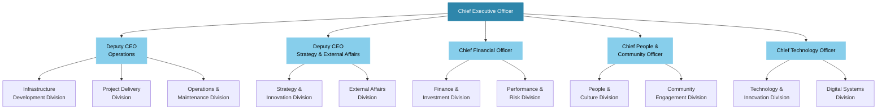

# GREA Organisational Architecture: World-Class Governance for Gippsland's Energy Transformation
## Complete Organisational Design for Australia's Premier Regional Energy Authority

> **Date:** January 2025  
> **Status:** Ready for Implementation  
> **Vision:** Build a world-class organizational structure to deliver $70B+ transformation  
> **Mission:** Establish governance excellence that ensures accountability, transparency, and community trust  

---

## Executive Summary

This document presents the complete organisational architecture for the Gippsland Renewable Energy Authority (GREA), designed to deliver Australia's largest regional energy transformation with world-class governance standards. Based on extensive analysis of leading energy authorities globally and aligned with the government partnership framework and political alignment strategy, this structure ensures effective coordination of government, industry, and community interests while maintaining the highest standards of accountability and transparency.

### Key Organisational Features

- **Independent Statutory Authority** with enhanced governance powers
- **9-Member Board** with diverse expertise and community representation  
- **5 Operational Divisions** aligned with strategic pillars
- **Multi-Level Advisory Architecture** ensuring all voices are heard
- **Performance Management System** with real-time KPIs and public reporting
- **Comprehensive Accountability Framework** with independent oversight
- **Community-Centered Governance** with democratic participation mechanisms

### Critical Success Metrics

- Operational excellence: >95% project delivery on time and budget
- Stakeholder satisfaction: >85% across all groups
- Transparency rating: Top 5% of government agencies globally
- Decision-making efficiency: <30 days for major approvals
- Community trust: >80% confidence maintained

---

## 1. Executive Leadership Structure

### 1.1 Chief Executive Officer

**Role Profile:**
The GREA CEO is the transformational leader responsible for orchestrating Gippsland's $70 billion energy transformation, requiring exceptional skills in large-scale infrastructure delivery, stakeholder management, and organizational development.

**Key Responsibilities:**
- Strategic leadership and transformation delivery
- Stakeholder relationship management (government, industry, community)
- Organisational development and team leadership
- Performance accountability and public reporting
- International partnership development
- Crisis management and issue resolution

**Essential Qualifications:**
- 15+ years senior executive experience in energy/infrastructure
- Proven track record managing >$10B projects/programs
- International energy transformation experience
- Strong government and community relations
- PhD or equivalent in engineering, economics, or public policy preferred
- Executive education from top-tier institutions

**Performance Measures:**
- Transformation program delivery (40% weighting)
- Stakeholder satisfaction scores (25% weighting)
- Financial performance and efficiency (20% weighting)
- Community engagement effectiveness (15% weighting)

**Compensation Package:**
- Base salary: $800,000 - $1,000,000
- Performance bonus: Up to 50% of base
- Long-term incentive: Tied to transformation success
- Benefits: Executive level including relocation if required

### 1.2 Executive Leadership Team Structure

**Deputy CEO - Operations**
- Responsible for program delivery and operational excellence
- Oversees infrastructure development and project management
- Manages regulatory approvals and compliance
- Coordinates with delivery partners and contractors

**Deputy CEO - Strategy & External Affairs**
- Develops strategic direction and policy frameworks
- Manages government relations and international partnerships
- Leads stakeholder engagement and communications
- Oversees innovation and technology development

**Chief Financial Officer**
- Financial strategy and capital markets engagement
- Investment attraction and structuring
- Performance monitoring and reporting
- Risk management and compliance

**Chief People & Community Officer**
- Workforce development and organisational culture
- Community engagement and social licence
- Just transition programme delivery
- Indigenous relations and diversity & inclusion

**Chief Technology Officer**
- Technology strategy and innovation leadership
- Digital transformation and systems integration
- R&D programme coordination
- Technical standards and quality assurance

### 1.3 Executive Governance Framework

**Executive Committee Structure:**
- Meets weekly for operational coordination
- Monthly strategic planning sessions
- Quarterly board reporting and review
- Annual strategic planning retreat

**Decision-Making Authority:**
- CEO: Up to $50M project approvals
- Deputy CEOs: Up to $20M within portfolio
- CFO: Financial delegations aligned with board policy
- Committee decisions: Required for >$50M commitments

**Performance Management:**
- Monthly KPI reviews with board chair
- Quarterly performance assessments
- Annual 360-degree feedback process
- Long-term incentives tied to transformation success

---

## 2. Board Composition and Governance

### 2.1 Board Structure and Composition

**Board Size:** 9 Directors (optimal for effectiveness while ensuring representation)

**Composition Framework:**

**Chair (Independent)**
- Appointed jointly by Federal and State Ministers
- 5-year term, renewable once
- Exceptional leadership credentials in energy/infrastructure
- Strong government and community relations experience

**Government Representatives (2 seats)**
- Federal Government nominee (senior executive level)
- State Government nominee (senior executive level)
- 3-year terms aligned with government cycles
- Full voting rights and fiduciary duties

**Industry Expertise (3 seats)**
- Renewable energy development and operations
- Infrastructure finance and investment
- Technology and innovation leadership
- Appointed through merit-based process

**Community Representatives (2 seats)**
- Gippsland community representative (elected by local communities)
- Worker/union representative (endorsed by relevant unions)
- Reflects community diversity and interests

**Specialist Expertise (1 seat)**
- Environmental and sustainability expertise
- Indigenous knowledge and cultural considerations
- Academic or research background preferred

### 2.2 Board Member Profiles

**Chair Requirements:**
- 20+ years senior leadership in energy, infrastructure, or government
- Proven track record managing complex stakeholder environments
- Experience with transformation programs >$5B value
- Strong ethical standards and public service orientation
- Excellent communication and relationship-building skills

**Director Competency Matrix:**
Essential competencies across board (not every director):
- Strategic planning and governance
- Financial management and investment
- Risk management and compliance
- Stakeholder engagement
- Technology and innovation
- Environmental and social impact
- Government relations
- Community development
- International business

**Appointment Process:**
1. Open merit-based selection for specialist positions
2. Community representatives through local election process
3. Government representatives through ministerial appointment
4. Due diligence and background checks for all appointments
5. Skills assessment against competency matrix
6. Public consultation period for key appointments

### 2.3 Board Governance Framework

**Meeting Schedule:**
- Monthly board meetings (11 per year, break in January)
- Quarterly strategy deep-dives
- Annual strategic planning retreat
- Emergency meetings as required

**Committee Structure:**

**Audit & Risk Committee**
- 3 directors (including CFO-experienced director as chair)
- Independent audit function oversight
- Risk management framework
- Compliance and legal matters
- Financial performance monitoring

**Strategy & Performance Committee**
- 4 directors including board chair
- Strategic planning and review
- Performance monitoring and KPIs
- Major investment decisions
- Innovation and technology oversight

**Community & Environment Committee**
- 4 directors including community representatives
- Community engagement oversight
- Environmental performance monitoring
- Social impact assessment
- Just transition program oversight
- Indigenous relations

**Remuneration & Governance Committee**
- 3 directors (independent chair)
- Executive performance and remuneration
- Board effectiveness reviews
- Governance policy development
- Director development and education

### 2.4 Board Performance and Accountability

**Performance Framework:**
- Annual board effectiveness review (external facilitator)
- Individual director performance assessment
- Committee effectiveness evaluation
- Stakeholder feedback integration
- Continuous improvement process

**Transparency Requirements:**
- Monthly public meeting minutes (commercial-in-confidence excluded)
- Quarterly performance reports published online
- Annual reporting to Parliament
- Regular community forums with board presence
- Open data platform for key metrics

**Accountability Mechanisms:**
- Parliamentary committee appearances
- Independent audit reviews
- Ombudsman oversight
- Community complaint processes
- Media and public scrutiny

---

## 3. Operational Divisions and Reporting Lines

### 3.1 Organisational Structure Overview

GREA operates through 5 core divisions aligned with strategic transformation pillars, supported by 3 enabling functions, ensuring integrated delivery while maintaining clear accountability lines.



### 3.2 Core Operational Divisions

#### Infrastructure Development Division

**Mission:** Plan, design, and coordinate infrastructure development across the Gippsland region

**Key Functions:**
- Master planning and spatial coordination
- Transmission and grid infrastructure development
- Port and logistics infrastructure coordination  
- Technology park and precinct development
- Regulatory approvals and permitting

**Organizational Structure:**
- General Manager Infrastructure Development
- Principal Planners (3): Grid, Ports, Industrial Precincts
- Development Managers (5): Major project coordination
- Technical Specialists (15): Engineering, environmental, planning
- Support Staff (7): Administration, coordination, compliance

**Key Performance Indicators:**
- Infrastructure delivery on time (>95%)
- Approval timeframes (<12 months major projects)
- Stakeholder satisfaction with consultation (>80%)
- Local content achievement (>60%)
- Environmental compliance (100%)

#### Project Delivery Division

**Mission:** Manage and oversee delivery of major renewable energy and infrastructure projects

**Key Functions:**
- Project management of major developments (>$100M)
- Contract management and vendor coordination
- Quality assurance and technical oversight
- Construction safety and compliance
- Commissioning and handover management

**Organizational Structure:**
- General Manager Project Delivery
- Senior Project Directors (4): Offshore Wind, Solar/Storage, Hydrogen, Grid
- Project Managers (12): Individual major projects
- Technical Managers (8): Engineering, procurement, construction oversight
- Project Coordinators (15): Day-to-day project coordination
- Support Staff (10): Contract administration, reporting, compliance

**Key Performance Indicators:**
- Projects delivered on budget (>90% within 5%)
- Safety performance (zero serious injuries)
- Schedule adherence (>95% milestones)
- Quality standards achievement (100% compliance)
- Contractor satisfaction (>80%)

#### Technology & Innovation Division

**Mission:** Drive technology leadership and innovation across the transformation program

**Key Functions:**
- Technology roadmap development and implementation
- R&D program coordination and investment
- Innovation partnerships and collaboration
- Technical standards development
- Demonstration project management

**Organizational Structure:**
- General Manager Technology & Innovation
- Technology Directors (3): Generation, Storage, Hydrogen
- Innovation Managers (4): R&D, Partnerships, Commercialization, Standards
- Technical Specialists (20): Various technology areas
- Research Coordinators (6): University and industry partnerships
- Support Staff (7): Administration, IP management, reporting

**Key Performance Indicators:**
- R&D investment targets achieved (>$100M annually by 2027)
- Technology partnerships established (>50 by 2030)
- Patents filed (>200 by 2030)
- Demonstration projects delivered (>20 by 2030)
- Innovation ecosystem ranking (top 10 globally)

#### Community Engagement Division

**Mission:** Ensure authentic community participation and benefit sharing throughout the transformation

**Key Functions:**
- Community consultation and engagement coordination
- Benefit sharing program design and delivery
- Social impact assessment and management
- Community development and capacity building
- Grievance and feedback management

**Organizational Structure:**
- General Manager Community Engagement
- Regional Engagement Managers (6): One per local government area
- Community Development Officers (12): Local program delivery
- Indigenous Relations Manager (1): Traditional Owner engagement
- Communications Specialists (4): Public communications and media
- Support Staff (8): Administration, data management, events

**Key Performance Indicators:**
- Community support levels (>80% across region)
- Engagement participation rates (>5% active participation)
- Benefit sharing delivery (100% on schedule)
- Grievance resolution timeframes (<30 days average)
- Indigenous partnership satisfaction (>80%)

#### Finance & Investment Division

**Mission:** Manage financial strategy, investment attraction, and performance monitoring

**Key Functions:**
- Financial strategy and capital structure optimization
- Investment attraction and structuring
- Financial analysis and modeling
- Treasury and cash management
- Performance monitoring and reporting

**Organizational Structure:**
- General Manager Finance & Investment
- Investment Directors (2): Debt and Equity
- Financial Analysts (8): Project finance, modeling, performance
- Treasury Manager (1): Cash and risk management
- Performance Analysts (4): KPI tracking, reporting, benchmarking
- Support Staff (6): Financial administration, systems, compliance

**Key Performance Indicators:**
- Investment targets achieved (>$7B annually by 2027)
- Cost of capital optimization (<8% blended)
- Financial performance against budget (>95% accuracy)
- Investment pipeline health (>$50B qualified opportunities)
- Return on investment achievement (>target IRR)

### 3.3 Enabling Functions

#### People & Culture Division

**Mission:** Build and maintain a high-performance organization with strong culture

**Key Functions:**
- Organizational development and culture
- Talent acquisition and development
- Performance management systems
- Employee relations and wellbeing
- Diversity, equity, and inclusion programs

**Organizational Structure:**
- General Manager People & Culture
- Talent Managers (2): Acquisition and development
- Organizational Development Specialist (1)
- People Operations Coordinators (4): HR services, systems
- Culture & Inclusion Coordinator (1)
- Support Staff (3): Administration, compliance

#### Digital Systems Division

**Mission:** Provide technology infrastructure and digital capabilities

**Key Functions:**
- IT infrastructure and systems management
- Digital transformation and automation
- Data management and analytics
- Cybersecurity and risk management
- Digital service delivery

**Organizational Structure:**
- General Manager Digital Systems
- IT Infrastructure Manager (1)
- Systems Analysts (3): Business applications, data, security
- Digital Services Coordinators (2): User support, training
- Support Staff (2): Administration, procurement

#### External Affairs Division

**Mission:** Manage government relations, partnerships, and strategic communications

**Key Functions:**
- Government relations (federal, state, local)
- International partnerships and trade
- Strategic communications and media relations
- Policy development and advocacy
- Stakeholder relationship management

**Organizational Structure:**
- General Manager External Affairs
- Government Relations Managers (2): Federal/state, local
- International Partnership Manager (1)
- Communications Director (1)
- Policy Analysts (3): Various portfolio areas
- Support Staff (4): Administration, research, coordination

### 3.4 Reporting and Coordination Framework

**Management Committee Structure:**
- CEO and direct reports meet weekly
- Extended leadership team (General Managers) meet monthly  
- Quarterly all-staff meetings
- Annual organisational planning sessions

**Cross-Division Coordination:**
- Project steering committees for major initiatives
- Technology integration working groups
- Community liaison coordination meetings
- Regular inter-division planning sessions

**RACI Matrix - Key Decision Areas:**

| Decision Area | Board | CEO | Deputy CEOs | Division GMs | Senior Managers |
|---------------|-------|-----|-------------|--------------|-----------------|
| **Strategic Planning** | A | R | C | C | I |
| **Annual Budget** | A | R | C | C | I |
| **Major Projects (>$100M)** | A | R | R | C | I |
| **Operational Projects** | I | A | R | R | C |
| **Policy Development** | A | R | R | C | C |
| **Staff Appointments (Senior)** | I | A | R | C | I |
| **Staff Appointments (Operational)** | I | I | A | R | C |
| **Community Agreements** | A | R | C | R | C |
| **Risk Management** | A | R | R | R | C |
| **Performance Management** | I | R | R | R | C |

*R = Responsible, A = Accountable, C = Consulted, I = Informed*

**Performance Reporting:**
- Weekly CEO dashboard updates
- Monthly division performance reports
- Quarterly board reporting package
- Annual organisational performance review

---

## 4. Governance Frameworks and Accountability Mechanisms

### 4.1 Corporate Governance Framework

#### Statutory Foundation

**GREA Establishment Act 2025**
Key governance provisions:
- Independent statutory authority status
- Clear purpose and powers definition
- Board appointment and accountability mechanisms
- Financial management and audit requirements
- Public reporting and transparency obligations

**Objects and Functions:**
- Coordinate and facilitate renewable energy development
- Attract and manage public and private investment
- Ensure community participation and benefit sharing
- Provide technical expertise and innovation leadership
- Monitor and report on transformation progress

**Powers:**
- Enter into agreements and contracts
- Acquire, hold, and dispose of property
- Employ staff and engage consultants
- Establish subsidiaries and joint ventures
- Borrow money and issue securities (with government approval)
- Exercise compulsory acquisition powers (limited circumstances)

#### Board Charter and Responsibilities

**Board Charter Key Elements:**
- Strategic direction setting and oversight
- CEO appointment and performance management
- Risk management and compliance oversight
- Financial performance and investment approval
- Stakeholder relationship oversight
- Performance monitoring and public accountability

**Board Reserved Powers:**
- Approve strategy and annual business plans
- Approve budgets >$500M and major investments >$100M
- Appoint and evaluate CEO and direct reports
- Set risk appetite and risk management framework
- Approve major policies and procedures
- Approve annual report and financial statements

**Director Duties and Standards:**
- Fiduciary duties under Corporations Act
- Conflict of interest management protocols
- Confidentiality and insider information handling
- Public sector ethics and integrity requirements
- Continuous disclosure obligations

### 4.2 Risk Management and Compliance Framework

#### Enterprise Risk Management

**Risk Governance Structure:**
- Board Audit & Risk Committee oversight
- CEO accountable for enterprise risk management
- CFO leads risk management function
- All divisions have embedded risk coordinators
- Independent internal audit function

**Risk Management Process:**
1. Risk identification and assessment (quarterly)
2. Risk treatment and mitigation planning
3. Regular monitoring and reporting
4. Annual risk management framework review
5. Board oversight and strategic risk focus

**Key Risk Categories:**
- Strategic risks (market, technology, competition)
- Operational risks (delivery, safety, performance)
- Financial risks (funding, market, credit, liquidity)
- Regulatory risks (policy changes, approvals, compliance)
- Reputational risks (community, media, political)
- Environmental and social risks

#### Compliance Management Framework

**Compliance Structure:**
- Board committee oversight
- Chief Risk Officer leading compliance function
- Divisional compliance coordinators
- Regular compliance audits and reviews
- External compliance verification

**Key Compliance Areas:**
- Statutory and regulatory requirements
- Financial management and reporting
- Work health and safety obligations
- Environmental protection requirements
- Procurement and contract management
- Privacy and information management

**Compliance Monitoring:**
- Monthly compliance reporting
- Quarterly compliance committee reviews
- Annual compliance plan updates
- Independent compliance audits
- Continuous improvement processes

### 4.3 Financial Governance and Controls

#### Financial Management Framework

**Financial Governance Structure:**
- Board oversight of financial strategy and performance
- Board Audit Committee detailed financial oversight
- CFO responsible for financial management and controls
- Independent external audit
- Treasury function for cash and investment management

**Key Financial Policies:**
- Investment policy and delegations
- Treasury and cash management policy
- Procurement and contract management policy
- Credit and counterparty risk policy
- Financial reporting and disclosure policy

**Financial Controls:**
- Segregation of duties in financial processes
- Approval hierarchies for expenditure and investments
- Regular reconciliation and review procedures
- Independent verification of major transactions
- Continuous monitoring and exception reporting

#### Investment Governance

**Investment Committee Structure:**
- Board Strategy & Performance Committee oversight
- Executive Investment Committee (CEO, CFO, relevant GMs)
- Investment evaluation and due diligence processes
- Independent investment advice and verification
- Post-investment monitoring and review

**Investment Decision Framework:**
- Strategic alignment assessment
- Financial analysis and modeling
- Risk assessment and mitigation
- Stakeholder impact evaluation
- Board approval for major investments

**Performance Monitoring:**
- Monthly investment performance reporting
- Quarterly portfolio review with board
- Annual investment strategy review
- Independent performance benchmarking
- Continuous optimization processes

### 4.4 Transparency and Public Accountability

#### Public Reporting Framework

**Mandatory Reporting:**
- Annual report to Parliament
- Quarterly performance reports (public)
- Monthly board meeting summaries
- Financial statements (audited annually)
- Major project status updates

**Transparency Platform:**
- Real-time performance dashboard (public website)
- Open data portal for key metrics
- Regular media briefings and updates
- Community forums and public meetings
- Parliamentary committee appearances

**Community Accountability:**
- Annual community report (plain English)
- Regular community forums in each LGA
- Community survey and feedback mechanisms
- Grievance and complaint handling
- Community representative feedback loops

#### Independent Oversight

**Parliamentary Oversight:**
- Joint Parliamentary Committee on Energy Transformation
- Regular appearances before relevant committees
- Annual budget estimates hearings
- Special inquiries as required
- Public accounts committee scrutiny

**Independent Reviews:**
- Annual independent audit (financial and performance)
- 5-yearly comprehensive organizational review
- Regular compliance audits
- Specialist reviews as required (e.g., environmental, safety)
- Community satisfaction surveys

**External Accountability:**
- Ombudsman complaints handling
- Freedom of information compliance
- Independent Commission Against Corruption oversight
- Media scrutiny and public debate
- Academic and policy research engagement

---

## 5. Staffing Plan and Organizational Development

### 5.1 Organizational Sizing and Growth Plan

#### Staffing Growth Trajectory

**Phase 1 (2025-2026): Foundation Building**
- Total staff: 150 FTE
- Leadership team establishment
- Core capability building
- Initial project delivery teams
- Community engagement infrastructure

**Phase 2 (2027-2028): Scale-up**
- Total staff: 400 FTE  
- Major project delivery teams
- Expanded regional presence
- Enhanced technical capabilities
- International partnership development

**Phase 3 (2029-2030): Maturation**
- Total staff: 600 FTE
- Full operational capability
- Innovation and R&D teams
- Asset management functions
- Knowledge export capabilities

**Steady State (2030+): 650-700 FTE**
- Mature organization structure
- Continuous improvement focus
- Innovation and knowledge leadership
- Mentoring other transformations

#### Workforce Composition Strategy

**Geographic Distribution:**
- Melbourne office: 30% (strategy, finance, government relations)
- Morwell headquarters: 40% (operations, community engagement)
- Regional offices: 20% (local delivery, community presence)
- Site-based roles: 10% (project delivery, operations)

**Skills Profile:**
- Engineering and technical: 35%
- Project management and delivery: 20%
- Finance and commercial: 10%
- Community and communications: 15%
- Strategy and policy: 10%
- Corporate services: 10%

**Experience Levels:**
- Senior leadership (15+ years): 10%
- Experienced professionals (5-15 years): 40%
- Mid-career professionals (2-5 years): 30%
- Graduate and early career: 20%

### 5.2 Key Roles and Responsibilities Framework

#### Executive Leadership Roles (Top 25 positions)

**Tier 1: C-Suite (5 roles)**
- Chief Executive Officer
- Deputy CEO (Operations)
- Deputy CEO (Strategy & External Affairs)
- Chief Financial Officer
- Chief People & Community Officer
- Chief Technology Officer

**Tier 2: General Managers (10 roles)**
- GM Infrastructure Development
- GM Project Delivery
- GM Technology & Innovation
- GM Community Engagement
- GM Finance & Investment
- GM People & Culture
- GM Digital Systems
- GM External Affairs
- GM Operations & Maintenance
- GM Performance & Risk

**Tier 3: Senior Directors (10 roles)**
- Director Offshore Wind Development
- Director Grid Infrastructure
- Director Hydrogen Development
- Director Innovation & R&D
- Director Investment & Capital Markets
- Director Government Relations
- Director Community Development
- Director Performance Management
- Director Risk & Compliance
- Director International Partnerships

#### Professional and Technical Roles (400-500 positions)

**Project Management (80-100 roles)**
- Senior Project Directors
- Project Managers
- Project Coordinators
- Contract Managers
- Planning and Scheduling Specialists

**Engineering and Technical (150-200 roles)**
- Principal Engineers (various disciplines)
- Senior Engineers and Specialists
- Technical Managers
- Systems Analysts
- Quality Assurance Specialists

**Finance and Commercial (50-70 roles)**
- Investment Managers
- Financial Analysts
- Commercial Managers
- Procurement Specialists
- Performance Analysts

**Community and Communications (60-80 roles)**
- Regional Engagement Managers
- Community Development Officers
- Communications Specialists
- Stakeholder Relations Managers
- Indigenous Relations Officers

**Strategy and Policy (40-60 roles)**
- Senior Policy Advisors
- Strategic Planners
- Research Analysts
- International Partnership Managers
- Innovation Coordinators

#### Operations and Support Roles (100-150 positions)

**Corporate Services (50-70 roles)**
- Human Resources Coordinators
- Finance and Administration Officers
- IT Support Specialists
- Legal and Compliance Coordinators
- Executive Assistants

**Operations Support (50-80 roles)**
- Asset Management Coordinators
- Operations Technicians
- Data Analysts
- Document Controllers
- Administrative Coordinators

### 5.3 Talent Acquisition and Development Strategy

#### Recruitment Strategy

**Leadership Recruitment:**
- Global executive search for C-suite roles
- International experience essential for key positions
- Proven track record in large-scale transformations
- Strong stakeholder management capabilities
- Cultural fit with organizational values

**Professional Recruitment:**
- Mix of local, national, and international talent
- Partnership with universities for graduate programs
- Secondment opportunities from partner organizations
- Diversity and inclusion targets (40% women, 5% Indigenous)
- Regional employment preference where possible

**Technical Recruitment:**
- Specialized recruitment for niche technical skills
- Partnership with global renewable energy companies
- Contractor-to-permanent conversion opportunities
- Skills-based immigration support
- International exchange and development programs

#### Learning and Development Framework

**Leadership Development:**
- Executive coaching for senior leaders
- Global energy transformation study tours
- Cross-sector leadership programs
- Mentoring and succession planning
- Board readiness programs

**Professional Development:**
- Technical certification and professional development
- Project management and delivery training
- Stakeholder engagement and communication skills
- Financial and commercial acumen development
- Digital and innovation capability building

**Organizational Learning:**
- Knowledge management and sharing systems
- Communities of practice within and across divisions
- Regular learning forums and conferences
- Partnership with universities for continuous learning
- International knowledge exchange programs

### 5.4 Performance Management and Culture

#### Performance Management System

**Performance Framework:**
- Individual KPIs linked to organizational objectives
- Regular performance check-ins (monthly/quarterly)
- Annual performance reviews with 360-degree feedback
- Career development planning integrated
- Recognition and reward programs

**KPI Categories:**
- Delivery performance (40% weighting)
- Stakeholder satisfaction (25% weighting)
- Innovation and improvement (20% weighting)
- Collaboration and culture (15% weighting)

**Performance Standards:**
- Exceeds expectations (10% of staff annually)
- Meets expectations (80% of staff annually)
- Below expectations (10% of staff annually)
- Development and support for underperformance
- Regular calibration across divisions

#### Organizational Culture Development

**Core Values:**
- **Excellence:** Deliver world-class outcomes
- **Integrity:** Act with honesty and transparency
- **Collaboration:** Work together for shared success
- **Innovation:** Embrace new ideas and approaches
- **Community:** Serve the people of Gippsland

**Culture Initiatives:**
- Regular all-staff forums and updates
- Cross-division collaboration projects
- Community volunteer and engagement opportunities
- Innovation time and idea sharing
- Celebration of achievements and milestones

**Employee Engagement:**
- Annual employee satisfaction surveys
- Regular pulse surveys on key issues
- Open communication channels with leadership
- Employee resource groups and networks
- Work-life balance and wellbeing programs

---

## 6. Decision-Making Processes and Authority Levels

### 6.1 Decision-Making Authority Framework

#### Board Decision Authority

**Strategic Decisions (Board Approval Required):**
- Annual strategic plan and major plan changes
- Budgets >$500M and budget variations >$100M
- Major investments >$100M
- CEO and senior executive appointments
- Major policy framework approvals
- Significant risk appetite changes

**Board Decision Process:**
1. Management recommendation with full business case
2. Committee review and recommendation (where applicable)
3. Board paper circulation 7 days prior to meeting
4. Board discussion and decision
5. Decision implementation with regular progress reporting

**Board Meeting Procedures:**
- Monthly meetings with defined agenda
- Papers distributed 1 week in advance
- Quorum of 5 directors required
- Decisions by majority vote, chair has casting vote
- Confidential sessions without management as required
- Minutes published within 2 weeks (commercial-in-confidence excluded)

#### CEO Decision Authority

**CEO Authority Levels:**
- Operational decisions within approved strategy and budget
- Investment and expenditure decisions up to $50M
- Staff appointments and organizational changes
- Contract approvals up to $50M
- Partnership agreements within strategic framework
- Crisis management and emergency response

**CEO Decision Process:**
- Consultation with relevant executives and stakeholders
- Risk assessment and due diligence as appropriate
- Documentation of decision rationale
- Communication to board and stakeholders as required
- Regular reporting on significant decisions

#### Executive Team Authority

**Deputy CEO Authority:**
- Decisions within portfolio up to $20M
- Operational approvals and resource allocation
- Staff management and performance decisions
- Stakeholder engagement and relationship management
- Policy implementation and adaptation

**Divisional GM Authority:**
- Operational decisions within division up to $5M
- Staff appointments and management within division
- Contract approvals within delegated authority
- Local stakeholder relationship management
- Day-to-day service delivery decisions

### 6.2 Integrated Planning and Decision Processes

#### Strategic Planning Process

**Annual Strategic Planning:**
1. **Environmental Scan (March-April)**
   - Political and policy landscape analysis
   - Market and technology trend assessment
   - Stakeholder feedback incorporation
   - Performance review and lessons learned

2. **Strategy Development (May-June)**
   - Strategic options assessment
   - Stakeholder consultation and input
   - Financial modeling and scenario planning
   - Risk assessment and mitigation planning

3. **Plan Approval (July)**
   - Board strategy session and approval
   - Communication to stakeholders
   - Operational planning cascade
   - Performance target setting

4. **Implementation (August-December)**
   - Quarterly progress reviews
   - Strategy adjustment as required
   - Performance monitoring and reporting
   - Preparation for next cycle

#### Investment Decision Process

**Major Investment Approval Process (>$50M):**

**Stage 1: Concept Development**
- Strategic alignment assessment
- Preliminary feasibility analysis
- Stakeholder engagement planning
- Board concept approval to proceed

**Stage 2: Feasibility Study**
- Detailed technical and commercial analysis
- Environmental and social impact assessment
- Financial modeling and scenario analysis
- Risk assessment and mitigation planning
- Stakeholder consultation and feedback

**Stage 3: Investment Decision**
- Final business case development
- Board investment committee review
- Independent verification and challenge
- Full board approval decision
- Implementation planning approval

**Stage 4: Implementation Approval**
- Detailed implementation plan approval
- Contract and partnership finalization
- Funding arrangement confirmation
- Performance monitoring framework
- Communication and stakeholder notification

#### Operational Decision Framework

**Daily Operations:**
- Standard operating procedures for routine decisions
- Clear escalation pathways for exceptions
- Regular coordination meetings between divisions
- Rapid response protocols for urgent decisions
- Continuous improvement feedback loops

**Project Decisions:**
- Project governance framework for all major projects
- Regular project steering committee meetings
- Stage-gate approval processes for major milestones
- Change control procedures for scope/budget variations
- Integrated risk and issue management

**Stakeholder Decisions:**
- Stakeholder engagement protocols for major decisions
- Community consultation requirements
- Government liaison and approval processes
- Industry and partner coordination mechanisms
- Public communication and transparency requirements

### 6.3 Accountability and Review Mechanisms

#### Decision Quality Assurance

**Decision Review Framework:**
- Quarterly review of major decisions and outcomes
- Annual assessment of decision-making effectiveness
- External review of decision processes every 3 years
- Continuous improvement based on lessons learned
- Best practice benchmarking against peer organizations

**Quality Standards:**
- Evidence-based decision making with clear documentation
- Appropriate stakeholder consultation and input
- Risk assessment and mitigation consideration
- Financial and commercial analysis rigor
- Alignment with strategic objectives and values

**Accountability Measures:**
- Clear decision documentation and rationale
- Regular reporting to board and stakeholders
- Performance measurement against decision objectives
- Public transparency where appropriate
- Learning and improvement from decision outcomes

#### Review and Audit Framework

**Internal Audit:**
- Annual internal audit plan covering all major functions
- Risk-based audit approach focusing on high-risk areas
- Regular review of decision-making processes and controls
- Independence from operational management
- Direct reporting line to Board Audit Committee

**External Review:**
- Annual external audit of financial statements and controls
- Periodic independent review of organizational effectiveness
- Specialist reviews of major decisions and investments
- Parliamentary and regulatory oversight as required
- Community and stakeholder feedback integration

---

## 7. Performance Management and KPI Systems

### 7.1 Performance Management Architecture

#### Organizational Performance Framework

**Strategic Performance Hierarchy:**
```
Level 1: Transformation Outcomes (Board Level)
├── Level 2: Strategic Objectives (Executive Level)
│   ├── Level 3: Divisional KPIs (GM Level)
│   │   ├── Level 4: Team Metrics (Manager Level)
│   │   │   └── Level 5: Individual Goals (Staff Level)
```

**Performance Integration:**
- Organizational KPIs cascade to individual level
- Balanced scorecard approach across all levels
- Real-time dashboards for key performance indicators
- Monthly performance reviews and corrective action
- Annual strategic performance assessment

#### Key Performance Categories

**Financial Performance (25% weighting)**
- Investment attraction and deployment
- Cost management and efficiency
- Revenue generation and diversification
- Return on investment achievement
- Financial sustainability measures

**Delivery Performance (30% weighting)**
- Project delivery on time and budget
- Capacity deployment against targets
- Infrastructure development milestones
- Quality and safety standards achievement
- Technical performance optimization

**Stakeholder Satisfaction (25% weighting)**
- Community support and engagement levels
- Government satisfaction with service delivery
- Industry partner satisfaction ratings
- Employee engagement and satisfaction
- Media and public perception measures

**Innovation and Excellence (20% weighting)**
- Technology development and deployment
- Process improvement and efficiency gains
- Knowledge and capability development
- Best practice implementation
- Continuous improvement achievements

### 7.2 Key Performance Indicators by Level

#### Level 1: Transformation Outcomes (Board Oversight)

**Primary KPIs (reported monthly to board):**

1. **Renewable Energy Capacity Deployed**
   - Target: 10+ GW by 2030
   - Measurement: MW operational + under construction
   - Reporting: Monthly cumulative and rate of deployment

2. **Investment Attracted**
   - Target: $70+ billion cumulative by 2030
   - Measurement: Committed investment (construction ready)
   - Reporting: Monthly pipeline and deployment tracking

3. **Jobs Created**
   - Target: 15,000+ direct jobs by 2030
   - Measurement: FTE positions in renewable energy sectors
   - Reporting: Quarterly employment survey and analysis

4. **Community Support Level**
   - Target: >80% community support maintained
   - Measurement: Annual community satisfaction survey
   - Reporting: Quarterly pulse surveys and monthly sentiment tracking

5. **Carbon Emissions Reduction**
   - Target: 45 Mt CO₂ annual reduction by 2030
   - Measurement: Verified emissions reduction from projects
   - Reporting: Annual verification with quarterly estimates

**Secondary KPIs (reported quarterly to board):**
- Hydrogen production capacity (target: 500 ktpa by 2030)
- Local content achievement (target: >60% by value)
- Worker transition success rate (target: >90%)
- Indigenous participation rate (target: >5%)
- Safety performance (target: zero serious injuries)

#### Level 2: Strategic Objectives (Executive Performance)

**CEO Performance KPIs:**
1. **Overall Transformation Progress**
   - Weighted composite of Level 1 KPIs (40% of performance rating)
   - Monthly assessment against trajectory targets
   - Annual achievement against strategic milestones

2. **Stakeholder Satisfaction**
   - Government satisfaction rating (25% of performance rating)
   - Community satisfaction rating
   - Industry partner satisfaction rating
   - Staff engagement scores

3. **Organizational Excellence**
   - Financial performance vs. budget (20% of performance rating)
   - Operational efficiency measures
   - Risk management effectiveness
   - Innovation and improvement achievements

4. **Leadership and Culture**
   - 360-degree feedback scores (15% of performance rating)
   - Organizational culture assessment
   - Team effectiveness ratings
   - External recognition and reputation

**Deputy CEO and Senior Executive KPIs:**
- Portfolio-specific delivery targets
- Stakeholder satisfaction within portfolio
- Team performance and development
- Cross-organizational collaboration effectiveness
- Innovation and continuous improvement contributions

#### Level 3: Divisional Performance (GM Level)

**Infrastructure Development Division:**
- MW capacity enabled through infrastructure (monthly target)
- Infrastructure project delivery on time/budget (>95%)
- Approval timeline achievements (<12 months for major projects)
- Stakeholder satisfaction with consultation (>80%)
- Local content facilitation (contribution to >60% target)

**Project Delivery Division:**
- Project delivery performance (>95% on time, >90% on budget)
- Safety performance (zero serious injuries)
- Quality compliance (100% technical standards)
- Contractor and supplier satisfaction (>80%)
- Innovation and improvement implementation

**Technology & Innovation Division:**
- R&D investment deployment ($targets by year)
- Technology partnerships established (cumulative target)
- Innovation projects delivered (annual target)
- Patent applications filed (annual target)
- Technology transfer and commercialization success

**Community Engagement Division:**
- Community satisfaction scores (>80% across region)
- Engagement participation rates (>5% active participation)
- Benefit sharing program delivery (100% on schedule)
- Grievance resolution efficiency (<30 days average)
- Indigenous partnership effectiveness (>80% satisfaction)

**Finance & Investment Division:**
- Investment attraction targets (annual and cumulative)
- Cost of capital optimization (target <8% blended)
- Financial performance accuracy (>95% budget variance)
- Investment pipeline development (>$50B qualified opportunities)
- Performance reporting quality and timeliness

### 7.3 Performance Monitoring and Reporting Systems

#### Real-Time Performance Dashboard

**Public Dashboard Features:**
- Live renewable energy capacity deployment
- Investment committed and deployed
- Jobs created tracker
- Community benefit distributions
- Environmental performance indicators
- Safety performance statistics

**Internal Dashboard Features:**
- Detailed project progress and milestones
- Financial performance against budget
- Risk and issue tracking
- Stakeholder engagement metrics
- Staff performance indicators
- Resource utilization and efficiency

#### Performance Reporting Schedule

**Daily Reporting:**
- Safety incidents and responses
- Critical project milestones
- Urgent stakeholder issues
- Financial commitments and expenditures
- Media and public perception monitoring

**Weekly Reporting:**
- Executive team performance summary
- Key project progress updates
- Stakeholder engagement activities
- Risk and issue status updates
- Resource and capacity utilization

**Monthly Reporting:**
- Comprehensive performance against all KPIs
- Board performance dashboard
- Stakeholder satisfaction updates
- Financial performance analysis
- Operational excellence metrics

**Quarterly Reporting:**
- Strategic performance assessment
- Detailed stakeholder satisfaction surveys
- Financial results and analysis
- Risk management review
- Innovation and improvement achievements

**Annual Reporting:**
- Comprehensive transformation progress report
- Full stakeholder satisfaction assessment
- Financial statements and audit results
- Strategic review and planning outcomes
- Public accountability report

### 7.4 Performance Management and Improvement

#### Performance Review Processes

**Board Performance Review:**
- Monthly performance sessions with CEO and executive team
- Quarterly strategic performance deep-dives
- Annual board effectiveness and strategy review
- Independent external review every 3 years

**Executive Performance Management:**
- Weekly CEO reviews with direct reports
- Monthly comprehensive performance assessments
- Quarterly 360-degree feedback sessions
- Annual performance evaluation and development planning

**Organisational Performance Management:**
- Real-time performance monitoring and alerts
- Monthly divisional performance reviews
- Quarterly organisational performance forums
- Annual organisational effectiveness assessment

#### Continuous Improvement Framework

**Performance Improvement Process:**
1. **Performance Monitoring:** Real-time tracking against targets
2. **Variance Analysis:** Investigation of performance gaps
3. **Root Cause Analysis:** Understanding underlying issues
4. **Improvement Planning:** Development of corrective actions
5. **Implementation:** Execution of improvement initiatives
6. **Monitoring:** Tracking improvement effectiveness

**Innovation and Excellence:**
- Regular benchmarking against global best practices
- Continuous improvement suggestion and implementation system
- Innovation challenges and improvement competitions
- Knowledge sharing and learning forums
- External expert advice and review processes

**Accountability and Consequences:**
- Clear performance consequences for sustained underperformance
- Recognition and reward for exceptional performance
- Career development opportunities for high performers
- Support and development for performance improvement
- Regular communication of performance expectations and results

---

## 8. Implementation Timeline and Milestones

### 8.1 Organizational Stand-up Timeline

#### Phase 1: Foundation Setup (Months 1-6)

**Month 1: Legal and Governance Foundation**
- GREA Establishment Act passed by Parliament
- Initial board appointments completed
- CEO recruitment commenced (global search)
- Interim governance arrangements established
- Initial funding allocation secured

**Month 2: Leadership Team Assembly**
- CEO appointment finalized
- Deputy CEO recruitments launched
- CFO and key executive searches commenced
- Interim organizational structure established
- Initial office setup (Melbourne and Morwell)

**Month 3: Core Team Building**
- Executive leadership team completed
- General Manager recruitment launched
- Key advisory appointments made
- Core policies and procedures developed
- Initial staff recruitment commenced

**Month 4: Operational Infrastructure**
- First 50 staff appointments completed
- IT systems and infrastructure established
- Financial management systems operational
- Initial community engagement program launched
- International partnership development commenced

**Month 5: Full Organizational Activation**
- All divisional general managers appointed
- First 100 staff members onboarded
- Performance management systems operational
- Stakeholder engagement framework active
- First quarterly board performance review

**Month 6: Operational Excellence**
- 150 staff establishment completed
- All core systems and processes operational
- First major project approvals commenced
- Community and stakeholder engagement in full operation
- Performance monitoring and reporting fully functional

#### Phase 2: Scale-up and Delivery (Months 7-24)

**Months 7-12: Expansion and Integration**
- Organizational growth to 250 staff
- Regional office establishment completed
- Major project delivery teams operational
- Community engagement infrastructure fully deployed
- International partnerships formalized

**Months 13-18: Full Operations**
- Organizational growth to 350 staff
- All divisional capabilities fully operational
- Major project delivery in progress
- Innovation and R&D programs active
- Performance optimization and continuous improvement

**Months 19-24: Excellence and Recognition**
- Organizational maturity at 400 staff
- World-class performance standards achieved
- International recognition and benchmarking
- Knowledge and expertise export capabilities
- Organizational effectiveness independently verified

#### Phase 3: Maturation and Leadership (Years 3-5)

**Year 3: Mastery and Innovation**
- Organizational optimization at 500-550 staff
- Innovation and R&D leadership established
- Global thought leadership and expertise export
- Mentoring other transformation programs
- Continuous improvement and excellence culture

**Years 4-5: Legacy and Sustainability**
- Mature organizational structure (600-650 staff)
- Self-sustaining innovation ecosystem
- Global center of excellence status
- Knowledge and capability export revenue
- Transformation success replication support

### 8.2 Critical Implementation Milestones

#### Governance Milestones

**Month 1:**
- GREA legally established with board appointed
- CEO recruitment completed
- Initial governance framework approved
- First board meeting and strategic direction setting

**Month 3:**
- Executive leadership team completed
- Organizational structure approved and communicated
- Key policies and procedures approved by board
- Performance management framework operational

**Month 6:**
- Full operational capability achieved
- First comprehensive performance report to board
- Community engagement program fully operational
- First annual strategic planning process completed

#### Organizational Development Milestones

**Month 2:**
- Core leadership team appointed
- Organizational culture and values defined
- Initial staff recruitment commenced
- Office infrastructure established

**Month 4:**
- First 100 staff successfully onboarded
- Learning and development programs operational
- Performance management system active
- Employee engagement baseline established

**Month 6:**
- 150 staff establishment milestone achieved
- Organizational effectiveness metrics established
- First employee satisfaction survey completed
- Continuous improvement processes operational

#### Performance Excellence Milestones

**Month 3:**
- Performance monitoring systems operational
- First monthly performance review completed
- KPI framework fully implemented
- Stakeholder satisfaction baseline established

**Month 6:**
- First quarterly comprehensive performance assessment
- Performance improvement processes proven
- External benchmarking commenced
- Stakeholder satisfaction targets achieved

**Month 12:**
- Annual performance review and strategic assessment
- Organizational excellence independently verified
- Global benchmarking and recognition achieved
- Performance optimization culture established

### 8.3 Success Criteria and Validation

#### Organizational Effectiveness Criteria

**Year 1 Success Metrics:**
- Organizational structure fully operational with >95% staff satisfaction
- Performance management system achieving >85% stakeholder satisfaction
- Board governance effectiveness rated >90% by independent assessment
- Community trust and confidence levels maintained >80%
- Financial management achieving >95% budget accuracy

**Year 2 Success Metrics:**
- Organizational performance in top 10% of comparable organizations
- Staff engagement and satisfaction >85% across all divisions
- Stakeholder satisfaction >85% across all key stakeholder groups
- Innovation and continuous improvement culture fully embedded
- Global recognition as best practice organizational model

**Year 3 Success Metrics:**
- World-class organizational performance consistently achieved
- Capability and knowledge export revenue generating significant income
- Mentoring other transformation organizations successfully
- Organizational sustainability and self-improvement proven
- Legacy and replication success demonstrated

#### Validation and Review Framework

**Independent Assessment:**
- Annual organizational effectiveness review by external experts
- 3-yearly comprehensive governance and performance audit
- Regular benchmarking against global best practice organizations
- Community and stakeholder satisfaction verification
- Academic research and case study development

**Continuous Improvement:**
- Monthly performance monitoring and optimization
- Quarterly organizational health assessments
- Annual strategic planning and organizational development
- Regular best practice identification and implementation
- Ongoing capability building and excellence pursuit

---

## 9. Risk Management and Mitigation Strategies

### 9.1 Organizational Risk Framework

#### Risk Governance Structure

**Board-Level Risk Oversight:**
- Board Audit & Risk Committee: Strategic risk oversight and policy
- Quarterly board risk reports and decision-making
- Annual risk appetite statement and framework review
- Independent risk assurance and verification

**Executive Risk Management:**
- CEO: Ultimate accountability for enterprise risk management
- CFO: Lead risk management function and reporting
- Risk Committee: Cross-divisional risk coordination and response
- Division GMs: Operational risk management and mitigation

**Operational Risk Management:**
- Risk coordinators in each division
- Project risk management embedded in delivery
- Regular risk assessment and treatment planning
- Continuous risk monitoring and reporting

#### Risk Categories and Assessment

**Strategic Risks:**
- Political and policy change risks
- Market and competitive risks
- Technology and innovation risks
- Reputational and social license risks
- International partnership risks

**Operational Risks:**
- Project delivery and performance risks
- Safety and environmental risks
- Organizational capability risks
- Stakeholder relationship risks
- Information and cybersecurity risks

**Financial Risks:**
- Funding and capital market risks
- Credit and counterparty risks
- Market and commodity price risks
- Liquidity and cash flow risks
- Investment performance risks

**Compliance and Regulatory Risks:**
- Regulatory change and compliance risks
- Legal and contractual risks
- Governance and ethical risks
- Audit and assurance risks
- Reporting and disclosure risks

### 9.2 Critical Risk Assessment and Mitigation

#### High-Priority Risk Scenarios

**Risk 1: Loss of Political Support**
- **Probability:** Medium (electoral cycles)
- **Impact:** Very High (transformation failure)
- **Mitigation Strategy:**
  - Bipartisan political framework establishment
  - Economic lock-in mechanisms
  - Community mobilization and advocacy
  - International commitment integration
  - Legal and contractual protections

**Risk 2: Community Opposition Development**
- **Probability:** Medium (if benefits slow)
- **Impact:** High (project delays, reputation damage)
- **Mitigation Strategy:**
  - Proactive community engagement and consultation
  - Rapid benefit delivery and demonstration
  - Local employment and business opportunities
  - Environmental excellence and protection
  - Transparent communication and grievance processes

**Risk 3: Major Project Delivery Failure**
- **Probability:** Medium (complexity and scale)
- **Impact:** High (financial and reputational damage)
- **Mitigation Strategy:**
  - Proven technology and experienced partners
  - Rigorous project management and oversight
  - Staged delivery and risk distribution
  - Comprehensive insurance and risk transfer
  - Contingency planning and alternative pathways

**Risk 4: Key Leader Departure/Failure**
- **Probability:** Medium (natural turnover)
- **Impact:** Medium (continuity and performance)
- **Mitigation Strategy:**
  - Succession planning for all key positions
  - Knowledge management and documentation
  - Leadership development and cross-training
  - Competitive retention and engagement
  - External recruitment capability

**Risk 5: Financial Market Disruption**
- **Probability:** Medium (market cycles)
- **Impact:** High (investment delays)
- **Mitigation Strategy:**
  - Diversified funding sources and instruments
  - Government backing and risk sharing
  - Strong balance sheet and liquidity
  - Market timing flexibility
  - Alternative financing arrangements

#### Medium-Priority Risk Management

**Organizational Performance Risks:**
- Staff retention and capability development
- Organizational culture and change management
- Systems and process effectiveness
- Communication and coordination challenges
- Performance measurement and improvement

**Stakeholder Relationship Risks:**
- Government relationship changes
- Industry partner conflicts or failures
- Community expectation management
- Media and public perception
- Indigenous relationship challenges

**External Environment Risks:**
- Economic downturn or recession
- Technology disruption or obsolescence
- Competitive threats and market changes
- Regulatory or policy changes
- Natural disasters or force majeure events

### 9.3 Crisis Management and Business Continuity

#### Crisis Management Framework

**Crisis Response Team:**
- CEO: Crisis commander and spokesperson
- Deputy CEOs: Operational response coordination
- General Manager External Affairs: Communications and stakeholder management
- General Manager People & Community: Staff and community support
- CFO: Financial impact assessment and management

**Crisis Response Process:**
1. **Crisis Identification and Assessment** (within 2 hours)
2. **Crisis Response Team Activation** (within 4 hours)
3. **Stakeholder Communication Plan Implementation** (within 8 hours)
4. **Operational Response and Resource Mobilization** (within 24 hours)
5. **Recovery Planning and Implementation** (ongoing)
6. **Post-Crisis Review and Learning** (within 30 days)

**Communications and Stakeholder Management:**
- Prepared crisis communication templates and messages
- Pre-established stakeholder contact lists and protocols
- Media response and management capabilities
- Community information and support systems
- Government liaison and coordination processes

#### Business Continuity Planning

**Critical Business Functions:**
- Strategic decision-making and governance
- Major project oversight and management
- Financial management and investment processes
- Community engagement and stakeholder relations
- Safety and environmental management

**Business Continuity Measures:**
- Remote work capabilities and systems
- Backup leadership and decision-making processes
- Alternative operational locations and arrangements
- Critical vendor and supplier relationship management
- Data backup and information system recovery

**Recovery and Resilience:**
- Recovery time objectives for critical functions (<24 hours)
- Recovery point objectives for data and systems (<4 hours)
- Alternative service delivery arrangements
- Staff support and wellbeing programs during crisis
- Financial reserves and emergency funding arrangements

### 9.4 Risk Monitoring and Improvement

#### Risk Monitoring Framework

**Real-Time Risk Monitoring:**
- Key risk indicator dashboards
- Automated alert systems for critical thresholds
- Regular risk assessment updates
- Stakeholder feedback and sentiment monitoring
- Media and public perception tracking

**Regular Risk Assessment:**
- Monthly divisional risk reviews
- Quarterly enterprise risk assessments
- Annual comprehensive risk framework review
- Project-specific risk monitoring and reporting
- External risk environment scanning

**Risk Reporting and Communication:**
- Monthly executive risk reports
- Quarterly board risk updates
- Annual risk management report
- Crisis situation reporting protocols
- Stakeholder risk communication as required

#### Continuous Risk Improvement

**Risk Management Enhancement:**
- Regular benchmarking against best practice
- External risk management advice and review
- Staff training and capability development
- Risk management system and process improvement
- Technology and innovation in risk management

**Learning and Adaptation:**
- Post-incident reviews and learning integration
- Risk management case studies and knowledge sharing
- Cross-organizational learning and collaboration
- External risk management thought leadership
- Continuous improvement culture and practices

---

## 10. Next Steps and Implementation Readiness

### 10.1 Immediate Actions (Next 30 Days)

#### Government and Political Actions

**Week 1: Political Foundation**
- **Day 1-2:** Prime Minister and Premier joint commitment to GREA establishment
- **Day 3-4:** Draft legislation preparation and stakeholder consultation
- **Day 5-7:** Opposition briefings and bipartisan support seeking

**Week 2: Legal and Regulatory Framework**
- **Day 8-10:** GREA Establishment Act drafting and review
- **Day 11-12:** Regulatory framework development
- **Day 13-14:** Legal structure and governance framework finalisation

**Week 3: Initial Appointments and Structure**
- **Day 15-17:** Board chair appointment and initial board composition
- **Day 18-20:** CEO recruitment specification and search firm engagement
- **Day 21:** Initial governance policies and procedures development

**Week 4: Operational Preparation**
- **Day 22-24:** Initial funding allocation and budget framework
- **Day 25-26:** Interim office setup and operational infrastructure
- **Day 27-28:** Stakeholder communication and engagement planning
- **Day 29-30:** Implementation timeline finalisation and communication

#### Operational Setup Checklist

**✓ Governance Foundation**
- [ ] GREA Establishment Act passed
- [ ] Board appointments confirmed
- [ ] CEO recruitment launched
- [ ] Initial governance framework approved
- [ ] Interim office established

**✓ Financial Setup**
- [ ] Initial funding secured
- [ ] Banking arrangements established
- [ ] Financial management systems selected
- [ ] Budget framework approved
- [ ] Procurement policies adopted

**✓ People & Culture**
- [ ] Organisational structure approved
- [ ] Key leadership roles defined
- [ ] Recruitment strategy developed
- [ ] HR policies drafted
- [ ] Culture framework established

**✓ Stakeholder Engagement**
- [ ] Communication plan developed
- [ ] Key stakeholder mapping complete
- [ ] Initial briefings scheduled
- [ ] Media strategy prepared
- [ ] Community consultation framework ready

#### Organizational Development Actions

**Leadership Recruitment:**
- Global CEO search launched with leading executive search firm
- Board appointment process activated with merit-based selection
- Key executive role specifications developed
- Initial organizational design and structure approved

**Infrastructure and Systems:**
- Office locations confirmed and lease arrangements initiated
- IT infrastructure and systems requirements specified
- Initial policies and procedures development commenced
- Performance management and reporting systems designed

**Stakeholder Engagement:**
- Community engagement strategy and plans developed
- Government relations protocols and liaison arrangements
- Industry partnership and collaboration framework
- Media and communications strategy development

### 10.2 Foundation Phase Delivery (Months 1-6)

#### Month 1 Priorities

**Governance Establishment:**
- GREA Establishment Act passage through Parliament
- Board appointments completed and first board meeting
- CEO appointment finalized and commenced
- Initial governance framework approved and operational

**Organizational Foundation:**
- Interim organizational structure established
- Initial office setup completed (Melbourne and Morwell)
- Core policies and procedures approved
- Initial funding and budget framework operational

**Stakeholder Activation:**
- Community engagement program launched
- Government liaison and coordination established
- Industry partnership development commenced
- Media and public communication strategy activated

#### Months 2-3 Priorities

**Leadership Team Assembly:**
- Deputy CEOs and senior executive team recruited
- General Managers and key senior staff appointed
- Organizational structure and reporting lines established
- Performance management framework operational

**Capability Development:**
- Initial staff recruitment and onboarding (50-100 staff)
- Learning and development programs established
- Organizational culture and values integration
- Initial project identification and planning

**System Integration:**
- Full governance and management systems operational
- Performance monitoring and reporting systems active
- Financial management and controls established
- Stakeholder engagement infrastructure operational

#### Months 4-6 Priorities

**Full Operational Capability:**
- Organization growth to 150 staff across all divisions
- All core systems and processes fully operational
- First major project approvals and delivery commenced
- Performance management and continuous improvement active

**Excellence and Optimization:**
- Performance against KPIs and targets measured
- Stakeholder satisfaction and engagement assessed
- Organizational effectiveness and culture evaluated
- Continuous improvement and optimization implemented

### 10.3 Success Enablers and Critical Success Factors

#### Political and Policy Enablers

**Essential Political Commitments:**
- 20-year bipartisan political commitment secured
- GREA establishment legislation passed with strong support
- Initial funding commitments secured and legislated
- Regulatory framework streamlining completed

**Policy and Regulatory Support:**
- Renewable Energy Zone declarations and planning approvals
- Streamlined project approval and permitting processes
- Skills development and workforce transition funding
- International partnership and trade facilitation

#### Organizational Success Factors

**Leadership Excellence:**
- World-class CEO and executive team recruited
- Strong board governance and oversight established
- Clear organizational vision and strategy developed
- High-performance culture and values embedded

**Capability and Systems:**
- Robust organizational systems and processes operational
- Strong financial management and performance monitoring
- Effective stakeholder engagement and communication
- Innovation and continuous improvement capability

#### Community and Stakeholder Support

**Community Engagement:**
- Authentic and inclusive community participation
- Transparent communication and information sharing
- Tangible community benefits and job opportunities
- Environmental protection and enhancement

**Stakeholder Alignment:**
- Government partnership and coordination
- Industry collaboration and investment attraction
- Community trust and social license maintenance
- International partnership development and support

### 10.4 Vision Realization and Legacy

#### Organizational Excellence Vision

**By 2027:** GREA recognized as Australia's premier regional transformation authority
- World-class organizational performance and effectiveness
- Global benchmark for energy transformation governance
- Strong community trust and stakeholder satisfaction
- Innovation and thought leadership in transformation management

**By 2030:** GREA established as global center of excellence
- International recognition and replication requests
- Knowledge and capability export revenue generation
- Mentoring and supporting other transformation programs
- Sustainable organizational model for ongoing success

#### Transformation Impact Legacy

**Economic Transformation:**
- $70+ billion investment attraction and deployment
- 15,000+ sustainable jobs created in renewable energy
- Gippsland transformed into global renewable energy hub
- Diversified and resilient regional economy established

**Social and Community Success:**
- 100% workforce transition with no one left behind
- Strong community ownership and participation
- Enhanced regional services and infrastructure
- Pride and confidence in Gippsland's future restored

**Environmental Excellence:**
- 45Mt CO₂ annual emissions reduction achieved
- Net-positive environmental and biodiversity impact
- Circular economy principles and practices embedded
- Climate resilience and adaptation enhanced

**Global Leadership:**
- Top 10 global renewable energy hub status achieved
- Technology and expertise leadership internationally recognized
- Model for rapid regional energy transformation
- Inspiration and support for global decarbonization efforts

---

## Conclusion

This comprehensive organizational architecture provides GREA with the governance, leadership, and operational framework necessary to deliver Gippsland's historic energy transformation. By combining world-class governance standards with community-centered accountability, GREA will establish new benchmarks for regional transformation agencies globally.

The success of this organizational design depends on immediate action to establish the legal framework, appoint exceptional leadership, and begin building the high-performance culture that will deliver $70+ billion in investment and 15,000+ sustainable jobs for Gippsland.

With political commitment, community support, and organizational excellence, GREA will not only transform Gippsland into a global renewable energy powerhouse but create a replicable model for rapid decarbonization worldwide.

The transformation starts with establishing this world-class organization. The future of Gippsland—and the global energy transition—depends on getting this foundation right.

---

*GREA Organizational Architecture Version 1.0*  
*Date: January 2025*  
*Next Review: July 2025*  
*Status: Ready for Government Approval and Implementation*