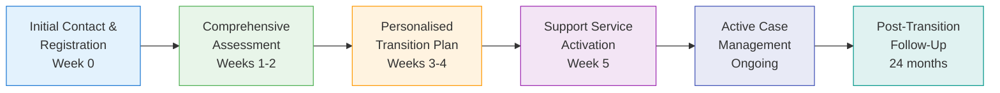

# Just Transition Service Delivery Framework for Gippsland Day 2 Phase 3
## Operationalizing 100% Employment Guarantee for 4,500 Coal Workers

> **Role:** Just Transition Service Delivery Coordinator  
> **Mission:** Deliver 100% employment guarantee through individualized support systems  
> **Phase:** Day 2 Phase 3 - Service Delivery Operations  
> **Target:** 4,500 workers successfully transitioned with zero involuntary unemployment  

---

## Executive Summary

This service delivery framework operationalises the 100% employment guarantee for Gippsland's 4,500 coal workers, building on established just transition strategy and community engagement operations. The framework establishes comprehensive individual support services, case management systems, training coordination, economic development programs, and community resilience building with measurable success metrics and accountability mechanisms.

### Core Service Delivery Architecture
- **Individual Worker Case Management System** (1:1 support for all 4,500 workers)
- **Skills Pipeline Coordination Hub** (connecting training to employment opportunities)
- **Economic Development Service Integration** (community and worker outcomes aligned)
- **Community Resilience Building Network** (social infrastructure for transition)
- **Real-Time Progress Monitoring System** (transparency and accountability)

### Service delivery targets align with existing framework:
- **100% Worker Transition Guarantee**: Coordinated with existing strategy framework
- **Community Support Maintenance**: Building on 79% community support base
- **Indigenous Partnership Integration**: Embedding Traditional Owner partnerships
- **Just Transition Principles**: Dignity, choice, prosperity, and community-centered approach

---

## 1. Individual Worker Support Services Architecture

### 1.1 Comprehensive Case Management System

#### Worker Intake and Assessment Process
**Universal Coverage Model**:



**Assessment Components**:
1. **Skills and Experience Audit**
   - Technical competency mapping
   - Leadership and management experience
   - Safety certification inventory
   - Digital literacy assessment
   - Learning style and preferences

2. **Personal Circumstances Review**
   - Family situation and dependents
   - Financial position and obligations
   - Health considerations and requirements
   - Housing stability and preferences
   - Community connection strength

3. **Career Aspiration Consultation**
   - Preferred industries and roles
   - Geographic mobility options
   - Income requirements and expectations
   - Work-life balance priorities
   - Entrepreneurship interest and capacity

4. **Transition Readiness Assessment**
   - Change adaptability indicators
   - Training willingness and capacity
   - Mental health and wellbeing status
   - Support network availability
   - Motivation and engagement levels

#### Dedicated Case Manager Assignment
**Case Management Structure**:
- **1:25 ratio**: One case manager per 25 workers maximum
- **180 case managers** required for 4,500 workers
- **Geographic alignment**: Case managers embedded in communities
- **Continuity guarantee**: Same case manager through entire transition

**Case Manager Profile and Training**:
- Qualified social workers, career counselors, or industry professionals
- Specialized training in just transition principles
- Mental health first aid certification
- Cultural competency for diverse communities
- Deep knowledge of local industry opportunities

### 1.2 Specialized Support Services Network

#### Mental Health and Wellbeing Support
**Embedded Counseling Services**:
- **6 full-time psychologists** specializing in career transition
- **12 counselors** with experience in industrial change
- **24/7 crisis support hotline** for emotional distress
- **Peer support groups** led by successfully transitioned workers
- **Family counseling** for household adjustment challenges

**Service Integration**:
```
Mental Health Support Network:
├── Individual Counseling (Weekly availability)
├── Group Therapy Sessions (Bi-weekly)
├── Family Support Services (Monthly)
├── Crisis Intervention (24/7 availability)
├── Peer Mentorship Program (Ongoing)
└── Community Wellness Activities (Daily)
```

#### Financial Counseling and Planning
**Comprehensive Financial Support**:
- **Personal financial planning** for transition period
- **Debt management assistance** and consolidation
- **Investment advice** for transition bonuses and payouts
- **Small business development support** for entrepreneurship
- **Pension planning optimisation** for early retirees

**Financial Security Guarantee Implementation**:
- **Income bridge payments** administered through case management
- **Training allowances** coordinated with education providers
- **Emergency financial assistance** for unexpected circumstances
- **Property protection scheme** enrollment and management

#### Career Development and Placement Services
**Professional Career Support**:
- **Resume and LinkedIn optimisation** for new industries
- **Interview skills training** and practice sessions
- **Network building facilitation** within target industries
- **Job placement coordination** with employer partners
- **Career advancement planning** for long-term success

### 1.3 Individualized Support Packages

#### Pathway-Specific Service Delivery

**Direct Transfer Workers (65% - 2,925 workers)**
- **6-month intensive support** with rapid placement focus
- **Skills certification acceleration** for immediate employment
- **Employer liaison** for seamless transition arrangements
- **Ongoing support** for 12 months post-placement

**Upskilling Transfer Workers (25% - 1,125 workers)**
- **18-month comprehensive support** through training and placement
- **Living allowances** during extended training periods
- **Family support services** for training impact mitigation
- **Employer partnership coordination** for guaranteed placement

**Career Pivot Workers (7% - 315 workers)**
- **36-month complete transition support** for major career changes
- **Education funding coordination** with universities and TAFE
- **Mentorship matching** with professionals in target careers
- **Extended financial support** for longer transition periods

**Supported Retirement Workers (3% - 135 workers)**
- **Retirement planning specialist** one-on-one support
- **Pension optimisation** and benefit coordination
- **Volunteer opportunity facilitation** for meaningful engagement
- **Health and wellness programs** for active retirement

---

## 2. Case Management Systems and Infrastructure

### 2.1 Digital Case Management Platform

#### Comprehensive Worker Management System
**Platform Architecture**:
```
Digital Case Management System:
├── Worker Profile and History Database
├── Assessment and Planning Tools
├── Service Coordination Dashboard
├── Progress Tracking and Reporting
├── Communication and Collaboration Hub
└── Outcome Monitoring and Analytics
```

**Core Functionality**:
- **Integrated worker profiles** with complete transition history
- **Real-time service coordination** between all support providers
- **Automated progress tracking** against individual transition plans
- **Communication hub** for worker, case manager, and service providers
- **Outcome measurement** and success analytics

#### Multi-Agency Coordination System
**Service Provider Integration**:
- **Training institutions** (TAFE, universities, private providers)
- **Employment agencies** (Centrelink, private recruitment, industry partners)
- **Health services** (mental health, occupational health, GPs)
- **Financial services** (banks, financial counselors, accountants)
- **Community services** (housing, transport, family support)

### 2.2 Physical Service Delivery Infrastructure

#### Regional Service Hubs
**Strategic Location Network**:

**Morwell Central Hub** (Serves 1,800 workers - Latrobe City)
- **Address**: Former TAFE building, Commercial Road (repurposed)
- **Services**: Complete case management, training coordination, employer liaison
- **Staffing**: 72 case managers, 20 support staff, specialist services
- **Hours**: 7:00 AM - 7:00 PM, Monday to Saturday

**Traralgon Service Center** (Serves 1,200 workers - Latrobe/Wellington)
- **Address**: Traralgon Railway Station precinct (co-located)
- **Services**: Case management, job placement, financial counseling
- **Staffing**: 48 case managers, 15 support staff
- **Hours**: 8:00 AM - 6:00 PM, Monday to Friday

**Churchill Support Hub** (Serves 600 workers - Federation University partnership)
- **Address**: Federation University campus (integrated delivery)
- **Services**: Education pathway coordination, research sector placement
- **Staffing**: 24 case managers, 10 university liaison officers
- **Hours**: 9:00 AM - 5:00 PM, Monday to Friday

**Sale Regional Office** (Serves 500 workers - Wellington/East Gippsland)
- **Address**: Sale TAFE campus (integrated with training)
- **Services**: Regional placement coordination, agricultural sector liaison
- **Staffing**: 20 case managers, 8 support staff
- **Hours**: 8:00 AM - 5:00 PM, Monday to Friday

**Community Outreach Units** (Serves 400 workers - remaining areas)
- **Mobile service delivery** to smaller communities
- **16 case managers** with geographic coverage
- **Home and community center visits** available

#### Specialist Service Integration Centers

**Skills Assessment and Recognition Center** (Morwell)
- **Recognition of Prior Learning (RPL)** processing
- **Industry skills testing and certification**
- **Digital skills assessment and basic training**
- **Career pathway modeling and planning**

**Entrepreneurship Development Hub** (Traralgon)
- **Business planning and development support**
- **Access to startup funding and grants**
- **Mentorship matching with successful entrepreneurs**
- **Legal and regulatory guidance for new businesses**

### 2.3 Service Coordination Protocols

#### Inter-Agency Coordination Framework
**Daily Operations Coordination**:
- **Morning briefings** (8:00 AM) across all hubs via video conference
- **Case review meetings** for complex or at-risk transitions
- **Service provider check-ins** for coordinated support delivery
- **Progress reporting** to central coordination team

**Weekly Strategic Coordination**:
- **Cross-hub case management meetings** for best practice sharing
- **Employer engagement coordination** for job placement optimisation
- **Training provider liaison** for program effectiveness review
- **Community feedback integration** from engagement operations team

#### Quality Assurance and Standards
**Service Delivery Standards**:
- **Response time**: All worker contacts acknowledged within 4 hours
- **Case plan updates**: Monthly reviews minimum, weekly for active phases
- **Service access**: All services available within 30km or via digital delivery
- **Cultural competency**: All staff trained in cultural awareness and Indigenous protocols

---

## 3. Training and Retraining Coordination Hub

### 3.1 Integrated Skills Development Pipeline

#### Renewable Energy Skills Academy (Expanded Operations)
**Enhanced Capacity and Programming**:
- **Annual capacity**: 2,000 students (expanded from 1,500)
- **Concurrent programs**: 15 different qualification pathways
- **Industry partnerships**: 25+ employers with guaranteed placement agreements
- **Success metrics**: 95% completion rate, 90% employment within 6 months

**Program Coordination with Case Management**:
```
Training Pathway Coordination:
├── Case Manager Assessment and Referral
├── Skills Academy Intake and Planning
├── Employer Partner Pre-Placement
├── Training Delivery with Support Services
├── Industry Placement and Mentorship
└── Post-Placement Follow-Up and Advancement
```

**Priority Training Programs (Aligned with Job Availability)**:

1. **Offshore Wind Technicians** (500 places annually)
   - **Duration**: 6 months intensive + 6 months on-the-job
   - **Partners**: Star of the South, Orsted, Iberdrola
   - **Placement guarantee**: 100% for completers
   - **Salary expectation**: $80,000-120,000

2. **Solar Installation and Maintenance** (400 places annually)
   - **Duration**: 3 months + ongoing professional development
   - **Partners**: Local solar companies, residential and commercial
   - **Placement guarantee**: 95% within 3 months
   - **Salary expectation**: $60,000-90,000

3. **Battery Storage Systems** (300 places annually)
   - **Duration**: 4 months + manufacturer certification
   - **Partners**: Tesla, Fluence, Neoen
   - **Placement guarantee**: 98% for certified completers
   - **Salary expectation**: $70,000-110,000

4. **Green Hydrogen Production** (200 places annually)
   - **Duration**: 8 months including safety certification
   - **Partners**: Fortescue Future Industries, Hydrogen Park Australia
   - **Placement guarantee**: 100% for completers (limited places)
   - **Salary expectation**: $90,000-130,000

#### University Pathway Coordination
**Federation University Partnership Enhancement**:
- **Direct entry programs** for coal workers with industry experience
- **Recognition of Prior Learning** for advanced standing
- **Work-study arrangements** maintaining income during study
- **Industry-sponsored degree programs** with employment guarantees

**Priority Degree Programs**:
- **Renewable Energy Engineering** (4-year degree, 2-year accelerated)
- **Project Management** (2-year Master's, industry-focused)
- **Environmental Science** (3-year degree with renewable energy specialization)
- **Business Administration** (MBA with renewable energy focus)

### 3.2 Skills Gap Analysis and Program Development

#### Real-Time Industry Intelligence
**Labor Market Monitoring System**:
- **Monthly employer surveys** on hiring intentions and skills needs
- **Quarterly industry forums** for emerging skills identification
- **Real-time job posting analysis** for in-demand skills tracking
- **International best practice monitoring** for emerging roles

**Dynamic Program Adjustment Protocol**:
- **Quarterly program reviews** based on placement success rates
- **Rapid program development** for emerging opportunities (3-month development cycle)
- **Employer co-design** of new training programs
- **Worker feedback integration** from program completers

#### Specialized Skills Development

**Advanced Technology Skills** (For evolving energy sector):
- **Digital Twin Technology** for renewable energy management
- **IoT and Sensor Networks** for smart grid integration
- **AI and Machine Learning** applications in energy systems
- **Drone Operations** for infrastructure inspection and maintenance

**Management and Leadership Development**:
- **Supervisory skills** for workers moving into leadership roles
- **Project management certification** (PMP, PRINCE2)
- **Safety leadership** in renewable energy environments
- **Cross-cultural competency** for international project teams

### 3.3 Employer Partnership and Placement Coordination

#### Strategic Employer Network
**Tier 1 Partners** (Guaranteed placement commitments):
- **Star of the South**: 800 positions over 5 years
- **Squadron Energy**: 600 positions renewable energy projects
- **Alinta Energy**: 500 positions across wind and solar portfolio
- **Fortescue Future Industries**: 400 positions hydrogen and renewables

**Tier 2 Partners** (Preferred hiring agreements):
- **Local renewable energy contractors** (50+ businesses)
- **Infrastructure and construction companies** (30+ businesses)
- **Maintenance and service providers** (40+ businesses)
- **Technology and consulting firms** (25+ businesses)

#### Placement Coordination Process
**Pre-Employment Coordination**:
1. **Worker-employer matching** based on skills, preferences, and location
2. **Pre-placement meetings** to ensure mutual suitability
3. **Trial employment periods** with full support and backup options
4. **Negotiated terms** ensuring income maintenance guarantees
5. **Ongoing support** during adjustment period

**Employment Success Support**:
- **3-month intensive check-ins** with case managers
- **Employer liaison** for any workplace adjustment issues
- **Career advancement planning** for long-term success
- **Peer network facilitation** among transitioned workers

---

## 4. Economic Development Programs Integration

### 4.1 Community Economic Development Coordination

#### Alignment with Community Transformation
**Integration with Existing Community Development**:
- **Morwell Transformation Hub**: Priority hiring for local coal workers
- **Green Hydrogen Valley**: Community ownership model with worker participation
- **Renewable Energy Manufacturing Precinct**: Skills pathway alignment with worker capabilities
- **Innovation Campus**: Research and development opportunities for experienced workers

**Local Procurement and Supply Chain Development**:
- **Coal worker entrepreneur support** for supply chain opportunities
- **Existing business transformation** to serve renewable energy sector
- **Local hiring requirements** in all economic development projects
- **Community benefit distribution** prioritizing worker transition support

### 4.2 Small Business and Entrepreneurship Support

#### Coal Worker Business Development Program
**Comprehensive Entrepreneurship Support**:
- **Business incubator** specifically for coal workers
- **Startup grants**: $50,000-200,000 depending on business scope
- **Mentorship network** of successful local entrepreneurs
- **Legal and regulatory support** for business establishment
- **Market access facilitation** through existing business networks

**Priority Business Sectors** (Aligned with renewable energy ecosystem):
```
Entrepreneurship Opportunities:
├── Renewable Energy Services (Maintenance, consulting)
├── Advanced Manufacturing (Components, fabrication)
├── Digital Services (Software, monitoring, analysis)
├── Professional Services (Engineering, project management)
├── Training and Education (Specialized skills development)
└── Tourism and Hospitality (Industrial heritage, renewable energy tourism)
```

**Success Support Framework**:
- **18-month intensive support** for new business development
- **Ongoing mentorship** for business growth and expansion
- **Access to funding** through various government and private programs
- **Peer networking** among coal worker entrepreneurs
- **Market development assistance** for scaling successful businesses

### 4.3 Regional Economic Diversification Support

#### Just Transition Economic Development Integration
**Coordinated Regional Development**:
- **Infrastructure projects** prioritizing coal worker employment
- **Innovation initiatives** building on existing worker expertise
- **Tourism development** incorporating coal heritage and renewable energy
- **Agricultural technology** leveraging engineering and technical skills
- **Port development** utilizing existing transport and logistics experience

**Community Wealth Building Approach**:
- **Local ownership models** for renewable energy projects
- **Community investment opportunities** for coal workers
- **Cooperative business development** for collective entrepreneurship
- **Local financial institution development** supporting community business
- **Skills retention strategies** preventing brain drain from the region

---

## 5. Community Resilience Building Network

### 5.1 Social Infrastructure for Transition Support

#### Community Connection and Support Networks
**Peer Support System Architecture**:
```
Peer Support Network:
├── Transition Buddy System (1:1 peer matching)
├── Industry Specific Support Groups (Weekly meetings)
├── Family Support Networks (Spousal and children programs)
├── Community Champions Program (Leader development)
├── Success Story Sharing Network (Inspiration and learning)
└── Crisis Support Network (Emergency peer response)
```

**Community Social Infrastructure Investment**:
- **Community centers** in each major town with transition support programs
- **Men's sheds and makerspaces** for skill development and social connection
- **Sports and recreation programs** for physical and mental wellbeing
- **Cultural programs** celebrating industrial heritage while building future identity

#### Mental Health and Wellbeing Community Programs
**Community-Wide Mental Health Support**:
- **Community wellbeing coordinators** in each town
- **Mental health first aid training** for community leaders and volunteers
- **Peer support training** for workers supporting other workers
- **Community resilience building** workshops and programs
- **Stress and anxiety management** group programs

**Family and Household Support**:
- **Spousal career support** programs for partner employment
- **Children and youth programs** for family stability during transition
- **Financial stress management** community workshops
- **Relationship counseling** for transition-related relationship stress

### 5.2 Community Identity and Pride Building

#### Heritage and Future Identity Integration
**Industrial Heritage Celebration**:
- **Coal industry recognition** programs honoring worker contributions
- **Skill and knowledge preservation** projects documenting expertise
- **Mentorship programs** transferring coal industry knowledge to renewable energy
- **Community storytelling** initiatives celebrating worker journeys
- **Heritage tourism** development showcasing industrial history

**Renewable Energy Future Building**:
- **Community education** programs about renewable energy development
- **Worker leadership** in community renewable energy initiatives
- **Pride building** around leading Australia's energy transition
- **Skills showcase** events highlighting worker expertise in new industries
- **Success celebration** regular community events recognizing achievements

### 5.3 Intergenerational Support and Youth Engagement

#### Youth Career Development and Support
**Next Generation Support**:
- **Children of coal workers programs** for career pathway development
- **University and TAFE scholarships** for coal worker families
- **Apprenticeship priority access** for coal worker children
- **Mentorship programs** connecting coal workers with young people
- **Skills transfer initiatives** from experienced workers to youth

**Community Youth Programs**:
- **Youth leadership development** in renewable energy transition
- **Environmental education** and stewardship programs
- **Technology skills development** for digital economy participation
- **Community service** projects building social connections
- **Cultural programs** connecting youth with community heritage and future

---

## 6. Progress Monitoring and Success Metrics

### 6.1 Real-Time Individual Progress Tracking

#### Worker Transition Dashboard System
**Individual Progress Metrics**:
```
Worker Progress Tracking:
├── Transition Status (Phase and timeline)
├── Service Utilization (Case management, training, support)
├── Employment Outcomes (Job placement, salary comparison)
├── Wellbeing Indicators (Mental health, family stability)
├── Financial Security (Income maintenance, asset protection)
└── Community Connection (Social integration, support network)
```

**Automated Alert System**:
- **Progress delays**: Workers falling behind expected timelines
- **Service gaps**: Missing or underutilized support services
- **Risk indicators**: Mental health, financial stress, social isolation warnings
- **Success opportunities**: Workers ready for advancement or additional opportunities
- **System improvements**: Patterns indicating need for service enhancement

#### Case Management Quality Metrics
**Service Delivery Standards Monitoring**:
- **Caseload management**: Ensuring 1:25 ratio maintained
- **Response times**: 4-hour acknowledgment, 48-hour action standards
- **Service coordination**: Integrated support delivery effectiveness
- **Outcome achievement**: Individual transition plan success rates
- **Worker satisfaction**: Regular feedback on case management quality

### 6.2 Community-Wide Transition Success Measurement

#### Economic Impact Assessment
**Community Economic Health Indicators**:
- **Employment rates**: Target 100% coal worker employment
- **Income levels**: Maintain or improve average household income
- **Business development**: New business creation and existing business growth
- **Property values**: Stabilization and improvement of housing markets
- **Economic diversity**: Reduced dependence on single industry

**Regional Development Metrics**:
- **Population stability**: Preventing out-migration during transition
- **Youth retention**: Young people staying in or returning to the region
- **Investment attraction**: Private sector investment in new industries
- **Infrastructure development**: Public and private infrastructure improvements
- **Innovation indicators**: Research, development, and technology adoption

### 6.3 Long-Term Success Tracking and Accountability

#### 10-Year Longitudinal Success Study
**Comprehensive Long-Term Tracking**:
```
Longitudinal Study Framework:
├── Individual Career Trajectories (Income, satisfaction, advancement)
├── Family Wellbeing Outcomes (Health, education, stability)  
├── Community Transformation (Economic, social, environmental)
├── Regional Development Impact (Infrastructure, investment, population)
├── Model Replication Value (Lessons for other transitions)
└── Unexpected Outcomes (Positive and negative unforeseen impacts)
```

**Research Partnership Framework**:
- **University partnerships** for independent academic analysis
- **Government evaluation** for policy and program effectiveness
- **Community assessment** for local impact and satisfaction
- **Industry analysis** for workforce development and economic outcomes
- **International benchmarking** for global best practice comparison

#### Accountability and Transparency Systems

**Public Reporting and Transparency**:
- **Monthly progress reports** publicly available with individual privacy protected
- **Quarterly community forums** for progress sharing and feedback
- **Annual comprehensive assessment** with independent evaluation
- **Real-time dashboard** for community access to aggregate progress data
- **Open data policy** for researchers and policy makers

**Continuous Improvement Integration**:
- **Quarterly service review** and improvement implementation
- **Annual program evaluation** with stakeholder input
- **Policy adjustment** based on evidence and outcomes
- **Best practice sharing** with other transition regions
- **Innovation integration** for service delivery enhancement

---

## 7. Crisis Response and Problem Resolution

### 7.1 Early Warning System for At-Risk Workers

#### Risk Identification and Assessment
**Multi-Factor Risk Assessment Framework**:
```
Worker Risk Assessment Matrix:
├── Employment Risk (Skills mismatch, training difficulties)
├── Financial Risk (Income drop, debt burden, asset loss)
├── Health Risk (Mental health decline, physical health issues)
├── Social Risk (Isolation, family stress, community disconnection)
├── Geographic Risk (Location barriers, mobility limitations)
└── Systemic Risk (Economic conditions, policy changes)
```

**Automated Risk Monitoring System**:
- **Data integration** from case management system, health services, financial counseling
- **Predictive analytics** for identifying workers at risk of transition failure
- **Early intervention triggers** for proactive support escalation
- **Case manager alerts** for immediate response to high-risk situations
- **Community network activation** for wraparound support mobilization

#### Intensive Intervention Protocols
**Crisis Support Team Activation**:
- **48-hour response protocol** for high-risk worker identification
- **Multi-disciplinary team** including case manager, mental health professional, financial counselor
- **Intensive support plan** development with worker and family involvement
- **Daily check-ins** during crisis period
- **Extended support timeline** until stability achieved

**Emergency Support Resources**:
- **Financial crisis fund** for immediate financial relief
- **Temporary accommodation** for housing crisis situations
- **Mental health crisis intervention** including hospitalization support
- **Family support services** for household stability
- **Legal assistance** for workers facing legal or administrative challenges

### 7.2 System-Wide Problem Resolution

#### Service Delivery Issue Resolution
**Quality Assurance and Problem Resolution**:
- **Worker complaint system** for service delivery issues
- **Case manager support** for complex or difficult situations  
- **Service provider accountability** for contracted support services
- **System improvement integration** based on problem patterns
- **Independent advocacy** for workers facing system barriers

**Rapid Response Team for System Issues**:
- **Service delivery failures** requiring immediate system intervention
- **Training program issues** affecting multiple workers
- **Employer relationship problems** impacting placement success
- **Community resistance** or conflict requiring mediation
- **Policy or regulatory barriers** needing rapid resolution

### 7.3 Success Recovery and Resilience Building

#### Failed Transition Recovery Protocols
**Second Chance Support System**:
- **No worker left behind guarantee** includes recovery from failed attempts
- **Alternative pathway development** for workers who don't succeed in first transition
- **Enhanced support packages** for workers requiring multiple attempts
- **Specialized services** for workers with complex challenges
- **Long-term support commitment** until successful transition achieved

**Resilience Building Integration**:
- **Learning from setbacks** approach to building worker resilience
- **Peer support** from workers who overcame similar challenges
- **Skills and confidence building** for workers who lost confidence
- **Alternative success metrics** recognizing different forms of successful transition
- **Community support mobilization** for workers needing extended assistance

---

## 8. Cultural Competency and Inclusive Service Delivery

### 8.1 Indigenous Worker Specialized Support

#### Traditional Owner Partnership in Service Delivery
**Gunaikurnai Partnership Integration**:
- **Indigenous case managers** for Indigenous workers preferring cultural alignment
- **Cultural healing programs** integrating traditional healing with transition support
- **On-Country employment opportunities** in land management and environmental services
- **Traditional knowledge integration** in renewable energy and land management roles
- **Extended family support** recognizing Indigenous family structures and obligations

**Culturally Appropriate Service Delivery**:
```
Indigenous Service Delivery Framework:
├── Cultural Protocol Integration (FPIC and traditional processes)
├── Extended Family Support (Community and kinship connections)
├── Traditional Knowledge Recognition (Skills and experience validation)
├── Healing-Centered Approach (Trauma-informed and culturally safe)
├── Economic Participation (Business development and ownership)
└── Intergenerational Connection (Elder wisdom and youth development)
```

#### Indigenous Economic Development Integration
**Traditional Owner Business Development**:
- **Cultural enterprise support** for tourism, art, and cultural education businesses
- **Land management services** utilizing traditional knowledge and modern technology
- **Renewable energy partnerships** with Traditional Owner corporations
- **Cultural consultation services** for renewable energy development
- **Training and mentorship** in cultural competency for non-Indigenous workers

### 8.2 Multicultural Worker Support

#### Culturally and Linguistically Diverse (CALD) Worker Services
**Language and Cultural Support**:
- **Multilingual case managers** for major community languages
- **Translation services** for all support services and documentation
- **Cultural mediators** for navigating Australian workplace culture
- **CALD community liaisons** for community-specific support networks
- **Religious and cultural considerations** in service delivery and job placement

**Specialized CALD Support Services**:
- **Settlement support** for recent migrants needing broader integration assistance
- **Qualification recognition** for overseas qualifications and experience
- **English language development** integrated with technical training
- **Cultural mentorship** for workplace integration and success
- **Extended family support** recognizing diverse family structures and obligations

### 8.3 Disability and Special Needs Support Integration

#### Accessible and Inclusive Service Delivery
**Universal Design Principles**:
- **Physical accessibility** of all service delivery locations
- **Communication accessibility** including sign language, braille, audio formats
- **Cognitive accessibility** with plain English and visual communication options
- **Technology accessibility** ensuring digital platforms work with assistive technology
- **Transportation accessibility** including specialized transport arrangements

**Specialized Disability Support Services**:
- **Disability employment specialists** familiar with renewable energy sector opportunities
- **Assistive technology integration** for workplace accommodation
- **Employer education** about disability inclusion and accommodation
- **Flexible service delivery** accommodating diverse needs and preferences
- **Long-term support commitment** recognizing that some workers may need extended assistance

---

## 9. Innovation and Continuous Improvement

### 9.1 Service Delivery Innovation Pipeline

#### Technology Integration for Enhanced Services
**Digital Innovation in Service Delivery**:
```
Technology Innovation Framework:
├── AI-Powered Case Management (Predictive analytics and personalized support)
├── Virtual Reality Training (Immersive skills development)
├── Mobile Service Delivery (Apps and remote support)
├── Blockchain Certification (Secure skills and achievement recording)
├── IoT Monitoring (Real-time wellbeing and progress tracking)
└── Big Data Analytics (System optimisation and outcome prediction)
```

**Pilot Program Development**:
- **Quarterly innovation pilots** testing new service delivery approaches
- **Worker co-design** involvement in developing and testing new services
- **Cross-industry learning** from other transition and employment services
- **International best practice** adaptation for local context
- **Continuous evaluation** and improvement of innovation initiatives

#### Community-Led Innovation Development
**Grassroots Innovation Support**:
- **Worker-generated solutions** support and implementation
- **Community idea challenges** for improving service delivery
- **Peer-to-peer innovation** sharing successful strategies among workers
- **Local business innovation** in supporting worker transition
- **Academic partnerships** for research and development of new approaches

### 9.2 Best Practice Documentation and Sharing

#### Knowledge Management and Transfer
**Comprehensive Documentation System**:
- **Detailed case study development** for successful transitions
- **Service delivery protocol documentation** for replication
- **Lessons learned integration** from challenges and failures
- **Best practice sharing** with other transition regions nationally and internationally
- **Academic publication** of research and evaluation findings

**Model Development for Replication**:
- **Transferable framework development** for other industries and regions
- **Training and consultancy services** for other transition initiatives
- **Policy recommendation development** for government and industry
- **International collaboration** on just transition best practice
- **Continuous model refinement** based on implementation experience

---

## 10. Implementation Timeline and Resource Mobilization

### 10.1 Phase 1: Foundation Building (Months 1-6)

#### Service Delivery Launch Checklist

**✓ Infrastructure Setup**
- [ ] 5 regional service centres established
- [ ] Digital case management platform deployed
- [ ] 24/7 worker support hotline operational
- [ ] Physical accessibility compliance verified
- [ ] IT systems security certified

**✓ Staffing & Training**
- [ ] 180 case managers recruited
- [ ] 72 specialised support staff hired
- [ ] Comprehensive training programme completed
- [ ] Cultural competency certification achieved
- [ ] Emergency response protocols trained

**✓ Partnership Activation**
- [ ] Training provider agreements signed
- [ ] Employer partnership commitments secured
- [ ] Mental health service providers engaged
- [ ] Financial counselling services contracted
- [ ] Indigenous partnership protocols established

**✓ Worker Engagement**
- [ ] Communication campaign launched
- [ ] Worker registration portal active
- [ ] Initial intake appointments scheduled
- [ ] Support materials translated (8 languages)
- [ ] Community information sessions held

#### Service Infrastructure Establishment
**Months 1-2: Team Assembly and Training**
- **Recruit and train 180 case managers** across regional hubs
- **Establish 5 regional service centres** with full service capability
- **Launch digital case management platform** with all core functionality
- **Activate partnerships** with training providers, employers, and support services
- **Begin worker intake and assessment** starting with early voluntary participants

**Months 3-4: System Integration and Testing**
- **Integrate service delivery systems** across all providers
- **Test crisis response protocols** and early warning systems
- **Launch community engagement** and worker outreach programs  
- **Activate employer partnership agreements** and placement processes
- **Begin specialized program delivery** for first cohort of workers

**Months 5-6: Full Service Activation**
- **Scale to 1,500 workers** in active case management
- **Achieve full service delivery capacity** across all program areas
- **Launch community support networks** and peer mentorship programs
- **Implement monitoring and evaluation systems** with real-time tracking
- **Conduct first quarterly review** and system optimisation

### 10.2 Phase 2: Scale-Up and Optimization (Months 7-18)

#### Full System Deployment
**Months 7-12: Comprehensive Service Delivery**
- **Scale to all 4,500 workers** with individualized support plans
- **Achieve full training program capacity** with 2,000+ annual throughput
- **Launch entrepreneurship and business development** programs
- **Implement community resilience building** initiatives
- **Establish international best practice** recognition and sharing

**Months 13-18: Performance Optimization**
- **Achieve 85% successful placement rate** for program completers
- **Optimize service delivery efficiency** through continuous improvement
- **Expand employer partnership network** to ensure sufficient opportunities
- **Enhance community support networks** and social infrastructure
- **Document and share best practices** for national and international replication

### 10.3 Resource Requirements and Sustainability

#### Personnel and Infrastructure Investment
**Annual Staffing Budget**: $45 million
```
Staffing Investment Breakdown:
├── 180 Case Managers (@$80k + benefits): $21.6M
├── 72 Specialized Support Staff (@$75k): $8.1M  
├── 36 Management and Coordination (@$100k): $5.4M
├── 48 Community and Cultural Specialists (@$70k): $5.0M
├── Training, Development, and Relief (15%): $4.9M
```

**Infrastructure and Operations Budget**: $25 million annually
- **Regional service centers** establishment and operation: $8M
- **Digital platform development and maintenance**: $4M  
- **Training coordination and delivery**: $5M
- **Community programs and support networks**: $3M
- **Crisis response and specialized services**: $2M
- **Innovation and continuous improvement**: $1.5M
- **Evaluation and reporting**: $1.5M

**Total Annual Investment**: $70 million
- **Cost per worker served**: $15,556 annually
- **Cost per successful transition**: $17,500 (assuming 90% success rate)
- **Return on investment**: Estimated 4:1 over 10 years through increased tax revenue, reduced welfare costs, and economic multiplier effects

#### Sustainability and Long-Term Support
**Funding Model Integration**:
- **Government transition fund**: $42M annually (60%)
- **Industry levy contributions**: $14M annually (20%)
- **Community benefit fund allocation**: $7M annually (10%)  
- **Earned revenue and efficiency gains**: $7M annually (10%)

**Long-Term Service Evolution**:
- **Transition to maintenance mode** after initial 5-year intensive period
- **Ongoing support services** for workers needing extended assistance
- **Alumni network support** for continued career development
- **Model adaptation** for other industries and transition challenges
- **Knowledge transfer services** generating revenue for sustainability

---

## Conclusion: Delivering on the Promise of Just Transition

This Just Transition Service Delivery Framework represents a comprehensive commitment to ensuring that every one of Gippsland's 4,500 coal workers successfully transitions to meaningful, well-paid employment in the renewable energy economy. Through individualized case management, comprehensive support services, integrated training coordination, and community-centered delivery, we operationalize the 100% employment guarantee with measurable accountability and transparent progress tracking.

The framework builds on existing community engagement operations and just transition strategy while establishing the specific service delivery architecture needed to support each worker through their individual transition journey. By combining professional service delivery excellence with deep community connection and cultural responsiveness, we ensure that the transition to renewable energy becomes a story of opportunity, dignity, and prosperity for every worker and their family.

**Success will be measured not just in employment statistics, but in:**
- **Individual worker prosperity** and career satisfaction
- **Family stability** and community connection maintenance  
- **Community resilience** and economic diversification
- **Cultural preservation** and identity evolution
- **Model replication** for just transitions globally

The commitment is absolute: No worker will be left behind. Every coal worker will have access to individualized, culturally appropriate, comprehensive support that ensures their successful transition to a prosperous future in renewable energy. This framework provides the detailed operational blueprint to deliver on that promise.

---

**Document Status**: Day 2 Phase 3 - Service Delivery Implementation Framework  
**Version**: 1.0  
**Date**: September 2025  
**Next Review**: December 2025  
**Contact**: justtransition.services@gippslandenergy.com.au  
**24/7 Worker Support Line**: 1800 JUST JOBS (1800 587 856)  

**Coordination Integration**:
- **Community Engagement Operations**: 1800 GIPPS VOICE (1800 447 773)
- **Skills Pipeline Programs**: skills.pipeline@gippslandenergy.com.au
- **Indigenous Partnerships**: indigenous.partnerships@gippslandenergy.com.au
- **Crisis Support**: Available 24/7/365