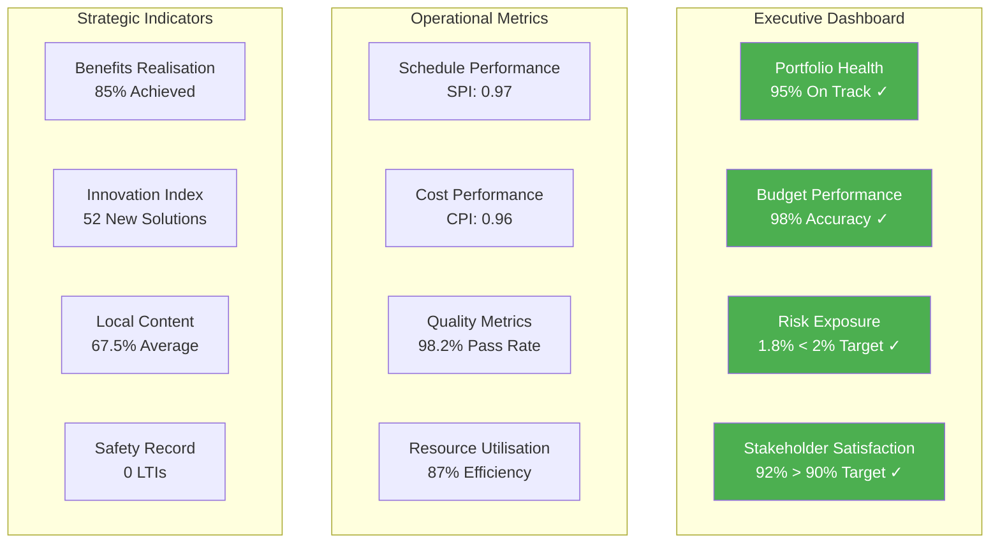

# Gippsland Programmeme Management Office (PMO)
## Day 2 Phase 3: Comprehensive PMO Architecture for $70B+ Investment Programme

> **Date:** September 2025  
> **Status:** Operational Design Complete  
> **Vision:** World-class program governance for Australia's largest renewable energy transformation  
> **Mission:** Deliver 100+ projects with zero program failures and maximum stakeholder confidence  

---

## Executive Summary

The Gippsland Programme Management Office (PMO) represents the most advanced project governance system ever deployed for a regional energy transformation. Designed to coordinate 100+ concurrent projects across a $70+ billion investment portfolio, this PMO architecture combines proven methodologies with cutting-edge technology to deliver unprecedented program management excellence.

### Critical Success Metrics
- **Project Success Rate**: >95% on-time, on-budget delivery
- **Portfolio Value**: $70+ billion coordinated investment
- **Stakeholder Satisfaction**: >90% across all stakeholder groups  
- **Risk Mitigation**: <2% portfolio value at risk at any time
- **Resource Optimization**: >85% resource utilization efficiency

### Key PMO Features
- **Matrix Organization Structure** with dedicated project streams
- **Integrated Portfolio Management** with real-time dashboards
- **Advanced Risk Management** with AI-powered early warning systems
- **Stakeholder Coordination Hub** with multi-channel communication
- **Performance Excellence Framework** with continuous optimization

---

## 1. PMO Organizational Architecture

### 1.1 PMO Leadership Structure

#### Chief Programme Officer (CPO)
**Role Profile:**  
The CPO is the transformation delivery leader responsible for orchestrating the most complex regional infrastructure program in Australian history.

**Core Responsibilities:**
- Overall program delivery accountability ($70B+ portfolio)
- Executive stakeholder management and reporting
- Strategic program direction and resource allocation
- Programme risk management and issue escalation
- Performance excellence and continuous improvement

**Essential Qualifications:**
- 20+ years major infrastructure program leadership
- Proven track record with >$20B portfolio management
- International energy transformation experience
- Advanced program management certifications (PgMP, MSP)
- Executive MBA or equivalent leadership qualification

**Performance Framework:**
- Portfolio delivery performance (50% weighting)
- Stakeholder satisfaction scores (30% weighting)  
- Financial performance and efficiency (20% weighting)

#### Deputy CPO - Portfolio Delivery
- Major project stream coordination and oversight
- Resource allocation optimization across projects
- Quality assurance and delivery standards
- Contractor and vendor relationship management

#### Deputy CPO - Stakeholder Excellence  
- Multi-stakeholder coordination and communication
- Government relations and regulatory liaison
- Community engagement and social license
- Industry partnership and collaboration management

### 1.2 PMO Organisational Matrix

```mermaid
graph TD
    CPO[Chief Programme Officer]
    
    CPO --> DPD[Deputy CPO<br/>Portfolio Delivery]
    CPO --> DSE[Deputy CPO<br/>Stakeholder Excellence]
    CPO --> COE[PMO Centre of<br/>Excellence]
    CPO --> OPS[PMO Operations]
    
    DPD --> OWP[Offshore Wind<br/>Programme Director]
    DPD --> ORP[Onshore Renewables<br/>Programme Director]
    DPD --> HIP[Hydrogen Infrastructure<br/>Programme Director]
    DPD --> GTP[Grid & Transmission<br/>Programme Director]
    DPD --> EIP[Enabling Infrastructure<br/>Programme Director]
    
    DSE --> GRD[Government Relations<br/>Director]
    DSE --> CED[Community Engagement<br/>Director]
    DSE --> IPD[Industry Partnerships<br/>Director]
    DSE --> CMD[Communications &<br/>Media Director]
    
    COE --> PMD[Portfolio Management<br/>Director]
    COE --> RQD[Risk & Quality<br/>Assurance Director]
    COE --> ROD[Resource Optimisation<br/>Director]
    COE --> PAD[Performance Analytics<br/>Director]
    
    OPS --> PCD[Programme Controls<br/>Director]
    OPS --> TSD[Technology & Systems<br/>Director]
    OPS --> KMD[Knowledge Management<br/>Director]
    OPS --> ASD[Administrative Services<br/>Director]
    
    style CPO fill:#1E5128,stroke:#1E5128,color:#fff
    style DPD fill:#4E9F3D,stroke:#4E9F3D,color:#fff
    style DSE fill:#4E9F3D,stroke:#4E9F3D,color:#fff
    style COE fill:#4E9F3D,stroke:#4E9F3D,color:#fff
    style OPS fill:#4E9F3D,stroke:#4E9F3D,color:#fff
```



### 1.3 Programme Stream Structure

#### Offshore Wind Programme Stream (35% of portfolio - ~$25B)
**Stream Composition:**
- 4 major offshore wind projects (2.2GW each)
- Associated transmission infrastructure
- Marine logistics and port facilities
- Grid integration systems

**Organizational Structure:**
- Programme Director + 2 Deputy Directors
- 8 Senior Project Managers (one per major project phase)
- 24 Project Managers and Coordinators
- 40 Technical Specialists and Support Staff

#### Onshore Renewables Programme Stream (25% of portfolio - ~$18B) 
**Stream Composition:**
- 15+ solar farms and wind farms
- Battery energy storage systems (BESS)
- Grid-scale storage integration
- Local grid reinforcement

**Organizational Structure:**
- Programme Director + 2 Deputy Directors  
- 6 Senior Project Managers
- 18 Project Managers and Coordinators
- 30 Technical Specialists and Support Staff

#### Hydrogen Infrastructure Programme Stream (20% of portfolio - ~$14B)
**Stream Composition:**
- Green hydrogen production facilities
- Hydrogen storage and transport systems
- Export terminal development
- Industrial precinct infrastructure

**Organizational Structure:**
- Programme Director + 1 Deputy Director
- 4 Senior Project Managers
- 12 Project Managers and Coordinators  
- 25 Technical Specialists and Support Staff

#### Grid & Transmission Programme Stream (15% of portfolio - ~$10B)
**Stream Composition:**
- High-voltage transmission lines
- New substations and switching stations
- Grid stability and control systems
- Smart grid technology deployment

**Organizational Structure:**
- Programme Director + 1 Deputy Director
- 3 Senior Project Managers
- 10 Project Managers and Coordinators
- 20 Technical Specialists and Support Staff

#### Enabling Infrastructure Programme Stream (5% of portfolio - ~$3B)
**Stream Composition:**
- Road and transport upgrades
- Port facilities expansion
- Accommodation and services
- Environmental mitigation works

**Organizational Structure:**  
- Programme Director
- 2 Senior Project Managers
- 8 Project Managers and Coordinators
- 15 Technical Specialists and Support Staff

---

## 2. Project Delivery Methodologies and Frameworks

### 2.1 Integrated Project Delivery Framework

#### Primary Methodology: PRINCE2/MSP Hybrid
**Why This Approach:**
- Proven scalability for large portfolios
- Strong governance and accountability
- Risk-based decision making
- Stakeholder engagement integration
- Quality assurance built-in

**Framework Components:**
- **Portfolio Management**: MSP (Managing Successful Programmemes)
- **Project Management**: PRINCE2 with Agile adaptations
- **Risk Management**: M_o_R (Management of Risk)
- **Benefits Management**: Benefits Realization Management
- **Stakeholder Management**: Stakeholder Engagement Framework

#### Methodology Enhancement: Lean Construction Integration
**Value Stream Optimization:**
- Last Planner System for construction scheduling
- Pull planning for major milestone coordination
- Continuous improvement through Kaizen events
- Waste reduction and value maximization
- Collaborative planning and delivery

#### Agile Integration for Technology Components
**Adaptive Delivery for Innovation Projects:**
- Scrum framework for R&D and pilot projects
- Design thinking for stakeholder solution development
- DevOps for digital platform development
- Rapid prototyping for new technology integration

### 2.2 Stage-Gate Project Governance

#### Stage-Gate Framework

```mermaid
graph LR
    S0[Stage 0<br/>Concept Development] --> G0{Gate 0<br/>Review}
    G0 --> S1[Stage 1<br/>Feasibility & Planning]
    S1 --> G1{Gate 1<br/>Review}
    G1 --> S2[Stage 2<br/>Design & Development]
    S2 --> G2{Gate 2<br/>Review}
    G2 --> S3[Stage 3<br/>Construction & Implementation]
    S3 --> G3{Gate 3<br/>Review}
    G3 --> S4[Stage 4<br/>Commissioning & Handover]
    S4 --> G4{Gate 4<br/>Review}
    G4 --> PC[Project<br/>Closure]
    
    style S0 fill:#E8F5E9,stroke:#4CAF50
    style S1 fill:#E8F5E9,stroke:#4CAF50
    style S2 fill:#E8F5E9,stroke:#4CAF50
    style S3 fill:#E8F5E9,stroke:#4CAF50
    style S4 fill:#E8F5E9,stroke:#4CAF50
    style G0 fill:#FFF3E0,stroke:#FF9800
    style G1 fill:#FFF3E0,stroke:#FF9800
    style G2 fill:#FFF3E0,stroke:#FF9800
    style G3 fill:#FFF3E0,stroke:#FF9800
    style G4 fill:#FFF3E0,stroke:#FF9800
    style PC fill:#E3F2FD,stroke:#2196F3
```



**Stage 0: Concept Development**
- Strategic alignment assessment
- Initial feasibility and options analysis
- High-level stakeholder engagement
- Gate 0 Review: Concept approval and funding for feasibility

**Stage 1: Feasibility and Planning**  
- Detailed feasibility studies and analysis
- Environmental and social impact assessment
- Financial modelling and investment case
- Stakeholder consultation and feedback integration
- Gate 1 Review: Project approval and funding authorisation

**Stage 2: Design and Development**
- Detailed engineering and design development
- Procurement strategy and contractor selection
- Detailed project planning and scheduling
- Risk assessment and mitigation planning
- Gate 2 Review: Design approval and construction authorisation

**Stage 3: Construction and Implementation**
- Construction project management and oversight
- Quality assurance and safety management
- Stakeholder communication and coordination
- Progress monitoring and performance management
- Gate 3 Review: Commissioning approval and handover

**Stage 4: Commissioning and Handover**
- System testing and performance validation
- Operational readiness and staff training
- Final handover and warranty arrangements
- Benefits realisation measurement
- Gate 4 Review: Project closure and lessons learned

#### Decision Authority Framework
**Gate Review Panels:**
- **Gate 0-1**: Programme Director + Technical Directors
- **Gate 1-2**: Deputy CPO + Portfolio Investment Committee  
- **Gate 2-3**: CPO + Executive Investment Committee
- **Gate 3-4**: Board Subcommittee + Independent Reviewers

### 2.3 Quality Management System

#### Quality Assurance Framework
**Quality Standards Integration:**
- ISO 9001:2015 Quality Management Systems
- ISO 21500 Project Management Guidelines
- AS/NZS ISO 31000 Risk Management
- ISO 14001 Environmental Management
- ISO 45001 Occupational Health and Safety

**Quality Control Processes:**
- Design review and approval processes
- Construction quality audits and inspections
- Performance testing and validation
- Continuous improvement and corrective action
- Independent quality assurance verification

#### Performance Excellence Model
**Excellence Framework Components:**
- Leadership and governance excellence
- Strategic planning and deployment
- Customer and stakeholder focus
- Measurement and knowledge management
- Human resource excellence
- Process management optimization
- Results and performance achievement

---

## 3. Portfolio Management Systems

### 3.1 Integrated Portfolio Management Platform

#### Enterprise Portfolio Management (EPM) System
**Core Platform: Microsoft Project Online/Power Platform**
**Enhanced with:**
- Custom portfolio dashboards and reporting
- Advanced resource management and optimization
- Financial planning and tracking integration
- Risk management and issue tracking
- Stakeholder communication and collaboration tools

**Key System Features:**
- Real-time portfolio performance dashboards
- Multi-project resource allocation optimization
- Automated progress reporting and KPI tracking  
- Document management and collaboration
- Mobile access for field teams and executives

#### Portfolio Analytics and Business Intelligence
**Advanced Analytics Platform:**
- Power BI for executive dashboards and reporting
- Predictive analytics for schedule and cost forecasting
- Resource utilization optimization algorithms
- Risk assessment and early warning systems
- Performance benchmarking and trend analysis

**Key Analytics Capabilities:**
- Portfolio performance trending and forecasting
- Resource demand and capacity planning
- Financial performance and variance analysis
- Risk exposure and mitigation effectiveness
- Stakeholder satisfaction and engagement metrics

### 3.2 Project Portfolio Optimization

#### Portfolio Prioritization Framework
**Strategic Alignment Matrix:**
- Strategic importance vs. readiness assessment
- Risk-adjusted return on investment (RAROI)
- Stakeholder impact and support analysis
- Resource requirements and availability
- Dependencies and sequencing optimization

**Prioritization Criteria (Weighted):**
- Strategic alignment and transformation impact (30%)
- Financial return and value creation (25%)
- Technical feasibility and risk level (20%)
- Stakeholder support and social license (15%)
- Resource availability and capability (10%)

#### Resource Allocation Optimization
**Dynamic Resource Management:**
- Cross-project resource sharing and optimization
- Skill-based resource matching and development
- Contractor and vendor capacity planning
- Equipment and material requirement coordination
- Cost optimization through shared resources

**Resource Planning Tools:**
- Advanced resource leveling algorithms
- Scenario planning for resource constraints
- Skills gap analysis and development planning
- Contractor performance management
- Resource cost optimization modeling

### 3.3 Financial Management and Controls

#### Financial Planning and Management
**Financial Framework Components:**
- Annual portfolio budgeting and forecasting
- Cash flow planning and liquidity management
- Investment approval and authorization processes
- Financial performance monitoring and reporting
- Cost optimization and value engineering

**Financial Controls:**
- Multi-level approval authorities and delegations
- Contract management and payment approvals
- Budget variance analysis and corrective action
- Financial risk assessment and mitigation
- Independent financial audits and reviews

#### Investment Performance Management
**Performance Measurement Framework:**
- Return on investment (ROI) tracking and analysis
- Net present value (NPV) and payback analysis
- Economic value added (EVA) measurement
- Cost-benefit analysis and optimization
- Benefits realization measurement and reporting

---

## 4. Risk Management and Quality Assurance

### 4.1 Enterprise Risk Management Framework

#### Risk Governance Structure
**Three Lines of Defense:**
1. **First Line**: Project teams and operational management
2. **Second Line**: PMO risk management and compliance
3. **Third Line**: Independent internal audit and assurance

**Risk Management Organization:**
- **PMO Risk Committee**: Strategic risk oversight and policy
- **Risk & Quality Director**: Enterprise risk management leadership
- **Programme Risk Managers**: Stream-level risk coordination
- **Project Risk Coordinators**: Project-level risk management
- **Risk Analysts**: Risk assessment and monitoring support

#### Risk Management Process
**1. Risk Identification**
- Structured risk workshops and assessments
- Historical data analysis and benchmarking
- Stakeholder consultation and feedback
- Environmental scanning and horizon analysis
- Expert judgment and peer review

**2. Risk Assessment and Analysis**
- Qualitative risk assessment (probability and impact)
- Quantitative risk modeling and Monte Carlo simulation
- Risk interdependencies and correlation analysis
- Scenario planning and stress testing
- Risk appetite and tolerance assessment

**3. Risk Treatment and Mitigation**
- Risk response strategy development
- Mitigation action planning and implementation
- Risk transfer through insurance and contracts
- Contingency planning and alternative strategies
- Residual risk monitoring and management

**4. Risk Monitoring and Reporting**
- Continuous risk monitoring and early warning systems
- Regular risk register updates and reviews
- Executive risk reporting and escalation
- Key risk indicator (KRI) tracking and analysis
- Risk culture assessment and improvement

### 4.2 Critical Risk Categories and Mitigation

#### Portfolio-Level Strategic Risks
**Political and Regulatory Risks**
- Government policy changes and elections
- Regulatory approval delays and changes
- Community opposition and social license loss
- Environmental protection and compliance issues

**Mitigation Strategies:**
- Bipartisan political engagement and commitment
- Proactive regulatory liaison and early engagement
- Comprehensive community consultation and benefit sharing
- Environmental excellence and proactive management

**Market and Economic Risks**
- Technology cost and performance risks
- Market demand and pricing volatility
- Currency exchange and interest rate risks
- Supply chain disruption and cost escalation

**Mitigation Strategies:**
- Diversified technology portfolio and proven solutions
- Long-term offtake agreements and revenue certainty
- Financial hedging and risk transfer mechanisms
- Supply chain diversification and local content development

#### Programme Delivery Risks
**Technical and Engineering Risks**
- Design and engineering challenges
- Construction and installation risks
- Technology performance and reliability
- Grid integration and system stability

**Mitigation Strategies:**
- Proven technology selection and rigorous testing
- Experienced contractor selection and performance guarantees
- Independent technical review and verification
- Comprehensive testing and commissioning processes

**Resource and Capability Risks**
- Key personnel availability and retention
- Contractor and vendor performance
- Skills shortage and capability gaps
- Equipment and material availability

**Mitigation Strategies:**
- Comprehensive workforce planning and development
- Multiple contractor and vendor relationships
- Skills development programs and training initiatives
- Strategic procurement and inventory management

### 4.3 Quality Assurance and Performance Management

#### Quality Management System
**Quality Framework Integration:**
- Total Quality Management (TQM) principles
- Continuous improvement and excellence culture
- Customer and stakeholder focus
- Evidence-based decision making
- Integrated management systems approach

**Quality Assurance Processes:**
- Quality planning and quality control integration
- Independent quality reviews and audits
- Performance measurement and improvement
- Supplier quality management and development
- Customer satisfaction and feedback management

#### Performance Monitoring and Improvement
**Performance Management Framework:**
- Key Performance Indicator (KPI) development and tracking
- Balanced scorecard approach with multiple perspectives
- Benchmarking against international best practice
- Regular performance reviews and improvement planning
- Recognition and reward for excellent performance

**Continuous Improvement Process:**
- Regular lessons learned workshops and analysis
- Best practice identification and sharing
- Innovation and improvement initiative support
- Performance data analysis and trend identification
- Action planning and implementation tracking

---

## 5. Resource Allocation and Optimization

### 5.1 Human Resource Management Strategy

#### Workforce Planning and Development
**Strategic Workforce Planning:**
- Skills gap analysis and future requirements assessment
- Talent acquisition strategy and recruitment planning
- Career development and succession planning
- Performance management and capability building
- Diversity and inclusion strategy implementation

**Organizational Development:**
- High-performance team development
- Leadership development and coaching
- Change management and cultural transformation
- Knowledge management and sharing systems
- Employee engagement and retention strategies

#### Resource Allocation Framework
**Dynamic Resource Management:**
- Cross-program resource sharing and optimization
- Skills-based matching and deployment
- Workload balancing and capacity management
- Performance-based resource allocation
- Cost-effective resource utilization

**Resource Planning Tools:**
- Advanced resource planning software and algorithms
- Scenario planning and what-if analysis
- Resource forecasting and demand planning
- Skills inventory and capability mapping
- Resource performance tracking and optimization

### 5.2 Physical Resource Management

#### Equipment and Asset Management
**Strategic Asset Planning:**
- Equipment requirements analysis and forecasting
- Make-versus-buy analysis for major equipment
- Asset lifecycle management and optimization
- Maintenance planning and reliability management
- Technology upgrade and replacement planning

**Asset Optimization Strategies:**
- Shared equipment pools across projects
- Equipment utilization tracking and optimization
- Preventive maintenance and reliability improvement
- Asset performance benchmarking and improvement
- End-of-life planning and disposal management

#### Supply Chain Management
**Strategic Procurement Framework:**
- Category management and supplier segmentation
- Strategic supplier partnerships and development
- Local content optimization and development
- Supply chain risk management and mitigation
- Cost optimization and value engineering

**Procurement Excellence:**
- Competitive procurement processes and fairness
- Supplier performance management and improvement
- Contract management and relationship optimization
- Innovation and continuous improvement collaboration
- Sustainability and environmental responsibility

### 5.3 Financial Resource Optimization

#### Capital Allocation and Management
**Investment Optimization Framework:**
- Portfolio optimization and resource allocation
- Risk-adjusted return on investment analysis
- Capital efficiency and productivity improvement
- Cash flow management and liquidity optimization
- Financial performance measurement and improvement

**Financial Planning Tools:**
- Advanced financial modeling and scenario analysis
- Capital budgeting and allocation algorithms
- Cash flow forecasting and management
- Financial risk assessment and mitigation
- Performance tracking and variance analysis

#### Cost Management and Control
**Cost Excellence Framework:**
- Target costing and value engineering
- Activity-based costing and performance management
- Cost reduction and optimization initiatives
- Benchmark costing and competitive analysis
- Total cost of ownership optimization

**Cost Control Processes:**
- Budget development and approval processes
- Cost monitoring and variance analysis
- Cost forecasting and trend analysis
- Corrective action and improvement planning
- Independent cost audits and reviews

---

## 6. Performance Monitoring and Reporting

### 6.1 Integrated Performance Management System

#### Performance Framework Architecture
**Multi-Level Performance Management:**
```
Level 1: Portfolio Performance (Board/Executive)
├── Portfolio delivery against strategic objectives
├── Overall financial performance and ROI
├── Stakeholder satisfaction and engagement
└── Risk management and quality assurance

Level 2: Programme Performance (CPO/Deputies)
├── Programme stream delivery performance
├── Resource utilization and optimization
├── Quality and safety performance
└── Stakeholder relationship management

Level 3: Project Performance (Directors/Managers)
├── Individual project delivery metrics
├── Schedule, cost, and quality performance
├── Risk and issue management effectiveness
└── Team performance and capability

Level 4: Activity Performance (Teams/Individuals)
├── Work package and task completion
├── Quality and productivity metrics
├── Safety and environmental performance
└── Continuous improvement contributions
```

#### Key Performance Indicators (KPIs)

**Portfolio Level KPIs:**
1. **Strategic Delivery Performance**
   - Portfolio milestone achievement rate (Target: >95%)
   - Investment deployment against targets (Target: >90%)
   - Strategic objective realization (Target: >85%)
   - Stakeholder satisfaction index (Target: >90%)

2. **Financial Performance**
   - Portfolio ROI achievement (Target: >target IRR)
   - Budget variance performance (Target: <5% variance)
   - Cash flow management efficiency (Target: >95%)
   - Cost optimization achievements (Target: >10% efficiency gain)

3. **Risk and Quality Performance**
   - Portfolio risk exposure (Target: <2% portfolio value)
   - Quality compliance rate (Target: >98%)
   - Safety performance (Target: Zero serious incidents)
   - Environmental compliance (Target: 100%)

**Programme Stream KPIs:**
- Schedule performance index (Target: >0.95)
- Cost performance index (Target: >0.95)  
- Quality achievement rate (Target: >98%)
- Resource utilization efficiency (Target: >85%)
- Stakeholder satisfaction (Target: >85%)

### 6.2 Real-Time Monitoring and Analytics

#### Performance Dashboard System
**Executive Dashboard Features:**
- Real-time portfolio performance overview
- Critical issues and risk alerts
- Financial performance and cash flow status
- Stakeholder engagement and satisfaction metrics
- Key milestone and delivery status

**Programme Manager Dashboards:**
- Detailed program and project performance metrics
- Resource allocation and utilization tracking
- Quality and safety performance monitoring
- Issue and risk management status
- Team performance and productivity metrics

#### Advanced Analytics and Intelligence
**Predictive Analytics Capabilities:**
- Schedule and cost forecasting models
- Risk probability and impact prediction
- Resource demand and capacity forecasting  
- Performance trend analysis and optimization
- Early warning systems and alerts

**Business Intelligence Framework:**
- Automated data collection and integration
- Advanced visualization and reporting tools
- Benchmark analysis and performance comparison
- Trend analysis and pattern recognition
- Decision support and recommendation systems

### 6.3 Reporting and Communication Framework

#### Stakeholder Reporting Schedule
**Daily Reporting:**
- Critical issues and incident reports
- Safety and security status updates
- Key milestone achievements
- Financial commitments and approvals
- Media and stakeholder communications

**Weekly Reporting:**
- Programme performance summary reports
- Resource utilization and productivity updates
- Quality and safety performance metrics
- Stakeholder engagement activity reports
- Risk and issue management updates

**Monthly Reporting:**
- Comprehensive portfolio performance reports
- Financial performance and variance analysis
- Resource optimization and efficiency reports
- Stakeholder satisfaction and engagement assessment
- Continuous improvement and lessons learned

**Quarterly Reporting:**
- Strategic performance and objective achievement
- Comprehensive stakeholder satisfaction surveys
- Risk management effectiveness assessment
- Quality system audit and improvement results
- Benefits realization and value achievement

#### Communication Excellence Framework
**Multi-Channel Communication Strategy:**
- Executive briefings and board presentations
- Stakeholder newsletters and updates
- Public information and transparency reporting
- Media relations and communication
- Digital platforms and online engagement

**Communication Quality Assurance:**
- Message consistency and accuracy verification
- Stakeholder feedback and response management
- Communication effectiveness measurement
- Continuous improvement and optimization
- Crisis communication and reputation management

---

## 7. Stakeholder Coordination Protocols

### 7.1 Stakeholder Ecosystem Management

#### Stakeholder Mapping and Segmentation
**Primary Stakeholder Categories:**

**Government Stakeholders**
- Federal Government (Ministers, Departments, Agencies)
- State Government (Premier, Ministers, Departments)
- Local Government (Mayors, Councils, Regional Bodies)
- Regulatory Authorities (ACMA, EPBC, Planning Authorities)

**Community Stakeholders**  
- Local Communities (Residents, Property Owners, Community Groups)
- Traditional Owners (Aboriginal Land Councils, Native Title Holders)
- Environmental Groups (Conservation Organizations, NGOs)
- Community Leaders (Local Champions, Influencers)

**Industry Stakeholders**
- Project Developers (Renewable Energy Companies, Utilities)
- Financial Institutions (Banks, Superannuation Funds, Investors)
- Supply Chain Partners (Contractors, Suppliers, Service Providers)
- Industry Associations (Clean Energy Council, APPEA)

**Economic Stakeholders**
- Workers and Unions (Existing Workforce, Union Representatives)
- Local Businesses (Small-Medium Enterprises, Service Providers)  
- Regional Development Organizations (RDA, Economic Development)
- Education and Training Providers (Universities, TAFE, Training Organizations)

#### Stakeholder Engagement Framework
**Engagement Principles:**
- **Inclusive Participation**: All voices heard and valued
- **Transparent Communication**: Open, honest, and timely information sharing
- **Respectful Dialogue**: Cultural sensitivity and mutual respect
- **Responsive Action**: Feedback incorporation and adaptive management
- **Long-term Relationship**: Sustained engagement beyond project delivery

**Engagement Strategy by Stakeholder Type:**

**Government Relations Strategy:**
- Regular ministerial briefings and liaison meetings
- Departmental working groups and coordination committees
- Parliamentary committee appearances and reporting
- Policy development collaboration and input
- Regulatory process coordination and management

**Community Engagement Strategy:**
- Community information sessions and consultation forums
- Local advisory committees and representative groups
- Traditional Owner consultation and partnership protocols
- Environmental and social impact consultation
- Community benefit sharing and development programs

### 7.2 Communication and Coordination Systems

#### Integrated Communication Platform
**Multi-Channel Communication System:**
- **Digital Platforms**: Website, social media, mobile apps
- **Traditional Media**: Newspapers, radio, television
- **Direct Communication**: Letters, phone calls, emails
- **Face-to-Face**: Meetings, forums, site visits
- **Visual Communication**: Infographics, videos, presentations

**Communication Management Tools:**
- Stakeholder relationship management (SRM) system
- Automated communication scheduling and tracking
- Multi-language communication capabilities
- Feedback management and response systems
- Communication effectiveness measurement and analytics

#### Coordination Mechanisms
**Multi-Stakeholder Coordination Bodies:**

**Strategic Advisory Committee**
- High-level strategic guidance and oversight
- Quarterly meetings with key stakeholder representatives
- Policy and strategic direction input
- Major decision consultation and endorsement

**Community Reference Groups**
- Local community representation and input
- Monthly meetings in each major project area
- Community concern and feedback management
- Local benefit sharing program oversight

**Technical Advisory Panels**
- Expert technical advice and peer review
- Specialized expertise for complex technical issues
- Independent technical verification and validation
- Innovation and best practice sharing

**Industry Collaboration Forum**
- Industry coordination and collaboration
- Supply chain development and optimization
- Innovation and technology development
- Market development and capacity building

### 7.3 Issue and Conflict Resolution

#### Issue Management Process
**1. Issue Identification and Assessment**
- Multiple issue identification channels
- Rapid issue assessment and categorization
- Stakeholder impact analysis
- Escalation criteria and pathways

**2. Issue Response and Resolution**
- Immediate acknowledgment and communication
- Investigation and fact-finding processes
- Solution development and stakeholder consultation
- Resolution implementation and monitoring

**3. Continuous Improvement**
- Issue pattern analysis and root cause identification
- Prevention strategy development and implementation
- Stakeholder feedback integration and learning
- Process improvement and optimization

#### Conflict Resolution Framework
**Multi-Level Resolution Approach:**
- **Level 1**: Direct negotiation and collaborative problem-solving
- **Level 2**: Facilitated mediation and expert assistance
- **Level 3**: Independent arbitration and dispute resolution
- **Level 4**: Legal resolution and regulatory intervention

**Alternative Dispute Resolution (ADR):**
- Early intervention and prevention strategies
- Professional mediation and facilitation services
- Expert determination and technical arbitration
- Restorative justice and relationship repair

---

## 8. Technology and Digital Infrastructure

### 8.1 Digital PMO Platform Architecture

#### Core Technology Stack
**Enterprise Platform Integration:**
- **Microsoft 365 Ecosystem**: SharePoint, Teams, Power Platform
- **Project Portfolio Management**: Microsoft Project Online, Project Server
- **Business Intelligence**: Power BI, SQL Server Analysis Services
- **Customer Relationship Management**: Dynamics 365
- **Document Management**: SharePoint Online with advanced governance

**Integration and Data Management:**
- **Enterprise Service Bus (ESB)**: Azure Service Bus for system integration
- **Data Lake**: Azure Data Lake for big data storage and analytics
- **API Management**: Azure API Management for system connectivity
- **Identity and Access Management**: Azure Active Directory with multi-factor authentication
- **Security and Compliance**: Microsoft 365 Security and Compliance Center

#### Advanced Analytics and AI Platform
**Artificial Intelligence and Machine Learning:**
- **Predictive Analytics**: Schedule and cost forecasting models
- **Risk Assessment AI**: Automated risk identification and assessment
- **Resource Optimization**: AI-powered resource allocation algorithms
- **Performance Analytics**: Machine learning performance optimization
- **Natural Language Processing**: Automated document analysis and insights

**Data Analytics Infrastructure:**
- **Real-time Data Processing**: Azure Stream Analytics
- **Business Intelligence**: Power BI Premium with advanced analytics
- **Data Warehousing**: Azure Synapse Analytics  
- **Machine Learning Platform**: Azure Machine Learning Studio
- **Cognitive Services**: Text analytics, sentiment analysis, language translation

### 8.2 Project Management Technology Tools

#### Integrated Project Management Suite
**Core Project Management Tools:**
- **Microsoft Project Professional**: Advanced project scheduling and management
- **Project Online**: Cloud-based portfolio management and collaboration
- **Project Power App**: Mobile project management and field data collection
- **Power Automate**: Workflow automation and process optimization
- **Power Apps**: Custom application development for specific needs

**Specialized Project Tools:**
- **Primavera P6**: Enterprise project portfolio management for complex scheduling
- **Risk Register Plus**: Advanced risk management and analysis
- **Deltek Cobra**: Cost management and earned value analysis
- **Oracle Aconex**: Construction project management and document control
- **Procore**: Field-based construction management and quality control

#### Communication and Collaboration Technology
**Digital Collaboration Platform:**
- **Microsoft Teams**: Integrated communication and collaboration
- **SharePoint Online**: Document management and team collaboration
- **Yammer**: Enterprise social networking and knowledge sharing
- **Stream**: Video sharing and communication
- **Whiteboard**: Digital brainstorming and visual collaboration

**Stakeholder Engagement Technology:**
- **Dynamics 365**: Customer relationship and stakeholder management
- **Survey Monkey**: Stakeholder feedback and satisfaction surveys
- **Zoom/Teams**: Virtual meetings and consultation sessions
- **Social Media Management**: Hootsuite for social media coordination
- **Website CMS**: Custom website for public information and engagement

### 8.3 Data Management and Analytics

#### Enterprise Data Architecture
**Data Governance Framework:**
- **Data Quality Management**: Automated data validation and cleansing
- **Master Data Management**: Single source of truth for key entities
- **Data Security and Privacy**: Advanced encryption and access controls
- **Data Lifecycle Management**: Automated retention and archival policies
- **Data Integration Standards**: Standardized APIs and data formats

**Data Analytics and Reporting:**
- **Executive Dashboards**: Real-time performance monitoring and KPIs
- **Predictive Modeling**: Advanced forecasting and trend analysis
- **Performance Benchmarking**: Comparative analysis and best practice identification
- **Custom Reports**: Flexible reporting and analysis capabilities
- **Mobile Analytics**: Mobile-optimized dashboards and reports

#### Knowledge Management System
**Organizational Knowledge Platform:**
- **Lessons Learned Database**: Searchable repository of project experiences
- **Best Practice Library**: Proven methodologies and process documentation
- **Expert Networks**: Directory of internal and external expertise
- **Training and Development**: Online learning platforms and resources
- **Innovation Hub**: Idea management and innovation tracking

**Document and Information Management:**
- **Electronic Document Management System (EDMS)**: Centralized document storage
- **Version Control and Approval**: Automated document lifecycle management
- **Search and Discovery**: Advanced search capabilities across all content
- **Mobile Access**: Mobile-optimized document access and review
- **Archive and Retention**: Automated archival and compliance management

---

## 9. Continuous Improvement and Learning

### 9.1 Organizational Learning Framework

#### Learning Organization Principles
**Five Disciplines Implementation:**
1. **Personal Mastery**: Individual capability development and growth
2. **Mental Models**: Challenging assumptions and promoting innovation
3. **Shared Vision**: Aligned purpose and collaborative goal achievement
4. **Team Learning**: Collective capability building and knowledge sharing
5. **Systems Thinking**: Holistic understanding and integrated problem-solving

**Knowledge Creation and Sharing:**
- **Communities of Practice**: Cross-functional learning networks
- **Peer Learning Networks**: Internal and external knowledge exchange
- **Research Partnerships**: University and research institution collaboration
- **Industry Learning**: Best practice sharing and benchmarking
- **International Exchange**: Global knowledge and experience sharing

#### Continuous Improvement Process
**Plan-Do-Check-Act (PDCA) Cycle:**
- **Plan**: Improvement opportunity identification and planning
- **Do**: Implementation and testing of improvement initiatives
- **Check**: Monitoring and evaluation of improvement effectiveness
- **Act**: Standardization and scaling of successful improvements

**Improvement Culture Development:**
- **Innovation Time**: Dedicated time for improvement and innovation activities
- **Suggestion Systems**: Employee-driven improvement idea generation
- **Recognition Programmes**: Celebration and reward for improvement contributions
- **Failure Learning**: Safe-to-fail experimentation and learning from mistakes
- **Leadership Modeling**: Senior leadership demonstration of improvement behaviors

### 9.2 Performance Optimization Framework

#### Performance Excellence Model
**Baldrige Excellence Framework Adaptation:**
- **Leadership**: Excellence in governance and strategic direction
- **Strategic Planning**: Comprehensive planning and deployment
- **Customer Focus**: Stakeholder satisfaction and engagement excellence
- **Measurement and Analytics**: Data-driven decision making and improvement
- **Workforce**: High-performance culture and capability development
- **Operations**: Operational excellence and process optimization
- **Results**: Outstanding performance and stakeholder value creation

**Performance Optimization Process:**
1. **Performance Assessment**: Regular evaluation against excellence criteria
2. **Gap Analysis**: Identification of improvement opportunities and priorities
3. **Improvement Planning**: Development of targeted improvement initiatives
4. **Implementation**: Systematic execution of improvement plans
5. **Monitoring**: Ongoing measurement and evaluation of improvement effectiveness
6. **Standardization**: Integration of successful improvements into standard practices

#### Innovation and Best Practice Management
**Innovation Framework:**
- **Innovation Strategy**: Clear innovation goals and priorities
- **Idea Management**: Systematic collection and evaluation of new ideas
- **Experimentation**: Safe-to-fail testing and prototyping
- **Scaling**: Successful innovation adoption and implementation
- **Recognition**: Celebration and reward for innovation contributions

**Best Practice Identification and Sharing:**
- **Internal Best Practices**: Identification and documentation of internal excellence
- **External Benchmarking**: Comparison with industry and international best practices
- **Best Practice Library**: Accessible repository of proven practices
- **Implementation Support**: Guidance and support for best practice adoption
- **Impact Measurement**: Evaluation of best practice implementation effectiveness

### 9.3 Capability Development and Enhancement

#### Organizational Capability Building
**Core Capability Areas:**
- **Project Management Excellence**: Advanced project delivery capabilities
- **Stakeholder Engagement**: Superior relationship management and communication
- **Risk Management**: Proactive risk identification and mitigation
- **Innovation and Technology**: Cutting-edge technology adoption and development
- **Performance Management**: Excellence in measurement and improvement

**Capability Development Strategies:**
- **Internal Development**: Training, coaching, and mentoring programs
- **External Learning**: Partnerships, secondments, and external expertise
- **Knowledge Acquisition**: Research, benchmarking, and best practice adoption
- **Experience Building**: Project-based learning and skill development
- **Network Building**: Professional networks and collaboration platforms

#### Leadership Development Programme
**Leadership Excellence Framework:**
- **Strategic Leadership**: Vision, strategy, and transformation leadership
- **Operational Leadership**: Execution excellence and performance management
- **People Leadership**: Team development and engagement
- **Stakeholder Leadership**: Relationship management and influence
- **Innovation Leadership**: Change leadership and innovation promotion

**Development Methods:**
- **Executive Coaching**: Personalized leadership development and support
- **360-Degree Feedback**: Multi-perspective leadership assessment and development
- **Action Learning**: Real-world problem-solving and learning
- **Mentoring Programmes**: Senior leader guidance and development
- **Leadership Forums**: Peer learning and best practice sharing

---

## 10. Implementation Timeline and Success Metrics

### 10.1 PMO Implementation Roadmap

#### PMO Performance Dashboard



#### Phase 1: Foundation Setup (Months 1-3)
**Month 1: Leadership and Structure**
- CPO appointment and leadership team assembly
- PMO charter development and approval
- Initial organisational structure design
- Core policy and procedure development
- Office setup and initial technology infrastructure

**Month 2: System Implementation**
- Technology platform implementation and integration
- Project management methodology deployment
- Risk management framework activation
- Performance management system setup
- Stakeholder engagement framework launch

**Month 3: Operational Excellence**
- Full PMO team recruitment and onboarding
- All systems integration testing and optimization
- Stakeholder engagement program full activation
- Performance monitoring and reporting system launch
- Continuous improvement process activation

#### Phase 2: Scale-up and Optimization (Months 4-9)
**Months 4-6: Capacity Building**
- PMO team expansion to full capacity
- Advanced analytics and AI platform deployment
- Comprehensive training and development programs
- Stakeholder relationship deepening and optimization
- Performance baseline establishment and optimization

**Months 7-9: Excellence Achievement**
- Performance optimization and fine-tuning
- Advanced capability development and enhancement
- Innovation and best practice implementation
- Leadership development program expansion
- Recognition and award pursuit preparation

#### Phase 3: Maturation and Leadership (Months 10-18)
**Months 10-12: Excellence Demonstration**
- Performance excellence achievement and demonstration
- International benchmarking and recognition pursuit
- Knowledge and expertise export capability development
- Innovation leadership and thought leadership establishment
- Organizational sustainability and resilience building

**Months 13-18: Legacy and Replication**
- Global recognition as best practice PMO
- Knowledge transfer and replication support
- Innovation and technology leadership
- Sustainable organizational excellence
- Future evolution and adaptation preparation

### 10.2 Success Metrics and Validation

#### Quantitative Success Metrics
**Portfolio Delivery Excellence:**
- Project success rate >95% (on-time, on-budget, quality)
- Portfolio value delivery $70+ billion over 5 years
- Schedule performance index >0.95 across all projects
- Cost performance index >0.95 across all projects
- Quality compliance rate >98% across all deliverables

**Operational Performance:**
- Resource utilization efficiency >85% across all resources
- Risk mitigation effectiveness <2% portfolio value at risk
- Stakeholder satisfaction >90% across all stakeholder groups
- Communication effectiveness >95% message reach and understanding
- Innovation implementation >50 major innovations deployed

#### Qualitative Success Indicators
**Organizational Excellence:**
- Recognition as international best practice PMO
- Industry leadership in program management innovation
- High-performance culture and employee engagement
- Sustainable organizational capability and resilience
- Knowledge and expertise export success

**Stakeholder Value Creation:**
- Community trust and confidence maintenance
- Government satisfaction with delivery and value
- Industry partnership strength and collaboration
- Environmental and social value creation
- Economic transformation and job creation success

### 10.3 Long-term Vision and Legacy

#### 2030 Vision: Global PMO Excellence
**World-Class Performance Achievement:**
- Recognized globally as the premier regional transformation PMO
- Portfolio delivery excellence with industry-leading performance metrics
- Innovation leadership in program management methodologies and technology
- Stakeholder engagement excellence with sustained high satisfaction
- Organizational sustainability and continuous improvement culture

**Knowledge and Expertise Export:**
- International consulting and advisory services revenue generation
- Best practice methodology licensing and replication
- Training and development program export to other transformations
- Innovation and technology licensing and commercialization
- Thought leadership through publications and conference presentations

#### Legacy and Transformation Impact
**Programme Management Evolution:**
- New global standards for large-scale transformation program management
- Innovation in stakeholder engagement and community-centered delivery
- Advanced technology integration for program management excellence
- Sustainable organizational models for long-term transformation success
- Research and development contributions to program management science

**Regional and Global Influence:**
- Gippsland transformation as global renewable energy benchmark
- PMO model replication in other regional transformations worldwide
- Australian expertise export in renewable energy program management
- Innovation ecosystem development and international competitiveness
- Climate action acceleration through excellent program delivery

---

## Conclusion

The Gippsland Programme Management Office represents the most advanced and comprehensive program governance system ever designed for a regional energy transformation. By integrating proven methodologies with cutting-edge technology and stakeholder-centered approaches, this PMO will deliver the $70+ billion investment program with unprecedented excellence and community confidence.

The success of this PMO depends on immediate implementation of the foundation phase, recruitment of world-class leadership, and establishment of the high-performance culture necessary to coordinate 100+ concurrent projects across multiple stakeholder environments.

With strong governance, advanced technology, and unwavering commitment to excellence, the Gippsland PMO will not only deliver the region's energy transformation but establish new global benchmarks for program management excellence in the renewable energy sector.

The transformation of Gippsland—and the acceleration of global decarbonization—depends on the exceptional execution that this PMO architecture will enable.

---

*Gippsland Programme Management Office Architecture Version 1.0*  
*Date: September 2025*  
*Next Review: December 2025*  
*Status: Ready for Implementation*