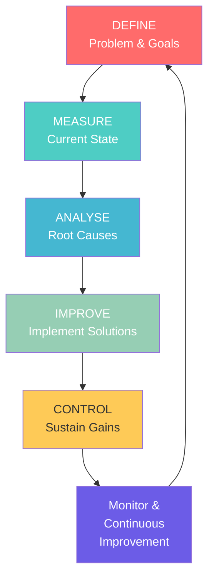

# Quality Assurance Framework Operations
## Gippsland Renewable Energy Transformation - Day 2 Phase 3

**Document Status:** OPERATIONAL FRAMEWORK  
**Version:** 1.0 - World-Class Standards  
**Date:** January 2025  
**Classification:** CRITICAL QUALITY SYSTEMS  

---

## Executive Summary

This framework establishes world-class quality assurance operations for Gippsland's $70 billion renewable energy transformation. The system ensures zero-defect delivery across manufacturing, construction, and operational phases while driving continuous improvement and stakeholder satisfaction.

**Quality Performance Targets:**
- **Zero Defect Rate:** Manufacturing and construction
- **99.9% Reliability:** Operational systems
- **ISO 9001:2015:** Full compliance across operations
- **Customer Satisfaction:** >95% rating
- **Continuous Improvement:** 20% annual efficiency gains

---

## 1. QUALITY MANAGEMENT SYSTEM ARCHITECTURE

### 1.1 Enterprise Quality Platform

#### A. Integrated Quality Management System (QMS)
**Core Components:**
- SAP Quality Management Module
- Siemens Opcenter Quality
- PTC Windchill Quality Solutions
- AI-powered defect prediction
- Blockchain quality certificates

**System Architecture:**
```
┌─────────────────────────────────────────────────┐
│          EXECUTIVE QUALITY DASHBOARD            │
├─────────────────────────────────────────────────┤
│    Real-time Metrics │ Predictive Analytics     │
├─────────────────┬───────────────────────────────┤
│                 │                               │
│  MANUFACTURING  │     CONSTRUCTION    │   OPS   │
│     QUALITY     │       QUALITY      │ QUALITY │
├─────────────────┼───────────────────┼──────────┤
│ • Process QA    │ • Site Inspection │ • Asset │
│ • Product Test  │ • Material Test   │ • Perf  │
│ • Supplier Audit│ • Safety Verify   │ • Maint │
└─────────────────┴───────────────────┴──────────┘
```

#### B. Digital Quality Infrastructure
1. **Cloud-Based QMS Platform**
   - Multi-site deployment
   - Real-time synchronization
   - Mobile field access
   - Offline capability
   - Automated reporting

2. **IoT Quality Sensors**
   - 10,000+ inspection points
   - Real-time monitoring
   - Automated alerts
   - Predictive maintenance
   - Quality trending

3. **AI/ML Quality Engine**
   - Defect prediction models
   - Pattern recognition
   - Root cause analysis
   - Quality optimisation
   - Continuous learning

### 1.2 Quality Standards Framework

#### A. Industry Standards Compliance
**Manufacturing Standards:**
- ISO 9001:2015 - Quality Management
- ISO 14001:2015 - Environmental
- ISO 45001:2018 - Safety Management
- AS/NZS 4801 - OHS Management
- IEC 61215/61730 - Solar components

**Construction Standards:**
- AS/NZS ISO 9001 - Construction Quality
- AS 4000 - Contract Management
- AS/NZS 3000 - Electrical Standards
- AS 1170 - Structural Standards
- AS 2885 - Pipeline Standards

**Operational Standards:**
- ISO 55001 - Asset Management
- ISO 50001 - Energy Management
- IEC 61850 - Grid Integration
- AEMO Standards - Market Operation
- NGERS - Emissions Reporting

#### B. Gippsland Excellence Standards
1. **Zero Defect Manufacturing**
   - 100% inspection protocols
   - Statistical process control
   - Automated rejection systems
   - Supplier quality gates
   - Continuous monitoring

2. **Construction Excellence**
   - Hold point verification
   - Digital witness points
   - Drone inspection protocols
   - 3D quality mapping
   - Real-time compliance

3. **Operational Excellence**
   - Predictive quality metrics
   - Performance optimisation
   - Reliability engineering
   - Availability targets
   - Efficiency benchmarks

---

## 2. PERFORMANCE STANDARDS AND METRICS

### 2.1 Quality KPI Framework

#### A. Manufacturing Quality Metrics
**Product Quality:**
- First Pass Yield: >99.5%
- Defect Rate: <100 PPM
- Scrap Rate: <0.5%
- Rework Rate: <1%
- Customer Returns: <0.1%

**Process Quality:**
- Process Capability: Cpk >1.67
- Equipment Effectiveness: OEE >85%
- Calibration Compliance: 100%
- Audit Score: >95%
- Corrective Action: <24 hours

#### B. Construction Quality Metrics
**Build Quality:**
- First-Time Right: >98%
- NCR Rate: <2%
- Punch List Items: <5 per MW
- Safety Incidents: Zero
- Schedule Adherence: >95%

**Inspection Metrics:**
- Hold Point Compliance: 100%
- Test Pass Rate: >99%
- Documentation Complete: 100%
- Witness Points: 100%
- As-Built Accuracy: ±2mm

#### C. Operational Quality Metrics
**Performance Quality:**
- System Availability: >99.5%
- Performance Ratio: >85%
- Mean Time Between Failures: >8760 hours
- Mean Time To Repair: <4 hours
- Capacity Factor: >40%

**Service Quality:**
- Response Time: <15 minutes
- Resolution Time: <4 hours
- Customer Satisfaction: >95%
- Complaint Rate: <0.1%
- Service Level Agreement: >99%

### 2.2 Quality Dashboards

#### A. Executive Quality Dashboard
**Real-Time Monitoring:**
```
┌────────────────────────────────────────────────┐
│            QUALITY COMMAND CENTER              │
├────────────────┬───────────────┬──────────────┤
│ Manufacturing  │ Construction   │ Operations   │
│ FPY: 99.6% ✓  │ FTR: 98.2% ✓  │ Avail: 99.7%│
│ PPM: 87 ✓     │ NCR: 1.8% ✓   │ MTBF: 9200h │
│ OEE: 86.3% ✓  │ Safety: 0 ✓   │ CS: 96.2% ✓ │
├────────────────┴───────────────┴──────────────┤
│           QUALITY TRENDS & ALERTS              │
│ • Supplier X: Quality drop detected            │
│ • Site Y: Hold point verification due          │
│ • Asset Z: Predictive maintenance required     │
└────────────────────────────────────────────────┘
```

#### B. Operational Quality Centers
1. **Manufacturing Quality Center**
   - Real-time SPC charts
   - Defect heat maps
   - Supplier scorecards
   - Process capability
   - Quality predictions

2. **Construction Quality Hub**
   - Site inspection status
   - NCR tracking
   - Test results
   - Progress photos
   - Compliance matrix

3. **Operations Quality Portal**
   - Asset performance
   - Maintenance quality
   - Service metrics
   - Customer feedback
   - Improvement tracking

---

## 3. CONTINUOUS IMPROVEMENT PROCESSES

### 3.1 Lean Six Sigma Program

#### A. Improvement Methodology



**DMAIC Framework:**
1. **Define Phase**
   - Problem identification
   - Project charter
   - Stakeholder analysis
   - Goal setting
   - Resource planning

2. **Measure Phase**
   - Data collection plans
   - Measurement systems
   - Baseline performance
   - Process mapping
   - Capability studies

3. **Analyse Phase**
   - Root cause analysis
   - Statistical analysis
   - Process analysis
   - Failure mode analysis
   - Hypothesis testing

4. **Improve Phase**
   - Solution development
   - Pilot testing
   - Implementation plans
   - Risk assessment
   - Change management

5. **Control Phase**
   - Control plans
   - SPC implementation
   - Training programmes
   - Documentation
   - Sustainability plans

#### B. Kaizen Culture
**Continuous Improvement Program:**
1. **Employee Suggestions**
   - Digital suggestion box
   - Monthly recognition
   - Implementation tracking
   - Reward system
   - Success sharing

2. **Kaizen Events**
   - Weekly team huddles
   - Monthly workshops
   - Quarterly hackathons
   - Annual conferences
   - Cross-site learning

3. **Innovation Labs**
   - Quality innovation center
   - Rapid prototyping
   - Digital twins
   - VR/AR training
   - AI experimentation

### 3.2 Quality Circles

#### A. Team Structure
**Quality Circle Organisation:**
- Site Quality Circles (10-12 members)
- Department Champions
- Regional Coordinators
- Executive Sponsors
- External Facilitators

**Meeting Cadence:**
- Daily: Tier 1 huddles (15 min)
- Weekly: Problem solving (1 hour)
- Monthly: Improvement review (2 hours)
- Quarterly: Strategic planning (4 hours)
- Annual: Excellence summit (2 days)

#### B. Improvement Projects
**Project Categories:**
1. **Defect Reduction**
   - Root cause elimination
   - Process optimisation
   - Equipment upgrade
   - Training enhancement
   - Supplier development

2. **Efficiency Improvement**
   - Cycle time reduction
   - Waste elimination
   - Energy optimisation
   - Material utilization
   - Labor productivity

3. **Customer Satisfaction**
   - Service enhancement
   - Response improvement
   - Communication upgrade
   - Feedback integration
   - Experience design

---

## 4. AUDIT AND VERIFICATION PROTOCOLS

### 4.1 Internal Audit Program

#### A. Audit Framework
**Audit Types:**
1. **System Audits**
   - ISO compliance audits
   - Process audits
   - Product audits
   - Service audits
   - Safety audits

2. **Supplier Audits**
   - Initial qualification
   - Annual surveillance
   - Process capability
   - Quality systems
   - Improvement plans

3. **Project Audits**
   - Stage gate reviews
   - Milestone verification
   - Compliance checks
   - Performance validation
   - Lessons learned

#### B. Audit Process
**Audit Workflow:**
```
Planning → Preparation → Execution → Reporting → Follow-up
   ↓           ↓            ↓           ↓           ↓
Schedule   Checklists   Interviews   Findings    Actions
Resources  Documents    Inspection   Analysis    Closure
Scope      Training     Evidence     Report      Verify
```

**Digital Audit Platform:**
- Mobile audit apps
- Real-time reporting
- Photo documentation
- Digital signatures
- Automated workflows

### 4.2 External Verification

#### A. Third-Party Certification
**Certification Bodies:**
- Bureau Veritas - ISO certification
- DNV GL - Technical standards
- NATA - Testing accreditation
- JAS-ANZ - Management systems
- Clean Energy Regulator - Carbon

**Certification Schedule:**
- Initial certification: Q1 2025
- Surveillance audits: 6-monthly
- Recertification: 3-yearly
- Scope extensions: As required
- Integration audits: Annual

#### B. Customer Verification
**Customer Quality Programs:**
1. **Supplier Development**
   - Quality agreements
   - Performance reviews
   - Improvement plans
   - Technical support
   - Joint projects

2. **Witness & Hold Points**
   - Critical inspections
   - Test witnessing
   - Documentation review
   - Acceptance criteria
   - Sign-off protocols

---

## 5. TRAINING AND COMPETENCY SYSTEMS

### 5.1 Quality Training Framework

#### A. Training Programs
**Core Quality Training:**
1. **Foundation Level**
   - Quality awareness (8 hours)
   - Basic tools (16 hours)
   - Standards overview (8 hours)
   - System navigation (4 hours)
   - Safety integration (4 hours)

2. **Practitioner Level**
   - Statistical methods (40 hours)
   - Problem solving (24 hours)
   - Audit techniques (16 hours)
   - Improvement tools (32 hours)
   - Project management (16 hours)

3. **Expert Level**
   - Six Sigma Green Belt (80 hours)
   - Six Sigma Black Belt (160 hours)
   - Lead Auditor (40 hours)
   - Quality Engineering (120 hours)
   - Change Leadership (40 hours)

#### B. Competency Management
**Skills Matrix System:**
```
Employee → Role Requirements → Current Skills → Gap Analysis → Training Plan
            ↓                    ↓                ↓              ↓
         Position           Assessment        Priority      Schedule
         Standards          Validation        Resources     Progress
         Career Path        Certification     Support       Review
```

**Digital Learning Platform:**
- E-learning modules
- Virtual reality training
- Simulation exercises
- Competency testing
- Certification tracking

### 5.2 Quality Culture Development

#### A. Leadership Engagement
**Quality Leadership Program:**
1. **Executive Champions**
   - Quality vision setting
   - Resource commitment
   - Performance review
   - Recognition programs
   - Culture modeling

2. **Quality Walks**
   - Weekly gemba walks
   - Monthly town halls
   - Quarterly reviews
   - Annual summits
   - Continuous dialogue

#### B. Employee Empowerment
**Empowerment Initiatives:**
1. **Stop Work Authority**
   - Quality concerns
   - Safety issues
   - Process deviations
   - Customer impacts
   - Environmental risks

2. **Quality Recognition**
   - Monthly quality stars
   - Improvement awards
   - Innovation prizes
   - Team celebrations
   - Success stories

---

## 6. CUSTOMER SATISFACTION FRAMEWORKS

### 6.1 Voice of Customer Program

#### A. Feedback Systems
**Multi-Channel Feedback:**
1. **Digital Channels**
   - Customer portal
   - Mobile app
   - Survey platform
   - Social media
   - Chat support

2. **Traditional Channels**
   - Call center
   - Field visits
   - Focus groups
   - Advisory boards
   - Community forums

#### B. Satisfaction Measurement
**Key Metrics:**
- Net Promoter Score (NPS): >70
- Customer Satisfaction (CSAT): >95%
- Customer Effort Score (CES): <2.0
- First Contact Resolution: >90%
- Complaint Resolution: <24 hours

**Analysis Framework:**
```
Feedback Collection → Sentiment Analysis → Root Cause → Action Plan → Close Loop
        ↓                    ↓                ↓             ↓            ↓
   Real-time data      AI processing     Prioritize    Implement    Verify
   Multi-source       Categorization     Resources     Monitor      Report
   Integration        Trending           Assign        Measure      Improve
```

### 6.2 Customer Experience Enhancement

#### A. Journey Mapping
**Customer Journey Stages:**
1. **Awareness** - Quality reputation
2. **Consideration** - Quality evidence
3. **Purchase** - Quality assurance
4. **Delivery** - Quality verification
5. **Use** - Quality performance
6. **Support** - Quality service
7. **Advocacy** - Quality excellence

#### B. Experience Improvements
**Enhancement Programs:**
1. **Proactive Communication**
   - Quality updates
   - Performance reports
   - Improvement notices
   - Success stories
   - Future plans

2. **Value-Added Services**
   - Quality consultancy
   - Training programs
   - Best practices
   - Benchmarking
   - Innovation partnerships

---

## 7. TECHNOLOGY AND DIGITAL SYSTEMS

### 7.1 Quality 4.0 Implementation

#### A. Digital Technologies
**Core Technologies:**
1. **Artificial Intelligence**
   - Predictive quality
   - Pattern recognition
   - Automated inspection
   - Decision support
   - Continuous learning

2. **Internet of Things**
   - Smart sensors
   - Real-time monitoring
   - Edge computing
   - Data integration
   - Automated response

3. **Blockchain**
   - Quality certificates
   - Supply chain tracking
   - Compliance records
   - Audit trails
   - Immutable data

#### B. Digital Quality Ecosystem
**System Integration:**
```
┌─────────────────────────────────────────────────┐
│              QUALITY DATA LAKE                  │
├─────────────────────────────────────────────────┤
│   Manufacturing │ Construction │ Operations     │
│      Data       │    Data      │    Data       │
├─────────────────┼──────────────┼───────────────┤
│                 ↓              ↓               │
│          AI/ML ANALYTICS ENGINE                │
│                 ↓                              │
│         PREDICTIVE QUALITY MODELS              │
│                 ↓                              │
│          AUTOMATED ACTIONS                     │
└─────────────────────────────────────────────────┘
```

### 7.2 Data Analytics Platform

#### A. Quality Analytics
**Analytics Capabilities:**
1. **Descriptive Analytics**
   - Performance dashboards
   - Trend analysis
   - Comparative analysis
   - Root cause analysis
   - Cost of quality

2. **Predictive Analytics**
   - Failure prediction
   - Quality forecasting
   - Risk assessment
   - Maintenance planning
   - Resource optimisation

3. **Prescriptive Analytics**
   - Optimization models
   - Decision support
   - Scenario planning
   - What-if analysis
   - Action recommendations

#### B. Big Data Infrastructure
**Data Architecture:**
- Data ingestion: 1TB+ daily
- Processing: Real-time + batch
- Storage: 10PB+ capacity
- Analytics: ML/AI enabled
- Visualization: Interactive dashboards

---

## 8. RISK MANAGEMENT AND COMPLIANCE

### 8.1 Quality Risk Framework

#### A. Risk Identification
**Risk Categories:**
1. **Product Quality Risks**
   - Design defects
   - Manufacturing defects
   - Material failures
   - Performance issues
   - Reliability concerns

2. **Process Quality Risks**
   - Process variations
   - Equipment failures
   - Human errors
   - System breakdowns
   - Supply disruptions

3. **Compliance Risks**
   - Regulatory changes
   - Standard updates
   - Certification lapses
   - Documentation gaps
   - Audit findings

#### B. Risk Mitigation
**Mitigation Strategies:**
```
Risk Assessment → Control Measures → Monitoring → Response Plans
      ↓                ↓                ↓            ↓
  FMEA/HAZOP      Preventive       KPI/KRI      Contingency
  Risk Matrix     Detective        Alerts       Recovery
  Probability     Corrective       Reviews      Communication
```

### 8.2 Regulatory Compliance

#### A. Compliance Management
**Regulatory Framework:**
1. **Energy Regulations**
   - AEMO compliance
   - NER requirements
   - State regulations
   - Local permits
   - Environmental laws

2. **Quality Standards**
   - Australian Standards
   - International Standards
   - Industry codes
   - Customer specifications
   - Internal standards

#### B. Compliance Monitoring
**Monitoring Systems:**
- Automated compliance checks
- Regulatory update tracking
- Permit management
- Audit scheduling
- Violation prevention

---

## 9. PERFORMANCE MONITORING

### 9.1 Quality Performance System

#### A. Real-Time Monitoring
**Monitoring Infrastructure:**
1. **Quality Control Rooms**
   - 24/7 monitoring
   - Multi-site visibility
   - Alert management
   - Response coordination
   - Performance tracking

2. **Mobile Monitoring**
   - Field inspections
   - Remote access
   - Offline capability
   - Photo capture
   - Instant reporting

#### B. Performance Reviews
**Review Cadence:**
- Daily: Operational metrics
- Weekly: Process performance
- Monthly: Quality trends
- Quarterly: Strategic KPIs
- Annual: System effectiveness

### 9.2 Continuous Monitoring

#### A. Automated Systems
**Automation Features:**
1. **Real-Time Alerts**
   - Quality deviations
   - Process alarms
   - Compliance warnings
   - Performance drops
   - Predictive alerts

2. **Auto-Correction**
   - Process adjustments
   - Equipment calibration
   - Workflow routing
   - Resource allocation
   - Preventive actions

#### B. Performance Optimization
**Optimization Cycles:**
```
Monitor → Analyze → Optimize → Implement → Verify
   ↓         ↓         ↓          ↓         ↓
Data     Insights  Solutions  Changes   Results
Metrics  Patterns  Models     Tests     Benefits
Trends   Causes    Plans      Deploy    Sustain
```

---

## 10. IMPLEMENTATION ROADMAP

### 10.1 Phase 1: Foundation (Q1 2025)
- Quality organization structure
- Core system deployment
- Basic training rollout
- Initial certifications
- Pilot implementations

### 10.2 Phase 2: Integration (Q2 2025)
- System integrations
- Advanced training
- Process optimisation
- Supplier onboarding
- Digital platform launch

### 10.3 Phase 3: Excellence (Q3-Q4 2025)
- Full automation
- AI/ML deployment
- Culture transformation
- Continuous improvement
- World-class benchmarking

---

## Success Metrics Summary

**Quality Excellence Indicators:**
- Zero defects in critical processes
- 99.9% system reliability achieved
- >95% customer satisfaction maintained
- 20% annual improvement sustained
- World-class quality recognition earned

This framework positions Gippsland's renewable energy transformation as a global benchmark for quality excellence, ensuring sustainable value creation for all stakeholders while maintaining the highest standards of safety, reliability, and performance.