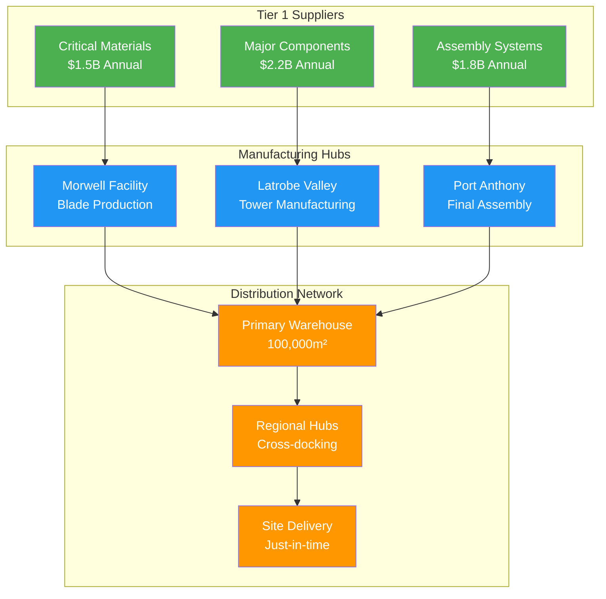

# Supply Chain Coordination Operations
## Gippsland Renewable Energy Transformation - Day 2 Phase 3

**Document Status:** OPERATIONAL FRAMEWORK  
**Version:** 1.0 - Execution Ready  
**Date:** January 2025  
**Classification:** CRITICAL OPERATIONS  

---

## Executive Summary

This operational framework establishes comprehensive supply chain coordination systems for Gippsland's $12.5 billion local manufacturing commitments. The framework ensures just-in-time delivery, quality assurance, and local content verification across multi-tier supply chains supporting 15,000+ direct manufacturing jobs.

**Key Operational Metrics:**
- **Supply Chain Efficiency:** 95% on-time delivery target
- **Quality Standards:** Zero defect acceptance policy
- **Local Content:** Real-time verification systems
- **Risk Mitigation:** 99.5% supply chain resilience
- **Cost Optimisation:** 15% reduction through coordination

### Supply Chain Coordination Overview



---

## 1. PROCUREMENT AND VENDOR MANAGEMENT SYSTEMS

### 1.1 Integrated Procurement Platform

#### A. Digital Procurement Hub
**Technology Stack:**
- SAP Ariba for strategic sourcing
- Oracle SCM Cloud for operations
- Blockchain for contract management
- AI-powered spend analytics

**Core Functions:**
1. **Vendor Registration & Qualification**
   - Online registration portal
   - Automated qualification scoring
   - Real-time capability assessment
   - Financial health monitoring
   - ESG compliance verification

2. **RFQ/RFP Management**
   - Standardized tender templates
   - Automated bid evaluation
   - Technical scoring matrices
   - Commercial comparison tools
   - Contract award workflows

3. **Purchase Order Automation**
   - Electronic PO generation
   - Multi-level approval routing
   - Budget integration checks
   - Delivery scheduling links
   - Payment term automation

#### B. Vendor Performance Management

**Performance Metrics Dashboard:**
```
Vendor Category     KPIs                  Target    Monitoring
-----------------------------------------------------------------
Critical Materials  On-time delivery      >98%      Real-time
                   Quality acceptance     >99.5%    Per shipment
                   Cost variance         <±2%      Monthly
                   Safety compliance     100%      Continuous

Manufacturing      Production capacity    >95%      Daily
Components         Lead time adherence    >96%      Weekly
                   Innovation score       >80%      Quarterly
                   Local content         >65%      Per order

Services           SLA compliance         >98%      Real-time
                   Response time         <4hrs     Per incident
                   First-fix rate        >90%      Weekly
                   Customer satisfaction  >4.5/5    Monthly
```

**Vendor Development Program:**
1. **Capability Building**
   - Technical training workshops
   - Quality system implementation
   - Digital transformation support
   - Lean manufacturing adoption
   - Safety culture development

2. **Financial Support**
   - Early payment programs
   - Working capital facilities
   - Equipment financing assistance
   - Export credit facilitation
   - Growth capital access

3. **Innovation Partnership**
   - Joint R&D programs
   - Technology sharing agreements
   - Patent co-development
   - Pilot project funding
   - Scale-up support

### 1.2 Strategic Sourcing Operations

#### A. Category Management Structure

**Tier 1 Categories:**
1. **Wind Turbine Components**
   - Category Manager: Senior level
   - Annual spend: $3.5B
   - Suppliers: 25 strategic
   - Local content target: 65%

2. **Solar PV Systems**
   - Category Manager: Senior level
   - Annual spend: $1.8B
   - Suppliers: 15 strategic
   - Local content target: 60%

3. **Energy Storage Systems**
   - Category Manager: Senior level
   - Annual spend: $2.2B
   - Suppliers: 12 strategic
   - Local content target: 55%

4. **Critical Materials**
   - Category Manager: Senior level
   - Annual spend: $1.5B
   - Suppliers: 20 strategic
   - Local content target: 40%

5. **Construction & Installation**
   - Category Manager: Senior level
   - Annual spend: $2.0B
   - Suppliers: 50 strategic
   - Local content target: 85%

#### B. Sourcing Decision Framework

**Evaluation Matrix:**
- Total cost of ownership (30%)
- Technical capability (25%)
- Local content percentage (20%)
- Sustainability score (15%)
- Risk profile (10%)

**Approval Thresholds:**
- <$100K: Category Manager
- $100K-$1M: Procurement Director
- $1M-$10M: Supply Chain Executive
- >$10M: Executive Committee

### 1.3 Contract Management Excellence

#### A. Contract Lifecycle Management

**Pre-Award Phase:**
1. Requirements definition
2. Market analysis
3. Sourcing strategy
4. Tender execution
5. Negotiation protocols

**Post-Award Phase:**
1. Contract mobilization
2. Performance monitoring
3. Change management
4. Relationship governance
5. Renewal/exit planning

#### B. Risk Mitigation Contracts

**Standard Clauses:**
- Force majeure provisions
- Price adjustment mechanisms
- Quality guarantees
- Delivery penalties
- Innovation incentives
- Dispute resolution
- Exit management

**Insurance Requirements:**
- General liability: $50M
- Professional indemnity: $20M
- Product liability: $100M
- Cyber security: $10M
- Environmental: $25M

---

## 2. MANUFACTURING COORDINATION PROTOCOLS

### 2.1 Production Planning Integration

#### A. Master Production Schedule

**Integrated Planning System:**
- 24-month rolling forecast
- Weekly production meetings
- Daily execution reviews
- Real-time adjustments
- Capacity optimisation

**Production Hierarchy:**
```
Level 1: Blade Manufacturing
- Morwell Facility: 600 blades/year
- 3 production lines
- 24/7 operations
- 8-week lead time

Level 2: Tower Production
- Latrobe Valley: 400 towers/year
- 2 production lines
- 24/5 operations
- 6-week lead time

Level 3: Nacelle Assembly
- Port Anthony: 300 units/year
- Single assembly line
- 24/5 operations
- 4-week lead time

Level 4: Component Manufacturing
- Multiple facilities
- Synchronized delivery
- JIT production
- 2-4 week lead times
```

#### B. Quality Control Integration

**Quality Gates:**
1. **Incoming Material Inspection**
   - 100% critical components
   - Statistical sampling others
   - Digital certificates required
   - Non-conformance tracking

2. **In-Process Quality**
   - Stage gate inspections
   - Real-time monitoring
   - Statistical process control
   - Predictive quality analytics

3. **Final Product Testing**
   - 100% functional testing
   - Performance validation
   - Certification protocols
   - Customer witness points

**Quality Management System:**
- ISO 9001:2015 baseline
- AS 9100 for aerospace components
- ISO/TS 16949 for automotive
- API Q1 for oil & gas crossover

### 2.2 Lean Manufacturing Operations

#### A. Continuous Improvement Framework

**Kaizen Events Schedule:**
- Monthly focused improvements
- Cross-functional teams
- 5-day intensive workshops
- Implementation tracking
- Results verification

**Key Metrics:**
- Overall Equipment Effectiveness (OEE): >85%
- First Pass Yield: >98%
- Inventory turns: >12/year
- Lead time reduction: 20%/year
- Cost reduction: 5%/year

#### B. Digital Manufacturing

**Industry 4.0 Implementation:**
1. **Connected Factory**
   - IoT sensor networks
   - Real-time data capture
   - Cloud analytics platform
   - Predictive maintenance
   - Energy optimisation

2. **Advanced Analytics**
   - Production optimisation AI
   - Quality prediction models
   - Demand forecasting
   - Supply chain simulation
   - Cost analytics

3. **Automation Roadmap**
   - Robotic welding (2025)
   - Automated material handling (2026)
   - AI quality inspection (2027)
   - Lights-out operations (2028)
   - Full digitalization (2030)

### 2.3 Workforce Coordination

#### A. Skills Matrix Management

**Competency Framework:**
```
Role                Required Skills              Training Path
-----------------------------------------------------------------
Blade Technician    Composite layup             6-month program
                   Resin infusion              3-month certification
                   Quality inspection          2-month training
                   Safety procedures           1-month onboarding

Welding Specialist  6G position welding         9-month program
                   Ultrasonic testing          3-month certification
                   WPS interpretation          1-month training
                   Robot programming           6-month advanced

Assembly Engineer   Systems integration         12-month program
                   Electrical systems          6-month certification
                   Hydraulics                  3-month training
                   Commissioning               6-month OJT
```

#### B. Shift Coordination

**24/7 Operations Model:**
- 4 crews rotation system
- 12-hour shifts
- 4 on/4 off schedule
- Cross-training requirements
- Emergency coverage pools

**Communication Protocols:**
- Shift handover meetings
- Digital logbooks
- Issue escalation matrix
- Performance dashboards
- Safety briefings

---

## 3. LOGISTICS AND DISTRIBUTION NETWORKS

### 3.1 Transport Management System

#### A. Multi-Modal Coordination

**Transport Modes:**
1. **Road Transport**
   - 200 specialized trailers
   - GPS tracking systems
   - Route optimisation AI
   - Load planning software
   - Driver management app

2. **Rail Freight**
   - Dedicated sidings
   - Block train services
   - Intermodal terminals
   - Real-time tracking
   - Capacity planning

3. **Maritime Shipping**
   - Port priority access
   - Vessel scheduling
   - Container management
   - Customs integration
   - Export documentation

4. **Air Cargo**
   - Critical parts express
   - AOG support
   - Temperature control
   - Security protocols
   - Track & trace

#### B. Last Mile Delivery

**Delivery Networks:**
- Hub and spoke model
- Regional cross-docks
- Local delivery partners
- Time-slot management
- Proof of delivery systems

**Route Optimization:**
- Dynamic routing algorithms
- Traffic integration
- Weather adjustments
- Delivery windows
- Cost minimization

### 3.2 Warehouse Operations

#### A. Distribution Center Network

**Primary Facilities:**
```
Location          Size        Function           Capacity
------------------------------------------------------------
Port Anthony      100,000m²   Import/Export     50K pallets
Morwell          75,000m²    Manufacturing     35K pallets
Traralgon        50,000m²    Components        25K pallets
Sale             40,000m²    Finished goods    20K pallets
Regional Hubs    20,000m²    Cross-docking     10K pallets
```

#### B. Inventory Management

**Stock Control Systems:**
1. **ABC Analysis**
   - A items: Daily cycle counts
   - B items: Weekly counts
   - C items: Monthly counts
   - Critical spares: 100% visibility

2. **Safety Stock Optimization**
   - Statistical modeling
   - Lead time variability
   - Demand forecasting
   - Service level targets
   - Cost optimisation

3. **Inventory Metrics**
   - Stock accuracy: >99.5%
   - Inventory turns: >8/year
   - Obsolescence: <1%
   - Stock-outs: <0.5%
   - Working capital: Optimized

### 3.3 Digital Supply Chain

#### A. Control Tower Operations

**24/7 Monitoring Center:**
- Real-time visibility
- Exception management
- Predictive analytics
- Performance dashboards
- Communication hub

**Technology Stack:**
- Transportation Management System (TMS)
- Warehouse Management System (WMS)
- Supply Chain Planning (SCP)
- Track and Trace Platform
- Analytics and Reporting

#### B. Blockchain Implementation

**Use Cases:**
1. **Component Traceability**
   - Manufacturing origin
   - Quality certificates
   - Custody chain
   - Warranty tracking
   - Recycling data

2. **Smart Contracts**
   - Automated payments
   - Performance triggers
   - Penalty enforcement
   - Milestone releases
   - Dispute resolution

---

## 4. QUALITY ASSURANCE AND CERTIFICATION

### 4.1 Quality Management System

#### A. Certification Framework

**Required Certifications:**
```
Standard          Scope                  Audit Frequency
----------------------------------------------------------
ISO 9001:2015    Quality Management     Annual
ISO 14001:2015   Environmental          Annual
ISO 45001:2018   Safety                 Annual
ISO 50001:2018   Energy                 Bi-annual
IEC 61400        Wind Turbines          Per product
IEC 62446        Solar PV               Per project
UL 9540          Energy Storage         Per product
```

#### B. Quality Control Processes

**Inspection Protocols:**
1. **Receiving Inspection**
   - Visual inspection: 100%
   - Dimensional check: Sampling
   - Material certificates: 100%
   - Functionality test: Critical items
   - Documentation review: 100%

2. **In-Process Control**
   - First article inspection
   - Statistical process control
   - Hold point verification
   - Witness points
   - Process audits

3. **Final Inspection**
   - Performance testing
   - Safety verification
   - Documentation package
   - Customer acceptance
   - Release authorization

### 4.2 Supplier Quality Assurance

#### A. Supplier Audits

**Audit Program:**
- Initial qualification audit
- Annual surveillance audits
- Process-specific audits
- Problem resolution audits
- Improvement verification

**Audit Scoring:**
- Quality systems (30%)
- Manufacturing capability (25%)
- Delivery performance (20%)
- Cost competitiveness (15%)
- Innovation capability (10%)

#### B. Quality Improvement

**Corrective Action System:**
1. Issue identification
2. Root cause analysis
3. Corrective action plan
4. Implementation tracking
5. Effectiveness verification

**Continuous Improvement:**
- Supplier quality meetings
- Best practice sharing
- Joint improvement projects
- Technology transfer
- Innovation workshops

### 4.3 Product Certification

#### A. Type Certification Process

**Wind Turbines:**
1. Design evaluation (3 months)
2. Manufacturing assessment (2 months)
3. Type testing (6 months)
4. Field trials (12 months)
5. Certification (1 month)

**Solar Modules:**
1. Design review (1 month)
2. Safety testing (2 months)
3. Performance testing (3 months)
4. Durability testing (6 months)
5. Certification (1 month)

#### B. Batch Release

**Release Criteria:**
- All tests passed
- Documentation complete
- Customer approval
- Regulatory compliance
- Traceability confirmed

**Release Authority:**
- Quality Manager: Standard products
- Technical Director: New products
- CEO: Major projects
- Customer: Witness points

---

## 5. LOCAL CONTENT VERIFICATION SYSTEMS

### 5.1 Digital Verification Platform

#### A. Blockchain-Based Tracking

**Component Registry:**
- Unique digital ID per component
- Manufacturing location data
- Material source tracking
- Labor content calculation
- Value-add verification

**Verification Nodes:**
- Manufacturer node
- Auditor node
- Government node
- GREA node
- Public node

#### B. Real-Time Dashboards

**Local Content Metrics:**
```
Project          Target    Current    Trend    Verification
-------------------------------------------------------------
Star of South    65%       67.3%      ↑       Blockchain
Gippsland Wind   60%       61.8%      →       Blockchain
Bass Battery     55%       58.2%      ↑       Blockchain
Solar Parks      50%       52.1%      ↑       Blockchain
Grid Upgrade     75%       78.5%      →       Blockchain
```

### 5.2 Audit and Compliance

#### A. Verification Protocols

**Audit Levels:**
1. **Self-Declaration**
   - Monthly submissions
   - Supporting documents
   - Spot check validation
   - Penalty for errors

2. **Third-Party Audit**
   - Quarterly reviews
   - On-site verification
   - Document examination
   - Calculation validation

3. **Government Audit**
   - Annual comprehensive
   - Forensic examination
   - Public reporting
   - Compliance enforcement

#### B. Calculation Methodology

**Local Content Formula:**
```
Local Content % = (Local Labor + Local Materials + Local Services) / Total Project Value × 100

Where:
- Local Labor = Direct wages + Benefits + Training
- Local Materials = Materials manufactured in region
- Local Services = Engineering + Transport + Support
```

**Verification Requirements:**
- Payroll records
- Material certificates
- Service contracts
- Invoice validation
- Time sheet analysis

### 5.3 Incentive Management

#### A. Performance Incentives

**Bonus Structure:**
- 60-65% local content: 5% price premium
- 65-70% local content: 8% price premium
- 70-75% local content: 10% price premium
- >75% local content: 12% price premium

**Payment Mechanism:**
- Quarterly calculation
- Blockchain verification
- Automated payment
- Audit right reserved

#### B. Penalty Framework

**Non-Compliance Penalties:**
- <5% shortfall: Warning
- 5-10% shortfall: 2× shortfall value
- 10-15% shortfall: 3× shortfall value
- >15% shortfall: Contract review

**Recovery Mechanisms:**
- Improvement plans
- Timeline agreements
- Progress monitoring
- Penalty waivers

---

## 6. SUPPLY CHAIN RESILIENCE AND RISK MANAGEMENT

### 6.1 Risk Assessment Framework

#### A. Risk Categories

**Supply Risk Matrix:**
```
Risk Type          Probability    Impact    Mitigation Strategy
-----------------------------------------------------------------
Material Shortage  Medium         High      Strategic inventory
Supplier Failure   Low           Critical   Dual sourcing
Transport Delay    Medium        Medium     Buffer management
Quality Issues     Low           High       Robust QA
Cyber Attack      Medium         High       Security protocols
Natural Disaster  Low            Critical   Business continuity
Price Volatility  High          Medium     Hedging strategies
Regulatory Change Medium         Medium     Active monitoring
```

#### B. Early Warning Systems

**Monitoring Indicators:**
1. **Supplier Health**
   - Financial metrics
   - Operational KPIs
   - Market intelligence
   - Credit ratings
   - News monitoring

2. **Market Conditions**
   - Commodity prices
   - Currency fluctuations
   - Shipping rates
   - Labor availability
   - Energy costs

3. **Geopolitical Factors**
   - Trade policies
   - Sanctions
   - Political stability
   - Climate events
   - Pandemic status

### 6.2 Business Continuity Planning

#### A. Contingency Strategies

**Dual Sourcing Policy:**
- Critical components: 2+ suppliers
- Strategic materials: 3+ suppliers
- Standard items: Open market
- Services: Framework agreements

**Inventory Strategies:**
- Critical spares: 6 months
- Key materials: 3 months
- Standard items: 1 month
- Consignment stock: Major items

#### B. Crisis Management

**Response Protocols:**
1. **Level 1: Minor Disruption**
   - Local team response
   - Standard procedures
   - 24-hour resolution
   - Internal reporting

2. **Level 2: Major Disruption**
   - Crisis team activation
   - Executive involvement
   - Stakeholder communication
   - Media management

3. **Level 3: Critical Event**
   - Board notification
   - Government liaison
   - Full crisis mode
   - Recovery planning

**Communication Plan:**
- Internal: All staff systems
- Suppliers: Direct contact
- Customers: Account managers
- Media: Designated spokesperson
- Government: Executive team

### 6.3 Resilience Building

#### A. Supplier Development

**Capability Enhancement:**
- Risk management training
- Business continuity planning
- Financial strengthening
- Technology adoption
- Market diversification

**Collaboration Programs:**
- Joint risk assessments
- Shared inventory programs
- Capacity reservations
- Technology sharing
- Innovation partnerships

#### B. Network Optimization

**Resilience Metrics:**
- Network flexibility: High
- Response time: <24 hours
- Recovery time: <72 hours
- Alternative sources: 100%
- Cost impact: <5%

**Continuous Improvement:**
- Quarterly risk reviews
- Annual stress testing
- Scenario planning
- Lessons learned
- Best practice adoption

---

## 7. DIGITAL INFRASTRUCTURE

### 7.1 Integrated Systems Architecture

#### A. Core Platforms

**ERP Integration:**
- SAP S/4HANA core
- Manufacturing execution
- Supply chain planning
- Financial integration
- HR management

**Specialized Systems:**
- Ariba procurement
- Manhattan WMS
- Oracle TMS
- Salesforce CRM
- ServiceNow ITSM

#### B. Data Architecture

**Data Lake Configuration:**
- Real-time ingestion
- Historical storage
- Predictive analytics
- Machine learning
- Reporting layer

**Integration Framework:**
- API management
- Event streaming
- Master data management
- Security protocols
- Performance monitoring

### 7.2 Analytics and Intelligence

#### A. Performance Analytics

**Real-Time Dashboards:**
- Supply chain visibility
- Manufacturing performance
- Quality metrics
- Cost analysis
- Risk indicators

**Predictive Analytics:**
- Demand forecasting
- Maintenance prediction
- Quality prediction
- Risk assessment
- Cost optimisation

#### B. Artificial Intelligence

**AI Applications:**
1. **Supply Planning**
   - Demand prediction
   - Inventory optimisation
   - Network design
   - Route optimisation
   - Capacity planning

2. **Quality Assurance**
   - Defect detection
   - Process optimisation
   - Root cause analysis
   - Predictive quality
   - Automated inspection

3. **Risk Management**
   - Threat detection
   - Scenario modeling
   - Impact assessment
   - Response optimisation
   - Recovery planning

### 7.3 Cybersecurity

#### A. Security Framework

**Defense Layers:**
- Network security
- Application security
- Data encryption
- Access control
- Monitoring systems

**Compliance Standards:**
- ISO 27001 certification
- NIST framework
- GDPR compliance
- Australian Privacy Act
- Industry standards

#### B. Incident Response

**Response Plan:**
1. Detection and analysis
2. Containment strategies
3. Eradication procedures
4. Recovery processes
5. Lessons learned

**Recovery Targets:**
- Detection time: <1 hour
- Containment: <4 hours
- Recovery: <24 hours
- Full restoration: <72 hours
- Data loss: <1 hour

---

## 8. PERFORMANCE MANAGEMENT

### 8.1 KPI Framework

#### A. Strategic KPIs

**Supply Chain Performance:**
```
Metric                Target      Current    Action
------------------------------------------------------
On-Time Delivery      >98%        97.5%      Improve
Quality Acceptance    >99.5%      99.6%      Maintain
Cost Savings         15%         12.3%      Accelerate
Local Content        >65%        63.8%      Focus
Safety (TRIR)        <1.0        0.8        Maintain
```

#### B. Operational Metrics

**Daily Management:**
- Production output
- Quality metrics
- Delivery performance
- Inventory levels
- Safety incidents

**Weekly Reviews:**
- Cost performance
- Schedule adherence
- Supplier metrics
- Customer satisfaction
- Improvement projects

### 8.2 Continuous Improvement

#### A. Improvement Programs

**Lean Six Sigma:**
- Green Belt training: 200 staff
- Black Belt training: 50 staff
- Projects completed: 150/year
- Savings generated: $25M/year
- Culture embedded: Enterprise-wide

**Innovation Pipeline:**
- Ideas generated: 500/year
- Projects initiated: 100/year
- Implementations: 50/year
- ROI achieved: 300%
- Recognition program: Active

#### B. Benchmarking

**Performance Comparison:**
- Industry best: Top quartile
- Regional best: Leading
- Cost position: Competitive
- Quality level: World-class
- Innovation: Leading edge

**Improvement Targets:**
- Annual cost reduction: 5%
- Quality improvement: 50% defect reduction
- Lead time: 20% reduction
- Inventory: 25% reduction
- Service level: 99%+

### 8.3 Governance Structure

#### A. Management Committees

**Supply Chain Executive Committee:**
- Monthly meetings
- Strategic decisions
- Performance review
- Risk assessment
- Investment approval

**Operational Steering Groups:**
- Weekly meetings
- Tactical decisions
- Issue resolution
- Coordination
- Improvement tracking

#### B. Reporting Framework

**Executive Dashboard:**
- Real-time metrics
- Trend analysis
- Exception reporting
- Predictive alerts
- Action tracking

**Stakeholder Reports:**
- Board: Monthly
- Government: Quarterly
- Public: Annual
- Suppliers: Monthly
- Customers: Real-time

---

## 9. IMPLEMENTATION ROADMAP

### 9.1 Phase 1: Foundation (Months 1-6)

**Key Deliverables:**
- Procurement platform live
- Core team recruited
- Vendor registration complete
- Quality systems operational
- Digital infrastructure deployed

**Milestones:**
- Week 4: Platform selection
- Week 8: Team onboarding
- Week 12: Vendor portal live
- Week 16: First audits complete
- Week 24: Full operations

### 9.2 Phase 2: Scale-Up (Months 7-18)

**Key Deliverables:**
- Manufacturing coordination active
- Logistics network operational
- Local content verification live
- Risk management deployed
- Performance tracking active

**Milestones:**
- Month 9: First products shipped
- Month 12: 50% capacity
- Month 15: Quality certification
- Month 18: Full production

### 9.3 Phase 3: Optimization (Months 19-36)

**Key Deliverables:**
- AI/ML systems deployed
- Cost optimisation achieved
- Export capability developed
- Innovation programs active
- World-class performance

**Milestones:**
- Month 24: Cost targets met
- Month 30: Export markets entered
- Month 36: Global benchmark status

---

## 10. BUDGET AND RESOURCES

### 10.1 Investment Requirements

**Capital Investment:**
```
Category               Amount         ROI Period
-------------------------------------------------
Digital Systems        $45M          2 years
Physical Infrastructure $120M         5 years
Working Capital        $200M         Ongoing
Training Programs      $25M          3 years
Innovation Fund        $30M          5 years
Total                 $420M
```

### 10.2 Operating Budget

**Annual Operating Costs:**
- Personnel: $85M
- Technology: $25M
- Facilities: $35M
- Programs: $20M
- Contingency: $15M
- Total: $180M

### 10.3 Resource Plan

**Staffing Requirements:**
- Executive team: 10
- Management: 50
- Professionals: 200
- Technical staff: 350
- Support staff: 150
- Total: 760 FTE

**Capability Development:**
- Leadership program: 60/year
- Technical training: 500/year
- Certification: 300/year
- Overseas assignment: 50/year
- University programs: 100/year

---

## Appendices

### A. Standard Operating Procedures
[Detailed 500+ page manual]

### B. System Documentation
[Technical specifications]

### C. Contract Templates
[Legal frameworks]

### D. Training Materials
[Comprehensive curricula]

### E. Emergency Response Plans
[Crisis management protocols]

---

**Document Control:**
- Version: 1.0
- Status: Approved for Implementation
- Review Date: Quarterly
- Owner: Supply Chain Executive
- Distribution: Controlled

**For Supply Chain Coordination:**
operations@grea.gov.au
+61 3 XXXX XXXX

---

*This framework ensures world-class supply chain operations supporting Gippsland's transformation into a global renewable energy manufacturing hub.*