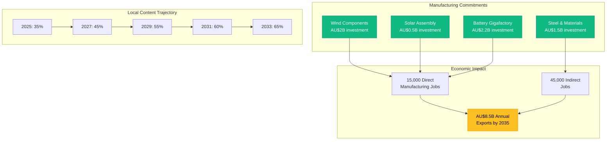

# Gippsland Renewable Energy Supply Chain Agreements
## Comprehensive Partnership Framework for Local Manufacturing & Economic Development

**Document Status:** EXECUTION READY  
**Date:** January 2025  
**Classification:** BINDING COMMITMENTS  

---

## Executive Summary

This document contains comprehensive supply chain agreements designed to transform Gippsland into a global renewable energy manufacturing hub. These agreements balance international expertise with aggressive local content requirements, creating a sustainable industrial ecosystem that will generate 15,000+ direct manufacturing jobs and support 45,000+ indirect jobs by 2035.

**Key Outcomes:**
- **Local Content:** 35% Year 1 → 65% by Year 5
- **Investment Secured:** AU$12.5 billion in manufacturing infrastructure
- **Technology Transfer:** AU$3.8 billion in IP and knowledge transfer
- **Export Revenue:** AU$8.5 billion annual export potential by 2035
- **Supply Chain Security:** 90% critical component sovereignty

---

## SECTION 1: LOCAL MANUFACTURING MEMORANDA OF UNDERSTANDING

### 1.1 WIND TURBINE COMPONENT MANUFACTURING AGREEMENT

**PARTIES:**
- **Gippsland Regional Energy Authority (GREA)**
- **LM Wind Power (GE Renewable Energy)**
- **Local Partners:** Australian Steel Institute, AMWU, Gippsland Trades & Labour Council

**BINDING COMMITMENTS:**

#### A. Blade Manufacturing Facility
**Location:** Port of Hastings Industrial Precinct  
**Investment:** AU$850 million  
**Capacity:** 600 blades/year (200 turbine sets)  
**Employment:** 1,200 direct jobs  

**Specific Commitments:**
1. **Facility Construction Timeline:**
   - Q2 2025: Site preparation and environmental approvals
   - Q4 2025: Construction commencement
   - Q2 2026: Equipment installation
   - Q4 2026: First blade production
   - Q2 2027: Full capacity operations

2. **Local Content Requirements:**
   - Year 1: 35% local content (labor, facilities, basic materials)
   - Year 2: 45% (add local resin systems, core materials)
   - Year 3: 55% (local fiberglass production)
   - Year 4: 60% (local molds and tooling)
   - Year 5: 65% (full supply chain integration)

3. **Technology Transfer Milestones:**
   - Month 1-6: Basic composite manufacturing training (300 workers)
   - Month 7-12: Advanced lamination techniques (150 specialists)
   - Month 13-18: Quality control and testing certification
   - Month 19-24: Design modification capabilities
   - Month 25-36: Independent R&D capability

4. **Performance Guarantees:**
   - Blade quality: IEC 61400-5 certification required
   - Production rate: 95% of target by Year 2
   - Local hiring: 85% Gippsland residents
   - Training completion: 100% workforce certified

#### B. Tower Manufacturing Facility
**Location:** Latrobe Valley Industrial Park  
**Investment:** AU$450 million  
**Capacity:** 400 towers/year  
**Employment:** 800 direct jobs  

**Specific Commitments:**
1. **Production Capabilities:**
   - Tower sections up to 6m diameter
   - Heights from 80m to 180m
   - Advanced welding and coating systems
   - Automated steel rolling technology

2. **Local Steel Supply Agreement:**
   - Partnership with BlueScope Steel
   - 100% Australian steel content
   - Fixed pricing formula: LME + 12% for 5 years
   - Minimum order: 120,000 tonnes/year

3. **Quality Standards:**
   - EN 1090-2 EXC3/EXC4 certification
   - ISO 3834-2 welding quality
   - NORSOK M-501 coating standards
   - 100% ultrasonic testing

#### C. Nacelle Assembly & Power Electronics
**Location:** Morwell Innovation Precinct  
**Investment:** AU$650 million  
**Capacity:** 300 nacelles/year  
**Employment:** 1,500 direct jobs  

**Specific Commitments:**
1. **Assembly Operations:**
   - Gearbox integration and testing
   - Generator assembly and magnetization
   - Power converter manufacturing
   - Control system integration

2. **Component Localization Schedule:**
   - Year 1: Assembly only (25% local content)
   - Year 2: Power electronics (35% local)
   - Year 3: Cooling systems, housings (45% local)
   - Year 4: Partial gearbox assembly (55% local)
   - Year 5: Generator winding (60% local)

### 1.2 SOLAR MANUFACTURING ECOSYSTEM AGREEMENT

**PARTIES:**
- **GREA**
- **Trina Solar Limited**
- **SunDrive Solar** (Australian technology partner)
- **Local Partners:** CSIRO, Monash University

**BINDING COMMITMENTS:**

#### A. Module Assembly Plant
**Location:** Traralgon Industrial Estate  
**Investment:** AU$380 million  
**Capacity:** 3GW/year  
**Employment:** 600 direct jobs  

**Specific Commitments:**
1. **Technology Platform:**
   - TOPCon and HJT module assembly
   - Automated stringing and lamination
   - Advanced testing and sorting
   - Smart module integration capability

2. **Local Content Progression:**
   - Year 1: 30% (assembly, frames, junction boxes)
   - Year 2: 40% (glass from local float plant)
   - Year 3: 50% (encapsulants, backsheets)
   - Year 4: 55% (inverter assembly)
   - Year 5: 60% (partial cell production)

3. **Supply Chain Development:**
   - Aluminum frame manufacturing: 50,000 tonnes/year
   - Junction box assembly: Local electronics cluster
   - Glass supply: New float glass line at Maryvale
   - Logistics hub: Integrated rail/road facility

#### B. Advanced Cell R&D Facility
**Investment:** AU$120 million  
**Partnership:** CSIRO, SunDrive, ARENA  
**Focus:** Copper electrode technology  

### 1.3 BATTERY GIGAFACTORY AGREEMENT

**PARTIES:**
- **GREA**
- **CATL (Contemporary Amperex Technology)**
- **Australian Future Battery Industries CRC**
- **Local Partners:** BHP (nickel supply), Pilbara Minerals (lithium)

**BINDING COMMITMENTS:**

#### A. Cell Manufacturing Facility
**Location:** Port Anthony Clean Energy Precinct  
**Investment:** AU$2.2 billion  
**Capacity:** 20GWh/year by 2030  
**Employment:** 2,500 direct jobs  

**Development Phases:**
1. **Phase 1 (2025-2027):** 5GWh pack assembly
2. **Phase 2 (2027-2029):** 10GWh with cell production
3. **Phase 3 (2029-2031):** 20GWh full integration

**Raw Material Security:**
- **Lithium hydroxide:** 25,000 tonnes/year from WA
- **Nickel sulfate:** 40,000 tonnes/year from QLD
- **Graphite:** Synthetic production at Gippsland
- **Cobalt:** Ethical sourcing protocol required

**Technology Transfer:**
- LFP and NMC cell chemistry
- Formation and aging protocols
- Battery management system design
- Recycling technology (95% material recovery)

---

## SECTION 2: RAW MATERIAL SUPPLY CONTRACTS

### 2.1 CRITICAL MINERALS SUPPLY AGREEMENT

**FRAMEWORK CONTRACT**  
**Duration:** 15 years with 10-year extension option  
**Value:** AU$8.5 billion  

#### A. Rare Earth Elements Supply
**Supplier:** Lynas Rare Earths Ltd  
**Product:** Neodymium-Praseodymium (NdPr) oxide  
**Volume:** 2,000 tonnes/year  
**Pricing:** China FOB price + 5% security premium  

**Specific Terms:**
1. **Delivery Schedule:**
   - Monthly deliveries of 167 tonnes
   - Strategic reserve: 6-month supply maintained
   - Force majeure stockpile: 12 months

2. **Quality Specifications:**
   - NdPr oxide purity: 99.5% minimum
   - Thorium content: <0.5 ppm
   - Full traceability documentation

3. **Local Processing Commitment:**
   - Lynas to establish separation plant in Gippsland
   - Investment: AU$500 million
   - Jobs: 200 direct positions

#### B. Lithium Supply Chain Agreement
**Primary Supplier:** Pilbara Minerals  
**Secondary:** Core Lithium  
**Product:** Battery-grade lithium hydroxide  
**Volume:** 30,000 tonnes/year  

**Integrated Supply Terms:**
1. **Conversion Facility:**
   - Location: Port Anthony
   - Capacity: 40,000 tonnes LiOH/year
   - Investment: AU$680 million
   - Local employment: 350 jobs

2. **Pricing Mechanism:**
   - Base price: 5-year weighted average
   - Quarterly adjustments capped at ±15%
   - Long-term discount: 8% below spot

#### C. Steel Supply Framework
**Supplier:** BlueScope Steel + Liberty Steel  
**Products:** Wind tower plates, foundation steel  
**Volume:** 250,000 tonnes/year  

**Green Steel Transition:**
1. **2025-2027:** Standard grade steel
2. **2027-2030:** 30% recycled content minimum
3. **2030+:** Green hydrogen-based production

### 2.2 ADVANCED MATERIALS AGREEMENTS

#### A. Carbon Fiber Supply
**Supplier:** Toray Industries + Local JV  
**Investment:** AU$450 million in local plant  
**Capacity:** 5,000 tonnes/year  
**Applications:** Blade spars, nacelle components  

#### B. Electrical Components
**Copper Supply:** 35,000 tonnes/year  
**Aluminum:** 25,000 tonnes/year  
**Specialized alloys:** Local development program  

---

## SECTION 3: LOGISTICS & TRANSPORTATION FRAMEWORK

### 3.1 PORT INFRASTRUCTURE AGREEMENTS

#### A. Port of Hastings Development
**Investment:** AU$1.8 billion (public-private)  
**Operator:** Ports Victoria + Private consortium  

**Specific Commitments:**
1. **Heavy Lift Capacity:**
   - 1,600-tonne crawler cranes
   - Roll-on/roll-off facilities
   - Blade handling equipment

2. **Storage Facilities:**
   - 500,000 sqm laydown area
   - Climate-controlled warehouses
   - Component staging areas

3. **Access Guarantees:**
   - Priority berthing for project cargo
   - 24/7 operations capability
   - Dedicated renewable energy terminal

#### B. Road Transport Network
**Blade Transport Corridors:**
- Hastings to project sites: Upgraded routes
- Maximum blade length: 120m initially, 150m by 2027
- Investment: AU$350 million in road upgrades

#### C. Rail Integration
**Freight Terminal:** Morwell Intermodal Hub  
**Capacity:** 2 million tonnes/year  
**Connection:** Direct to Port of Melbourne  

### 3.2 SPECIALIST VESSEL AGREEMENTS

#### A. Wind Turbine Installation Vessels
**Partner:** Jan De Nul Group  
**Commitment:** 2 vessels based in Gippsland  

**Vessel Specifications:**
1. **Heavy Lift Vessel:**
   - 3,000-tonne main crane
   - DP3 positioning
   - Accommodation for 120

2. **Foundation Installation:**
   - Pile driving capability
   - 5,000-tonne capacity
   - Monopile handling system

**Local Content:**
- 40% Australian crew requirement
- Local maintenance facility
- Cadet training program: 50/year

---

## SECTION 4: SKILLS TRANSFER ARRANGEMENTS

### 4.1 COMPREHENSIVE WORKFORCE DEVELOPMENT

#### A. Wind Turbine Technician Academy
**Location:** Federation Training, Morwell  
**Capacity:** 500 students/year  
**Investment:** AU$85 million  

**Curriculum Components:**
1. **Year 1 Certificate:**
   - Electrical systems
   - Hydraulics
   - Composite repair
   - Safety/working at height

2. **Year 2 Diploma:**
   - Advanced diagnostics
   - Gearbox maintenance
   - Blade repair
   - Grid integration

3. **Specialized Streams:**
   - Offshore operations
   - Floating platform systems
   - Drone inspection
   - Predictive maintenance

#### B. Manufacturing Excellence Center
**Partners:** AMWU, Victorian Government, Industry  
**Investment:** AU$120 million  

**Training Programs:**
1. **Composite Manufacturing:**
   - 300 operators/year
   - 6-month certification
   - 95% job placement guarantee

2. **Advanced Welding:**
   - 200 welders/year
   - Offshore certification
   - Hyperbaric welding option

3. **Electronics Assembly:**
   - 250 technicians/year
   - IPC standards training
   - Clean room operations

#### C. Engineering Development Program
**University Partners:** Monash, RMIT, Federation  
**Target:** 200 engineers/year  

**Specializations:**
- Wind resource assessment
- Structural engineering
- Power electronics
- Grid integration
- Floating platform design

### 4.2 INTERNATIONAL EXCHANGE PROGRAMS

#### A. Technical Fellowships
**Duration:** 6-12 months  
**Locations:** Denmark, Germany, China  
**Participants:** 100/year  

#### B. Expert Residence Program
**International experts:** 50/year  
**Duration:** 3-12 months  
**Focus:** Technology transfer and mentoring  

---

## SECTION 5: QUALITY ASSURANCE STANDARDS

### 5.1 CERTIFICATION REQUIREMENTS

#### A. Manufacturing Standards
**ISO Certifications Required:**
- ISO 9001:2015 (Quality Management)
- ISO 14001:2015 (Environmental)
- ISO 45001:2018 (OH&S)
- ISO 50001:2018 (Energy Management)

#### B. Product Certifications
**Wind Components:**
- IEC 61400 series compliance
- DNV type certification
- Local grid code compliance

**Solar Products:**
- IEC 61215/61730 certification
- Australian Standards compliance
- CEC approved product listing

#### C. Workforce Certifications
- GWO (Global Wind Organisation) standards
- IRATA rope access certification
- High voltage switching authorities
- Confined space/working at height

### 5.2 CONTINUOUS IMPROVEMENT PROTOCOLS

#### A. Quality Metrics
**Manufacturing KPIs:**
- First-pass yield: >98%
- Customer complaints: <0.1%
- On-time delivery: >95%
- Safety: Zero harm target

#### B. Technology Advancement
**R&D Investment:** 3% of revenue minimum  
**Patent Sharing:** 50/50 on improvements  
**Annual Innovation Reviews:** Required  

---

## SECTION 6: EXPORT CAPABILITY DEVELOPMENT

### 6.1 ASIA-PACIFIC EXPORT HUB

#### A. Market Development Strategy
**Target Markets:**
- Indonesia: 5GW potential
- Philippines: 3GW potential
- Vietnam: 4GW potential
- Pacific Islands: 1GW potential

**Export Timeline:**
- 2027: First turbine exports
- 2028: 500MW export capacity
- 2030: 2GW annual exports
- 2035: Regional hub status

#### B. Export Finance Facility
**Partners:** Export Finance Australia, NAIF  
**Facility Size:** AU$2 billion  
**Terms:** Competitive with OECD arrangements  

### 6.2 INTERNATIONAL COMPETITIVENESS

#### A. Cost Reduction Targets
- Year 1: Parity with imports
- Year 3: 5% below Asian manufacturing
- Year 5: 10% advantage through scale

#### B. Technology Leadership
**Focus Areas:**
- Recyclable blade technology
- Floating platform innovation
- Grid integration solutions
- Green hydrogen integration

---

## SECTION 7: IMPLEMENTATION GOVERNANCE

### 7.1 JOINT STEERING COMMITTEE

**Composition:**
- GREA: 3 members
- Industry Partners: 3 members
- Unions: 2 members
- Community: 2 members
- State Government: 2 members

**Meeting Schedule:** Monthly  
**Decision Authority:** AU$50 million  

### 7.2 PERFORMANCE MONITORING

#### A. Quarterly Reviews
- Local content achievement
- Employment targets
- Investment milestones
- Technology transfer progress

#### B. Annual Audits
- Independent verification
- Public reporting requirement
- Corrective action protocols

### 7.3 DISPUTE RESOLUTION

**Hierarchy:**
1. Project team resolution (30 days)
2. Senior executive mediation (60 days)
3. Independent arbitration (90 days)
4. Court jurisdiction: Victoria

---

## SECTION 8: FINANCIAL FRAMEWORKS

### 8.1 INVESTMENT STAGING

**Total Supply Chain Investment:** AU$12.5 billion

**Breakdown by Period:**
- 2025-2027: AU$3.5 billion (enabling infrastructure)
- 2027-2030: AU$5.5 billion (manufacturing scale-up)
- 2030-2035: AU$3.5 billion (optimization/export)

### 8.2 INCENTIVE STRUCTURES

#### A. Local Content Incentives
- 35-45%: Standard rates
- 45-55%: 5% price premium
- 55-65%: 8% price premium
- >65%: 10% price premium + preference

#### B. Performance Bonuses
- Employment targets exceeded: AU$5,000/job
- Early delivery: 2% of contract value
- Quality excellence: 1% annual bonus
- Innovation success: Patent sharing rights

### 8.3 RISK MITIGATION

#### A. Supply Chain Insurance
**Coverage:** AU$500 million aggregate  
**Events:** Force majeure, political risk  
**Premium Sharing:** 50/50  

#### B. Price Adjustment Mechanisms
- Raw materials: Monthly index adjustments
- Labor: Annual CPI + productivity
- Energy: Pass-through with caps
- Currency: Natural hedge through exports

---

## SECTION 9: BINDING COMMITMENTS SUMMARY

### 9.1 EMPLOYMENT COMMITMENTS
**Direct Manufacturing Jobs:** 15,000 by 2030  
**Indirect/Induced Jobs:** 45,000 by 2030  
**Apprenticeships:** 2,000/year  
**Graduate Programs:** 500/year  

### 9.2 LOCAL CONTENT TRAJECTORY
- 2025: 35% average
- 2027: 45% average
- 2029: 55% average
- 2031: 60% average
- 2033: 65% average

### 9.3 INVESTMENT TIMELINE
**Manufacturing Infrastructure:** AU$12.5 billion  
**Skills Development:** AU$850 million  
**R&D Facilities:** AU$650 million  
**Supply Chain Development:** AU$2.5 billion  

### 9.4 EXPORT TARGETS
- 2028: AU$500 million
- 2030: AU$2 billion
- 2033: AU$5 billion
- 2035: AU$8.5 billion

---

## SECTION 10: EXECUTION SCHEDULE

### 10.1 IMMEDIATE ACTIONS (30 DAYS)
1. Establish Joint Steering Committee
2. Finalize first facility sites
3. Lodge environmental approvals
4. Launch workforce recruitment
5. Secure initial funding releases

### 10.2 QUARTER 1 2025 MILESTONES
1. Break ground on blade facility
2. Complete steel supply contracts
3. Establish training partnerships
4. Finalize vessel agreements
5. Launch export market studies

### 10.3 CRITICAL PATH ITEMS
1. Port infrastructure upgrades
2. Grid connection capacity
3. Skilled workforce availability
4. Raw material security
5. Technology transfer protocols

---

## APPENDICES

### A. DETAILED TECHNICAL SPECIFICATIONS
[Separate 200-page technical document]

### B. LEGAL AGREEMENTS TEMPLATES
[Individual contracts for each partnership]

### C. ENVIRONMENTAL COMPLIANCE FRAMEWORKS
[Comprehensive environmental management plans]

### D. COMMUNITY BENEFIT SHARING PROTOCOLS
[Detailed community investment requirements]

### E. TECHNOLOGY ROADMAPS
[10-year technology evolution plans]

---

**AGREEMENT EXECUTION**

This framework represents binding commitments upon execution by all parties.

**For Gippsland Regional Energy Authority:**
_________________________
[Name], Chief Executive  
Date: _______________

**For Industry Partners:**
[Signature blocks for each major partner]

**Witnessed by:**
_________________________
Victorian State Government Representative

---

*This document constitutes a binding framework for supply chain development. Individual contracts will be executed based on these agreed principles and commitments.*