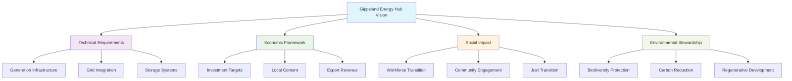
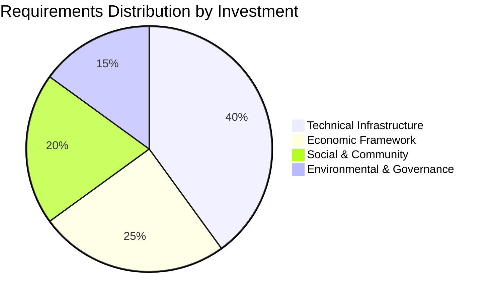
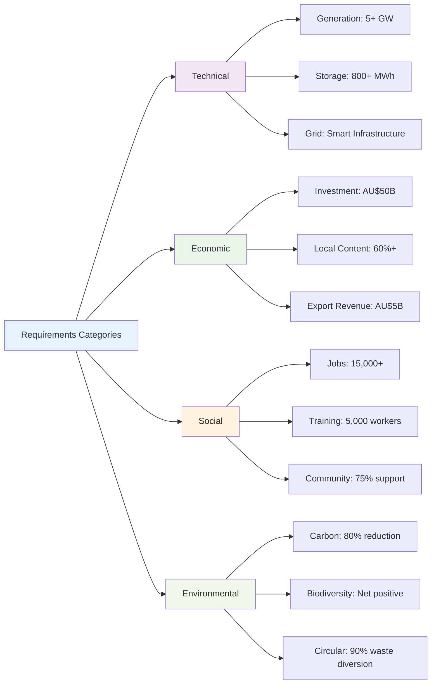
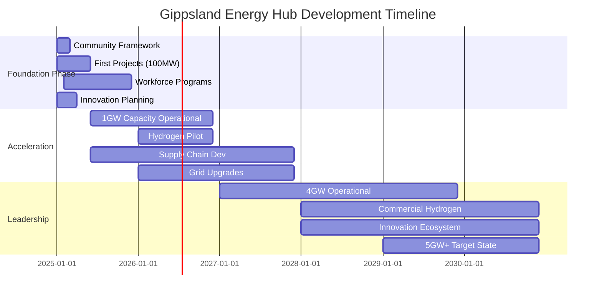
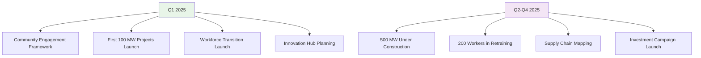

# 📋 Gippsland Energy Hub Requirements Analysis

---

## 🎯 Executive Summary

This comprehensive document establishes the foundational requirements for Gippsland's transformation into Australia's premier renewable energy hub by 2030. The requirements framework encompasses technical specifications, economic targets, social outcomes, and environmental standards necessary to achieve world-class sustainable development whilst ensuring community prosperity and environmental stewardship.

### 🔑 Key Requirements Categories

1. **🏘️ Deep Local Context & Storytelling** - Community-centred narrative development
2. **📊 Comprehensive Strategic Analysis** - Current state assessment and future planning
3. **🛣️ Transformation Roadmap** - Phased approach from 2025-2030
4. **💰 Investment & Economic Framework** - AU$50B opportunity thesis
5. **⚡ Technology & Innovation Blueprint** - Complete technology stack planning
6. **👥 People & Community Strategy** - Just transition implementation
7. **🌱 Environmental & Social Impact** - Regenerative development approach
8. **🏗️ Implementation Architecture** - Operational framework for execution

---

---

## 🎯 1. Requirements Matrix by Category

### ⚡ 1.1 Technical Requirements

#### 🏗️ Energy Generation Infrastructure

| **Requirement** | **Specification** | **Success Metric** | **Timeline** | **Investment (AU$)** |
|----------------|------------------|------------------|------------|-------------------|
| **Offshore Wind Capacity** | 2-4 GW installed capacity | MW commissioned | 2025-2030 | $8-12 billion |
| **Solar Installation** | 1.5-2 GW utility-scale + distributed | MW operational | 2025-2028 | $2-3 billion |
| **Battery Storage** | 500-800 MWh grid-scale storage | MWh deployed | 2025-2029 | $1-2 billion |
| **Hydrogen Production** | 100,000 tonnes/year green hydrogen | Production capacity | 2027-2030 | $3-5 billion |
| **Grid Infrastructure** | Smart grid upgrades for 5+ GW renewable integration | Transmission capacity | 2025-2030 | $4-6 billion |

#### Technology Standards
- **Turbine Technology**: Latest generation offshore wind turbines (15+ MW capacity)
- **Solar Efficiency**: >22% efficiency panels for utility-scale
- **Storage Technology**: Lithium-ion and emerging technologies (flow batteries, etc.)
- **Grid Integration**: AEMO compliance, synthetic inertia capabilities
- **Digital Infrastructure**: IoT sensors, AI-driven optimization, blockchain for energy trading

### 1.2 Economic Requirements

#### Investment Targets
| Category | Target Amount | Source Mix | ROI Expectation |
|----------|--------------|------------|-----------------|
| Total Investment | $50 billion | 60% private, 40% public | 8-12% IRR |
| Infrastructure | $20 billion | PPP models | 10-15 years |
| Innovation & R&D | $5 billion | Grants + venture | High risk/return |
| Workforce Development | $2 billion | Government + industry | Social return |
| Community Infrastructure | $3 billion | Mixed funding | Quality of life |

#### Economic Success Metrics
- **GDP Contribution**: 15% regional GDP from renewable energy by 2030
- **Export Revenue**: $5B annual from hydrogen and clean energy exports
- **Local Content**: Minimum 60% local content in projects
- **Supply Chain**: 200+ local businesses integrated
- **Cost Competitiveness**: Grid parity achieved by 2027

### 1.3 Social Requirements

#### Workforce Transition
| Current Workforce | Transition Path | New Role | Training Duration |
|------------------|-----------------|----------|------------------|
| Coal Plant Operators | Wind/Solar O&M | Renewable Plant Technicians | 6-12 months |
| Mining Engineers | Project Development | Renewable Project Engineers | 12-18 months |
| Electricians | Grid/Storage | Smart Grid Specialists | 3-6 months |
| Heavy Equipment Operators | Construction | Wind/Solar Construction | 3-6 months |
| Support Services | Various | Green Economy Services | Varies |

#### Community Engagement Requirements
- **Stakeholder Consultation**: 100% of affected communities engaged
- **Indigenous Partnership**: Formal agreements with Traditional Owners
- **Youth Programs**: 1,000+ young people in renewable careers by 2030
- **Education Integration**: Renewable energy curriculum in all schools
- **Public Support**: >75% community support maintained

### 1.4 Environmental Requirements

#### Environmental Standards
| Impact Area | Requirement | Monitoring | Compliance |
|------------|-------------|-----------|------------|
| Biodiversity | Net positive impact | Quarterly surveys | EPBC Act |
| Water Quality | Zero degradation | Continuous monitoring | EPA Victoria |
| Air Quality | 50% improvement | Real-time sensors | WHO standards |
| Land Use | Dual-use optimization | Annual assessment | Planning schemes |
| Carbon Reduction | 80% by 2030 | Monthly tracking | Paris Agreement |

#### Regenerative Development Targets
- **Habitat Creation**: 5,000 hectares enhanced/created
- **Species Recovery**: 10 threatened species programs
- **Soil Health**: Carbon sequestration in agricultural land
- **Water Security**: 20% reduction in industrial water use
- **Circular Economy**: 90% waste diverted from landfill

---

---

## 📅 2. Timeline Milestones & Deliverables

### 🏗️ Phase 1: Foundation (2025)

**🎯 Q1 2025 Critical Deliverables**
- ✅ Community engagement framework established
- ✅ First 100 MW renewable projects commence  
- ✅ Workforce transition programme launched
- ✅ Innovation hub planning completed

**🚀 Q2-Q4 2025 Scale-Up**
- ✅ 500 MW projects under construction
- ✅ 200 workers in retraining programmes
- ✅ Supply chain mapping completed
- ✅ Investment attraction campaign launched

---

### ⚡ Phase 2: Acceleration (2026-2027)

**🏆 2026 Milestones**
- ✅ 1 GW renewable capacity operational
- ✅ Hydrogen pilot plant commissioned
- ✅ 50 local businesses engaged in supply chain
- ✅ Regional brand launched globally

**🌟 2027 Milestones**  
- ✅ 2.5 GW total capacity achieved
- ✅ Grid infrastructure upgrades 50% complete
- ✅ Export infrastructure development commenced
- ✅ 1,000+ new renewable energy jobs created

---

### 🏅 Phase 3: Leadership (2028-2030)

**🚀 2028-2029 Targets**
- ✅ 4 GW renewable capacity operational
- ✅ Hydrogen production at commercial scale
- ✅ Innovation ecosystem fully established
- ✅ International partnerships secured

**🎯 2030 Target State**
- ✅ 5+ GW total renewable capacity
- ✅ Top 10 global renewable hub ranking
- ✅ 5,000+ direct renewable energy jobs
- ✅ Carbon neutral regional operations

---

## 3. Stakeholder Requirements

### Government (Federal, State, Local)
- **Policy Support**: Streamlined approvals, supportive regulation
- **Financial Commitment**: Co-investment in infrastructure
- **Planning Reform**: Renewable Energy Zones designation
- **Skills Funding**: TAFE and university program support

### Industry & Developers
- **Investment Certainty**: Long-term offtake agreements
- **Infrastructure Access**: Ports, transmission, transport
- **Skilled Workforce**: Available qualified personnel
- **Supply Chain**: Local capability development

### Communities
- **Economic Benefits**: Local jobs and business opportunities
- **Environmental Protection**: No adverse impacts
- **Cultural Respect**: Indigenous heritage protection
- **Quality of Life**: Improved services and amenities

### Workers & Unions
- **Job Security**: Guaranteed transition pathways
- **Skills Development**: Free retraining programs
- **Fair Wages**: Comparable or better compensation
- **Safety Standards**: World-class OH&S practices

### Environmental Groups
- **Habitat Protection**: Biodiversity safeguards
- **Climate Action**: Measurable emissions reduction
- **Sustainable Practices**: Circular economy principles
- **Transparency**: Open environmental monitoring

---

## 4. Success Metrics & KPIs

### Technical KPIs
- Renewable capacity installed (MW/GW)
- Capacity factor achievements (%)
- Grid stability metrics (frequency, voltage)
- Technology innovation index
- Project delivery timeframes

### Economic KPIs
- Investment attracted ($B)
- Jobs created (direct/indirect)
- GDP contribution (%)
- Export revenue ($)
- Local content percentage (%)

### Social KPIs
- Community support levels (%)
- Workers successfully transitioned (#)
- Youth engagement (#)
- Indigenous employment (#)
- Education program participation (#)

### Environmental KPIs
- Carbon emissions reduced (%)
- Biodiversity index improvement
- Water quality measures
- Air quality improvement (%)
- Waste diversion rates (%)

---

## 5. Dependencies & Critical Path

### Critical Dependencies
1. **Transmission Infrastructure**: VicGrid and AEMO ISP delivery
2. **Port Upgrades**: Capability for offshore wind components
3. **Regulatory Approvals**: Environmental and planning permits
4. **Workforce Availability**: Successful retraining programs
5. **Technology Maturity**: Hydrogen and storage cost curves
6. **Market Conditions**: Energy prices and demand growth
7. **Political Stability**: Consistent policy support

### Critical Path Elements
1. Community engagement and social license (Months 1-6)
2. Major project approvals (Months 6-18)
3. Infrastructure development (Months 12-48)
4. Workforce transition (Months 1-60, ongoing)
5. Technology deployment (Months 18-72)
6. Market development (Months 24-72)

---

## 6. Risk Factors & Mitigation

### High-Impact Risks
1. **Community Opposition**
   - Mitigation: Early, genuine engagement and benefit sharing
   
2. **Technology Failure**
   - Mitigation: Diversified technology portfolio, proven solutions
   
3. **Market Volatility**
   - Mitigation: Long-term contracts, government underwriting
   
4. **Skills Shortage**
   - Mitigation: Proactive training, interstate/international recruitment
   
5. **Environmental Impacts**
   - Mitigation: Comprehensive assessments, adaptive management

### Risk Management Framework
- Monthly risk reviews
- Stakeholder risk workshops
- Scenario planning exercises
- Contingency fund allocation
- Insurance and hedging strategies

---

## 7. Requirements Tracking Framework

### Documentation Requirements
- Monthly progress reports
- Quarterly stakeholder updates
- Annual comprehensive reviews
- Real-time dashboard development
- Public transparency portal

### Governance Requirements
- Steering committee establishment
- Technical working groups
- Community advisory panels
- Independent monitoring board
- Regular audits and reviews

### Communication Requirements
- Multi-channel engagement strategy
- Regular media updates
- Community information sessions
- Digital platform for feedback
- Success story documentation

---

## Conclusion

This requirements analysis establishes the foundation for Gippsland's transformation into a global renewable energy hub. Success depends on meeting technical specifications while maintaining strong community support, economic viability, and environmental stewardship. The interconnected nature of these requirements demands coordinated execution across all stakeholder groups, with clear metrics and adaptive management throughout the 2025-2030 transformation period.