# Gippsland 2030: Master Strategy for Global Renewable Energy Leadership

```mermaid
graph TB
    subgraph "GIPPSLAND ENERGY HUB VISION 2030"
        A[Coal Heritage] --> B[Just Transition]
        B --> C[Renewable Leadership]
        C --> D[Global Recognition]
        
        E[10+ GW Capacity] 
        F[15,000+ Jobs]
        G[$70B Investment]
        H[45Mt CO₂ Reduction]
        
        C --> E
        C --> F  
        C --> G
        C --> H
    end
end
```

## Executive Summary for Government and Investor Audiences

**Strategic Imperative**: This master strategy synthesises comprehensive research across 15 strategic areas to chart Gippsland's transformation from Australia's coal heartland to a top-10 global renewable energy hub by 2030. Building on $40-50 billion in proposed investments, 11 active offshore wind licences, and unique regional advantages, this strategy provides the definitive roadmap for achieving global renewable energy leadership whilst ensuring prosperity for all communities.

**Investment Proposition**: Gippsland offers the world's most compelling renewable energy investment opportunity, combining world-class resources, proven infrastructure, skilled workforce, and unwavering government support to deliver superior risk-adjusted returns whilst creating lasting community value.

### Strategic Vision 2030

**"By 2030, Gippsland will be recognised as a top-10 global renewable energy hub, demonstrating that rapid decarbonisation can drive unprecedented economic prosperity, technological innovation, and community wellbeing."**


### Key Strategic Outcomes

#### Quantified Targets 2030

| **Metric** | **2024 Baseline** | **2030 Target** | **Global Ranking** |
|------------|------------------|-----------------|-------------------|
| **Renewable Capacity** | 0.5 GW | **10+ GW** | Top 10 globally |
| **Green Hydrogen** | 0 tonnes/year | **500,000 tonnes/year** | Top 3 APAC |
| **Direct Jobs** | 8,200 coal | **15,000+ renewable** | Leading transition |
| **Economic Activity** | $11.2B baseline | **$70-85B cumulative** | 4.2% annual growth |
| **Emissions Reduction** | -40Mt baseline | **-45Mt CO₂ annually** | Carbon negative |
| **Worker Transition** | 0% | **100% guaranteed** | Global benchmark |
| **Wind Expertise** | Emerging | **Top 3 globally** | Export capability |
| **Community Prosperity** | Declining | **Zero left behind** | Inclusive growth |

---

## 1. Strategic Context and Opportunity

### 1.1 Gippsland's Unique Advantages

Our analysis identifies seven compelling advantages positioning Gippsland for global leadership:

1. **World-Class Renewable Resources**
   - Bass Strait offshore wind: 10+ GW potential with 50%+ capacity factors
   - Onshore wind: 2-3 GW across Strzelecki Ranges
   - Solar potential: 3-4 GW with excellent irradiation
   - Proximity to demand: Melbourne and eastern seaboard

2. **Existing Energy Infrastructure**
   - 500kV transmission backbone from coal plants
   - Deep water ports with industrial facilities
   - Gas pipeline network for hydrogen conversion
   - Established energy supply chains

3. **Skilled Energy Workforce**
   - 8,200 coal industry workers with transferable skills
   - 20,000+ in related industries
   - Decades of operational excellence
   - Strong safety and technical culture

4. **Strategic Location**
   - Gateway to Asian hydrogen markets
   - Melbourne proximity for demand and services
   - Existing transport corridors
   - Available industrial land

5. **Community Readiness**
   - Energy sector understanding
   - Acceptance of large-scale projects
   - Regional development appetite
   - Strong local institutions

6. **Natural Capital**
   - Water resources for hydrogen
   - Port access for offshore wind
   - Land availability for renewables
   - Carbon sequestration potential

7. **Policy Environment**
   - State renewable energy targets
   - Federal investment programs
   - Bipartisan energy transition support
   - International climate commitments

### 1.2 Global Benchmarking Insights

Analysis of top 10 global renewable hubs reveals critical success patterns:

**Denmark (Esbjerg)**: Integrated offshore wind + hydrogen + port infrastructure
**Scotland (Orkney)**: Community ownership + marine energy leadership
**Netherlands (Rotterdam)**: Hydrogen hub + international partnerships
**Texas (ERCOT)**: Market mechanisms + massive scale + storage
**Germany**: Just transition + industrial transformation + long-term planning

**Key Success Factors:**
- 10-30 year strategic vision with political continuity
- Early, genuine community engagement and benefit sharing
- Integrated technology approach (generation + storage + hydrogen)
- International partnerships from day one
- Workforce development preceding deployment
- Infrastructure investment leading demand

### 1.3 The $50 Billion Opportunity

Conservative analysis indicates:
- **Generation Assets**: $20-30 billion (offshore wind, solar, onshore wind)
- **Energy Storage**: $5-8 billion (batteries, pumped hydro)
- **Hydrogen Infrastructure**: $5-8 billion (production, storage, export)
- **Grid Infrastructure**: $8-10 billion (transmission, smart grid)
- **Ports & Transport**: $2-3 billion (assembly, O&M facilities)
- **Supporting Infrastructure**: $5-7 billion (training, R&D, community)

Total: **$45-66 billion investment pipeline** over 15 years

---

## 2. Strategic Vision and Objectives

### 2.1 Vision Statement

**"By 2030, Gippsland will be recognized as a top-10 global renewable energy hub, demonstrating that rapid decarbonization can drive unprecedented economic prosperity, technological innovation, and community wellbeing."**

### 2.2 Mission

To orchestrate Gippsland's transformation through:
- Deploying 10+ GW of renewable generation capacity
- Establishing Australia's premier green hydrogen export hub
- Creating 15,000+ sustainable, high-value careers
- Ensuring 100% workforce transition with no one left behind
- Building a globally competitive innovation ecosystem
- Achieving net-positive environmental and social impacts

### 2.3 Strategic Objectives

**1. Energy Leadership (2030 Targets)**
- 4 GW offshore wind operational or under construction
- 3 GW solar PV deployed across the region
- 2 GW onshore wind in operation
- 2 GWh grid-scale storage operational
- 500 ktpa green hydrogen production capacity

**2. Economic Transformation (2030 Targets)**
- $70 billion cumulative economic activity
- 15,000 direct renewable energy jobs
- 60% local content in major projects
- 200+ local businesses in supply chain
- Top 3 APAC renewable investment destination

**3. Just Transition (2030 Targets)**
- 100% coal workers offered transition pathways
- Zero involuntary redundancies
- Income maintenance during retraining
- 5,000+ workers successfully transitioned
- All communities with growth strategies

**4. Innovation Excellence (2030 Targets)**
- Global top 10 renewable R&D center
- 50+ technology partnerships
- 20+ demonstration projects
- 500+ STEM jobs created
- $1 billion R&D investment

**5. Environmental Leadership (2030 Targets)**
- 45 Mt CO₂ annual reduction
- Net-positive biodiversity impact
- 10,000 ha habitat restored
- Zero harm to marine ecosystems
- Circular economy principles

### 2.4 Unique Value Proposition

**"Gippsland: Where energy expertise meets renewable resources to create global solutions"**

Differentiators:
- Only region combining offshore wind, hydrogen, and existing infrastructure
- Proven energy workforce ready for transition
- Government and community aligned on transformation
- Asian market gateway with established trade relationships
- Technology testbed with real-world deployment

---

## 3. Strategic Pillars

### Pillar 1: Technology Leadership

**Objective**: Establish Gippsland as the Southern Hemisphere's renewable technology leader

**Key Initiatives:**

1. **Offshore Wind Excellence**
   - Deploy 15-20 MW floating turbines (world's first in Southern Hemisphere)
   - Create Bass Strait testing facility for harsh environment technologies
   - Establish turbine assembly and manufacturing capabilities
   - Build O&M expertise center with global certification

2. **Next-Generation Solar**
   - Pilot perovskite tandem cells achieving 30%+ efficiency
   - Deploy 5,000 ha of agrivoltaics demonstrations
   - Create bifacial solar manufacturing facility
   - Develop desert-to-power expertise

3. **Energy Storage Innovation**
   - Deploy iron-air batteries for 100-hour storage
   - Pilot liquid air energy storage systems
   - Create grid-scale storage test facility
   - Develop virtual power plant across 50,000 homes

4. **Green Hydrogen Leadership**
   - Install 1 GW electrolyzer capacity
   - Demonstrate all electrolyzer types (PEM, AEM, SOEC)
   - Create hydrogen-to-ammonia export facility
   - Establish hydrogen technology park

**Investment Required**: $15-18 billion
**Jobs Created**: 5,000 direct, 10,000 indirect
**Timeline**: Phased deployment 2025-2030

### Pillar 2: Economic Transformation

**Objective**: Create Australia's most dynamic regional economy powered by clean energy

**Key Initiatives:**

1. **Industrial Transformation**
   - Convert Latrobe Valley to renewable manufacturing hub
   - Establish green steel and aluminum demonstrations
   - Create circular economy industrial parks
   - Develop data center clusters powered by renewables

2. **Supply Chain Development**
   - Local content targets: 60% by value
   - SME capability building program
   - Indigenous business participation (5% minimum)
   - Regional procurement hubs

3. **Investment Attraction**
   - $50 billion investment pipeline management
   - International investor roadshows
   - Streamlined approval processes
   - Risk-sharing mechanisms

4. **Export Development**
   - Japan: 200 ktpa hydrogen by 2030
   - Korea: 300 ktpa ammonia by 2030
   - Singapore: Regional trading hub
   - Technology and expertise export

**Economic Impact**: $70-85 billion over 10 years
**Business Opportunities**: 500+ local companies engaged
**Export Revenue**: $5 billion annually by 2030

### Pillar 3: Community Prosperity

**Objective**: Ensure every community thrives in the clean energy economy

**Key Initiatives:**

1. **Just Transition Guarantee**
   - 100% income support for 2 years during transition
   - Free retraining for all affected workers
   - Job placement assistance and guarantees
   - Enhanced early retirement packages
   - Psychological and family support

2. **Community Ownership**
   - 20% community co-investment opportunities
   - Revenue sharing: 1% gross revenue to communities
   - Local energy generation programs
   - Community renewable energy funds

3. **Regional Development**
   - Town revitalization programs
   - New community infrastructure
   - Enhanced health and education services
   - Cultural and recreational facilities
   - Digital connectivity upgrades

4. **Youth Futures**
   - 2,000 renewable energy apprenticeships
   - University pathway programs
   - School STEM initiatives
   - Young entrepreneur support
   - Global exchange programs

**Community Investment**: $300 million over 10 years
**People Impacted**: 200,000+ residents benefit
**Success Metric**: 90%+ community support maintained

### Pillar 4: Environmental Excellence

**Objective**: Achieve global best practice in renewable energy environmental stewardship

**Key Initiatives:**

1. **Biodiversity Enhancement**
   - 10,000 ha native habitat restoration
   - Wildlife corridor creation
   - Threatened species programs
   - Marine sanctuary establishment
   - Regenerative agriculture integration

2. **Circular Economy**
   - Zero waste to landfill by 2030
   - Turbine blade recycling facility
   - Battery recycling center
   - Construction material reuse
   - Industrial symbiosis

3. **Climate Resilience**
   - Infrastructure climate-proofing
   - Ecosystem adaptation support
   - Community resilience hubs
   - Emergency response capability
   - Water security initiatives

4. **Environmental Innovation**
   - Real-time monitoring networks
   - AI-powered impact prediction
   - Nature-based solutions
   - Carbon sequestration projects
   - Blue carbon initiatives

**Environmental Investment**: $500 million
**Carbon Reduction**: 45 Mt CO₂ annually
**Biodiversity Gain**: Net positive by 2030

### Pillar 5: Innovation Ecosystem

**Objective**: Build a self-reinforcing innovation ecosystem attracting global talent and investment

**Key Initiatives:**

1. **Research Infrastructure**
   - Gippsland Energy Innovation Center (500 researchers)
   - Advanced testing facilities
   - Digital twin infrastructure
   - Demonstration sites
   - International partnerships

2. **Talent Development**
   - 5,000 STEM professionals by 2030
   - Global talent attraction program
   - University research chairs
   - Technical apprenticeships
   - Continuous learning platforms

3. **Startup Ecosystem**
   - Cleantech incubator (50 startups)
   - Venture fund ($100 million)
   - Mentorship programs
   - Global accelerator partnerships
   - IP commercialization

4. **Knowledge Economy**
   - Technology licensing revenue
   - Consulting expertise export
   - Training program delivery
   - Standards development
   - Thought leadership

**R&D Investment**: $1 billion over 10 years
**Patents Filed**: 200+ by 2030
**Startups Created**: 100+ companies

---

## 4. Strategic Transformation Roadmap


### Phase 1: Foundation (2025-2026)
**"Building the Platform for Success"**

#### Implementation Matrix Q1-Q4 2025

| **Quarter** | **Governance** | **Infrastructure** | **Workforce** | **Investment** | **KPIs** |
|-------------|----------------|-------------------|---------------|----------------|-----------|
| **Q1 2025** | GREA Charter | Transmission planning | Skills audit | $2B committed | Political alignment |
| **Q2 2025** | Board appointed | Grid upgrades start | Training launch | First projects | Community support 75%+ |
| **Q3 2025** | CEO recruited | Port development | 500 in programs | $5B pipeline | Regulatory clarity |
| **Q4 2025** | Operations start | Innovation hub | 1,000 workers | International MOUs | Performance baseline |

**2026 Critical Milestones**
- ✅ 500 MW solar construction commenced
- ✅ Offshore wind site investigations complete
- ✅ 1,000 workers successfully transitioned
- ✅ Hydrogen demonstration plant operational
- ✅ First grid-scale battery storage online

**Resource Allocation**: $3-5 billion | **Employment Impact**: 2,000 construction, 500 permanent

### Phase 2: Acceleration (2027-2028)
**"Scaling Success Through Coordinated Deployment"**


#### Strategic Acceleration Metrics 2027-2028

| **Metric** | **2027 Target** | **2028 Achievement** | **Global Benchmark** |
|------------|-----------------|---------------------|----------------------|
| **Operational Capacity** | 1.5 GW | 3 GW | Top 15 globally |
| **Construction Pipeline** | Offshore wind starts | First turbines installed | Fastest deployment |
| **Hydrogen Production** | Demonstration scale | Commercial production | Leading technology |
| **Workforce Transition** | 2,000 workers | 5,000 direct jobs | 100% success rate |
| **Infrastructure Readiness** | Port operational | Export capability | Global standard |

**Investment Mobilisation**: $10-15 billion | **Employment Multiplier**: 5,000 construction, 2,000 permanent

### Phase 3: Global Leadership (2029-2030)
**"Demonstrating the Art of the Possible"**


#### Leadership Achievement Matrix 2029-2030

| **Outcome Category** | **2029 Milestone** | **2030 Victory Targets** | **Global Impact** |
|---------------------|-------------------|-------------------------|------------------|
| **Generation Capacity** | 6 GW operational | **10+ GW achieved** | Top 10 global hub |
| **Hydrogen Economy** | 200 ktpa production | **500 ktpa exports** | Leading Asia-Pacific |
| **Port Operations** | Full logistics capability | **Global supply hub** | Southern Hemisphere leader |
| **Employment Creation** | 10,000 jobs active | **15,000+ sustainable careers** | Just transition benchmark |
| **Innovation Ecosystem** | Technology deployment | **Global R&D centre** | Knowledge export hub |
| **Community Prosperity** | All towns thriving | **Model for world replication** | Zero left behind |

#### Global Recognition Indicators 2030
- 🏆 **World Bank**: #1 Just Transition Region
- 🏆 **UN SDGs**: Showcase Implementation Site
- 🏆 **IRENA**: Global Innovation Hub Status
- 🏆 **IEA**: Technology Leadership Recognition
- 🏆 **Academic**: Harvard Business School Case Study

**Peak Investment**: $15-20 billion | **Employment Summit**: 8,000 construction, 5,000 permanent operations

### Critical Path Dependencies

1. **Regulatory approvals** (must complete by Q2 2025)
2. **Grid infrastructure** (must start by Q3 2025)
3. **Port development** (must complete by 2027)
4. **Workforce training** (continuous from Q1 2025)
5. **Community support** (maintain >80% throughout)

---

## 5. Implementation Architecture


### 5.1 Integrated Governance Structure

#### Gippsland Renewable Energy Authority (GREA)
**Status**: Independent statutory authority with broad implementation powers

| **Governance Level** | **Composition** | **Role** | **Accountability** |
|---------------------|----------------|----------|-------------------|
| **Board of Directors** | 9 directors (industry, community, government) | Strategic oversight | Parliament & Premier |
| **Chief Executive** | Global recruitment, transformational leader | Executive delivery | Board performance contract |
| **Powers & Functions** | Planning, coordination, investment facilitation | End-to-end implementation | Public transparency |
| **Operational Model** | Performance-based, results-driven | Milestone delivery | Quarterly public reporting |

**Advisory Architecture**
- Technical Advisory Committee (global experts)
- Community Advisory Council (local representatives)
- Environmental Advisory Panel (scientists, NGOs)
- Indigenous Advisory Circle (Traditional Owners)
- Industry Advisory Board (developers, suppliers)

**Delivery Structure**
- Program Management Office
- Five delivery streams (one per pillar)
- Integrated project teams
- Performance monitoring unit
- Risk and compliance function

### 5.2 Investment Framework

**Capital Stack**
- Government: 30% ($15-18 billion)
  - Federal: $10 billion (CEFC, ARENA, infrastructure)
  - State: $5 billion (REZ, transition, innovation)
  - Local: $0.5 billion (planning, community)
- Private: 50% ($25-30 billion)
  - Institutional: $15 billion (super funds, infrastructure)
  - Developers: $10 billion (project equity)
  - Debt: $15 billion (green bonds, banks)
- International: 20% ($10-12 billion)
  - Climate funds: $5 billion
  - Export credit: $3 billion
  - Strategic partners: $2 billion

**Risk Allocation**
- Government: Policy, planning, early stage
- Private: Construction, operation, market
- Shared: Technology, demand, force majeure

**Return Expectations**
- Infrastructure: 8-10% IRR
- Development: 12-15% IRR
- Innovation: 20%+ IRR (high risk)
- Community: Social returns priority

### 5.3 Partnership Models

**International Partnerships**

*Japan Alliance*
- Hydrogen offtake: 200 ktpa
- Technology transfer: Offshore wind
- Investment: $2 billion commitment
- Workforce exchange: 200 people/year

*Korean Partnership*
- Ammonia supply: 300 ktpa
- Shipbuilding: Hydrogen carriers
- Battery technology: Joint development
- Green steel: Pilot projects

*European Collaboration*
- Floating wind: Technology transfer
- Hydrogen: Standards development
- Finance: Green bonds
- Knowledge: Best practices

**Domestic Partnerships**
- Universities: Research excellence
- TAFEs: Workforce development
- Unions: Just transition
- Indigenous: Traditional knowledge
- NGOs: Environmental excellence

### 5.4 Risk Management

**Risk Mitigation Framework**

| Risk Category | Mitigation Strategy | Residual Risk |
|---------------|-------------------|---------------|
| Technology | Proven tech first, pilots for new | Low-Medium |
| Market | Long-term contracts, diversification | Low |
| Financial | Government backing, staged deployment | Medium |
| Environmental | Best practice, adaptive management | Low |
| Social | Deep engagement, benefit sharing | Low |
| Political | Bipartisan support, community backing | Medium |
| Execution | Experienced partners, staged approach | Medium |

**Contingency Planning**
- 15% cost contingency on all projects
- Alternative technology pathways
- Market backup strategies
- Community support maintenance
- Political risk insurance

### 5.5 Integrated Performance Framework

```mermaid
flowchart LR
    subgraph "TIER 1: BOARD LEVEL KPIs"
        A1[10+ GW Capacity]
        A2[$70B Investment]
        A3[15,000 Jobs]
        A4[45Mt CO₂ Reduced]
        A5[90%+ Community Support]
    end
    
    subgraph "TIER 2: EXECUTIVE KPIs"
        B1[On-time Delivery 95%+]
        B2[60% Local Content]
        B3[100% Worker Success]
        B4[Innovation Targets]
        B5[Net Positive Environment]
    end
    
    subgraph "TIER 3: OPERATIONAL KPIs"
        C1[Zero Harm Safety]
        C2[Stakeholder Satisfaction]
        C3[Technical Excellence]
        C4[8-12% IRR]
        C5[Risk Mitigation]
    end
    
    A1 --> B1 --> C1
    A2 --> B2 --> C2
    A3 --> B3 --> C3
    A4 --> B4 --> C4
    A5 --> B5 --> C5
```



#### Performance Dashboard Architecture

| **KPI Category** | **Metric** | **2025 Target** | **2030 Target** | **Reporting Frequency** |
|------------------|------------|-----------------|-----------------|------------------------|
| **Capacity Deployment** | Renewable MW online | 1,000 MW | 10,000+ MW | Monthly |
| **Investment Mobilisation** | Private capital secured | $5B | $50B+ | Quarterly |
| **Employment Creation** | Direct jobs (FTE) | 2,500 | 15,000+ | Monthly |
| **Emissions Reduction** | Annual CO₂ avoided | 5 Mt | 45 Mt | Quarterly |
| **Community Engagement** | Support level (%) | 80%+ | 90%+ | Quarterly survey |
| **Supply Chain Development** | Local content (%) | 30% | 60% | Project basis |
| **Just Transition Success** | Worker placement rate | 95% | 100% | Monthly |
| **Innovation Performance** | Patents/publications | 50 | 200+ | Annual |
| **Environmental Excellence** | Net biodiversity gain | +10% | +30% | Annual assessment |
| **Financial Sustainability** | Project IRR achieved | 8-10% | 10-12% | Project completion |

#### Real-Time Performance Monitoring


**Transparent Reporting Regime**
- 📊 **Real-time dashboards**: Public access 24/7
- 📊 **Monthly executive reports**: Performance against targets
- 📊 **Quarterly board reviews**: Strategic alignment assessment
- 📊 **Annual public reports**: Comprehensive community update
- 📊 **5-yearly strategic reviews**: Independent external evaluation

---

## 6. Critical Success Factors

### 6.1 Political and Policy Requirements

**Essential Political Commitments**
1. 20-year bipartisan support locked in
2. Regulatory streamlining legislation
3. Planning framework certainty
4. Investment facilitation
5. Transition funding guaranteed

**Policy Enablers**
- Renewable Energy Zones declaration
- Transmission investment framework
- Hydrogen regulatory framework
- Skills funding programs
- Export facilitation

### 6.2 Community and Social License

**Community Engagement Principles**
1. **Early**: Engage before decisions made
2. **Genuine**: Real influence on outcomes
3. **Inclusive**: All voices heard
4. **Transparent**: Open communication
5. **Beneficial**: Tangible local benefits

**Maintaining Support**
- Regular community forums
- Benefit sharing agreements
- Local job guarantees
- Environmental excellence
- Grievance mechanisms

### 6.3 Technical Excellence

**Technology Deployment Principles**
1. Proven technology for scale
2. Pilots for innovation
3. Integration from day one
4. Future-proofing built in
5. Operational excellence

**Key Technical Requirements**
- Grid stability solutions
- Storage at scale
- Hydrogen infrastructure
- Digital systems
- Environmental monitoring

### 6.4 Financial Sustainability

**Financial Success Requirements**
1. Competitive energy costs
2. Stable revenue streams
3. Risk-adjusted returns
4. Capital recycling
5. Value retention

**Revenue Diversification**
- Energy sales (40%)
- Hydrogen exports (30%)
- Grid services (10%)
- Carbon credits (10%)
- Innovation (10%)

### 6.5 Workforce Excellence

**Workforce Success Factors**
1. Skills ahead of need
2. Clear career pathways
3. Competitive compensation
4. Safety excellence
5. Continuous development

**Critical Programs**
- Pre-deployment training
- Apprenticeship pipeline
- Leadership development
- Technical excellence
- Global exchanges

---

## 7. Call to Action

### Immediate Priorities (Next 90 Days)

1. **Establish GREA**
   - Appoint board chair
   - Recruit CEO
   - Establish governance
   - Secure initial funding
   - Launch operations

2. **Lock in Commitments**
   - Federal funding agreement
   - State partnership deal
   - Industry MOUs
   - Community compact
   - International partnerships

3. **Commence Delivery**
   - Award feasibility studies
   - Start workforce programs
   - Begin community engagement
   - Launch innovation center
   - Upgrade grid planning

4. **Build Momentum**
   - Media campaign launch
   - Investor roadshow
   - Community roadshow
   - Industry forums
   - Youth engagement

5. **Establish Systems**
   - Performance monitoring
   - Risk management
   - Stakeholder engagement
   - Knowledge management
   - Communication protocols

### Leadership Messages

**To Government**
"This is Australia's moonshot moment. Gippsland's transformation can show the world how to transition from fossil fuels to clean energy while creating jobs and prosperity. We need your partnership and investment to make it happen."

**To Communities**
"This is our opportunity to build a better future for our children. We will ensure no one is left behind as we create thousands of good jobs and thriving communities powered by clean energy."

**To Workers**
"Your skills and experience are the foundation of our clean energy future. We guarantee you will have opportunities for good jobs with training and support throughout the transition."

**To Investors**
"Gippsland offers the best risk-adjusted returns in global renewable energy, with stable government support, excellent resources, skilled workforce, and clear pathways to market."

**To the World**
"Come partner with us as we show how industrial regions can transform into clean energy powerhouses. Gippsland is open for business and ready to lead."

---

## 8. Conclusion

Gippsland stands at a historic crossroads. We can choose managed decline as coal plants close, or we can choose transformation into a global clean energy powerhouse. This master strategy charts the path to prosperity.

With $50 billion in investment, 15,000 sustainable jobs, and global technology leadership within reach, the opportunity is unprecedented. But windows of opportunity close. We must act now with courage, determination, and unity of purpose.

The building blocks are in place:
- World-class renewable resources
- Skilled workforce ready to transition
- Infrastructure foundations
- Community support
- Government alignment
- Investment appetite
- Global partnerships

What's needed now is execution excellence. By following this master strategy, Gippsland will not just participate in the global energy transition – we will lead it. We will show the world that decarbonization and economic prosperity go hand in hand. We will prove that no community needs to be left behind.

The transformation starts now. The future is clean, prosperous, and bright. The world is watching.

**Together, we will make Gippsland a top-10 global renewable energy hub by 2030.**

---

## Appendices

### Appendix A: Detailed Financial Models
[Comprehensive project economics and sensitivities - separate document]

### Appendix B: Technical Specifications
[Engineering requirements and standards - separate document]

### Appendix C: Stakeholder Engagement Records
[Consultation feedback and incorporation - separate document]

### Appendix D: Environmental Assessments
[Impact studies and management plans - separate document]

### Appendix E: Risk Registers
[Detailed risk analysis and mitigation - separate document]

### Appendix F: International Case Studies
[Full benchmarking analysis - separate document]

### Appendix G: Implementation Toolkits
[Templates, processes, and guides - separate document]

---

*Generated through synthesis of 15 comprehensive research documents covering local context, infrastructure assessment, global benchmarking, technology innovation, economic analysis, and stakeholder requirements.*

*Master Strategy Completion Date: January 9, 2025*
*Next Review Date: July 2025*
*Document Status: Final - Ready for Executive Approval*