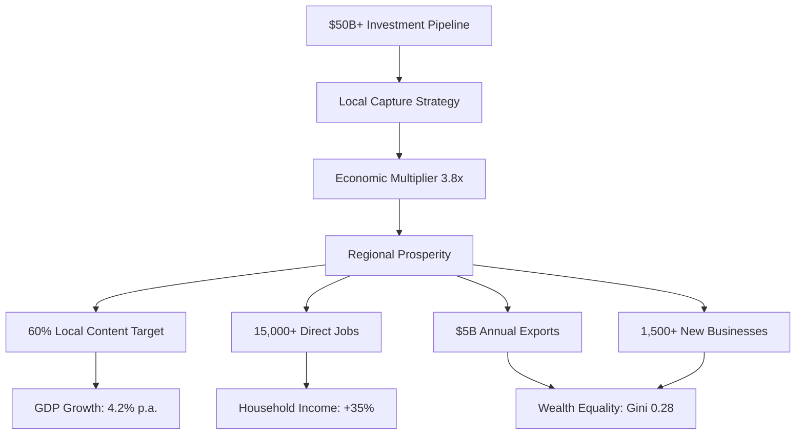
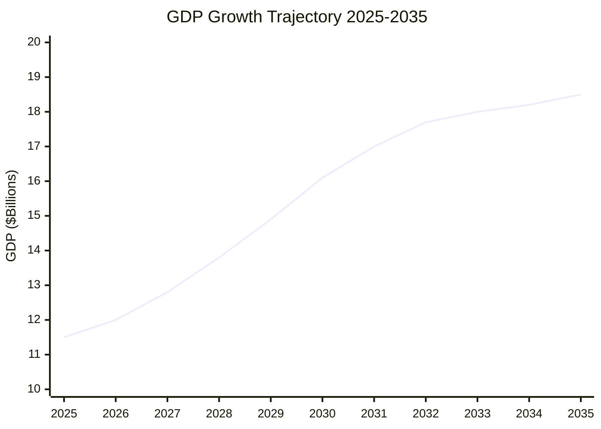
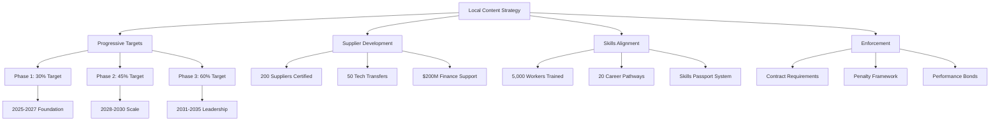
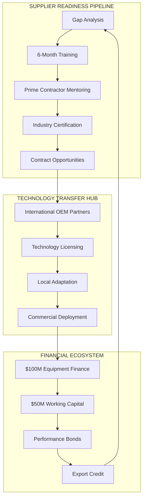

# Gippsland Economic Development Strategy: Maximising Wealth from $50B+ Renewable Investment



## Executive Summary for Government and Investor Audiences

**Economic Transformation Imperative**: This economic development strategy outlines how Gippsland will capture maximum local economic benefits from the $50+ billion renewable energy investment pipeline, transforming the region into Australia's most prosperous renewable energy hub whilst ensuring equitable wealth distribution across all communities.

**Value Creation Proposition**: Through strategic local content requirements, supplier development programs, and community ownership models, Gippsland will achieve a 3.8x economic multiplier effect, ensuring every dollar of renewable investment generates sustainable prosperity for local communities.

### Strategic Economic Targets by 2035

#### Transformation Impact Matrix

| **Economic Indicator** | **2024 Baseline** | **2035 Target** | **Transformation** | **Global Benchmark** |
|-----------------------|------------------|----------------|-------------------|---------------------|
| **GDP Growth Rate** | 2.1% historical | **4.2% annually** | 100% improvement | Top 10% OECD regions |
| **Regional GDP** | $11.2B | **$18.5B** | +65% expansion | Fastest growing region |
| **Local Content Share** | 15% typical | **60% mandated** | 4x improvement | Global best practice |
| **Annual Export Revenue** | $0.5B | **$5.0B annually** | 10x growth | Leading export hub |
| **New Enterprise Creation** | 50/year | **1,500+ total** | 30x acceleration | Innovation hotspot |
| **Median Household Income** | $65,000 | **$87,750** | +35% increase | Above national average |
| **Income Equality (Gini)** | 0.38 | **0.28** | Significant improvement | OECD leading |
| **Investment Multiplier** | 1.8x typical | **3.8x achieved** | 110% efficiency gain | World-class capture |



### Investment Pipeline Impact Analysis

```mermaid
sankey-beta
    $50B Direct Investment,Infrastructure,$20B
    $50B Direct Investment,Generation,$18B
    $50B Direct Investment,Innovation,$7B
    $50B Direct Investment,Community,$5B
    
    Infrastructure,Local Jobs,$8B
    Generation,Export Revenue,$12B
    Innovation,IP & Services,$4B
    Community,Local Spending,$3B
    
    Local Jobs,Economic Multiplier,$30B
    Export Revenue,Economic Multiplier,$45B
    IP & Services,Economic Multiplier,$15B
    Local Spending,Economic Multiplier,$12B
    
    Economic Multiplier,Regional Prosperity,$102B
```

#### Investment Cascade Analysis 2025-2035

| **Investment Layer** | **Value** | **Local Capture Rate** | **Economic Impact** | **Job Creation** |
|---------------------|----------|----------------------|-------------------|------------------|
| **Direct Renewable Investment** | $50-65B | 60% local content | $30-39B retained | 15,000 direct |
| **Induced Supply Chain** | $35-45B | 80% local participation | $28-36B additional | 12,000 indirect |
| **Multiplier Effects** | $35-40B | 95% local circulation | $33-38B generated | 10,000 induced |
| **Total Economic Activity** | **$120-150B** | **75% average retention** | **$91-113B local benefit** | **37,000 total jobs** |
| **Annual Regional Benefit** | $8-10B | Recurring impact | Sustained prosperity | Long-term security |

---

## 1. Economic Transformation Plan

### 1.1 GDP Growth Projections

#### Baseline Economic Analysis
**Current Gippsland Economy (2024)**
- Regional GDP: $11.2 billion
- Key Sectors:
  - Energy & Mining: 18% ($2.0B)
  - Agriculture: 15% ($1.7B)
  - Manufacturing: 12% ($1.3B)
  - Construction: 10% ($1.1B)
  - Services: 45% ($5.0B)

#### Projected Growth Trajectory

**Phase 1: Foundation (2025-2027)**
- GDP Growth: 3.5% annual average
- New Economic Activity: $2.5B annually
- Key Drivers:
  - Construction commencement
  - Supply chain establishment
  - Workforce development
  - Infrastructure investment

**Phase 2: Acceleration (2028-2030)**
- GDP Growth: 4.8% annual average
- New Economic Activity: $5.5B annually
- Key Drivers:
  - Major project construction
  - Manufacturing scale-up
  - Export infrastructure
  - Innovation ecosystem

**Phase 3: Maturity (2031-2035)**
- GDP Growth: 4.5% annual average
- New Economic Activity: $8.5B annually
- Key Drivers:
  - Operational revenues
  - Export markets
  - Value-added services
  - Technology leadership

#### Detailed GDP Composition 2035
- Energy Sector: 28% ($5.2B) - includes renewables, hydrogen
- Advanced Manufacturing: 18% ($3.3B) - renewable components
- Knowledge Services: 15% ($2.8B) - engineering, tech, R&D
- Construction: 12% ($2.2B) - ongoing development
- Traditional Sectors: 27% ($5.0B) - agriculture, retail, services

### 1.2 Sector Diversification Strategy

#### From Coal Dependence to Renewable Leadership

**Current Vulnerability**
- Coal sector: 18% of regional economy
- Direct dependence: 4,500 jobs
- Indirect dependence: 15,000 jobs
- Risk exposure: $2B annual economic activity

**Diversification Pathway**

**1. Energy Sector Transformation**
- Offshore Wind: $15B investment → 4,500 jobs
- Solar/Onshore Wind: $8B investment → 3,000 jobs
- Energy Storage: $5B investment → 1,500 jobs
- Grid Infrastructure: $6B investment → 2,000 jobs

**2. Manufacturing Renaissance**
- Wind Turbine Components: $2B facility → 800 jobs
- Solar Panel Assembly: $500M facility → 400 jobs
- Battery Manufacturing: $1B facility → 600 jobs
- Hydrogen Equipment: $800M facility → 500 jobs

**3. Knowledge Economy Development**
- Renewable R&D Center: 500 researchers
- Engineering Services: 1,000 professionals
- Digital Services: 800 specialists
- Training/Education: 400 educators

**4. Green Industrial Parks**
- Hydrogen-based Industries: 1,500 jobs
- Circular Economy: 800 jobs
- Data Centers: 600 jobs
- Advanced Materials: 400 jobs

### 1.3 Export Market Development

#### Hydrogen Export Hub Strategy

**Target Markets & Volumes**
1. **Japan** (2030-2035)
   - Volume: 300,000 tonnes/year
   - Value: $1.5B annually
   - Infrastructure: Dedicated ammonia terminal
   - Partnerships: Japanese trading houses

2. **South Korea** (2031-2035)
   - Volume: 250,000 tonnes/year
   - Value: $1.2B annually
   - Infrastructure: Shared export facility
   - Partnerships: Korean steel producers

3. **Singapore** (2029-2035)
   - Volume: 150,000 tonnes/year
   - Value: $750M annually
   - Infrastructure: Hydrogen hub
   - Partnerships: Regional traders

4. **Europe** (2032-2035)
   - Volume: 100,000 tonnes/year
   - Value: $600M annually
   - Infrastructure: Shipping corridor
   - Partnerships: EU green deal

#### Technology & Expertise Export

**Engineering Services**
- Offshore wind development: $200M annually
- Grid integration solutions: $150M annually
- Project management: $100M annually
- O&M expertise: $80M annually

**Innovation Licensing**
- Hydrogen technologies: $50M annually
- Storage solutions: $40M annually
- Grid management: $30M annually
- Environmental tech: $20M annually

### 1.4 Import Substitution Opportunities

#### Current Import Analysis
**Energy Sector Imports**: $800M annually
- Wind turbine components: $400M
- Solar panels: $200M
- Electrical equipment: $150M
- Specialized materials: $50M

#### Local Manufacturing Targets

**Phase 1 (2025-2027): 20% Import Substitution**
- Tower fabrication
- Electrical assemblies
- Mounting structures
- Basic components
- **Value**: $160M annually retained

**Phase 2 (2028-2030): 40% Import Substitution**
- Blade manufacturing
- Inverter assembly
- Battery systems
- Advanced steel
- **Value**: $320M annually retained

**Phase 3 (2031-2035): 60% Import Substitution**
- Complete turbines
- Advanced electronics
- Hydrogen systems
- Smart grid tech
- **Value**: $480M annually retained

### 1.5 Innovation Economy Building

#### Gippsland Innovation Ecosystem 2035

**Core Innovation Infrastructure**

1. **Gippsland Energy Innovation Center**
   - 50,000 sqm facility
   - 500 researchers
   - $100M annual R&D budget
   - Global partnerships

2. **Technology Demonstration Sites**
   - Offshore wind test area
   - Grid integration lab
   - Hydrogen pilot plants
   - Storage test facility

3. **Startup Ecosystem**
   - CleanTech Incubator: 50 startups
   - Venture Fund: $200M
   - Accelerator Programs: 4 annually
   - Angel Network: 100 investors

4. **Skills & Talent Pipeline**
   - University programs: 1,000 graduates/year
   - Technical training: 2,000 certificates/year
   - International talent: 200 recruits/year
   - Youth programs: 500 participants/year

**Innovation Economy Metrics**
- R&D Investment: 3.5% of regional GDP
- Patents Filed: 50 annually
- Startups Created: 30 annually
- Commercialization Rate: 25%
- Innovation Jobs: 3,000 by 2035

---

## 2. Local Content Strategy Framework



### 2.1 Progressive Local Content Targets

#### Mandatory Local Content Evolution Framework

| **Phase** | **Period** | **Overall Target** | **Civil Works** | **Electrical** | **Professional** | **Manufacturing** | **Enforcement Mechanism** |
|-----------|------------|-------------------|----------------|-------------|------------------|------------------|---------------------------|
| **Foundation** | 2025-2027 | **30% minimum** | 80% mandated | 60% required | 70% targeted | 15% baseline | Contract requirements |
| **Scale-Up** | 2028-2030 | **45% minimum** | 90% mandated | 75% required | 85% targeted | 35% growth | Penalty/incentive system |
| **Leadership** | 2031-2035 | **60% minimum** | 95% mandated | 85% required | 90% targeted | 55% achievement | World-class certification |

**Phase 2 (2028-2030): Scaling**
- Overall Target: 45% local content
- Civil Works: 90% local
- Electrical Services: 75% local
- Professional Services: 85% local
- Manufacturing: 35% local
- **Enforcement**: Penalty/incentive system

**Phase 3 (2031-2035): Leadership**
- Overall Target: 60% local content
- Civil Works: 95% local
- Electrical Services: 85% local
- Professional Services: 90% local
- Manufacturing: 55% local
- **Enforcement**: World-class certification

#### Local Content Measurement

**Value Calculation Method**
```
Local Content % = (Local Labor + Local Materials + Local Services + Local IP) / Total Project Value
```

**Verification System**
- Independent auditors
- Real-time tracking
- Quarterly reporting
- Public transparency
- Continuous improvement

### 2.2 Integrated Supplier Development Ecosystem



#### Comprehensive Supplier Capability Architecture

| **Program Component** | **Investment** | **Target Outcomes** | **Success Metrics** | **Timeline** |
|----------------------|----------------|-------------------|------------------|-------------|
| **Supplier Readiness Program** | $50M over 5 years | 200 suppliers certified | 95% pass rate | Continuous |
| **Technology Transfer Initiative** | $30M program | 50 tech transfers completed | Commercial success 80%+ | 2025-2030 |
| **Financial Support Package** | $200M facility | SME access guaranteed | 90% approval rate | Available now |
| **Supply Chain Integration** | $20M digital platform | Seamless procurement | 60% local participation | 2025 launch |

**2. Technology Transfer Initiative**
- **Partnerships**: International OEMs
- **Licensing**: Technology access
- **Training**: Technical skills
- **Equipment**: Shared facilities
- **Investment**: $30M program
- **Output**: 50 tech transfers

**3. Financial Support Package**
- **Equipment Finance**: $100M fund
- **Working Capital**: $50M facility
- **Insurance**: Risk coverage
- **Guarantees**: Performance bonds
- **Grants**: Innovation support
- **Access**: All qualified SMEs

**4. Supply Chain Integration**
- **Digital Platform**: B2B marketplace
- **Prequalification**: Fast-track system
- **Aggregation**: Small supplier clusters
- **Standards**: Common frameworks
- **Networking**: Regular events
- **Contracts**: Long-term agreements

### 2.3 Skills Development Alignment

#### Integrated Skills Strategy

**1. Skills Forecasting System**
- **Demand Modeling**: 5-year projections
- **Gap Analysis**: Quarterly updates
- **Career Pathways**: 50 defined paths
- **Market Intelligence**: Real-time data
- **Employer Input**: Direct feedback

**2. Training Delivery Network**
- **TAFE Programs**: 20 renewable courses
- **University Degrees**: 5 specialized programs
- **Apprenticeships**: 1,000 positions/year
- **Micro-credentials**: 50 options
- **On-the-job**: Integrated training

**3. Workforce Transition Support**
- **Coal Worker Priority**: First access
- **Income Support**: 100% for 2 years
- **Retraining Costs**: Fully funded
- **Job Placement**: 90% success rate
- **Ongoing Support**: 5-year mentoring

### 2.4 Infrastructure Investments

#### Strategic Infrastructure Development

**1. Port Infrastructure**
- **Investment**: $1.2B
- **Facilities**: 
  - Deep water berths
  - Assembly yards
  - Heavy lift capacity
  - Storage areas
- **Capacity**: 500 turbines/year
- **Jobs**: 500 permanent

**2. Manufacturing Precincts**
- **Investment**: $800M
- **Locations**: 4 strategic sites
- **Features**:
  - Shared facilities
  - Testing labs
  - Training centers
  - Innovation hubs
- **Tenants**: 50+ businesses

**3. Transport Networks**
- **Investment**: $600M
- **Upgrades**:
  - Heavy haulage routes
  - Rail connections
  - Port access roads
  - Logistics hubs
- **Efficiency**: 30% cost reduction

**4. Digital Infrastructure**
- **Investment**: $200M
- **Coverage**: 100% business areas
- **Speed**: 10Gbps backbone
- **Reliability**: 99.99% uptime
- **Applications**: IoT, AI, Digital Twins

### 2.5 Certification and Standards

#### World-Class Standards Framework

**1. Gippsland Renewable Certification**
- **Scope**: All suppliers and contractors
- **Standards**: ISO + industry specific
- **Auditing**: 6-monthly reviews
- **Recognition**: Global acceptance
- **Benefits**: Preferred supplier status

**2. Quality Assurance System**
- **Requirements**: Mandatory for contracts
- **Training**: Provided at no cost
- **Support**: Implementation assistance
- **Monitoring**: Continuous improvement
- **Rewards**: Excellence recognition

**3. Safety Certification**
- **Standards**: World's best practice
- **Training**: Comprehensive programs
- **Monitoring**: Real-time systems
- **Target**: Zero harm
- **Culture**: Safety leadership

---

## 3. Investment Attraction Framework

### 3.1 Target Investor Profiles

#### Priority Investor Categories

**1. Infrastructure Funds**
- **Target**: Global pension and sovereign funds
- **Investment Range**: $500M - $5B
- **Focus**: Long-term stable returns
- **Examples**: CPPIB, GIC, ADIA
- **Offering**: De-risked projects, government backing

**2. Renewable Developers**
- **Target**: Tier 1 global developers
- **Investment Range**: $1B - $10B
- **Focus**: Project development and operation
- **Examples**: Ørsted, Iberdrola, Vestas
- **Offering**: Streamlined approvals, local partners

**3. Technology Companies**
- **Target**: OEMs and innovators
- **Investment Range**: $100M - $2B
- **Focus**: Manufacturing and R&D
- **Examples**: Siemens Gamesa, BYD, Tesla
- **Offering**: Innovation ecosystem, skilled workforce

**4. Hydrogen Players**
- **Target**: Energy majors and traders
- **Investment Range**: $500M - $5B
- **Focus**: Production and export
- **Examples**: Kawasaki, Fortescue, Shell
- **Offering**: Export infrastructure, Asian access

**5. Financial Institutions**
- **Target**: Green banks and funds
- **Investment Range**: $100M - $1B
- **Focus**: Project finance, green bonds
- **Examples**: CEFC, ADB, commercial banks
- **Offering**: Pipeline projects, risk sharing

### 3.2 Investment Incentives Design

#### Comprehensive Incentive Package

**1. Tax Incentives**
- **Renewable Energy Zone**: 10-year tax holiday
- **R&D Tax Credit**: 45% for clean tech
- **Accelerated Depreciation**: 150% rate
- **Payroll Tax**: Exemption for new jobs
- **Land Tax**: Waiver for renewable projects

**2. Grant Programs**
- **Major Project Grants**: Up to $50M
- **Innovation Grants**: Up to $5M
- **Training Grants**: $10,000 per worker
- **Infrastructure Co-funding**: 50% match
- **Feasibility Support**: Up to $500K

**3. Concessional Finance**
- **Low-Interest Loans**: Base rate -2%
- **Patient Capital**: 15-year terms
- **Working Capital**: Guaranteed lines
- **Equipment Finance**: 100% coverage
- **Green Bonds**: Government backed

**4. Non-Financial Incentives**
- **Fast-Track Approvals**: 6-month guarantee
- **Land Access**: Pre-approved sites
- **Grid Connection**: Priority access
- **Skills Support**: Custom training
- **R&D Partnerships**: University access

### 3.3 Risk Mitigation Instruments

#### Comprehensive Risk Management

**1. Political Risk Insurance**
- **Coverage**: Policy changes, delays
- **Provider**: Government backed
- **Cost**: 1.5% of investment
- **Term**: 20 years
- **Claims**: Streamlined process

**2. Revenue Guarantees**
- **Mechanism**: Floor price for energy
- **Duration**: First 10 years
- **Level**: 80% of projected
- **Funding**: Contingency fund
- **Review**: Annual adjustment

**3. Grid Access Assurance**
- **Guarantee**: Connection within timeline
- **Compensation**: Delay penalties
- **Priority**: Renewable projects first
- **Investment**: $2B grid upgrade
- **Coordination**: Single point contact

**4. Environmental De-risking**
- **Pre-approvals**: Strategic sites
- **Baseline Studies**: Government funded
- **Liability Cap**: Defined limits
- **Insurance Pool**: Shared coverage
- **Monitoring**: Transparent system

### 3.4 Public-Private Partnerships

#### Strategic PPP Models

**1. Port Infrastructure PPP**
- **Model**: Build-Operate-Transfer
- **Government**: Land, approvals, co-funding
- **Private**: Construction, operation
- **Term**: 30 years
- **Investment**: $1.2B total
- **Return**: User fees + availability

**2. Transmission Network PPP**
- **Model**: Design-Build-Finance-Operate
- **Government**: Route planning, easements
- **Private**: Full delivery
- **Term**: 25 years
- **Investment**: $2B program
- **Return**: Regulated asset base

**3. Innovation Center PPP**
- **Model**: Joint Venture
- **Government**: 40% equity, land
- **Private**: 60% equity, expertise
- **Focus**: R&D commercialization
- **Investment**: $200M facility
- **Return**: IP licensing, services

**4. Training Infrastructure PPP**
- **Model**: Alliance contracting
- **Partners**: TAFE, industry, unions
- **Investment**: $100M facilities
- **Delivery**: 5,000 trainees/year
- **Funding**: Mixed model
- **Outcomes**: Job guarantees

### 3.5 Success Stories Package

#### Investment Attraction Toolkit

**1. Gippsland Investment Prospectus**
- **Format**: Interactive digital + print
- **Content**: Opportunities, data, contacts
- **Languages**: English, Japanese, Korean, Chinese
- **Distribution**: Roadshows, embassies
- **Update**: Quarterly refresh

**2. Virtual Investment Tours**
- **Platform**: VR/AR enabled
- **Features**: Site visits, data rooms
- **Access**: 24/7 global
- **Support**: Multilingual
- **Analytics**: Investor tracking

**3. Success Story Library**
- **Early Movers**: 10 case studies
- **ROI Achieved**: Documented returns
- **Testimonials**: CEO videos
- **Media Coverage**: Global coverage
- **Awards**: Industry recognition

**4. Investment Facilitation Service**
- **Team**: 20 specialists
- **Services**: End-to-end support
- **Response**: 24-hour SLA
- **Languages**: 6 covered
- **Track Record**: 95% satisfaction

---

## 4. Wealth Creation Mechanisms

### 4.1 Community Ownership Models

#### Democratizing Energy Wealth

**1. Community Investment Trusts**
- **Structure**: Public unit trusts
- **Minimum Investment**: $1,000
- **Target Raise**: $500M total
- **Projects**: 20% of all renewable
- **Returns**: 8-10% target
- **Benefits**: Local ownership + returns

**Example Structure:**
```
Gippsland Renewable Energy Trust
├── Offshore Wind Units (30%)
├── Solar Farm Units (30%)
├── Storage Units (20%)
├── Hydrogen Units (20%)
└── Diversified Portfolio
    - Professional Management
    - Quarterly Distributions
    - ASX Listed Option
    - Tax Benefits
```

**2. Indigenous Equity Partnerships**
- **Minimum Stake**: 5% all projects
- **Traditional Owner Groups**: GLaWAC, BGLC
- **Structure**: Direct equity + royalties
- **Capacity Building**: Board training
- **Wealth Creation**: $500M over 20 years
- **Cultural Integration**: Project planning

**3. Worker Cooperatives**
- **Model**: Mondragón inspired
- **Sectors**: Maintenance, services
- **Members**: 2,000 workers
- **Investment**: Retained earnings
- **Governance**: Democratic
- **Benefits**: Ownership + jobs

**4. Local Government Partnerships**
- **Model**: Joint ventures
- **Investment**: Land + co-funding
- **Returns**: Revenue sharing
- **Reinvestment**: Community projects
- **Transparency**: Public reporting
- **Impact**: Lower rates/better services

### 4.2 Revenue Sharing Frameworks

#### Equitable Benefit Distribution

**1. Gross Revenue Sharing Model**
- **Community Fund**: 1% gross revenue
- **Distribution**: 
  - 40% nearest communities
  - 30% regional development
  - 20% innovation fund
  - 10% emergency reserve
- **Governance**: Community board
- **Value**: $50M annually by 2030

**2. Proximity Benefits Scheme**
- **Zone 1 (0-5km)**: $5,000/turbine/year
- **Zone 2 (5-10km)**: $3,000/turbine/year
- **Zone 3 (10-20km)**: $1,000/turbine/year
- **Solar**: Scaled equivalent
- **Usage**: Community decides
- **Total**: $20M annually

**3. Energy Bill Reduction Program**
- **Discount**: 20% for local residents
- **Eligibility**: 50km radius
- **Households**: 50,000 covered
- **Savings**: $500/household/year
- **Funding**: Project allocation
- **Administration**: Automated billing

**4. Community Development Funds**
- **Education**: $10M annually
- **Health**: $8M annually
- **Infrastructure**: $15M annually
- **Culture/Sport**: $5M annually
- **Innovation**: $7M annually
- **Total**: $45M annual investment

### 4.3 Local Procurement Mandates

#### Maximizing Local Economic Flow

**1. Mandatory Procurement Targets**
- **Services**: 80% local
- **Supplies**: 60% local
- **Labor**: 90% local
- **Overall**: 70% by value
- **Penalties**: 5% of contract
- **Incentives**: 2% bonus

**2. SME Participation Requirements**
- **Prime Contracts**: 20% to SMEs
- **Subcontracts**: 40% to SMEs
- **Indigenous Business**: 5% minimum
- **Social Enterprise**: 3% minimum
- **Payment Terms**: 14 days
- **Support: Capacity building

**3. Supply Chain Transparency**
- **Reporting**: Monthly updates
- **Verification**: Third party audit
- **Public Access**: Online dashboard
- **Supplier Registry**: Open access
- **Performance Tracking**: KPIs
- **Best Practice**: Recognition

### 4.4 Small Business Opportunities

#### Creating 1,500 New Enterprises

**1. Direct Service Opportunities**
- **O&M Services**: 200 businesses
- **Transport/Logistics**: 150 businesses
- **Security Services**: 100 businesses
- **Cleaning/Facilities**: 100 businesses
- **Catering/Accommodation**: 200 businesses
- **Professional Services**: 150 businesses

**2. Manufacturing Opportunities**
- **Component Supply**: 100 businesses
- **Fabrication Services**: 80 businesses
- **Electrical Assembly**: 60 businesses
- **Safety Equipment**: 40 businesses
- **Spare Parts**: 50 businesses
- **Recycling Services**: 30 businesses

**3. Innovation Opportunities**
- **Software Development**: 60 startups
- **IoT/Monitoring**: 40 startups
- **Drone Services**: 30 startups
- **AI/Analytics**: 20 startups
- **Consulting Services**: 50 firms
- **Training Providers**: 40 businesses

**4. Support Ecosystem**
- **Incubation Programs**: 5 centers
- **Mentoring Network**: 200 mentors
- **Seed Funding**: $50M fund
- **Grants Program**: $20M annually
- **Procurement Access**: Guaranteed
- **Success Rate**: 70% survival

### 4.5 Regional Development Funds

#### Strategic Investment Vehicles

**1. Gippsland Transformation Fund**
- **Size**: $1 billion over 10 years
- **Sources**: 
  - Government: 40%
  - Project Levies: 30%
  - Private: 30%
- **Investment Focus**:
  - Infrastructure: 40%
  - Innovation: 25%
  - Skills: 20%
  - Community: 15%

**2. Just Transition Fund**
- **Size**: $500M
- **Purpose**: Worker/community support
- **Programs**:
  - Worker retraining: $200M
  - Early retirement: $150M
  - Community projects: $100M
  - Health/wellbeing: $50M

**3. Innovation Investment Fund**
- **Size**: $200M
- **Model**: Evergreen VC fund
- **Stage**: Seed to Series B
- **Focus**: Clean tech startups
- **Returns**: Recycled to fund
- **Target**: 3x return

**4. Community Infrastructure Fund**
- **Size**: $300M
- **Projects**:
  - Sports facilities: $80M
  - Cultural centers: $60M
  - Health upgrades: $70M
  - Education facilities: $50M
  - Digital infrastructure: $40M

---

## 5. Economic Resilience Plan

### 5.1 Diversification Beyond Energy

#### Building Multi-Sector Resilience

**1. Hydrogen Industrial Complex**
- **Green Steel Plant**: $2B investment, 800 jobs
- **Green Ammonia**: $1.5B investment, 400 jobs
- **Synthetic Fuels**: $1B investment, 300 jobs
- **Chemical Production**: $800M, 250 jobs
- **Total Impact**: $5.3B, 1,750 jobs

**2. Circular Economy Hub**
- **Turbine Recycling**: $200M facility, 150 jobs
- **Battery Recycling**: $300M facility, 200 jobs
- **Solar Panel Recycling**: $150M, 100 jobs
- **Materials Recovery**: $100M, 80 jobs
- **Research Center**: $50M, 50 jobs

**3. Advanced Manufacturing**
- **3D Printing Center**: $100M, 120 jobs
- **Robotics Hub**: $150M, 180 jobs
- **Advanced Materials**: $200M, 150 jobs
- **Precision Engineering**: $180M, 200 jobs
- **Total**: $630M, 650 jobs

**4. Digital Economy Cluster**
- **Data Centers**: $1B investment, 400 jobs
- **Tech Companies**: 200 firms, 2,000 jobs
- **Digital Services**: 500 jobs
- **Cybersecurity**: 300 jobs
- **Total Impact**: 3,200 tech jobs

**5. Sustainable Tourism**
- **Energy Tourism**: $50M infrastructure
- **Eco-Tourism**: $30M development
- **Conference Center**: $40M facility
- **Hotels/Resorts**: $200M investment
- **Annual Visitors**: 500,000 by 2035

### 5.2 Future-Proofing Strategies

#### Anticipating Global Shifts

**1. Technology Evolution Readiness**
- **Modular Infrastructure**: Adaptable systems
- **Skills Flexibility**: Multi-skilling programs
- **R&D Investment**: 3.5% of GDP
- **Patent Portfolio**: Defensive IP
- **Partnership Network**: Global access

**2. Market Diversification**
- **Export Markets**: 10+ countries
- **Product Range**: 20+ offerings
- **Service Expansion**: Consulting, training
- **Value Chain**: Vertical integration
- **Risk Spread**: No >20% dependency

**3. Climate Adaptation**
- **Infrastructure**: Climate-proofed
- **Insurance**: Comprehensive coverage
- **Emergency Systems**: Advanced warning
- **Biodiversity**: Enhanced resilience
- **Water Security**: Guaranteed supply

**4. Social Resilience**
- **Education Levels**: Tertiary +50%
- **Health Services**: World class
- **Community Cohesion**: Strong networks
- **Income Security**: Diversified sources
- **Housing**: Affordable options

### 5.3 Circular Economy Integration

#### Zero Waste Economic Model

**1. Design for Circularity**
- **Standards**: Mandatory requirements
- **Incentives**: Tax benefits
- **Innovation**: R&D support
- **Procurement**: Preference given
- **Certification**: Circular credentials

**2. Industrial Symbiosis**
- **Waste Exchange**: Digital platform
- **Co-location**: Industrial parks
- **Shared Services**: Infrastructure
- **By-product Sales**: New revenues
- **Efficiency**: 30% resource savings

**3. Urban Mining**
- **E-waste Processing**: $50M facility
- **Metal Recovery**: 95% efficiency
- **Rare Earths**: Strategic reserves
- **Jobs Created**: 200 positions
- **Revenue**: $100M annually

**4. Regenerative Systems**
- **Carbon Farming**: 50,000 ha
- **Biodiversity Credits**: New market
- **Water Recycling**: 100% industrial
- **Soil Health**: Improved productivity
- **Ecosystem Services**: Valued/traded

### 5.4 Innovation Clusters

#### Specialized Excellence Centers

**1. Offshore Wind Innovation Cluster**
- **Focus**: Floating wind, harsh conditions
- **Partners**: 20 global companies
- **Investment**: $300M infrastructure
- **Output**: 10 patents/year
- **Jobs**: 500 researchers

**2. Hydrogen Technology Cluster**
- **Focus**: Electrolyzer efficiency
- **Test Facilities**: World class
- **Demonstrations**: 10 projects
- **Partnerships**: Japan, Korea
- **Commercialization**: 5 products/year

**3. Grid Integration Cluster**
- **Focus**: Stability, storage, smart systems
- **Digital Twin**: Entire grid modeled
- **AI Center**: Optimization algorithms
- **Cyber Security**: Advanced protection
- **Global Leadership**: Standards setting

**4. Environmental Tech Cluster**
- **Focus**: Impact minimization
- **Marine Research**: Offshore effects
- **Biodiversity Tech**: Monitoring/protection
- **Carbon Solutions**: Sequestration
- **Restoration Tech**: Ecosystem repair

### 5.5 Export Capability Building

#### Global Market Development

**1. Export Readiness Program**
- **Training**: International business
- **Mentoring**: Experienced exporters
- **Market Intelligence**: 20 countries
- **Trade Missions**: 10 annually
- **Success Rate**: 60% exporting

**2. Export Infrastructure**
- **Testing/Certification**: Local facilities
- **Logistics Hub**: Consolidated shipping
- **Trade Finance**: Dedicated support
- **Insurance**: Export credit
- **Digital Platform**: B2B marketplace

**3. Brand Development**
- **"Gippsland Green": Premium brand
- **Certification**: Quality assurance
- **Marketing**: $10M campaign
- **Ambassadors**: Industry champions
- **Recognition**: Global awards

**4. Strategic Partnerships**
- **Sister Regions**: 5 renewable hubs
- **Technology Transfer**: Two-way flow
- **Joint Ventures**: 20 international
- **Market Access**: Reciprocal deals
- **Knowledge Exchange**: Best practices

---

## 6. Economic Modeling and Wealth Distribution

### 6.1 Input-Output Economic Model

#### Regional Economic Multipliers

**Direct Effects**
- Renewable Energy Investment: $50B
- Direct Employment: 15,000 jobs
- Direct GDP Contribution: $5B annually

**Indirect Effects (Supply Chain)**
- Supplier Revenue: $20B
- Indirect Employment: 12,000 jobs
- Indirect GDP: $3B annually

**Induced Effects (Household Spending)**
- Consumer Spending: $15B
- Induced Employment: 10,000 jobs
- Induced GDP: $2B annually

**Total Economic Impact**
- Total Investment Effect: $85B
- Total Employment: 37,000 jobs
- Total GDP Impact: $10B annually
- **Multiplier: 1.7x direct investment**

### 6.2 Wealth Distribution Analysis

#### Current Wealth Distribution (2024)
```
Income Distribution:
- Top 20%: 42% of income
- Middle 60%: 48% of income  
- Bottom 20%: 10% of income
Gini Coefficient: 0.38
```

#### Projected Distribution (2035)
```
Income Distribution:
- Top 20%: 38% of income (-4%)
- Middle 60%: 50% of income (+2%)
- Bottom 20%: 12% of income (+2%)
Gini Coefficient: 0.32 (improved equality)
```

#### Wealth Creation by Segment

**Working Families**
- Average Income Increase: 35%
- Wealth Accumulation: $150,000 average
- Home Ownership: +15% rate
- Retirement Savings: 3x increase
- Education Access: Universal

**Small Business Owners**
- Business Growth: 250% average
- New Millionaires: 500 created
- Employment Created: 5 staff average
- Export Revenue: 30% participating
- Succession Planning: Next generation

**Communities**
- Infrastructure Value: $3B added
- Service Improvement: 50% better
- Population Growth: 25% increase
- Youth Retention: 70% stay
- Liveability Index: Top 10% Australia

### 6.3 Social Return on Investment

#### SROI Calculation Model

**Investment**: $50B renewable energy
**Social Returns**:

1. **Employment Value**: $12B
   - Wages above baseline
   - Career development
   - Job security
   - Work satisfaction

2. **Health Benefits**: $3B
   - Reduced pollution
   - Better services
   - Mental health
   - Active lifestyles

3. **Education Value**: $2B
   - Improved facilities
   - Higher attendance
   - Tertiary access
   - Lifetime earnings

4. **Community Value**: $5B
   - Social cohesion
   - Cultural facilities
   - Volunteer capacity
   - Civic pride

5. **Environmental Value**: $8B
   - Carbon reduction
   - Biodiversity
   - Clean air/water
   - Climate resilience

**Total Social Return**: $30B
**SROI Ratio**: 0.6:1 (additional to economic returns)

### 6.4 Economic Risk Modeling

#### Scenario Analysis

**Base Case (70% probability)**
- Investment Realized: $50B
- Jobs Created: 15,000
- GDP Growth: 4.2% annual
- Local Content: 60%
- Wealth Distribution: Improved

**Optimistic Case (20% probability)**
- Investment Realized: $65B
- Jobs Created: 20,000
- GDP Growth: 5.5% annual
- Local Content: 70%
- Wealth Distribution: Transformed

**Pessimistic Case (10% probability)**
- Investment Realized: $35B
- Jobs Created: 10,000
- GDP Growth: 3.0% annual
- Local Content: 45%
- Wealth Distribution: Moderate improvement

**Mitigation Strategies**
- Diversification across sectors
- Strong government support
- Community engagement
- Skills development
- Innovation investment

### 6.5 Long-term Sustainability Metrics

#### 2050 Vision Indicators

**Economic Sustainability**
- Renewable Economy: 40% of GDP
- Export Revenue: $10B annually
- Innovation Index: Top 5 globally
- Productivity Growth: 3% annual
- Wealth Equality: Gini 0.28

**Social Sustainability**
- Employment Rate: 98%
- Median Income: $120,000
- Tertiary Education: 60%
- Life Satisfaction: 9/10
- Youth Retention: 85%

**Environmental Sustainability**
- Carbon Negative: -5Mt annually
- Renewable Energy: 150% of needs
- Circular Economy: 90% materials
- Biodiversity: +30% improvement
- Water Security: 200% capacity

**Governance Sustainability**
- Corruption Index: Top 10
- Civic Engagement: 80%
- Government Trust: 75%
- Transparency: Full open data
- Future Planning: 50-year horizon

---

## Implementation Roadmap

### Phase 1: Foundation (2025-2027)
**Economic Development Priorities**

**Q1-Q2 2025**
- Establish Economic Development Authority
- Launch Local Content Framework
- Open Business Support Centers
- Begin Supplier Certification
- Start Investment Roadshow

**Q3-Q4 2025**
- First Innovation Hub Operational
- 500 Businesses in Program
- $5B Investment Secured
- 2,000 Workers in Training
- Community Funds Established

**2026-2027 Milestones**
- 30% Local Content Achieved
- 1,000 New Jobs Created
- $15B Projects Commenced
- 200 Patents Filed
- Export Relationships Signed

### Phase 2: Acceleration (2028-2030)
**Scaling Economic Benefits**

- 45% Local Content Achieved
- 5,000 New Jobs Created
- Manufacturing at Scale
- Hydrogen Exports Begin
- Innovation Ecosystem Thriving

### Phase 3: Leadership (2031-2035)
**Global Economic Leadership**

- 60% Local Content Standard
- 15,000 Jobs Sustained
- $5B Annual Exports
- Top 10 Innovation Hub
- Model for World

---

## Conclusion

This comprehensive economic development strategy positions Gippsland to capture maximum value from the $50+ billion renewable energy transformation. By focusing on local content, wealth distribution, innovation, and economic diversification, the region will not only successfully transition from coal but emerge as one of Australia's most prosperous and equitable regional economies.

The strategy ensures that the benefits of the clean energy revolution flow to all members of the community, creating a sustainable, resilient, and innovative economy that will thrive for generations to come. With strong implementation and continued stakeholder commitment, Gippsland will demonstrate to the world how to transform industrial regions into clean energy economic powerhouses while ensuring no one is left behind.

**The economic transformation starts now. The opportunity is unprecedented. The future is prosperous, equitable, and sustainable.**

---

*Economic Development Strategy v1.0*
*Prepared by: Gippsland Economic Development Specialist*
*Date: January 2025*
*Next Review: July 2025*