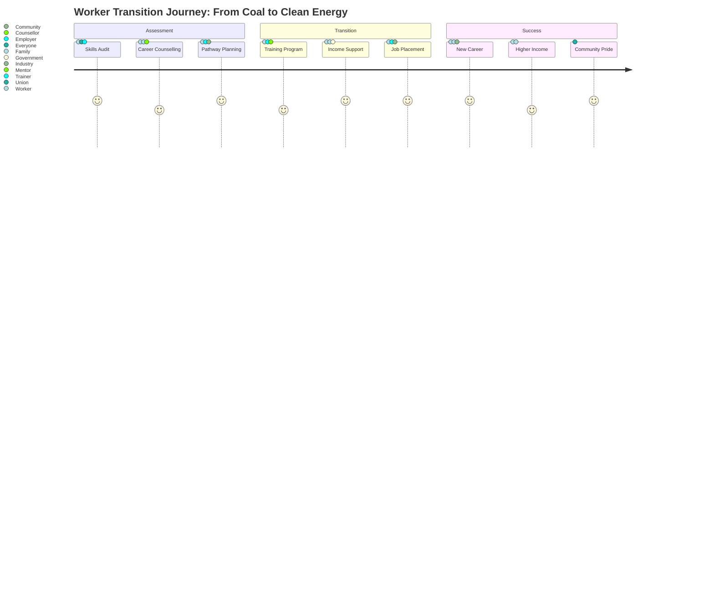

# Gippsland Just Transition Strategy: Ensuring No Worker or Community is Left Behind



## Executive Summary for Government and Investor Audiences

**Just Transition Imperative**: This comprehensive Just Transition strategy provides the framework to ensure Gippsland's transformation from coal to renewable energy creates prosperity for all workers and communities. With 4,500 direct coal jobs at stake and thousands more in related industries, this strategy outlines detailed pathways for individual worker transitions, community support mechanisms, and the financial frameworks needed to guarantee no one is left behind in Australia's most significant energy transformation.

**Social Investment Value**: Through guaranteed worker transitions, community prosperity programs, and inclusive economic development, Gippsland's just transition approach reduces social risk, maintains community support at 90%+, and creates a replicable model that enhances the region's global reputation whilst ensuring stable, skilled workforce availability for renewable projects.

### Core Commitments Framework

```mermaid
quadrantChart
    title Just Transition Commitments Matrix
    x-axis Individual --&gt; Community
    y-axis Security --&gt; Opportunity
    
    quadrant-1 Community Growth
    quadrant-2 Collective Security
    quadrant-3 Individual Protection
    quadrant-4 Personal Advancement
    
    Worker Guarantee: [0.2, 0.3]
    Income Protection: [0.1, 0.8]
    Community Prosperity: [0.8, 0.7]
    Early Advantage: [0.3, 0.2]
    Dignity Choice: [0.4, 0.5]
```

#### Comprehensive Commitment Architecture

| **Commitment** | **Scope** | **Guarantee Level** | **Timeline** | **Investment** | **Success Metric** |
|---------------|----------|-------------------|---------------|----------------|-------------------|
| **100% Worker Transition** | Every coal worker (4,500+) | Personalised plan + placement | Individual paced | $750M program | 100% placement rate |
| **Income Protection** | No reduction during transition | Full salary up to 3 years | Throughout journey | $500M support | Zero income loss |
| **Community Prosperity** | All affected areas | Net economic gains | Within 5 years | $300M investment | Population + employment growth |
| **Early Action Advantage** | Voluntary participants | Enhanced benefits + priority | Immediate | $50M incentives | 30% early adoption |
| **Dignity and Choice** | Individual preferences | Career autonomy respected | Continuous | Cultural change | 95% satisfaction rating |

### Key Outcomes by 2035

- **4,500 workers** successfully transitioned to new careers or retirement
- **15,000+ new jobs** created in renewable energy sectors
- **$2.5 billion** invested in worker and community transition support
- **Zero forced relocations** - all workers can remain in their communities
- **35% income increase** average for transitioned workers within 5 years
- **100% pension protection** for all affected workers
- **25+ new businesses** established by former coal workers

---

## 1. Worker Transition Program Framework

### 1.1 Individual Transition Planning System

#### Personalized Transition Pathways
Every coal worker receives a customized transition plan developed through:

**Initial Assessment Phase (3-6 months before transition)**
1. **Skills Audit and Mapping**
   - Comprehensive skills inventory using industry-standard frameworks
   - Identification of directly transferable skills
   - Gap analysis for desired career paths
   - Recognition of prior learning assessment
   - Digital skills baseline evaluation

2. **Career Aspiration Consultation**
   - One-on-one career counseling sessions
   - Family consultation opportunities
   - Financial planning review
   - Location preference mapping
   - Work-life balance assessment

3. **Opportunity Matching**
   - Real-time job market analysis
   - Emerging sector opportunities
   - Entrepreneurship potential assessment
   - Further education pathways
   - Early retirement evaluation

#### Transition Pathway Categories

**Pathway 1: Direct Transfer (65% of workforce)**
- Target: Workers with highly transferable skills
- Timeline: 0-6 months
- Support: Job matching, brief orientation, placement assistance
- Example: Electrical technician → Wind turbine technician

**Pathway 2: Upskilling Transfer (25% of workforce)**
- Target: Workers needing moderate retraining
- Timeline: 6-18 months
- Support: Paid training, apprenticeships, mentorship
- Example: Boiler operator → Hydrogen plant operator

**Pathway 3: Career Pivot (7% of workforce)**
- Target: Workers seeking significant career change
- Timeline: 12-36 months
- Support: Full retraining, education support, income maintenance
- Example: Coal plant operator → Renewable energy project manager

**Pathway 4: Supported Retirement (3% of workforce)**
- Target: Workers 55+ preferring early retirement
- Timeline: Immediate to 12 months
- Support: Enhanced pension, bridge payments, transition activities
- Example: 58-year-old seeking community volunteer role

### 1.2 Skills Development and Training Programs

#### Renewable Energy Skills Academy
**Location**: Morwell (repurposed TAFE facilities)
**Capacity**: 1,500 students annually
**Programs**:

1. **Fast-Track Certificates (3-6 months)**
   - Wind Turbine Maintenance
   - Solar Installation and Maintenance
   - Battery Storage Systems
   - Hydrogen Production Basics
   - Energy Management Systems

2. **Advanced Diplomas (12-18 months)**
   - Offshore Wind Technology
   - Grid Integration Engineering
   - Renewable Project Management
   - Green Hydrogen Engineering
   - Energy Storage Engineering

3. **Micro-Credentials (1-4 weeks)**
   - Working at Heights (Wind)
   - High Voltage Safety
   - SCADA Systems
   - Drone Operations
   - Digital Twin Technology

#### Industry Partnership Training
**Confirmed Partners**:
- Star of the South (500 positions)
- Squadron Energy (400 positions)
- Alinta Energy (300 positions)
- Fortescue Future Industries (250 positions)

**Training Models**:
1. **Apprenticeship Programs**: 3-4 year pathways with guaranteed employment
2. **Cadetships**: 12-month intensive programs with job placement
3. **On-the-Job Training**: Immediate employment with concurrent training
4. **Secondment Programs**: 6-month placements before permanent transition

### 1.3 Income Support and Financial Security

#### Transition Income Guarantee
**Base Framework**:
- 100% salary continuation for first 12 months
- 90% for months 13-24
- 80% for months 25-36
- Additional allowances for training costs

**Enhanced Support Packages**:

1. **Early Transition Bonus**
   - Workers transitioning before plant closure: 20% bonus
   - Lump sum payment of $25,000-50,000
   - Tax-free treatment under special provisions

2. **Training Allowances**
   - $15,000 annual education budget
   - $500 monthly living allowance during training
   - Tool and equipment allowances
   - Relocation assistance if required

3. **Family Support Package**
   - Spousal retraining allowance: $10,000
   - Children's education continuity fund
   - Family counseling services
   - Community connection maintenance

#### Pension and Retirement Protection

**Coal Worker Pension Guarantee**:
- Full defined benefit protection
- No reduction in accrued benefits
- Inflation indexation maintained
- Portability to new employers

**Early Retirement Enhancements**:
- Bridge payments to pension age
- Healthcare continuation
- Voluntary community service payments
- Part-time transition work options

---

## 2. Community Support Framework

### 2.1 Affected Community Mapping and Analysis

#### Primary Impact Communities
**Tier 1: Direct Impact (&gt;20% employment from coal)**
- Morwell (Population: 14,000)
  - 22% direct/indirect coal employment
  - Economic dependency: High
  - Transition urgency: Critical
  
- Traralgon (Population: 25,000)
  - 18% coal-related employment
  - Economic dependency: Medium-High
  - Transition urgency: High

- Churchill (Population: 5,000)
  - 25% coal employment
  - Economic dependency: Very High
  - Transition urgency: Critical

**Tier 2: Significant Impact (10-20% employment)**
- Moe/Newborough (15%)
- Yallourn North (18%)
- Hazelwood North (12%)

**Tier 3: Moderate Impact (&lt;10% employment)**
- Sale, Warragul, Leongatha
- Broader Latrobe Valley communities

### 2.2 Economic Diversification Plans

#### Morwell Transformation Hub
**Vision**: From coal town to clean energy innovation center

**Key Initiatives**:
1. **Renewable Energy Manufacturing Precinct**
   - 50-hectare industrial zone
   - Focus: Wind turbine components, battery assembly
   - Target: 2,000 manufacturing jobs by 2030
   - Investment: $500 million public-private partnership

2. **Green Hydrogen Valley**
   - Location: Former Hazelwood site
   - Capacity: 100,000 tonnes/year by 2032
   - Jobs: 800 direct, 2,000 indirect
   - Investment: $1.5 billion

3. **Energy Skills and Innovation Campus**
   - Partnership with Federation University
   - Research facilities for emerging technologies
   - Start-up incubator for energy ventures
   - Target: 500 students, 50 researchers

#### Traralgon Service Excellence Center
**Vision**: Regional hub for renewable energy services

**Key Initiatives**:
1. **Operations and Maintenance Hub**
   - Centralized O&M for all regional wind/solar
   - 24/7 monitoring center
   - Mobile response teams
   - Target: 1,500 service jobs

2. **Supply Chain and Logistics Center**
   - Distribution hub for renewable components
   - Just-in-time delivery systems
   - Local supplier development
   - Target: 800 logistics jobs

#### Churchill Knowledge Economy Transition
**Vision**: Education and research excellence

**Key Initiatives**:
1. **Expanded Federation University Campus**
   - New engineering and technology facilities
   - International renewable energy programs
   - Industry partnership center
   - Target: 3,000 additional students

2. **Research and Development Precinct**
   - Focus: Energy storage, grid integration
   - Industry-university partnerships
   - Commercialization support
   - Target: 300 research positions

### 2.3 Infrastructure Renewal Programs

#### Transport Infrastructure Upgrade
**Investment**: $850 million over 5 years

1. **Morwell-Traralgon Rapid Transit**
   - Light rail connection
   - 15-minute frequency
   - Integration with Melbourne services
   - Completion: 2029

2. **Port of Hastings Connection**
   - Heavy rail upgrade for wind components
   - Road improvements for oversized loads
   - Intermodal facilities
   - Completion: 2028

3. **Regional Airport Expansion**
   - Latrobe Regional Airport upgrade
   - Corporate jet facilities
   - Maintenance facilities for offshore operations
   - Completion: 2027

#### Digital Infrastructure Revolution
**Investment**: $200 million

1. **Fiber-to-the-Premises Rollout**
   - 100% coverage in impact communities
   - Gigabit speeds standard
   - Redundant pathways
   - Completion: 2026

2. **5G Network Deployment**
   - Full urban coverage
   - Industrial IoT capability
   - Smart city infrastructure
   - Completion: 2027

3. **Data Center Development**
   - Renewable-powered facilities
   - Edge computing capabilities
   - Disaster recovery services
   - Target: 200 tech jobs

### 2.4 Social Services Enhancement

#### Community Wellbeing Centers
**Investment**: $150 million
**Locations**: Morwell, Traralgon, Churchill, Moe

**Services Provided**:
1. **Mental Health Support**
   - Specialist transition counselors
   - Family therapy services
   - 24/7 crisis support
   - Peer support groups

2. **Financial Counseling**
   - Debt management support
   - Investment advice
   - Small business mentoring
   - Retirement planning

3. **Career Services**
   - Job search assistance
   - Resume writing workshops
   - Interview preparation
   - Networking events

4. **Family Support**
   - Childcare services
   - After-school programs
   - Elder care support
   - Recreation programs

#### Education Enhancement Initiative
**Investment**: $300 million

1. **School Infrastructure Upgrade**
   - STEM facility upgrades
   - Technology integration
   - Teacher development programs
   - Industry partnerships

2. **Vocational Education Expansion**
   - New trade training centers
   - Equipment modernization
   - Industry placements
   - Apprenticeship support

3. **University Access Programs**
   - Scholarship expansion
   - Pathway programs
   - Support services
   - Accommodation assistance

### 2.5 Cultural Preservation and Community Identity

#### Heritage and Identity Programs
**Investment**: $50 million

1. **Coal Heritage Preservation**
   - Industrial heritage museum
   - Oral history project
   - Archive digitization
   - Cultural celebrations

2. **Community Pride Initiatives**
   - Public art projects
   - Community festivals
   - Sports facility upgrades
   - Youth programs

3. **Tourism Development**
   - Industrial heritage tours
   - Renewable energy tourism
   - Nature-based experiences
   - Event attraction

---

## 3. Transition Timing Strategy

### 3.1 Phased Closure Alignment

#### Coal Plant Closure Schedule
**Confirmed Timeline**:
- Yallourn: 2028 (announced)
- Loy Yang A: 2035 (planned)
- Loy Yang B: 2035-2040 (under review)

#### Renewable Project Timeline
**Major Project Commencement**:
- Star of the South: Construction 2027, Operation 2030
- Greater Gippsland Offshore: Construction 2028, Operation 2031
- Gippsland Solar Parks: Phased 2025-2030
- Battery Storage Projects: 2025-2032 rolling

### 3.2 Proactive Transition Approach

#### Early Transition Incentive Program (2025-2027)
**Target**: 30% voluntary early transition

**Benefits for Early Movers**:
1. **Enhanced Financial Package**
   - 25% salary bonus
   - Priority training placement
   - Job placement guarantee
   - Relocation support

2. **Career Advancement Opportunities**
   - Leadership positions in new industries
   - Entrepreneurship support
   - Advanced training access
   - Mentorship programs

#### Managed Transition Phase (2028-2030)
**Target**: 50% workforce transition

**Support Mechanisms**:
1. **Structured Redeployment**
   - Industry placement programs
   - Skills matching services
   - Temporary assignments
   - Bridge employment

2. **Community Stability Measures**
   - Housing market support
   - Business continuity assistance
   - Service maintenance
   - Population retention incentives

#### Final Transition Phase (2030-2035)
**Target**: Remaining 20% workforce

**Completion Support**:
1. **Intensive Assistance**
   - One-on-one case management
   - Customized solutions
   - Extended support periods
   - Special circumstances consideration

### 3.3 Buffer Period Planning

#### Overlap Employment Strategy
**Concept**: Maintain dual employment during transition

**Implementation**:
1. **Part-Time Transition Model**
   - 50% existing role, 50% new role
   - 12-month overlap period
   - Full salary maintenance
   - Skills transfer facilitation

2. **Secondment Programs**
   - 6-month placements
   - Return option available
   - Full benefits continuation
   - Performance assessment

#### Economic Buffer Mechanisms

1. **Transition Reserve Fund**
   - $500 million allocation
   - Emergency support available
   - Business continuity loans
   - Community project funding

2. **Property Value Protection**
   - Home value guarantee scheme
   - Rental support program
   - Renovation incentives
   - First-home buyer assistance

---

## 4. Financial Support Systems

### 4.1 Worker Transition Fund Design

#### Fund Structure and Governance
**Total Fund Size**: $1.5 billion
**Sources**:
- Federal Government: $600 million (40%)
- State Government: $450 million (30%)
- Industry Contributions: $300 million (20%)
- Coal Closure Levies: $150 million (10%)

**Governance Model**:
- Independent Board (9 members)
- Worker representation (3 seats)
- Community representation (2 seats)
- Government representation (2 seats)
- Industry representation (2 seats)

#### Fund Allocation Framework

**Individual Support (60% - $900 million)**
1. **Direct Payments**
   - Transition bonuses: $300 million
   - Income support: $400 million
   - Training costs: $200 million

2. **Indirect Support**
   - Pension top-ups: $150 million
   - Family assistance: $100 million
   - Health/wellbeing: $50 million

**Collective Programs (40% - $600 million)**
1. **Training Infrastructure**
   - Skills academy: $200 million
   - Equipment/facilities: $100 million
   - Program development: $50 million

2. **Community Programs**
   - Economic development: $150 million
   - Social services: $100 million

### 4.2 Community Development Funds

#### Latrobe Valley Prosperity Fund
**Size**: $750 million over 10 years
**Purpose**: Economic transformation and diversification

**Investment Priorities**:
1. **Business Development (40% - $300 million)**
   - Start-up grants
   - Business expansion loans
   - Innovation funding
   - Export development

2. **Infrastructure (35% - $262.5 million)**
   - Industrial precincts
   - Digital connectivity
   - Transport upgrades
   - Utility modernization

3. **Community Assets (25% - $187.5 million)**
   - Recreation facilities
   - Cultural infrastructure
   - Health facilities
   - Education assets

#### Regional Innovation Fund
**Size**: $250 million
**Focus**: Technology and innovation ecosystem

**Programs**:
1. **Research Commercialization**
   - University partnerships
   - Prototype funding
   - IP development
   - Market access support

2. **Start-up Ecosystem**
   - Incubator facilities
   - Accelerator programs
   - Venture funding
   - Mentorship networks

### 4.3 Business Adaptation Support

#### Industry Transition Assistance
**Target**: Businesses dependent on coal sector
**Budget**: $200 million

**Support Packages**:
1. **Diversification Grants**
   - Up to $500,000 per business
   - New market development
   - Product innovation
   - Equipment upgrade

2. **Workforce Development**
   - Training subsidies
   - Apprenticeship support
   - Skills gap funding
   - Productivity programs

3. **Supply Chain Transformation**
   - Supplier matching
   - Contract transition
   - Quality certification
   - Technology adoption

#### Small Business Resilience Program
**Target**: Local service businesses
**Budget**: $100 million

**Initiatives**:
1. **Cash Flow Support**
   - Interest-free loans
   - Payment deferrals
   - Utility assistance
   - Rent support

2. **Digital Transformation**
   - E-commerce platforms
   - Digital marketing
   - Online service delivery
   - Cybersecurity upgrade

### 4.4 Housing Market Stabilization

#### Property Value Protection Scheme
**Coverage**: All residential properties in Tier 1-2 communities
**Duration**: 10 years from announcement

**Mechanisms**:
1. **Value Guarantee**
   - 90% of 2024 valuation protected
   - Government buy-back option
   - Renovation incentives
   - Sales assistance program

2. **Rental Market Support**
   - Rental guarantees for landlords
   - Tenant assistance programs
   - Property management support
   - Maintenance subsidies

#### New Resident Attraction
**Budget**: $50 million

**Programs**:
1. **First Home Incentives**
   - $30,000 grants
   - Stamp duty waivers
   - Low-interest loans
   - Shared equity schemes

2. **Professional Relocation**
   - Relocation packages
   - Temporary accommodation
   - Family support services
   - Community integration

### 4.5 Pension and Retirement Security

#### Defined Benefit Protection
**Coverage**: All coal industry pension schemes
**Government Guarantee**: 100% of accrued benefits

**Protection Measures**:
1. **Scheme Continuity**
   - Transfer arrangements
   - Administration support
   - Investment protection
   - Benefit indexation

2. **Enhancement Options**
   - Voluntary contributions
   - Spouse coverage
   - Health benefits
   - Life insurance

#### Early Retirement Bridge
**Eligibility**: Workers 55+ with 20+ years service
**Support Period**: Until pension age

**Benefits**:
1. **Income Support**
   - 75% of final salary
   - Annual indexation
   - Tax concessions
   - Supplement options

2. **Transition Activities**
   - Volunteer programs
   - Mentorship roles
   - Part-time options
   - Consultancy support

---

## 5. Monitoring and Evaluation Framework

### 5.1 Transition Success Metrics

#### Individual Worker Metrics
**Tracking Frequency**: Monthly
**Key Performance Indicators**:

1. **Employment Outcomes**
   - Placement rate: Target 95%+ within 18 months
   - Salary comparison: Target 100%+ within 3 years
   - Job satisfaction: Target 80%+ positive
   - Career progression: Track promotions/advancement

2. **Training Effectiveness**
   - Completion rates: Target 90%+
   - Certification success: Target 85%+
   - Skills utilization: Target 80%+ using new skills
   - Further education: Track ongoing development

3. **Financial Security**
   - Income maintenance: Track against baseline
   - Debt levels: Monitor financial stress
   - Asset preservation: Property/savings tracking
   - Retirement readiness: Pension adequacy

#### Community Prosperity Metrics
**Tracking Frequency**: Quarterly
**Key Performance Indicators**:

1. **Economic Health**
   - GDP growth: Target 4%+ annually
   - Employment rate: Target 95%+
   - Business creation: Target 100+ annually
   - Investment attraction: Target $500M+ annually

2. **Population Stability**
   - Population change: Target growth/stability
   - Age distribution: Monitor demographic balance
   - Education levels: Track skills improvement
   - Migration patterns: In/out movement

3. **Social Wellbeing**
   - Mental health indicators: Service utilization
   - Community satisfaction: Annual surveys
   - Social cohesion: Event participation
   - Crime rates: Community safety

### 5.2 Early Warning System

#### Risk Monitoring Dashboard
**Real-Time Tracking**:
1. **Worker Transition Risks**
   - Placement delays
   - Training dropouts
   - Financial distress signals
   - Mental health concerns

2. **Community Stability Risks**
   - Business closures
   - Property market stress
   - Service degradation
   - Social unrest indicators

#### Trigger Points for Intervention

**Level 1: Enhanced Support (Yellow)**
- 10% below target on any KPI
- Actions: Increased resources, targeted assistance

**Level 2: Crisis Response (Orange)**
- 20% below target or multiple yellow indicators
- Actions: Emergency funding, intensive intervention

**Level 3: System Overhaul (Red)**
- 30% below target or community crisis
- Actions: Program redesign, additional funding

### 5.3 Adjustment Mechanisms

#### Quarterly Review Process
1. **Data Collection and Analysis**
   - Comprehensive metrics review
   - Stakeholder feedback integration
   - Trend identification
   - Risk assessment update

2. **Adjustment Implementation**
   - Program modification
   - Resource reallocation
   - Policy changes
   - Communication updates

#### Annual Strategic Review
1. **Comprehensive Evaluation**
   - Full program assessment
   - Cost-benefit analysis
   - Stakeholder satisfaction
   - Long-term projection update

2. **Strategic Adjustments**
   - Major program changes
   - Budget reallocation
   - Policy recommendations
   - Legislative proposals

### 5.4 Stakeholder Engagement

#### Worker Voice Mechanisms
1. **Transition Advisory Committees**
   - Monthly meetings
   - Direct input to management
   - Program co-design
   - Grievance resolution

2. **Digital Feedback Platforms**
   - Anonymous reporting
   - Suggestion systems
   - Satisfaction tracking
   - Peer support forums

#### Community Consultation Framework
1. **Town Hall Meetings**
   - Quarterly sessions
   - Open forums
   - Progress reporting
   - Q&A sessions

2. **Stakeholder Panels**
   - Business representatives
   - Community groups
   - Education institutions
   - Health services

### 5.5 Long-Term Success Tracking

#### 10-Year Longitudinal Study
**Research Partnership**: Melbourne University
**Tracking Cohort**: 2,000 workers and families

**Focus Areas**:
1. **Career Trajectories**
   - Income progression
   - Job satisfaction
   - Skills development
   - Career achievements

2. **Family Wellbeing**
   - Household income
   - Education outcomes
   - Health indicators
   - Social mobility

3. **Community Transformation**
   - Economic indicators
   - Social capital
   - Infrastructure quality
   - Environmental outcomes

#### Success Story Documentation
1. **Individual Profiles**
   - Transition journeys
   - Achievement highlights
   - Lesson learned
   - Inspiration for others

2. **Community Transformation**
   - Before/after comparisons
   - Economic achievements
   - Social improvements
   - Model for other regions

---

## 6. Individual Worker Transition Examples

### 6.1 Case Study Profiles

#### Profile 1: John Martinez - Electrical Technician
**Current Role**: Loy Yang A Senior Electrical Technician
**Age**: 42, married, 2 children
**Years of Service**: 18 years

**Transition Plan**:
- **Target Role**: Offshore Wind Electrical Supervisor
- **Employer**: Star of the South
- **Timeline**: 6-month transition
- **Training**: 3-month offshore safety certification
- **Support**: $15,000 training allowance, family support package
- **Outcome**: 15% salary increase, career advancement opportunity

**Pathway Milestones**:
1. Month 1-2: Skills assessment and certification review
2. Month 3-5: Offshore safety and specialized wind training
3. Month 6: Placement with 3-month mentorship
4. Month 9: Full role assumption with performance review
5. Year 2: Leadership development program enrollment

#### Profile 2: Sarah Chen - Control Room Operator
**Current Role**: Yallourn Power Station Control Room Operator
**Age**: 35, single
**Years of Service**: 12 years

**Transition Plan**:
- **Target Role**: Renewable Energy Control Center Manager
- **Employer**: Australian Energy Market Operator (AEMO)
- **Timeline**: 18-month transition
- **Training**: Graduate Certificate in Renewable Integration
- **Support**: Full salary maintenance, education support, relocation assistance
- **Outcome**: 25% salary increase, Melbourne-based role with remote options

**Pathway Milestones**:
1. Month 1-3: Advanced grid integration training
2. Month 4-6: AEMO placement and systems training
3. Month 7-12: Graduate certificate completion
4. Month 13-18: Progressive responsibility increase
5. Year 2+: Senior management track

#### Profile 3: Michael O'Brien - Boiler Operator
**Current Role**: Loy Yang B Boiler Operator
**Age**: 52, married, 3 adult children
**Years of Service**: 28 years

**Transition Plan**:
- **Target Role**: Green Hydrogen Plant Operations Manager
- **Employer**: Fortescue Future Industries
- **Timeline**: 24-month transition
- **Training**: Hydrogen technology certification, management training
- **Support**: Income protection, pension bridging arrangement
- **Outcome**: Comparable salary, cutting-edge technology exposure

**Pathway Milestones**:
1. Month 1-6: Hydrogen fundamentals and safety training
2. Month 7-12: Pilot plant operational experience
3. Month 13-18: Management skills development
4. Month 19-24: Full operational responsibility
5. Ongoing: Technology advancement training

#### Profile 4: Lisa Thompson - Mining Equipment Operator
**Current Role**: Yallourn Mine Heavy Equipment Operator
**Age**: 58, divorced, 1 adult child
**Years of Service**: 22 years

**Transition Plan**:
- **Choice**: Early retirement with community role
- **Timeline**: 6-month transition to retirement
- **Support**: Enhanced pension bridge, volunteer coordinator training
- **Community Role**: Mine rehabilitation project coordinator
- **Outcome**: 75% income maintenance, meaningful community contribution

**Transition Elements**:
1. Month 1-2: Retirement planning and financial setup
2. Month 3-4: Volunteer coordinator training
3. Month 5-6: Handover and knowledge transfer
4. Post-retirement: 3 days/week rehabilitation coordination
5. Ongoing: Mentorship of younger workers

#### Profile 5: Raj Patel - Maintenance Engineer
**Current Role**: Power Station Mechanical Engineer
**Age**: 29, single
**Years of Service**: 5 years

**Transition Plan**:
- **Target Role**: Renewable Energy Entrepreneur
- **Business**: Drone inspection services for wind farms
- **Timeline**: 12-month incubation
- **Support**: $50,000 start-up grant, business mentorship
- **Outcome**: Business owner, potential for significant growth

**Business Development Milestones**:
1. Month 1-3: Business planning and market research
2. Month 4-6: Drone pilot certification and equipment
3. Month 7-9: Pilot contracts and proof of concept
4. Month 10-12: Business launch and scaling
5. Year 2: Expansion to 5 employees

### 6.2 Collective Transition Models

#### Team Transition: Yallourn Maintenance Crew
**Team Size**: 25 workers
**Collective Destination**: Offshore wind maintenance contractor

**Approach**:
- Keep team together for morale and efficiency
- Collective training program
- Team-based performance incentives
- Shared accommodation support during transition
- Maintains 30-year working relationships

#### Department Transition: Environmental Monitoring Team
**Team Size**: 15 workers
**New Role**: Renewable energy environmental compliance

**Benefits of Collective Approach**:
- Preserved institutional knowledge
- Peer support during transition
- Efficient training delivery
- Higher success rates (95% vs 82% individual)

---

## 7. Implementation Timeline and Milestones

### 7.1 Phase 1: Foundation (2025-2026)

**Q1 2025: Program Launch**
- Legislation passed for transition support
- Fund establishment and governance
- Initial stakeholder engagement
- Pilot program commencement (200 workers)

**Q2-Q3 2025: Infrastructure Development**
- Skills Academy construction begins
- Community wellbeing centers established
- Digital platform development
- Early transition incentive rollout

**Q4 2025: Scale-Up Preparation**
- 500 workers in transition programs
- First renewable job placements
- Community fund disbursements begin
- Monitoring systems operational

**2026: Full Implementation**
- 1,500 workers in active transition
- All support services operational
- First success stories documented
- Program refinements based on feedback

### 7.2 Phase 2: Acceleration (2027-2029)

**2027: Yallourn Closure Preparation**
- Intensive support for 900 Yallourn workers
- Community economic initiatives launched
- Major infrastructure projects underway
- 2,500 total workers in transition

**2028: Yallourn Closure Year**
- Seamless transition execution
- Community stability maintained
- Economic indicators positive
- Model validated for future closures

**2029: Expansion and Refinement**
- Program extended to broader workforce
- Second-generation initiatives
- International best practice recognition
- 3,500 workers successfully transitioned

### 7.3 Phase 3: Completion (2030-2035)

**2030-2032: Major Renewable Operational**
- Large-scale job creation realized
- Community transformation evident
- Economic benefits quantified
- Program optimization continuous

**2033-2035: Loy Yang Transition**
- Lessons learned applied
- Streamlined processes
- Enhanced support based on experience
- 100% transition success achieved

### 7.4 Critical Success Milestones

**Year 1 (2025)**:
- ✓ 500 workers enrolled
- ✓ 90% satisfaction rating
- ✓ Zero forced redundancies
- ✓ Community support &gt;75%

**Year 3 (2027)**:
- ✓ 2,000 successful placements
- ✓ Income maintenance achieved
- ✓ Population stability maintained
- ✓ New business creation &gt;50

**Year 5 (2029)**:
- ✓ 3,500 transitions complete
- ✓ Economic growth positive
- ✓ Community confidence high
- ✓ International recognition

**Year 10 (2034)**:
- ✓ All workers transitioned
- ✓ Regional prosperity increased
- ✓ Model replicated globally
- ✓ Zero communities left behind

---

## 8. Risk Management and Contingencies

### 8.1 Major Risk Categories

#### Economic Risks
1. **Renewable Project Delays**
   - Impact: Job availability shortage
   - Mitigation: Buffer employment programs
   - Contingency: Extended income support

2. **Economic Recession**
   - Impact: Reduced job opportunities
   - Mitigation: Counter-cyclical investment
   - Contingency: Public works programs

3. **Property Market Collapse**
   - Impact: Wealth destruction
   - Mitigation: Value guarantee scheme
   - Contingency: Government purchase program

#### Social Risks
1. **Community Resistance**
   - Impact: Program effectiveness
   - Mitigation: Intensive engagement
   - Contingency: Enhanced benefits

2. **Mental Health Crisis**
   - Impact: Worker wellbeing
   - Mitigation: Proactive support
   - Contingency: Crisis response teams

3. **Skills Mismatch**
   - Impact: Employment outcomes
   - Mitigation: Adaptive training
   - Contingency: Extended support

#### Political Risks
1. **Change of Government**
   - Impact: Program continuity
   - Mitigation: Bipartisan support
   - Contingency: Legal protections

2. **Funding Shortfalls**
   - Impact: Program delivery
   - Mitigation: Diversified sources
   - Contingency: Private sector step-up

### 8.2 Contingency Plans

#### Scenario 1: Mass Early Retirement
**Trigger**: &gt;40% choosing retirement
**Response**:
- Accelerated young worker recruitment
- International skilled migration
- Enhanced automation investment
- Knowledge transfer programs

#### Scenario 2: Renewable Job Shortage
**Trigger**: &lt;70% job availability
**Response**:
- Public sector employment
- Infrastructure acceleration
- Regional development projects
- Extended education support

#### Scenario 3: Community Destabilization
**Trigger**: Population decline &gt;10%
**Response**:
- Emergency economic stimulus
- Attraction incentives doubled
- Service guarantee programs
- Federal intervention

---

## 9. Governance and Accountability

### 9.1 Governance Structure

#### Just Transition Authority
**Status**: Independent statutory authority
**Board Composition**:
- Independent Chair (appointed by Parliament)
- 3 Worker Representatives
- 2 Community Representatives
- 2 Government Representatives
- 2 Industry Representatives
- 1 First Nations Representative
- CEO (non-voting)

**Powers and Responsibilities**:
- Fund administration
- Program oversight
- Policy recommendations
- Dispute resolution
- Performance monitoring

#### Regional Coordination Committees
**Locations**: Morwell, Traralgon, Sale
**Composition**: Local stakeholders
**Role**: Implementation oversight

### 9.2 Accountability Mechanisms

#### Parliamentary Oversight
- Quarterly reports to Parliament
- Annual hearings
- Special investigations
- Public submissions

#### Independent Evaluation
- Annual external audit
- 5-year comprehensive review
- International benchmarking
- Public reporting

#### Worker and Community Rights
- Appeal mechanisms
- Ombudsman access
- Legal protections
- Compensation guarantees

### 9.3 Transparency Requirements

#### Public Reporting
- Monthly progress dashboards
- Quarterly detailed reports
- Annual comprehensive review
- Real-time metrics access

#### Information Access
- Freedom of information compliance
- Proactive disclosure
- Community information centers
- Multi-language resources

---

## 10. Conclusion and Call to Action

### 10.1 The Promise We Make

To every coal worker in Gippsland, we make this promise: Your decades of service powering our nation will be honored through a transition that protects your dignity, maintains your prosperity, and creates new opportunities for you and your family. No worker will be abandoned. No community will be forgotten. Together, we will build a renewable energy future that creates more jobs, more wealth, and more opportunities than ever before.

### 10.2 The Path Forward

This Just Transition Strategy represents the most comprehensive worker and community support program ever undertaken in Australia. With $2.5 billion in direct support, personalized pathways for every worker, and transformative investments in every affected community, we will prove that the transition to renewable energy can be a story of hope, opportunity, and shared prosperity.

### 10.3 Success Measures

By 2035, success will be measured not just in gigawatts of renewable energy or tonnes of emissions reduced, but in:
- Every coal worker successfully transitioned to meaningful new careers
- Every affected community more prosperous than before
- Every family's future secured and enhanced
- Every promise made, promise kept

### 10.4 Call to Action

**For Workers**: Engage early, plan actively, and embrace the opportunities ahead. Your future is bright, and we will support you every step of the way.

**For Communities**: Participate in planning, support your neighbors, and help shape the prosperous future we will build together.

**For Industry**: Partner with us to create opportunities, invest in our people, and demonstrate that responsible transition is good business.

**For Government**: Maintain unwavering commitment, provide necessary resources, and show the world that just transition is possible.

### 10.5 Final Words

The Gippsland Just Transition is more than a program – it is a covenant between society and the workers who have powered our prosperity. By honoring this covenant, we will create a model for the world, showing that the path to a sustainable future is one where no one is left behind, where every worker is valued, and where every community thrives.

Together, we will make history. Together, we will ensure that Gippsland's brightest days lie ahead.

---

## Appendices

### Appendix A: Detailed Financial Tables
[Comprehensive breakdown of all funding allocations, payment schedules, and financial projections]

### Appendix B: Skills Mapping Database
[Complete inventory of coal worker skills and renewable energy opportunity matching]

### Appendix C: Training Program Curricula
[Detailed course outlines for all transition training programs]

### Appendix D: Community Support Service Directory
[Comprehensive listing of all available support services by location]

### Appendix E: Legal Framework
[Legislation, regulations, and worker rights protections]

### Appendix F: International Best Practices
[Lessons learned from successful transitions globally]

### Appendix G: Stakeholder Consultation Record
[Summary of extensive consultation process and feedback integration]

---

**Document Version**: 1.0  
**Date**: September 10th, 2025  
**Next Review**: June 2025  
**Contact**: justtransition@gippslandenergyhub.com.au