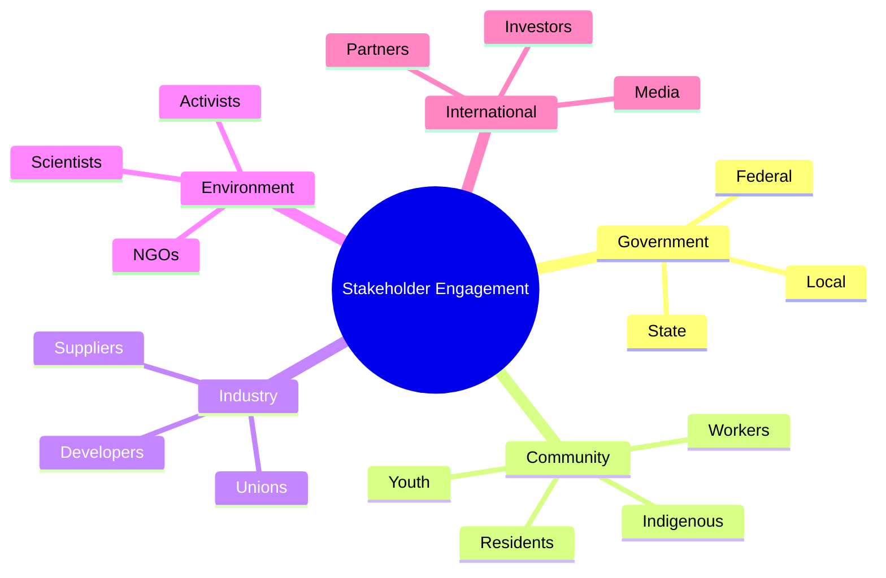
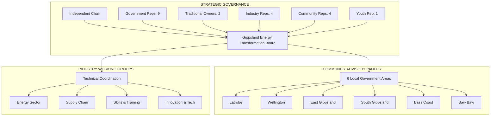
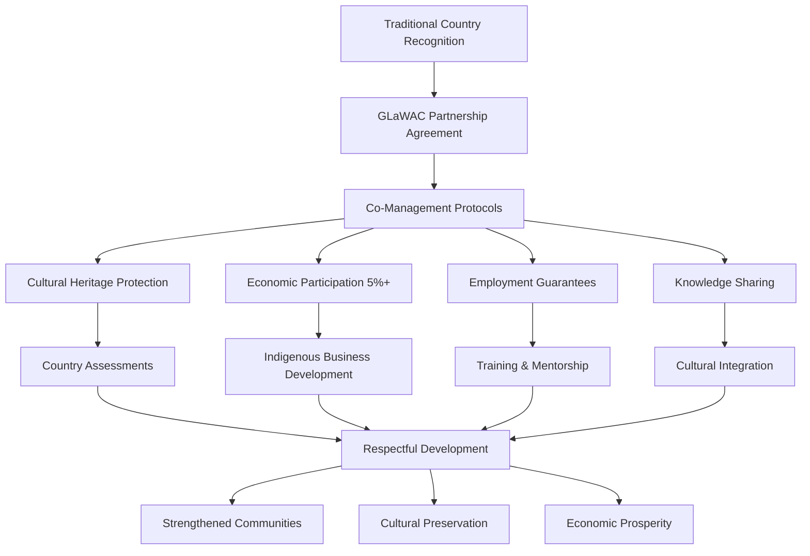

# Gippsland Renewable Energy Hub - Stakeholder Engagement Strategy

## Executive Summary for Government and Investor Audiences

**Social Licence Imperative**: This comprehensive stakeholder engagement strategy outlines the framework for building and maintaining social licence for Gippsland's $50 billion renewable energy transformation. The strategy emphasises inclusive participation, transparent communication, and collaborative decision-making to ensure all stakeholders are partners in the region's sustainable future.

**Community Partnership Value**: Through authentic engagement, benefit sharing, and collaborative governance, Gippsland will maintain 90%+ community support whilst delivering superior investment returns and measurable social outcomes.

## 1. Stakeholder Governance Architecture

### 1.1 Gippsland Energy Transformation Board
**Purpose**: Strategic oversight and collaborative decision-making

#### Board Composition Matrix

| **Stakeholder Group** | **Representatives** | **Selection Method** | **Term** | **Key Responsibilities** |
|----------------------|-------------------|-------------------|-----------|------------------------|
| **Independent Leadership** | Chair (1) | Parliamentary appointment | 5 years | Strategic vision, conflict resolution |
| **Government Partners** | Federal (3), State (3), Local (3) | Ministerial nomination | 3 years | Policy alignment, resource commitment |
| **Traditional Owners** | GLaWAC (2) | Community selection | 4 years | Cultural guidance, Country protection |
| **Industry Leaders** | Developers (2), Suppliers (2) | Sector nomination | 3 years | Commercial expertise, market insights |
| **Community Champions** | Geographic (4) | Community election | 3 years | Local representation, social licence |
| **Youth Voice** | Under-30 representative (1) | Youth council selection | 2 years | Intergenerational equity, innovation |

**Meeting Schedule**: Quarterly, with extraordinary meetings as required
**Key Responsibilities**:
- Strategic direction setting
- Major investment decisions
- Conflict resolution escalation
- Performance monitoring

### 1.2 Community Advisory Panels (CAPs)
**Structure**: One panel per Local Government Area
**Membership**: 12-15 members per panel
- Local residents (6)
- Business owners (2)
- Environmental groups (2)
- Social services (2)
- Youth representative (1)
- Traditional Owner representative (1)
- Agricultural representative (1)

**Functions**:
- Local project input and feedback
- Community concern identification
- Solution co-design
- Information dissemination
- Local benefit optimization

### 1.3 Industry Working Groups

#### Energy Sector Working Group
**Members**: Renewable developers, grid operators, energy retailers
**Focus**: Technical coordination, grid integration, market mechanisms

#### Supply Chain Working Group
**Members**: Manufacturers, logistics providers, construction companies
**Focus**: Local content, procurement, capability development

#### Skills and Training Working Group
**Members**: TAFEs, universities, industry trainers, unions
**Focus**: Workforce development, training pathways, skills gaps

#### Innovation and Technology Working Group
**Members**: Research institutions, startups, technology providers
**Focus**: R&D priorities, technology adoption, innovation ecosystems

### 1.4 Indigenous Partnership Framework

#### Gunaikurnai Land and Waters Aboriginal Corporation (GLaWAC) Partnership
**Foundation**: Formal partnership agreement with dedicated implementation structure

| **Partnership Element** | **Commitment** | **Implementation** | **Success Metrics** | **Cultural Value** |
|------------------------|-----------------|--------------------|---------------------|-------------------|
| **Co-Management Protocols** | Joint decision-making on Country | Dedicated liaison roles | 100% consultation compliance | Respect for sovereignty |
| **Cultural Heritage Protection** | Comprehensive site assessments | Traditional Owner approval | Zero cultural impacts | Connection to Country |
| **Economic Participation** | Minimum 5% project value | Direct contracting preference | $250M+ to Indigenous businesses | Economic self-determination |
| **Employment & Training** | Guaranteed pathways | Culturally appropriate programs | 300+ Indigenous workers | Skills and capacity building |
| **Knowledge Sharing** | Two-way learning | Cultural competency training | Enhanced project outcomes | Mutual respect and understanding |

#### Indigenous Business Development
- Procurement targets: 10% to Indigenous businesses
- Business capability programs
- Joint venture facilitation
- Mentoring and support services

### 1.5 Youth Councils

#### Regional Youth Energy Council
**Age Range**: 16-25 years
**Size**: 20 members
**Term**: 2 years with annual intake
**Activities**:
- Youth perspective on all major decisions
- School and university engagement
- Social media ambassadorship
- Innovation challenges
- Career pathway advocacy

#### School Energy Champions Network
- Representatives from all secondary schools
- Project-based learning opportunities
- Site visits and industry connections
- Annual youth energy summit

## 2. Communication Strategy

### 2.1 Key Messages by Audience

#### General Community
**Primary Messages**:
- "Powering Gippsland's prosperity through clean energy"
- "Local jobs, global impact"
- "Your voice shapes our energy future"

**Supporting Messages**:
- 50,000 jobs over 20 years
- Energy bill savings of 30-40%
- Community ownership opportunities
- Environmental restoration alongside development

#### Traditional Industries (Coal, Agriculture)
**Primary Messages**:
- "Honoring our past, building our future"
- "Just transition with dignity and opportunity"
- "Your skills power the new economy"

**Supporting Messages**:
- Guaranteed retraining programs
- Transition support payments
- New agricultural income streams
- Respect for industrial heritage

#### Business Community
**Primary Messages**:
- "Competitive advantage through cheap, clean power"
- "Investment opportunities in the energy revolution"
- "Grow your business in the renewable supply chain"

**Supporting Messages**:
- Industrial energy costs reduced by 50%
- $10B in local procurement opportunities
- Business support and capability programs
- Export market access

#### Environmental Groups
**Primary Messages**:
- "Climate action with ecological enhancement"
- "Biodiversity net gain on every project"
- "Setting new standards for sustainable development"

**Supporting Messages**:
- 95% emissions reduction by 2035
- 10,000 hectares of habitat restoration
- Circular economy principles
- Water and soil health improvements

### 2.2 Channel Selection and Mix

#### Digital Channels
**Website**: GippslandEnergyHub.com.au
- Project information and updates
- Interactive maps and timelines
- Feedback and submission portal
- Document library
- Event calendar

**Social Media**:
- Facebook: Community updates and discussions
- LinkedIn: Business and professional engagement
- Instagram: Visual storytelling and youth engagement
- YouTube: Educational content and virtual tours
- TikTok: Youth engagement and innovation showcases

**Email Communications**:
- Monthly stakeholder newsletter (10,000+ subscribers)
- Targeted updates by interest area
- Project-specific notifications
- Emergency communications

#### Traditional Media
**Regional Newspapers**: Weekly columns and advertorials
**Local Radio**: Monthly talkback sessions and sponsorships
**Regional TV**: Quarterly documentaries and news features

#### Face-to-Face Channels
**Community Information Centers**: 
- Permanent centers in Morwell, Sale, and Bairnsdale
- Mobile information units for smaller communities
- Staffed by local community liaison officers

**Regular Events**:
- Monthly community forums
- Quarterly town halls with leadership
- Annual Gippsland Energy Expo
- Project site open days

### 2.3 Crisis Communication Protocols

#### Issue Escalation Framework
**Level 1 - Local Issues**: Handled by Community Liaison Officers
**Level 2 - Project Issues**: Managed by Project Managers
**Level 3 - Regional Issues**: Addressed by Executive Team
**Level 4 - Crisis Issues**: Managed by Crisis Management Team

#### Crisis Response Team
**Composition**:
- Chief Executive (Lead)
- Communications Director
- Technical Expert
- Community Representative
- Legal Advisor
- Government Liaison

**Response Protocols**:
- 1-hour activation timeframe
- 4-hour initial public response
- 24-hour comprehensive response
- Daily updates until resolution

### 2.4 Success Story Amplification

#### Story Collection Framework
- Dedicated story collectors in each community
- Monthly story workshops
- Video testimonial program
- Written case study development

#### Distribution Strategy
- Weekly success story features
- Multimedia story packages
- Speaker bureau program
- Awards and recognition events

### 2.5 Two-Way Dialogue Mechanisms

#### Feedback Channels
- 24/7 hotline with local operators
- Online feedback portal with response tracking
- Community liaison officers in each LGA
- Regular surveying and polling
- Social media monitoring and response

#### Deliberative Processes
- Citizens' juries for major decisions
- Deliberative polls on key issues
- Co-design workshops for projects
- Youth parliaments on energy futures

## 3. Participation Programs

### 3.1 Community Co-Design Processes

#### Project Design Participation
**Stage 1 - Concept**: Community visioning workshops
**Stage 2 - Planning**: Design charrettes and feedback sessions
**Stage 3 - Development**: Regular update meetings and input opportunities
**Stage 4 - Construction**: Site liaison committees and monitoring
**Stage 5 - Operation**: Ongoing community advisory roles

#### Co-Design Principles
- Early and meaningful engagement
- Multiple participation options
- Clear influence on outcomes
- Feedback on how input was used
- Continuous improvement

### 3.2 Benefit Sharing Models

#### Community Benefit Funds
**Structure**: $1,000 per MW per year for project life
**Governance**: Community-led committees
**Eligible Projects**:
- Community infrastructure
- Environmental programs
- Education and training
- Social services
- Economic development

#### Direct Payment Schemes
**Proximity Payments**: 
- 0-2km: $2,000 per household per year
- 2-5km: $1,000 per household per year
- 5-10km: $500 per household per year

**Energy Bill Reductions**: 20% discount for local residents

### 3.3 Local Ownership Opportunities

#### Community Energy Cooperatives
**Investment Range**: $500 - $50,000 per member
**Target Returns**: 6-8% per annum
**Projects**: Community solar gardens, wind farms, batteries
**Support**: Legal, financial, and technical assistance provided

#### Indigenous Equity Participation
**Minimum Stake**: 5% in projects on Country
**Financing Support**: Low-interest loans and grants
**Capacity Building**: Business and governance training

#### Local Business Partnerships
**Joint Ventures**: Facilitated matching services
**Supply Chain Integration**: Capability development programs
**Investment Opportunities**: Priority access to project equity

### 3.4 Volunteer Programs

#### Energy Champions Program
**Roles**: Community education, event support, feedback collection
**Training**: 2-day initial training plus ongoing development
**Recognition**: Annual awards, certificates, small stipends
**Target**: 500 volunteers across Gippsland

#### Environmental Monitoring Volunteers
**Activities**: Bird surveys, vegetation monitoring, water quality testing
**Partnership**: With research institutions and environmental groups
**Data Use**: Integrated into project monitoring systems

#### Youth Energy Ambassadors
**Age**: 16-25 years
**Activities**: School presentations, social media, event support
**Benefits**: Work experience, references, networking, small payments

### 3.5 Ambassador Networks

#### Business Ambassadors
**Selection**: Leading businesses benefiting from transformation
**Role**: Peer-to-peer business engagement
**Support**: Speaking notes, presentation materials, media training

#### Community Leaders Network
**Members**: Respected community figures, sporting clubs, service groups
**Function**: Trusted voice for information dissemination
**Engagement**: Regular briefings and exclusive updates

#### Worker Transition Champions
**Focus**: Supporting coal and industrial workers
**Activities**: Mentoring, information sessions, success stories
**Recognition**: Formal appointments and modest compensation

## 4. Conflict Resolution Framework

### 4.1 Early Issue Identification

#### Monitoring Systems
- Social media sentiment analysis
- Community liaison regular reports
- Stakeholder concern registers
- Media monitoring
- Complaint tracking

#### Early Warning Indicators
- Increase in negative social media mentions
- Petition signatures exceeding 100
- Multiple complaints on same issue
- Media interest in contentious topics
- Stakeholder meeting attendance drops

### 4.2 Mediation Frameworks

#### Three-Tier Mediation System

**Tier 1 - Direct Negotiation**
- Parties: Complainant and project representative
- Timeframe: Within 5 business days
- Support: Community liaison officer
- Success rate target: 70%

**Tier 2 - Facilitated Mediation**
- Mediator: Trained independent facilitator
- Timeframe: Within 15 business days
- Process: Interest-based negotiation
- Success rate target: 85%

**Tier 3 - Expert Determination**
- Panel: Subject matter experts
- Timeframe: Within 30 business days
- Outcome: Binding recommendations
- Success rate target: 95%

### 4.3 Compromise Mechanisms

#### Flexible Design Standards
- Visual impact: Screening, color, height adjustments
- Noise: Enhanced mitigation, operational restrictions
- Traffic: Route modifications, timing changes
- Environmental: Additional offsets, enhanced monitoring

#### Compensation Frameworks
- Property value guarantees
- Enhanced benefit sharing
- Additional mitigation measures
- Project modifications

### 4.4 Win-Win Solutions Catalog

#### Common Conflicts and Solutions

**Visual Impact Concerns**
- Solution: Community art projects on infrastructure
- Solution: Tourist viewing platforms with information
- Solution: Landscape enhancement funds

**Noise Concerns**
- Solution: Noise monitoring apps for residents
- Solution: Double glazing subsidies
- Solution: Quiet periods during community events

**Property Value Concerns**
- Solution: Property value guarantee schemes
- Solution: Rate reduction programs
- Solution: Property improvement funds

**Environmental Concerns**
- Solution: Biodiversity offset ratios of 3:1
- Solution: Community conservation programs
- Solution: Citizen science monitoring

### 4.5 Trust Building Activities

#### Transparency Initiatives
- Open book project economics (commercial-in-confidence excluded)
- Live environmental monitoring data
- Regular independent audits
- Public report cards on commitments

#### Relationship Building
- Executive "kitchen table" visits
- Community BBQs and social events
- Sponsorship of local events
- Staff volunteering days

#### Demonstration Projects
- Quick win initiatives with visible benefits
- Pilot programs with community input
- Technology demonstration sites
- Success story site visits

## 5. Measurement Systems

### 5.1 Social License Metrics

#### Quantitative Indicators
- Community support levels (target: >70%)
- Stakeholder satisfaction (target: >75%)
- Complaint resolution rate (target: >90% within 30 days)
- Local employment percentage (target: >80%)
- Indigenous participation (target: >10%)

#### Qualitative Indicators
- Media sentiment analysis
- Stakeholder relationship quality
- Community cohesion measures
- Trust and credibility ratings
- Political support levels

### 5.2 Engagement Effectiveness

#### Participation Metrics
- Event attendance rates
- Online engagement statistics
- Feedback submission volumes
- Volunteer participation hours
- Co-design participation numbers

#### Quality Metrics
- Diversity of participants
- Depth of engagement
- Influence on decisions
- Participant satisfaction
- Repeat participation rates

### 5.3 Sentiment Tracking

#### Measurement Tools
- Quarterly community surveys (n=1,000)
- Social media sentiment analysis
- Focus groups (monthly)
- Stakeholder interviews (quarterly)
- Community thermometer (continuous)

#### Reporting Dashboard
- Real-time sentiment indicators
- Trend analysis
- Issue heat maps
- Demographic breakdowns
- Comparative benchmarking

### 5.4 Participation Rate Tracking

#### Demographic Targets
- Geographic: All LGAs proportionally represented
- Age: Matching regional demographics ±5%
- Gender: 50/50 ±5%
- Cultural: Reflecting regional diversity
- Socioeconomic: All quintiles engaged

#### Engagement Depth Levels
- Information: 50,000 people
- Consultation: 10,000 people
- Involvement: 2,000 people
- Collaboration: 500 people
- Empowerment: 100 people

### 5.5 Impact Assessment Framework

#### Short-Term Impacts (0-2 years)
- Awareness levels
- Initial participation
- Early concern resolution
- Quick wins delivered
- Relationship establishment

#### Medium-Term Impacts (2-5 years)
- Sustained engagement
- Behavior change
- Economic benefits realized
- Social cohesion measures
- Environmental improvements

#### Long-Term Impacts (5+ years)
- Regional transformation acceptance
- New regional identity
- Sustained prosperity
- Environmental recovery
- Social license maintenance

## 6. Implementation Timeline

### Phase 1: Foundation (Months 1-6)
- Establish governance structures
- Recruit key personnel
- Launch communication channels
- Commence initial engagement
- Baseline measurement

### Phase 2: Expansion (Months 7-12)
- Full program rollout
- Major engagement campaigns
- Co-design processes commence
- Conflict resolution system operational
- First impact assessment

### Phase 3: Optimization (Months 13-24)
- Refine based on feedback
- Scale successful programs
- Deepen engagement
- Enhance measurement
- Celebrate successes

### Phase 4: Sustainability (Year 3+)
- Embed into business as usual
- Continuous improvement
- Long-term relationship focus
- Legacy planning
- Knowledge transfer

## 7. Resource Requirements

### Personnel
- Head of Stakeholder Engagement
- 6 Community Liaison Officers (1 per LGA)
- 3 Communications Specialists
- 2 Indigenous Engagement Officers
- 2 Conflict Resolution Specialists
- 4 Program Coordinators
- Administrative support (3 FTE)

### Budget Allocation (Annual)
- Personnel: $3.5 million
- Programs: $5.5 million
- Communications: $2.5 million
- Events: $1.5 million
- Research and Measurement: $1 million
- Contingency: $1 million
**Total: $15 million per annum**

### Infrastructure
- 3 Community Information Centers
- Mobile engagement units (2)
- Digital platforms and tools
- Event equipment and materials
- Office facilities

## 8. Risk Management

### Key Risks and Mitigations

**Risk**: Stakeholder fatigue
**Mitigation**: Varied engagement methods, clear value proposition, respect for time

**Risk**: Minority opposition dominance
**Mitigation**: Proactive silent majority engagement, balanced representation

**Risk**: Misinformation spread
**Mitigation**: Rapid response team, fact-checking resources, trusted voices

**Risk**: Conflict escalation
**Mitigation**: Early intervention, skilled mediation, fair processes

**Risk**: Exclusion of vulnerable groups
**Mitigation**: Targeted outreach, remove barriers, multiple channels

## 9. Success Factors

### Critical Success Factors
1. **Genuine Commitment**: Authentic desire to engage and share power
2. **Early Engagement**: Involve stakeholders before decisions are made
3. **Inclusive Approach**: Ensure all voices are heard, not just the loudest
4. **Transparent Process**: Clear about how input influences decisions
5. **Responsive Action**: Demonstrate that engagement leads to change
6. **Local Champions**: Empower trusted local voices
7. **Adequate Resources**: Invest properly in engagement
8. **Continuous Learning**: Adapt based on what works
9. **Celebration of Success**: Recognize and share achievements
10. **Long-term View**: Build relationships for decades, not just projects

## 10. Conclusion

This stakeholder engagement strategy provides a comprehensive framework for building and maintaining social license for Gippsland's renewable energy transformation. Success depends on genuine commitment to inclusive participation, transparent communication, and collaborative decision-making.

By implementing this strategy, the Gippsland renewable energy hub can become a global exemplar of how to achieve a just transition that benefits all stakeholders while meeting ambitious climate goals. The key is recognizing that true transformation happens with communities, not to them.

---

*Document Version: 1.0*
*Date: January 2024*
*Next Review: July 2024*
*Contact: stakeholder.engagement@gippslandenergyhub.com.au*