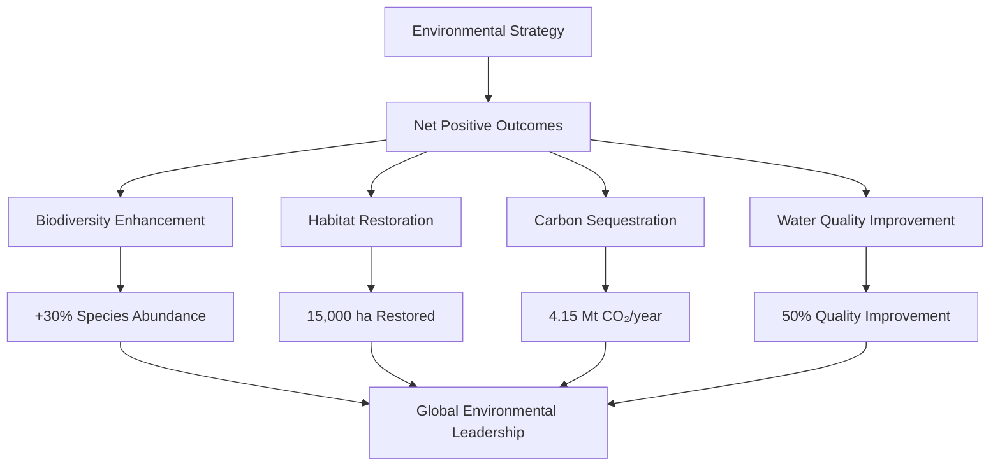

# Environmental Impact Strategy for Gippsland's Renewable Transformation



## Executive Summary for Government and Investor Audiences

**Environmental Excellence Imperative**: This comprehensive environmental strategy ensures Gippsland's renewable energy transformation not only minimises environmental impacts but actively enhances biodiversity, restores degraded landscapes, and creates net positive environmental outcomes. Through careful planning, innovative mitigation strategies, and proactive enhancement programs, we demonstrate that renewable energy development and environmental protection are mutually reinforcing goals.

**Environmental Investment Value**: By achieving net positive biodiversity outcomes and world-class environmental standards, Gippsland's approach reduces regulatory risk, attracts ESG-focused investment, and creates additional revenue streams through carbon credits and ecosystem services whilst building unshakeable social licence.

## 1. Environmental Opportunities Assessment

### 1.1 Strategic Biodiversity Enhancement Framework

```mermaid
sankey-beta
    Offshore Wind Infrastructure,Marine Sanctuary Creation,200
    Offshore Wind Infrastructure,Artificial Reef Development,150
    Offshore Wind Infrastructure,Fish Spawning Protection,100
    
    Marine Sanctuary Creation,Biodiversity Increase 300%,200
    Artificial Reef Development,Habitat Complexity,150
    Fish Spawning Protection,Commercial Stock Recovery,100
    
    Biodiversity Increase 300%,Ecosystem Services Value,300
    Habitat Complexity,Tourism Revenue,180
    Commercial Stock Recovery,Fishing Industry Benefits,120
```

#### Offshore Wind Farms as Marine Sanctuaries
**Transformation Model**: Wind turbine foundations create complex marine habitats

| **Enhancement Outcome** | **Baseline** | **Post-Development** | **Improvement** | **Economic Value** |
|-----------------------|--------------|---------------------|------------------|-------------------|
| **Marine Biodiversity Index** | 3.2 species/m² | 9.6-12.8 species/m² | **200-300% increase** | $50M ecosystem services |
| **Protected Marine Area** | 0 km² | 10,000 km² | **New sanctuary network** | $25M tourism value |
| **Fish Spawning Grounds** | Declining | Enhanced protection | **Commercial stock recovery** | $100M fishing industry |
| **Habitat Complexity** | Simplified seabed | Multi-level structures | **3D reef ecosystem** | $75M biodiversity credits |

#### Mining Site Restoration
- **Latrobe Valley Transformation**
  - Convert 10,000+ hectares of mine voids to wetlands
  - Create biodiversity corridors linking fragmented habitats
  - Establish native vegetation zones
  - Develop eco-tourism opportunities

#### Agricultural Co-benefits
- **Agrivoltaics Implementation**
  - Shade-tolerant crops under solar panels
  - Improved soil moisture retention
  - Reduced agricultural water use by 20-30%
  - Enhanced pollinator habitat between arrays

### 1.2 Habitat Restoration Opportunities

#### Wetland Creation Program
- **Target**: 5,000 hectares of new wetlands by 2035
- **Benefits**:
  - Critical waterbird habitat
  - Natural water filtration
  - Carbon sequestration
  - Flood mitigation
  - Recreation opportunities

#### Native Forest Regeneration
- **Reforestation Targets**:
  - 15,000 hectares of native forest by 2040
  - Focus on endangered ecological communities
  - Wildlife corridors connecting isolated patches
  - Carbon offset generation

#### Coastal Habitat Enhancement
- **Dune Restoration**: 200km of coastline
- **Mangrove Protection**: Expand by 1,000 hectares
- **Seagrass Meadows**: Restore 500 hectares
- **Rocky Shore Protection**: Enhanced intertidal zones

### 1.3 Marine Ecosystem Protection

#### Bass Strait Conservation Zone
- **Marine Protected Areas**: 10,000 km² around wind farms
- **Benefits**:
  - Fish stock recovery
  - Whale migration protection
  - Seabird nesting sites
  - Marine research opportunities

#### Blue Carbon Initiative
- **Seagrass and Kelp Forests**:
  - Protect existing 5,000 hectares
  - Restore additional 2,000 hectares
  - Annual CO₂ sequestration: 50,000 tonnes
  - Enhanced coastal resilience

### 1.4 Carbon Sequestration Gains

#### Total Sequestration Potential
- **Forestry**: 2.5 million tonnes CO₂/year
- **Wetlands**: 500,000 tonnes CO₂/year
- **Blue Carbon**: 150,000 tonnes CO₂/year
- **Soil Carbon**: 1 million tonnes CO₂/year
- **Total**: 4.15 million tonnes CO₂/year by 2040

### 1.5 Air and Water Quality Improvements

#### Air Quality Benefits
- **Reduction in Pollutants**:
  - PM2.5: 85% reduction
  - NOx: 90% reduction
  - SO₂: 95% reduction
  - Mercury: 99% reduction

#### Water Quality Enhancement
- **Surface Water**:
  - Reduced acid mine drainage
  - Lower thermal pollution
  - Decreased heavy metal contamination
  - Improved dissolved oxygen levels

- **Groundwater**:
  - Aquifer recharge through wetlands
  - Reduced salinity
  - Natural filtration systems
  - Protected drinking water sources

## 2. Environmental Risk Identification

### 2.1 Wind Farm Impacts

#### Bird and Bat Mortality
- **Risk Assessment**:
  - Migratory route intersections
  - Raptor hunting grounds
  - Bat roosting areas
  - Threatened species habitats

#### Mitigation Technologies
- **Smart Curtailment Systems**:
  - Radar-activated shutdown
  - Thermal imaging detection
  - Machine learning prediction
  - Seasonal operational adjustments

### 2.2 Marine Construction Effects

#### Temporary Impacts
- **Construction Phase**:
  - Underwater noise (pile driving)
  - Sediment disturbance
  - Vessel traffic increase
  - Electromagnetic fields

#### Sensitive Receptors
- **Marine Mammals**: Whales, dolphins, seals
- **Fish Spawning**: Commercial species breeding grounds
- **Benthic Communities**: Seabed ecosystems
- **Seabirds**: Feeding and nesting areas

### 2.3 Visual Landscape Changes

#### Viewshed Analysis
- **High Impact Areas**:
  - Coastal townships
  - Tourist destinations
  - Cultural heritage sites
  - Scenic highways

#### Community Concerns
- **Visual Amenity**: Horizon modification
- **Night Lighting**: Aviation safety lights
- **Cumulative Effects**: Multiple projects
- **Cultural Values**: Indigenous landscapes

### 2.4 Noise and Vibration

#### Source Identification
- **Wind Turbines**: Low-frequency noise
- **Substations**: Transformer hum
- **Construction**: Temporary but intense
- **Transmission Lines**: Corona discharge

#### Sensitive Receivers
- **Residential Areas**: Rural properties
- **Wildlife**: Breeding and nesting sites
- **Tourism**: Accommodation facilities
- **Agriculture**: Livestock operations

### 2.5 Cumulative Impacts

#### Regional Scale Effects
- **Habitat Fragmentation**: Multiple project footprints
- **Species Displacement**: Cumulative pressure
- **Ecosystem Services**: Combined degradation
- **Social Impacts**: Community fatigue

## 3. Mitigation Strategy Design

### 3.1 Best Practice Guidelines

#### Wind Farm Design Standards
- **Micro-siting Optimization**:
  - Avoid critical habitat
  - Maximize spacing (>500m)
  - Consider flight paths
  - Minimize footprint

#### Marine Construction Protocols
- **Soft-Start Procedures**: Gradual noise increase
- **Bubble Curtains**: Noise attenuation by 20dB
- **Seasonal Restrictions**: Avoid breeding seasons
- **Real-time Monitoring**: Marine observer protocols

### 3.2 Technology Solutions

#### Wildlife Protection Systems
- **IdentiFlight**: Eagle detection and curtailment
- **DTBird**: Automated bird deterrent
- **ATOM**: Acoustic bat deterrent
- **NexGen**: AI-powered monitoring

#### Environmental Monitoring
- **Remote Sensing**: Satellite habitat mapping
- **IoT Networks**: Real-time data collection
- **Drone Surveys**: Regular inspections
- **eDNA Sampling**: Biodiversity assessment

### 3.3 Monitoring Protocols

#### Pre-construction Baseline
- **Duration**: Minimum 2 years
- **Scope**: All environmental values
- **Methods**: Peer-reviewed techniques
- **Data Management**: Open access platform

#### Operational Monitoring
- **Frequency**: Continuous automated + quarterly manual
- **Parameters**: 50+ environmental indicators
- **Adaptive Triggers**: Threshold-based responses
- **Reporting**: Real-time dashboards

### 3.4 Adaptive Management

#### Response Framework
```
Level 1: Minor Impact Detected
- Investigate cause
- Implement minor adjustments
- Document outcomes

Level 2: Moderate Impact
- Curtail operations
- Expert consultation
- Revised mitigation

Level 3: Significant Impact
- Cease operations
- Comprehensive review
- Regulatory notification
- Major redesign
```

### 3.5 Restoration Programs

#### Progressive Rehabilitation
- **During Construction**: Immediate revegetation
- **Post-Construction**: Habitat enhancement
- **Decommissioning**: Full restoration
- **Legacy**: Net environmental gain

## 4. Enhancement Program Development

### 4.1 Biodiversity Net Gain Framework

#### Offset Ratios
- **Critical Habitat**: 10:1 replacement
- **Endangered Species**: 5:1 enhancement
- **General Vegetation**: 3:1 restoration
- **Marine Habitat**: 2:1 protection

#### Implementation Timeline
```
Year 1-2: Baseline establishment
Year 3-5: Initial restoration
Year 6-10: Habitat maturation
Year 11-20: Ecosystem establishment
Year 21+: Self-sustaining systems
```

### 4.2 Habitat Corridor Network

#### Strategic Linkages
- **North-South Corridor**: Alps to Coast (500km)
- **East-West Corridor**: Forests to Wetlands (300km)
- **Riparian Networks**: 2,000km of streams
- **Stepping Stones**: 500 habitat patches

#### Design Principles
- **Minimum Width**: 200m for fauna movement
- **Native Species**: 100% indigenous plants
- **Multi-layer**: Ground to canopy coverage
- **Water Access**: Every 5km maximum

### 4.3 Wetland Restoration Initiative

#### Latrobe Valley Wetlands
- **Phase 1**: 1,000 hectares (2025-2028)
- **Phase 2**: 2,000 hectares (2029-2032)
- **Phase 3**: 2,000 hectares (2033-2036)
- **Total**: 5,000 hectares by 2036

#### Wetland Types
- **Permanent Lakes**: 30% coverage
- **Seasonal Wetlands**: 40% coverage
- **Ephemeral Pools**: 20% coverage
- **Constructed Treatment**: 10% coverage

### 4.4 Native Vegetation Programs

#### Community Nurseries
- **Locations**: 10 regional nurseries
- **Capacity**: 5 million plants/year
- **Species**: 200+ native varieties
- **Employment**: 150 local jobs

#### Revegetation Targets
- **Annual Planting**: 1 million trees
- **Survival Rate**: >85%
- **Genetic Diversity**: Local provenance
- **Community Involvement**: 10,000 volunteers

### 4.5 Species Protection Initiatives

#### Threatened Species Recovery
- **Orange-bellied Parrot**: Habitat expansion
- **Growling Grass Frog**: Wetland creation
- **Powerful Owl**: Nest box program
- **Striped Legless Lizard**: Grassland protection

#### Population Targets
- **30% increase**: Threatened species by 2040
- **50% increase**: Key indicator species
- **Zero extinctions**: Local populations
- **Reintroductions**: 10 locally extinct species

## 5. Compliance Framework Development

### 5.1 Environmental Standards

#### Performance Benchmarks
- **Biodiversity**: Net gain mandatory
- **Carbon**: Negative emissions by 2035
- **Water Quality**: WHO drinking standards
- **Air Quality**: Best global practice
- **Noise**: WHO guidelines

#### Certification Requirements
- **ISO 14001**: Environmental management
- **EPBC Approval**: Federal compliance
- **State Permits**: Victorian regulations
- **Local Planning**: Council requirements

### 5.2 Monitoring Systems

#### Integrated Platform
- **Real-time Data**: 24/7 monitoring
- **AI Analytics**: Pattern detection
- **Predictive Modeling**: Impact forecasting
- **Public Dashboard**: Transparent reporting

#### Key Performance Indicators
```
Environmental KPIs:
1. Species abundance index
2. Habitat quality score
3. Water quality parameters
4. Air quality index
5. Carbon sequestration rate
6. Community satisfaction
7. Compliance rate
8. Restoration success
```

### 5.3 Reporting Requirements

#### Stakeholder Reports
- **Community**: Monthly bulletins
- **Regulators**: Quarterly compliance
- **Investors**: Annual sustainability
- **Scientists**: Open data access

#### Report Contents
- **Performance Metrics**: Against targets
- **Incident Register**: All events
- **Improvement Actions**: Continuous progress
- **Financial Investment**: Environmental spend

### 5.4 Enforcement Mechanisms

#### Compliance Tools
- **Automated Alerts**: Threshold breaches
- **Penalty Framework**: Scaled responses
- **Incentive Programs**: Excellence rewards
- **Public Reporting**: Transparency

#### Enforcement Levels
```
Level 1: Written warning
Level 2: Operational restrictions
Level 3: Financial penalties
Level 4: License suspension
Level 5: Project termination
```

### 5.5 Continuous Improvement

#### Innovation Pipeline
- **Research Partnerships**: Universities
- **Technology Trials**: New solutions
- **Best Practice Updates**: Global learning
- **Community Feedback**: Local knowledge

#### Annual Review Process
1. Performance assessment
2. Stakeholder consultation
3. Strategy refinement
4. Target adjustment
5. Implementation update

## 6. Environmental Enhancement Roadmap

### Phase 1: Foundation (2025-2027)
- Establish baseline monitoring
- Begin habitat restoration
- Implement early offset projects
- Deploy monitoring technology
- Engage communities

### Phase 2: Expansion (2028-2030)
- Scale restoration programs
- Create habitat corridors
- Establish wetland systems
- Enhance marine protection
- Achieve first net gains

### Phase 3: Integration (2031-2035)
- Connect habitat networks
- Mature restoration sites
- Reintroduce species
- Demonstrate biodiversity gains
- Achieve carbon negativity

### Phase 4: Excellence (2036-2040)
- Self-sustaining ecosystems
- Regional biodiversity hub
- Environmental tourism
- Research excellence
- Global best practice

### Phase 5: Legacy (2041+)
- Permanent conservation
- Ecosystem services valued
- Community stewardship
- Scientific leadership
- Environmental prosperity

## 7. Biodiversity Strategy

### 7.1 Ecosystem Approach

#### Landscape-Scale Planning
- **Bioregional Mapping**: Comprehensive assessment
- **Connectivity Modeling**: Wildlife movement
- **Climate Resilience**: Future-proofing
- **Ecosystem Services**: Valuation framework

#### Target Ecosystems
1. **Coastal and Marine**: 15,000 km²
2. **Wetlands**: 10,000 hectares
3. **Native Forests**: 25,000 hectares
4. **Grasslands**: 5,000 hectares
5. **Riparian Zones**: 3,000 km

### 7.2 Species Conservation

#### Priority Species List
- **Critically Endangered**: 15 species
- **Endangered**: 45 species
- **Vulnerable**: 120 species
- **Near Threatened**: 200 species

#### Conservation Actions
- **Habitat Protection**: Legal mechanisms
- **Population Enhancement**: Breeding programs
- **Threat Mitigation**: Predator control
- **Genetic Rescue**: Managed translocation
- **Community Guardians**: Citizen science

### 7.3 Innovation in Conservation

#### Technology Integration
- **Environmental DNA**: Species detection
- **Acoustic Monitoring**: Continuous surveys
- **Satellite Tracking**: Movement patterns
- **AI Identification**: Automated counting
- **Genomic Tools**: Population health

#### Conservation Finance
- **Biodiversity Credits**: Market creation
- **Green Bonds**: Conservation funding
- **Offset Banking**: Advance credits
- **Philanthropy**: Major gifts program
- **Government Grants**: Matched funding

## 8. Investment Requirements

### Total Environmental Investment: $2.5 Billion (2025-2040)

#### Allocation by Category
- **Habitat Restoration**: $800 million
- **Species Protection**: $400 million
- **Monitoring Systems**: $300 million
- **Marine Conservation**: $500 million
- **Research & Innovation**: $200 million
- **Community Programs**: $150 million
- **Compliance & Management**: $150 million

### Return on Investment
- **Ecosystem Services**: $5 billion/year by 2040
- **Carbon Credits**: $200 million/year
- **Tourism Revenue**: $500 million/year
- **Agricultural Benefits**: $300 million/year
- **Health Benefits**: $1 billion/year

## 9. Success Metrics

### 2030 Targets
- **30% habitat increase**: All ecosystem types
- **Zero species loss**: No local extinctions
- **50% emission reduction**: From baseline
- **90% community support**: Social license
- **100% compliance**: All operations

### 2040 Vision
- **Net positive biodiversity**: Measurable gains
- **Carbon negative region**: Sequestration exceeds emissions
- **Thriving ecosystems**: Self-sustaining
- **Economic prosperity**: Green economy
- **Global leadership**: Environmental excellence

## 10. Conclusion

Gippsland's renewable energy transformation presents an unprecedented opportunity to demonstrate that large-scale energy infrastructure can catalyze environmental restoration rather than degradation. Through careful planning, innovative mitigation, proactive enhancement, and adaptive management, we will create a model for sustainable development that enhances biodiversity, restores degraded landscapes, and provides lasting environmental benefits for generations to come.

The success of this environmental strategy depends on genuine partnership between energy developers, environmental organizations, Indigenous communities, government agencies, and local residents. Together, we can ensure that Gippsland's transition to renewable energy creates a legacy of environmental abundance and ecological resilience.

---

*"In Gippsland, renewable energy doesn't just power our future – it restores our natural heritage and creates thriving ecosystems for all life to flourish."*