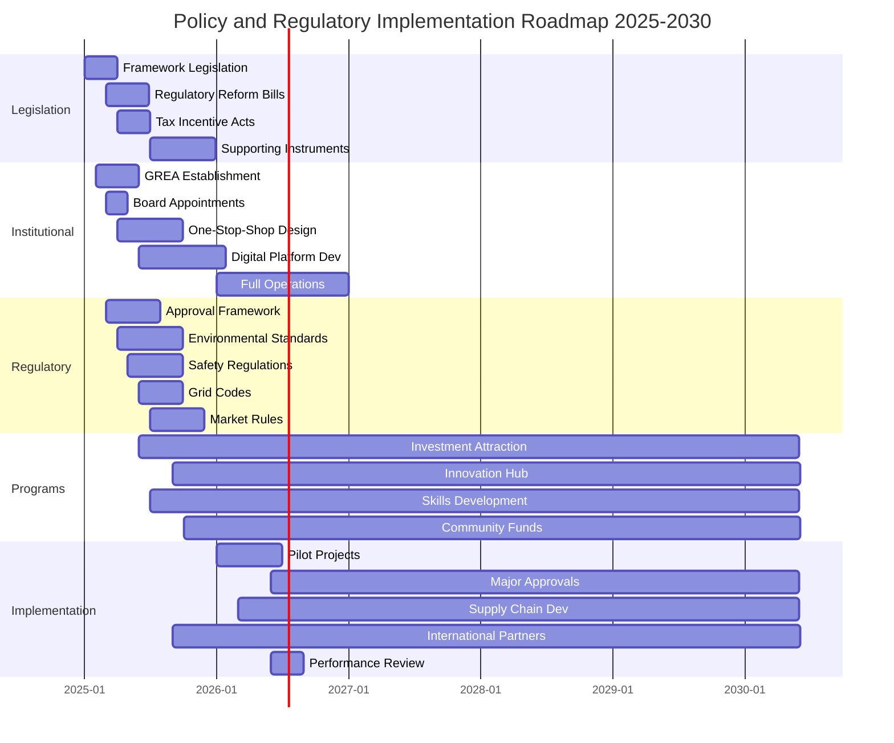
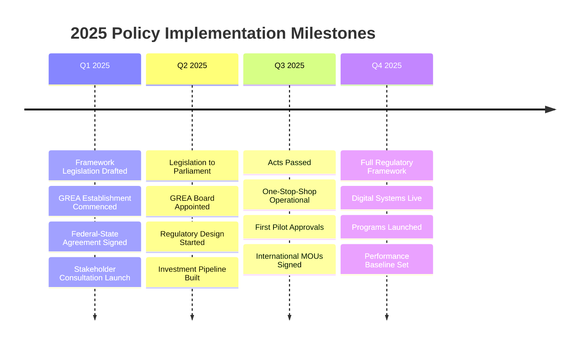

# Policy and Regulatory Implementation Timeline

## Visual Timeline: 2025-2030 Policy Rollout



## Key Policy Milestones by Quarter

### 2025 Timeline



### 2026-2030 Major Phases

```mermaid
graph LR
    A[2026: Foundation] --&gt; B[2027: Acceleration]
    B --&gt; C[2028: Scale]
    C --&gt; D[2029: Optimization]
    D --&gt; E[2030: Leadership]
    
    A --&gt; A1[GREA Operational]
    A --&gt; A2[First Projects]
    A --&gt; A3[Systems Testing]
    
    B --&gt; B1[Major Approvals]
    B --&gt; B2[Supply Chain]
    B --&gt; B3[$10B Investment]
    
    C --&gt; C1[Full Pipeline]
    C --&gt; C2[Mass Deployment]
    C --&gt; C3[$30B Investment]
    
    D --&gt; D1[Process Excellence]
    D --&gt; D2[Innovation Hub]
    D --&gt; D3[$50B Investment]
    
    E --&gt; E1[Global Best Practice]
    E --&gt; E2[Model Export]
    E --&gt; E3[$70B Achieved]
```

## Regulatory Reform Pathways

### Federal-State-Local Integration

```mermaid
graph TB
    F[Federal Government] --&gt; F1[Climate Policy]
    F --&gt; F2[CEFC/ARENA Funding]
    F --&gt; F3[EPBC Reform]
    F --&gt; F4[Tax Incentives]
    
    S[State Government] --&gt; S1[REZ Declaration]
    S --&gt; S2[Planning Reform]
    S --&gt; S3[Grid Investment]
    S --&gt; S4[Just Transition]
    
    L[Local Government] --&gt; L1[Zoning Changes]
    L --&gt; L2[Permit Process]
    L --&gt; L3[Infrastructure]
    L --&gt; L4[Community Plans]
    
    F1 & S1 & L1 --&gt; G[Gippsland Renewable Energy Authority]
    F2 & S2 & L2 --&gt; G
    F3 & S3 & L3 --&gt; G
    F4 & S4 & L4 --&gt; G
    
    G --&gt; O[One-Stop-Shop]
    G --&gt; I[Investment Gateway]
    G --&gt; C[Community Interface]
```

## Investment Incentive Timeline

### Incentive Program Rollout

```mermaid
graph LR
    subgraph "2025"
        A1[Tax Framework Design]
        A2[Grant Program Setup]
        A3[CfD Design]
    end
    
    subgraph "2026"
        B1[Accelerated Depreciation Live]
        B2[First Grants Awarded]
        B3[CfD Round 1]
    end
    
    subgraph "2027"
        C1[Production Tax Credits]
        C2[Scale-up Grants]
        C3[Green Bonds Issue]
    end
    
    subgraph "2028-2030"
        D1[Full Incentive Stack]
        D2[Innovation Programs]
        D3[Export Support]
    end
    
    A1 --&gt; B1 --&gt; C1 --&gt; D1
    A2 --&gt; B2 --&gt; C2 --&gt; D2
    A3 --&gt; B3 --&gt; C3 --&gt; D3
```

## Approval Process Evolution

### Current vs Future State

```mermaid
graph TB
    subgraph "Current State (24+ months)"
        CS1[Federal EPBC: 6-12 months]
        CS2[State Planning: 6-9 months]
        CS3[Local Permits: 3-6 months]
        CS4[Grid Connection: 6-12 months]
        CS5[Other Approvals: 3-6 months]
        
        CS1 --&gt; CS2 --&gt; CS3 --&gt; CS4 --&gt; CS5
    end
    
    subgraph "Future State (12 months max)"
        FS[One-Stop-Shop]
        FS --&gt; P1[Concurrent Assessment]
        FS --&gt; P2[Digital Lodgment]
        FS --&gt; P3[Pre-Approvals]
        FS --&gt; P4[Risk-Based Tiers]
        
        P1 & P2 & P3 & P4 --&gt; R[Integrated Approval]
    end
    
    CS5 -.-&gt; |Transform| FS
```

## Governance Implementation Schedule

```mermaid
graph TD
    subgraph "Q1-Q2 2025"
        A[Legislation] --&gt; B[GREA Charter]
        B --&gt; C[Board Recruitment]
        C --&gt; D[CEO Appointment]
    end
    
    subgraph "Q3-Q4 2025"
        D --&gt; E[Executive Team]
        E --&gt; F[Advisory Bodies]
        F --&gt; G[Operating Systems]
        G --&gt; H[First Operations]
    end
    
    subgraph "2026"
        H --&gt; I[Full Operations]
        I --&gt; J[Performance Review]
        J --&gt; K[System Refinement]
        K --&gt; L[Scale Operations]
    end
    
    subgraph "2027+"
        L --&gt; M[Excellence]
        M --&gt; N[Global Leadership]
    end
```

## Risk Management Implementation

```mermaid
flowchart LR
    subgraph "Risk Identification"
        R1[Political]
        R2[Market]
        R3[Technical]
        R4[Social]
        R5[Environmental]
    end
    
    subgraph "Mitigation Design"
        M1[Bipartisan Lock]
        M2[Investment Security]
        M3[Standards Framework]
        M4[Community Benefits]
        M5[Net Positive Requirements]
    end
    
    subgraph "Implementation"
        I1[Agreements]
        I2[Instruments]
        I3[Regulations]
        I4[Programs]
        I5[Monitoring]
    end
    
    R1 --&gt; M1 --&gt; I1
    R2 --&gt; M2 --&gt; I2
    R3 --&gt; M3 --&gt; I3
    R4 --&gt; M4 --&gt; I4
    R5 --&gt; M5 --&gt; I5
    
    I1 & I2 & I3 & I4 & I5 --&gt; S[Secure Framework]
```

## Performance Monitoring Dashboard Design

```mermaid
graph TB
    subgraph "Data Collection Layer"
        D1[Project Database]
        D2[Financial Systems]
        D3[Employment Data]
        D4[Environmental Sensors]
        D5[Community Feedback]
    end
    
    subgraph "Analytics Layer"
        A1[KPI Processing]
        A2[Trend Analysis]
        A3[Predictive Models]
        A4[Benchmarking]
    end
    
    subgraph "Presentation Layer"
        P1[Public Dashboard]
        P2[Executive Dashboard]
        P3[Detailed Reports]
        P4[API Access]
    end
    
    D1 & D2 & D3 & D4 & D5 --&gt; A1 & A2 & A3 & A4
    A1 & A2 & A3 & A4 --&gt; P1 & P2 & P3 & P4
```

## Critical Path Dependencies

```mermaid
graph TD
    CP1[Political Agreement] --&gt;|Required for| CP2[Legislation]
    CP2 --&gt;|Enables| CP3[GREA Establishment]
    CP3 --&gt;|Delivers| CP4[Regulatory Framework]
    CP4 --&gt;|Allows| CP5[Project Approvals]
    CP5 --&gt;|Triggers| CP6[Investment Flow]
    CP6 --&gt;|Creates| CP7[Economic Activity]
    CP7 --&gt;|Generates| CP8[Community Benefits]
    
    style CP1 fill:#ff6b6b
    style CP2 fill:#ff6b6b
    style CP3 fill:#ffd93d
    style CP4 fill:#ffd93d
    style CP5 fill:#6bcf7f
    style CP6 fill:#6bcf7f
    style CP7 fill:#4ecdc4
    style CP8 fill:#4ecdc4
```

## Success Metrics Tracking

```mermaid
graph LR
    subgraph "Input Metrics"
        I1[Policy Changes]
        I2[Process Time]
        I3[Resources]
    end
    
    subgraph "Output Metrics"
        O1[Approvals Granted]
        O2[Investment Secured]
        O3[Jobs Created]
    end
    
    subgraph "Outcome Metrics"
        R1[MW Deployed]
        R2[Emissions Reduced]
        R3[Economic Growth]
    end
    
    subgraph "Impact Metrics"
        M1[Global Ranking]
        M2[Community Prosperity]
        M3[Environmental Health]
    end
    
    I1 & I2 & I3 --&gt; O1 & O2 & O3
    O1 & O2 & O3 --&gt; R1 & R2 & R3
    R1 & R2 & R3 --&gt; M1 & M2 & M3
```

---

*This visual timeline complements the comprehensive policy and regulatory framework document*