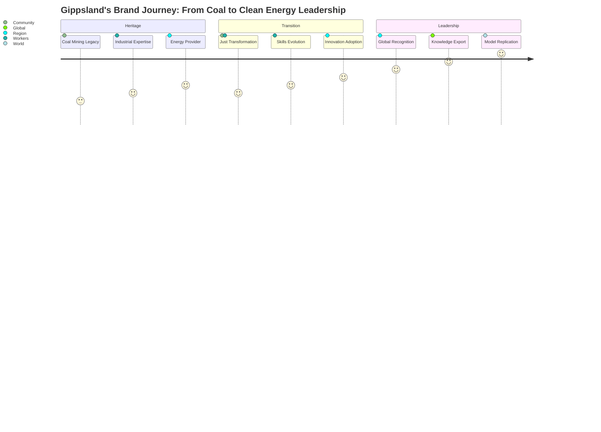
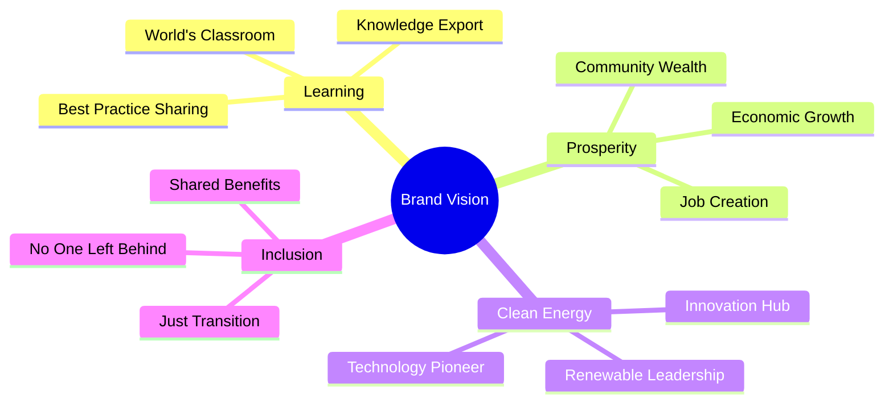
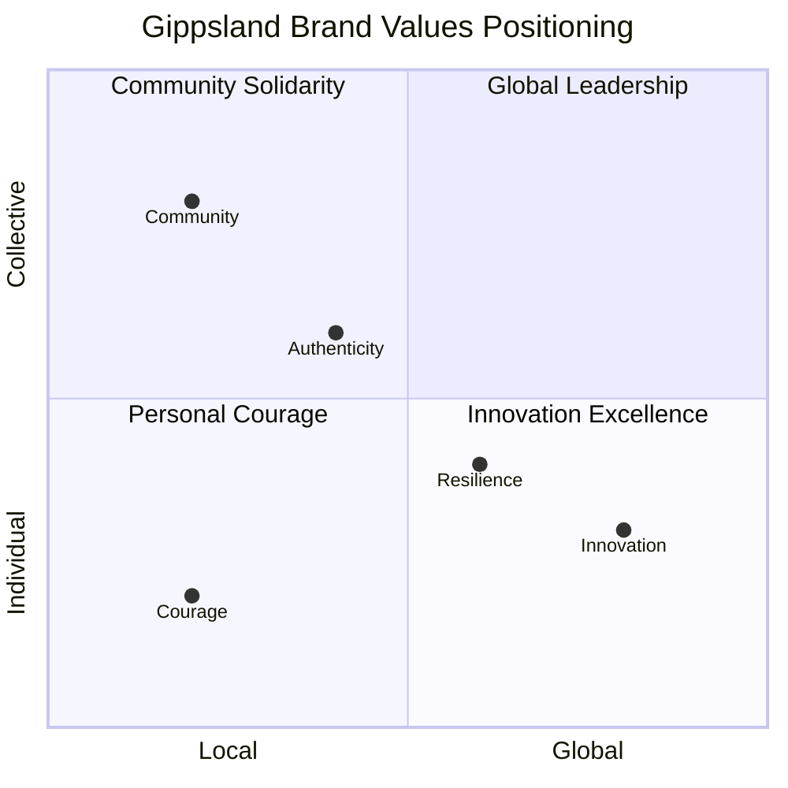

# The Gippsland Story: Brand Narrative and Positioning Strategy

## Executive Summary for Government and Investor Audiences

**Brand Transformation Imperative**: This brand narrative strategy transforms Gippsland's renewable energy transition into a powerful global story of hope, innovation, and community resilience. By positioning Gippsland as "The World's Clean Energy Classroom," we create a narrative that captures hearts and minds globally whilst building deep local pride. Our strategy leverages the authentic story of transformation from coal heartland to renewable powerhouse, making Gippsland the global symbol of successful energy transition.

**Global Positioning Value**: Through authentic storytelling and strategic communications, Gippsland will achieve top-of-mind awareness amongst international investors, policymakers, and communities, driving investment attraction, knowledge export revenue, and transformational tourism whilst building unshakeable local pride and social licence.

### Brand Vision Framework

**"Where the world learns that clean energy creates prosperity for all."**

### Core Narrative Architecture

**Transformation Story**: From the coal mines that powered a nation's growth to the wind farms that will power the world's future, Gippsland writes the playbook for how communities transform challenge into opportunity, ensuring no one is left behind in humanity's most important transition.

**Authentic Promise**: Every element of Gippsland's story is grounded in real outcomes, measurable results, and lived experiences – creating unassailable credibility for global audiences seeking proven pathways to successful energy transition.

---

## 1. Brand Foundation

### 1.1 Brand Essence

**"Transformation with Purpose"**

At the heart of Gippsland's brand is the belief that true transformation happens when communities lead, innovation follows, and prosperity is shared by all.

### 1.2 Core Brand Values Matrix

#### Brand Values Architecture

| **Core Value** | **Definition** | **Manifestation** | **Stakeholder Resonance** | **Measurement** |
|---------------|----------------|-------------------|---------------------------|------------------|
| **Courage** | The bravery to transform entire regional identity | Leading uncertain pathways, advocating for community and planet | Workers, communities facing change | Transformation milestones achieved |
| **Community** | No one left behind, everyone moves forward | Local wisdom guides global solutions, shared prosperity priority | Residents, families, local businesses | Community support metrics 90%+ |
| **Innovation** | Pioneering solutions that work in real world | Practical innovation with proven results, open knowledge sharing | Investors, technology partners, researchers | Patents, commercialisation, technology export |
| **Authenticity** | Honest about heritage, transparent about journey | Real stories from real people, genuine outcomes | Media, international audiences, critics | Third-party validation, independent verification |
| **Resilience** | Turning adversity into competitive advantage | Building stronger through transition, sustainable prosperity creation | Government, investors, global observers | Economic indicators, employment data, longevity |

### 1.3 Brand Positioning Statement

**For** global leaders, investors, and communities facing energy transition  
**Who** need proven pathways to successful transformation  
**Gippsland** is the renewable energy region  
**That** demonstrates how to transform industrial heritage into clean energy leadership  
**Because** we've done it first, done it right, and done it together  
**Unlike** other renewable regions that start fresh  
**We** prove that every community can thrive in the clean energy future

### 1.4 Brand Personality

#### Primary Traits
- **Pioneer**: Leading the way with courage and conviction
- **Teacher**: Openly sharing knowledge and experience
- **Guardian**: Protecting community and environment
- **Builder**: Creating tangible solutions that last
- **Optimist**: Believing in a better future for all

#### Voice Characteristics
- Confident without arrogance
- Warm and approachable
- Practical and grounded
- Inspiring yet realistic
- Inclusive and welcoming

### 1.5 Visual Identity Concepts

#### Color Palette
- **Gippsland Blue**: The Bass Strait winds (#0066CC)
- **Sunrise Gold**: New dawn of energy (#FFB700)
- **Coal Black**: Honoring our heritage (#1A1A1A)
- **Eucalyptus Green**: Natural environment (#2D5A2D)
- **Community Coral**: Human connection (#FF6B6B)

#### Design Principles
- Clean, modern aesthetic with industrial touches
- Photography featuring real people and places
- Infographics that simplify complex concepts
- Maps showing global connections
- Before/after transformations

#### Logo Concept
- Wind turbine blades forming a sunrise
- Subtly incorporates coal mine wheel shape
- Suggests movement and transformation
- Works globally while feeling local

---

## 2. The Gippsland Narrative Arc

### 2.1 Origin Story: From Black Gold to Blue Sky

**Chapter 1: The Foundation (1920s-2000s)**
- For nearly a century, Gippsland's coal powered Victoria's growth
- Generations of families built lives around the mines
- A community defined by hard work, innovation, and reliability
- The pride of keeping the lights on for millions

**Chapter 2: The Turning Point (2010s)**
- Climate science demanded change
- Coal plants began closing
- Communities faced uncertain futures
- A choice: fade away or transform

**Chapter 3: The Decision (2017-2020)**
- Community chose transformation over resignation
- Workers became advocates for transition
- Local leaders stepped up with vision
- The world's first worker-led transition began

**Chapter 4: The Transformation (2020-2025)**
- Offshore wind projects announced
- Retraining programs launched
- Innovation hubs established
- Global attention focused on Gippsland

**Chapter 5: The New Dawn (2025-2030)**
- 10+ GW renewable capacity online
- 15,000 new clean energy jobs
- Communities thriving like never before
- The world coming to learn

### 2.2 Hero's Journey Framework

#### The Heroes: Gippsland's People
- **Coal Workers**: From powering the past to building the future
- **Community Leaders**: Ordinary people doing extraordinary things
- **Young Innovators**: The next generation claiming their future
- **Local Businesses**: Adapting and thriving through change

#### The Quest
Transform a coal-dependent region into a renewable energy powerhouse while ensuring every community member benefits.

#### The Challenges
- Economic uncertainty
- Skills transformation
- Infrastructure adaptation
- Community skepticism
- Global competition

#### The Mentors
- International renewable experts
- Government partners
- Educational institutions
- Environmental advocates
- Union leaders

#### The Transformation
- Workers retrain as wind technicians
- Towns reinvent as innovation hubs
- Ports adapt for offshore wind
- Communities unite around shared vision

#### The Return with Wisdom
- Gippsland shares its playbook globally
- Hosts international delegations
- Mentors other transitioning regions
- Proves just transition is possible

### 2.3 Community Stories Collection

#### "From Coal Face to Wind Farm"
*Michael's Story*: 30 years underground, now maintaining offshore turbines. "Same skills, cleaner air, better future for my kids."

#### "The Town That Refused to Die"
*Morwell's Transformation*: From coal town to innovation hub. Population growing, young families returning, hope restored.

#### "Three Generations of Energy"
*The Thompson Family*: Grandfather in coal, father in transition, daughter in renewables. "Energy is in our blood, just cleaner now."

#### "The Business That Pivoted"
*Gippsland Engineering*: From mining equipment to wind turbine components. More jobs than ever before.

#### "The Student Who Stayed"
*Sarah's Choice*: Engineering graduate who chose Gippsland over Melbourne. "This is where the future is being built."

### 2.4 Future Vision Storytelling

#### 2030: A Day in Gippsland
- Morning: Sunrise over Bass Strait wind farms
- Commute: Workers heading to hydrogen plants
- Schools: Children learning in energy-positive buildings
- Afternoon: International delegation touring facilities
- Evening: Families gathering in thriving town centers
- Night: Lights powered by clean energy

#### 2040: Global Leadership
- Gippsland expertise deployed worldwide
- Sister city relationships on every continent
- Annual Global Energy Transition Summit
- University of Gippsland: premier renewable institution
- Tourism celebrating transformation story

---

## 3. Messaging Architecture

### 3.1 Core Messages

#### Primary Message
"Gippsland proves that communities can transform from fossil fuels to clean energy while creating more jobs, stronger economies, and better lives for all."

#### Supporting Messages

**Economic Prosperity**
"Where coal once employed hundreds, renewables now employ thousands, with higher wages and cleaner conditions."

**Just Transition**
"No worker left behind, no community forgotten. Everyone has a place in Gippsland's clean energy future."

**Global Leadership**
"The world comes to Gippsland to learn how energy transition really works."

**Innovation Hub**
"From offshore wind to green hydrogen, Gippsland pioneers the technologies powering tomorrow."

**Environmental Restoration**
"Healing the land while powering the future. Gippsland shows industry and nature can thrive together."

### 3.2 Audience-Specific Narratives

#### For Global Investors
**"Gippsland: Where Returns Meet Responsibility"**
- Proven project delivery capability
- Skilled workforce ready to deploy
- Government support and community backing
- Gateway to Asia-Pacific markets
- ESG leadership opportunity

*Key Proof Points*:
- $40-50B investment pipeline
- 11 offshore wind licenses granted
- 500kV transmission infrastructure
- Established supply chains
- Pro-business environment

#### For International Governments
**"Learn from Gippsland's Proven Playbook"**
- Real-world transition model
- Policy frameworks that work
- Community engagement strategies
- Workforce development programs
- Economic transformation metrics

*Key Proof Points*:
- 100% worker transition rate
- Community approval ratings
- Economic growth metrics
- Emissions reduction data
- Replicable frameworks

#### For Technology Partners
**"Gippsland: Your Living Laboratory"**
- Real-world testing environment
- Eager early adopter community
- Integrated energy ecosystem
- Supportive regulatory framework
- Scale-up opportunities

*Key Proof Points*:
- Offshore wind innovation
- Green hydrogen projects
- Grid integration solutions
- Energy storage deployment
- Research partnerships

#### For Local Communities
**"Your Gippsland, Your Future"**
- More jobs than ever before
- Children can stay and thrive
- Towns growing again
- Pride in global leadership
- Cleaner, healthier environment

*Key Proof Points*:
- Local employment data
- Youth retention rates
- Town revitalization projects
- Health improvements
- Community ownership models

#### For Workers and Unions
**"Your Skills, Your Security, Your Future"**
- Every coal job replaced with clean energy opportunity
- Higher wages in renewable sector
- Comprehensive retraining programs
- Union-negotiated transitions
- Pension security guaranteed

*Key Proof Points*:
- Job placement rates
- Wage comparisons
- Training program success
- Union agreements
- Career pathway maps

#### For Environmental Advocates
**"Gippsland: Where Climate Action Means Community Action"**
- Fastest decarbonization in Australia
- Biodiversity restoration included
- Community-owned renewable projects
- Indigenous partnership models
- Circular economy principles

*Key Proof Points*:
- Emissions reduction timeline
- Habitat restoration hectares
- Community energy ownership
- Indigenous employment
- Waste reduction metrics

### 3.3 Counter-Narratives

#### Addressing: "Renewables Kill Coal Jobs"
**Reality**: "Renewables in Gippsland created 2 jobs for every 1 coal job lost, with better conditions and future security."

#### Addressing: "Transition Is Too Expensive"
**Reality**: "Gippsland's transition attracted $40B in private investment, creating more tax revenue and economic activity than coal ever did."

#### Addressing: "Communities Will Be Ghost Towns"
**Reality**: "Gippsland's population is growing for the first time in decades, with young families returning for clean energy careers."

#### Addressing: "Renewables Are Unreliable"
**Reality**: "Gippsland's integrated renewable system delivers more reliable power than aging coal plants, with battery storage ensuring 24/7 supply."

#### Addressing: "It's Just Greenwashing"
**Reality**: "Visit Gippsland. See the wind farms, meet the workers, check the data. This transformation is real, measurable, and replicable."

### 3.4 Call to Action Framework

#### For Investors
"Partner with Gippsland. Profit with Purpose."
→ Schedule investment tour
→ Review project pipeline
→ Meet local partners

#### For Governments
"Learn from Gippsland. Lead your transition."
→ Book study delegation
→ Access transition playbook
→ Establish sister city partnership

#### For Workers
"Build your future in Gippsland."
→ Explore training programs
→ View job opportunities
→ Connect with unions

#### For Communities
"Join the Gippsland transformation."
→ Attend community forums
→ Invest in community energy
→ Share your story

#### For Media
"Tell the Gippsland story."
→ Access media resources
→ Schedule interviews
→ Visit transformation sites

---

## 4. Brand Experience Design

### 4.1 Gippsland Energy Discovery Center

#### Concept: "From Coal to Clean"

**Physical Journey**
1. **Heritage Hall**: Honor coal mining history
2. **Transition Theater**: Immersive transformation story
3. **Innovation Labs**: Hands-on renewable technology
4. **Future Vista**: View real wind farms and solar arrays
5. **Community Gallery**: Local stories and artifacts

**Digital Integration**
- AR experiences showing landscape transformation
- VR offshore wind turbine climb
- Real-time energy generation displays
- Global impact visualization
- Interactive career pathways

**Visitor Outcomes**
- Understand the full transformation story
- Feel emotional connection to community
- Gain practical transition knowledge
- Inspired to support/replicate
- Become Gippsland ambassadors

### 4.2 Digital Experience Strategy

#### Website: GippslandEnergy.com
**Structure**
- Hero story video (2 min)
- Interactive transformation timeline
- Live energy generation dashboard
- Community stories portal
- Investment opportunity hub
- Learning resources library
- Virtual tour capabilities

**Key Features**
- Multi-language support
- Accessibility compliant
- Mobile-first design
- SEO optimized
- Social sharing tools
- Newsletter integration
- Event calendar

#### Mobile App: "Gippsland Energy Trail"
- Self-guided tour routes
- AR at key locations
- Achievement badges
- Story collection
- Social features
- Educational games
- Carbon calculator

#### Social Media Strategy
**Platforms**
- LinkedIn: B2B engagement
- Instagram: Visual storytelling
- YouTube: Documentary content
- Twitter/X: News and updates
- TikTok: Youth engagement
- WeChat: Asian market

**Content Pillars**
- Transformation Tuesday (#GippslandTransforms)
- Worker Wednesday (career stories)
- Technology Thursday (innovation showcase)
- Future Friday (vision content)
- Community weekends

### 4.3 Community Touchpoint Design

#### Town Centers
**"Energy Future Hubs"**
- Information centers in each town
- Community meeting spaces
- Training facility access
- Local story exhibitions
- Youth engagement zones

#### School Programs
**"Generation Clean"**
- Curriculum integration
- Site visits program
- Student ambassador network
- Career pathway presentations
- Science fair sponsorship

#### Community Events
**Monthly**
- Transformation Tours
- Community Energy Cafes
- Innovation Showcases
- Cultural celebrations

**Annual**
- Gippsland Energy Festival
- Global Transition Summit
- Community Achievement Awards
- Youth Innovation Challenge

### 4.4 International Showcase Design

#### Delegation Experience Program
**3-Day Intensive**

*Day 1: Understanding the Past*
- Coal mine heritage tour
- Worker transition stories
- Community impact sessions
- Evening: Traditional dinner with families

*Day 2: Experiencing the Present*
- Offshore wind vessel tour
- Training facility visits
- Innovation hub demonstrations
- Evening: Stakeholder roundtable

*Day 3: Planning the Future*
- Policy framework workshops
- Investment opportunity sessions
- Partnership development
- Departure: Implementation toolkit

#### Global Forums Presence

**Tier 1 Events** (Physical Presence)
- COP Climate Summits
- Global Wind Summit
- World Economic Forum
- Clean Energy Ministerial
- International Energy Agency

**Showcase Elements**
- Gippsland Pavilion design
- VR experience stations
- Community ambassador speakers
- Live energy dashboard
- Partnership meeting spaces

**Takeaways**
- Transition playbook
- Economic modeling tools
- Policy frameworks
- Contact database
- Follow-up program

### 4.5 Media Engagement Experience

#### Press Center Design
**Physical**
- Dedicated media facility
- Broadcast capabilities
- Interview settings
- B-roll library access

**Digital**
- 24/7 media portal
- Downloadable assets
- Expert database
- Story pitch calendar
- Real-time data access

#### Media Programs
**Journalist Immersion**
- 5-day deep dive program
- Exclusive access opportunities
- Local family homestays
- Expert interview schedule
- Story development support

**Documentary Support**
- Location scouting assistance
- Community connections
- Historical footage access
- Production incentives
- Distribution partnerships

---

## 5. Amplification Strategy

### 5.1 Global PR Campaign

#### Campaign: "The Gippsland Model"

**Phase 1: Awareness (Months 1-6)**
- Launch flagship documentary
- Major media exclusive stories
- Thought leadership articles
- Academic paper series
- Social media activation

**Phase 2: Engagement (Months 7-12)**
- Global roadshow launch
- Virtual summit series
- Ambassador program
- Media partnerships
- Influencer collaborations

**Phase 3: Adoption (Months 13-24)**
- Sister city programs
- Policy toolkit release
- Investment showcases
- Replication support
- Success celebrations

#### Media Relations Strategy

**Tier 1 Media Targets**
- The Economist
- Financial Times
- Bloomberg
- Reuters
- Guardian

**Story Angles**
- Economic transformation data
- Worker success stories
- Technology innovations
- Community resilience
- Investment opportunities

**Media Assets**
- Press kit (multilingual)
- Image/video library
- Infographic suite
- Expert spokesperson bios
- Fact sheet database

### 5.2 Social Media Amplification

#### Content Strategy

**Hero Content** (Monthly)
- Mini-documentaries
- Virtual tours
- Major announcements
- Celebrity visits
- Award wins

**Hub Content** (Weekly)
- Worker stories
- Technology updates
- Community events
- Progress metrics
- Partner features

**Hygiene Content** (Daily)
- Energy generation stats
- Photo of the day
- Quick facts
- Community posts
- News shares

#### Influencer Strategy

**Macro-Influencers**
- Climate activists
- Energy experts
- Business leaders
- Celebrities
- Politicians

**Micro-Influencers**
- Local champions
- Young professionals
- Technical experts
- Community leaders
- International students

**Engagement Tactics**
- Exclusive tours
- Co-created content
- Speaking opportunities
- Brand ambassadorships
- Collaborative campaigns

### 5.3 Awards and Recognition Strategy

#### Target Awards

**Global Energy**
- Global Energy Awards
- Reuters Energy Transition
- BloombergNEF Pioneers
- World Energy Council
- UN Global Compact

**Sustainability**
- UN SDG Action Awards
- Global Green Awards
- Ashden Awards
- Climate Action Awards
- B Corp Best for World

**Economic Development**
- OECD Champion Mayors
- World Bank Development
- Regional Excellence
- Smart Cities Awards
- Innovation Districts

**Community**
- UNESCO Learning Cities
- Liveable Communities
- Social Impact Awards
- Community Excellence
- Place Brand Awards

#### Awards Strategy
- Strategic application calendar
- Compelling nomination packages
- Site visit preparation
- Media amplification plan
- Win celebration events

### 5.4 Global Forum Strategy

#### Speaking Platforms

**Tier 1 (Must Attend)**
- World Economic Forum
- COP Summits
- UN General Assembly
- Global Energy Summit
- OECD Forums

**Regional Priority**
- Asia Clean Energy Summit
- Pacific Energy Conference
- ASEAN Sustainability
- APEC meetings
- Australia-Asia Forums

**Sector Specific**
- Offshore Wind Global
- Green Hydrogen Summit
- Just Transition Conference
- Community Energy Congress
- Workforce Development Forum

#### Presentation Assets
- Keynote templates
- Video case studies
- Interactive demos
- VR experiences
- Pop-up exhibitions

### 5.5 Digital Marketing Amplification

#### SEO Strategy
**Target Keywords**
- "Just transition example"
- "Coal to renewable transformation"
- "Community energy transition"
- "Offshore wind development"
- "Green hydrogen hub"

**Content Strategy**
- Pillar pages for key topics
- Regular blog updates
- Case study library
- Resource downloads
- Video optimization

#### Paid Media Strategy
**Platforms**
- Google Ads (search/display)
- LinkedIn (B2B)
- Facebook/Instagram (B2C)
- YouTube (video)
- Programmatic display

**Campaign Types**
- Awareness building
- Event promotion
- Investment attraction
- Talent recruitment
- Tourism development

#### Email Marketing
**Segments**
- Investors
- Government officials
- Media contacts
- Community members
- International partners

**Automation Journeys**
- Welcome series
- Event follow-up
- Investment nurture
- Media engagement
- Community updates

---

## 6. Implementation Roadmap

### 6.1 Phase 1: Foundation (Months 1-3)
- Brand identity finalization
- Core asset development
- Team recruitment
- Platform development
- Soft launch preparation

### 6.2 Phase 2: Launch (Months 4-6)
- Global launch event
- Media blitz
- Digital activation
- Community rollout
- Partner engagement

### 6.3 Phase 3: Amplification (Months 7-12)
- Award submissions
- Forum appearances
- Content scaling
- Partnership growth
- Metric optimization

### 6.4 Phase 4: Expansion (Months 13-24)
- Global roadshow
- Sister cities
- Documentary release
- Summit hosting
- Legacy building

---

## 7. Success Metrics

### 7.1 Brand Awareness
- Global media mentions
- Social media reach
- Website traffic
- Search rankings
- Brand recognition studies

### 7.2 Engagement Metrics
- Delegation visits
- Partnership agreements
- Investment inquiries
- Media requests
- Community participation

### 7.3 Impact Metrics
- Investment attracted
- Jobs created
- Policies influenced
- Regions replicated
- Awards won

### 7.4 Community Metrics
- Local pride surveys
- Youth retention
- Population growth
- Business growth
- Visitor numbers

---

## 8. Brand Guidelines Summary

### 8.1 Visual Standards
- Logo usage rules
- Color specifications
- Typography guidelines
- Photography style
- Graphic elements

### 8.2 Verbal Standards
- Tone of voice
- Key messages
- Approved terms
- Story templates
- Translation guides

### 8.3 Experience Standards
- Customer journey maps
- Touchpoint requirements
- Quality standards
- Accessibility requirements
- Cultural considerations

---

## Conclusion

The Gippsland brand narrative transforms a story of industrial transition into a beacon of hope for communities worldwide. By positioning Gippsland as "The World's Clean Energy Classroom," we create a powerful platform for attracting investment, sharing knowledge, and inspiring global action.

This is more than a brand strategy—it's a movement that proves communities can lead the world's most important transition while ensuring no one is left behind. The Gippsland story shows that the choice between economy and environment is false: we can have both, better than ever before.

From coal to clean, from local to global, from challenge to opportunity—this is the Gippsland story. And it's just beginning.

**"Where the world learns that clean energy creates prosperity for all."**