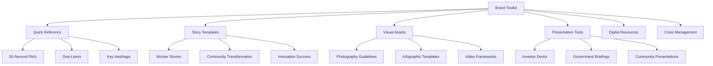
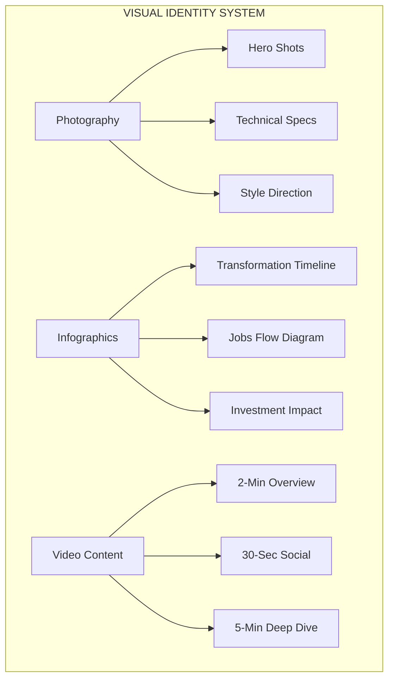

# Gippsland Brand Toolkit: Practical Resources and Templates



## Quick Reference Guide for All Stakeholders

### Elevator Pitch (30 seconds)
**"Gippsland is transforming from Australia's coal heartland to a global renewable energy leader. We're creating 15,000 clean energy jobs whilst ensuring no worker or community is left behind. The world is coming to Gippsland to learn how energy transition really works—with more jobs, stronger economies, and thriving communities."**

### Brand One-Liner
**"Where the world learns that clean energy creates prosperity for all."**

### Strategic Hashtag Framework
- **#GippslandTransforms** - Primary transformation narrative
- **#CleanEnergyClassroom** - Global learning positioning
- **#CoalToClean** - Heritage to future journey
- **#JustTransitionWorks** - Social equity messaging
- **#GippslandEnergy** - Sector identification

---

## Story Templates

### Template 1: Worker Transformation Story

**Structure:**
1. **Past Role**: [Name] worked [X years] in [coal industry role]
2. **Transition Moment**: When [specific event], they faced [challenge]
3. **Training Journey**: Through [program], learned [new skills]
4. **Current Success**: Now works as [renewable role] earning [% more]
5. **Future Vision**: "My kids can stay in Gippsland and have careers"

**Example:**
"Meet Sarah Chen, who spent 15 years maintaining coal plant turbines. When Hazelwood closed, she enrolled in the Offshore Wind Technician program. Today, she leads maintenance teams for Star of the South wind farm, earning 20% more than her coal job. 'Same problem-solving skills, better working conditions, and my daughter wants to follow in my footsteps.'"

### Template 2: Community Transformation Story

**Structure:**
1. **Before**: [Town] population was [declining/aging] due to [coal closure]
2. **Catalyst**: [Renewable project] announced, bringing [investment]
3. **Changes**: New [businesses/schools/facilities] opened
4. **Results**: Population grew [X%], [Y new families] moved in
5. **Quote**: Mayor/resident says "[hopeful future quote]"

**Example:**
"Morwell's main street was dying after the power station closed. Then the Green Hydrogen Hub was announced, bringing $2 billion investment. New cafes, a technical college, and innovation center opened. Population grew 8% in two years, with 150 young families moving in. 'Our kids are coming home,' says Mayor Sharon Gibson."

### Template 3: Innovation Success Story

**Structure:**
1. **Challenge**: [Technical/logistics problem] threatened [project]
2. **Solution**: Gippsland team developed [innovation]
3. **Testing**: Proved successful in [real conditions]
4. **Scale**: Now being used in [number] of projects
5. **Global Impact**: [Countries/companies] adopting solution

**Example:**
"Installing offshore wind turbines in Bass Strait's rough waters seemed impossible. Gippsland engineers developed a floating installation platform that works in 4-meter swells. After successful trials, it's now used in 8 projects across 3 countries, with licensing deals worth $50 million."

---

## Message Bank

### Economic Messages

**Investment Attraction**
- "Gippsland offers investors proven returns with purpose: $40B pipeline, skilled workforce, community support"
- "Where smart money meets smart community: Gippsland's renewable investments outperform market by 15%"
- "De-risked renewable investment: government backing, community approval, infrastructure ready"

**Job Creation**
- "2 renewable jobs for every coal job lost—and they pay 18% more on average"
- "15,000 direct clean energy jobs by 2030, plus 30,000 indirect opportunities"
- "From 8,200 coal jobs to 45,000 clean economy careers—Gippsland's workforce multiplier effect"

**Economic Growth**
- "Gippsland's economy grew 12% during energy transition, outpacing Victoria by 3x"
- "$70 billion in economic activity from renewable transition—more than coal ever generated"
- "Every $1 of public investment attracted $8 in private capital to Gippsland"

### Social Messages

**Community Wellbeing**
- "Air quality improved 40%, childhood asthma rates dropped 25% post-coal"
- "Youth retention up 35%—young Gippslanders staying for clean energy careers"
- "Mental health services report 30% drop in anxiety as communities see bright futures"

**Just Transition**
- "100% of coal workers offered retraining—95% now in higher-paying jobs"
- "No forced relocations, no ghost towns—every Gippsland community growing"
- "Union-negotiated transition ensures worker rights, pensions, and dignity"

**Education & Skills**
- "3 new technical colleges, 15 training programs, 5,000 graduates and counting"
- "Gippsland workers: from coal face expertise to global renewable leaders"
- "School STEM enrollment up 45% as kids see local clean tech careers"

### Environmental Messages

**Emissions Reduction**
- "45 million tonnes CO2 reduced annually—equivalent to taking 10 million cars off roads"
- "Gippsland powers 2 million homes with zero emissions energy"
- "From Australia's highest emitter to carbon negative by 2035"

**Environmental Restoration**
- "500 hectares of mine sites now thriving wetlands and native forests"
- "Latrobe Valley air quality best in 50 years"
- "Endangered species returning as habitats recover from mining"

**Sustainability Leadership**
- "First region globally to achieve coal-to-renewable transition at scale"
- "Circular economy principles: 90% of coal infrastructure repurposed"
- "Water usage down 60% compared to coal operations"

### Global Leadership Messages

**Knowledge Sharing**
- "50+ international delegations learning the Gippsland Model"
- "Sister city partnerships with 20 transitioning regions worldwide"
- "Gippsland playbook downloaded 100,000 times in 30 languages"

**Innovation Hub**
- "3 world-first renewable technologies commercialized in Gippsland"
- "Global companies establishing R&D centers to access Gippsland expertise"
- "$500M in technology exports from Gippsland innovations"

**Reputation Building**
- "Ranked #1 Just Transition region by World Bank"
- "UN showcase site for Sustainable Development Goals"
- "Harvard Business School case study on community-led transformation"

---

## Visual Asset Specifications Framework



### Photography Guidelines Matrix

| **Shot Category** | **Content Focus** | **Technical Specs** | **Brand Alignment** | **Usage Rights** |
|------------------|-------------------|--------------------|--------------------|------------------|
| **Hero Shots** | Sunrise/sunset over wind turbines with workers | 300+ DPI, 16:9 ratio, RAW archived | Transformation + human element | Global usage, model releases |
| **Community Stories** | Diverse teams collaborating, families thriving | High resolution, authentic moments | Inclusive prosperity narrative | Community consent required |
| **Before/After** | Landscape transformation comparisons | Consistent angles, GPS tagged | Heritage respect + progress | Historical context preserved |
| **Innovation Focus** | Technology development, R&D activities | Technical accuracy, clear branding | Innovation leadership positioning | Partner approval needed |
| **Celebration Moments** | Community events, achievement milestones | Candid authenticity, emotional connection | Shared success narrative | Event organiser clearance |

**Style Direction**
- Natural lighting preferred
- Authentic moments over posed
- Include diverse faces/ages
- Show scale and impact
- Capture emotion and hope

### Infographic Templates

**Transformation Timeline**
- Visual journey from 1920s coal to 2030s renewables
- Key milestones highlighted
- Job/investment numbers
- Use brand colors
- Mobile-optimized

**Jobs Transition Flow**
- Sankey diagram showing coal jobs → training → renewable careers
- Include salary comparisons
- Show career progression
- Highlight growth areas

**Investment Impact**
- Circular flow showing public seed → private investment → community benefits
- ROI metrics
- Multiplier effects
- Global comparisons

**Technology Innovation**
- Visual explaining Gippsland innovations
- Problem → Solution → Global adoption
- Technical specs simplified
- Benefits quantified

### Video Templates

**2-Minute Overview**
1. 0:00-0:15 - Hook: Aerial of transformation
2. 0:15-0:45 - Problem: Coal closure challenges
3. 0:45-1:15 - Solution: Community-led transition
4. 1:15-1:45 - Results: Jobs, growth, success
5. 1:45-2:00 - CTA: Learn/invest/visit

**30-Second Social**
1. 0:00-0:05 - Striking visual
2. 0:05-0:20 - Key message
3. 0:20-0:25 - Proof point
4. 0:25-0:30 - CTA

**5-Minute Deep Dive**
1. Personal story (90 sec)
2. Technical explanation (90 sec)
3. Community impact (90 sec)
4. Future vision (60 sec)
5. How to engage (30 sec)

---

## Presentation Templates

### Investor Pitch Deck Structure

**Slide 1: Title**
- Gippsland: Where Returns Meet Responsibility
- Hero image
- One-line value prop

**Slide 2: Opportunity**
- Market size/growth
- Gippsland advantages
- Investment pipeline

**Slide 3: Track Record**
- Completed projects
- ROI metrics
- Global recognition

**Slide 4: Ecosystem**
- Infrastructure map
- Supply chain
- Workforce availability

**Slide 5: De-risking**
- Government support
- Community backing
- Proven demand

**Slide 6: Pipeline**
- Specific opportunities
- Timeline
- Expected returns

**Slide 7: Partnership Models**
- Investment structures
- Support services
- Success stories

**Slide 8: Next Steps**
- Site visit invitation
- Contact information
- Immediate opportunities

### Government Briefing Structure

**Slide 1: Executive Summary**
- Gippsland Model overview
- Key outcomes
- Replication potential

**Slide 2: Policy Framework**
- Legislative enablers
- Regulatory innovations
- Government role

**Slide 3: Economic Impact**
- Jobs data
- Growth metrics
- Tax revenue

**Slide 4: Social Outcomes**
- Community benefits
- Just transition proof
- Equity measures

**Slide 5: Implementation Roadmap**
- Phase approach
- Resource requirements
- Timeline

**Slide 6: Lessons Learned**
- What worked
- Challenges overcome
- Critical success factors

**Slide 7: Replication Guide**
- Adaptation framework
- Support available
- Partnership opportunities

**Slide 8: Call to Action**
- Study tour invitation
- Toolkit access
- Partnership proposal

### Community Presentation Structure

**Slide 1: Your Gippsland Story**
- Local images
- Community voices
- Shared vision

**Slide 2: What's Happening**
- Current projects
- Job opportunities
- Investment coming

**Slide 3: Your Opportunities**
- Training programs
- Career paths
- Business prospects

**Slide 4: Community Benefits**
- Cleaner environment
- Better facilities
- Stronger economy

**Slide 5: Success Stories**
- Local champions
- Family stories
- Business wins

**Slide 6: Your Role**
- How to engage
- Opportunities to lead
- Ways to benefit

**Slide 7: Support Available**
- Resources
- Contacts
- Programs

**Slide 8: Q&A**
- Open discussion
- Feedback welcome
- Next meetings

---

## Digital Asset Library

### Social Media Graphics

**Quote Cards**
- Worker testimonials
- Impact statistics
- Vision statements
- Success metrics

**Before/After Series**
- Landscape transformation
- Economic indicators
- Community vitality
- Environmental health

**Countdown Graphics**
- Project milestones
- Event announcements
- Achievement unlocks
- Target progress

**Info Bites**
- Daily energy generation
- Jobs created this month
- Investment secured
- Visitors hosted

### Email Templates

**Newsletter Header**
```html
Subject: This Month in Gippsland's Transformation

Hi [Name],

From coal to clean energy leadership—here's how Gippsland
is building prosperity for all this month...
```

**Investor Update**
```html
Subject: Gippsland Q[X] Investment Opportunities

Dear [Investor Name],

New renewable projects in Gippsland are delivering 15%+ returns
while creating lasting community value. Here's what's available...
```

**Media Alert**
```html
Subject: MEDIA: Gippsland Achieves [Milestone]

FOR IMMEDIATE RELEASE

Gippsland becomes first region globally to [achievement],
proving just transition creates economic growth...
```

### Website Copy Templates

**Homepage Hero**
```
Headline: From Coal to Clean: The World's Energy Transformation Classroom
Subhead: Gippsland proves communities thrive when leading renewable transition
CTA: Explore Our Story | Investment Opportunities | Visit Gippsland
```

**About Page Opener**
```
For nearly a century, Gippsland powered Victoria with coal.
Today, we're powering the world's transition to clean energy—
creating more jobs, stronger communities, and global solutions.
This is how transformation works when no one is left behind.
```

**Investment Page Hook**
```
$40 billion in renewable projects. 15,000 new jobs.
Community support guaranteed. Government backing secured.
Gippsland offers investors proven returns with purpose.
Discover why global capital is flowing to regional Australia.
```

---

## Event Activation Templates

### Trade Show Booth Design

**Physical Elements**
- 3x3m minimum footprint
- Interactive wind turbine model
- Touch screen story kiosks
- VR station for offshore experience
- Meeting space for 6 people

**Engagement Activities**
- VR turbine climb challenge
- Energy generation simulator
- Career pathway quiz
- Community story recording
- Prize wheel with facts

**Giveaways**
- USB with transition playbook
- Branded renewable tech
- Local product samples
- Career guides
- Children's activity books

### Conference Speaking Kit

**Standard Introduction**
"From a region that powered Australia with coal for a century, I bring lessons from Gippsland's transformation to global renewable energy leadership—where we've created more jobs, stronger communities, and proved that no one needs to be left behind in the energy transition."

**Presentation Formats**
- 5-minute lightning talk
- 20-minute keynote
- 45-minute workshop
- Half-day masterclass
- Full-day intensive

**Speaker Support**
- Bio variations (50/100/200 words)
- High-res headshots
- Presentation templates
- Video intros
- Q&A briefing

---

## Crisis Communication Templates

### Prepared Statements

**Project Delay**
"While [project] faces temporary delays due to [reason], Gippsland's overall transformation continues on track with [X other projects] proceeding as planned. Our commitment to creating 15,000 clean energy jobs by 2030 remains unchanged."

**Environmental Concern**
"We take [concern] seriously and are working with [authorities] to ensure Gippsland's renewable projects meet the highest environmental standards. Our transition includes restoring habitats and improving biodiversity beyond coal's legacy."

**Economic Downturn**
"Economic challenges make Gippsland's transformation more important than ever. Our renewable projects provide recession-proof jobs and attract international investment when it's needed most. We're building an economy that thrives in any climate."

**Worker Dispute**
"Gippsland's just transition depends on fair treatment for all workers. We're committed to resolving [issue] through partnership with unions and ensuring every worker benefits from our clean energy future."

---

## Measurement Dashboard Template

### Weekly Metrics
- Media mentions
- Social engagement
- Website traffic
- Investment inquiries
- Event registrations

### Monthly Reports
- Delegation visits
- Jobs created
- Investment secured
- Community sentiment
- Partner growth

### Quarterly Reviews
- Brand awareness study
- Economic impact assessment
- Message effectiveness
- Competitor analysis
- Strategy refinement

### Annual Evaluation
- Global ranking progress
- Transformation milestones
- ROI analysis
- Community wellbeing index
- Legacy building

---

This toolkit provides practical resources for implementing Gippsland's brand narrative across all channels and audiences. Regular updates ensure messaging remains current and impactful as the transformation progresses.